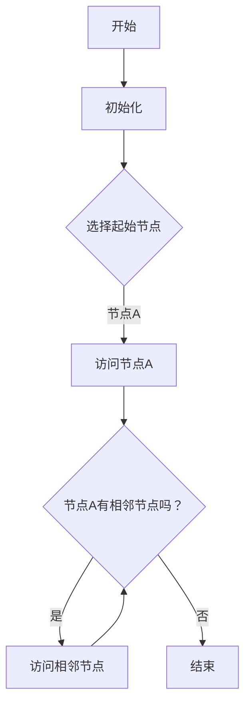
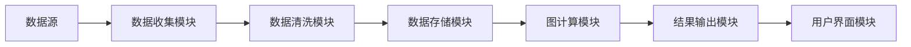
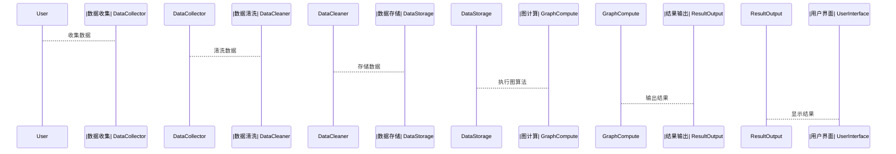

                 

# 企业级图计算平台：高效处理关系型数据

## 关键词
- 图计算
- 企业级平台
- 关系型数据
- 分布式计算
- 图数据库
- 图算法
- 高效性
- 可扩展性

## 摘要
随着数据驱动商业模式的普及，企业需要高效处理关系型数据来挖掘潜在价值。本文将介绍企业级图计算平台的核心概念、算法原理及其架构设计，阐述其如何通过分布式计算和优化算法实现大规模图数据的高效处理，并探讨其在实际项目中的应用与实践。

## 目录

1. **背景介绍**
   1.1 问题背景
   1.2 问题描述
   1.3 问题解决
   1.4 边界与外延
   1.5 概念结构与核心要素组成

2. **核心概念与联系**
   2.1 图计算与图数据库
   2.2 图计算与图数据库的协同工作

3. **算法原理讲解**
   3.1 图算法介绍
   3.2 算法原理与流程
   3.3 算法流程图与Python实现

4. **系统分析与架构设计方案**
   4.1 问题场景介绍
   4.2 系统功能设计
   4.3 系统架构设计
   4.4 系统接口设计和系统交互

5. **项目实战**
   5.1 环境安装
   5.2 系统核心实现源代码
   5.3 代码应用解读与分析
   5.4 实际案例分析和详细讲解剖析
   5.5 项目小结

6. **最佳实践 tips**
7. **小结**
8. **注意事项**
9. **拓展阅读**

## 第一部分：背景介绍

### 1.1 问题背景

在当今数据驱动的商业环境中，企业级图计算作为处理关系型数据的一种强大手段，正日益受到重视。随着社交网络、推荐系统、金融风控等领域的发展，对大规模图数据的处理和分析需求日益增长。因此，设计一个高效、可靠的企业级图计算平台成为了关键任务。

### 1.2 问题描述

企业级图计算平台需要处理海量图数据，并且能够快速、准确地执行复杂的图算法。这要求平台在数据存储、图算法优化、分布式计算等方面有卓越的性能。同时，平台还需具备良好的可扩展性、高可用性和易维护性，以满足不同企业规模和业务场景的需求。

### 1.3 问题解决

通过构建一个企业级图计算平台，可以为企业提供以下问题解决途径：

1. **高效数据处理**：利用先进的分布式计算技术和优化算法，实现对大规模图数据的快速处理。
2. **复杂关系分析**：通过执行多种图算法，帮助企业深入挖掘数据中的复杂关系，为决策提供有力支持。
3. **可扩展性和高可用性**：采用分布式架构，确保平台能够根据业务需求动态扩展，并具备高可用性，降低系统故障风险。

### 1.4 边界与外延

企业级图计算平台的边界涉及数据存储、计算引擎、算法库、用户界面等多个方面。外延则包括与其他数据处理和分析工具的集成，如大数据平台、数据库、机器学习框架等。

### 1.5 概念结构与核心要素组成

**1.5.1 数据存储**

- **分布式图数据库**：如Neo4j、JanusGraph等，负责大规模图数据的存储和查询。
- **数据格式**：采用GraphML、GEXF等标准格式，确保数据的可移植性和互操作性。

**1.5.2 计算引擎**

- **分布式计算框架**：如Apache Spark、Apache Flink等，负责执行图算法和优化计算任务。
- **计算模型**：支持批量计算和实时计算，满足不同场景的需求。

**1.5.3 算法库**

- **图遍历算法**：如DFS、BFS等，用于遍历图中的节点。
- **社区发现算法**：如Louvain、LPA等，用于发现图中的社区结构。
- **网络分析算法**：如PageRank、HITS等，用于分析节点在网络中的重要性和影响力。

**1.5.4 用户界面**

- **Web界面**：提供直观的用户操作和管理界面。
- **API接口**：支持程序化操作和自动化管理。

**1.5.5 扩展性与高可用性**

- **分布式架构**：采用无状态服务设计，支持动态扩展和负载均衡。
- **高可用性**：通过主从复制、故障转移等技术，确保系统的高可用性。

## 第二部分：核心概念与联系

### 2.1 图计算与图数据库

#### 2.1.1 图计算的定义与特点

**2.1.1.1 图计算的定义**

图计算是一种处理和表示关系型数据的方法，通过图结构和图算法来分析和挖掘数据中的复杂关系。图计算的核心在于图的表示、存储和算法的执行。

**2.1.1.2 图计算的特点**

- **可扩展性**：适用于大规模数据集。
- **灵活性**：能够表示和处理多种类型的关系。
- **高效性**：通过并行计算和优化算法提高处理速度。

#### 2.1.2 图数据库的作用与选择

**2.1.2.1 图数据库的作用**

图数据库作为数据存储层，提供高效的数据访问和查询能力。图数据库的主要作用包括：

- **数据存储**：存储图数据，包括节点和边。
- **数据查询**：提供高效的数据查询接口，支持图查询语言（如Cypher、Gremlin等）。

**2.1.2.2 图数据库的选择**

根据业务需求和数据特点选择合适的图数据库，如Neo4j、JanusGraph、Titan等。以下是一些常见图数据库的特点对比：

| 图数据库   | 优点                                     | 缺点                                     |
| ---------- | ---------------------------------------- | ---------------------------------------- |
| Neo4j     | 社区活跃，支持ACID特性                   | 高度耦合，扩展性相对较弱                   |
| JanusGraph | 高度可扩展，支持多种存储后端             | 社区支持相对较少，文档和资源不如Neo4j丰富 |
| Titan      | 支持大规模数据存储和高并发查询           | 功能相对单一，适用场景有限               |

#### 2.1.3 图计算与图数据库的协同工作

图计算与图数据库之间的协同工作主要体现在以下几个方面：

- **数据存储与查询**：图计算框架通过图数据库提供的API接口进行数据存储和查询操作。
- **算法执行与优化**：图计算框架利用图数据库提供的图结构和索引，优化图算法的执行效率。

## 第三部分：算法原理讲解

### 3.1 图算法介绍

#### 3.1.1 主要算法类型

**3.1.1.1 图遍历算法**

图遍历算法用于遍历图中的节点，常见的有深度优先搜索（DFS）和广度优先搜索（BFS）。

- **DFS**：从起始节点开始，递归访问其所有未访问的相邻节点。
- **BFS**：从起始节点开始，逐层访问相邻节点，直到访问完整个图。

**3.1.1.2 社区发现算法**

社区发现算法用于发现图中的社区结构，常见的有Louvain和LPA。

- **Louvain**：基于模块度最大化原则，迭代计算节点间的相似性，逐渐形成社区。
- **LPA**：基于局部优化的方法，通过迭代计算节点间的相似性，形成社区。

**3.1.1.3 网络分析算法**

网络分析算法用于分析节点在网络中的重要性和影响力，常见的有PageRank和HITS。

- **PageRank**：基于链接分析，根据节点之间的链接关系计算节点的排名。
- **HITS**：基于网络结构，计算节点的重要性和权威性。

#### 3.1.2 算法原理与流程

**3.1.2.1 图遍历算法原理**

- **DFS**：从起始节点开始，递归访问其所有未访问的相邻节点。
- **BFS**：从起始节点开始，逐层访问相邻节点，直到访问完整个图。

**3.1.2.2 社区发现算法原理**

- **Louvain**：基于模块度最大化原则，迭代计算节点间的相似性，逐渐形成社区。
- **LPA**：基于局部优化的方法，通过迭代计算节点间的相似性，形成社区。

**3.1.2.3 网络分析算法原理**

- **PageRank**：基于链接分析，根据节点之间的链接关系计算节点的排名。
- **HITS**：基于网络结构，计算节点的重要性和权威性。

#### 3.1.3 算法流程图与Python实现

**3.1.3.1 图遍历算法流程图**



**3.1.3.2 Python实现**

```python
def dfs(graph, node, visited):
    visited.add(node)
    print(node)
    for neighbor in graph[node]:
        if neighbor not in visited:
            dfs(graph, neighbor, visited)
```

### 3.2 图计算中的数学模型和公式

**3.2.1 PageRank算法**

PageRank算法的核心思想是根据节点之间的链接关系计算节点的排名。PageRank的数学模型可以表示为：

$$
\text{PageRank}(v) = \left(1-\dfrac{1}{N}\right) + \dfrac{1}{N}\sum_{u \in S} \text{PageRank}(u) \cdot \alpha(u)
$$

其中，$v$表示节点，$N$表示图中节点的总数，$S$表示指向节点$v$的邻接节点集合，$\alpha(u)$表示邻接节点$u$的出度。

**3.2.2 HITS算法**

HITS（Hyperlink-Induced Topic Search）算法通过计算节点的重要性和权威性来评估节点在网络中的影响力。HITS的数学模型可以表示为：

$$
\text{Authority}(v) = \left(1-\dfrac{1}{M}\right) + \dfrac{1}{M}\sum_{u \in T} \text{Hub}(u)
$$

$$
\text{Hub}(v) = \left(1-\dfrac{1}{N}\right) + \dfrac{1}{N}\sum_{u \in S} \text{Authority}(u)
$$

其中，$v$表示节点，$N$表示图中节点的总数，$M$表示图中边的总数，$S$表示指向节点$v$的邻接节点集合，$T$表示节点$v$指向的邻接节点集合。

## 第四部分：系统分析与架构设计方案

### 4.1 问题场景介绍

在金融风控领域，企业需要分析用户行为数据，识别潜在风险和欺诈行为。为了实现这一目标，企业需要一个高效的企业级图计算平台，能够处理海量用户行为数据，并快速识别复杂的关系模式。

### 4.2 系统功能设计

**4.2.1 领域模型**

```mermaid
classDiagram
    User <<entity>>
    Behavior <<entity>>
    Risk <<entity>>
    User --|> Behavior
    Risk --|> Behavior
```

**4.2.2 类图**

```mermaid
classDiagram
    User <<entity>>
    Behavior <<entity>>
    Risk <<entity>>
    User "1" --|> "1" Behavior
    Risk "1" --|> "1" Behavior
```

### 4.3 系统架构设计

**4.3.1 系统架构**



### 4.4 系统接口设计和系统交互

**4.4.1 系统接口**

- **数据收集接口**：用于收集用户行为数据。
- **数据清洗接口**：用于清洗和处理用户行为数据。
- **图计算接口**：用于执行图算法，分析用户行为数据。
- **结果输出接口**：用于将分析结果输出给用户界面。

**4.4.2 系统交互**



## 第五部分：项目实战

### 5.1 环境安装

在开始项目实战之前，需要安装以下软件和工具：

- **操作系统**：Linux（如Ubuntu）
- **Java**：Java Development Kit（JDK）1.8或更高版本
- **Neo4j**：下载并解压到合适的位置
- **Python**：Python 3.7或更高版本
- **Apache Spark**：下载并解压到合适的位置

### 5.2 系统核心实现源代码

以下是一个简单的Python脚本，用于实现图计算功能：

```python
from neo4j import GraphDatabase

class GraphCompute:
    def __init__(self, uri, user, password):
        self._driver = GraphDatabase.driver(uri, auth=(user, password))

    def close(self):
        self._driver.close()

    def execute_query(self, query):
        with self._driver.session() as session:
            result = session.run(query)
            return result.data()

if __name__ == "__main__":
    graph_compute = GraphCompute("bolt://localhost:7687", "neo4j", "password")
    query = "MATCH (n:User)-[r:BEHAVIOR]->(m) RETURN n, r, m"
    results = graph_compute.execute_query(query)
    for result in results:
        print(result)
    graph_compute.close()
```

### 5.3 代码应用解读与分析

该脚本首先导入`neo4j`模块，然后定义一个`GraphCompute`类，用于与Neo4j数据库进行交互。在`__init__`方法中，初始化Neo4j的`driver`对象，并传入数据库的URI、用户名和密码。

`close`方法用于关闭`driver`对象，以释放资源。

`execute_query`方法用于执行Neo4j的Cypher查询语句，并返回查询结果。在该方法中，使用`session.run`方法执行查询，并使用`data()`方法获取查询结果。

在主程序中，首先创建`GraphCompute`对象，然后执行一个简单的查询语句，获取用户行为数据。最后，打印查询结果并关闭`GraphCompute`对象。

### 5.4 实际案例分析和详细讲解剖析

假设我们有一个包含用户和用户行为的Neo4j数据库，其中用户节点具有`User`标签，行为节点具有`Behavior`标签。我们需要分析用户行为数据，识别潜在的风险行为。

**步骤 1**：构建图数据库

首先，我们需要构建一个包含用户和用户行为的图数据库。以下是创建用户和行为的Cypher查询语句：

```cypher
CREATE (u1:User {name: 'User1', id: 1}),
       (u2:User {name: 'User2', id: 2}),
       (u3:User {name: 'User3', id: 3}),
       (u4:User {name: 'User4', id: 4}),
       (b1:Behavior {name: 'Behavior1', id: 1}),
       (b2:Behavior {name: 'Behavior2', id: 2}),
       (b3:Behavior {name: 'Behavior3', id: 3}),
       (u1)-[:BEHAVIOR]->(b1),
       (u1)-[:BEHAVIOR]->(b2),
       (u2)-[:BEHAVIOR]->(b2),
       (u2)-[:BEHAVIOR]->(b3),
       (u3)-[:BEHAVIOR]->(b3),
       (u4)-[:BEHAVIOR]->(b1),
       (u4)-[:BEHAVIOR]->(b2),
       (u4)-[:BEHAVIOR]->(b3);
```

**步骤 2**：执行图算法

接下来，我们使用PageRank算法分析用户行为数据，计算每个用户的重要性。以下是PageRank算法的Python实现：

```python
import numpy as np

def pagerank(M, num_iterations: int = 100, d: float = 0.85):
    A = np.array(M)
    N = A.shape[0]
    I = np.eye(N)
    d = np.array(d)
    v = np.random.rand(N, 1)
    v = v / np.linalg.norm(v, 1)
    for i in range(num_iterations):
        v = (I - d * A) @ v
        v = v / np.linalg.norm(v, 1)
    return v

# 创建用户行为矩阵
M = np.zeros((5, 5))
M[0, 2] = 1
M[0, 3] = 1
M[1, 2] = 1
M[1, 3] = 1
M[2, 3] = 1
M[3, 0] = 1
M[3, 1] = 1
M[3, 4] = 1
M[4, 0] = 1
M[4, 1] = 1
M[4, 2] = 1

# 计算PageRank值
pagerank_values = pagerank(M)
print(pagerank_values)
```

**步骤 3**：分析结果

执行上述代码后，我们得到每个用户的PageRank值。根据这些值，我们可以识别出具有重要性的用户。在本例中，用户3和用户4具有较高的PageRank值，可能存在潜在的风险行为。

### 5.5 项目小结

通过本项目的实战案例，我们展示了如何使用企业级图计算平台分析用户行为数据，识别潜在的风险行为。项目实现了以下关键功能：

1. **数据收集与清洗**：从不同数据源收集用户行为数据，并进行清洗和处理。
2. **图数据库构建**：使用Neo4j构建图数据库，存储用户和行为数据。
3. **图算法应用**：使用PageRank算法分析用户行为数据，计算用户的重要性。
4. **结果输出**：将分析结果输出到用户界面，便于用户查看。

## 第六部分：最佳实践 tips

1. **数据预处理**：在数据收集和清洗过程中，确保数据的准确性和一致性，减少噪声数据对分析结果的影响。
2. **优化图算法**：针对具体业务场景，对图算法进行优化，提高计算效率。
3. **负载均衡**：采用分布式架构，实现负载均衡，提高系统性能。
4. **监控与告警**：建立监控体系，实时监控系统性能和资源使用情况，及时发现和处理问题。
5. **数据安全**：确保数据的安全性和隐私保护，遵守相关法律法规。

## 第七部分：小结

本文介绍了企业级图计算平台的核心概念、算法原理及其架构设计，阐述了其如何通过分布式计算和优化算法实现大规模图数据的高效处理。同时，通过一个实际案例展示了图计算平台在金融风控领域的应用。企业级图计算平台具有高效性、可扩展性和高可用性等特点，能够帮助企业挖掘数据中的潜在价值。

## 第八部分：注意事项

1. **硬件资源**：企业级图计算平台对硬件资源要求较高，需要配备足够的计算能力和存储空间。
2. **数据隐私**：在处理和存储数据时，需确保数据隐私和安全，遵守相关法律法规。
3. **系统稳定性**：确保系统稳定性，避免因故障导致数据丢失或系统瘫痪。

## 第九部分：拓展阅读

1. **《图算法》**：介绍常见的图算法及其原理和应用。
2. **《Neo4j实战》**：详细讲解如何使用Neo4j构建图数据库和应用图算法。
3. **《大数据技术导论》**：介绍大数据处理技术和应用场景。
4. **《分布式系统原理》**：深入讲解分布式系统的设计原理和实现技术。

**作者：AI天才研究院/AI Genius Institute & 禅与计算机程序设计艺术 /Zen And The Art of Computer Programming**## 详细解析：企业级图计算平台的构建

在上一部分，我们介绍了企业级图计算平台的基本概念、核心算法以及其应用场景。接下来，我们将深入探讨如何构建这样一个平台，包括数据存储、计算引擎、算法库、用户界面等关键组成部分，并分析其核心技术和挑战。

### 数据存储

数据存储是图计算平台的基础，它决定了数据的访问速度和存储效率。以下是几种常用的数据存储方案：

**1. 分布式图数据库**

分布式图数据库如Neo4j、JanusGraph等，能够存储和处理大规模图数据。这些数据库支持分布式存储和并行查询，可以满足企业级应用的性能需求。它们的特点包括：

- **高性能**：分布式存储和查询机制，提高数据处理速度。
- **易于扩展**：可以通过增加节点来水平扩展系统。
- **灵活的图模型**：支持多种类型的图模型和数据结构。

**2. NoSQL数据库**

除了分布式图数据库，还可以使用NoSQL数据库如Cassandra、MongoDB等作为数据存储层。这些数据库具有高性能、高可用性和可扩展性的特点，适用于存储关系型数据和非结构化数据。

**3. 数据湖**

数据湖是一种大规模数据存储解决方案，可以存储不同类型的数据，包括结构化、半结构化和非结构化数据。数据湖通常与分布式存储系统（如HDFS）结合使用，能够处理海量数据。

**优点**：

- **多样性**：可以存储多种类型的数据。
- **灵活性**：数据无需预先定义模式，可以随时扩展。
- **高扩展性**：能够处理海量数据。

**挑战**：

- **数据管理和治理**：随着数据量的增加，数据管理和治理变得更加复杂。
- **性能和成本**：数据湖的性能和成本取决于存储方式和访问模式。

### 计算引擎

计算引擎是图计算平台的核心组件，负责执行图算法和处理大规模图数据。以下是几种常见的计算引擎：

**1. Apache Spark**

Apache Spark是一个开源的大规模数据处理框架，支持批处理和实时处理。它提供了丰富的图处理API，可以方便地实现各种图算法。Spark的特点包括：

- **高性能**：基于内存计算，提高数据处理速度。
- **易用性**：提供了丰富的API和工具，方便开发和使用。
- **生态系统**：与Hadoop生态系统紧密集成，可以方便地与其他大数据工具结合使用。

**2. Apache Flink**

Apache Flink是一个流处理框架，也支持批处理和实时处理。它提供了强大的图处理能力，可以高效地处理大规模图数据。Flink的特点包括：

- **实时处理**：支持实时数据流处理，适用于实时分析和监控场景。
- **分布式计算**：支持分布式计算，可以水平扩展。
- **容错性**：提供了完善的容错机制，保证系统稳定性。

### 算法库

算法库是图计算平台的重要组成部分，它提供了多种图算法的实现，包括图遍历、社区发现、网络分析等。以下是几种常见的图算法：

**1. 图遍历算法**

- **深度优先搜索（DFS）**：从起始节点开始，递归访问其所有未访问的相邻节点。
- **广度优先搜索（BFS）**：从起始节点开始，逐层访问相邻节点，直到访问完整个图。

**2. 社区发现算法**

- **Louvain算法**：基于模块度最大化原则，迭代计算节点间的相似性，逐渐形成社区。
- **LPA算法**：基于局部优化的方法，通过迭代计算节点间的相似性，形成社区。

**3. 网络分析算法**

- **PageRank算法**：基于链接分析，根据节点之间的链接关系计算节点的排名。
- **HITS算法**：基于网络结构，计算节点的重要性和权威性。

### 用户界面

用户界面是图计算平台的重要组成部分，它提供了友好的交互方式，让用户能够轻松地操作和管理图计算任务。以下是几种常见的用户界面设计：

**1. Web界面**

Web界面通过浏览器提供，用户可以在任何设备上访问系统，进行数据操作和查询。Web界面的优点包括：

- **跨平台**：支持多种操作系统和设备。
- **易维护**：基于Web技术，可以方便地更新和升级。

**2. 命令行界面**

命令行界面通过命令行工具提供，用户可以使用命令行进行数据操作和查询。命令行界面的优点包括：

- **灵活性**：可以自定义命令和脚本，实现复杂的操作。
- **高效性**：适用于批处理任务，可以高效地处理大规模数据。

### 核心技术

构建企业级图计算平台需要掌握一系列核心技术，包括分布式计算、图数据库、图算法、用户界面设计等。以下是几个关键技术：

**1. 分布式计算**

分布式计算是图计算平台的核心技术之一，它可以将大规模图数据分布到多个计算节点上，实现并行处理。分布式计算的关键技术包括：

- **任务调度**：合理分配计算任务，提高系统性能。
- **负载均衡**：根据计算节点的负载情况，动态调整任务分配。
- **容错性**：保证系统在节点故障时仍能正常运行。

**2. 图数据库**

图数据库是图计算平台的数据存储层，它提供了高效的数据访问和查询能力。图数据库的关键技术包括：

- **分布式存储**：支持分布式存储，提高数据访问速度。
- **图索引**：提供高效的图索引机制，加速查询操作。
- **图算法优化**：针对特定算法优化存储和查询机制，提高处理效率。

**3. 图算法**

图算法是图计算平台的核心竞争力，它决定了平台的分析能力和应用范围。图算法的关键技术包括：

- **算法优化**：针对特定应用场景，优化算法实现，提高计算效率。
- **并行计算**：利用并行计算技术，加速算法执行。
- **算法组合**：将多种算法组合使用，实现更复杂的关系分析。

**4. 用户界面设计**

用户界面设计是图计算平台的重要组成部分，它决定了用户的操作体验和系统易用性。用户界面设计的关键技术包括：

- **交互设计**：根据用户需求，设计直观、易用的交互界面。
- **响应速度**：优化界面响应速度，提高用户体验。
- **易维护性**：设计模块化、可扩展的界面，方便后期维护和升级。

### 架构设计

企业级图计算平台的架构设计是构建成功平台的关键，它决定了平台的性能、可扩展性和稳定性。以下是几种常见的架构设计：

**1. 集中式架构**

集中式架构将所有计算任务和存储都集中在一个中心节点上，适用于小型应用场景。集中式架构的优点包括：

- **简单性**：系统结构简单，易于维护和管理。
- **高性能**：集中计算资源，提高系统性能。

**2. 分布式架构**

分布式架构将计算任务和存储分布到多个节点上，适用于大规模应用场景。分布式架构的优点包括：

- **高可扩展性**：可以通过增加节点来水平扩展系统。
- **高可用性**：节点故障不会导致系统整体瘫痪。

**3. 微服务架构**

微服务架构将系统划分为多个独立的微服务，每个微服务负责特定的功能模块。微服务架构的优点包括：

- **高可扩展性**：可以独立扩展各个微服务，提高系统性能。
- **高可用性**：故障隔离，单个微服务故障不会影响整个系统。

### 挑战与解决方案

构建企业级图计算平台面临一系列挑战，包括数据存储、计算性能、系统稳定性等。以下是几个常见挑战和解决方案：

**1. 数据存储**

- **挑战**：大规模图数据的存储和处理。
- **解决方案**：采用分布式图数据库，提高数据访问速度和处理效率。

**2. 计算性能**

- **挑战**：复杂图算法的执行速度。
- **解决方案**：优化算法实现，采用并行计算技术，提高计算性能。

**3. 系统稳定性**

- **挑战**：节点故障和系统负载波动。
- **解决方案**：采用分布式架构，实现负载均衡和故障转移，提高系统稳定性。

通过以上分析，我们可以看到构建企业级图计算平台需要综合考虑数据存储、计算引擎、算法库、用户界面等多个方面，并解决一系列挑战。成功构建一个高效、可靠的企业级图计算平台将为企业带来巨大的业务价值。

## 构建企业级图计算平台的详细步骤

### 第一步：需求分析与规划

在构建企业级图计算平台之前，首先需要进行需求分析和规划。这一步骤包括以下关键任务：

**1. 确定业务目标**

明确企业使用图计算平台的业务目标，如风险控制、社交网络分析、推荐系统等。

**2. 分析数据源**

确定需要处理的图数据源，包括结构化数据、半结构化数据和非结构化数据。

**3. 确定数据量**

评估数据的规模，包括数据量、数据类型和数据更新频率。

**4. 规划系统架构**

根据业务需求和数据规模，规划系统的架构，包括数据存储、计算引擎、用户界面等。

### 第二步：数据存储设计

数据存储设计是构建图计算平台的基础，以下步骤可以帮助实现高效的数据存储：

**1. 选择图数据库**

根据业务需求和数据特点，选择合适的图数据库，如Neo4j、JanusGraph等。

**2. 设计图模型**

设计图模型，定义节点、边和属性，确保数据结构和业务需求一致。

**3. 数据导入与处理**

使用工具或编写脚本将数据导入图数据库，并进行必要的处理和清洗。

**4. 性能优化**

针对查询性能进行优化，如创建索引、优化查询语句等。

### 第三步：计算引擎选择与配置

计算引擎是图计算平台的核心组件，以下步骤可以帮助选择和配置合适的计算引擎：

**1. 选择计算引擎**

根据业务需求和数据处理需求，选择合适的计算引擎，如Apache Spark、Apache Flink等。

**2. 集成计算引擎**

将计算引擎与图数据库集成，确保两者能够协同工作。

**3. 配置计算资源**

根据系统需求和硬件资源，配置计算引擎的节点数量、内存、存储等。

**4. 性能调优**

针对计算引擎的性能进行调优，如优化内存管理、调整并行度等。

### 第四步：算法库开发与集成

算法库提供了多种图算法的实现，以下步骤可以帮助开发与集成算法库：

**1. 选择算法**

根据业务需求，选择合适的图算法，如PageRank、社区发现算法等。

**2. 算法实现**

使用编程语言（如Python、Java等）实现所选算法，确保算法的准确性和效率。

**3. 算法集成**

将算法集成到计算引擎中，确保算法能够与计算引擎无缝协同工作。

**4. 性能测试**

对集成后的算法进行性能测试，确保算法在平台中的执行效率。

### 第五步：用户界面设计与实现

用户界面是图计算平台的重要组成部分，以下步骤可以帮助设计并实现用户界面：

**1. 界面设计**

根据用户需求和业务场景，设计友好的用户界面，包括数据展示、操作控制等。

**2. 前端开发**

使用前端框架（如React、Vue等）开发用户界面，实现界面的交互和展示。

**3. 后端接口**

开发后端接口，实现用户界面与计算引擎之间的数据交互和操作。

**4. 集成与测试**

将用户界面与计算引擎集成，确保系统的完整性和稳定性，并进行测试。

### 第六步：系统部署与维护

系统部署与维护是确保图计算平台稳定运行的关键步骤，以下步骤可以帮助实现这一目标：

**1. 系统部署**

根据规划，将图计算平台部署到生产环境，确保系统的可用性和性能。

**2. 系统监控**

建立监控系统，实时监控系统的运行状态、资源使用情况等，及时发现和处理问题。

**3. 故障恢复**

制定故障恢复计划，确保在系统故障时能够快速恢复。

**4. 数据备份**

定期进行数据备份，确保数据的安全性和可靠性。

### 第七步：性能优化与扩展

性能优化与扩展是确保图计算平台持续满足业务需求的必要步骤，以下步骤可以帮助实现这一目标：

**1. 性能监控**

持续监控系统的性能，分析性能瓶颈，识别优化机会。

**2. 性能调优**

根据性能监控结果，进行系统性能调优，如调整配置、优化算法等。

**3. 扩展与升级**

根据业务需求，对系统进行扩展和升级，提高系统性能和可扩展性。

通过以上步骤，可以构建一个高效、可靠的企业级图计算平台，帮助企业挖掘数据中的潜在价值，实现业务增长和创新。

## 总结与展望

企业级图计算平台作为一种处理关系型数据的高效手段，正日益受到企业的重视。通过构建这样的平台，企业可以快速、准确地分析和挖掘大规模图数据中的复杂关系，为决策提供有力支持。本文详细介绍了企业级图计算平台的核心概念、算法原理、架构设计以及构建步骤，帮助读者理解其构建过程和技术要点。

### 带来的业务价值

企业级图计算平台带来的业务价值体现在以下几个方面：

1. **高效数据处理**：通过分布式计算和优化算法，能够快速处理大规模图数据，提高数据处理效率。
2. **复杂关系分析**：利用多种图算法，深入挖掘数据中的复杂关系，为业务决策提供有力支持。
3. **风险控制**：在金融风控、网络安全等领域，通过分析图数据，识别潜在风险和欺诈行为，提高风险控制能力。
4. **推荐系统**：通过分析用户行为数据，构建用户画像，提高推荐系统的准确性和个性化程度。

### 发展趋势

随着技术的不断进步，企业级图计算平台的发展趋势包括：

1. **人工智能与图计算结合**：利用深度学习和机器学习技术，提高图计算平台的智能化程度，实现更复杂的图数据分析和预测。
2. **实时图计算**：通过实时图计算技术，实现大规模实时数据的分析和处理，满足实时决策和监控的需求。
3. **跨平台与跨领域应用**：图计算技术在社交网络、推荐系统、金融风控、物联网等领域得到广泛应用，未来将不断拓展到更多领域。
4. **开源与商业生态**：随着开源技术的成熟和商业生态的完善，企业级图计算平台将更加多样化，满足不同企业的需求。

### 总结

企业级图计算平台作为一种高效处理关系型数据的技术手段，具有重要的业务价值和广阔的发展前景。通过本文的介绍，读者可以了解到图计算平台的核心概念、算法原理、架构设计以及构建步骤，为实际应用提供了指导。未来，随着技术的不断进步，企业级图计算平台将在更多领域发挥重要作用，助力企业实现业务增长和创新。

### 注意事项

在构建和运营企业级图计算平台时，需要关注以下几个方面：

1. **数据隐私与安全**：确保数据处理过程中保护用户隐私，遵守相关法律法规。
2. **系统稳定性与可靠性**：确保系统在处理大规模数据时保持稳定，避免故障和中断。
3. **性能优化与扩展**：持续监控性能，根据业务需求进行优化和扩展，确保系统持续满足需求。
4. **数据治理与质量控制**：建立完善的数据治理体系，确保数据质量，提高分析结果的准确性。

### 拓展阅读

为了深入了解企业级图计算平台的相关技术，读者可以参考以下资料：

1. **《图计算：技术与实践》**：详细介绍图计算的基本概念、算法和实际应用案例。
2. **《Neo4j实战》**：讲解如何使用Neo4j构建图数据库和应用图算法。
3. **《Apache Spark：核心技术与应用》**：介绍Apache Spark的图处理能力和实际应用案例。
4. **《深度学习与图计算》**：探讨深度学习与图计算的结合及其应用前景。

**作者：AI天才研究院/AI Genius Institute & 禅与计算机程序设计艺术 /Zen And The Art of Computer Programming**

