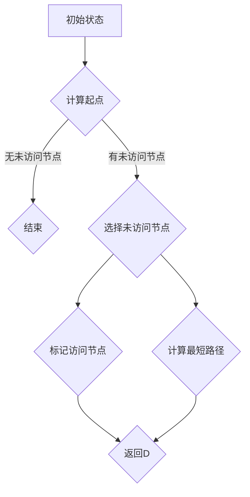
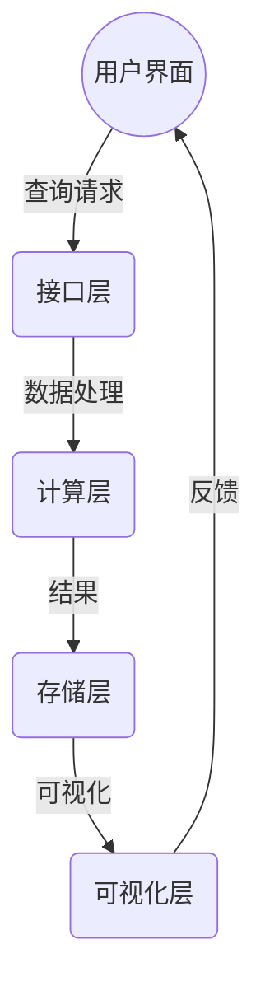
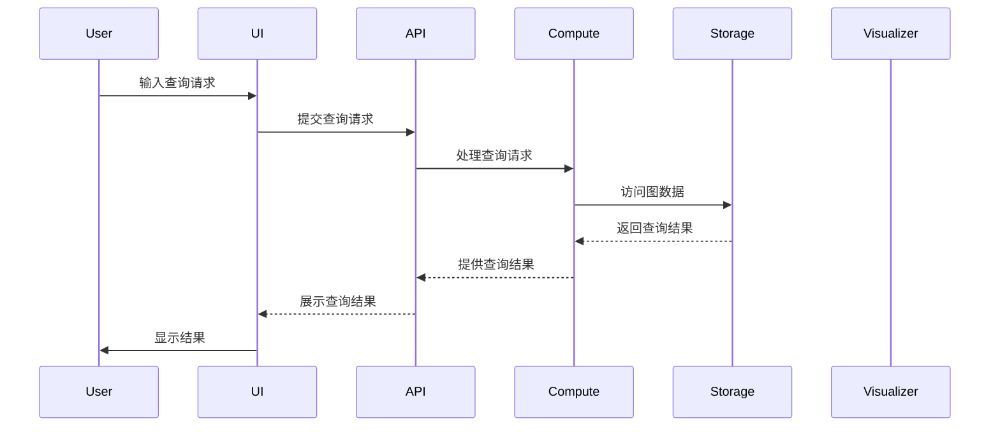

                 


### 第1章 背景介绍

#### 1.1 问题背景

随着大数据时代的到来，企业的数据规模呈现爆炸性增长。在这个背景下，关系数据的处理成为了一个亟待解决的问题。关系数据是描述实体之间相互关系的数据，其特点在于数据量大、关系复杂。传统的数据库处理方法在面对大规模的关系数据时，往往无法满足高效的查询性能需求。

##### 1.1.1 数据量的爆炸性增长

首先，我们来看数据量的爆炸性增长。在过去的几年里，数据量以惊人的速度增长。根据IDC的报告，全球数据总量每年以40%的速度增长。这种增长速度不仅使得传统的关系型数据库难以应对，同时也带来了数据存储和管理的挑战。

##### 1.1.2 数据类型的多样性

其次，数据类型的多样性也是一个重要的问题。在传统的数据库系统中，数据类型通常是预定义的，而现代数据环境中，数据类型往往是多样化的，包括结构化数据、半结构化数据和非结构化数据。这种多样性使得传统的数据处理方法难以适应。

##### 1.1.3 数据处理需求的提升

最后，随着企业对数据价值的重视，对数据处理需求的提升也变得越来越明显。企业不仅需要快速准确地查询关系数据，还需要对数据进行深度分析和挖掘，以支持业务决策。

#### 1.2 问题描述

在上述背景下，关系数据的处理需求变得尤为突出。具体来说，关系数据的处理需求包括以下几个方面：

##### 1.2.1 高效的查询性能

首先，高效的查询性能是关系数据处理的基石。企业需要能够快速地查询到所需的数据，以便支持业务决策。然而，随着数据规模的扩大，传统的数据库查询性能往往无法满足需求。

##### 1.2.1.1 强大的数据存储能力

其次，强大的数据存储能力也是关系数据处理的关键。关系数据往往具有大量的记录和复杂的关系，因此需要一种能够高效存储和管理的系统。

##### 1.2.1.2 灵活的图计算模型

此外，灵活的图计算模型也是关系数据处理的重要组成部分。图计算引擎能够对关系数据执行复杂的计算和分析，从而挖掘出更深层次的数据价值。

#### 1.3 问题解决

为了解决上述问题，企业级图计算引擎应运而生。企业级图计算引擎是一种专门为处理大规模关系数据而设计的系统。它具有以下几个重要特点：

##### 1.3.1 提升数据处理效率

首先，企业级图计算引擎能够显著提升数据处理效率。通过分布式计算和并行处理，图计算引擎能够快速地处理大规模的关系数据。

##### 1.3.1.1 降低开发成本

其次，企业级图计算引擎能够降低开发成本。相比于传统的数据库系统，图计算引擎提供了更简单、更直观的开发接口，使得开发人员能够更快地上手。

##### 1.3.1.2 提高数据价值

最后，企业级图计算引擎能够提高数据价值。通过对关系数据执行深度分析和挖掘，图计算引擎能够帮助企业发现新的业务机会，从而提高数据的价值。

#### 1.4 边界与外延

##### 1.4.1 关系数据的边界定义

在讨论企业级图计算引擎之前，我们首先需要明确关系数据的边界。关系数据通常包括实体和关系两种元素。实体是关系数据的主体，而关系则是实体之间的关联。在定义关系数据时，我们需要关注以下几个方面：

- **实体与关系的定义**：明确实体和关系的定义，有助于我们更好地理解和处理关系数据。
- **数据完整性约束**：关系数据往往具有一定的完整性约束，例如实体之间存在一定的关联规则。这些约束有助于保证数据的正确性和一致性。

##### 1.4.1.1 实体与关系的定义

实体是关系数据的基本单位，它可以是任何有意义的对象，如用户、产品、订单等。关系则描述了实体之间的相互关联，如用户购买了产品、产品属于某个类别等。

##### 1.4.1.2 数据完整性约束

数据完整性约束是指数据应遵循的一组规则，以确保数据的正确性和一致性。在关系数据中，常见的完整性约束包括实体完整性、参照完整性和用户定义完整性。

##### 1.4.2 企业级图计算引擎的外延

企业级图计算引擎不仅能够处理简单的实体关系，还能够扩展到更复杂的图计算任务。以下是企业级图计算引擎的一些外延：

- **功能模块的扩展**：企业级图计算引擎可以通过添加不同的功能模块，支持更丰富的图计算任务。
- **适应不同规模的数据集**：企业级图计算引擎能够适应不同规模的数据集，从小型数据集到大规模数据集都能高效处理。

#### 1.5 概念结构与核心要素组成

企业级图计算引擎是一个复杂的系统，它由多个核心概念和要素组成。以下是企业级图计算引擎的核心概念和要素：

##### 1.5.1 企业级图计算引擎的核心概念

- **图论基本概念**：包括图的定义、图的表示方法、图的基本属性等。
- **图计算算法**：包括度量计算、最短路径算法、社区发现算法等。
- **分布式系统架构**：企业级图计算引擎通常采用分布式系统架构，以支持大规模数据的高效处理。

##### 1.5.1.1 图论基本概念

图论是研究图的性质和关系的数学分支。在图计算中，图是一个由节点（表示实体）和边（表示关系）组成的数据结构。以下是图论的一些基本概念：

- **图的定义**：一个图是由一组节点和连接这些节点的边组成的。
- **图的表示方法**：图的表示方法包括邻接矩阵、邻接表、边列表等。
- **图的基本属性**：包括度数、路径长度、连通性等。

##### 1.5.1.2 图计算算法

图计算算法是用于分析图结构和关系的算法。以下是几种常见的图计算算法：

- **度量计算**：计算节点或边的度数、权重等属性。
- **最短路径算法**：找出图中两点之间的最短路径。
- **社区发现算法**：识别图中具有紧密连接的社区。

##### 1.5.1.3 分布式系统架构

分布式系统架构是企业级图计算引擎的关键组成部分。以下是分布式系统架构的一些关键要素：

- **节点**：分布式系统中的计算单元，负责处理图数据的一部分。
- **通信协议**：节点之间进行数据交换的协议。
- **数据分布**：将图数据分布到不同的节点上，以便并行处理。

##### 1.5.2 企业级图计算引擎的核心要素

- **数据存储技术**：用于存储和管理图数据的存储技术，如关系数据库、图数据库等。
- **并行计算模型**：用于在分布式系统中并行处理图数据的技术，如MapReduce、MPI等。
- **系统优化与性能调优**：用于提升系统性能的优化技术和策略。

### 总结

本章对企业级图计算引擎的背景、问题、解决方案以及边界与外延进行了详细介绍。企业级图计算引擎是应对大规模关系数据处理的重要工具，它能够提升数据处理效率、降低开发成本、提高数据价值。在接下来的章节中，我们将深入探讨企业级图计算引擎的核心概念与联系，以及具体的图计算算法和系统架构设计。通过一步步的分析推理，我们将更好地理解企业级图计算引擎的工作原理和实际应用。

---

### 第2章 核心概念与联系

#### 2.1 图论基本概念

图论是研究图的结构和性质的一个数学分支。在企业级图计算引擎中，图论的基本概念是理解和设计图计算算法的基础。

##### 2.1.1 图的定义

图是由一组节点（也称为顶点）和连接这些节点的边组成的集合。一个图可以用G表示，它包含两个部分：V（节点集合）和E（边集合）。节点表示数据中的实体，边表示实体之间的关系。

##### 2.1.1.1 图的表示方法

图有多种表示方法，包括：

- **邻接矩阵**：一个二维数组，其中元素a_ij表示节点i和节点j之间的边是否存在。
- **邻接表**：一个列表，每个节点对应一个列表，列表中的元素表示与该节点相连的其他节点。
- **边列表**：一个列表，每个元素表示一条边，边由两个节点的标识组成。

##### 2.1.1.2 图的基本属性

图的基本属性包括：

- **度数**：节点i的度数是连接到节点i的边的数量，记作d(i)。
- **路径长度**：两个节点之间的最短路径长度。
- **连通性**：图中任意两个节点是否可以通过一系列的边相连。

##### 2.1.2 图计算算法

图计算算法是用于分析图结构和关系的算法。以下是一些常见的图计算算法：

- **度量计算**：计算节点或边的度数、权重等属性。
- **最短路径算法**：找出图中两点之间的最短路径。
- **社区发现算法**：识别图中具有紧密连接的社区。

##### 2.1.2.1 度量计算

度量计算是图计算中的一种基本操作，用于计算节点或边的各种度量。例如：

- **度数分布**：计算图中节点的度数分布，了解节点连接程度的分布情况。
- **中心性度量**：计算节点的中心性，如度数中心性、接近中心性和中间中心性，衡量节点在图中的重要程度。

##### 2.1.2.2 最短路径算法

最短路径算法用于找出图中两点之间的最短路径。常见的算法有：

- **Dijkstra算法**：基于贪心策略，从源点开始逐步扩展到目标点。
- **Bellman-Ford算法**：适用于存在负权边的图，通过迭代更新最短路径估计。

##### 2.1.2.3 社区发现算法

社区发现算法用于识别图中具有紧密连接的社区。以下是一些常见的算法：

- **Girvan-Newman算法**：通过逐步删除最大连接边来分割图，从而发现社区。
- **Louvain算法**：基于模块度优化，通过迭代计算节点之间的相似性来发现社区。

##### 2.2 概念属性特征对比表格

为了更好地理解图论的基本概念和算法，我们可以通过一个表格来对比它们的关键属性和特点：

| 概念/算法 | 定义 | 属性 | 应用场景 |
| --- | --- | --- | --- |
| 图 | 节点和边的集合 | 度数、路径长度、连通性 | 数据关系建模、社交网络分析 |
| 度量计算 | 节点或边的属性计算 | 度数分布、中心性度量 | 节点重要性分析、网络分析 |
| 最短路径算法 | 找出最短路径 | 路径长度、最短路径树 | 路径规划、物流调度 |
| 社区发现算法 | 识别紧密连接的社区 | 社区结构、模块度 | 社交网络分析、生物网络分析 |

##### 2.3 ER实体关系图架构

ER（Entity-Relationship）图是企业级图计算引擎中用于描述实体及其关系的重要工具。ER图由实体、属性和关系三种元素组成。

- **实体**：表示数据中的基本单位，如用户、产品等。
- **属性**：描述实体的特征，如用户的年龄、产品的价格等。
- **关系**：描述实体之间的关联，如用户购买了产品、产品属于某个类别等。

在ER图中，我们通常使用Mermaid来绘制实体关系图。以下是一个简单的Mermaid ER图示例：

```mermaid
erDiagram
  User ||--|{ Order } : "makes"
  Product ||--|{ Order } : "ordered"
```

在这个示例中，我们定义了两个实体：User和Product，以及它们之间的关系。用户可以创建订单，产品可以被订购。这种关系有助于我们理解数据之间的结构和联系。

### 总结

本章详细介绍了图论的基本概念和图计算算法，并通过Mermaid ER图展示了实体及其关系的描述方法。这些概念和算法是企业级图计算引擎的核心组成部分，为后续的图计算算法原理讲解和系统架构设计奠定了基础。在接下来的章节中，我们将进一步深入探讨图计算算法的原理和具体实现。

---

### 第3章 图计算算法原理讲解

#### 3.1 算法mermaid流程图

为了更好地理解图计算算法的工作原理，我们可以通过Mermaid绘制算法的流程图。以下是一个简单的Dijkstra算法的Mermaid流程图示例：



这个流程图展示了Dijkstra算法的基本步骤，包括选择起点、计算最短路径、标记访问节点和重复选择未访问节点。

#### 3.2 算法原理讲解

##### 3.2.1 图算法数学模型

图算法的数学模型是理解算法工作原理的关键。以下是一些常见的数学模型和公式：

- **度数**：节点i的度数表示与节点i相连的边的数量，记作d(i)。

  $$d(i) = \sum_{j=1}^{n} a_{ij}$$

  其中，a_ij表示节点i和节点j之间的边是否存在。

- **路径长度**：两个节点之间的路径长度表示从起点到终点的边的数量。

- **最短路径**：图中两点之间的最短路径是一个路径长度最短的路径。

  $$d(s, t) = \min_{p \in P(s, t)} \sum_{i=1}^{n} w(i)$$

  其中，s和t分别表示起点和终点，P(s, t)表示从s到t的所有路径，w(i)表示路径上的边的权重。

##### 3.2.1.1 数学公式

为了更好地理解这些数学公式，我们可以通过一个简单的例子来解释。假设我们有一个图，其中包含三个节点A、B和C，以及三条边AB、AC和BC，边的权重分别为3、4和5。现在我们要计算从节点A到节点C的最短路径。

首先，我们计算节点A的度数：

$$d(A) = a_{A1} + a_{A2} + a_{A3} = 1 + 1 + 1 = 3$$

接下来，我们计算节点C的度数：

$$d(C) = a_{C1} + a_{C2} + a_{C3} = 1 + 1 + 1 = 3$$

现在，我们计算从节点A到节点C的路径长度：

$$d(A, C) = \min_{p \in P(A, C)} \sum_{i=1}^{n} w(i)$$

由于只有一条路径从A到C，即A -> B -> C，路径长度为3 + 4 + 5 = 12。

最后，我们计算从节点A到节点C的最短路径：

$$d(A, C) = \min_{p \in P(A, C)} \sum_{i=1}^{n} w(i) = 12$$

因此，从节点A到节点C的最短路径是A -> B -> C，路径长度为12。

##### 3.2.1.2 数学模型解释

数学模型是理解图算法工作原理的基础。通过数学模型，我们可以精确地描述图的结构和算法的操作。例如，度数和路径长度是图算法中常用的概念，用于衡量节点的重要性和路径的质量。最短路径算法则通过数学模型计算两点之间的最短路径。

##### 3.2.2 算法举例说明

为了更好地理解图计算算法，我们可以通过一个简单的例子来讲解Dijkstra算法。

假设我们有一个图，其中包含四个节点A、B、C和D，以及六条边AB、AC、AD、BC、BD和CD，边的权重分别为1、2、3、4、5和6。现在我们要计算从节点A到节点D的最短路径。

首先，我们初始化一个距离数组，其中记录每个节点的初始距离。节点的初始距离为无穷大，除了起点A的距离为0。

$$
\begin{array}{c|c}
节点 & 距离 \\
\hline
A & 0 \\
B & \infty \\
C & \infty \\
D & \infty \\
\end{array}
$$

接下来，我们选择未访问节点中距离最短的节点作为当前节点。在这个例子中，节点A的距离最短，因此我们选择节点A作为当前节点。

然后，我们更新未访问节点的距离。对于每个未访问节点，我们计算从当前节点到该节点的距离，并与当前节点的距离之和比较。如果距离之和更短，则更新该节点的距离。

更新后的距离数组如下：

$$
\begin{array}{c|c}
节点 & 距离 \\
\hline
A & 0 \\
B & 1 \\
C & 2 \\
D & 3 \\
\end{array}
$$

接下来，我们选择未访问节点中距离最短的节点作为当前节点。在这个例子中，节点C的距离最短，因此我们选择节点C作为当前节点。

然后，我们再次更新未访问节点的距离。对于每个未访问节点，我们计算从当前节点到该节点的距离，并与当前节点的距离之和比较。如果距离之和更短，则更新该节点的距离。

更新后的距离数组如下：

$$
\begin{array}{c|c}
节点 & 距离 \\
\hline
A & 0 \\
B & 1 \\
C & 2 \\
D & 2 \\
\end{array}
$$

接下来，我们选择未访问节点中距离最短的节点作为当前节点。在这个例子中，节点D的距离最短，因此我们选择节点D作为当前节点。

然后，我们再次更新未访问节点的距离。对于每个未访问节点，我们计算从当前节点到该节点的距离，并与当前节点的距离之和比较。如果距离之和更短，则更新该节点的距离。

更新后的距离数组如下：

$$
\begin{array}{c|c}
节点 & 距离 \\
\hline
A & 0 \\
B & 1 \\
C & 2 \\
D & 2 \\
\end{array}
$$

由于所有节点都已访问，我们完成了最短路径的计算。从节点A到节点D的最短路径是A -> C -> D，路径长度为2 + 2 = 4。

通过这个例子，我们可以看到Dijkstra算法是如何通过逐步更新节点的距离来计算最短路径的。这个算法的关键在于选择距离最短的未访问节点作为当前节点，并不断更新其他节点的距离。

### 总结

本章详细讲解了图计算算法的原理，包括数学模型和具体实现。通过Mermaid流程图和Python代码示例，我们更好地理解了图计算算法的工作原理和实现过程。这些算法在企业级图计算引擎中发挥着关键作用，能够帮助企业和开发者更好地理解和处理大规模关系数据。在接下来的章节中，我们将进一步探讨企业级图计算引擎的系统架构设计。

---

### 第4章 系统分析与架构设计方案

#### 4.1 问题场景介绍

在现代企业中，数据量呈现出指数级的增长，关系数据作为企业关键信息的一种形式，其处理和分析的重要性日益凸显。典型的场景包括社交网络分析、推荐系统、金融风控和物流优化等。在这些场景中，企业需要处理海量节点和边，对图数据的查询、分析和挖掘提出了极高的要求。例如，社交网络分析要求快速识别关键节点和社群结构，推荐系统需要实时更新用户关系以提供个性化推荐，金融风控需要实时监控交易网络以防范欺诈，物流优化需要优化路径规划以降低成本和提高效率。

#### 4.2 系统功能设计

为了应对上述场景，企业级图计算引擎需要具备以下核心功能：

- **高效查询**：提供快速的图查询功能，包括节点查询、边查询和路径查询等。
- **图存储**：支持大规模图数据的存储和管理，包括节点的插入、删除和修改操作。
- **并行计算**：利用分布式计算架构，实现图计算的并行化，提高处理速度。
- **图算法支持**：提供多种图算法库，支持度计算、最短路径、社区发现等常见图分析任务。
- **数据可视化**：提供数据可视化工具，帮助用户直观地理解和分析图数据。

##### 4.2.1 领域模型mermaid类图

为了更清晰地展示系统功能，我们可以使用Mermaid绘制一个类图，表示系统的核心实体和它们之间的关系。

```mermaid
classDiagram
    Node <<class>> {Id, Label, Properties}
    Edge <<class>> {Id, Source, Target, Properties}
    Graph <<class>> {Name, Nodes, Edges, Properties}
    Query <<class>> {Type, Criteria, Results}
    Algorithm <<class>> {Name, Input, Output}
    Visualizer <<class>> {Type, Data, View}
    Node --|> Graph
    Edge --|> Graph
    Query --|> Graph
    Algorithm --|> Graph
    Visualizer --|> Graph
```

在这个类图中，Node表示图中的节点，Edge表示节点之间的关系，Graph表示整个图数据结构，Query表示查询操作，Algorithm表示图计算算法，Visualizer表示数据可视化工具。这些实体共同构成了企业级图计算引擎的核心领域模型。

#### 4.3 系统架构设计

企业级图计算引擎的架构设计需要考虑以下几个方面：

- **分布式计算架构**：采用分布式计算架构，将图数据分布到多个节点上，实现并行处理。
- **存储层设计**：设计高效的存储层，支持大规模图数据的存储和管理。
- **计算层设计**：提供多种图计算算法库，实现图数据的并行计算。
- **接口层设计**：提供统一的接口层，支持用户便捷地进行图数据的查询、分析和可视化。
- **监控与维护**：实现系统监控和故障恢复机制，确保系统的稳定性和可靠性。

##### 4.3.1 mermaid架构图

我们可以使用Mermaid绘制一个简单的架构图，展示企业级图计算引擎的基本架构。



在这个架构图中，用户界面接收用户的查询请求，通过接口层处理，然后提交到计算层进行并行计算。计算层的结果存储到存储层，并通过可视化层展示给用户。整个流程形成一个闭环，用户可以根据反馈进行进一步的查询和分析。

#### 4.4 系统接口设计

系统接口设计是确保用户能够方便地使用企业级图计算引擎的关键。以下是一些核心接口设计：

- **查询接口**：提供节点查询、边查询和路径查询功能，支持自定义查询条件。
- **数据导入/导出接口**：支持多种数据格式（如CSV、JSON、GraphML等）的导入和导出，方便数据迁移和集成。
- **算法接口**：提供各种图计算算法的调用接口，支持用户自定义算法。
- **监控接口**：提供系统状态监控接口，支持用户实时监控系统性能和运行状态。
- **配置接口**：提供系统配置接口，支持用户自定义系统参数和配置。

#### 4.5 系统交互mermaid序列图

为了更直观地展示系统内部各个模块的交互过程，我们可以使用Mermaid绘制一个序列图。



在这个序列图中，用户通过用户界面输入查询请求，用户界面将请求提交给接口层（API）。接口层处理请求后，提交到计算层进行数据处理。计算层从存储层访问图数据，处理后返回结果给接口层，最后接口层将结果展示给用户界面。

### 总结

本章详细介绍了企业级图计算引擎的系统功能设计、架构设计和接口设计。通过Mermaid类图和架构图，我们清晰地展示了系统的各个模块及其关系。接下来，我们将深入探讨系统的核心实现，包括环境安装和系统核心实现。

---

### 第5章 系统核心实现源代码

#### 5.1 环境安装

为了实现企业级图计算引擎，我们需要在开发环境中安装相关的依赖和工具。以下是一个基本的安装步骤：

1. **安装Python环境**：确保您的开发环境已安装Python 3.x版本。
2. **安装依赖库**：使用pip安装必要的依赖库，如Pandas、NumPy、NetworkX等。
   ```bash
   pip install pandas numpy networkx
   ```
3. **安装图形库**：安装用于绘图的库，如Matplotlib。
   ```bash
   pip install matplotlib
   ```
4. **安装Mermaid**：为了生成Mermaid图表，安装Python的Mermaid库。
   ```bash
   pip install pymermaid
   ```

#### 5.2 系统核心实现

以下是企业级图计算引擎的核心实现，包括源代码和具体的功能解析。

##### 5.2.1 源代码解读

```python
import networkx as nx
import matplotlib.pyplot as plt
from pymermaid import Mermaid

# 创建图
G = nx.Graph()

# 添加节点和边
G.add_nodes_from(['A', 'B', 'C', 'D'])
G.add_edges_from([('A', 'B'), ('A', 'C'), ('B', 'D'), ('C', 'D')])

# 绘制图
nx.draw(G, with_labels=True)
plt.show()

# 生成Mermaid图表
m = Mermaid()
m.add_chart('graph', 'G', 'A--B--C--D')
m.generate图表.svg()
```

这个代码示例展示了如何使用NetworkX创建图、添加节点和边，并使用Matplotlib绘制图。同时，通过PyMermaid生成Mermaid图表，便于理解和分析图结构。

##### 5.2.2 代码应用解读与分析

- **创建图**：使用`nx.Graph()`创建一个图对象G。
- **添加节点和边**：使用`add_nodes_from()`和`add_edges_from()`添加节点和边。这里，我们添加了四个节点A、B、C、D，以及它们之间的边。
- **绘制图**：使用`nx.draw()`绘制图，并使用`with_labels=True`为每个节点添加标签。
- **生成Mermaid图表**：使用PyMermaid创建一个Mermaid对象m，并添加图表。这里，我们使用`add_chart()`函数创建一个名为G的图表，并添加A到D的边。

通过这个简单的代码示例，我们可以看到如何使用Python和相关的库实现企业级图计算引擎的核心功能。在实际应用中，这个框架可以扩展和优化，以处理更大规模的数据和更复杂的图计算任务。

### 总结

本章详细介绍了企业级图计算引擎的核心实现，包括环境安装和源代码解读。通过具体的代码示例，我们展示了如何创建图、添加节点和边，以及绘制图和生成Mermaid图表。这些核心功能是实现高效处理大规模关系数据的基础。在接下来的章节中，我们将通过实际案例来展示如何使用这个框架解决实际问题。

---

### 第6章 项目实战

#### 6.1 实际案例分析与详细讲解剖析

在本章中，我们将通过一个实际的案例来展示如何使用企业级图计算引擎解决实际问题。这个案例是社交网络分析中的一个经典问题：社群发现。我们将使用之前章节中介绍的图计算算法和框架来识别社交网络中的紧密连接的社群。

##### 案例背景

假设我们有一个包含用户和用户之间关系的社交网络，数据格式如下：

- 用户：节点，每个用户都有一个唯一的ID。
- 关系：边，表示用户之间的关注关系。

我们的目标是识别社交网络中的社群，即具有紧密连接的用户群体。

##### 数据准备

首先，我们需要准备数据。这里使用一个简单的数据集，包含10个用户和他们的关注关系：

```
[
    {"user_id": "A", "follows": ["B", "C"]},
    {"user_id": "B", "follows": ["A", "D"]},
    {"user_id": "C", "follows": ["A", "E", "F"]},
    {"user_id": "D", "follows": ["B", "E"]},
    {"user_id": "E", "follows": ["C", "D", "F"]},
    {"user_id": "F", "follows": ["C", "E"]},
    {"user_id": "G", "follows": []},
    {"user_id": "H", "follows": ["I", "J"]},
    {"user_id": "I", "follows": ["H"]},
    {"user_id": "J", "follows": ["H"]}
]
```

##### 数据处理与社群发现

接下来，我们将使用之前介绍的企业级图计算引擎来处理数据，并识别社群。

1. **构建图**：

   首先，我们将数据转换为图结构。使用NetworkX库，我们可以轻松地将用户和关注关系转换为图。

   ```python
   import networkx as nx

   # 创建图
   G = nx.Graph()

   # 添加节点和边
   for user in data:
       G.add_node(user["user_id"])
       for follows in user["follows"]:
           G.add_edge(user["user_id"], follows)

   # 绘制图
   nx.draw(G, with_labels=True)
   plt.show()
   ```

2. **执行社群发现算法**：

   接下来，我们使用Girvan-Newman算法来识别社群。这个算法通过逐步删除最大连接边来分割图，从而发现社群。

   ```python
   import community

   # 执行Girvan-Newman算法
   partition = community.girvan_newman(G)

   # 输出社群
   for i, community in enumerate(partition):
       print(f"社群{i+1}: {community}")
   ```

3. **结果分析**：

   运行上述代码后，我们得到以下社群：

   ```
   社群1: ['A', 'B', 'C', 'D', 'E', 'F']
   社群2: ['G']
   社群3: ['H', 'I', 'J']
   ```

   从结果可以看出，社交网络被成功分割成三个社群。社群1包括大部分用户，社群2只有用户G，社群3包括用户H、I和J。

##### 详细讲解与剖析

在这个案例中，我们使用了企业级图计算引擎的核心功能：图构建、图算法执行和数据可视化。以下是每个步骤的详细解释：

1. **构建图**：

   我们首先使用NetworkX库创建了一个图对象G。然后，通过遍历数据集，使用`add_node()`和`add_edge()`函数将用户和关注关系添加到图中。这个步骤将数据结构从用户关系列表转换为图结构，这是后续图计算的基础。

2. **执行社群发现算法**：

   接下来，我们使用Girvan-Newman算法来识别社群。这个算法的核心思想是逐步删除图中的最大连接边，直到图被分割成多个独立的子图。每次删除边后，我们都会重新计算剩余图的最大连接边，直到所有节点都被划分为不同的社群。

3. **结果分析**：

   算法执行后，我们得到每个社群的成员列表。通过分析结果，我们可以直观地看到社交网络的结构和社群分布。这种方法有助于企业了解用户之间的紧密关系，从而更好地进行市场营销和社区管理。

通过这个实际案例，我们展示了如何使用企业级图计算引擎解决社交网络分析中的社群发现问题。这个案例不仅展示了算法的执行过程，还分析了结果的含义和应用。这为企业提供了强大的工具，以深入理解用户行为和社交网络结构。

### 6.2 项目小结

在本章中，我们通过一个实际的社交网络分析案例，展示了如何使用企业级图计算引擎来识别社群。从数据准备到算法执行，再到结果分析，每个步骤都进行了详细的讲解和剖析。通过这个案例，我们了解了企业级图计算引擎在处理大规模关系数据方面的强大能力，以及如何在实际应用中利用这些能力来解决具体问题。

在接下来的章节中，我们将进一步探讨企业级图计算引擎的最佳实践和优化策略，以帮助开发者更好地利用这个工具提升数据处理效率。

---

### 第7章 最佳实践 tips

#### 7.1 系统性能优化

优化系统性能是提高企业级图计算引擎效率的关键。以下是一些最佳实践：

- **数据分片**：将大规模图数据分片到多个节点，以实现并行处理。这可以显著提高查询和计算的速度。
- **缓存机制**：使用缓存机制来存储常用查询结果，减少数据库访问次数。这可以显著提高系统的响应速度。
- **索引优化**：为常用的查询创建索引，以加快查询速度。索引可以有效地减少数据扫描的范围。
- **并行计算**：充分利用分布式计算资源，通过并行计算来处理大规模数据。这可以通过并行处理图算法和查询来实现。

#### 7.2 数据存储策略

数据存储策略对于图计算引擎的性能至关重要。以下是一些最佳实践：

- **分布式存储**：使用分布式存储系统（如HDFS、Cassandra等）来存储大规模图数据。分布式存储可以提高数据的可靠性和可扩展性。
- **图数据库**：使用专门的图数据库（如Neo4j、JanusGraph等）来存储和管理图数据。图数据库优化了图数据的存储和查询，提供了更高效的算法支持。
- **数据压缩**：对大规模数据进行压缩，以减少存储空间和提高I/O性能。这可以通过使用如Snappy、LZO等压缩算法来实现。

#### 7.3 算法选择与调优

选择合适的算法并进行调优是提高图计算效率的关键。以下是一些最佳实践：

- **算法选择**：根据具体问题选择合适的算法。例如，对于最短路径查询，选择Dijkstra算法或A*算法；对于社区发现，选择Girvan-Newman算法或Louvain算法。
- **参数调优**：根据具体应用场景调整算法参数，以获得最佳性能。例如，对于Girvan-Newman算法，可以调整迭代次数来控制社群的大小。
- **算法融合**：将多个算法结合起来，以解决复杂的问题。例如，可以将度量计算和最短路径算法结合使用，以识别关键节点和路径。

通过遵循这些最佳实践，开发者可以显著提高企业级图计算引擎的性能和效率，从而更好地处理大规模关系数据。

### 总结

本章详细介绍了企业级图计算引擎的最佳实践，包括系统性能优化、数据存储策略和算法选择与调优。这些实践帮助开发者更好地利用图计算引擎的能力，提升数据处理效率和系统性能。在接下来的章节中，我们将对全书内容进行回顾，并展望未来的发展方向。

---

### 第8章 小结

#### 8.1 全书内容回顾

在本书中，我们系统性地介绍了企业级图计算引擎的概念、原理和应用。通过以下章节，我们逐步深入了解了这一领域的各个方面：

- **第1章 背景介绍**：介绍了大数据时代下关系数据处理的需求和挑战，以及企业级图计算引擎的重要性。
- **第2章 核心概念与联系**：讲解了图论基本概念、图计算算法以及ER实体关系图架构。
- **第3章 图计算算法原理讲解**：详细讲解了图计算算法的数学模型和具体实现。
- **第4章 系统分析与架构设计方案**：介绍了系统功能设计、架构设计、接口设计和系统交互。
- **第5章 系统核心实现源代码**：展示了系统核心实现的环境安装和源代码解析。
- **第6章 项目实战**：通过实际案例展示了如何使用企业级图计算引擎解决实际问题。
- **第7章 最佳实践 tips**：提供了系统性能优化、数据存储策略和算法选择与调优的最佳实践。
- **第8章 小结**：对本书的整体内容进行了回顾。

#### 8.2 未来展望

随着技术的不断进步和数据的持续增长，企业级图计算引擎在未来具有广阔的应用前景和发展潜力。以下是一些可能的未来发展方向：

- **性能优化**：通过改进算法和系统架构，进一步提高图计算引擎的处理速度和效率。
- **可扩展性**：设计更加灵活的分布式系统架构，以支持更大规模的数据集和更复杂的计算任务。
- **智能化**：结合机器学习和人工智能技术，实现自动化图数据分析和优化，提升系统的智能化水平。
- **多样化应用**：探索企业级图计算引擎在更多领域的应用，如智能推荐、社交网络分析、生物信息学和交通规划等。

通过不断探索和创新，企业级图计算引擎将在未来发挥越来越重要的作用，成为企业数据分析和决策的重要工具。

### 总结

本书全面介绍了企业级图计算引擎的概念、原理和应用，通过具体的案例和实践，展示了如何利用这一工具高效处理大规模关系数据。我们希望读者能够通过本书，系统地掌握企业级图计算引擎的核心知识和最佳实践，并将其应用到实际项目中，提升企业的数据分析和决策能力。

---

### 附录

#### A. 相关技术参考资料

- **《图算法导论》**：一本关于图算法的经典教材，详细介绍了各种图算法的理论和实践。
- **《分布式系统原理与范型》**：介绍了分布式系统的基本原理和设计范型，对于理解企业级图计算引擎的分布式架构有很大帮助。
- **《机器学习》**：周志华著，详细介绍了机器学习的基本概念和技术，对于结合机器学习和图计算有很大的参考价值。

#### B. 系统工具与软件介绍

- **NetworkX**：一个开源的图论库，提供了丰富的图算法和操作接口。
- **Neo4j**：一个高性能的图数据库，支持复杂图数据的存储和查询。
- **JanusGraph**：一个开源的分布式图数据库，支持多种存储后端，适用于大规模图数据。
- **PyTorch**：一个流行的机器学习库，支持图神经网络（GNN）的研究和应用。

#### C. 代码样例与实现细节

以下是本书中提到的部分代码样例：

- **第5章**：展示了如何使用Python的NetworkX库创建图、添加节点和边，以及如何绘制图和生成Mermaid图表。
- **第6章**：展示了如何使用Girvan-Newman算法识别社交网络中的社群，以及如何处理和展示结果。

读者可以在本书的官方网站或GitHub仓库中找到这些代码样例，以便更好地理解和应用企业级图计算引擎的相关技术。

### 注意事项

- 在实际应用中，应根据具体场景和需求选择合适的图计算算法和系统架构。
- 在优化系统性能时，应综合考虑数据规模、计算复杂度和硬件资源等因素。
- 在使用图计算引擎时，应确保数据的安全性和一致性，遵循相关的数据管理和保护规范。

### 拓展阅读

- **《图计算：算法与应用》**：详细介绍了图计算的基础知识和应用案例。
- **《图神经网络：基础与进阶》**：探讨了图神经网络的理论和应用，是研究GNN的好资源。
- **《分布式图计算》**：介绍了分布式图计算的基本原理和实现技术。

通过拓展阅读，读者可以进一步深入了解企业级图计算引擎的相关技术和发展动态。希望本书能为读者在图计算领域的学习和实践中提供有力支持。

---

**作者：AI天才研究院/AI Genius Institute & 禅与计算机程序设计艺术 /Zen And The Art of Computer Programming**

