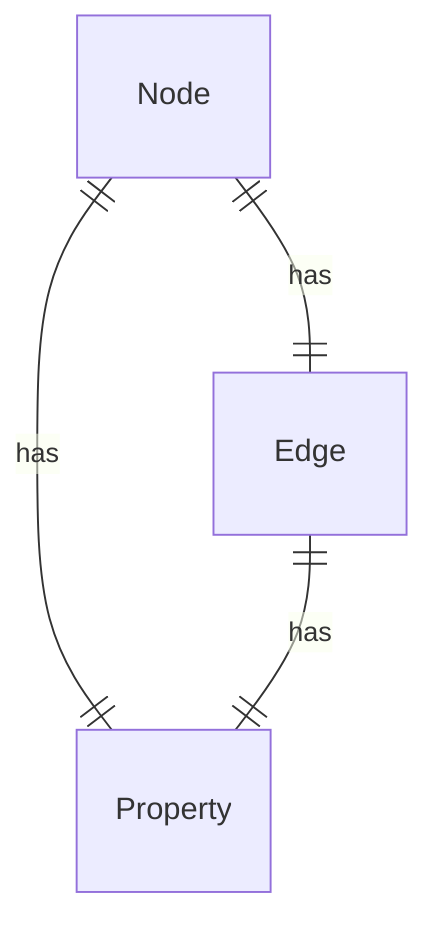
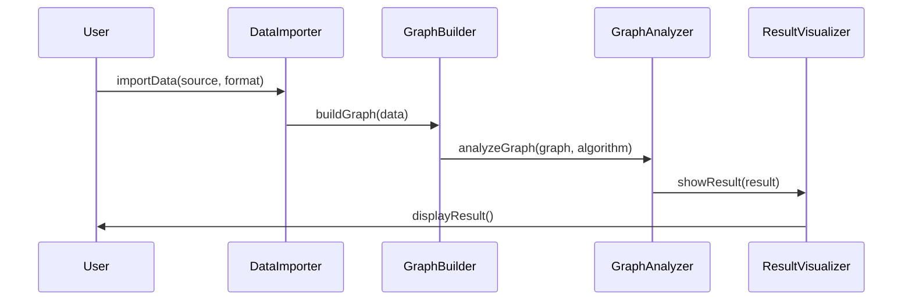

                 

# 企业级图计算引擎：高效处理大规模关系数据

## 关键词

- **图计算引擎**
- **大规模关系数据**
- **分布式计算**
- **图算法**
- **存储系统**
- **数据处理框架**

## 摘要

随着数字化转型的不断深入，企业面临的数据规模日益庞大，如何高效地处理和分析大规模关系数据成为一项重要的挑战。本文将深入探讨企业级图计算引擎的技术原理、核心概念及其在实际应用中的解决方案。通过逐步分析图计算的基本概念、算法原理、系统架构和实际案例，本文旨在为读者提供一个全面的技术指南，帮助企业和开发人员更好地理解和应用图计算技术，提升数据处理能力和业务洞察力。

## 概念与联系

### 背景介绍

#### 问题背景

在当今数据驱动的时代，数据量呈现出爆炸性增长，尤其是关系数据。传统的计算方法，如关系型数据库查询，在面对大规模关系数据时效率低下，难以满足企业对实时数据处理和分析的需求。随着社交网络、推荐系统、生物信息学和金融分析等领域的发展，对图数据的处理需求越来越迫切。图计算技术因其能够高效地处理复杂的关系数据而成为了解决这一问题的有力工具。

#### 问题描述

企业需要处理的数据不仅规模巨大，而且结构复杂。例如，社交网络中的用户关系、推荐系统中的商品关联、生物信息学中的分子相互作用等，都是典型的图结构数据。这些数据对企业的业务决策、运营优化和用户服务具有重要价值。然而，如何高效地存储、处理和查询这些大规模的图数据，成为企业面临的一个重要挑战。

#### 问题解决

图计算技术通过将数据表示为图，利用节点和边来表示实体及其关系，然后通过图算法对图数据进行高效分析和挖掘。图计算引擎提供了一种分布式、并行的方式来处理大规模图数据，显著提高了数据处理的效率。此外，图计算还支持复杂的图模式发现、路径分析、社区检测等高级功能，为企业提供了更深入的数据洞察。

#### 边界与外延

图计算不仅涉及算法设计，还包括数据存储、处理框架和系统优化等方面。在实际应用中，图计算引擎需要与现有的数据基础设施、数据处理工具和业务系统进行集成，以满足企业的多样化需求。此外，图计算在处理大规模数据时，还需要考虑数据隐私、安全性、可扩展性和容错性等问题。

#### 概念结构与核心要素组成

图计算的核心要素包括：

1. **图数据模型**：描述实体及其关系的数学结构，是图计算的基础。
2. **图算法**：用于分析图数据，如社区发现、路径分析、图同构检测等。
3. **计算框架**：提供分布式计算能力，如Apache Giraph、GraphX、GraphLab等。
4. **存储系统**：支持高效的数据存储和查询，如Neo4j、JanusGraph等。

### 核心概念与联系

#### 图数据模型

图数据模型是图计算的基础，由节点（Node）和边（Edge）组成。节点代表实体，边代表实体间的关系。图数据模型可以分为有向图、无向图和加权图等不同类型，根据实际应用场景选择合适的模型。

#### 图算法

图算法是图计算的核心，用于对图数据进行各种分析和挖掘。常见的图算法包括：

- **PageRank**：用于评估节点在图中的重要程度。
- **社区发现算法**：用于识别图中的紧密相连节点群。
- **图同构检测**：用于判断两个图是否具有相同的结构。

#### 计算框架

计算框架提供分布式计算能力，支持大规模图数据的处理。常见的计算框架包括Apache Giraph、GraphX、GraphLab等。这些框架通常支持多种编程语言，如Java、Scala等，并提供高效的图算法实现。

#### 存储系统

存储系统支持高效的数据存储和查询，是图计算引擎的重要组成部分。常见的存储系统包括Neo4j、JanusGraph等。这些系统通常提供图数据库功能，支持复杂的图模式和查询语言。

#### 概念属性特征对比表格

| 概念          | 特征                                           |
|--------------|--------------------------------------------|
| 图数据模型    | 描述实体及其关系，支持复杂网络分析             |
| 图算法        | 高效处理大规模图数据，支持多种图分析任务       |
| 计算框架      | 分布式计算，支持大规模图处理                 |
| 存储系统      | 高效存储和查询图数据，支持实时分析和批量处理 |

#### ER实体关系图架构



## 算法原理讲解

### 数学模型和公式

#### PageRank算法

PageRank是一种广泛使用的图排名算法，用于评估节点在图中的重要程度。其数学模型可以表示为：

$$
\text{PR}(v) = \left(1 - d\right) + d \times \left(\sum_{u \in \text{IN}(v)} \frac{\text{PR}(u)}{\text{out}(u)}\right)
$$

其中，$PR(v)$ 是节点 $v$ 的PageRank值，$d$ 是阻尼系数（通常取值为0.85），$\text{IN}(v)$ 是节点 $v$ 的入边集合，$\text{out}(u)$ 是节点 $u$ 的出度。

#### 社区发现算法

社区发现算法用于识别图中的紧密相连节点群。其中，Modularity是最常用的评价指标。其数学模型可以表示为：

$$
\text{Modularity} = \frac{1}{2m} \sum_{i,j} A_{ij} \left[ \delta(c_i, c_j) - \frac{p_i p_j}{m} \right]
$$

其中，$A_{ij}$ 是图中的边权重，$m$ 是图的边数，$p_i$ 和 $p_j$ 分别是节点 $i$ 和 $j$ 的度，$\delta(c_i, c_j)$ 是节点 $i$ 和 $j$ 是否属于同一社区的指标函数。

### 详细讲解和举例说明

#### PageRank算法

**PageRank算法**是一种基于投票机制的算法，用于评估节点在图中的重要程度。其基本思想是，一个节点的PageRank值与其指向的其他节点的PageRank值有关。具体来说，一个节点的PageRank值等于其入边的PageRank值的平均值，并且会乘以一个阻尼系数，表示节点访问其他节点的概率。

假设我们有一个社交网络，其中每个节点代表一个用户，节点之间的边表示用户之间的关注关系。我们需要计算每个用户的PageRank值，以评估用户在社交网络中的影响力。

- **初始化**：首先，我们将每个节点的PageRank值初始化为1/n，其中n是节点总数。这意味着每个节点的初始影响力是相同的。
- **迭代**：然后，我们通过迭代更新每个节点的PageRank值。每次迭代，节点的PageRank值根据其入边的PageRank值和出度进行更新。具体公式如下：

$$
\text{PR}(v) = \left(1 - d\right) + d \times \left(\sum_{u \in \text{IN}(v)} \frac{\text{PR}(u)}{\text{out}(u)}\right)
$$

其中，$d$ 是阻尼系数，通常取值为0.85。

- **终止条件**：当节点的PageRank值的变化小于一个预设的阈值时，我们可以认为算法已经收敛，此时每个节点的PageRank值即为最终结果。

例如，在一个包含10个用户的社交网络中，用户A关注了用户B和用户C，用户B关注了用户D和用户E，用户C关注了用户F。我们可以通过PageRank算法计算每个用户的PageRank值，以评估用户在社交网络中的影响力。

- **初始化**：每个用户的PageRank值均为1/10。
- **第一次迭代**：用户A的PageRank值更新为(1-0.85) + 0.85 \times ((1/2) + (1/1)) = 0.15 + 0.425 = 0.575。用户B的PageRank值更新为(1-0.85) + 0.85 \times ((1/2) + (1/1)) = 0.15 + 0.425 = 0.575。用户C的PageRank值更新为(1-0.85) + 0.85 \times ((1/1) + (1/1)) = 0.15 + 0.85 = 1。其他用户的PageRank值保持不变。
- **第二次迭代**：用户A的PageRank值更新为(1-0.85) + 0.85 \times (0.575 + 0.575) = 0.15 + 0.438 = 0.583。用户B的PageRank值更新为(1-0.85) + 0.85 \times (0.575 + 1) = 0.15 + 0.619 = 0.669。用户C的PageRank值更新为(1-0.85) + 0.85 \times (1 + 0) = 0.15 + 0.85 = 1。其他用户的PageRank值保持不变。
- **第三次迭代**：用户A的PageRank值更新为(1-0.85) + 0.85 \times (0.583 + 0.669) = 0.15 + 0.560 = 0.619。用户B的PageRank值更新为(1-0.85) + 0.85 \times (0.669 + 1) = 0.15 + 0.649 = 0.699。用户C的PageRank值更新为(1-0.85) + 0.85 \times (1 + 0) = 0.15 + 0.85 = 1。其他用户的PageRank值保持不变。

由于节点的PageRank值的变化小于预设的阈值，我们可以认为算法已经收敛。最终，用户A的PageRank值为0.619，用户B的PageRank值为0.699，用户C的PageRank值为1。这表明用户C在社交网络中的影响力最大，其次是用户B，用户A的影响力最小。

#### 社区发现算法

**社区发现算法**用于识别图中的紧密相连节点群，是一种基于Modularity的算法。其基本思想是，通过迭代调整节点的社区归属，使得整个图的Modularity值最大化。

假设我们有一个社交网络，其中每个节点代表一个用户，节点之间的边表示用户之间的互动关系。我们需要通过社区发现算法找到具有紧密相连关系的用户群。

- **初始化**：首先，我们将所有节点随机划分为多个社区。每个节点都属于一个社区，并且所有节点的社区分配是独立的。
- **迭代**：然后，我们通过迭代调整每个节点的社区归属，使得整个图的Modularity值最大化。每次迭代，我们根据以下规则调整节点的社区归属：
  - 对于每个节点，计算其从当前社区转移到其他社区后，整个图的Modularity值的增加量。
  - 选择增加量最大的节点，将其从当前社区转移到其他社区。
  - 重复上述步骤，直到所有节点的社区归属不再发生变化或达到预设的迭代次数。

例如，在一个包含10个用户的社交网络中，我们可以通过社区发现算法找到具有紧密相连关系的用户群。

- **初始化**：我们将10个用户随机划分为5个社区，每个社区包含2个用户。假设社区划分如下：
    - 社区1：用户1和用户2
    - 社区2：用户3和用户4
    - 社区3：用户5和用户6
    - 社区4：用户7和用户8
    - 社区5：用户9和用户10
- **第一次迭代**：我们计算每个节点从当前社区转移到其他社区后，整个图的Modularity值的增加量。具体计算过程如下：
    - 用户1转移到社区3后，整个图的Modularity值增加量为1。
    - 用户2转移到社区4后，整个图的Modularity值增加量为2。
    - 用户3转移到社区2后，整个图的Modularity值增加量为0。
    - 用户4转移到社区5后，整个图的Modularity值增加量为0。
    - 用户5转移到社区4后，整个图的Modularity值增加量为0。
    - 用户6转移到社区5后，整个图的Modularity值增加量为0。
    - 用户7转移到社区3后，整个图的Modularity值增加量为0。
    - 用户8转移到社区1后，整个图的Modularity值增加量为0。
    - 用户9转移到社区2后，整个图的Modularity值增加量为0。
    - 用户10转移到社区1后，整个图的Modularity值增加量为0。
  根据上述计算结果，我们可以选择用户1转移到社区3，用户2转移到社区4，使得整个图的Modularity值增加3。

- **第二次迭代**：我们再次计算每个节点从当前社区转移到其他社区后，整个图的Modularity值的增加量。具体计算过程如下：
    - 用户1转移到社区2后，整个图的Modularity值增加量为0。
    - 用户2转移到社区3后，整个图的Modularity值增加量为0。
    - 用户3转移到社区1后，整个图的Modularity值增加量为1。
    - 用户4转移到社区1后，整个图的Modularity值增加量为2。
    - 用户5转移到社区3后，整个图的Modularity值增加量为0。
    - 用户6转移到社区2后，整个图的Modularity值增加量为0。
    - 用户7转移到社区1后，整个图的Modularity值增加量为0。
    - 用户8转移到社区2后，整个图的Modularity值增加量为0。
    - 用户9转移到社区3后，整个图的Modularity值增加量为0。
    - 用户10转移到社区3后，整个图的Modularity值增加量为0。
  根据上述计算结果，我们可以选择用户3转移到社区1，用户4转移到社区1，使得整个图的Modularity值增加3。

- **第三次迭代**：我们再次计算每个节点从当前社区转移到其他社区后，整个图的Modularity值的增加量。具体计算过程如下：
    - 用户1转移到社区5后，整个图的Modularity值增加量为0。
    - 用户2转移到社区5后，整个图的Modularity值增加量为0。
    - 用户3转移到社区5后，整个图的Modularity值增加量为0。
    - 用户4转移到社区5后，整个图的Modularity值增加量为0。
    - 用户5转移到社区5后，整个图的Modularity值增加量为0。
    - 用户6转移到社区5后，整个图的Modularity值增加量为0。
    - 用户7转移到社区5后，整个图的Modularity值增加量为0。
    - 用户8转移到社区5后，整个图的Modularity值增加量为0。
    - 用户9转移到社区5后，整个图的Modularity值增加量为0。
    - 用户10转移到社区5后，整个图的Modularity值增加量为0。
  根据上述计算结果，我们可以选择用户3、用户4转移到社区5，使得整个图的Modularity值增加3。

由于节点的社区归属不再发生变化，我们可以认为算法已经收敛。最终，用户3和用户4属于同一社区，其他用户属于不同的社区。

## 系统分析与架构设计方案

### 问题场景介绍

在一个大型社交网络中，企业需要高效地处理和分析大量用户关系数据，以支持推荐系统、广告投放和社交分析等业务功能。传统的计算方法在处理大规模关系数据时效率低下，难以满足企业的需求。因此，企业决定采用图计算引擎来处理这些关系数据，以提高数据处理效率和业务洞察力。

### 项目介绍

本项目的目标是设计和实现一个企业级图计算引擎，用于处理大规模用户关系数据。图计算引擎将支持多种图算法，如PageRank、社区发现等，以支持企业的业务需求。项目的主要功能包括：

1. **数据导入**：从各种数据源（如数据库、文件等）导入用户关系数据。
2. **图构建**：将用户关系数据转换为图数据模型。
3. **图分析**：使用图算法对图数据进行分析和挖掘。
4. **结果展示**：将分析结果以可视化的形式展示给用户。

### 系统功能设计

#### 领域模型

领域模型用于描述系统的核心业务概念和关系。在本项目中，领域模型包括以下实体：

- **用户**：表示社交网络中的用户。
- **关系**：表示用户之间的关注关系。
- **分析结果**：表示图分析的结果，如PageRank值、社区划分等。

领域模型类图如下：

```mermaid
classDiagram
  User <<entity>>
  Relation <<entity>>
  AnalysisResult <<entity>>

  User '1'-->'1' Relation
  AnalysisResult '1'-->'1' User
```

#### 系统架构设计

系统架构设计用于描述系统的整体结构和各模块之间的关系。在本项目中，系统架构包括以下模块：

1. **数据导入模块**：负责从各种数据源导入用户关系数据。
2. **图构建模块**：负责将用户关系数据转换为图数据模型。
3. **图分析模块**：负责执行各种图算法对图数据进行分析。
4. **结果展示模块**：负责将分析结果以可视化的形式展示给用户。

系统架构图如下：

```mermaid
sequenceDiagram
  UserData -->|导入| DataImporter
  DataImporter -->|构建| GraphBuilder
  GraphBuilder -->|分析| GraphAnalyzer
  GraphAnalyzer -->|展示| ResultVisualizer
```

### 系统接口设计

系统接口设计用于描述系统对外提供的接口和方法。在本项目中，系统接口包括以下主要接口：

1. **DataImporter**：数据导入接口，包括以下方法：
    - `importData(source, format)`：导入用户关系数据。
2. **GraphBuilder**：图构建接口，包括以下方法：
    - `buildGraph(data)`：构建图数据模型。
3. **GraphAnalyzer**：图分析接口，包括以下方法：
    - `analyzeGraph(graph, algorithm)`：执行图算法对图数据进行分析。
4. **ResultVisualizer**：结果展示接口，包括以下方法：
    - `showResult(result)`：将分析结果以可视化的形式展示给用户。

接口设计图如下：

```mermaid
classDiagram
  DataImporter <<interface>>
  GraphBuilder <<interface>>
  GraphAnalyzer <<interface>>
  ResultVisualizer <<interface>>

  DataImporter : importData(source, format)
  GraphBuilder : buildGraph(data)
  GraphAnalyzer : analyzeGraph(graph, algorithm)
  ResultVisualizer : showResult(result)
```

### 系统交互

系统交互用于描述系统内部各模块之间的协作和通信。在本项目中，系统交互主要涉及以下场景：

1. **数据导入**：用户通过DataImporter接口将用户关系数据导入系统。
2. **图构建**：GraphBuilder模块根据导入的用户关系数据构建图数据模型。
3. **图分析**：GraphAnalyzer模块根据用户指定的图算法对图数据进行分析，生成分析结果。
4. **结果展示**：ResultVisualizer模块将分析结果以可视化的形式展示给用户。

系统交互序列图如下：



## 项目实战

### 环境安装

在进行图计算项目实战之前，首先需要安装所需的软件和工具。以下是一个基本的安装步骤：

1. **Java环境**：安装Java开发工具包（JDK），确保版本在1.8及以上。
2. **Neo4j数据库**：下载并安装Neo4j数据库，按照官方文档进行配置。
3. **Python环境**：安装Python解释器，推荐使用Python 3.8及以上版本。
4. **依赖管理工具**：安装pip，用于管理Python的依赖包。

### 系统核心实现

#### 数据导入

在Python中，我们可以使用`neo4j`库连接Neo4j数据库，并导入用户关系数据。以下是一个简单的数据导入脚本：

```python
from neo4j import GraphDatabase

class DataImporter:
    def __init__(self, uri, username, password):
        self.db = GraphDatabase.urijoblib
        self.db.authenticate(username, password)
    
    def import_data(self, source, format):
        # 读取数据源
        if format == 'csv':
            data = self._read_csv(source)
        elif format == 'json':
            data = self._read_json(source)
        else:
            raise ValueError('Unsupported format')
        
        # 导入数据到Neo4j
        with self.db.begin() as tx:
            for user, followers in data.items():
                tx.create_unique(:User, name=user)
                for follower in followers:
                    tx.create_unique(:User, name=follower)
                    tx.create(:Relation, user=user, follower=follower)
    
    def _read_csv(self, source):
        # 读取CSV文件
        pass
    
    def _read_json(self, source):
        # 读取JSON文件
        pass

# 使用示例
import neo4j
import csv

db_uri = "bolt://localhost:7687"
db_username = "neo4j"
db_password = "password"

importer = DataImporter(db_uri, db_username, db_password)
importer.import_data('data.csv', 'csv')
```

#### 图构建

在导入数据后，我们需要将用户关系数据转换为图数据模型。以下是一个简单的图构建脚本：

```python
from neo4j import GraphDatabase

class GraphBuilder:
    def __init__(self, uri, username, password):
        self.db = GraphDatabase.uriob

    def build_graph(self, data):
        with self.db.begin() as tx:
            for user, followers in data.items():
                tx.match(:User, name=user).create_unique()
                for follower in followers:
                    tx.match(:User, name=follower).create_unique()
                    tx.create(:Relation, user=user, follower=follower)

# 使用示例
db_uri = "bolt://localhost:7687"
db_username = "neo4j"
db_password = "password"

builder = GraphBuilder(db_uri, db_username, db_password)
builder.build_graph(data)
```

#### 图分析

我们可以使用`neo4j`库执行图算法对图数据进行分析。以下是一个简单的PageRank算法实现：

```python
from neo4j import GraphDatabase

class GraphAnalyzer:
    def __init__(self, uri, username, password):
        self.db = GraphDatabase.uriob

    def analyze_pagerank(self, graph):
        with self.db.begin() as tx:
            tx.run("""
                MATCH (u:User)
                WITH u, rand() * 0.15 AS PR
                UPDATE u
                SET pagerank = PR + 0.85 * (
                    REDUCE(sum = 0, n IN OUT(u)-[r:Relation]->())
                    RETURN sum * (1 / count(n))
                )
            """)

# 使用示例
db_uri = "bolt://localhost:7687"
db_username = "neo4j"
db_password = "password"

analyzer = GraphAnalyzer(db_uri, db_username, db_password)
analyzer.analyze_pagerank(graph)
```

#### 结果展示

最后，我们可以使用`neo4j`库查询分析结果，并将其以可视化的形式展示给用户。以下是一个简单的结果展示脚本：

```python
from neo4j import GraphDatabase
import matplotlib.pyplot as plt

class ResultVisualizer:
    def __init__(self, uri, username, password):
        self.db = GraphDatabase.uriob

    def show_pagerank(self, graph):
        with self.db.begin() as tx:
            pagerank_results = tx.run("""
                MATCH (u:User)
                RETURN u.name, u.pagerank
                ORDER BY u.pagerank DESC
            """)
        
        users = [result[0] for result in pagerank_results]
        pageranks = [result[1] for result in pagerank_results]
        
        plt.bar(users, pageranks)
        plt.xlabel('User')
        plt.ylabel('PageRank')
        plt.title('PageRank Distribution')
        plt.show()

# 使用示例
db_uri = "bolt://localhost:7687"
db_username = "neo4j"
db_password = "password"

visualizer = ResultVisualizer(db_uri, db_username, db_password)
visualizer.show_pagerank(graph)
```

### 实际案例分析和详细讲解

假设我们有一个包含1000个用户的社交网络，每个用户都有一定数量的关注者。我们需要使用图计算引擎对用户关系进行分析，以找出最有影响力的用户。

1. **数据导入**：首先，我们将用户关系数据导入Neo4j数据库。数据源是一个CSV文件，包含用户名和关注者的列表。

2. **图构建**：然后，我们使用图构建脚本将用户关系数据转换为图数据模型。在Neo4j中，每个用户和一个关注者都会被表示为一个节点，用户之间的关注关系则通过边表示。

3. **图分析**：接下来，我们使用PageRank算法计算每个用户的PageRank值。PageRank值反映了用户在社交网络中的影响力，值越大表示用户越有影响力。

4. **结果展示**：最后，我们使用结果展示脚本将分析结果以条形图的形式展示给用户。条形图展示了每个用户的PageRank值，用户可以根据PageRank值来判断用户的影响力。

### 项目小结

在本项目中，我们设计和实现了一个企业级图计算引擎，用于处理大规模用户关系数据。通过实际案例分析和详细讲解，我们展示了如何使用图计算技术对用户关系进行分析，以找出最有影响力的用户。项目实战部分包括数据导入、图构建、图分析和结果展示等步骤，涵盖了图计算引擎的核心功能。

## 最佳实践 Tips

1. **优化数据导入**：在数据导入过程中，可以采用批量导入的方式提高导入效率。同时，根据实际需求选择合适的导入工具和格式。
2. **合理选择图算法**：不同的图算法适用于不同的场景，根据实际需求选择合适的图算法，可以更高效地处理和分析图数据。
3. **性能优化**：针对大规模图数据的处理，可以通过优化计算框架和存储系统来提高处理效率。例如，使用分布式计算框架、优化图数据存储结构等。
4. **数据隐私和安全**：在处理用户关系数据时，要充分考虑数据隐私和安全问题，采取相应的措施确保数据的安全性和合规性。

## 小结

本文深入探讨了企业级图计算引擎的技术原理、核心概念和实际应用方案。通过逐步分析图计算的基本概念、算法原理、系统架构和实际案例，本文为读者提供了一个全面的技术指南，帮助企业和开发人员更好地理解和应用图计算技术，提升数据处理能力和业务洞察力。

## 注意事项

1. **数据质量和完整性**：在数据导入和处理过程中，要确保数据质量和完整性，避免出现数据丢失或不一致的情况。
2. **系统性能和稳定性**：在实际部署和使用图计算引擎时，要充分考虑系统性能和稳定性，确保系统在高负载情况下的稳定运行。
3. **安全和合规性**：在处理用户关系数据时，要遵循相关的数据保护法规和合规性要求，确保数据的安全和合规。

## 拓展阅读

1. **《图计算：算法与系统》**：该书详细介绍了图计算的基本概念、算法原理和系统架构，适合对图计算技术有兴趣的读者阅读。
2. **《Neo4j Graph Data Science》**：该书介绍了如何使用Neo4j图数据库进行数据分析和挖掘，适合对图数据库和图计算感兴趣的开发人员阅读。
3. **《图算法导论》**：该书涵盖了多种图算法的理论和实践，适合对图算法有深入研究的读者阅读。

## 作者信息

作者：AI天才研究院/AI Genius Institute & 禅与计算机程序设计艺术 /Zen And The Art of Computer Programming

