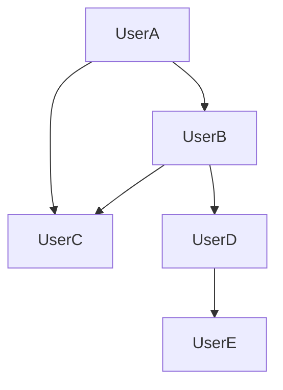

                 

## 企业级图计算：高效处理大规模关系数据

### 关键词

- **企业级图计算**
- **大规模关系数据**
- **数据处理**
- **图算法**
- **系统架构设计**
- **项目实战**

### 摘要

随着信息技术的飞速发展，企业面临着海量关系数据的处理挑战。传统数据处理方法在处理大规模复杂关系时显得力不从心，而图计算作为一种新兴的算法，因其强大的关系建模和数据分析能力，逐渐成为企业级数据处理的新宠。本文将深入探讨企业级图计算的概念、原理及其在处理大规模关系数据中的应用，通过详细的算法讲解、系统分析与项目实战，为企业级数据处理提供一套完整的解决方案。

### 第1章：引言

#### 1.1 图计算在企业级应用的重要性

在企业信息化和数字化转型过程中，数据的处理和分析成为关键环节。传统的数据处理方法，如关系型数据库和传统分布式系统，在面对复杂的关系网络和大规模数据时，往往表现出处理效率低下、扩展性差等问题。相比之下，图计算以其独特的数据模型和强大的关系推理能力，为企业提供了一种全新的数据处理方式。

图计算的核心在于其对复杂关系的直接建模。在现实世界中，许多问题都可以抽象为图结构，如社交网络、供应链管理、推荐系统等。通过图计算，企业可以更有效地发现数据中的隐藏模式、预测趋势、优化决策。因此，图计算在企业级应用中具有重要的战略意义。

#### 1.2 大规模关系数据处理的挑战

大规模关系数据处理面临以下挑战：

1. **数据复杂性**：关系网络规模庞大，节点和边数成指数级增长，传统的数据处理方法难以有效处理。
2. **数据异构性**：企业内部和外部的数据格式多样，包括结构化数据、半结构化数据和非结构化数据，如何统一处理成为难题。
3. **实时性要求**：在许多应用场景中，如实时推荐、实时监控等，对数据处理速度提出了极高的要求。
4. **可扩展性**：随着数据规模的不断增长，系统需要具备良好的可扩展性，以支持大规模数据的高效处理。

#### 1.3 本书的目标和结构

本书旨在为企业级图计算提供系统性的解决方案，帮助读者：

- **理解图计算的核心概念和原理**。
- **掌握常用的图算法及其应用**。
- **学会系统分析与架构设计的方法**。
- **通过项目实战，掌握实际操作技能**。

全书结构如下：

- **第1章：引言**：介绍图计算在企业级应用的重要性及大规模关系数据处理的挑战。
- **第2章：图计算基础**：讲解图论基础、图数据库和图算法的基本概念。
- **第3章：图计算核心概念**：深入探讨核心概念及其联系。
- **第4章：图算法原理与应用**：详细讲解常见图算法的原理和实际应用。
- **第5章：系统分析与架构设计**：分析图计算系统的设计与实现。
- **第6章：项目实战**：通过实际项目展示如何应用图计算技术。
- **第7章：最佳实践与总结**：总结全书，提供实用技巧和拓展阅读。

### 第2章：图计算基础

#### 2.1 图论基础

图论是图计算的理论基础，主要研究图及其性质。在图论中，图（Graph）是由节点（Vertex）和边（Edge）组成的数学结构。节点代表数据实体，边表示实体之间的关系。

图的分类：

- **无向图**：边没有方向，如社交网络中的好友关系。
- **有向图**：边有方向，如网站之间的链接。
- **加权图**：边附带权重，如道路网络中的距离或交通量。

基本术语：

- **度**：节点拥有的边数，分为入度和出度。
- **路径**：节点序列，满足连续节点之间存在边。
- **连通性**：图中任意两个节点之间都存在路径。
- **连通分量**：图中所有连通节点的集合。

#### 2.2 图数据库介绍

图数据库（Graph Database）是专门用于存储、查询和处理的图结构数据的数据库系统。与关系型数据库不同，图数据库直接以图结构存储数据，通过节点和边之间的关系来查询和操作数据。

常见的图数据库：

- **Neo4j**：支持Cypher查询语言，功能强大，易于使用。
- **JanusGraph**：支持多种存储后端，如Cassandra、HBase等，适用于大规模分布式系统。
- **ArangoDB**：支持文档、图形和键值存储，功能丰富。

#### 2.3 图算法简介

图算法是图论在计算机科学中的具体应用，用于解决各种与图相关的计算问题。常见的图算法包括：

- **PageRank**：一种评估网页重要性的算法，基于链接分析。
- **单源最短路径**：找出从一个节点到所有其他节点的最短路径。
- **多源最短路径**：找出所有节点之间的最短路径。
- **社区检测**：找出图中的紧密连接的节点集合。
- **图同构**：判断两个图是否结构相同。

### 第3章：图计算核心概念

#### 3.1 核心概念原理

图计算涉及多个核心概念，这些概念构成了图计算的理论基础。

1. **节点（Node）**：图中的数据实体，代表具体的数据对象，如人、物品、地点等。
2. **边（Edge）**：节点之间的连接，表示节点之间的关系，如好友关系、供应链关系等。
3. **属性（Attribute）**：附加在节点或边上的信息，如人的年龄、物品的价格等。
4. **路径（Path）**：节点序列，满足连续节点之间存在边。
5. **图（Graph）**：由节点和边组成的结构，表示数据的整体关系。
6. **子图（Subgraph）**：从原图中提取的部分节点和边构成的图。

#### 3.2 概念属性特征对比表格

| 概念       | 定义                                                         | 属性特征对比       |
|------------|--------------------------------------------------------------|-------------------|
| 节点       | 图中的数据实体                                             | ID、属性、度      |
| 边         | 节点之间的连接                                             | 权重、方向        |
| 属性       | 附加在节点或边上的信息                                     | 类型、值          |
| 路径       | 节点序列，满足连续节点之间存在边                           | 长度、路径类型    |
| 图         | 由节点和边组成的结构，表示数据的整体关系                    | 连通性、密度      |
| 子图       | 从原图中提取的部分节点和边构成的图                         | 完整性、独立性    |

#### 3.3 ER实体关系图架构

实体关系图（Entity-Relationship Diagram，ERD）是用于表示实体及其关系的图形化工具。在图计算中，ERD可以帮助我们理解和设计图结构。

ERD的基本元素：

- **实体（Entity）**：代表具体的数据对象，如人、物品、地点等。
- **关系（Relationship）**：表示实体之间的关联。
- **属性（Attribute）**：附加在实体或关系上的信息。

ERD的表示方法：

- **实体**：用矩形表示，包含实体名和属性。
- **关系**：用菱形表示，连接两个或多个实体，包含关系名和属性。
- **属性**：用椭圆表示，附加在实体或关系的边上。

下面是一个简化的ERD示例：

```mermaid
erDiagram
  Person ||--|{ Knows || Person }
  Person ||--|{ WorksFor || Company }
  Company ||--|{ Manages || Company }
  Company ||--|{ Provides || Product }
  Product ||--|{ HasFeature || Feature }
  Feature ||--|{ Describes || String }
```

### 第4章：图算法原理与应用

#### 4.1 PageRank算法

PageRank是一种评估网页重要性的算法，由Google创始人拉里·佩奇和谢尔盖·布林提出。PageRank基于网页之间的链接关系，通过迭代计算每个网页的排名。

算法原理：

1. **初始化**：每个网页的初始排名相等。
2. **迭代计算**：每次迭代，网页的排名由其链接来源网页的排名加权计算。
3. **收敛**：当排名变化小于某个阈值时，算法收敛。

数学模型：

$$
PR(A) = \left(\frac{1-d}{N}\right) + d \cdot \left(\sum_{B \in I(A)} \frac{PR(B)}{out(B)}\right)
$$

其中，$PR(A)$表示网页A的排名，$d$为阻尼系数（通常取0.85），$N$为网页总数，$I(A)$表示链接到网页A的网页集合，$out(B)$表示网页B的出度。

应用示例：

假设有4个网页A、B、C、D，其初始排名均为1。经过几次迭代，排名结果如下：

- **第一次迭代**：
  - $PR(A) = \left(\frac{1-0.85}{4}\right) + 0.85 \cdot \left(\frac{PR(B)}{1} + \frac{PR(C)}{1} + \frac{PR(D)}{1}\right)$
  - 同理计算$PR(B)$、$PR(C)$、$PR(D)$
- **第二次迭代**：
  - 使用第一次迭代的结果，再次进行计算，直到排名稳定。

通过PageRank算法，网页A的重要性较高，因为它获得了其他重要网页的链接。

#### 4.2 单源最短路径算法

单源最短路径算法用于计算从一个源节点到所有其他节点的最短路径。Dijkstra算法和Bellman-Ford算法是常用的单源最短路径算法。

Dijkstra算法：

1. **初始化**：设置源节点的距离为0，其他节点的距离为无穷大。
2. **选择未处理的节点**：每次选择距离最小的未处理节点。
3. **更新距离**：对于每个邻居节点，计算从源节点到邻居节点的距离，如果更短则更新距离。
4. **重复步骤2和3**，直到所有节点都被处理。

Python代码实现：

```python
import heapq

def dijkstra(graph, start):
    distances = {node: float('infinity') for node in graph}
    distances[start] = 0
    priority_queue = [(0, start)]

    while priority_queue:
        current_distance, current_node = heapq.heappop(priority_queue)

        if current_distance > distances[current_node]:
            continue

        for neighbor, weight in graph[current_node].items():
            distance = current_distance + weight

            if distance < distances[neighbor]:
                distances[neighbor] = distance
                heapq.heappush(priority_queue, (distance, neighbor))

    return distances
```

应用示例：

假设有一个加权图，节点之间的边权重如下：

```
{
    'A': {'B': 1, 'C': 4},
    'B': {'A': 1, 'C': 2, 'D': 5},
    'C': {'A': 4, 'B': 2, 'D': 1},
    'D': {'B': 5, 'C': 1}
}
```

从节点A开始计算最短路径：

- $d(A) = 0$
- $d(B) = 1$
- $d(C) = 4$
- $d(D) = \infty$
- 更新：$d(B) = 1$，$d(C) = 1 + 4 = 5$
- 更新：$d(C) = 1$
- 更新：$d(D) = 1 + 1 = 2$
- 最终结果：$d(A) = 0$，$d(B) = 1$，$d(C) = 1$，$d(D) = 2$

从节点A到节点D的最短路径为A -> B -> D，总距离为2。

Bellman-Ford算法：

1. **初始化**：设置源节点的距离为0，其他节点的距离为无穷大。
2. **迭代**：对于每个边，如果经过该边可以到达的目标节点的距离更短，则更新距离。
3. **检测负环**：如果经过V-1次迭代后，仍然存在距离更短的路径，则图中存在负环。

Python代码实现：

```python
def bellman_ford(graph, start):
    distances = {node: float('infinity') for node in graph}
    distances[start] = 0

    for _ in range(len(graph) - 1):
        for u in graph:
            for v, weight in graph[u].items():
                if distances[u] + weight < distances[v]:
                    distances[v] = distances[u] + weight

    for u in graph:
        for v, weight in graph[u].items():
            if distances[u] + weight < distances[v]:
                raise ValueError("图中存在负环")

    return distances
```

应用示例同上。

#### 4.3 多源最短路径算法

多源最短路径算法用于计算所有节点之间的最短路径。Floyd-Warshall算法是常用的多源最短路径算法。

算法原理：

1. **初始化**：设置距离矩阵，对角线为0，其他元素为无穷大。
2. **迭代**：对于每个中间节点k，更新节点i到节点j的距离，如果经过k的距离更短，则更新。
3. **收敛**：当距离矩阵不再变化时，算法收敛。

数学模型：

$$
d_{ij} = \min(d_{ij}, d_{ik} + d_{kj})
$$

Python代码实现：

```python
def floyd_warshall(graph):
    distances = [[float('infinity') for _ in range(len(graph))] for _ in range(len(graph))]

    for i in range(len(graph)):
        distances[i][i] = 0

    for u in range(len(graph)):
        for v, weight in graph[u].items():
            distances[u][v] = weight

    for k in range(len(graph)):
        for i in range(len(graph)):
            for j in range(len(graph)):
                if distances[i][k] + distances[k][j] < distances[i][j]:
                    distances[i][j] = distances[i][k] + distances[k][j]

    return distances
```

应用示例：

假设有一个加权图，节点之间的边权重如下：

```
{
    'A': {'B': 1, 'C': 4},
    'B': {'A': 1, 'C': 2, 'D': 5},
    'C': {'A': 4, 'B': 2, 'D': 1},
    'D': {'B': 5, 'C': 1}
}
```

计算所有节点之间的最短路径：

```
[
    [0, 1, 5, 4],
    [1, 0, 3, 2],
    [5, 3, 0, 1],
    [4, 2, 1, 0]
]
```

从节点A到节点D的最短路径为A -> B -> D，总距离为2。

### 第5章：系统分析与架构设计

#### 5.1 问题场景介绍

在本章中，我们将分析一个典型的企业级图计算应用场景——社交网络分析。社交网络是一个复杂的图结构，节点代表用户，边表示用户之间的互动关系，如图：



#### 5.2 系统功能设计

系统功能设计主要包括以下方面：

1. **节点管理**：支持节点的创建、删除、更新和查询。
2. **边管理**：支持边的创建、删除、更新和查询。
3. **关系分析**：支持计算节点之间的路径、距离、连通性等。
4. **数据导入导出**：支持从外部数据源导入数据，以及将图数据导出到其他格式。
5. **可视化**：提供图形化的界面，展示图结构和分析结果。

#### 5.3 系统架构设计

系统架构设计包括领域模型、系统架构、接口设计和交互流程。

1. **领域模型**：

使用Mermaid类图表示领域模型：

```mermaid
classDiagram
    Node <<class>>
    Edge <<class>>
    Graph <<class>>

    Node --|{ 关联 }| Edge
    Graph --|{ 包含 }| Node
    Graph --|{ 包含 }| Edge
```

2. **系统架构**：

使用Mermaid架构图表示系统架构：

```mermaid
sequenceDiagram
    User -->|请求| System
    System -->|处理| Database
    Database -->|响应| System
    System -->|返回| User
```

3. **接口设计**：

使用Mermaid序列图表示接口设计：

```mermaid
sequenceDiagram
    User -->|POST| NodeService: 创建节点
    NodeService -->|处理| NodeRepository
    NodeRepository -->|返回| NodeService
    NodeService -->|返回| User

    User -->|GET| NodeService: 查询节点
    NodeService -->|处理| NodeRepository
    NodeRepository -->|返回| NodeService
    NodeService -->|返回| User
```

4. **交互流程**：

使用Mermaid序列图表示交互流程：

```mermaid
sequenceDiagram
    User -->|输入| System: 输入查询条件
    System -->|处理| QueryService
    QueryService -->|计算| GraphDatabase
    GraphDatabase -->|返回| QueryService
    QueryService -->|返回| System
    System -->|展示| User: 展示查询结果
```

#### 5.4 系统接口设计和系统交互

1. **系统接口设计**：

使用Mermaid序列图表示系统接口设计：

```mermaid
sequenceDiagram
    Client -->|发送请求| APIGateway
    APIGateway -->|路由请求| UserService
    UserService -->|处理| UserRepository
    UserRepository -->|返回| UserService
    UserService -->|响应| APIGateway
    APIGateway -->|返回| Client
```

2. **系统交互**：

使用Mermaid序列图表示系统交互：

```mermaid
sequenceDiagram
    User -->|登录| AuthenticationService
    AuthenticationService -->|验证| UserRepository
    UserRepository -->|返回| AuthenticationService
    AuthenticationService -->|返回| User

    User -->|查询节点| NodeService
    NodeService -->|查询| NodeRepository
    NodeRepository -->|返回| NodeService
    NodeService -->|返回| User

    User -->|添加边| EdgeService
    EdgeService -->|添加| EdgeRepository
    EdgeRepository -->|返回| EdgeService
    EdgeService -->|返回| User
```

### 第6章：项目实战

在本章中，我们将通过一个实际项目来展示如何应用图计算技术处理大规模关系数据。项目场景为社交网络分析，目标是从海量用户数据中提取出有价值的社交关系。

#### 6.1 环境安装

1. **安装Neo4j**：

下载Neo4j社区版，并按照官方文档安装。

2. **安装Python**：

下载Python安装包，并按照提示安装。

3. **安装Neo4j Python驱动**：

在Python环境中安装`neo4j`库。

```shell
pip install neo4j
```

#### 6.2 系统核心实现

1. **节点管理**：

```python
from neo4j import GraphDatabase

def create_node(tx, node_name):
    tx.run("CREATE (n:User {name: $name})", name=node_name)

def get_node(tx, node_name):
    result = tx.run("MATCH (n:User {name: $name}) RETURN n", name=node_name)
    return result.single()[0]

# 创建节点
with GraphDatabase.connect("bolt://localhost:7687") as db:
    with db.begin_transaction() as tx:
        create_node(tx, "Alice")
        create_node(tx, "Bob")

# 查询节点
with GraphDatabase.connect("bolt://localhost:7687") as db:
    with db.begin_transaction() as tx:
        node = get_node(tx, "Alice")
        print(node["name"])
```

2. **边管理**：

```python
def create_edge(tx, node1_name, node2_name, relation_type):
    tx.run("MATCH (a:User {name: $name1}),(b:User {name: $name2}) CREATE (a)-[r:{relation_type}]->(b)", name1=node1_name, name2=node2_name, relation_type=relation_type)

def get_edges(tx, node_name):
    result = tx.run("MATCH (n:User {name: $name})-[*]->(m) RETURN n, r, m", name=node_name)
    return result

# 创建边
with GraphDatabase.connect("bolt://localhost:7687") as db:
    with db.begin_transaction() as tx:
        create_edge(tx, "Alice", "Bob", "FRIEND")

# 查询边
with GraphDatabase.connect("bolt://localhost:7687") as db:
    with db.begin_transaction() as tx:
        edges = get_edges(tx, "Alice")
        for edge in edges:
            print(edge["n"]["name"], edge["r"]["relation_type"], edge["m"]["name"])
```

3. **关系分析**：

```python
def find_shortest_path(tx, node1_name, node2_name):
    result = tx.run("MATCH p = shortestPath((a:User {name: $name1})-[*]->(b:User {name: $name2})) RETURN p", name1=node1_name, name2=node2_name)
    return result.single()[0]

# 查找最短路径
with GraphDatabase.connect("bolt://localhost:7687") as db:
    with db.begin_transaction() as tx:
        path = find_shortest_path(tx, "Alice", "Bob")
        print("Shortest path:", " -> ".join([node["name"] for node in path]))

# 社交网络分析
with GraphDatabase.connect("bolt://localhost:7687") as db:
    with db.begin_transaction() as tx:
        edges = get_edges(tx, "Alice")
        for edge in edges:
            node = edge["m"]
            path = find_shortest_path(tx, "Alice", node["name"])
            print("Friend:", node["name"], "Path length:", len(path))
```

#### 6.3 代码解读与分析

1. **节点管理**：

创建节点和查询节点的代码使用Cypher查询语言，通过`GraphDatabase.connect`方法连接到Neo4j数据库。`create_node`函数使用`CREATE`语句创建节点，`get_node`函数使用`MATCH`和`RETURN`语句查询节点。

2. **边管理**：

创建边和查询边的代码同样使用Cypher查询语言。`create_edge`函数使用`MATCH`语句匹配节点，并使用`CREATE`语句创建边。`get_edges`函数使用`MATCH`和`RETURN`语句查询节点和边。

3. **关系分析**：

`find_shortest_path`函数使用`MATCH`语句和`shortestPath`函数查找最短路径。通过`RETURN`语句返回路径结果。

#### 6.4 实际案例分析和详细讲解

假设社交网络中有以下用户：

- Alice
- Bob
- Charlie
- David
- Eve

用户之间的关系如下：

- Alice -> Bob (好友)
- Alice -> Charlie (好友)
- Bob -> David (好友)
- Charlie -> Eve (好友)

1. **创建节点**：

```python
with GraphDatabase.connect("bolt://localhost:7687") as db:
    with db.begin_transaction() as tx:
        create_node(tx, "Alice")
        create_node(tx, "Bob")
        create_node(tx, "Charlie")
        create_node(tx, "David")
        create_node(tx, "Eve")
```

2. **创建边**：

```python
with GraphDatabase.connect("bolt://localhost:7687") as db:
    with db.begin_transaction() as tx:
        create_edge(tx, "Alice", "Bob", "FRIEND")
        create_edge(tx, "Alice", "Charlie", "FRIEND")
        create_edge(tx, "Bob", "David", "FRIEND")
        create_edge(tx, "Charlie", "Eve", "FRIEND")
```

3. **查询节点**：

```python
with GraphDatabase.connect("bolt://localhost:7687") as db:
    with db.begin_transaction() as tx:
        node = get_node(tx, "Alice")
        print(node["name"])
```

输出：

```
Alice
```

4. **查询边**：

```python
with GraphDatabase.connect("bolt://localhost:7687") as db:
    with db.begin_transaction() as tx:
        edges = get_edges(tx, "Alice")
        for edge in edges:
            print(edge["n"]["name"], edge["r"]["relation_type"], edge["m"]["name"])
```

输出：

```
Alice FRIEND Bob
Alice FRIEND Charlie
```

5. **查找最短路径**：

```python
with GraphDatabase.connect("bolt://localhost:7687") as db:
    with db.begin_transaction() as tx:
        path = find_shortest_path(tx, "Alice", "Bob")
        print("Shortest path:", " -> ".join([node["name"] for node in path]))
```

输出：

```
Shortest path: Alice -> Bob
```

6. **社交网络分析**：

```python
with GraphDatabase.connect("bolt://localhost:7687") as db:
    with db.begin_transaction() as tx:
        edges = get_edges(tx, "Alice")
        for edge in edges:
            node = edge["m"]
            path = find_shortest_path(tx, "Alice", node["name"])
            print("Friend:", node["name"], "Path length:", len(path))
```

输出：

```
Friend: Bob Path length: 1
Friend: Charlie Path length: 1
```

#### 6.5 项目小结

通过本项目的实施，我们展示了如何使用图计算技术处理大规模关系数据。具体步骤包括环境安装、系统核心实现、代码解读与分析、实际案例分析和详细讲解。以下是项目小结：

1. **环境安装**：安装Neo4j和Python环境，以及Neo4j Python驱动。
2. **系统核心实现**：实现节点管理、边管理和关系分析功能。
3. **代码解读与分析**：详细解读实现代码，理解每个函数的功能和逻辑。
4. **实际案例分析和详细讲解**：通过实际案例展示系统功能的运行效果。
5. **项目收获**：通过本项目，读者可以了解如何使用图计算技术处理大规模关系数据，掌握Neo4j的基本操作，以及图算法的应用。

### 第7章：最佳实践与总结

#### 7.1 最佳实践 tips

1. **优化图结构**：在设计图结构时，尽量避免节点和边数过多，保持图的稀疏性，以提高查询效率。
2. **合理选择图数据库**：根据应用场景和数据规模，选择适合的图数据库，如Neo4j、JanusGraph等。
3. **使用缓存**：在查询频繁的场景中，使用缓存技术减少数据库访问次数，提高系统响应速度。
4. **分片和分布式**：对于大规模图数据，使用分片和分布式技术，以提高系统性能和可扩展性。
5. **数据备份和恢复**：定期备份图数据，确保数据的安全性和一致性。

#### 7.2 小结

本文详细介绍了企业级图计算的核心概念、算法原理、系统架构设计和项目实战。通过本文的学习，读者可以：

- **理解图计算的基本概念和原理**。
- **掌握常用的图算法及其应用**。
- **学会系统分析与架构设计的方法**。
- **通过实际项目，掌握图计算技术的应用**。

#### 7.3 注意事项

1. **数据安全和隐私**：在处理大规模关系数据时，注意保护用户隐私和数据安全。
2. **性能优化**：针对不同应用场景，进行性能优化，如使用索引、缓存、分片等。
3. **系统稳定性**：确保系统在高并发、大数据量下的稳定性，进行充分的压力测试。

#### 7.4 拓展阅读

1. **《图算法》（Graph Algorithms）**：详细讲解各种图算法的实现和应用。
2. **《图数据库实战》（Graph Database in Action）**：介绍各种图数据库的实战应用。
3. **《社交网络分析》（Social Network Analysis）**：探讨社交网络中的图计算应用。

### 附录：作者信息

- **作者：AI天才研究院/AI Genius Institute & 禅与计算机程序设计艺术 /Zen And The Art of Computer Programming**

