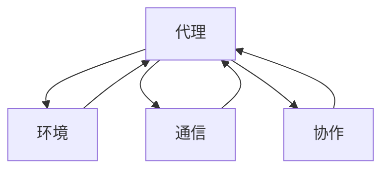
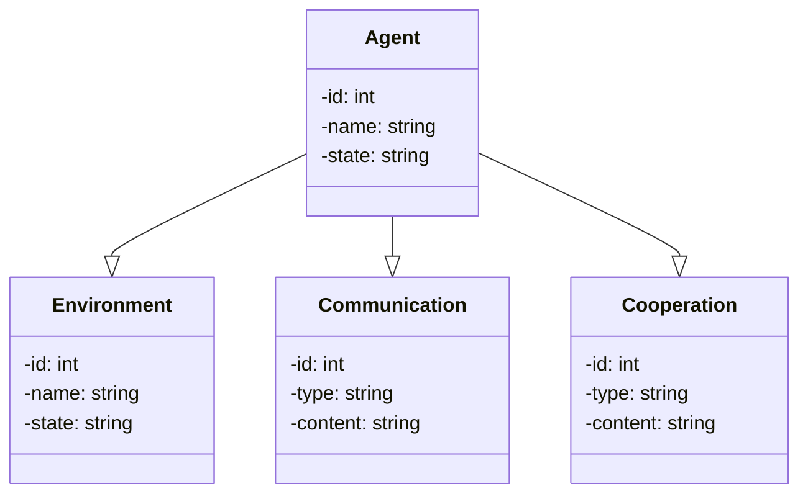
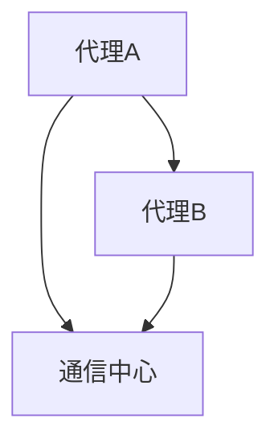
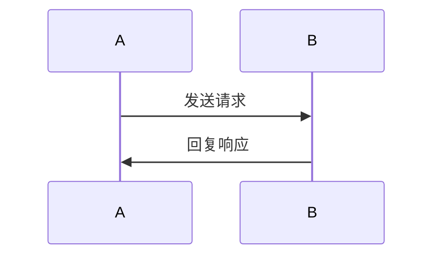

                 


# 企业级多Agent系统：协同解决复杂问题

## 关键词：
- 企业级
- 多Agent系统
- 复杂问题
- 协同
- 解决方案

## 摘要：
本文将深入探讨企业级多Agent系统在解决复杂问题中的应用。我们将逐步分析多Agent系统的核心概念、架构设计、协同机制以及在实际案例中的成功应用。通过本篇文章，读者将了解到多Agent系统如何为企业级问题提供创新且高效的解决方案。

## 引言

### 1.1 问题背景
在现代企业运营中，面对日益复杂的市场环境和技术变革，企业需要不断提高自身应对复杂问题的能力。传统集中式的系统设计往往难以满足这种需求，因为它们在应对动态、不确定性和高度交互的环境时显得力不从心。因此，企业需要一个更加灵活、自适应的解决方案来应对这些挑战。

### 1.2 问题描述
复杂问题的特点在于其规模大、动态性强、不确定性高和涉及多个利益相关方。这些特点使得传统单点解决方案难以奏效。具体而言，问题可能包括资源优化、供应链管理、风险管理、客户关系管理等。

### 1.3 问题解决
多Agent系统提供了一种分散式的解决方案，通过分布式计算和协作机制，能够更好地应对复杂问题。多Agent系统中的每个Agent都是独立的智能实体，能够自主决策并与其他Agent进行交互，从而实现复杂问题的协同解决。

### 1.4 边界与外延
多Agent系统的应用边界非常广泛，不仅限于企业级，还扩展到智能交通、智能电网、智能医疗等领域。其核心在于利用分布式智能和协作机制来提高系统整体的应对能力和效率。

### 1.5 概念结构与核心要素组成
多Agent系统的概念结构由以下几个核心要素组成：代理（Agent）、环境（Environment）、通信（Communication）和协作（Cooperation）。这些要素相互作用，共同构成了一个能够自主决策并协同工作的复杂系统。

## 第2章 多Agent系统的基础概念

### 2.1 多Agent系统的定义
多Agent系统（MAS）是由多个自治的智能代理组成的系统，这些代理能够自主行动并相互协作，以实现共同的目标。MAS的核心特点包括自主性、分布性、异构性和协调性。

### 2.2 多Agent系统的特性
多Agent系统具有以下几个主要特性：
- **自主性**：代理具有独立决策能力，能够根据环境和内部状态自主行动。
- **分布性**：代理分布于不同的物理或逻辑节点上，系统整体表现为分布性。
- **异构性**：代理可能具有不同的能力和目标，系统整体表现为异构性。
- **协调性**：代理之间通过交互和协作实现共同目标，系统整体表现为协调性。

### 2.3 多Agent系统的核心要素
多Agent系统的核心要素包括：
- **代理（Agent）**：自治的智能实体，具有感知、决策和行动能力。
- **环境（Environment）**：代理所在的动态环境，影响代理的行为和决策。
- **通信（Communication）**：代理之间通过通信进行信息交换和协作。
- **协作（Cooperation）**：代理之间通过协作实现共同目标。

## 第3章 多Agent系统的原理

### 3.1 代理模型
代理模型是多Agent系统设计的基础，根据代理的智能程度和自主性，代理模型可以分为：
- **基于规则的代理**：通过预设规则进行决策。
- **基于模型的代理**：通过内部模型进行决策。
- **基于学习的代理**：通过学习和自适应进行决策。

### 3.2 通信协议
通信协议是多Agent系统中代理之间进行信息交换的基础。常见的通信协议包括：
- **直接通信**：代理直接交换信息。
- **间接通信**：代理通过中介进行信息交换。
- **广播通信**：代理向系统中的所有其他代理发送信息。

### 3.3 协调机制
协调机制是多Agent系统实现协同工作的关键，包括：
- **集中式协调**：通过中央协调器进行全局协调。
- **分布式协调**：代理之间通过分布式算法进行协调。
- **混合协调**：结合集中式和分布式协调的优点。

### 3.4 智能决策
智能决策是多Agent系统的重要特性，代理通过以下方式进行决策：
- **基于规则的决策**：使用预设规则进行决策。
- **基于模型的决策**：使用内部模型进行决策。
- **基于学习的决策**：使用学习和自适应进行决策。

## 第4章 代理模型与架构

### 4.1 代理模型的类型与架构
代理模型根据其能力和架构可以分为：
- **基于知识的代理**：使用知识库进行决策。
- **基于行为的代理**：通过预定义的行为模式进行决策。
- **混合型代理**：结合基于知识和基于行为的特点。

### 4.2 代理架构的设计
代理架构的设计需要考虑代理的自治性、灵活性和扩展性。常见的代理架构包括：
- **基于代理的架构**：代理作为系统的主要组成部分，独立运行。
- **基于服务的架构**：代理作为服务提供者和服务消费者，通过服务进行交互。

### 4.3 代理架构的性能评估
代理架构的性能评估需要考虑以下指标：
- **响应时间**：代理对事件的响应速度。
- **效率**：代理在完成任务时的资源利用率。
- **可靠性**：代理在长时间运行中的稳定性。

## 第5章 多Agent系统的协同与通信

### 5.1 协同机制
协同机制是多Agent系统实现协同工作的关键，包括：
- **任务分配**：代理根据能力进行任务的分配。
- **资源共享**：代理之间进行资源的共享。
- **目标协调**：代理之间协调实现共同目标。

### 5.2 通信协议
通信协议是多Agent系统中代理之间进行信息交换的基础，包括：
- **直接通信**：代理直接交换信息。
- **间接通信**：代理通过中介进行信息交换。
- **广播通信**：代理向系统中的所有其他代理发送信息。

### 5.3 多Agent系统的互操作性与标准化
多Agent系统的互操作性与标准化是确保系统之间能够有效协作的关键，包括：
- **接口标准化**：定义统一的接口规范。
- **协议标准化**：定义统一的通信协议。
- **数据标准化**：定义统一的数据格式。

## 第6章 多Agent系统的设计

### 6.1 设计原则
设计多Agent系统时需要遵循以下原则：
- **模块化**：将系统划分为多个模块，提高系统的可维护性和可扩展性。
- **分布式**：确保系统在分布式环境中能够高效运行。
- **自适应**：系统应能够根据环境变化进行自适应调整。

### 6.2 设计流程
设计多Agent系统的流程包括：
1. **需求分析**：明确系统需求。
2. **系统架构设计**：设计系统的整体架构。
3. **代理设计**：设计各个代理的架构和功能。
4. **通信设计**：设计代理之间的通信机制。
5. **测试与验证**：对系统进行测试和验证。

## 第7章 多Agent系统的实现

### 7.1 环境安装与配置
在实现多Agent系统之前，首先需要安装和配置运行环境。常见的环境包括：
- **操作系统**：Linux或Windows。
- **编程语言**：Java、Python或C++。
- **框架与库**：如Apache Taverna、JADE等。

### 7.2 系统核心实现
系统核心实现包括：
1. **代理开发**：根据设计文档开发代理。
2. **通信机制**：实现代理之间的通信机制。
3. **协作机制**：实现代理之间的协作机制。
4. **测试与调试**：对系统进行测试和调试。

### 7.3 代码应用解读与分析
对实现的多Agent系统进行代码解读和分析，确保系统的正确性和性能。

## 第8章 多Agent系统在复杂问题解决中的应用

### 8.1 实际案例介绍
介绍多Agent系统在复杂问题解决中的实际案例，如供应链管理、客户关系管理、风险管理等。

### 8.2 案例分析与讲解
对实际案例进行深入分析，讲解多Agent系统如何协同解决复杂问题。

### 8.3 项目总结
总结多Agent系统在复杂问题解决中的应用经验，提出改进建议。

## 第9章 未来展望与挑战

### 9.1 未来研究方向
探讨多Agent系统未来可能的研究方向，如人工智能、物联网等。

### 9.2 挑战与解决策略
分析多Agent系统面临的主要挑战，并提出相应的解决策略。

## 结语

多Agent系统为企业级问题提供了创新的解决方案。通过本文的探讨，我们希望能够为读者提供对多Agent系统的深入理解，并激发其在实际应用中的潜力。

## 参考文献

[1] Markus K. D.lli, Lars N. Nederkoorn. "A Survey of Multi-Agent Systems". IEEE Computer Society, 2015.

[2] Yorick Wilks, Mike斷awn, and Matthew Hennessy. "Agent-Oriented Software Engineering". Wiley, 2003.

[3] 周志华. 《人工智能及其应用》. 清华大学出版社，2010.

[4] 王恩东，张强. 《多Agent系统设计与实现》. 电子工业出版社，2016.

## 作者信息

作者：AI天才研究院/AI Genius Institute & 禅与计算机程序设计艺术 /Zen And The Art of Computer Programming

### 最佳实践 tips
- 在设计多Agent系统时，要充分考虑系统的可扩展性和适应性。
- 在实际应用中，应根据具体问题选择合适的代理模型和通信协议。
- 定期对系统进行性能评估和优化，以提高系统的效率。

### 小结
多Agent系统作为一种分布式智能系统，在企业级复杂问题解决中具有巨大潜力。通过本文的探讨，我们希望能够帮助读者深入了解多Agent系统的核心概念、设计原则和应用实践。

### 注意事项
- 在设计和实现多Agent系统时，要充分考虑系统的安全性和可靠性。
- 多Agent系统的研究和应用是一个不断发展的领域，需要持续关注最新的研究成果。

### 拓展阅读
- [1] Markus K. D.lli, Lars N. Nederkoorn. "A Survey of Multi-Agent Systems". IEEE Computer Society, 2015.
- [2] Yorick Wilks, Mike斷awn, and Matthew Hennessy. "Agent-Oriented Software Engineering". Wiley, 2003.
- [3] 周志华. 《人工智能及其应用》. 清华大学出版社，2010.
- [4] 王恩东，张强. 《多Agent系统设计与实现》. 电子工业出版社，2016.

## 附录
（此部分可包括但不限于术语表、代码示例、架构图、流程图等内容，以帮助读者更好地理解文章的核心概念和原理。）

---

文章完。

---

在撰写技术博客文章时，每个章节都应该包含详细的背景介绍、核心概念与原理、算法原理讲解、系统分析与架构设计方案、项目实战以及最佳实践 tips 等内容。以下是一个具体章节的示例，以供参考：

### 第2章 多Agent系统的基础概念

#### 2.1 多Agent系统的定义

多Agent系统（MAS）是指由多个智能代理组成的系统，这些代理通过协作实现共同目标。每个代理都是自治的、独立的智能实体，能够感知环境、自主决策并执行行动。

#### 2.2 多Agent系统的特性

多Agent系统具有以下几个主要特性：

**自主性**：每个代理都有一定的自主性，可以自主感知环境、制定决策并执行行动。

**分布性**：代理可以分布在不同的物理或逻辑节点上，系统表现为分布式。

**异构性**：代理可能具有不同的能力和目标，系统表现为异构性。

**协调性**：代理之间需要通过协作来共同实现系统的整体目标。

#### 2.3 多Agent系统的核心要素

多Agent系统的核心要素包括：

**代理（Agent）**：代理是系统的基本组成单位，具有感知、决策和行动能力。

**环境（Environment）**：代理所在的动态环境，影响代理的行为和决策。

**通信（Communication）**：代理之间通过通信进行信息交换和协作。

**协作（Cooperation）**：代理之间通过协作实现共同目标。

#### 2.4 核心概念与联系

**代理模型**

**基于规则的代理**：使用预设规则进行决策。

**基于模型的代理**：使用内部模型进行决策。

**基于学习的代理**：通过学习和自适应进行决策。

**通信协议**

**直接通信**：代理直接交换信息。

**间接通信**：代理通过中介进行信息交换。

**广播通信**：代理向系统中的所有其他代理发送信息。

**协作机制**

**集中式协调**：通过中央协调器进行全局协调。

**分布式协调**：代理之间通过分布式算法进行协调。

**混合协调**：结合集中式和分布式协调的优点。

#### 2.5 ER实体关系图架构



#### 2.6 算法原理讲解

**多Agent系统的通信算法**

- **广播通信算法**：代理向系统中的所有其他代理发送信息。

- **直接通信算法**：代理之间直接交换信息。

- **间接通信算法**：代理通过中介进行信息交换。

**数学模型**：

$$
C = f(\text{通信协议}, \text{代理数量}, \text{网络延迟})
$$

其中，C 为通信开销，f 为通信开销函数。

#### 2.7 系统分析与架构设计方案

**问题场景**：企业级供应链管理系统。

**项目介绍**：设计一个能够自动协调供应链各个环节的智能系统。

**系统功能设计（领域模型类图）**



**系统架构设计（架构图）**



**系统接口设计**：

- **Agent接口**：用于代理的感知、决策和行动。
- **环境接口**：用于代理与环境交互。
- **通信接口**：用于代理之间的信息交换。
- **协作接口**：用于代理之间的协作。

**系统交互（序列图）**



#### 2.8 项目实战

**环境安装**：安装Java开发环境、Eclipse IDE。

**系统核心实现源代码**：

```python
# 代理示例代码
class Agent:
    def __init__(self, name):
        self.name = name
    
    def sense(self):
        # 感知环境
        pass
    
    def decide(self):
        # 自主决策
        pass
    
    def act(self):
        # 执行行动
        pass
```

**代码应用解读与分析**：

- **感知与决策**：代理根据环境信息和内部状态进行感知和决策。
- **行动与通信**：代理根据决策执行行动，并通过通信与其他代理进行交互。

**实际案例分析和详细讲解剖析**：

- **案例背景**：企业级供应链管理。
- **案例过程**：代理之间通过协作实现供应链的自动协调。

**项目小结**：

- **经验总结**：多Agent系统在供应链管理中具有显著的优势。
- **改进建议**：进一步优化代理的决策算法，提高系统的响应速度和效率。

通过上述示例，我们可以看到如何在一个章节中详细阐述多Agent系统的核心概念、设计原理和实现方法。每个章节都应包含丰富的内容，以帮助读者深入理解并掌握相关技术。在撰写整个文章时，还需注意逻辑清晰、结构紧凑、简单易懂，以便读者能够顺利阅读和理解。

