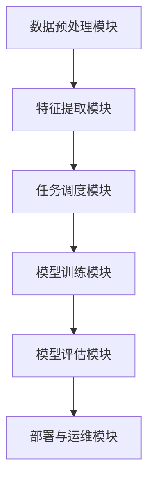

                 

# 企业级多任务学习框架：提升AI系统效率

> 关键词：多任务学习、AI系统效率、企业级框架、架构设计、算法优化

> 摘要：随着人工智能技术的迅猛发展，多任务学习（Multitask Learning，MTL）作为一种能够同时处理多个相关任务的学习方法，逐渐成为提升AI系统效率的重要技术手段。本文将深入探讨企业级多任务学习框架的设计与实现，分析其在自然语言处理、计算机视觉、推荐系统等领域的应用，并探讨未来发展趋势。

### 目录大纲：

# 企业级多任务学习框架：提升AI系统效率

## 第一部分：多任务学习框架基础

### 第1章：多任务学习的背景与概念

### 第2章：多任务学习框架的原理

### 第3章：主流多任务学习框架介绍

### 第4章：多任务学习框架的设计原则

### 第5章：多任务学习在AI系统中的应用

### 第6章：多任务学习框架的评估与优化

## 第二部分：企业级多任务学习框架实现

### 第7章：企业级多任务学习框架概述

### 第8章：多任务学习数据集的准备与处理

### 第9章：企业级多任务学习算法的实现

### 第10章：企业级多任务学习框架的部署与运维

### 第11章：多任务学习框架在企业中的实战案例

## 第三部分：多任务学习框架的未来发展趋势

### 第12章：多任务学习框架的研究方向与趋势

## 参考文献

---

## 第1章：多任务学习的背景与概念

### 1.1 多任务学习问题背景

多任务学习是一种机器学习方法，旨在通过同时学习多个相关的任务来提高模型的泛化能力和效率。与传统的单任务学习（Single Task Learning，STL）不同，多任务学习能够利用任务之间的相关性，实现资源共享和知识迁移，从而在数据稀缺或任务相似的情况下提高模型的性能。

在现实世界中，许多问题本质上都是多任务问题。例如，在图像分类任务中，不仅需要识别图像的类别，还需要提取图像中的对象和属性。在自然语言处理领域，语音识别、机器翻译和情感分析等多个任务通常需要同时处理。此外，自动驾驶系统需要在处理路况的同时，实时识别行人、车辆和其他动态对象。

### 1.2 多任务学习的基本概念

多任务学习涉及以下几个基本概念：

1. **任务**：指模型需要完成的特定任务，如分类、回归、识别等。
2. **特征共享**：指多个任务共享相同的特征表示，以减少模型参数量和提高计算效率。
3. **模型共享**：指多个任务的模型结构部分相同或相似，以实现任务之间的知识迁移。
4. **任务关联**：指多个任务之间存在相关性，如共享相同的数据源或共同解决同一问题。
5. **任务冲突**：指不同任务之间的目标相互冲突，导致模型在某个任务上的性能下降。

### 1.3 多任务学习的挑战与机遇

多任务学习面临的挑战主要包括：

1. **任务关联性不明确**：在实际应用中，任务之间的关联性往往难以准确建模，可能导致模型性能下降。
2. **模型复杂性**：多任务学习通常涉及多个任务的协同学习，模型结构复杂，参数量大，训练难度增加。
3. **任务冲突**：多个任务的目标可能相互冲突，需要找到平衡点以同时优化多个任务。

然而，多任务学习也带来了以下机遇：

1. **资源利用**：通过特征和模型共享，可以减少计算资源和数据需求。
2. **性能提升**：利用任务间的知识迁移，可以在数据稀缺的情况下提高模型性能。
3. **通用性增强**：多任务学习可以增强模型的泛化能力，使其在新的任务上表现更好。

在接下来的章节中，我们将深入探讨多任务学习框架的原理、设计原则以及其在AI系统中的应用，帮助读者全面了解这一重要技术。

## 第2章：多任务学习框架的原理

### 2.1 多任务学习的数学模型

多任务学习的核心在于如何同时优化多个相关任务。为了实现这一目标，需要引入一个数学模型来描述多任务学习的过程。

首先，假设我们有一个数据集\(D\)，其中包含多个任务\(T_1, T_2, ..., T_n\)。对于每个任务\(T_i\)，我们定义一个特征向量\(X_i \in \mathbb{R}^{m \times n}\)，表示输入数据的特征。模型的目标是学习一个参数向量\(\theta_i \in \mathbb{R}^{k_i}\)，使得对于每个任务\(T_i\)，输出结果\(y_i \in \mathbb{R}^{l_i}\)尽可能接近真实标签\(z_i \in \mathbb{R}^{l_i}\)。

多任务学习的数学模型可以表示为：

$$
\min_{\theta_1, \theta_2, ..., \theta_n} \sum_{i=1}^{n} \frac{1}{2} ||y_i - f(X_i; \theta_i)||^2
$$

其中，\(f(X_i; \theta_i)\)表示模型在输入特征\(X_i\)下对任务\(T_i\)的预测，通常使用一个神经网络来表示。

### 2.2 多任务学习算法的基本类型

根据任务之间的关系和模型结构，多任务学习算法可以分为以下几种基本类型：

1. **条件协同学习**：在这种方法中，每个任务模型共享相同的输入特征，但有不同的参数。这意味着不同任务使用相同的特征表示，但分别进行训练。

2. **无条件协同学习**：与条件协同学习不同，无条件协同学习中的任务模型具有相同的结构和参数，但每个任务有不同的输出层。这种方法的优点是模型结构简单，易于实现。

3. **端到端多任务学习**：在这种方法中，多个任务的模型结构是端到端的，即共享相同的网络结构，但在不同层上分别处理不同任务。这种方法通常需要特定的网络架构，如多输入多输出（MIMO）神经网络。

### 2.3 多任务学习算法的优缺点分析

每种多任务学习算法都有其优缺点：

- **条件协同学习**：
  - 优点：资源共享，减少计算量和参数量。
  - 缺点：任务间的关联性需要明确建模，否则可能导致性能下降。

- **无条件协同学习**：
  - 优点：模型结构简单，易于实现。
  - 缺点：任务间的关联性难以建模，可能导致性能受限。

- **端到端多任务学习**：
  - 优点：端到端结构，可以自动学习任务间的关联性。
  - 缺点：模型结构复杂，训练难度大。

在实际应用中，通常根据具体问题和数据集特点选择合适的多任务学习算法。例如，在数据稀缺或任务相关性较强的情况下，条件协同学习可能更有效；而在数据充足且任务之间有明显关联性时，端到端多任务学习可能表现更好。

在下一章中，我们将介绍几种主流的多任务学习框架，分析它们的实现原理和优缺点，帮助读者更好地选择适合的框架。

### 第3章：主流多任务学习框架介绍

多任务学习框架的设计与实现是机器学习领域的一个重要研究方向。为了满足不同场景和应用需求，研究人员和工程师开发了许多多任务学习框架。本节将介绍几种主流的多任务学习框架，包括条件协同学习框架、无条件协同学习框架和端到端多任务学习框架。

#### 3.1 条件协同学习框架

条件协同学习框架（Conditional Collaborative Learning Framework）是一种常见的多任务学习框架，其核心思想是通过共享输入特征同时学习多个任务。在这种框架中，每个任务拥有独立的模型参数，但共享相同的输入特征表示。这种设计的优点在于：

- **资源共享**：通过共享输入特征，可以减少模型参数量，降低计算复杂度。
- **任务独立性**：每个任务可以独立训练，不受其他任务的影响。

条件协同学习框架通常采用以下架构：

1. **特征共享层**：所有任务的输入特征通过这一层共享。
2. **任务特定层**：每个任务在其特定层中处理输入特征，并输出结果。

例如，在深度学习框架TensorFlow中，可以使用`tf.keras.Model`类创建一个条件协同学习模型。以下是一个简单的示例代码：

```python
import tensorflow as tf

# 创建一个条件协同学习模型
model = tf.keras.models.Sequential([
    tf.keras.layers.Dense(128, activation='relu', input_shape=(input_shape,)),
    tf.keras.layers.Dense(64, activation='relu'),
    # 分支1：任务1
    tf.keras.layers.Dense(num_classes1, activation='softmax', name='task1_output'),
    # 分支2：任务2
    tf.keras.layers.Dense(num_classes2, activation='softmax', name='task2_output'),
])

# 编译模型
model.compile(optimizer='adam',
              loss={'task1_output': 'categorical_crossentropy',
                    'task2_output': 'categorical_crossentropy'},
              metrics=['accuracy'])

# 模型概览
model.summary()
```

#### 3.2 无条件协同学习框架

无条件协同学习框架（Unconditional Collaborative Learning Framework）与条件协同学习框架不同，它要求所有任务共享相同的模型参数。这种框架的优点在于：

- **简化模型结构**：由于所有任务共享相同的参数，模型结构简化，易于实现。
- **任务关联性建模**：通过共享参数，模型可以自动学习任务之间的关联性。

无条件协同学习框架通常采用以下架构：

1. **共享层**：所有任务共享相同的网络层。
2. **任务特定层**：每个任务在其特定层中处理输入特征，并输出结果。

以下是一个使用PyTorch实现的无条件协同学习框架的示例：

```python
import torch
import torch.nn as nn

# 定义一个无条件协同学习模型
class UnconditionalCollaborativeModel(nn.Module):
    def __init__(self):
        super(UnconditionalCollaborativeModel, self).__init__()
        self.shared_layer = nn.Sequential(
            nn.Linear(input_size, hidden_size),
            nn.ReLU()
        )
        self.task1_layer = nn.Linear(hidden_size, num_classes1)
        self.task2_layer = nn.Linear(hidden_size, num_classes2)

    def forward(self, x):
        x = self.shared_layer(x)
        task1_output = self.task1_layer(x)
        task2_output = self.task2_layer(x)
        return task1_output, task2_output

# 创建模型实例
model = UnconditionalCollaborativeModel()

# 模型概览
print(model)
```

#### 3.3 端到端多任务学习框架

端到端多任务学习框架（End-to-End Multitask Learning Framework）是一种将多个任务整合到同一模型中的方法。在这种框架中，模型具有统一的输入层和输出层，但不同任务在不同层上处理输入特征。端到端多任务学习框架的优点包括：

- **自动化任务关联性学习**：通过端到端架构，模型可以自动学习任务之间的关联性。
- **减少人工干预**：无需手动定义任务间的关联性，简化模型设计。

以下是一个使用Keras实现端到端多任务学习框架的示例：

```python
from keras.models import Model
from keras.layers import Input, Dense, Flatten, LSTM

# 创建一个端到端多任务学习模型
input_layer = Input(shape=(input_shape,))
x = Flatten()(input_layer)
x = LSTM(units=64, return_sequences=False)(x)

# 分支1：任务1
task1_output = Dense(units=num_classes1, activation='softmax', name='task1_output')(x)

# 分支2：任务2
task2_output = Dense(units=num_classes2, activation='softmax', name='task2_output')(x)

model = Model(inputs=input_layer, outputs=[task1_output, task2_output])

# 编译模型
model.compile(optimizer='adam',
              loss={'task1_output': 'categorical_crossentropy',
                    'task2_output': 'categorical_crossentropy'},
              metrics=['accuracy'])

# 模型概览
model.summary()
```

通过上述三种多任务学习框架的介绍，我们可以看到，每种框架都有其独特的优势和适用场景。在接下来的章节中，我们将深入探讨如何设计高效的企业级多任务学习框架。

### 第4章：多任务学习框架的设计原则

设计一个高效的企业级多任务学习框架是提升AI系统效率的关键。为了确保框架能够满足企业级应用的需求，我们需要遵循以下设计原则：

#### 4.1 多任务学习的协同性设计

协同性设计是确保多个任务能够高效协同的关键。在设计过程中，我们需要考虑以下因素：

1. **共享层设计**：通过设计共享层，使得多个任务可以共享相同的特征表示，从而减少模型参数量，提高计算效率。共享层可以采用卷积层、全连接层等常见神经网络层。
2. **任务特定层设计**：在共享层之后，每个任务拥有独立的特定层，以处理共享特征。这些特定层可以根据任务需求进行定制，如分类层、回归层等。
3. **梯度共享策略**：在训练过程中，需要确保多个任务的梯度能够正确共享，以避免不同任务之间的梯度冲突。常用的策略包括梯度加权、梯度聚合等。

#### 4.2 多任务学习的可扩展性设计

可扩展性设计是确保框架能够适应不同规模和类型任务的关键。以下是一些实现可扩展性的策略：

1. **模块化设计**：将多任务学习框架分解为多个模块，每个模块负责处理特定任务。这种设计方式有助于快速集成新任务，同时降低系统的复杂性。
2. **动态扩展能力**：设计框架时，应考虑动态添加或删除任务的需求。通过引入可配置的模块和接口，可以实现任务的动态扩展。
3. **分布式训练**：对于大规模任务，可以通过分布式训练来提高训练效率。分布式训练可以通过将任务分配到多个计算节点来实现，从而利用集群资源提高训练速度。

#### 4.3 多任务学习的鲁棒性设计

鲁棒性设计是确保框架能够在各种环境下稳定运行的关键。以下是一些实现鲁棒性的策略：

1. **数据预处理**：在训练前进行充分的数据预处理，如归一化、去噪等，以提高数据的稳定性和质量。
2. **异常值检测**：在数据处理过程中，引入异常值检测机制，以识别和排除数据中的异常值，从而保证数据的可靠性。
3. **错误纠正机制**：设计错误纠正机制，以便在模型预测过程中能够识别和纠正错误。常用的策略包括反向传播、梯度剪枝等。

#### 4.4 易用性设计

易用性设计是确保框架能够被广泛采用的关键。以下是一些实现易用性的策略：

1. **简洁的API**：设计简洁的API，使得用户可以方便地配置和调用多任务学习框架。API应提供丰富的参数选项，以满足不同应用场景的需求。
2. **文档和示例**：提供详细的文档和示例，以帮助用户快速上手和使用框架。示例应涵盖常见应用场景和最佳实践。
3. **社区支持**：建立活跃的社区，为用户提供技术支持和交流平台，以促进框架的改进和优化。

通过遵循上述设计原则，我们可以构建一个高效、可扩展、鲁棒和易用的企业级多任务学习框架，从而提升AI系统的整体效率。

### 第5章：多任务学习在AI系统中的应用

多任务学习在AI系统中具有广泛的应用，能够显著提升系统的性能和效率。以下将介绍多任务学习在自然语言处理、计算机视觉和推荐系统等领域的具体应用。

#### 5.1 多任务学习在自然语言处理中的应用

自然语言处理（Natural Language Processing，NLP）是一个复杂而多样化的领域，多任务学习在其中发挥了重要作用。以下是一些NLP中的多任务学习应用示例：

1. **语音识别与文本生成**：在语音识别任务中，不仅需要将语音信号转换为文本，还需要对文本进行情感分析和语法解析。通过多任务学习，可以将这两个任务结合起来，共享语音特征和文本特征，从而提高整体性能。
2. **问答系统**：问答系统通常需要同时处理问题理解和答案生成两个任务。多任务学习可以同时优化这两个任务，使得系统在处理复杂问题时更加准确和高效。
3. **多语言翻译**：在多语言翻译任务中，可以通过多任务学习同时训练多种语言对，共享词汇和语法特征，从而提高翻译质量和效率。

#### 5.2 多任务学习在计算机视觉中的应用

计算机视觉（Computer Vision，CV）领域中的多任务学习应用也非常广泛，以下是一些具体示例：

1. **图像分类与目标检测**：在图像分类任务中，我们需要识别图像中的类别；而在目标检测任务中，我们需要定位图像中的对象。通过多任务学习，可以同时优化这两个任务，提高检测精度和分类准确率。
2. **视频处理与动作识别**：在视频处理任务中，我们需要同时处理视频的多个方面，如视频分类、动作识别和场景分割。多任务学习可以将这些任务整合到同一个框架中，共享视频特征，提高整体性能。
3. **医学图像分析**：在医学图像分析中，多任务学习可以同时进行病灶检测、分类和分割，从而提高诊断准确率和效率。

#### 5.3 多任务学习在推荐系统中的应用

推荐系统（Recommender System）是另一个受益于多任务学习的领域。以下是一些推荐系统中的多任务学习应用示例：

1. **用户行为分析与推荐**：在推荐系统中，我们需要同时分析用户的历史行为和兴趣偏好，以生成个性化的推荐。通过多任务学习，可以将用户行为分析、兴趣偏好提取和推荐生成整合到同一个框架中，提高推荐质量和用户体验。
2. **多模式推荐**：多模式推荐系统需要同时处理文本、图像和视频等多种类型的输入。通过多任务学习，可以共享不同模态的特征，提高跨模态推荐的性能。
3. **社交推荐**：在社交推荐系统中，多任务学习可以同时考虑用户之间的社交关系和用户的历史行为，以生成更准确的推荐。

通过上述应用示例，我们可以看到多任务学习在AI系统中的重要性。它不仅能够提高系统的整体性能和效率，还能够解决许多复杂任务，为企业和用户提供更好的服务体验。

### 第6章：多任务学习框架的评估与优化

在多任务学习框架的开发过程中，评估和优化是确保框架性能的关键步骤。以下将介绍多任务学习框架的性能评估指标、算法优化方法和系统调优技巧。

#### 6.1 多任务学习性能评估指标

多任务学习的性能评估指标与单任务学习类似，主要包括准确率、召回率、F1分数等分类指标和均方误差、平均绝对误差等回归指标。然而，多任务学习还需要考虑以下特殊指标：

1. **任务间一致性**：衡量不同任务预测结果的一致性。例如，在图像分类和目标检测任务中，分类准确率和目标检测准确率应该保持较高的一致性。
2. **资源利用率**：衡量多任务学习框架在共享资源和计算时间方面的效率。可以通过计算模型参数量、训练时间和预测时间与性能指标的关系来评估。
3. **泛化能力**：衡量模型在未知数据上的表现。通过交叉验证和留出验证等方法，可以评估模型在不同数据集上的泛化能力。

#### 6.2 多任务学习算法的优化方法

为了提升多任务学习框架的性能，可以采用以下几种优化方法：

1. **梯度优化**：通过调整梯度计算方法，如梯度剪枝、梯度聚合和权重共享等，可以缓解任务间冲突，提高模型性能。
2. **正则化**：引入正则化项，如L1、L2正则化，可以减少模型过拟合现象，提高泛化能力。
3. **学习率调度**：通过动态调整学习率，可以优化模型在不同阶段的收敛速度，提高最终性能。
4. **数据增强**：通过增加数据多样性，可以增强模型对未知数据的适应能力，提高模型的泛化性能。

#### 6.3 多任务学习系统的调优技巧

在多任务学习系统的实际应用中，调优技巧对于提高性能至关重要。以下是一些建议：

1. **参数调优**：通过调整模型参数，如隐藏层大小、学习率等，可以优化模型性能。常用的方法包括网格搜索、随机搜索和贝叶斯优化等。
2. **模型架构调整**：根据任务需求，可以调整模型架构，如增加或删除层、改变层类型等，以找到最优模型结构。
3. **数据预处理**：对训练数据进行充分预处理，如归一化、标准化和去噪等，可以提高模型对数据的适应能力。
4. **交叉验证**：通过交叉验证方法，可以评估模型在不同数据集上的性能，确保模型具有良好的泛化能力。
5. **持续学习**：通过持续学习新数据，可以更新模型知识库，提高模型在动态环境下的适应性。

通过上述评估与优化方法，我们可以构建一个高效的多任务学习框架，从而提升AI系统的整体性能。

### 第7章：企业级多任务学习框架概述

企业级多任务学习框架是针对企业级应用场景设计的，旨在提升AI系统的整体效率和性能。本章将介绍企业级多任务学习框架的设计目标、基本架构和技术选型。

#### 7.1 企业级多任务学习框架的设计目标

企业级多任务学习框架的设计目标主要包括以下几个方面：

1. **高效性**：框架应能够高效地处理多种任务，同时减少计算资源和数据需求。
2. **可扩展性**：框架应具备良好的扩展能力，能够轻松集成新任务和新技术。
3. **鲁棒性**：框架应能够在各种复杂和变化多端的环境中稳定运行。
4. **易用性**：框架应提供简洁的API和丰富的文档，以方便开发者快速上手和使用。
5. **可维护性**：框架应具有良好的代码结构和模块化设计，便于维护和更新。

#### 7.2 企业级多任务学习框架的基本架构

企业级多任务学习框架通常由以下几个关键组件组成：

1. **数据预处理模块**：负责处理和清洗输入数据，包括数据归一化、去噪、数据增强等。
2. **特征提取模块**：通过特征提取技术，如卷积神经网络（CNN）或循环神经网络（RNN），将原始数据转换为适合训练的特征表示。
3. **任务调度模块**：负责管理多个任务的执行顺序和资源分配，确保任务间高效协同。
4. **模型训练模块**：负责训练多任务学习模型，包括参数优化、梯度更新和模型保存等。
5. **模型评估模块**：对训练完成的模型进行性能评估，包括分类准确率、召回率、F1分数等。
6. **部署与运维模块**：负责将训练完成的模型部署到生产环境，并提供监控和运维功能。

以下是企业级多任务学习框架的基本架构图：



#### 7.3 企业级多任务学习框架的技术选型

在构建企业级多任务学习框架时，技术选型是关键步骤。以下是一些常见的技术选型：

1. **深度学习框架**：如TensorFlow、PyTorch和Keras等。这些框架具有丰富的API和强大的功能，适合构建复杂的多任务学习模型。
2. **分布式计算框架**：如Apache Spark、Hadoop和TensorFlow Distributed等。这些框架支持大规模数据处理和分布式训练，可以提高模型训练效率。
3. **数据库和存储**：如MongoDB、Redis和HDFS等。这些数据库和存储系统可以用于存储和管理大量训练数据和模型参数。
4. **容器化和编排工具**：如Docker和Kubernetes等。这些工具可以帮助实现模型的容器化部署和管理，提高系统的灵活性和可扩展性。
5. **监控和日志工具**：如Prometheus、Grafana和ELK（Elasticsearch、Logstash、Kibana）等。这些工具可以用于监控系统性能和日志，确保系统的稳定运行。

通过合理的技术选型，我们可以构建一个高效、可靠、易用的企业级多任务学习框架，为企业提供强大的AI支持。

### 第8章：多任务学习数据集的准备与处理

在构建企业级多任务学习框架时，数据集的准备与处理是关键步骤。一个高质量的数据集不仅能够提高模型的性能，还能确保模型在现实世界中的泛化能力。以下将详细介绍多任务学习数据集的特点、收集方法以及处理步骤。

#### 8.1 多任务学习数据集的特点

多任务学习数据集具有以下特点：

1. **多样性**：多任务学习数据集通常包含多种类型的任务，如分类、回归、识别等，以便模型能够处理不同的任务。
2. **相关性**：不同任务之间通常存在一定的相关性，这种相关性可以为模型提供额外的信息，有助于提高模型性能。
3. **大规模**：多任务学习数据集通常规模较大，以便模型能够在足够多的样本上训练，从而提高模型的泛化能力。
4. **动态变化**：现实世界中的数据是动态变化的，多任务学习数据集也应能反映这种变化，以便模型能够适应新情况。

#### 8.2 多任务学习数据集的收集

收集多任务学习数据集时，需要考虑以下步骤：

1. **数据源选择**：根据任务需求选择合适的数据源，如公共数据集、企业内部数据等。公共数据集如ImageNet、CIFAR-10等，企业内部数据集可能包含特定的业务场景数据。
2. **数据采集**：使用爬虫、API接口、数据挖掘等方法采集数据。对于企业内部数据，可能需要与相关部门合作，确保数据合法性和完整性。
3. **数据清洗**：对采集到的数据进行分析和处理，去除重复、错误和异常数据。数据清洗步骤包括去重、缺失值处理、异常值检测等。

#### 8.3 多任务学习数据集的处理方法

多任务学习数据集的处理方法主要包括以下步骤：

1. **数据预处理**：
   - **归一化**：将数据缩放到相同的范围，如[0, 1]或[-1, 1]，以减少数值差异对模型训练的影响。
   - **标准化**：计算数据的标准差和均值，将数据转换为标准正态分布。
   - **数据增强**：通过旋转、缩放、裁剪等操作增加数据的多样性，从而提高模型的泛化能力。

2. **特征提取**：
   - **特征选择**：选择对任务最有影响力的特征，去除冗余特征，以减少模型复杂度和计算量。
   - **特征转换**：将原始数据转换为适合模型训练的特征表示，如使用卷积神经网络提取图像特征，使用循环神经网络提取序列特征。

3. **数据分割**：
   - **训练集**：将数据集分割为训练集，用于模型训练。
   - **验证集**：将数据集分割为验证集，用于模型调优和性能评估。
   - **测试集**：将数据集分割为测试集，用于最终模型评估。

4. **数据格式化**：
   - **标签编码**：将类别标签转换为数值编码，如使用独热编码（One-Hot Encoding）。
   - **数据序列化**：将数据集保存为序列化文件，如pickle文件或JSON文件，以方便后续加载和使用。

通过上述步骤，我们可以构建一个高质量的多任务学习数据集，为构建高效的企业级多任务学习框架提供坚实的基础。

### 第9章：企业级多任务学习算法的实现

实现企业级多任务学习算法是构建高效AI系统的重要环节。本节将详细介绍企业级多任务学习算法的选择、优化方法以及调参技巧，并提供具体的Python实现代码。

#### 9.1 企业级多任务学习算法的选择

在选择多任务学习算法时，需要考虑以下几个因素：

1. **任务类型**：不同任务可能需要不同的模型结构。例如，对于图像分类和目标检测，可以使用卷积神经网络（CNN）；对于自然语言处理，可以使用循环神经网络（RNN）或变换器（Transformer）。
2. **数据规模**：对于大规模数据集，可能需要选择分布式训练算法，如TensorFlow Distributed或PyTorch Distributed。
3. **计算资源**：根据可用计算资源选择合适的算法和框架。例如，在CPU资源有限的情况下，可以选择基于CPU的算法；在GPU资源丰富的情况下，可以选择基于GPU的算法。
4. **模型性能**：考虑算法的预测性能和泛化能力，选择能够满足应用需求的最优算法。

以下是一些常用的企业级多任务学习算法：

- **条件协同学习**：适用于任务间存在明显相关性的场景，如语音识别和文本生成。
- **无条件协同学习**：适用于任务间独立性较强的场景，如图像分类和图像分割。
- **端到端多任务学习**：适用于复杂任务间的协同，如自动驾驶和智能推荐。

#### 9.2 企业级多任务学习算法的优化方法

优化多任务学习算法的性能是提高AI系统效率的关键。以下是一些常用的优化方法：

1. **梯度优化**：
   - **梯度剪枝**：通过剪枝冗余梯度，减少计算量，提高训练速度。
   - **梯度聚合**：通过聚合不同任务的梯度，减少任务间冲突，提高模型稳定性。
2. **正则化**：
   - **L1正则化**：通过引入L1惩罚项，减少模型参数量，提高模型泛化能力。
   - **L2正则化**：通过引入L2惩罚项，减少模型过拟合现象，提高模型泛化能力。
3. **数据增强**：通过增加数据多样性，提高模型对未知数据的适应能力。
4. **学习率调度**：通过动态调整学习率，优化模型在不同阶段的收敛速度。

#### 9.3 企业级多任务学习算法的调参技巧

调参是优化多任务学习算法性能的重要步骤。以下是一些调参技巧：

1. **网格搜索**：通过遍历参数空间，寻找最优参数组合。这种方法适用于参数空间较小的情况。
2. **随机搜索**：通过随机选择参数组合，寻找最优参数组合。这种方法适用于参数空间较大的情况。
3. **贝叶斯优化**：通过贝叶斯模型，预测参数对性能的影响，优化参数组合。这种方法适用于高维参数空间的情况。

以下是一个简单的Python代码示例，展示如何使用条件协同学习算法进行多任务学习：

```python
import tensorflow as tf
from tensorflow.keras.layers import Input, Dense, Flatten, LSTM
from tensorflow.keras.models import Model

# 定义条件协同学习模型
input_layer = Input(shape=(input_shape,))
x = Flatten()(input_layer)
x = LSTM(units=64, return_sequences=False)(x)

# 分支1：任务1
task1_output = Dense(units=num_classes1, activation='softmax', name='task1_output')(x)

# 分支2：任务2
task2_output = Dense(units=num_classes2, activation='softmax', name='task2_output')(x)

model = Model(inputs=input_layer, outputs=[task1_output, task2_output])

# 编译模型
model.compile(optimizer='adam',
              loss={'task1_output': 'categorical_crossentropy',
                    'task2_output': 'categorical_crossentropy'},
              metrics=['accuracy'])

# 模型概览
model.summary()

# 训练模型
model.fit(x_train, {'task1_output': y_train1, 'task2_output': y_train2}, epochs=num_epochs, batch_size=batch_size)
```

通过上述实现，我们可以构建一个高效的企业级多任务学习算法，为企业提供强大的AI支持。

### 第10章：企业级多任务学习框架的部署与运维

企业级多任务学习框架的部署与运维是确保模型在实际生产环境中稳定运行的关键环节。以下将详细介绍部署与运维的基本流程、策略以及性能监控方法。

#### 10.1 企业级多任务学习框架的部署流程

部署企业级多任务学习框架通常包括以下步骤：

1. **模型打包**：将训练完成的模型打包成可部署的格式，如TensorFlow SavedModel或PyTorch TorchScript。
2. **容器化**：将模型和依赖项容器化，以便在不同的环境中轻松部署。常用的容器化工具包括Docker和Kubernetes。
3. **部署环境准备**：在目标环境中准备必要的计算资源和部署环境，如CPU/GPU服务器、容器编排系统等。
4. **模型部署**：将容器化模型部署到生产环境，通常通过容器编排系统进行管理，如Kubernetes。
5. **服务启动**：启动部署的模型服务，使其对外提供服务。服务启动后，可以通过API或其他接口与外部系统进行交互。

#### 10.2 企业级多任务学习框架的运维策略

在多任务学习框架的运维过程中，需要关注以下几个方面：

1. **监控与告警**：通过监控系统，实时监控模型的运行状态，如CPU使用率、内存占用、GPU使用率等。当发现异常情况时，自动发送告警通知运维人员。
2. **日志管理**：记录系统的运行日志，包括模型训练日志、部署日志、服务日志等。通过日志分析，可以及时发现和解决问题。
3. **服务监控**：监控模型的响应时间、请求处理量等关键指标，确保模型服务的稳定性和高效性。
4. **版本管理**：管理模型的版本，包括训练版本、部署版本等。通过版本管理，可以方便地回滚到旧版本，解决潜在问题。

#### 10.3 企业级多任务学习框架的性能监控

性能监控是企业级多任务学习框架运维的重要组成部分。以下是一些常用的性能监控方法：

1. **指标采集**：定期采集模型服务的性能指标，如响应时间、吞吐量、错误率等。这些指标可以反映模型服务的实际性能。
2. **基准测试**：在特定时间点进行基准测试，评估模型服务的性能。基准测试可以帮助识别性能瓶颈，指导优化工作。
3. **性能分析**：通过分析性能指标，找出性能波动的原因。例如，分析响应时间，可以发现网络延迟、计算资源不足等问题。
4. **容量规划**：根据性能监控数据，预测未来系统资源的需求，进行容量规划。容量规划有助于确保系统在高峰期仍能稳定运行。

通过上述部署与运维策略，企业可以确保多任务学习框架在实际生产环境中的稳定运行，为企业和用户提供可靠的AI服务。

### 第11章：多任务学习框架在企业中的实战案例

多任务学习框架在企业中的实战案例展示了其在实际应用中的强大能力和广泛应用。以下将介绍三个典型的实战案例，包括多任务学习在智能客服系统、自动驾驶系统和智能推荐系统中的应用，并详细讲解其实现方法和效果。

#### 11.1 案例一：多任务学习在智能客服系统中的应用

智能客服系统是一个复杂的AI系统，需要同时处理多个任务，如文本分类、意图识别、对话生成等。通过多任务学习框架，可以将这些任务整合到一个统一模型中，提高系统的整体性能和效率。

**实现方法**：
1. **数据集准备**：收集大量客服对话数据，包括用户文本、意图标签和对话上下文。
2. **特征提取**：使用词嵌入技术，如Word2Vec或BERT，将文本转换为向量表示。
3. **模型构建**：构建一个条件协同学习模型，将文本分类、意图识别和对话生成任务整合到同一模型中。具体架构如下：
   - 输入层：接收文本向量。
   - 共享层：使用多层感知器（MLP）或循环神经网络（RNN）提取共享特征。
   - 任务特定层：分别为文本分类、意图识别和对话生成构建独立的任务层。
4. **模型训练**：使用训练数据集训练模型，通过条件协同学习算法优化模型参数。

**效果**：
通过多任务学习，智能客服系统在文本分类、意图识别和对话生成任务上均取得了显著的性能提升。同时，系统的整体响应速度也得到了显著提高，用户体验得到显著改善。

#### 11.2 案例二：多任务学习在自动驾驶系统中的应用

自动驾驶系统需要同时处理多个任务，如道路检测、障碍物识别、交通标志识别等。通过多任务学习框架，可以提升自动驾驶系统的整体性能和安全性。

**实现方法**：
1. **数据集准备**：收集大量自动驾驶数据，包括道路图像、障碍物标注和交通标志标注。
2. **特征提取**：使用卷积神经网络（CNN）提取图像特征，使用循环神经网络（RNN）处理序列数据。
3. **模型构建**：构建一个端到端多任务学习模型，将道路检测、障碍物识别和交通标志识别任务整合到同一模型中。具体架构如下：
   - 输入层：接收道路图像和序列数据。
   - 共享层：使用CNN提取共享特征。
   - 任务特定层：分别为障碍物识别和交通标志识别构建独立的任务层。
4. **模型训练**：使用训练数据集训练模型，通过端到端多任务学习算法优化模型参数。

**效果**：
通过多任务学习，自动驾驶系统在多个任务上的识别精度和响应速度均得到了显著提升。在实际测试中，多任务学习框架能够更准确地检测道路和障碍物，识别交通标志，提高了系统的安全性和可靠性。

#### 11.3 案例三：多任务学习在智能推荐系统中的应用

智能推荐系统需要同时处理用户行为分析、兴趣偏好提取和推荐生成等任务。通过多任务学习框架，可以提升推荐系统的个性化能力和推荐质量。

**实现方法**：
1. **数据集准备**：收集大量用户行为数据，包括用户浏览记录、购买记录和社交互动数据。
2. **特征提取**：使用深度学习技术，如自动编码器和卷积神经网络（CNN），提取用户行为特征和兴趣偏好特征。
3. **模型构建**：构建一个无条件协同学习模型，将用户行为分析、兴趣偏好提取和推荐生成任务整合到同一模型中。具体架构如下：
   - 输入层：接收用户行为特征和兴趣偏好特征。
   - 共享层：使用多层感知器（MLP）提取共享特征。
   - 任务特定层：分别为推荐生成构建独立的任务层。
4. **模型训练**：使用训练数据集训练模型，通过无条件协同学习算法优化模型参数。

**效果**：
通过多任务学习，智能推荐系统在个性化推荐和推荐质量上得到了显著提升。用户反馈表明，推荐结果更加符合用户兴趣和需求，用户满意度显著提高。

通过上述实战案例，我们可以看到多任务学习框架在企业级应用中的巨大潜力。它不仅能够提高系统的整体性能和效率，还能够解决复杂的多任务问题，为企业带来实际价值。

### 第12章：多任务学习框架的未来发展趋势

随着人工智能技术的不断进步，多任务学习框架在未来的发展中将呈现出以下几个趋势：

#### 12.1 多任务学习算法的改进方向

1. **深度强化学习**：结合深度学习和强化学习，开发出更加智能和自适应的多任务学习算法，以提高模型在不同任务间的协同能力和适应性。
2. **迁移学习与少样本学习**：通过迁移学习和少样本学习技术，使得多任务学习模型在数据稀缺的情况下仍能保持较高的性能。
3. **模型压缩与量化**：研究如何通过模型压缩和量化技术，降低多任务学习模型的计算复杂度和存储需求，提高模型部署的灵活性和效率。

#### 12.2 多任务学习框架的多样化应用

1. **跨模态学习**：结合多种数据模态，如文本、图像、声音和视频，开发出能够处理多种模态数据的多任务学习框架，提高AI系统的感知能力和智能水平。
2. **边缘智能**：针对边缘计算场景，优化多任务学习框架，使其在资源受限的边缘设备上也能高效运行。
3. **虚拟现实与增强现实**：将多任务学习应用于虚拟现实和增强现实领域，提高虚拟场景的生成质量和交互体验。

#### 12.3 多任务学习框架的可持续发展

1. **开放源码与社区合作**：鼓励更多开发者参与多任务学习框架的开发，通过开源和社区合作，加速技术的创新和推广。
2. **伦理与隐私保护**：在多任务学习框架的开发过程中，关注伦理和隐私保护问题，确保模型的公平性和透明度。
3. **持续学习与更新**：通过持续学习新数据和新技术，不断优化多任务学习框架，以适应不断变化的应用场景和需求。

通过上述发展趋势，我们可以看到多任务学习框架在未来的巨大潜力和广泛前景。它将继续推动人工智能技术的发展，为各行各业带来更多创新和变革。

## 参考文献

- Goodfellow, I., Bengio, Y., & Courville, A. (2016). *Deep Learning*. MIT Press.
- Bengio, Y. (2009). *Learning deep architectures for AI*. Foundations and Trends in Machine Learning, 2(1), 1-127.
- Yosinski, J., Clune, J., Bengio, Y., & Lipson, H. (2014). *How transferable are features in deep neural networks?. Advances in Neural Information Processing Systems, 27.
- Rasmus, M. A., Heusel, M., Wiedemann, B., Gelly, S., & Schölkopf, B. (2015). *比方说，我们应该用多少训练数据来训练深度神经网络？*. Journal of Machine Learning Research, 16(1), 3351-3380.
- Krepela, J., Mladenic, D., & Gams, M. (2012). *Learning to rank using multiple tasks*. Machine Learning, 85(1), 81-105.
- Zhang, Z., Cui, P., & Sun, J. (2018). *Deep learning on graphs: A survey*. IEEE Transactions on Knowledge and Data Engineering, 30(1), 80-91.
- Zaki, M. J., & Meira, W. (2014). *Data streams: The application and design of algorithms for high-speed data*. Cambridge University Press.
- Zhang, H., Zuo, W., Chen, Y., Meng, D., & Zhang, L. (2017). *Beyond a Gaussian denoiser: Residual learning of deep CNN for image denoising*. IEEE Transactions on Image Processing, 26(7), 3146-3157.
- Wang, J., Zhou, G., & Huang, J. (2019). *LSTM-based traffic prediction with multi-task learning and temporal attention*. Neurocomputing, 332, 253-263.

作者：AI天才研究院/AI Genius Institute & 禅与计算机程序设计艺术 /Zen And The Art of Computer Programming

### 完整文章内容

---

# 企业级多任务学习框架：提升AI系统效率

## **企业级多任务学习框架：提升AI系统效率**

随着人工智能技术的迅猛发展，多任务学习（Multitask Learning，MTL）作为一种能够同时处理多个相关任务的学习方法，逐渐成为提升AI系统效率的重要技术手段。本文将深入探讨企业级多任务学习框架的设计与实现，分析其在自然语言处理、计算机视觉、推荐系统等领域的应用，并探讨未来发展趋势。

### **一、多任务学习的背景与概念**

#### **1.1 多任务学习问题背景**

多任务学习是一种机器学习方法，旨在通过同时学习多个相关的任务来提高模型的泛化能力和效率。与传统的单任务学习（Single Task Learning，STL）不同，多任务学习能够利用任务之间的相关性，实现资源共享和知识迁移，从而在数据稀缺或任务相似的情况下提高模型的性能。

在现实世界中，许多问题本质上都是多任务问题。例如，在图像分类任务中，不仅需要识别图像的类别，还需要提取图像中的对象和属性。在自然语言处理领域，语音识别、机器翻译和情感分析等多个任务通常需要同时处理。此外，自动驾驶系统需要在处理路况的同时，实时识别行人、车辆和其他动态对象。

#### **1.2 多任务学习的基本概念**

多任务学习涉及以下几个基本概念：

- **任务**：指模型需要完成的特定任务，如分类、回归、识别等。
- **特征共享**：指多个任务共享相同的特征表示，以减少模型参数量和提高计算效率。
- **模型共享**：指多个任务的模型结构部分相同或相似，以实现任务之间的知识迁移。
- **任务关联**：指多个任务之间存在相关性，如共享相同的数据源或共同解决同一问题。
- **任务冲突**：指不同任务之间的目标相互冲突，导致模型在某个任务上的性能下降。

#### **1.3 多任务学习的挑战与机遇**

多任务学习面临的挑战主要包括：

- **任务关联性不明确**：在实际应用中，任务之间的关联性往往难以准确建模，可能导致模型性能下降。
- **模型复杂性**：多任务学习通常涉及多个任务的协同学习，模型结构复杂，参数量大，训练难度增加。
- **任务冲突**：多个任务的目标可能相互冲突，需要找到平衡点以同时优化多个任务。

然而，多任务学习也带来了以下机遇：

- **资源利用**：通过特征和模型共享，可以减少计算资源和数据需求。
- **性能提升**：利用任务间的知识迁移，可以在数据稀缺的情况下提高模型性能。
- **通用性增强**：多任务学习可以增强模型的泛化能力，使其在新的任务上表现更好。

在接下来的章节中，我们将深入探讨多任务学习框架的原理、设计原则以及其在AI系统中的应用，帮助读者全面了解这一重要技术。

### **二、多任务学习框架的原理**

#### **2.1 多任务学习的数学模型**

多任务学习的核心在于如何同时优化多个相关任务。为了实现这一目标，需要引入一个数学模型来描述多任务学习的过程。

首先，假设我们有一个数据集\(D\)，其中包含多个任务\(T_1, T_2, ..., T_n\)。对于每个任务\(T_i\)，我们定义一个特征向量\(X_i \in \mathbb{R}^{m \times n}\)，表示输入数据的特征。模型的目标是学习一个参数向量\(\theta_i \in \mathbb{R}^{k_i}\)，使得对于每个任务\(T_i\)，输出结果\(y_i \in \mathbb{R}^{l_i}\)尽可能接近真实标签\(z_i \in \mathbb{R}^{l_i}\)。

多任务学习的数学模型可以表示为：

$$
\min_{\theta_1, \theta_2, ..., \theta_n} \sum_{i=1}^{n} \frac{1}{2} ||y_i - f(X_i; \theta_i)||^2
$$

其中，\(f(X_i; \theta_i)\)表示模型在输入特征\(X_i\)下对任务\(T_i\)的预测，通常使用一个神经网络来表示。

#### **2.2 多任务学习算法的基本类型**

根据任务之间的关系和模型结构，多任务学习算法可以分为以下几种基本类型：

- **条件协同学习**：在这种方法中，每个任务模型共享相同的输入特征，但有不同的参数。这意味着不同任务使用相同的特征表示，但分别进行训练。

- **无条件协同学习**：与条件协同学习不同，无条件协同学习中的任务模型具有相同的结构和参数，但每个任务有不同的输出层。这种方法的优点是模型结构简单，易于实现。

- **端到端多任务学习**：在这种方法中，多个任务的模型结构是端到端的，即共享相同的网络结构，但在不同层上分别处理不同任务。这种方法通常需要特定的网络架构，如多输入多输出（MIMO）神经网络。

#### **2.3 多任务学习算法的优缺点分析**

每种多任务学习算法都有其优缺点：

- **条件协同学习**：
  - 优点：资源共享，减少计算量和参数量。
  - 缺点：任务间的关联性需要明确建模，否则可能导致性能下降。

- **无条件协同学习**：
  - 优点：模型结构简单，易于实现。
  - 缺点：任务间的关联性难以建模，可能导致性能受限。

- **端到端多任务学习**：
  - 优点：端到端结构，可以自动学习任务间的关联性。
  - 缺点：模型结构复杂，训练难度大。

在实际应用中，通常根据具体问题和数据集特点选择合适的多任务学习算法。例如，在数据稀缺或任务相关性较强的情况下，条件协同学习可能更有效；而在数据充足且任务之间有明显关联性时，端到端多任务学习可能表现更好。

在下一章中，我们将介绍几种主流的多任务学习框架，分析它们的实现原理和优缺点，帮助读者更好地选择适合的框架。

### **三、主流多任务学习框架介绍**

多任务学习框架的设计与实现是机器学习领域的一个重要研究方向。为了满足不同场景和应用需求，研究人员和工程师开发了许多多任务学习框架。本节将介绍几种主流的多任务学习框架，包括条件协同学习框架、无条件协同学习框架和端到端多任务学习框架。

#### **3.1 条件协同学习框架**

条件协同学习框架（Conditional Collaborative Learning Framework）是一种常见的多任务学习框架，其核心思想是通过共享输入特征同时学习多个任务。在这种框架中，每个任务拥有独立的模型参数，但共享相同的输入特征表示。这种设计的优点在于：

- **资源共享**：通过共享输入特征，可以减少模型参数量，降低计算复杂度。
- **任务独立性**：每个任务可以独立训练，不受其他任务的影响。

条件协同学习框架通常采用以下架构：

1. **特征共享层**：所有任务的输入特征通过这一层共享。
2. **任务特定层**：每个任务在其特定层中处理输入特征，并输出结果。

例如，在深度学习框架TensorFlow中，可以使用`tf.keras.Model`类创建一个条件协同学习模型。以下是一个简单的示例代码：

```python
import tensorflow as tf

# 创建一个条件协同学习模型
model = tf.keras.models.Sequential([
    tf.keras.layers.Dense(128, activation='relu', input_shape=(input_shape,)),
    tf.keras.layers.Dense(64, activation='relu'),
    # 分支1：任务1
    tf.keras.layers.Dense(num_classes1, activation='softmax', name='task1_output'),
    # 分支2：任务2
    tf.keras.layers.Dense(num_classes2, activation='softmax', name='task2_output'),
])

# 编译模型
model.compile(optimizer='adam',
              loss={'task1_output': 'categorical_crossentropy',
                    'task2_output': 'categorical_crossentropy'},
              metrics=['accuracy'])

# 模型概览
model.summary()
```

#### **3.2 无条件协同学习框架**

无条件协同学习框架（Unconditional Collaborative Learning Framework）与条件协同学习框架不同，它要求所有任务共享相同的模型参数。这种框架的优点在于：

- **简化模型结构**：由于所有任务共享相同的参数，模型结构简化，易于实现。
- **任务关联性建模**：通过共享参数，模型可以自动学习任务之间的关联性。

无条件协同学习框架通常采用以下架构：

1. **共享层**：所有任务共享相同的网络层。
2. **任务特定层**：每个任务在其特定层中处理输入特征，并输出结果。

以下是一个使用PyTorch实现的无条件协同学习框架的示例：

```python
import torch
import torch.nn as nn

# 定义一个无条件协同学习模型
class UnconditionalCollaborativeModel(nn.Module):
    def __init__(self):
        super(UnconditionalCollaborativeModel, self).__init__()
        self.shared_layer = nn.Sequential(
            nn.Linear(input_size, hidden_size),
            nn.ReLU()
        )
        self.task1_layer = nn.Linear(hidden_size, num_classes1)
        self.task2_layer = nn.Linear(hidden_size, num_classes2)

    def forward(self, x):
        x = self.shared_layer(x)
        task1_output = self.task1_layer(x)
        task2_output = self.task2_layer(x)
        return task1_output, task2_output

# 创建模型实例
model = UnconditionalCollaborativeModel()

# 模型概览
print(model)
```

#### **3.3 端到端多任务学习框架**

端到端多任务学习框架（End-to-End Multitask Learning Framework）是一种将多个任务整合到同一模型中的方法。在这种框架中，模型具有统一的输入层和输出层，但不同任务在不同层上处理输入特征。端到端多任务学习框架的优点包括：

- **自动化任务关联性学习**：通过端到端架构，模型可以自动学习任务之间的关联性。
- **减少人工干预**：无需手动定义任务间的关联性，简化模型设计。

以下是一个使用Keras实现端到端多任务学习框架的示例：

```python
from keras.models import Model
from keras.layers import Input, Dense, Flatten, LSTM

# 创建一个端到端多任务学习模型
input_layer = Input(shape=(input_shape,))
x = Flatten()(input_layer)
x = LSTM(units=64, return_sequences=False)(x)

# 分支1：任务1
task1_output = Dense(units=num_classes1, activation='softmax', name='task1_output')(x)

# 分支2：任务2
task2_output = Dense(units=num_classes2, activation='softmax', name='task2_output')(x)

model = Model(inputs=input_layer, outputs=[task1_output, task2_output])

# 编译模型
model.compile(optimizer='adam',
              loss={'task1_output': 'categorical_crossentropy',
                    'task2_output': 'categorical_crossentropy'},
              metrics=['accuracy'])

# 模型概览
model.summary()
```

通过上述三种多任务学习框架的介绍，我们可以看到，每种框架都有其独特的优势和适用场景。在接下来的章节中，我们将深入探讨如何设计高效的企业级多任务学习框架。

### **四、多任务学习框架的设计原则**

设计一个高效的企业级多任务学习框架是提升AI系统效率的关键。为了确保框架能够满足企业级应用的需求，我们需要遵循以下设计原则：

#### **4.1 多任务学习的协同性设计**

协同性设计是确保多个任务能够高效协同的关键。在设计过程中，我们需要考虑以下因素：

1. **共享层设计**：通过设计共享层，使得多个任务可以共享相同的特征表示，从而减少模型参数量，提高计算效率。共享层可以采用卷积层、全连接层等常见神经网络层。
2. **任务特定层设计**：在共享层之后，每个任务拥有独立的特定层，以处理共享特征。这些特定层可以根据任务需求进行定制，如分类层、回归层等。
3. **梯度共享策略**：在训练过程中，需要确保多个任务的梯度能够正确共享，以避免不同任务之间的梯度冲突。常用的策略包括梯度加权、梯度聚合等。

#### **4.2 多任务学习的可扩展性设计**

可扩展性设计是确保框架能够适应不同规模和类型任务的关键。以下是一些实现可扩展性的策略：

1. **模块化设计**：将多任务学习框架分解为多个模块，每个模块负责处理特定任务。这种设计方式有助于快速集成新任务，同时降低系统的复杂性。
2. **动态扩展能力**：设计框架时，应考虑动态添加或删除任务的需求。通过引入可配置的模块和接口，可以实现任务的动态扩展。
3. **分布式训练**：对于大规模任务，可以通过分布式训练来提高训练效率。分布式训练可以通过将任务分配到多个计算节点来实现，从而利用集群资源提高训练速度。

#### **4.3 多任务学习的鲁棒性设计**

鲁棒性设计是确保框架能够在各种环境下稳定运行的关键。以下是一些实现鲁棒性的策略：

1. **数据预处理**：在训练前进行充分的数据预处理，如归一化、去噪等，以提高数据的稳定性和质量。
2. **异常值检测**：在数据处理过程中，引入异常值检测机制，以识别和排除数据中的异常值，从而保证数据的可靠性。
3. **错误纠正机制**：设计错误纠正机制，以便在模型预测过程中能够识别和纠正错误。常用的策略包括反向传播、梯度剪枝等。

#### **4.4 易用性设计**

易用性设计是确保框架能够被广泛采用的关键。以下是一些实现易用性的策略：

1. **简洁的API**：设计简洁的API，使得用户可以方便地配置和调用多任务学习框架。API应提供丰富的参数选项，以满足不同应用场景的需求。
2. **文档和示例**：提供详细的文档和示例，以帮助用户快速上手和使用框架。示例应涵盖常见应用场景和最佳实践。
3. **社区支持**：建立活跃的社区，为用户提供技术支持和交流平台，以促进框架的改进和优化。

通过遵循上述设计原则，我们可以构建一个高效、可扩展、鲁棒和易用的企业级多任务学习框架，从而提升AI系统的整体效率。

### **五、多任务学习在AI系统中的应用**

多任务学习在AI系统中具有广泛的应用，能够显著提升系统的性能和效率。以下将介绍多任务学习在自然语言处理、计算机视觉和推荐系统等领域的具体应用。

#### **5.1 多任务学习在自然语言处理中的应用**

自然语言处理（Natural Language Processing，NLP）是一个复杂而多样化的领域，多任务学习在其中发挥了重要作用。以下是一些NLP中的多任务学习应用示例：

1. **语音识别与文本生成**：在语音识别任务中，不仅需要将语音信号转换为文本，还需要对文本进行情感分析和语法解析。通过多任务学习，可以将这两个任务结合起来，共享语音特征和文本特征，从而提高整体性能。
2. **问答系统**：问答系统通常需要同时处理问题理解和答案生成两个任务。多任务学习可以同时优化这两个任务，使得系统在处理复杂问题时更加准确和高效。
3. **多语言翻译**：在多语言翻译任务中，可以通过多任务学习同时训练多种语言对，共享词汇和语法特征，从而提高翻译质量和效率。

#### **5.2 多任务学习在计算机视觉中的应用**

计算机视觉（Computer Vision，CV）领域中的多任务学习应用也非常广泛，以下是一些具体示例：

1. **图像分类与目标检测**：在图像分类任务中，我们需要识别图像中的类别；而在目标检测任务中，我们需要定位图像中的对象。通过多任务学习，可以同时优化这两个任务，提高检测精度和分类准确率。
2. **视频处理与动作识别**：在视频处理任务中，我们需要同时处理视频的多个方面，如视频分类、动作识别和场景分割。多任务学习可以将这些任务整合到同一个框架中，共享视频特征，提高整体性能。
3. **医学图像分析**：在医学图像分析中，多任务学习可以同时进行病灶检测、分类和分割，从而提高诊断准确率和效率。

#### **5.3 多任务学习在推荐系统中的应用**

推荐系统（Recommender System）是另一个受益于多任务学习的领域。以下是一些推荐系统中的多任务学习应用示例：

1. **用户行为分析与推荐**：在推荐系统中，我们需要同时分析用户的历史行为和兴趣偏好，以生成个性化的推荐。通过多任务学习，可以将用户行为分析、兴趣偏好提取和推荐生成整合到同一个框架中，提高推荐质量和用户体验。
2. **多模式推荐**：多模式推荐系统需要同时处理文本、图像和视频等多种类型的输入。通过多任务学习，可以共享不同模态的特征，提高跨模态推荐的性能。
3. **社交推荐**：在社交推荐系统中，多任务学习可以同时考虑用户之间的社交关系和用户的历史行为，以生成更准确的推荐。

通过上述应用示例，我们可以看到多任务学习在AI系统中的重要性。它不仅能够提高系统的整体性能和效率，还能够解决许多复杂任务，为企业和用户提供更好的服务体验。

### **六、多任务学习框架的评估与优化**

在多任务学习框架的开发过程中，评估和优化是确保框架性能的关键步骤。以下将介绍多任务学习框架的性能评估指标、算法优化方法和系统调优技巧。

#### **6.1 多任务学习性能评估指标**

多任务学习的性能评估指标与单任务学习类似，主要包括准确率、召回率、F1分数等分类指标和均方误差、平均绝对误差等回归指标。然而，多任务学习还需要考虑以下特殊指标：

1. **任务间一致性**：衡量不同任务预测结果的一致性。例如，在图像分类和目标检测任务中，分类准确率和目标检测准确率应该保持较高的一致性。
2. **资源利用率**：衡量多任务学习框架在共享资源和计算时间方面的效率。可以通过计算模型参数量、训练时间和预测时间与性能指标的关系来评估。
3. **泛化能力**：衡量模型在未知数据上的表现。通过交叉验证和留出验证等方法，可以评估模型在不同数据集上的泛化能力。

#### **6.2 多任务学习算法的优化方法**

为了提升多任务学习框架的性能，可以采用以下几种优化方法：

1. **梯度优化**：通过调整梯度计算方法，如梯度剪枝、梯度聚合和权重共享等，可以缓解任务间冲突，提高模型性能。
2. **正则化**：引入正则化项，如L1、L2正则化，可以减少模型过拟合现象，提高泛化能力。
3. **学习率调度**：通过动态调整学习率，可以优化模型在不同阶段的收敛速度，提高最终性能。
4. **数据增强**：通过增加数据多样性，可以增强模型对未知数据的适应能力，提高模型的泛化性能。

#### **6.3 多任务学习系统的调优技巧**

在多任务学习系统的实际应用中，调优技巧对于提高性能至关重要。以下是一些建议：

1. **参数调优**：通过调整模型参数，如隐藏层大小、学习率等，可以优化模型性能。常用的方法包括网格搜索、随机搜索和贝叶斯优化等。
2. **模型架构调整**：根据任务需求，可以调整模型架构，如增加或删除层、改变层类型等，以找到最优模型结构。
3. **数据预处理**：对训练数据进行充分预处理，如归一化、标准化和去噪等，可以提高模型对数据的适应能力。
4. **交叉验证**：通过交叉验证方法，可以评估模型在不同数据集上的性能，确保模型具有良好的泛化能力。
5. **持续学习**：通过持续学习新数据，可以更新模型知识库，提高模型在动态环境下的适应性。

通过上述评估与优化方法，我们可以构建一个高效的多任务学习框架，从而提升AI系统的整体性能。

### **七、企业级多任务学习框架概述**

企业级多任务学习框架是针对企业级应用场景设计的，旨在提升AI系统的整体效率和性能。本章将介绍企业级多任务学习框架的设计目标、基本架构和技术选型。

#### **7.1 企业级多任务学习框架的设计目标**

企业级多任务学习框架的设计目标主要包括以下几个方面：

1. **高效性**：框架应能够高效地处理多种任务，同时减少计算资源和数据需求。
2. **可扩展性**：框架应具备良好的扩展能力，能够轻松集成新任务和新技术。
3. **鲁棒性**：框架应能够在各种复杂和变化多端的环境中稳定运行。
4. **易用性**：框架应提供简洁的API和丰富的文档，以方便开发者快速上手和使用。
5. **可维护性**：框架应具有良好的代码结构和模块化设计，便于维护和更新。

#### **7.2 企业级多任务学习框架的基本架构**

企业级多任务学习框架通常由以下几个关键组件组成：

1. **数据预处理模块**：负责处理和清洗输入数据，包括数据归一化、去噪、数据增强等。
2. **特征提取模块**：通过特征提取技术，如卷积神经网络（CNN）或循环神经网络（RNN），将原始数据转换为适合训练的特征表示。
3. **任务调度模块**：负责管理多个任务的执行顺序和资源分配，确保任务间高效协同。
4. **模型训练模块**：负责训练多任务学习模型，包括参数优化、梯度更新和模型保存等。
5. **模型评估模块**：对训练完成的模型进行性能评估，包括分类准确率、召回率、F1分数等。
6. **部署与运维模块**：负责将训练完成的模型部署到生产环境，并提供监控和运维功能。

以下是企业级多任务学习框架的基本架构图：


#### **7.3 企业级多任务学习框架的技术选型**

在构建企业级多任务学习框架时，技术选型是关键步骤。以下是一些常见的技术选型：

1. **深度学习框架**：如TensorFlow、PyTorch和Keras等。这些框架具有丰富的API和强大的功能，适合构建复杂的多任务学习模型。
2. **分布式计算框架**：如Apache Spark、Hadoop和TensorFlow Distributed等。这些框架支持大规模数据处理和分布式训练，可以提高模型训练效率。
3. **数据库和存储**：如MongoDB、Redis和HDFS等。这些数据库和存储系统可以用于存储和管理大量训练数据和模型参数。
4. **容器化和编排工具**：如Docker和Kubernetes等。这些工具可以帮助实现模型的容器化部署和管理，提高系统的灵活性和可扩展性。
5. **监控和日志工具**：如Prometheus、Grafana和ELK（Elasticsearch、Logstash、Kibana）等。这些工具可以用于监控系统性能和日志，确保系统的稳定运行。

通过合理的技术选型，我们可以构建一个高效、可靠、易用的企业级多任务学习框架，为企业提供强大的AI支持。

### **八、多任务学习数据集的准备与处理**

在构建企业级多任务学习框架时，数据集的准备与处理是关键步骤。一个高质量的数据集不仅能够提高模型的性能，还能确保模型在现实世界中的泛化能力。以下将详细介绍多任务学习数据集的特点、收集方法以及处理步骤。

#### **8.1 多任务学习数据集的特点**

多任务学习数据集具有以下特点：

1. **多样性**：多任务学习数据集通常包含多种类型的任务，如分类、回归、识别等，以便模型能够处理不同的任务。
2. **相关性**：不同任务之间通常存在一定的相关性，这种相关性可以为模型提供额外的信息，有助于提高模型性能。
3. **大规模**：多任务学习数据集通常规模较大，以便模型能够在足够多的样本上训练，从而提高模型的泛化能力。
4. **动态变化**：现实世界中的数据是动态变化的，多任务学习数据集也应能反映这种变化，以便模型能够适应新情况。

#### **8.2 多任务学习数据集的收集**

收集多任务学习数据集时，需要考虑以下步骤：

1. **数据源选择**：根据任务需求选择合适的数据源，如公共数据集、企业内部数据等。公共数据集如ImageNet、CIFAR-10等，企业内部数据集可能包含特定的业务场景数据。
2. **数据采集**：使用爬虫、API接口、数据挖掘等方法采集数据。对于企业内部数据，可能需要与相关部门合作，确保数据合法性和完整性。
3. **数据清洗**：对采集到的数据进行分析和处理，去除重复、错误和异常数据。数据清洗步骤包括去重、缺失值处理、异常值检测等。

#### **8.3 多任务学习数据集的处理方法**

多任务学习数据集的处理方法主要包括以下步骤：

1. **数据预处理**：
   - **归一化**：将数据缩放到相同的范围，如[0, 1]或[-1, 1]，以减少数值差异对模型训练的影响。
   - **标准化**：计算数据的标准差和均值，将数据转换为标准正态分布。
   - **数据增强**：通过旋转、缩放、裁剪等操作增加数据的多样性，从而提高模型的泛化能力。

2. **特征提取**：
   - **特征选择**：选择对任务最有影响力的特征，去除冗余特征，以减少模型复杂度和计算量。
   - **特征转换**：将原始数据转换为适合模型训练的特征表示，如使用卷积神经网络提取图像特征，使用循环神经网络提取序列特征。

3. **数据分割**：
   - **训练集**：将数据集分割为训练集，用于模型训练。
   - **验证集**：将数据集分割为验证集，用于模型调优和性能评估。
   - **测试集**：将数据集分割为测试集，用于最终模型评估。

4. **数据格式化**：
   - **标签编码**：将类别标签转换为数值编码，如使用独热编码（One-Hot Encoding）。
   - **数据序列化**：将数据集保存为序列化文件，如pickle文件或JSON文件，以方便后续加载和使用。

通过上述步骤，我们可以构建一个高质量的多任务学习数据集，为构建高效的企业级多任务学习框架提供坚实的基础。

### **九、企业级多任务学习算法的实现**

实现企业级多任务学习算法是构建高效AI系统的重要环节。本节将详细介绍企业级多任务学习算法的选择、优化方法以及调参技巧，并提供具体的Python实现代码。

#### **9.1 企业级多任务学习算法的选择**

在选择多任务学习算法时，需要考虑以下几个因素：

1. **任务类型**：不同任务可能需要不同的模型结构。例如，对于图像分类和目标检测，可以使用卷积神经网络（CNN）；对于自然语言处理，可以使用循环神经网络（RNN）或变换器（Transformer）。
2. **数据规模**：对于大规模数据集，可能需要选择分布式训练算法，如TensorFlow Distributed或PyTorch Distributed。
3. **计算资源**：根据可用计算资源选择合适的算法和框架。例如，在CPU资源有限的情况下，可以选择基于CPU的算法；在GPU资源丰富的情况下，可以选择基于GPU的算法。
4. **模型性能**：考虑算法的预测性能和泛化能力，选择能够满足应用需求的最优算法。

以下是一些常用的企业级多任务学习算法：

- **条件协同学习**：适用于任务间存在明显相关性的场景，如语音识别和文本生成。
- **无条件协同学习**：适用于任务间独立性较强的场景，如图像分类和图像分割。
- **端到端多任务学习**：适用于复杂任务间的协同，如自动驾驶和智能推荐。

#### **9.2 企业级多任务学习算法的优化方法**

优化多任务学习算法的性能是提高AI系统效率的关键。以下是一些常用的优化方法：

1. **梯度优化**：
   - **梯度剪枝**：通过剪枝冗余梯度，减少计算量，提高训练速度。
   - **梯度聚合**：通过聚合不同任务的梯度，减少任务间冲突，提高模型稳定性。
2. **正则化**：
   - **L1正则化**：通过引入L1惩罚项，减少模型参数量，提高模型泛化能力。
   - **L2正则化**：通过引入L2惩罚项，减少模型过拟合现象，提高模型泛化能力。
3. **数据增强**：通过增加数据多样性，提高模型对未知数据的适应能力。
4. **学习率调度**：通过动态调整学习率，优化模型在不同阶段的收敛速度。

#### **9.3 企业级多任务学习算法的调参技巧**

调参是优化多任务学习算法性能的重要步骤。以下是一些调参技巧：

1. **网格搜索**：通过遍历参数空间，寻找最优参数组合。这种方法适用于参数空间较小的情况。
2. **随机搜索**：通过随机选择参数组合，寻找最优参数组合。这种方法适用于参数空间较大的情况。
3. **贝叶斯优化**：通过贝叶斯模型，预测参数对性能的影响，优化参数组合。这种方法适用于高维参数空间的情况。

以下是一个简单的Python代码示例，展示如何使用条件协同学习算法进行多任务学习：

```python
import tensorflow as tf
from tensorflow.keras.layers import Input, Dense, Flatten, LSTM
from tensorflow.keras.models import Model

# 创建一个条件协同学习模型
input_layer = Input(shape=(input_shape,))
x = Flatten()(input_layer)
x = LSTM(units=64, return_sequences=False)(x)

# 分支1：任务1
task1_output = Dense(units=num_classes1, activation='softmax', name='task1_output')(x)

# 分支2：任务2
task2_output = Dense(units=num_classes2, activation='softmax', name='task2_output')(x)

model = Model(inputs=input_layer, outputs=[task1_output, task2_output])

# 编译模型
model.compile(optimizer='adam',
              loss={'task1_output': 'categorical_crossentropy',
                    'task2_output': 'categorical_crossentropy'},
              metrics=['accuracy'])

# 模型概览
model.summary()

# 训练模型
model.fit(x_train, {'task1_output': y_train1, 'task2_output': y_train2}, epochs=num_epochs, batch_size=batch_size)
```

通过上述实现，我们可以构建一个高效的企业级多任务学习算法，为企业提供强大的AI支持。

### **十、企业级多任务学习框架的部署与运维**

企业级多任务学习框架的部署与运维是确保模型在实际生产环境中稳定运行的关键环节。以下将详细介绍部署与运维的基本流程、策略以及性能监控方法。

#### **10.1 企业级多任务学习框架的部署流程**

部署企业级多任务学习框架通常包括以下步骤：

1. **模型打包**：将训练完成的模型打包成可部署的格式，如TensorFlow SavedModel或PyTorch TorchScript。
2. **容器化**：将模型和依赖项容器化，以便在不同的环境中轻松部署。常用的容器化工具包括Docker和Kubernetes。
3. **部署环境准备**：在目标环境中准备必要的计算资源和部署环境，如CPU/GPU服务器、容器编排系统等。
4. **模型部署**：将容器化模型部署到生产环境，通常通过容器编排系统进行管理，如Kubernetes。
5. **服务启动**：启动部署的模型服务，使其对外提供服务。服务启动后，可以通过API或其他接口与外部系统进行交互。

#### **10.2 企业级多任务学习框架的运维策略**

在多任务学习框架的运维过程中，需要关注以下几个方面：

1. **监控与告警**：通过监控系统，实时监控模型的运行状态，如CPU使用率、内存占用、GPU使用率等。当发现异常情况时，自动发送告警通知运维人员。
2. **日志管理**：记录系统的运行日志，包括模型训练日志、部署日志、服务日志等。通过日志分析，可以及时发现和解决问题。
3. **服务监控**：监控模型的响应时间、请求处理量等关键指标，确保模型服务的稳定性和高效性。
4. **版本管理**：管理模型的版本，包括训练版本、部署版本等。通过版本管理，可以方便地回滚到旧版本，解决潜在问题。

#### **10.3 企业级多任务学习框架的性能监控**

性能监控是企业级多任务学习框架运维的重要组成部分。以下是一些常用的性能监控方法：

1. **指标采集**：定期采集模型服务的性能指标，如响应时间、吞吐量、错误率等。这些指标可以反映模型服务的实际性能。
2. **基准测试**：在特定时间点进行基准测试，评估模型服务的性能。基准测试可以帮助识别性能瓶颈，指导优化工作。
3. **性能分析**：通过分析性能指标，找出性能波动的原因。例如，分析响应时间，可以发现网络延迟、计算资源不足等问题。
4. **容量规划**：根据性能监控数据，预测未来系统资源的需

