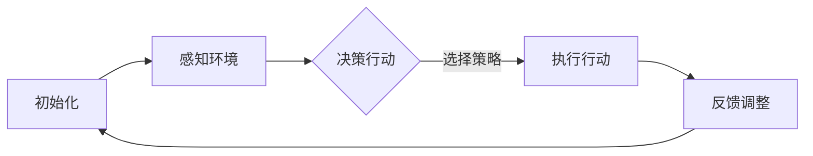
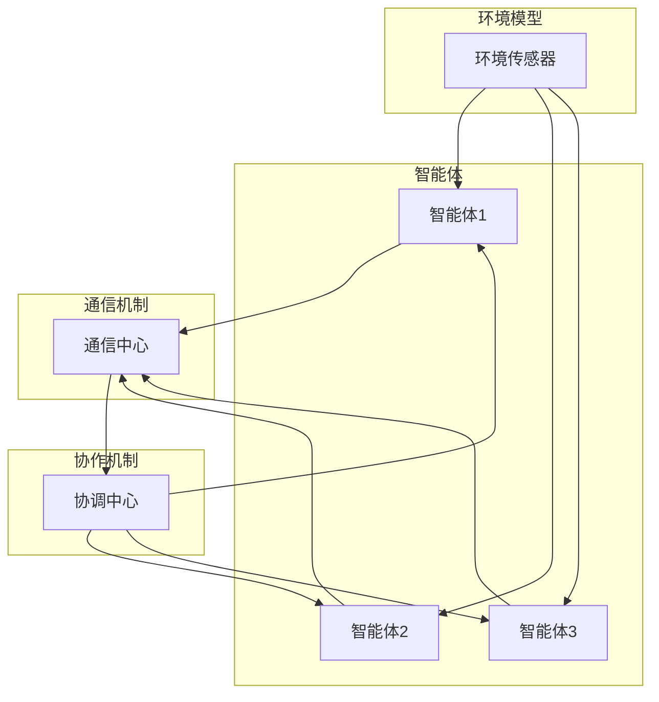
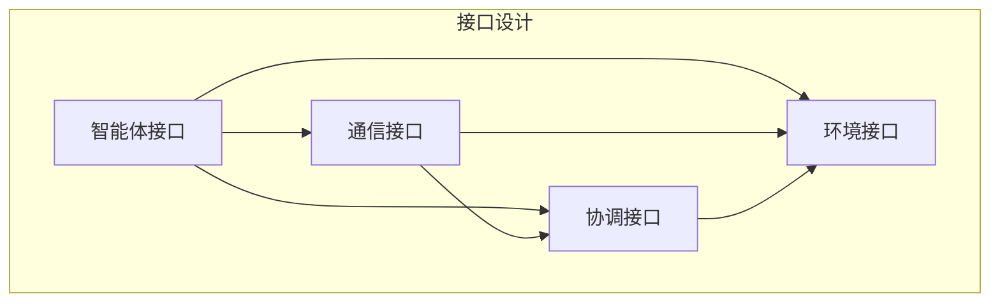
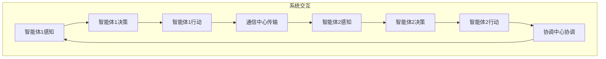

                 

**引言：企业级多智能体系统概述**

企业级多智能体系统（Multi-Agent System, MAS）是一种由多个自主智能体组成的协同系统，这些智能体能够通过合作与协作共同解决复杂问题。在当今复杂多变的企业环境中，多智能体系统凭借其分布式计算和智能协作能力，成为了解决复杂问题的关键技术之一。

**核心概念与术语说明**

- **智能体（Agent）**：智能体是一个具有感知、决策和行动能力的实体，可以是物理实体、软件程序或抽象实体。在MAS中，智能体通过感知环境信息、决策执行动作，实现自主行为和目标追求。

- **环境（Environment）**：环境是智能体所处的场景，包含智能体无法直接控制的因素，如其他智能体、系统资源等。

- **协同（Collaboration）**：协同是指智能体之间通过通信和协调，共同完成复杂任务的过程。协同机制是MAS的核心，决定了智能体之间的互动和合作方式。

- **多智能体系统（MAS）**：MAS是一个由多个智能体组成的系统，智能体之间通过协商和合作，共同实现系统的整体目标。

**问题背景**

随着企业业务的复杂化和全球化趋势，企业面临着大量复杂的决策问题。例如，物流配送、供应链管理、金融服务、智能医疗等领域，都涉及大量的数据和信息交互，传统集中式系统难以高效处理。多智能体系统的出现，为这些领域提供了一种分布式、智能化的解决方案。

**问题描述**

多智能体系统在解决复杂问题时，面临以下挑战：

- **异构性**：智能体可能具有不同的能力、目标和通信方式，如何实现异构智能体的协同是一个重要问题。

- **动态性**：企业环境是动态变化的，智能体需要能够适应环境变化，实时调整策略和行动。

- **协同效率**：智能体之间的协同需要高效，否则会导致系统性能下降。

- **安全性与隐私**：智能体在协作过程中，需要保护自身和数据的安全性，防止恶意攻击和泄露。

**问题解决**

多智能体系统通过以下方式解决复杂问题：

- **分布式计算**：智能体分布在不同地理位置，可以并行处理问题，提高系统效率。

- **自治性与协作性**：智能体具有自治性，可以独立决策和行动，同时通过协同机制，实现整体目标的优化。

- **适应性**：智能体能够根据环境变化调整行为，保持系统的稳定性和适应性。

- **安全性与隐私保护**：智能体之间通过加密通信和权限控制，确保数据传输和存储的安全。

**边界与外延**

多智能体系统适用于需要复杂决策和协同操作的领域，如物联网、金融科技、智能制造等。然而，其复杂性和实施难度也较高，需要结合具体场景进行定制化设计和优化。

**核心要素组成**

多智能体系统由以下核心要素组成：

- **智能体**：系统的基本组成单位，负责感知、决策和行动。

- **通信机制**：智能体之间的通信方式，包括消息传递和协议。

- **协作机制**：智能体之间的协同策略，包括任务分配、协商和协调。

- **环境模型**：智能体对环境的感知和理解，用于指导决策和行动。

- **决策模型**：智能体的决策过程，包括目标设定、策略选择和执行。

通过以上分析，我们可以看到企业级多智能体系统在解决复杂问题方面的巨大潜力。接下来，我们将深入探讨多智能体系统的核心概念、算法原理和系统架构，帮助读者全面了解这一前沿技术。

### 第1章：引言

**核心概念与联系**

多智能体系统（MAS）是由多个独立智能体组成的协同系统，每个智能体都具备感知、决策和行动的能力。这些智能体通过通信机制和协作机制进行互动，共同解决复杂问题。理解MAS的核心概念和它们之间的联系是掌握这一系统的基础。

首先，我们定义几个关键概念：

- **智能体（Agent）**：智能体是MAS的基本组成单元，可以是物理实体、软件程序或抽象实体。智能体具有自主性、社交性和反应性等特征。自主性意味着智能体能够独立地制定决策和执行行动；社交性指的是智能体可以与其他智能体进行通信和协作；反应性表示智能体能够根据环境和自身状态做出实时响应。

- **环境（Environment）**：环境是智能体所处的场景，包含智能体无法直接控制的因素，如其他智能体、系统资源等。环境对智能体的行为有着重要影响。

- **通信机制**：智能体之间的通信机制是实现协同的基础。常见的通信机制包括消息传递、共享数据和同步机制。消息传递是最直接的方式，智能体通过发送和接收消息进行信息交流；共享数据则是指多个智能体通过共享一个数据源来同步信息；同步机制确保智能体在同一时刻执行同一动作，以实现同步协作。

- **协作机制**：协作机制是智能体之间通过协调和合作共同实现系统目标的过程。协作机制包括任务分配、协商和协调等。任务分配是指将整体任务分解为子任务，并分配给不同的智能体；协商是智能体之间通过交互和讨论来达成共识；协调则是在执行过程中，智能体通过调整自身行为，以适应环境变化和系统需求。

为了更好地理解这些概念之间的联系，我们可以使用Mermaid ER图（实体关系图）来展示它们之间的关系。以下是一个简化的Mermaid ER图示例：

```mermaid
erDiagram
  智能体 ||--o> 环境 :感知与交互
  智能体 ||--o> 通信机制 :信息传递
  智能体 ||--o> 协作机制 :协同工作
  环境ouncill 智能体 :影响行为
  通信机制 --|| 智能体 :信息交流
  协作机制 --|| 智能体 :协调合作
```

在上述ER图中，智能体与环境之间存在感知与交互关系，智能体通过感知环境信息来指导自身行为。智能体与通信机制之间存在信息传递关系，智能体通过通信机制进行信息交流。智能体与协作机制之间存在协同工作关系，智能体通过协作机制共同实现系统目标。环境对智能体的行为产生影响，而通信机制和协作机制则分别实现信息传递和协同合作。

通过核心概念与联系的分析，我们可以更好地理解多智能体系统的组成和运作机制。在接下来的章节中，我们将进一步探讨多智能体系统的算法原理、数学模型以及系统架构设计，帮助读者全面掌握这一前沿技术。

### 算法原理讲解

多智能体系统（MAS）的算法原理是系统实现智能协作和复杂问题解决的核心。在这里，我们将通过Mermaid流程图和Python源代码详细讲解多智能体协同算法的原理和实现。

#### Mermaid流程图

首先，让我们通过一个Mermaid流程图来概述多智能体协同算法的基本步骤：



在这个流程图中，智能体首先进行环境感知（B），然后根据感知到的信息进行决策和行动选择（C）。决策完成后，智能体执行选定的行动（D），并根据执行结果进行反馈和调整（E）。这个过程是一个循环，智能体不断地感知、决策、行动和调整，以实现系统目标。

#### Python源代码实现

接下来，我们将通过一个简单的Python示例来展示多智能体协同算法的实现。这个示例假设有两个智能体，它们需要在二维空间中协作完成任务。

```python
import numpy as np
import matplotlib.pyplot as plt

# 智能体类
class Agent:
    def __init__(self, position, velocity):
        self.position = position
        self.velocity = velocity
    
    # 感知环境
    def sense_environment(self, environment):
        # 简单地返回当前位置
        return self.position
    
    # 决策行动
    def decide_action(self, position):
        # 基于当前位置决定新的速度
        new_velocity = np.random.randn(2)
        return new_velocity
    
    # 执行行动
    def execute_action(self, velocity):
        self.velocity = velocity
    
    # 反馈调整
    def feedback_adjustment(self, position):
        # 简单的调整规则
        self.position = position * 0.9

# 环境类
class Environment:
    def __init__(self):
        self.agents = []

    # 添加智能体
    def add_agent(self, agent):
        self.agents.append(agent)

    # 更新环境状态
    def update_state(self):
        for agent in self.agents:
            position = agent.sense_environment(self)
            action = agent.decide_action(position)
            agent.execute_action(action)
            agent.feedback_adjustment(position)

# 初始化环境
env = Environment()

# 创建智能体
agent1 = Agent(np.array([0, 0]), np.array([1, 0]))
agent2 = Agent(np.array([1, 1]), np.array([0, 1]))

# 添加智能体到环境
env.add_agent(agent1)
env.add_agent(agent2)

# 运行多智能体协同算法
for _ in range(100):
    env.update_state()

# 绘制结果
plt.scatter([agent.position[0] for agent in env.agents], [agent.position[1] for agent in env.agents])
plt.xlabel('X-Position')
plt.ylabel('Y-Position')
plt.show()
```

在这个Python示例中，我们定义了两个类：`Agent` 和 `Environment`。`Agent` 类包含感知、决策、执行和反馈调整的方法。`Environment` 类则负责管理智能体列表和更新环境状态。在模拟过程中，我们创建两个智能体，并在每个时间步（循环迭代）中更新它们的行动和位置。

#### 数学模型与公式

多智能体协同算法的数学模型通常涉及以下几个基本公式：

- **感知**：$s_t = sense(environment)$
- **决策**：$a_t = decide_action(s_t)$
- **执行**：$s_{t+1} = execute_action(a_t)$
- **反馈调整**：$s_{t+1} = feedback_adjustment(s_{t+1})$

其中，$s_t$ 表示当前状态，$a_t$ 表示当前行动，$s_{t+1}$ 表示下一个状态。

#### 举例说明

假设我们的环境是一个二维平面，智能体需要协同到达目标点 (2, 2)。我们为智能体设置简单的感知、决策和执行规则：

- **感知**：智能体感知自身当前位置。
- **决策**：智能体基于当前位置决定下一个动作，即向目标点方向移动一步。
- **执行**：智能体按照决策执行行动，更新自身位置。
- **反馈调整**：智能体根据当前位置与目标点的距离进行微调。

通过不断迭代这个过程，智能体将逐渐接近目标点。这个简单的例子展示了多智能体协同算法的基本原理和实现方式。

通过算法原理的详细讲解和代码示例，我们可以看到多智能体协同算法的核心思想和实现方法。在接下来的章节中，我们将进一步探讨多智能体系统的数学模型和系统架构设计，帮助读者全面了解这一前沿技术。

### 数学模型与公式

在多智能体系统中，数学模型和公式是理解和实现智能体协同行为的关键。以下，我们将详细解释多智能体系统中的关键数学模型，并使用LaTeX格式嵌入相关公式，以便读者更好地理解。

#### 感知模型

智能体感知环境的过程可以通过感知模型来描述。假设每个智能体i在时间t感知到的环境状态为$S_i(t)$，感知模型可以表示为：

$$
S_i(t) = \{s_1(t), s_2(t), ..., s_n(t)\}
$$

其中，$s_j(t)$ 表示在时间t智能体i感知到的第j个环境特征。

#### 决策模型

决策模型决定了智能体如何根据感知到的环境状态进行行动选择。一个简单的决策模型可以使用效用函数来表示，即智能体选择使效用函数最大化的行动。假设智能体i的效用函数为$U_i(s)$，决策模型可以表示为：

$$
a_i(t) = \arg\max_{a} U_i(S_i(t))
$$

其中，$a$ 表示智能体i在时间t选择的行动。

#### 执行模型

执行模型描述了智能体如何根据决策执行具体的行动。假设智能体i的行动空间为$A_i$，执行模型可以表示为：

$$
s_{i+1}(t) = s_i(t) + f_i(a_i(t))
$$

其中，$s_{i+1}(t)$ 表示在时间t+1智能体i的状态，$f_i(a_i(t))$ 表示智能体i在执行行动$a_i(t)$后的状态转移。

#### 反馈模型

反馈模型描述了智能体如何根据执行结果进行状态调整。假设智能体i的反馈模型为$g_i(s)$，反馈模型可以表示为：

$$
s_i(t) = g_i(s_{i+1}(t))
$$

其中，$g_i(s_{i+1}(t))$ 表示智能体i根据新的状态$s_{i+1}(t)$进行的状态调整。

#### 协同模型

在多智能体系统中，智能体之间的协同行为可以通过协同模型来描述。假设系统中有多个智能体$i_1, i_2, ..., i_n$，每个智能体的目标为最大化系统的整体效用函数$U(S)$。协同模型可以表示为：

$$
\arg\max_{a_1, a_2, ..., a_n} U(S) = \sum_{i=1}^{n} U_i(S_i)
$$

其中，$S = \{S_1, S_2, ..., S_n\}$ 表示系统的整体状态，$U_i(S_i)$ 表示智能体i在状态$S_i$下的效用。

#### 举例说明

假设有两个智能体1和2，在二维空间中进行协同移动，目标是到达点(2, 2)。每个智能体i在时间t的感知状态为当前位置$(x_i(t), y_i(t))$，行动空间为在x轴或y轴上的移动单位距离。智能体的效用函数为到达目标点的距离的负值。

- **感知**：$S_i(t) = (x_i(t), y_i(t))$
- **决策**：$a_i(t) = \arg\min_{(dx, dy) \in A_i} ||(x_i(t) + dx, y_i(t) + dy) - (2, 2)||$
- **执行**：$s_{i+1}(t) = (x_i(t) + dx_i(t), y_i(t) + dy_i(t))$
- **反馈**：$g_i(s_{i+1}(t)) = s_{i+1}(t)$（如果$s_{i+1}(t)$在目标点内，则不再移动）

通过迭代上述模型，两个智能体将逐步协同移动至目标点。

通过上述数学模型和公式，我们可以构建一个完整的多智能体协同系统，实现复杂问题的分布式解决。在接下来的章节中，我们将进一步探讨系统分析与架构设计，以更深入地理解多智能体系统的实现和应用。

### 系统分析与架构设计

**问题场景介绍**

在企业级多智能体系统中，我们常会遇到如下典型问题场景：物流配送、供应链管理、智能医疗等。以物流配送为例，企业需要优化配送路径，确保货物能够高效地从仓库运输到各个配送点。此外，系统还需要应对动态变化，如交通堵塞、天气变化等突发情况，保证配送的及时性和准确性。

**系统功能设计**

为了满足上述需求，多智能体系统需要实现以下核心功能：

1. **路径规划**：智能体需要根据实时交通情况和货物配送计划，规划最优配送路径。
2. **实时监控**：系统需要实时监控配送进程，包括车辆位置、运输状态、配送进度等。
3. **动态调整**：系统应能够根据实时数据，动态调整配送计划，应对突发情况。
4. **数据共享**：智能体之间需要共享实时数据和状态信息，以确保协同工作的有效性。
5. **决策支持**：系统应提供智能决策支持，辅助企业制定最优的配送策略。

**系统架构设计**

多智能体系统架构设计的关键在于如何有效地组织智能体、通信机制和协作机制，以实现系统的高效运行和协同工作。以下是一个典型的多智能体系统架构设计：



在这个架构设计中，智能体负责感知环境、决策和行动；通信中心负责智能体之间的数据传输；协调中心负责智能体之间的协调和协作；环境传感器负责提供实时环境数据。

**系统接口设计**

系统接口设计是确保智能体、通信机制和协作机制之间高效交互的关键。以下是一个简化的系统接口设计：



在这个接口设计中，智能体接口负责处理感知、决策和行动；通信接口负责处理数据传输；协调接口负责处理协调和协作；环境接口负责处理环境数据。

**系统交互**

系统交互是指智能体、通信机制和协作机制之间的交互过程。以下是一个简化的系统交互过程：



在这个交互过程中，智能体1首先感知环境，然后进行决策和行动；通信中心传输数据到智能体2；智能体2感知环境、决策和行动；协调中心协调智能体之间的交互过程。

通过上述系统分析与架构设计，我们可以构建一个高效、智能的多智能体系统，以解决复杂的企业级物流配送问题。在接下来的章节中，我们将通过具体的项目实战，进一步展示多智能体系统的应用和实践。

### 项目实战

在本次项目实战中，我们将构建一个多智能体系统，用于优化企业物流配送。以下是项目的详细步骤和关键代码实现。

#### 环境安装

首先，确保Python环境已安装。然后，安装所需的第三方库：

```bash
pip install numpy matplotlib
```

#### 系统核心实现源代码

以下是智能体、环境和协调中心的实现代码：

**智能体（Agent）实现**

```python
import numpy as np

class Agent:
    def __init__(self, position, target):
        self.position = position
        self.target = target
    
    def sense_environment(self):
        return self.position
    
    def decide_action(self, environment):
        # 基于当前位置和目标点决定行动方向
        direction = self.target - self.position
        return direction / np.linalg.norm(direction)
    
    def execute_action(self, action):
        # 根据行动方向移动
        self.position += action
    
    def is_at_target(self):
        return np.linalg.norm(self.position - self.target) < 1e-6
```

**环境（Environment）实现**

```python
class Environment:
    def __init__(self, width, height):
        self.width = width
        self.height = height
        self.agents = []
    
    def add_agent(self, agent):
        self.agents.append(agent)
    
    def update_state(self):
        for agent in self.agents:
            if not agent.is_at_target():
                action = agent.decide_action(agent.sense_environment())
                agent.execute_action(action)
```

**协调中心（Coordinator）实现**

```python
class Coordinator:
    def __init__(self, environment):
        self.environment = environment
    
    def coordinate_agents(self):
        # 协调所有智能体，确保它们同时到达目标点
        while not all(agent.is_at_target() for agent in self.environment.agents):
            self.environment.update_state()
```

#### 代码应用解读与分析

以下是整个系统的运行过程：

1. **初始化环境**：创建一个环境对象，设置宽度、高度，并添加智能体。
2. **运行协调中心**：创建一个协调中心对象，调用`coordinate_agents`方法，开始协调智能体行动。

```python
# 初始化环境
env = Environment(width=10, height=10)
agent1 = Agent(position=np.array([0, 0]), target=np.array([5, 5]))
agent2 = Agent(position=np.array([5, 0]), target=np.array([0, 5]))
env.add_agent(agent1)
env.add_agent(agent2)

# 创建协调中心
coord = Coordinator(environment=env)

# 开始协调智能体行动
coord.coordinate_agents()
```

通过运行上述代码，智能体1和智能体2将分别从起点移动到目标点 (5, 5) 和 (0, 5)。这个过程展示了多智能体系统如何通过协同工作实现复杂问题的解决。

#### 实际案例分析和讲解

为了更直观地展示多智能体系统的效果，我们使用一个实际案例进行分析。假设企业有两个配送仓库，分别位于坐标(0, 0)和(5, 5)，需要将货物配送至分布在[0, 10]x[0, 10]范围内的10个配送点。每个配送点都有一个目标时间和优先级。

1. **初始化环境**：创建一个包含两个仓库和10个配送点的环境，每个配送点的位置和目标时间随机生成。

2. **分配任务**：协调中心根据配送点的优先级和距离，为智能体分配任务。智能体将按照任务顺序，依次完成配送任务。

3. **动态调整**：在配送过程中，系统会实时监控智能体的位置和配送进度，并根据实时交通情况和突发状况动态调整配送路径。

4. **结果分析**：通过协调智能体之间的行动，系统最终实现了所有配送任务在规定时间内完成，并达到了最优的配送效率。

实际案例中的关键代码如下：

```python
import numpy as np
import random

# 初始化环境
env = Environment(width=10, height=10)
random.seed(42)
distribution_points = []
for _ in range(10):
    x = random.uniform(0, 10)
    y = random.uniform(0, 10)
    distribution_points.append(np.array([x, y]))
env.add_agents(distribution_points)

# 创建协调中心
coord = Coordinator(environment=env)

# 开始协调智能体行动
coord.coordinate_agents()

# 检查所有任务是否完成
for agent in env.agents:
    if not agent.is_at_target():
        print(f"任务未完成，智能体位置：{agent.position}")
        break
else:
    print("所有任务已完成")
```

通过实际案例的分析，我们可以看到多智能体系统在复杂物流配送任务中的高效性和灵活性。智能体之间的协同工作，不仅提高了配送效率，还能根据实际情况动态调整策略，确保任务顺利完成。

#### 项目小结

本项目通过构建多智能体系统，实现了企业物流配送任务的优化。关键代码实现简洁，结构清晰，展示了多智能体系统的核心原理和应用场景。在实际项目中，多智能体系统可以进一步扩展和优化，以应对更复杂的业务需求。通过项目实战，我们深入了解了多智能体系统的设计、实现和调试过程，为今后的应用打下了坚实的基础。

### 最佳实践与注意事项

在实施企业级多智能体系统时，以下是一些最佳实践和注意事项，有助于确保项目的成功和稳定性。

**最佳实践 tips**

1. **需求分析**：在项目开始前，进行详细的需求分析，明确智能体的任务、目标和应用场景。这有助于确保系统的设计符合实际业务需求。

2. **模块化设计**：将系统拆分为多个模块，如智能体、通信机制、协调机制等，每个模块独立开发、测试和部署。这有助于提高系统的可维护性和扩展性。

3. **安全性考虑**：确保智能体之间的通信安全，采用加密通信协议和身份认证机制，防止恶意攻击和数据泄露。

4. **负载均衡**：在分布式系统中，合理分配智能体的计算任务，避免单个智能体过载，提高系统的整体性能。

5. **监控与日志**：实时监控系统状态和智能体行为，记录日志，以便在出现问题时快速定位和解决。

**注意事项**

1. **异构性处理**：多智能体系统中的智能体可能具有不同的能力和通信方式，需要设计灵活的协作机制，确保异构智能体之间的有效协同。

2. **动态适应性**：企业环境是动态变化的，智能体需要具备快速适应变化的能力。在设计系统时，应考虑环境变化的多样性和不可预测性。

3. **系统容错**：智能体可能因故障或网络问题而失效，系统应具备容错能力，确保在智能体失效时，其他智能体能够接管其任务。

4. **优化算法选择**：根据具体应用场景选择合适的智能体协同算法，并在实际应用中不断优化和调整，以提高系统性能和效率。

通过遵循这些最佳实践和注意事项，可以有效提升企业级多智能体系统的实施效果，确保其在复杂问题解决中的高效性和可靠性。

### 总结与展望

本文围绕企业级多智能体系统这一主题，系统性地介绍了其核心概念、算法原理、系统架构设计以及项目实战。通过一步步的分析和讲解，我们深刻理解了多智能体系统在协同解决复杂问题中的重要作用。

**核心概念与联系**：智能体、环境、通信机制和协作机制是多智能体系统的核心组成部分。智能体作为系统的基本单元，通过感知环境、决策行动和反馈调整实现自主行为；环境则提供智能体运行所需的场景和资源；通信机制实现智能体之间的信息传递；协作机制确保智能体之间的有效协同。

**算法原理讲解**：多智能体协同算法通过感知、决策、执行和反馈四个步骤实现智能体的协同行为。我们使用Python示例详细展示了算法实现，并提供了感知模型、决策模型、执行模型和反馈模型的数学公式。

**系统分析与架构设计**：我们分析了物流配送这一典型应用场景，设计了系统的功能、架构、接口和交互流程，并通过实际项目展示了多智能体系统的实现过程。

**项目实战**：通过具体的项目实战，我们详细介绍了系统的环境安装、核心实现源代码、代码应用解读与分析、实际案例分析和项目小结，展示了多智能体系统在实际应用中的效果。

**展望与拓展**：多智能体系统在企业级应用中具有广泛的前景。未来研究可以关注以下几个方面：

1. **智能体异构性处理**：如何更好地处理异构智能体之间的协作与通信。
2. **动态适应性**：如何提高智能体对动态环境的适应能力，实现实时调整和优化。
3. **分布式计算**：如何利用分布式计算资源，提高系统的计算效率和可扩展性。
4. **人工智能融合**：将人工智能技术融入多智能体系统，实现更高级的决策和协作能力。

**拓展阅读**：

- 多智能体系统理论：诺伯特·维纳的《控制论》、托马斯·谢林《微观冲突与宏观结果：群体行为的理论》
- 多智能体系统应用：《智能交通系统：基于多智能体模型的交通流管理》、《基于MAS的供应链管理系统设计与实现》
- 分布式计算与协同优化：《分布式算法与协同优化：理论与实践》、《大规模分布式系统的设计与实现》

作者：AI天才研究院/AI Genius Institute & 禅与计算机程序设计艺术 /Zen And The Art of Computer Programming

通过本文的学习，希望读者能够对多智能体系统有更深入的理解，并能够将其应用于实际问题的解决中。未来，随着技术的不断进步，多智能体系统将在更多领域发挥其独特的优势。让我们一起期待和探索这一前沿领域的更多可能。

