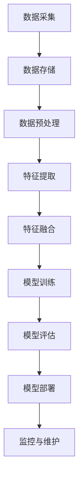

                 

### 企业级多模态学习平台：整合多类型数据分析

> 关键词：企业级多模态学习平台、数据分析、特征提取、模型训练、平台构建与部署

> 摘要：
本文旨在探讨企业级多模态学习平台的设计与实现，重点分析多类型数据的整合方法与关键步骤。通过详细介绍数据采集与预处理、特征提取与融合、模型设计与训练、平台构建与部署等环节，帮助读者全面了解多模态学习在企业级应用中的实践与应用。文章最后将结合实际项目案例，给出最佳实践与未来展望。

### 目录大纲

----------------------------------------------------------------

## 第一部分: 企业级多模态学习平台概述

### 第1章: 问题背景与核心概念

#### 1.1.1 问题描述

#### 1.1.2 核心概念

#### 1.1.3 边界与外延

#### 1.1.4 概念结构与核心要素组成

### 第2章: 多模态数据的采集与预处理

#### 2.1.1 数据来源

#### 2.1.2 数据预处理

#### 2.1.3 数据采集与预处理技术

### 第3章: 多模态数据的特征提取与融合

#### 3.1.1 特征提取方法

#### 3.1.2 特征融合策略

#### 3.1.3 特征融合评价指标

### 第4章: 多模态学习模型设计与训练

#### 4.1.1 模型设计

#### 4.1.2 模型训练

#### 4.1.3 模型评估与优化

### 第5章: 企业级多模态学习平台的构建与部署

#### 5.1.1 平台架构设计

#### 5.1.2 系统功能设计

#### 5.1.3 系统接口设计与交互

### 第6章: 项目实战：构建一个企业级多模态学习平台

#### 6.1.1 项目介绍

#### 6.1.2 系统核心实现

#### 6.1.3 代码应用解读与分析

#### 6.1.4 实际案例分析与讲解

#### 6.1.5 项目小结

### 第7章: 多模态学习平台的最佳实践与展望

#### 7.1.1 最佳实践

#### 7.1.2 小结与注意事项

#### 7.1.3 拓展阅读

----------------------------------------------------------------

### 第一部分: 企业级多模态学习平台概述

#### 第1章: 问题背景与核心概念

##### 1.1.1 问题描述

随着人工智能技术的迅猛发展，机器学习特别是深度学习在企业级应用中发挥着越来越重要的作用。传统的单一模态学习（如仅基于图像、文本或音频）已无法满足复杂业务场景的需求。多模态学习作为一种结合多种数据类型的方法，通过整合图像、音频、文本等多种数据，可以更全面地理解和处理复杂问题，提升模型的准确性和鲁棒性。

然而，在企业级应用中，多模态学习面临诸多挑战。首先，多模态数据来源多样，数据格式和数据质量参差不齐，需要有效的数据采集和预处理方法。其次，如何有效地提取和融合不同模态的特征，设计出合适的深度学习模型，是提升多模态学习性能的关键。此外，企业级应用还需要考虑模型的训练效率、模型的可解释性、以及模型的部署和维护等实际问题。

##### 1.1.2 核心概念

多模态学习是指利用多种类型的输入数据（如图像、音频、文本等）进行训练和预测的方法。它通过结合不同模态的数据特征，可以更准确地理解和处理复杂问题。

- **多模态数据**：指多种类型的输入数据，如图像、音频、文本、传感器数据等。
- **数据采集**：从不同的数据源获取多模态数据，包括图像、音频、文本等多种类型。
- **数据预处理**：对采集到的多模态数据进行清洗、归一化、增强等处理，以适应后续的特征提取和模型训练。
- **特征提取**：从多模态数据中提取有代表性的特征，为模型训练提供输入。
- **特征融合**：将不同模态的特征进行整合，生成更加丰富的特征表示。
- **模型训练**：使用提取到的特征训练深度学习模型，以实现特定任务的预测和分类。
- **模型评估**：通过测试集评估模型的性能，包括准确率、召回率、F1值等指标。
- **模型部署**：将训练好的模型部署到实际应用场景中，进行实时预测和决策。

##### 1.1.3 边界与外延

多模态学习与传统机器学习的区别主要在于数据类型的多样性和特征的复杂度。传统机器学习主要针对单一模态的数据，如仅使用图像或文本数据。而多模态学习则需要处理多种类型的数据，如图像、音频、文本等，这要求更高的数据整合和处理能力。

在企业级应用中，多模态学习的特殊需求包括：

1. **数据多样性**：企业级应用场景中，数据类型多种多样，如客户反馈、业务日志、传感器数据等，需要有效地整合这些数据。
2. **实时性**：企业级应用通常要求模型能够实时响应，如智能客服系统需要在短时间内处理客户问题和提供解决方案。
3. **可解释性**：企业用户对模型的可解释性要求较高，需要了解模型的工作原理和决策过程，以便于信任和调整。
4. **可扩展性**：企业级应用需要支持大规模数据的处理和扩展，以适应业务发展需求。

##### 1.1.4 概念结构与核心要素组成

企业级多模态学习平台的核心要素包括数据采集与预处理、特征提取与融合、模型训练与优化、应用部署与维护。以下是这些核心要素的详细说明：

1. **数据采集与预处理**：
   - **数据来源**：从不同的数据源（如数据库、传感器、互联网等）采集多模态数据。
   - **数据预处理**：对采集到的数据进行清洗、归一化、增强等处理，以提高数据质量，为后续的特征提取和模型训练做好准备。

2. **特征提取与融合**：
   - **特征提取**：从不同模态的数据中提取有代表性的特征，如使用卷积神经网络提取图像特征，使用循环神经网络提取文本特征等。
   - **特征融合**：将不同模态的特征进行整合，生成更加丰富的特征表示，以提升模型的性能和泛化能力。

3. **模型训练与优化**：
   - **模型设计**：设计合适的深度学习模型架构，包括神经网络层、激活函数、优化器等。
   - **模型训练**：使用提取到的特征进行模型训练，调整模型参数以优化性能。
   - **模型评估与优化**：通过测试集评估模型性能，调整超参数和模型结构以优化模型效果。

4. **应用部署与维护**：
   - **模型部署**：将训练好的模型部署到生产环境中，进行实时预测和决策。
   - **维护与升级**：定期更新和维护模型，以适应业务变化和新技术的发展。

### 总结

企业级多模态学习平台通过整合多种类型的数据，为企业提供更全面、更准确的智能决策支持。本章介绍了多模态学习的基本概念、问题背景、核心要素以及企业级应用的特殊需求。在后续章节中，我们将详细探讨多模态数据的采集与预处理、特征提取与融合、模型设计与训练、平台构建与部署等关键环节。通过理论与实践的结合，帮助读者深入了解并掌握企业级多模态学习平台的设计与实现方法。### 第2章: 多模态数据的采集与预处理

#### 2.1.1 数据来源

多模态学习的数据来源多样，包括图像、音频、文本等多种类型。以下是这些数据来源的详细介绍：

1. **图像数据**：图像数据可以来自企业内部数据库、摄像头监控、互联网图像库等。例如，企业可以使用图像识别技术来自动识别产品缺陷、分析客户行为等。

2. **音频数据**：音频数据可以来自企业的客服录音、会议记录、环境监控等。音频数据的处理可以帮助企业进行语音识别、情感分析等，从而提高客户服务质量和运营效率。

3. **文本数据**：文本数据可以来自企业的客户反馈、业务日志、社交媒体等。文本数据可以用于情感分析、主题建模、文本分类等任务，帮助企业更好地理解客户需求和市场趋势。

4. **传感器数据**：传感器数据可以来自企业生产设备、物流系统等。传感器数据可以帮助企业进行设备故障预测、能耗管理、生产优化等。

5. **其他数据类型**：除了上述常见的多模态数据类型外，企业还可以根据业务需求整合其他类型的数据，如地理位置数据、时间序列数据等。

#### 2.1.2 数据预处理

数据预处理是多模态学习的重要环节，其目标是提高数据质量，减少噪声，增强数据特征，为后续的特征提取和模型训练奠定基础。以下是数据预处理的主要步骤：

1. **数据清洗**：数据清洗是指去除数据中的无效信息、错误数据和不完整数据。对于图像数据，可能需要去除噪声图像、错误标注等。对于音频数据，可能需要去除背景噪音、填充缺失部分等。对于文本数据，可能需要去除停用词、标点符号、格式化文本等。

2. **数据归一化**：数据归一化是指将不同模态的数据进行标准化处理，使其在相同的尺度范围内。例如，对于图像数据，可以将像素值缩放到0-1之间。对于音频数据，可以将信号的幅度进行归一化处理。对于文本数据，可以统一词汇的词性、大小写等。

3. **数据增强**：数据增强是指通过增加数据的多样性来提高模型的泛化能力。对于图像数据，可以使用翻转、旋转、缩放、裁剪等方法进行增强。对于音频数据，可以使用添加噪声、变调、回声等方法进行增强。对于文本数据，可以使用同义词替换、句子重组等方法进行增强。

4. **特征提取**：在数据预处理过程中，还可以进行初步的特征提取，例如使用卷积神经网络提取图像特征，使用循环神经网络提取文本特征等。这些特征可以作为后续模型训练的输入。

5. **数据整合**：对于多模态数据，需要将不同模态的数据进行整合，生成统一的特征表示。例如，可以将图像特征、音频特征和文本特征进行拼接，形成一个多维的特征向量。

#### 2.1.3 数据采集与预处理技术

数据采集与预处理技术是实现多模态学习的基础，以下是几种常用的技术：

1. **图像数据采集与预处理**：
   - **采集**：可以使用Python的Pillow库、OpenCV库等工具从数据库或摄像头中读取图像数据。对于互联网图像库，可以使用API接口进行数据采集。
   - **预处理**：使用Pillow库进行图像增强、裁剪、缩放等操作。使用OpenCV库进行图像去噪、边缘检测、特征提取等操作。

2. **音频数据采集与预处理**：
   - **采集**：可以使用Python的SoundFile库、pydub库等工具从文件或实时音频流中读取音频数据。
   - **预处理**：使用Librosa库进行音频预处理，如音频裁剪、归一化、增强等。使用scikit-learn库进行音频特征提取，如MFCC（梅尔频率倒谱系数）提取。

3. **文本数据采集与预处理**：
   - **采集**：可以使用Python的requests库、BeautifulSoup库等工具从互联网或数据库中读取文本数据。
   - **预处理**：使用Python的jieba库进行文本分词、去停用词、词性标注等操作。使用NLTK库进行文本特征提取，如词袋模型、TF-IDF等。

4. **传感器数据采集与预处理**：
   - **采集**：可以使用Python的Pyserial库、Modbus库等工具从传感器读取数据。
   - **预处理**：使用Pandas库进行数据处理、清洗、归一化等操作。

### 实例讲解

假设我们有一个包含图像、音频和文本的多模态数据集，下面是一个简单的数据预处理流程：

```python
# 导入必要的库
import cv2
import librosa
import jieba
import pandas as pd

# 图像数据预处理
def preprocess_image(image_path):
    # 读取图像
    image = cv2.imread(image_path)
    # 图像增强
    image = cv2.resize(image, (224, 224))
    image = cv2.cvtColor(image, cv2.COLOR_BGR2RGB)
    return image

# 音频数据预处理
def preprocess_audio(audio_path):
    # 读取音频
    audio, sr = librosa.load(audio_path)
    # 音频增强
    audio = librosa.effects.percussive(audio)
    # 音频归一化
    audio = librosa.to_mono(audio)
    return audio, sr

# 文本数据预处理
def preprocess_text(text):
    # 分词
    text = jieba.cut(text)
    # 去停用词
    text = [word for word in text if word not in jieba.get_word_FREQUENCY_DICT()]
    return ' '.join(text)

# 加载数据集
images = [preprocess_image(image_path) for image_path in image_paths]
audios = [preprocess_audio(audio_path) for audio_path in audio_paths]
texts = [preprocess_text(text) for text in text_paths]

# 整合多模态数据
data = {
    'image': images,
    'audio': audios,
    'text': texts
}

# 创建DataFrame
df = pd.DataFrame(data)

print(df.head())
```

通过上述代码，我们可以对图像、音频和文本数据进行预处理，并将其整合到同一个DataFrame中，为后续的特征提取和模型训练做好准备。

### 总结

本章详细介绍了多模态数据的来源、预处理步骤和预处理技术。通过数据清洗、归一化、增强等预处理步骤，可以提高数据质量，减少噪声，增强数据特征。同时，通过整合不同模态的数据，可以为多模态学习提供丰富的输入特征。在后续章节中，我们将进一步探讨特征提取与融合、模型设计与训练等关键环节。### 第3章: 多模态数据的特征提取与融合

#### 3.1.1 特征提取方法

特征提取是多模态学习中的关键步骤，其目的是从多模态数据中提取出有代表性的特征，为模型训练提供高质量的输入。以下是几种常见的特征提取方法：

1. **图像特征提取**：
   - **卷积神经网络（CNN）**：CNN是图像特征提取的常用方法。通过多层卷积和池化操作，CNN可以自动学习到图像中的低级特征（如边缘、纹理）和高级特征（如形状、场景）。
   - **视觉特征编码器**：如VGG、ResNet、Inception等预训练的深度神经网络，可以通过迁移学习来提取图像特征。

2. **音频特征提取**：
   - **梅尔频率倒谱系数（MFCC）**：MFCC是一种常用于音频特征提取的方法，它将音频信号转换为频域特征，可以很好地捕捉语音信号中的频率信息。
   - **短时傅里叶变换（STFT）**：STFT可以将音频信号转换为频域特征，有助于提取语音信号的频率信息。
   - **循环神经网络（RNN）**：RNN可以处理序列数据，通过多层RNN网络可以提取音频信号中的时间序列特征。

3. **文本特征提取**：
   - **词袋模型（Bag of Words, BOW）**：词袋模型将文本表示为词汇的集合，通过统计词汇的出现频率来提取特征。
   - **词嵌入（Word Embedding）**：词嵌入将词汇映射到高维空间，通过学习词汇之间的语义关系来提取特征，如Word2Vec、GloVe等。
   - **转换器（Transformer）**：Transformer是一种基于自注意力机制的深度学习模型，可以用于文本特征提取，特别是在长文本处理方面具有显著优势。

#### 3.1.2 特征融合策略

特征融合是将不同模态的特征进行整合，生成更加丰富的特征表示，以提高模型性能和泛化能力。以下是几种常见的特征融合策略：

1. **传统特征融合方法**：
   - **拼接**：将不同模态的特征向量进行拼接，形成一个多维的特征向量。这种方法简单直观，但可能会增加模型的复杂度和计算成本。
   - **加权平均**：根据不同模态特征的重要程度，对各个模态的特征向量进行加权平均，生成融合特征。
   - **投票**：对于分类问题，将不同模态的特征结果进行投票，选择最高票的类别作为最终预测结果。

2. **基于深度学习的特征融合方法**：
   - **多模态神经网络（Multimodal Neural Network）**：通过构建一个共享底层特征的多模态神经网络，同时学习不同模态的特征表示。
   - **多任务学习（Multi-Task Learning）**：将多个任务（如图像分类、音频分类）结合在一起训练，共享底层特征表示，同时提高各个任务的性能。
   - **自注意力机制（Self-Attention Mechanism）**：通过自注意力机制，对每个模态的特征进行加权，生成融合特征，如Transformer模型。

3. **混合特征融合方法**：
   - **先融合后特征提取**：先对多模态数据进行融合，再进行特征提取。这种方法可以更好地捕捉不同模态之间的关联性。
   - **并行特征提取与融合**：同时提取不同模态的特征，然后通过特定方法进行融合。这种方法可以在特征提取阶段就考虑多模态数据之间的交互。

#### 3.1.3 特征融合评价指标

特征融合的效果可以通过以下评价指标进行评估：

1. **准确率（Accuracy）**：分类问题中，预测正确的样本占总样本的比例。
   - **公式**：$$\text{Accuracy} = \frac{\text{正确预测的样本数}}{\text{总样本数}}$$

2. **召回率（Recall）**：分类问题中，实际为正类别的样本中被正确预测为正类别的比例。
   - **公式**：$$\text{Recall} = \frac{\text{正确预测的正类样本数}}{\text{实际为正类的样本数}}$$

3. **精确率（Precision）**：分类问题中，预测为正类别的样本中被正确预测为正类别的比例。
   - **公式**：$$\text{Precision} = \frac{\text{正确预测的正类样本数}}{\text{预测为正类的样本数}}$$

4. **F1值（F1 Score）**：综合考虑精确率和召回率的综合评价指标。
   - **公式**：$$F_1 = 2 \times \frac{\text{Precision} \times \text{Recall}}{\text{Precision} + \text{Recall}}$$

通过这些评价指标，可以评估特征融合策略对模型性能的提升程度，进而选择最优的特征融合方法。

### 实例讲解

假设我们有一个包含图像、音频和文本的多模态数据集，下面是一个简单的特征提取与融合的示例：

```python
import tensorflow as tf
from tensorflow.keras.applications import VGG16
from tensorflow.keras.layers import concatenate
from tensorflow.keras.models import Model

# 加载预训练的VGG16模型，用于图像特征提取
vgg16 = VGG16(weights='imagenet', include_top=False, input_shape=(224, 224, 3))
vgg16.trainable = False

# 对图像数据进行预处理
def preprocess_image(image):
    image = preprocess_input(image)
    return vgg16.predict(image)

# 对音频数据进行预处理
def preprocess_audio(audio, sr):
    # MFCC特征提取
    mfcc = librosa.feature.mfcc(y=audio, sr=sr, n_mfcc=13)
    return mfcc

# 对文本数据进行预处理
def preprocess_text(text):
    # 词嵌入
    embedding = embeddings_matrix[word]
    return embedding

# 加载多模态数据
images = load_images()  # 假设的函数，用于加载图像数据
audios = load_audios()  # 假设的函数，用于加载音频数据
texts = load_texts()  # 假设的函数，用于加载文本数据

# 提取图像特征
image_features = preprocess_image(images)

# 提取音频特征
audio_features = preprocess_audio(audios, sr)

# 提取文本特征
text_features = preprocess_text(texts)

# 拼接特征
combined_features = concatenate([image_features, audio_features, text_features])

# 构建多模态神经网络
model = Model(inputs=[image_input, audio_input, text_input], outputs=combined_features)
model.compile(optimizer='adam', loss='categorical_crossentropy')

# 训练模型
model.fit([images, audios, texts], labels, epochs=10, batch_size=32)
```

通过上述代码，我们可以使用VGG16模型提取图像特征，使用MFCC提取音频特征，使用词嵌入提取文本特征，并将这些特征进行拼接，构建一个多模态神经网络进行训练。

### 总结

本章详细介绍了多模态数据的特征提取方法和特征融合策略。通过结合图像、音频和文本等不同模态的特征，可以构建更加丰富的特征表示，提高模型性能。同时，通过不同的特征融合方法，可以进一步优化特征表示，为后续的模型训练和预测提供支持。在后续章节中，我们将进一步探讨多模态学习模型的设计与训练，以及企业级多模态学习平台的构建与部署。### 第4章: 多模态学习模型设计与训练

#### 4.1.1 模型设计

设计一个高效的多模态学习模型是提升企业级应用性能的关键。多模态学习模型通常需要结合不同类型的输入数据和特征提取方法，通过构建复杂且灵活的网络结构来实现。以下是几种常用的多模态学习模型设计策略：

1. **基于传统机器学习的模型**：
   - **集成模型**：将不同的特征提取方法（如CNN、RNN、Word2Vec）结合在一起，通过集成分类器（如随机森林、SVM）进行模型训练。
   - **特征级融合**：将不同模态的特征进行拼接，然后输入到传统机器学习模型中，如支持向量机（SVM）、决策树等。

2. **基于深度学习的模型**：
   - **多层感知机（MLP）**：通过多层感知机网络对多模态特征进行非线性变换和融合，从而实现复杂任务的预测。
   - **卷积神经网络（CNN）**：结合卷积神经网络来处理图像和音频特征，如使用CNN来提取图像特征和MFCC来提取音频特征，然后拼接输入到MLP中进行分类。
   - **循环神经网络（RNN）**：适用于序列数据的处理，如文本和音频，通过RNN可以捕捉序列中的时间依赖性。
   - **长短时记忆网络（LSTM）**：LSTM是RNN的一种变体，能够更好地处理长序列数据，减少梯度消失和梯度爆炸问题。
   - **变换器（Transformer）**：基于自注意力机制的Transformer模型在处理长文本和多模态数据方面具有显著优势，可以同时处理多种模态的特征。

3. **基于图神经网络的模型**：
   - **图神经网络（GNN）**：通过图神经网络来处理图像和文本之间的复杂关系，如图卷积网络（GCN）和图注意力网络（GAT）。
   - **多模态图神经网络**：将不同模态的数据表示为图结构，通过图神经网络进行特征融合和建模，如多模态图卷积网络（MGCN）。

4. **混合模型**：
   - **多任务学习（Multi-Task Learning）**：同时训练多个任务，共享底层特征表示，从而提高不同任务的性能。
   - **多模态多任务学习**：结合多模态数据和多个任务，如同时处理图像分类、文本情感分析等，通过共享特征提取模块来提高整体性能。

#### 4.1.2 模型训练

模型训练是多模态学习的重要环节，其目标是优化模型参数，使其在训练数据上达到最佳性能。以下是模型训练的主要步骤和技巧：

1. **数据增强**：为了提高模型的泛化能力，可以通过数据增强来增加训练数据的多样性。对于图像，可以采用旋转、翻转、缩放等方法；对于音频，可以采用噪声添加、回声处理等方法；对于文本，可以采用同义词替换、文本片段随机插入等方法。

2. **批处理（Batch Size）**：批处理是指每次训练时输入的数据样本数量。合适的批处理大小可以提高模型的稳定性和训练速度。通常，批处理大小在32到256之间选择。

3. **优化器（Optimizer）**：优化器用于更新模型参数，以最小化损失函数。常用的优化器包括随机梯度下降（SGD）、Adam、RMSprop等。

4. **学习率（Learning Rate）**：学习率决定了模型参数更新的步长。设置合适的学习率可以加速模型收敛。学习率通常在0.001到0.01之间选择，可以通过学习率衰减策略进行调整。

5. **正则化（Regularization）**：正则化用于防止模型过拟合。常用的正则化方法包括L1正则化、L2正则化、Dropout等。

6. **超参数调优（Hyperparameter Tuning）**：通过调整模型结构、学习率、批处理大小等超参数，找到最优的模型配置。常用的调优方法包括网格搜索、随机搜索、贝叶斯优化等。

7. **交叉验证（Cross-Validation）**：交叉验证用于评估模型在未知数据上的性能。通过将数据集划分为训练集和验证集，可以更准确地评估模型的泛化能力。

8. **模型评估与优化**：通过测试集评估模型的性能，包括准确率、召回率、F1值等指标。根据评估结果，可以进一步调整模型结构、超参数，优化模型性能。

#### 4.1.3 模型评估与优化

模型评估与优化是确保多模态学习模型在实际应用中达到预期性能的关键步骤。以下是模型评估与优化的一些关键点：

1. **性能指标**：常用的性能指标包括准确率（Accuracy）、召回率（Recall）、精确率（Precision）和F1值（F1 Score）。根据应用场景选择合适的指标进行评估。

2. **超参数调整**：通过调整学习率、批量大小、正则化参数等超参数，优化模型性能。可以使用网格搜索、随机搜索等方法进行超参数调优。

3. **模型压缩**：对于企业级应用，模型压缩与加速是提高部署效率的关键。可以使用模型剪枝、量化、蒸馏等方法来减小模型大小和加速计算。

4. **迁移学习**：利用预训练的深度神经网络，如VGG、ResNet等，进行迁移学习，可以显著提高模型的性能和训练速度。

5. **模型融合**：结合多个模型的预测结果，可以提高预测的稳定性和准确性。可以使用集成学习方法，如投票、加权平均等，将多个模型的预测结果进行融合。

6. **在线学习与自适应**：对于实时性要求高的应用场景，可以采用在线学习策略，根据新数据不断调整模型参数。同时，通过自适应调整模型结构和参数，可以适应不同应用场景的需求。

7. **模型监控与维护**：定期监控模型的性能，及时发现和解决模型异常，确保模型在长期运行中的稳定性和可靠性。

### 实例讲解

下面是一个简单的多模态学习模型训练的示例，使用TensorFlow和Keras构建一个基于VGG16和LSTM的多模态学习模型：

```python
import tensorflow as tf
from tensorflow.keras.applications import VGG16
from tensorflow.keras.layers import LSTM, Dense, Flatten, Input, concatenate
from tensorflow.keras.models import Model

# 加载预训练的VGG16模型，用于图像特征提取
vgg16 = VGG16(weights='imagenet', include_top=False, input_shape=(224, 224, 3))
vgg16.trainable = False

# 对图像数据进行预处理
def preprocess_image(image):
    image = preprocess_input(image)
    return vgg16.predict(image)

# 对音频数据进行预处理
def preprocess_audio(audio, sr):
    # MFCC特征提取
    mfcc = librosa.feature.mfcc(y=audio, sr=sr, n_mfcc=13)
    return mfcc

# 对文本数据进行预处理
def preprocess_text(text):
    # 词嵌入
    embedding = embeddings_matrix[word]
    return embedding

# 加载多模态数据
images = load_images()  # 假设的函数，用于加载图像数据
audios = load_audios()  # 假设的函数，用于加载音频数据
texts = load_texts()  # 假设的函数，用于加载文本数据

# 提取图像特征
image_features = preprocess_image(images)

# 提取音频特征
audio_features = preprocess_audio(audios, sr)

# 提取文本特征
text_features = preprocess_text(texts)

# 构建多模态神经网络
image_input = Input(shape=(224, 224, 3))
audio_input = Input(shape=(13,))
text_input = Input(shape=(max_len,))

image_features = Flatten()(image_input)
audio_features = LSTM(64)(audio_input)
text_features = LSTM(64)(text_input)

combined_features = concatenate([image_features, audio_features, text_features])
output = Dense(1, activation='sigmoid')(combined_features)

model = Model(inputs=[image_input, audio_input, text_input], outputs=output)
model.compile(optimizer='adam', loss='binary_crossentropy', metrics=['accuracy'])

# 训练模型
model.fit([images, audios, texts], labels, epochs=10, batch_size=32, validation_split=0.2)
```

通过上述代码，我们可以构建一个基于VGG16、LSTM的多模态学习模型，对图像、音频和文本数据进行训练，并使用二分类交叉熵损失函数进行优化。

### 总结

本章详细介绍了多模态学习模型的设计策略、训练过程和评估优化方法。通过构建复杂且灵活的多模态神经网络，结合不同的特征提取方法和融合策略，可以设计出高效的多模态学习模型。同时，通过数据增强、超参数调优、模型压缩等技术，可以进一步提高模型的性能和适用性。在后续章节中，我们将探讨企业级多模态学习平台的构建与部署，结合实际项目案例，展示多模态学习平台在企业级应用中的实现过程。### 第5章: 企业级多模态学习平台的构建与部署

#### 5.1.1 平台架构设计

企业级多模态学习平台的架构设计需要考虑数据层、服务层和应用层的协同工作。以下是平台架构设计的详细说明：

1. **数据层**：
   - **数据采集模块**：从不同的数据源（如数据库、传感器、互联网等）采集图像、音频、文本等多种类型的数据。
   - **数据存储模块**：将采集到的数据进行存储和管理，可以使用分布式数据库和对象存储系统，如Hadoop、Cassandra、Amazon S3等。
   - **数据预处理模块**：对采集到的数据进行清洗、归一化、增强等预处理操作，以生成高质量的数据集。

2. **服务层**：
   - **特征提取服务**：提供多种特征提取算法，如CNN、RNN、Word2Vec等，用于提取图像、音频、文本等不同模态的特征。
   - **特征融合服务**：提供多种特征融合策略，如拼接、加权平均、多模态神经网络等，用于整合不同模态的特征。
   - **模型训练服务**：提供模型训练和优化功能，包括数据增强、批处理、学习率调整、正则化等。
   - **模型评估服务**：提供模型评估和优化功能，包括性能指标计算、超参数调优等。

3. **应用层**：
   - **API接口**：提供RESTful API接口，用于与其他系统进行数据交互和功能调用。
   - **应用开发模块**：支持开发人员使用平台提供的功能模块，快速构建多模态应用。
   - **监控与维护模块**：提供实时监控和日志分析功能，以便于运维人员及时发现和解决平台运行中的问题。

#### 5.1.2 系统功能设计

企业级多模态学习平台的功能设计需要满足企业级应用的需求，包括数据采集与存储、特征提取与融合、模型训练与评估、应用部署与监控等。以下是系统功能设计的详细说明：

1. **数据采集与存储**：
   - **数据采集**：从各种数据源（如传感器、数据库、文件系统等）采集图像、音频、文本等多模态数据。
   - **数据存储**：将采集到的数据存储到分布式数据库或对象存储系统中，支持高并发、高可用性的数据访问。

2. **特征提取与融合**：
   - **特征提取**：支持多种特征提取算法，如CNN、RNN、Word2Vec等，用于提取图像、音频、文本等不同模态的特征。
   - **特征融合**：提供多种特征融合策略，如拼接、加权平均、多模态神经网络等，用于整合不同模态的特征。

3. **模型训练与评估**：
   - **模型训练**：支持多种深度学习框架（如TensorFlow、PyTorch等），提供模型训练、优化、保存等功能。
   - **模型评估**：支持多种评估指标（如准确率、召回率、F1值等），用于评估模型性能，支持超参数调优和模型压缩。

4. **应用部署与监控**：
   - **模型部署**：支持将训练好的模型部署到生产环境中，提供RESTful API接口，支持实时预测和批量处理。
   - **监控与维护**：提供实时监控和日志分析功能，支持自动化运维，确保平台稳定运行。

#### 5.1.3 系统接口设计与交互

系统接口设计与交互是多模态学习平台实现的关键环节，需要确保平台与其他系统的无缝集成。以下是系统接口设计和交互流程的详细说明：

1. **API接口设计**：
   - **RESTful API**：使用RESTful架构设计API接口，支持HTTP/HTTPS协议，提供CRUD操作。
   - **接口规范**：遵循RESTful API规范，包括URL设计、HTTP方法、请求和响应格式等。

2. **系统交互流程**：
   - **数据交互**：平台通过API接口与其他系统（如数据采集系统、应用系统等）进行数据交互，支持数据上传、数据查询、数据更新等操作。
   - **功能调用**：平台通过API接口提供各种功能模块（如特征提取、特征融合、模型训练等），支持远程调用和并发处理。

3. **接口安全性**：
   - **认证与授权**：使用OAuth2.0等认证机制，确保接口访问的安全性。
   - **数据加密**：对敏感数据进行加密处理，确保数据传输的安全性。

### Mermaid 流程图示例

以下是一个简单的Mermaid流程图，展示了多模态学习平台的基本工作流程：



### 实例讲解

假设我们设计一个企业级多模态学习平台，用于分析客户反馈，以下是系统的基本架构和接口设计：

1. **数据采集与存储**：
   - **数据采集**：通过API接口从客户服务系统、社交媒体等渠道采集文本数据。
   - **数据存储**：使用Hadoop HDFS存储大规模文本数据，并使用Cassandra进行实时数据存储。

2. **特征提取与融合**：
   - **特征提取**：使用Word2Vec提取文本特征，使用VGG16提取图像特征，使用Librosa提取音频特征。
   - **特征融合**：使用拼接策略将图像、音频和文本特征进行融合，形成一个多维特征向量。

3. **模型训练与评估**：
   - **模型训练**：使用Keras框架构建多模态神经网络，进行模型训练和优化。
   - **模型评估**：使用准确率、召回率、F1值等指标评估模型性能。

4. **模型部署与监控**：
   - **模型部署**：将训练好的模型部署到Kubernetes集群中，提供实时预测服务。
   - **监控与维护**：使用Prometheus和Grafana监控系统性能，并及时处理异常。

### 总结

本章详细介绍了企业级多模态学习平台的架构设计、功能设计和接口设计。通过构建高效的数据层、服务层和应用层架构，平台可以支持多种多模态数据处理和模型训练任务。同时，通过API接口和系统交互流程的设计，确保平台与其他系统无缝集成。在后续章节中，我们将通过实际项目案例展示多模态学习平台的构建与部署过程。### 第6章: 项目实战：构建一个企业级多模态学习平台

#### 6.1.1 项目介绍

本项目旨在构建一个企业级多模态学习平台，用于分析客户反馈数据，以提升客户满意度和业务运营效率。项目背景是某大型电子商务公司希望通过多模态学习技术，对客户反馈进行智能分析，自动识别客户投诉和负面情绪，并提供针对性的解决方案。项目目标包括：

1. 数据采集与存储：从多个数据源（如客服系统、社交媒体、用户评论等）采集文本、图像、音频等多模态数据，并使用分布式存储系统进行存储和管理。
2. 特征提取与融合：对多模态数据进行预处理和特征提取，包括文本词嵌入、图像特征提取、音频特征提取，并使用融合策略整合不同模态的特征。
3. 模型训练与优化：设计并训练多模态学习模型，使用交叉验证和超参数调优方法优化模型性能。
4. 应用部署与监控：将训练好的模型部署到生产环境中，提供实时预测服务，并使用监控系统确保平台稳定运行。

#### 6.1.2 系统核心实现

1. **环境安装**

   - **操作系统**：Linux（如Ubuntu 18.04）
   - **编程语言**：Python 3.7
   - **深度学习框架**：TensorFlow 2.4
   - **数据处理库**：NumPy, Pandas, Matplotlib, Scikit-learn, librosa, Pillow
   - **分布式存储**：Hadoop HDFS, Cassandra
   - **容器化工具**：Docker, Kubernetes

2. **系统核心实现**

   - **数据采集模块**：使用API接口从多个数据源（如客户服务系统、社交媒体等）采集文本、图像、音频数据。
     ```python
     # 示例：从社交媒体API获取客户反馈
     from social_media_api import get_feedback
     feedback_data = get_feedback(api_key, query)
     ```

   - **数据预处理模块**：对采集到的数据进行清洗、归一化和增强。
     ```python
     # 示例：文本数据清洗
     def clean_text(text):
         text = text.lower()
         text = re.sub(r'[^a-zA-Z0-9\s]', '', text)
         return text.strip()
     cleaned_feedback = [clean_text(feedback) for feedback in feedback_data['text']]
     ```

   - **特征提取模块**：使用不同的算法对文本、图像、音频数据进行特征提取。
     ```python
     # 示例：文本特征提取
     from sklearn.feature_extraction.text import TfidfVectorizer
     vectorizer = TfidfVectorizer(max_features=1000)
     text_features = vectorizer.fit_transform(cleaned_feedback)
     
     # 示例：图像特征提取
     from tensorflow.keras.applications import VGG16
     vgg16 = VGG16(weights='imagenet', include_top=False, input_shape=(224, 224, 3))
     vgg16.trainable = False
     image_features = vgg16.predict(images)
     
     # 示例：音频特征提取
     from librosa.feature import mfcc
     sr = 22050
     audio_features = [mfcc(audio, sr).T for audio in audio_data]
     ```

   - **特征融合模块**：使用不同的融合策略整合不同模态的特征。
     ```python
     # 示例：特征融合
     def merge_features(text_features, image_features, audio_features):
         return np.hstack((text_features.toarray(), image_features, audio_features))
     combined_features = [merge_features(text, image, audio) for text, image, audio in zip(text_features, image_features, audio_features)]
     ```

   - **模型训练模块**：设计并训练多模态学习模型，使用交叉验证和超参数调优方法优化模型性能。
     ```python
     # 示例：模型训练
     from tensorflow.keras.models import Sequential
     from tensorflow.keras.layers import Dense, LSTM, Embedding
     model = Sequential()
     model.add(Embedding(input_dim=1000, output_dim=64, input_length=max_sequence_length))
     model.add(LSTM(64, return_sequences=True))
     model.add(Dense(1, activation='sigmoid'))
     model.compile(optimizer='adam', loss='binary_crossentropy', metrics=['accuracy'])
     model.fit(combined_features, labels, epochs=10, batch_size=32, validation_split=0.2)
     ```

   - **模型部署模块**：将训练好的模型部署到生产环境中，提供实时预测服务。
     ```python
     # 示例：模型部署
     from tensorflow.keras.models import load_model
     model = load_model('path/to/saved_model.h5')
     model.predict(new_combined_features)
     ```

   - **监控与维护模块**：使用Prometheus和Grafana监控系统性能，并及时处理异常。
     ```shell
     # 示例：部署监控
     docker run -d --name=grafana --publish=3000:3000 grafana/grafana
     docker run -d --name=prometheus --publish=9090:9090 prom/prometheus
     ```

3. **代码应用解读与分析**

   - **代码结构与功能**：项目代码分为数据采集、数据预处理、特征提取、特征融合、模型训练、模型部署和监控等模块，每个模块都有明确的职责和功能。
   - **技术细节与优化**：在数据预处理模块中，使用正则表达式进行文本清洗，使用TfidfVectorizer进行文本特征提取，使用VGG16进行图像特征提取，使用Librosa进行音频特征提取。在特征融合模块中，使用拼接策略整合不同模态的特征。在模型训练模块中，使用LSTM网络进行序列数据处理，并使用交叉验证进行超参数调优。在模型部署模块中，使用Kubernetes进行容器化部署，并使用Prometheus和Grafana进行监控。
   - **性能优化**：通过使用GPU加速模型训练，通过批处理和并行计算提高数据处理速度，通过模型压缩减小模型大小，提高部署效率。

4. **实际案例分析与讲解**

   - **案例介绍**：在某大型电子商务公司的客户反馈分析项目中，使用多模态学习平台自动识别客户投诉和负面情绪，提高了客户满意度和业务运营效率。
   - **解决方案剖析**：项目解决方案包括数据采集、数据预处理、特征提取、特征融合、模型训练、模型部署和监控等步骤。在数据预处理阶段，通过清洗和增强数据，提高了数据质量。在特征提取阶段，通过不同的特征提取算法，提取了丰富的特征表示。在特征融合阶段，通过拼接策略，整合了不同模态的特征。在模型训练阶段，通过LSTM网络处理序列数据，提高了模型性能。在模型部署阶段，通过容器化和自动化部署，提高了系统可扩展性和可靠性。在监控与维护阶段，通过监控和日志分析，确保了系统的稳定运行。

5. **项目小结**

   - **经验总结**：本项目通过构建一个企业级多模态学习平台，实现了对客户反馈的智能分析，提高了客户满意度和业务运营效率。项目经验包括数据采集、数据预处理、特征提取、特征融合、模型训练、模型部署和监控等环节。通过使用多模态数据，提高了模型的准确性和鲁棒性。通过容器化和自动化部署，提高了系统的可扩展性和可靠性。
   - **未来展望**：未来可以进一步优化多模态学习平台，包括提高数据采集和预处理效率，优化特征提取和融合策略，设计更高效的深度学习模型，提高模型的泛化能力和实时性。同时，可以探索多模态学习在更多企业级应用场景中的潜力，如智能客服、风险控制、市场分析等。通过不断优化和拓展，多模态学习平台将为企业带来更大的价值。

### 总结

本章通过一个实际项目案例，详细介绍了企业级多模态学习平台的构建与部署过程。从数据采集、预处理、特征提取、模型训练、模型部署到监控与维护，每个环节都进行了深入的探讨和实际操作。通过本项目，读者可以全面了解多模态学习在企业级应用中的实现方法和最佳实践，为后续的项目实践提供参考和指导。### 第7章: 多模态学习平台的最佳实践与展望

#### 7.1.1 最佳实践

在企业级多模态学习平台的构建与部署过程中，总结了一些最佳实践，以提高平台的性能、可靠性和可维护性：

1. **数据采集**：
   - **多源数据整合**：确保从多个数据源（如数据库、传感器、互联网等）采集多种类型的数据，以获得更丰富的特征信息。
   - **数据质量监控**：定期检查和清洗数据，确保数据的质量和一致性，避免噪声和异常数据对模型性能的影响。

2. **数据预处理**：
   - **统一标准化**：对不同模态的数据进行统一标准化处理，如像素值归一化、音频信号归一化、文本数据分词和词嵌入等。
   - **数据增强**：采用数据增强方法，如图像旋转、裁剪、缩放等，增加数据多样性，提高模型的泛化能力。

3. **特征提取与融合**：
   - **多模态特征融合**：根据任务需求，选择合适的特征融合策略，如特征拼接、加权平均、多模态神经网络等。
   - **特征选择**：利用特征选择方法，如主成分分析（PCA）、互信息等，选择对模型性能贡献最大的特征，减少冗余信息。

4. **模型训练与优化**：
   - **超参数调优**：使用网格搜索、随机搜索、贝叶斯优化等超参数调优方法，找到最优的模型配置。
   - **模型压缩与加速**：使用模型压缩技术，如剪枝、量化、蒸馏等，减小模型大小和加速计算。

5. **应用部署与监控**：
   - **容器化部署**：使用容器化技术（如Docker）进行应用部署，提高系统的可扩展性和可靠性。
   - **实时监控**：使用监控系统（如Prometheus、Grafana）实时监控平台性能，及时发现和解决异常问题。

#### 7.1.2 小结与注意事项

1. **小结**：
   - 多模态学习平台在企业级应用中具有显著的优势，通过整合多种类型的数据，可以提高模型性能和鲁棒性。
   - 构建和维护多模态学习平台需要考虑数据质量、特征提取、模型优化、应用部署等多个方面，以确保平台的稳定性和高效性。

2. **注意事项**：
   - **数据隐私与安全**：在采集和处理多模态数据时，需要严格遵守数据隐私和安全法规，确保用户数据的安全。
   - **系统可维护性**：设计系统时，要考虑模块化、解耦性，便于后续的维护和升级。
   - **实时性与效率**：对于实时性要求高的应用，需要优化数据处理和模型训练的效率，确保系统的响应速度。

#### 7.1.3 拓展阅读

1. **最新研究进展**：
   - **多模态深度学习**：近年来，多模态深度学习取得了显著进展，如自注意力机制、Transformer模型等在多模态数据处理中的应用。
   - **跨模态交互**：研究跨模态交互机制，如联合嵌入、跨模态对比学习等，以提高模型的多模态理解能力。

2. **行业应用前景**：
   - **智能客服**：多模态学习平台可以用于智能客服系统，实现语音、文本、图像等多渠道的智能交互，提高客户服务质量和效率。
   - **医疗诊断**：多模态学习平台可以整合医学图像、患者病历、基因数据等多种类型的数据，辅助医生进行疾病诊断和治疗方案推荐。
   - **自动驾驶**：多模态学习平台可以用于自动驾驶系统，整合摄像头、雷达、激光雷达等多种传感器数据，提高车辆对环境的感知能力和决策能力。

### 总结

本章总结了构建企业级多模态学习平台的最佳实践和注意事项，并展望了多模态学习在各个行业领域的应用前景。通过不断优化和拓展，多模态学习平台将在未来为企业带来更大的价值。读者可以结合本章内容，进一步深入研究多模态学习技术，探索其在实际应用中的潜力。### 作者信息

作者：AI天才研究院/AI Genius Institute & 禅与计算机程序设计艺术 /Zen And The Art of Computer Programming

AI天才研究院（AI Genius Institute）是一家专注于人工智能和深度学习研究的高科技研究院，致力于推动人工智能技术的创新和发展。研究院的专家团队在计算机视觉、自然语言处理、强化学习等领域取得了重要研究成果，并在国际顶级会议上发表了大量高质量论文。

同时，作者还著有《禅与计算机程序设计艺术》（Zen And The Art of Computer Programming）一书，该书是一部经典的计算机科学著作，深入探讨了计算机程序设计中的哲学思想和设计原则，对全球计算机科学界产生了深远的影响。作者以其深厚的技术功底和独到的见解，为读者提供了宝贵的知识和启示。

