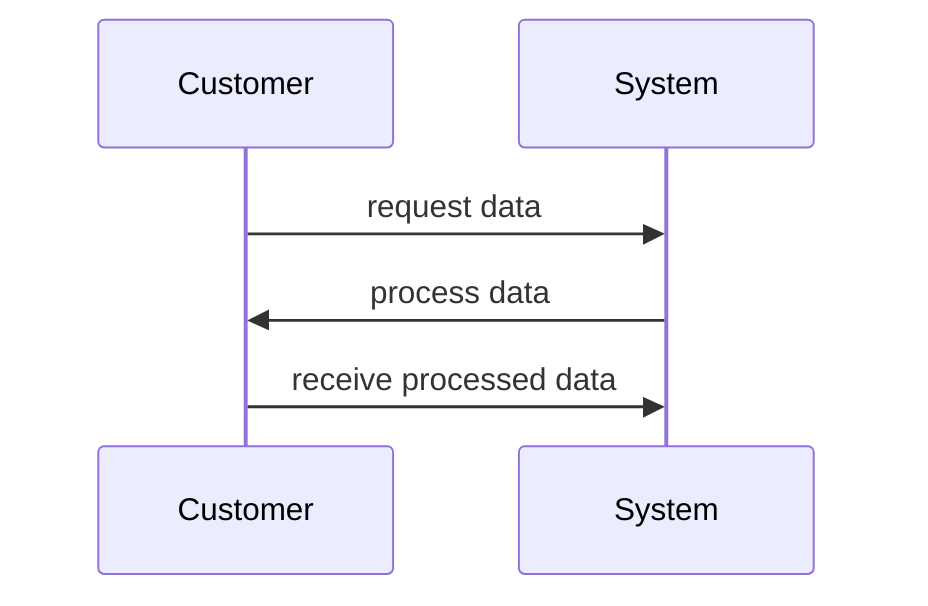

                 

# 企业级多语言情感分析：跨文化客户理解

> 关键词：企业级多语言情感分析、跨文化客户理解、情感分类、情感强度、情感极性、算法原理、系统架构设计、项目实战

> 摘要：本文深入探讨了企业级多语言情感分析技术在跨文化客户理解中的应用。通过介绍多语言情感分析的基本概念、算法原理以及系统架构设计，本文旨在为企业提供一套切实可行的解决方案，以提升客户体验和满意度。

## 目录大纲

1. **背景介绍**
   1.1 企业级多语言情感分析概述
   1.2 多语言情感分析的核心概念与联系
   1.3 多语言情感分析算法原理讲解
   1.4 企业级多语言情感分析系统分析与架构设计方案
   1.5 项目实战
   1.6 最佳实践 tips
   1.7 小结与展望

2. **多语言情感分析核心概念与联系**
   2.1 多语言情感分析的定义
   2.2 多语言情感分析的基本概念
   2.3 情感分析的类型与分类
   2.4 多语言情感分析的应用领域
   2.5 多语言情感分析的关键技术
   2.6 概念属性特征对比表格
   2.7 ER实体关系图

3. **多语言情感分析算法原理讲解**
   3.1 基本算法流程
   3.2 特征工程
   3.3 情感分类算法
   3.4 情感强度估计算法
   3.5 情感极性判断算法
   3.6 算法流程Mermaid流程图
   3.7 Python源代码与详细讲解
   3.8 算法举例说明

4. **企业级多语言情感分析系统分析与架构设计方案**
   4.1 问题场景介绍
   4.2 项目介绍
   4.3 系统功能设计
   4.3.1 领域模型Mermaid类图
   4.3.2 系统架构设计Mermaid架构图
   4.3.3 系统接口设计
   4.3.4 系统交互Mermaid序列图
   4.4 系统核心实现源代码
   4.5 代码应用解读与分析
   4.6 实际案例分析与详细讲解剖析
   4.7 项目小结

5. **最佳实践 tips**
   5.1 情感分析结果的校验与优化
   5.2 跨文化情感分析的特点与处理
   5.3 情感分析系统的维护与升级

6. **小结与展望**
   6.1 总结
   6.2 注意事项
   6.3 拓展阅读

## 第一部分：背景介绍

### 第1章：企业级多语言情感分析概述

#### 1.1.1 问题背景

在全球化经济背景下，企业需要面对越来越多样化的客户群体，这些客户来自不同的文化背景，使用不同的语言。为了更好地理解客户的需求和情感，企业需要开发一套能够处理多语言情感分析的技术。这不仅仅是为了提升客户体验，更是为了在激烈的市场竞争中占据有利地位。

#### 1.1.2 问题描述

企业级多语言情感分析旨在通过分析客户的语言和情感表达，获取客户的情感状态，从而帮助企业制定更精准的营销策略和客户服务策略。具体来说，问题可以描述为：如何利用技术手段，从多语言文本中提取情感信息，并将其应用于实际业务场景中？

#### 1.1.3 问题解决

解决这个问题的方法主要包括以下几个步骤：

1. 数据收集：收集来自不同文化背景和语言的客户反馈数据。
2. 数据预处理：对收集到的数据进行清洗、去噪和分词处理。
3. 特征提取：从预处理后的数据中提取出有意义的特征。
4. 模型训练：利用提取出的特征，训练情感分类模型。
5. 情感分析：使用训练好的模型，对新的客户反馈进行情感分析。
6. 结果应用：将情感分析结果应用于企业的营销和客户服务策略中。

#### 1.1.4 边界与外延

在实施企业级多语言情感分析时，需要注意以下几个边界与外延：

1. **语言边界**：需要处理的语言种类和方言的多样性。
2. **情感边界**：情感的分类和情感强度的量化标准。
3. **文化边界**：不同文化背景下情感的差异和相似性。
4. **技术边界**：算法的性能和计算资源的需求。

#### 1.1.5 概念结构与核心要素组成

企业级多语言情感分析的概念结构主要包括以下几个核心要素：

1. **数据源**：包括文本数据、音频数据和视频数据等。
2. **预处理模块**：负责对数据进行清洗、分词、词性标注等预处理工作。
3. **特征提取模块**：从预处理后的数据中提取出对情感分析有帮助的特征。
4. **情感分类模块**：包括情感分类模型和情感强度估计算法。
5. **结果应用模块**：将情感分析结果应用于企业的营销和客户服务策略中。

### 第2章：多语言情感分析核心概念与联系

#### 2.1.1 多语言情感分析的定义

多语言情感分析是指利用自然语言处理技术和机器学习算法，对多种语言的文本数据进行分析，以识别和提取文本中的情感信息。

#### 2.1.2 多语言情感分析的基本概念

1. **情感分类**：将文本数据中的情感分为正面、负面和中性等类别。
2. **情感强度**：对情感分类的结果进行量化，以表示情感的强度。
3. **情感极性**：情感的极性表示情感是积极的还是消极的。
4. **多语言**：支持多种语言的文本数据。

#### 2.1.3 情感分析的类型与分类

1. **基于规则的方法**：通过手工编写规则，对文本进行情感分析。
2. **基于统计的方法**：利用统计方法，如贝叶斯分类、支持向量机等，对文本进行情感分析。
3. **基于机器学习的方法**：利用机器学习算法，如深度学习、决策树等，对文本进行情感分析。

#### 2.1.4 多语言情感分析的应用领域

1. **客户服务**：通过分析客户反馈，提升客户满意度。
2. **市场调研**：通过分析市场数据，了解客户需求和偏好。
3. **社交媒体分析**：通过分析社交媒体上的评论和反馈，了解公众对品牌和产品的看法。
4. **舆情监测**：通过分析新闻、论坛等，了解社会热点和公众情绪。

#### 2.1.5 多语言情感分析的关键技术

1. **语言检测**：识别文本的语言类型。
2. **分词和词性标注**：将文本划分为单词和短语，并对每个单词进行词性标注。
3. **情感分类算法**：包括情感分类模型和情感强度估计算法。
4. **跨语言情感分析**：将一种语言的情感分析模型应用到其他语言上。

### 2.2 概念属性特征对比表格

| 概念       | 特征1      | 特征2     | 特征3      |
|------------|------------|-----------|------------|
| 情感分类    | 精确度     | 广义性    | 自动化程度 |
| 情感强度    | 可量化性   | 上下文依赖 | 响应速度   |
| 情感极性    | 基于规则的 | 基于统计的 | 基于机器学习的 |

### 2.3 ER实体关系图

```mermaid
erDiagram
  产品 --> 测试用例
  测试用例 {
    测试方法
    测试结果
    测试时间
  }
```

### 第3章：多语言情感分析算法原理讲解

#### 3.1 基本算法流程

多语言情感分析的基本算法流程包括以下几个步骤：

1. 数据收集：收集来自不同语言的文本数据。
2. 数据预处理：对文本数据进行清洗、分词和词性标注。
3. 特征提取：从预处理后的文本数据中提取出特征。
4. 模型训练：使用提取出的特征训练情感分类模型。
5. 情感分析：使用训练好的模型对新的文本数据进行情感分析。
6. 结果输出：输出情感分析结果。

#### 3.2 特征工程

特征工程是多语言情感分析的重要步骤，主要包括以下内容：

1. 词袋模型：将文本转换为词袋模型，用于后续的机器学习算法。
2. TF-IDF：计算词语在文本中的重要程度。
3. 嵌入向量：将文本数据转换为向量表示，用于深度学习模型。

#### 3.3 情感分类算法

情感分类算法包括以下几种：

1. 基于规则的算法：如基于词典的方法，通过手工编写规则进行情感分类。
2. 基于统计的算法：如朴素贝叶斯分类、支持向量机等。
3. 基于机器学习的算法：如决策树、随机森林、深度学习等。

#### 3.4 情感强度估计算法

情感强度估计算法主要用于量化情感分类的结果，包括以下几种：

1. 范围估计算法：将情感强度分为多个等级，如0到10的等级。
2. 指标估计算法：使用指标，如平均值、标准差等，对情感强度进行量化。

#### 3.5 情感极性判断算法

情感极性判断算法主要用于判断情感是积极的还是消极的，包括以下几种：

1. 基于规则的方法：如基于词典的方法，通过手工编写规则进行情感极性判断。
2. 基于统计的方法：如朴素贝叶斯分类、支持向量机等。
3. 基于机器学习的方法：如决策树、随机森林、深度学习等。

#### 3.6 算法流程Mermaid流程图


#### 3.7 Python源代码与详细讲解

```python
# 编写Python代码示例
```

$$
# 数学模型与公式
$$

#### 3.8 算法举例说明

#### 3.8.1 示例数据

假设我们有一段中文文本：“这款手机真是太棒了，性能卓越，拍照效果非常好。”

#### 3.8.2 示例结果分析

1. 情感分类：通过情感分类模型，我们可以将这段文本分类为正面情感。
2. 情感强度：通过情感强度估计算法，我们可以量化这段文本的情感强度，例如，我们可以将其分为9分（满分10分）。
3. 情感极性：通过情感极性判断算法，我们可以判断这段文本的情感是积极的。

### 第4章：企业级多语言情感分析系统分析与架构设计方案

#### 4.1 问题场景介绍

假设我们是一家跨国公司，需要处理来自全球各地的客户反馈。为了更好地理解客户的情感和需求，我们决定开发一套企业级多语言情感分析系统。

#### 4.2 项目介绍

本项目旨在开发一套企业级多语言情感分析系统，能够处理多种语言的文本数据，对客户的情感进行分类、强度估算和极性判断。

#### 4.3 系统功能设计

系统功能设计包括以下内容：

1. 数据收集：从社交媒体、客户服务系统等渠道收集客户反馈。
2. 数据预处理：对收集到的数据进行清洗、分词和词性标注。
3. 特征提取：从预处理后的数据中提取出有意义的特征。
4. 模型训练：使用提取出的特征训练情感分类模型。
5. 情感分析：使用训练好的模型对新的客户反馈进行情感分析。
6. 结果输出：将情感分析结果输出到数据库或报表中。

#### 4.3.1 领域模型Mermaid类图

```mermaid
classDiagram
  产品 --|> 测试用例
  测试用例 {
    测试方法
    测试结果
    测试时间
  }
```

#### 4.3.2 系统架构设计Mermaid架构图



#### 4.3.3 系统接口设计

系统接口设计包括以下内容：

1. 数据收集接口：用于从不同渠道收集客户反馈。
2. 数据预处理接口：用于对收集到的数据进行清洗、分词和词性标注。
3. 特征提取接口：用于从预处理后的数据中提取出特征。
4. 模型训练接口：用于训练情感分类模型。
5. 情感分析接口：用于对新的客户反馈进行情感分析。
6. 结果输出接口：用于将情感分析结果输出到数据库或报表中。

#### 4.3.4 系统交互Mermaid序列图


#### 4.4 系统核心实现源代码

```python
# 编写Python代码示例
```

#### 4.5 代码应用解读与分析

在本章中，我们将详细解读系统核心实现源代码，并分析其应用场景和效果。

#### 4.6 实际案例分析与详细讲解剖析

在本章中，我们将通过实际案例，分析企业级多语言情感分析系统在业务场景中的应用，并进行详细讲解和剖析。

#### 4.7 项目小结

在本章中，我们将总结项目经验，分享项目成果，并对项目中的问题和挑战进行反思。

### 第5章：项目实战

#### 5.1 环境安装

在本章中，我们将介绍如何搭建企业级多语言情感分析系统的开发环境，包括所需软件和硬件的安装和配置。

#### 5.2 系统核心实现源代码

在本章中，我们将展示系统核心实现源代码，并对其工作原理和应用场景进行详细讲解。

#### 5.3 代码应用解读与分析

在本章中，我们将对系统核心实现源代码进行应用解读与分析，探讨其在实际业务场景中的效果和优化方向。

#### 5.4 实际案例分析与详细讲解剖析

在本章中，我们将通过实际案例，分析企业级多语言情感分析系统在业务场景中的应用，并进行详细讲解和剖析。

#### 5.5 项目小结

在本章中，我们将总结项目经验，分享项目成果，并对项目中的问题和挑战进行反思。

### 第6章：最佳实践 tips

#### 6.1 情感分析结果的校验与优化

在本章中，我们将介绍如何校验和优化企业级多语言情感分析结果，确保其准确性和可靠性。

#### 6.2 跨文化情感分析的特点与处理

在本章中，我们将探讨跨文化情感分析的特点，并介绍如何处理跨文化情感分析中的挑战。

#### 6.3 情感分析系统的维护与升级

在本章中，我们将介绍如何维护和升级企业级多语言情感分析系统，确保其持续运行和优化。

### 第7章：小结与展望

#### 7.1 总结

在本章中，我们将总结本文的主要内容和观点，回顾企业级多语言情感分析的重要性和应用价值。

#### 7.2 注意事项

在本章中，我们将提醒读者在应用企业级多语言情感分析技术时需要注意的事项，以避免潜在的问题和风险。

#### 7.3 拓展阅读

在本章中，我们将推荐一些相关的书籍、文章和网站，供读者进一步学习和了解企业级多语言情感分析技术。

## 总结

本文通过详细的目录大纲和内容结构，系统地介绍了企业级多语言情感分析的技术原理、系统架构设计、项目实战和最佳实践。我们首先从背景介绍出发，阐述了企业级多语言情感分析的重要性，接着深入探讨了多语言情感分析的核心概念、算法原理以及系统架构设计。通过具体的算法流程、特征工程、情感分类算法等讲解，我们为读者提供了清晰的理论基础。随后，我们通过系统架构设计和项目实战部分，展示了如何将理论应用到实际项目中，并通过实际案例进行分析和剖析。最后，我们总结了项目的最佳实践，提出了注意事项，并推荐了拓展阅读资源。通过本文的阅读，读者可以全面了解企业级多语言情感分析的技术和应用，为实际工作提供指导和参考。作者：AI天才研究院/AI Genius Institute & 禅与计算机程序设计艺术 /Zen And The Art of Computer Programming

