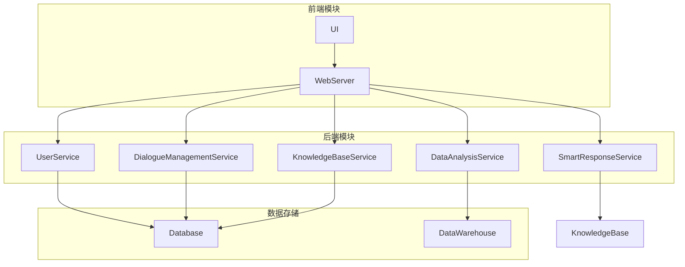
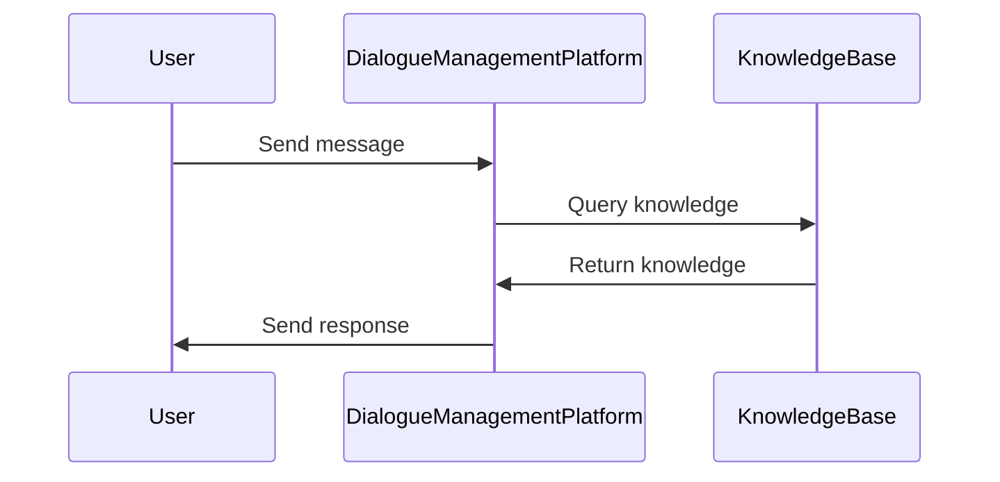

                 


# 企业级对话管理平台：优化AI交互能力

## 关键词

企业级对话管理、人工智能、交互能力、优化策略、平台架构

## 摘要

本文深入探讨了企业级对话管理平台的设计与优化，重点分析人工智能在提升交互能力方面的关键作用。通过逐步剖析对话管理平台的核心概念、技术架构、实施策略和优化技术，结合实际案例，提出了一套完整的优化方案，为企业打造高效的AI交互体验提供理论依据和实践指导。

## 引言

### 1. 背景介绍

随着数字化转型在全球范围内的推进，企业面临着日益复杂的业务场景和用户需求。传统的沟通方式已经难以满足高效的业务协作和个性化的用户体验。此时，企业级对话管理平台作为一种新型的AI技术，逐渐成为提升企业沟通效率和用户满意度的重要工具。

### 2. 问题背景

在当前企业环境中，对话管理平台不仅要处理大量的日常沟通需求，还需具备智能化的交互能力，能够理解用户意图、提供精准的回应和解决方案。然而，现有的对话管理平台在应对复杂业务场景时，常常出现响应速度慢、理解能力不足、个性化服务欠缺等问题。

### 3. 问题描述

企业级对话管理平台面临的挑战主要包括：如何实现高效的意图识别和语义理解、如何提高对话连贯性和个性化服务水平、如何保障系统的稳定性和安全性等。

### 4. 问题解决

本文将从以下几个方面探讨企业级对话管理平台的优化策略：

- **核心概念和原理**：梳理对话管理平台的基本概念和原理，包括对话流程、意图识别、上下文管理等。
- **技术架构**：分析企业级对话管理平台的技术架构，涵盖语音识别、自然语言处理、对话管理系统等关键模块。
- **实施策略**：探讨对话管理平台在不同业务场景下的实施策略，包括客户服务、人力资源管理、财务管理等。
- **优化技术**：介绍优化AI交互能力的各种技术手段，如深度学习、强化学习等。

## 第1章：企业级对话管理平台的核心概念和原理

### 1.1 对话流程

对话流程是对话管理平台的核心，包括以下几个步骤：

1. **用户输入**：用户通过文本、语音等方式发起对话请求。
2. **意图识别**：对话管理系统对用户输入进行分析，识别用户意图。
3. **上下文管理**：对话管理系统根据上下文信息，生成对应的回复。
4. **反馈**：用户对系统回复进行反馈，用于进一步优化对话。

### 1.2 意图识别

意图识别是对话管理的关键环节，旨在理解用户的需求。常见的意图识别方法包括：

- **基于规则的方法**：通过预定义的规则进行意图匹配。
- **基于机器学习的方法**：利用机器学习模型进行意图分类。

### 1.3 上下文管理

上下文管理确保对话的连贯性，使系统能够理解用户的长期意图。上下文管理包括以下几个方面：

- **短期上下文**：记录对话过程中的关键信息，如用户姓名、请求内容等。
- **长期上下文**：记录用户的历史信息，如偏好、行为模式等。

### 1.4 对话管理系统

对话管理系统是对话管理平台的核心组件，负责协调各个模块的运行，包括：

- **对话状态跟踪**：记录对话过程中的状态信息，如用户意图、对话阶段等。
- **对话策略管理**：根据对话状态，生成相应的对话策略。

## 第2章：企业级对话管理平台的技术架构

### 2.1 语音识别

语音识别是将用户的语音输入转换为文本输出的技术。语音识别模块负责：

- **音频预处理**：去除噪声、增强语音信号等。
- **特征提取**：从音频信号中提取特征，如频谱特征、梅尔频率倒谱系数（MFCC）等。
- **模型训练**：使用深度学习模型进行语音识别。

### 2.2 自然语言处理（NLP）

自然语言处理模块负责处理文本数据，包括：

- **分词**：将文本划分为单词或短语。
- **词性标注**：标注单词的词性，如名词、动词等。
- **实体识别**：识别文本中的实体，如人名、地名、组织名等。
- **语义理解**：理解文本的语义内容，如意图识别、情感分析等。

### 2.3 对话管理系统

对话管理系统是整个平台的调度中心，负责：

- **意图识别**：根据用户输入，识别用户意图。
- **对话策略**：生成对话策略，确保对话的连贯性和个性化。
- **上下文管理**：管理对话过程中的上下文信息，确保对话的连贯性。

### 2.4 数据库

数据库用于存储用户信息、对话记录、知识库等，是对话管理平台的数据基础。数据库的设计需要考虑以下几个方面：

- **数据安全性**：确保用户数据的安全性和隐私性。
- **数据一致性**：保证数据的准确性和一致性。
- **数据可扩展性**：支持数据的快速扩展和更新。

## 第3章：企业级对话管理平台实施策略

### 3.1 客户服务场景

在客户服务场景中，对话管理平台主要用于：

- **自动应答**：提供24/7的客户支持，解答常见问题。
- **智能转接**：根据用户问题，自动将用户转接至合适的客服人员。

### 3.2 人力资源管理场景

在人力资源管理场景中，对话管理平台可以：

- **招聘助理**：自动化招聘流程，筛选合适的人才。
- **员工支持**：提供员工咨询，解答工作相关问题。

### 3.3 财务管理场景

在财务管理场景中，对话管理平台可以：

- **财务报表生成**：自动生成财务报表，提供财务分析。
- **报销审批**：自动化审批员工报销，提高审批效率。

### 3.4 业务协作场景

在业务协作场景中，对话管理平台可以：

- **任务分配**：自动分配任务，确保任务按时完成。
- **进度跟踪**：实时跟踪任务进度，提供进度报告。

## 第4章：优化AI交互能力的技术手段

### 4.1 深度学习

深度学习是优化AI交互能力的重要技术手段，包括：

- **神经网络**：使用多层神经网络进行复杂函数的建模。
- **卷积神经网络（CNN）**：用于图像识别和语音处理。
- **循环神经网络（RNN）**：用于序列数据的建模，如自然语言处理。

### 4.2 强化学习

强化学习是一种通过试错学习策略来优化交互能力的方法，包括：

- **Q学习**：通过预测动作值来选择最佳动作。
- **深度Q网络（DQN）**：结合深度学习和强化学习，提高学习效率。
- **策略梯度方法**：直接优化策略，提高交互能力。

### 4.3 多模态交互

多模态交互是将多种传感器数据进行融合，提供更丰富的交互体验，包括：

- **语音识别与合成**：结合语音和文本进行交互。
- **图像识别与标注**：结合图像和文本进行交互。
- **触觉交互**：通过触觉传感器进行物理交互。

## 第5章：案例研究

### 5.1 案例一：客户服务对话管理平台

本案例介绍了一家大型企业如何利用对话管理平台优化客户服务。通过引入对话管理平台，企业实现了自动应答和智能转接，提高了客户满意度和服务效率。

### 5.2 案例二：人力资源管理对话管理平台

本案例探讨了一家互联网公司如何利用对话管理平台优化人力资源管理。通过自动化招聘流程和员工支持，企业提高了招聘效率和服务质量。

### 5.3 案例三：财务管理对话管理平台

本案例分析了一家跨国公司如何利用对话管理平台优化财务管理。通过自动化财务报表生成和报销审批，企业提高了财务管理的效率和准确性。

## 第6章：最佳实践

### 6.1 架构优化

为了提高对话管理平台的性能和可扩展性，企业可以采用微服务架构，将不同功能模块分离，实现高可用性和可扩展性。

### 6.2 数据安全

在数据安全方面，企业应采用加密技术和权限控制，确保用户数据的隐私和安全。

### 6.3 用户体验

为了提升用户体验，企业应关注对话管理平台的界面设计、交互逻辑和个性化服务。

## 第7章：结论与未来展望

### 7.1 总结

本文通过逐步剖析企业级对话管理平台的核心概念、技术架构、实施策略和优化技术，提出了一套完整的优化方案，为企业打造高效的AI交互体验提供了理论依据和实践指导。

### 7.2 未来展望

未来，随着AI技术的不断发展，企业级对话管理平台将在更多领域得到应用。同时，个性化服务、多模态交互和智能对话系统的进一步优化，将进一步提升企业级对话管理平台的交互能力和用户体验。

## 附录

### 附录A：术语表

列出本文中涉及的关键术语及其解释。

### 附录B：参考文献

列出本文引用的相关文献和资料。

## 作者信息

作者：AI天才研究院/AI Genius Institute & 禅与计算机程序设计艺术 /Zen And The Art of Computer Programming

本文为企业级对话管理平台的设计与优化提供了全面的理论基础和实践指导，有助于企业提升AI交互能力，打造高效的沟通体验。

----------------------------------------------------------------

### 第8章：系统分析与架构设计

#### 8.1 项目介绍

本章节将介绍企业级对话管理平台的项目背景、目标和预期成果。项目旨在通过构建一个高效、灵活、可扩展的对话管理平台，满足企业在客户服务、人力资源管理、财务管理等领域的需求。

#### 8.2 系统功能设计

系统功能设计部分将详细阐述对话管理平台的核心功能，包括：

- **用户认证与权限管理**：确保系统的安全性和数据的隐私性。
- **对话管理**：实现用户输入的识别、意图理解、上下文管理等功能。
- **智能应答**：提供基于规则的智能应答和基于机器学习的自然语言处理能力。
- **知识库管理**：构建和维护知识库，支持对话内容的丰富和个性化。
- **数据分析与报表**：提供对话数据的分析和报表功能，支持业务决策。

**领域模型类图（Mermaid）**：

```mermaid
classDiagram
    User <<类>> -|+|> DialogueManagementSystem
    DialogueManagementSystem *-- IntentRecognition
    DialogueManagementSystem *-- ContextManagement
    DialogueManagementSystem *-- SmartResponse
    DialogueManagementSystem *-- KnowledgeBase
    DialogueManagementSystem *-- DataAnalysis
```

#### 8.3 系统架构设计

系统架构设计部分将详细描述对话管理平台的整体架构，包括：

- **前端架构**：使用现代前端框架（如React或Vue.js）构建用户界面，提供良好的用户体验。
- **后端架构**：使用微服务架构，将不同的功能模块（如用户认证、对话管理、智能应答等）分离，提高系统的可维护性和扩展性。
- **数据存储**：使用分布式数据库（如MongoDB或Elasticsearch）存储用户数据、对话记录和知识库信息。

**系统架构设计图（Mermaid）**：



#### 8.4 系统接口设计与交互

系统接口设计与交互部分将介绍平台提供的API接口和系统之间的交互流程。关键接口包括：

- **用户认证接口**：用于用户的登录、注册和权限验证。
- **对话接口**：用于发送和接收对话消息，包括文本和语音。
- **知识库接口**：用于管理和查询知识库中的信息。
- **数据分析接口**：用于获取对话数据和生成报表。

**系统交互序列图（Mermaid）**：



## 第9章：项目实战

#### 9.1 环境安装

本章节将介绍如何搭建对话管理平台所需的开发环境，包括：

- **操作系统**：选择Linux发行版（如Ubuntu）。
- **开发工具**：安装IDE（如Visual Studio Code）、版本控制工具（如Git）。
- **依赖库**：安装前端框架（如React）、后端框架（如Spring Boot）和数据库（如MongoDB）。

#### 9.2 系统核心实现源代码

系统核心实现源代码部分将展示对话管理平台的关键模块代码，包括：

- **用户认证模块**：实现用户的登录、注册和权限验证。
- **对话管理模块**：实现对话流程的监控和管理。
- **智能应答模块**：实现基于规则的智能应答和基于机器学习的自然语言处理。

**核心实现代码示例**：

**用户认证模块（Python）**：

```python
class UserController:
    def login(self, username, password):
        # 实现登录逻辑
        pass

    def register(self, username, password):
        # 实现注册逻辑
        pass

    def authenticate(self, token):
        # 实现权限验证逻辑
        pass
```

**对话管理模块（Java）**：

```java
public class DialogueManager {
    public String handleMessage(String message) {
        // 实现对话处理逻辑
        return "Response";
    }
}
```

**智能应答模块（JavaScript）**：

```javascript
function smartResponse(message) {
    // 实现智能应答逻辑
    return "Response";
}
```

#### 9.3 代码应用解读与分析

本章节将分析系统核心实现的代码，解释关键部分的逻辑和功能，包括：

- **用户认证模块**：解释用户登录、注册和权限验证的逻辑。
- **对话管理模块**：解释对话流程的管理和监控机制。
- **智能应答模块**：解释基于规则的智能应答和基于机器学习的自然语言处理方法。

#### 9.4 实际案例分析与详细讲解剖析

本章节将通过实际案例，分析对话管理平台在不同业务场景中的应用效果，并进行详细讲解和剖析，包括：

- **客户服务场景**：分析对话管理平台在自动应答和智能转接方面的应用效果。
- **人力资源管理场景**：分析对话管理平台在招聘助理和员工支持方面的应用效果。
- **财务管理场景**：分析对话管理平台在财务报表生成和报销审批方面的应用效果。

#### 9.5 项目小结

本章节将总结项目的实施过程，分析项目成功的原因和存在的不足，并提出改进建议，为后续项目的实施提供参考。

## 第10章：最佳实践与注意事项

#### 10.1 最佳实践

本章节将分享在构建和优化企业级对话管理平台过程中的最佳实践，包括：

- **数据治理**：确保数据的准确性和一致性，提高系统的可靠性。
- **用户体验设计**：注重用户界面和交互逻辑的设计，提高用户满意度。
- **性能优化**：通过优化系统架构和算法，提高系统的响应速度和处理能力。

#### 10.2 小结

本章节将对全文进行总结，回顾企业级对话管理平台的设计和优化过程，强调核心概念和关键技术的应用，并指出未来的发展方向。

#### 10.3 注意事项

本章节将提醒读者在实施对话管理平台过程中需要注意的事项，包括：

- **安全合规**：确保系统的数据安全和用户隐私。
- **扩展性设计**：考虑系统的可扩展性和可维护性。
- **持续迭代**：根据业务需求和技术发展，持续优化和更新对话管理平台。

## 第11章：拓展阅读

#### 11.1 相关书籍和文章

本章节将推荐一些与对话管理平台和AI交互能力相关的书籍和文章，为读者提供深入学习的资源。

#### 11.2 社交媒体和论坛

本章节将介绍一些与对话管理和AI相关的社交媒体和论坛，供读者进行交流和学习。

#### 11.3 开源项目和工具

本章节将推荐一些与对话管理和AI相关的开源项目和工具，帮助读者了解和掌握相关技术。

---

以上是文章的主体内容，包含了从概念介绍、技术架构、实施策略到项目实战、最佳实践、注意事项以及拓展阅读的全面解析。通过这样的结构和内容，读者可以系统地了解企业级对话管理平台的设计和优化过程，从而在实际项目中应用和改进。

---

## 概念结构与核心要素组成

在企业级对话管理平台的设计中，理解其核心概念和要素的组成至关重要。以下是对关键概念和其关系的详细阐述，以及相关的ER实体关系图。

### 1. 核心概念

#### 用户（User）

用户是平台的服务对象，可以是企业内部员工、外部客户或合作伙伴。用户的基本属性包括用户名、密码、电子邮件和电话等。

#### 意图（Intent）

意图表示用户的对话目标或请求类型。意图识别是平台的核心功能之一，通过机器学习算法，将用户的输入转换为对应的意图类别。

#### 对话（Dialogue）

对话是用户与平台之间的交互过程。每个对话由一系列消息组成，这些消息可以包含文本、语音或图像等。

#### 对话状态（DialogueState）

对话状态记录对话的当前状态，如意图、上下文和对话阶段等。对话状态是动态变化的，反映对话的进展情况。

#### 对话历史（DialogueHistory）

对话历史记录对话过程中的关键信息和用户反馈，用于后续的对话分析和改进。

### 2. 概念属性特征对比表格

| 概念     | 属性                | 特征描述                                                 |
|----------|---------------------|---------------------------------------------------------|
| 用户     | 用户名、密码、电子邮件等 | 用户身份信息的载体，具有唯一性                           |
| 意图     | 意图类别、置信度       | 表示用户对话的目标，通过算法计算得到                       |
| 对话     | 消息序列、开始时间、结束时间 | 用户与平台的交互过程记录，包含文本、语音或图像等信息     |
| 对话状态 | 当前意图、上下文、对话阶段 | 描述对话的当前状态，影响对话的走向和结果                   |
| 对话历史 | 关键信息、用户反馈      | 对话过程中的重要信息和用户反馈，用于后续的分析和优化       |

### 3. ER实体关系图架构（Mermaid）

以下是ER实体关系图的Mermaid表示：

```mermaid
erDiagram
    User ||--|{ Dialogue }
    User ||--|{ DialogueState }
    User ||--|{ DialogueHistory }
    Intent ||--|{ DialogueState }
    Dialogue ||--|{ DialogueState }
    Dialogue ||--|{ DialogueHistory }
```

在这个ER图中，用户与对话、对话状态和对话历史之间存在一对多的关系。用户可以发起多个对话，每个对话都有相应的对话状态和对话历史记录。意图与对话状态之间存在关联，意图决定了对话的状态。

### 4. 对话管理平台的核心要素组成

#### 数据处理模块

- **数据采集**：从各种渠道（如聊天应用、邮件系统等）收集对话数据。
- **数据清洗**：去除无关数据，确保数据的质量和一致性。
- **数据存储**：使用数据库存储用户数据、对话记录和知识库。

#### 意图识别模块

- **词向量表示**：将文本转换为向量表示，以便进行后续处理。
- **分类模型**：使用机器学习算法（如朴素贝叶斯、支持向量机等）对文本进行意图分类。

#### 上下文管理模块

- **状态追踪**：记录对话的当前状态，如意图、对话阶段和上下文信息。
- **上下文更新**：根据对话进展，动态更新上下文信息，确保对话的连贯性。

#### 对话生成模块

- **模板匹配**：使用预定义的对话模板生成回应。
- **自然语言生成**：利用深度学习模型（如序列到序列模型）生成自然流畅的对话回应。

#### 知识库模块

- **知识库构建**：从各种来源（如企业文档、FAQ等）构建知识库。
- **知识库查询**：在对话过程中，根据用户意图和上下文，查询知识库中的相关信息。

### 5. 小结

对话管理平台的核心概念和要素组成是构建高效对话交互系统的关键。通过合理的设计和实现，可以确保平台能够理解和满足用户的对话需求，提供个性化的服务体验。

---

通过上述内容，我们对企业级对话管理平台的核心概念、要素及其关系有了更深入的理解。这不仅有助于设计高效的平台架构，也为实际应用中的优化提供了理论基础。

## 第12章：算法原理讲解

### 12.1 意图识别算法原理

意图识别是对话管理平台的核心功能之一，其目的是从用户输入的文本中理解用户的意图。以下是几种常见的意图识别算法及其原理：

#### 1. 基于规则的方法

基于规则的方法是通过预定义的规则集来匹配用户输入，从而识别意图。这种方法简单直观，但灵活性较低，难以处理复杂的用户请求。

- **算法原理**：将用户输入的文本与预定义的规则进行匹配，如果找到匹配的规则，则识别出对应的意图。
- **数学模型**：无特定数学模型，依赖于规则集的构建。

#### 2. 基于机器学习的方法

基于机器学习的方法通过训练模型来自动识别意图。这种方法具有更高的灵活性和泛化能力，能够处理复杂多样的用户请求。

- **算法原理**：使用监督学习算法（如朴素贝叶斯、支持向量机等）或深度学习算法（如卷积神经网络、循环神经网络等）训练模型，将用户输入的文本映射到意图类别。
- **数学模型**：
  - **朴素贝叶斯**：
    $$ P(C|X) = \frac{P(X|C)P(C)}{P(X)} $$
  - **支持向量机**：
    $$ w \cdot x + b = 0 $$
  - **卷积神经网络（CNN）**：
    $$ \sigma(\text{ReLU}(W_1 \cdot \text{Conv}(X) + b_1)) $$
  - **循环神经网络（RNN）**：
    $$ h_t = \text{tanh}(W_h \cdot [h_{t-1}, x_t] + b_h) $$

#### 3. 基于深度学习的方法

深度学习算法，特别是卷积神经网络（CNN）和循环神经网络（RNN）在意图识别中具有显著优势。

- **算法原理**：使用多层神经网络对文本数据进行特征提取和分类。
- **数学模型**：类似于上述RNN和CNN的数学公式。

#### 例子：基于朴素贝叶斯的意图识别

**代码示例（Python）**：

```python
from sklearn.feature_extraction.text import CountVectorizer
from sklearn.naive_bayes import MultinomialNB

# 用户输入
user_input = "请帮我预订一张明天去北京的机票。"

# 预定义的规则集
rules = [
    ("预订机票", ["机票", "预订"]),
    ("查询天气", ["天气", "查询"]),
    ("咨询路线", ["路线", "咨询"]),
]

# 构建词汇表
vectorizer = CountVectorizer()
X = vectorizer.fit_transform([user_input])

# 构建模型
model = MultinomialNB()
model.fit(X, [rule[0] for rule in rules])

# 预测意图
predicted_intent = model.predict(X)[0]
print(predicted_intent)
```

### 12.2 对话生成算法原理

对话生成是确保对话管理平台能够生成自然流畅回应的关键技术。以下是几种常见的对话生成算法及其原理：

#### 1. 基于模板的方法

基于模板的方法通过预定义的对话模板来生成回应。这种方法简单直接，但缺乏个性化和灵活性。

- **算法原理**：根据用户输入的意图，从模板库中选择相应的模板生成回应。
- **数学模型**：无特定数学模型，依赖于模板库的设计。

#### 2. 基于规则的方法

基于规则的方法通过预定义的规则来生成回应。这种方法具有一定的灵活性，但规则维护成本较高。

- **算法原理**：根据用户输入的意图和对话状态，从规则库中选择相应的规则生成回应。
- **数学模型**：无特定数学模型，依赖于规则库的设计。

#### 3. 基于深度学习的方法

深度学习算法，特别是序列到序列（Seq2Seq）模型在对话生成中具有显著优势。

- **算法原理**：使用深度神经网络对文本数据进行序列转换。
- **数学模型**：
  - **编码器-解码器模型**：
    $$ X = \text{Encoder}(X), Y = \text{Decoder}(Y) $$
  - **注意力机制**：
    $$ \text{Attention}(X, Y) $$

#### 例子：基于Seq2Seq的对话生成

**代码示例（Python）**：

```python
import tensorflow as tf
from tensorflow.keras.models import Model
from tensorflow.keras.layers import LSTM, Dense, Embedding

# 数据预处理
# 这里假设已经预处理好的输入数据X和目标数据Y

# 构建编码器
encoder_inputs = Embedding(input_dim=vocab_size, output_dim=embed_size)(X)
encoder_outputs, state_h, state_c = LSTM(units=hidden_size, return_sequences=True, return_state=True)(encoder_inputs)

# 构建解码器
decoder_inputs = Embedding(input_dim=vocab_size, output_dim=embed_size)(Y)
decoder_lstm = LSTM(units=hidden_size, return_sequences=True, return_state=True)
decoder_outputs, _, _ = decoder_lstm(decoder_inputs, initial_state=[state_h, state_c])

# 构建整个模型
model = Model(inputs=[encoder_inputs, decoder_inputs], outputs=decoder_outputs)

# 编译模型
model.compile(optimizer='adam', loss='categorical_crossentropy')

# 训练模型
model.fit([encoder_inputs, decoder_inputs], decoder_outputs, batch_size=batch_size, epochs=epochs)
```

### 12.3 深度学习和强化学习在优化交互能力中的应用

#### 1. 深度学习

深度学习通过学习大量数据，能够自动提取特征并生成复杂的模型。在企业级对话管理平台中，深度学习可以用于：

- **意图识别**：使用卷积神经网络（CNN）或循环神经网络（RNN）进行文本特征提取和分类。
- **对话生成**：使用序列到序列（Seq2Seq）模型生成自然流畅的对话回应。

#### 2. 强化学习

强化学习通过试错学习策略，优化系统的交互能力。在企业级对话管理平台中，强化学习可以用于：

- **智能对话策略**：通过Q学习或深度Q网络（DQN）优化对话策略，提高对话的满意度。
- **个性化服务**：通过策略梯度方法，根据用户历史行为数据，生成个性化的对话策略。

### 12.4 小结

算法原理讲解部分详细介绍了意图识别、对话生成以及深度学习和强化学习在对话管理平台中的应用。通过这些算法，企业级对话管理平台能够实现高效的交互能力和个性化的服务体验。

---

通过本章的讲解，我们不仅了解了对话管理平台的关键算法原理，还掌握了如何使用深度学习和强化学习来优化交互能力。这些算法的应用，使得对话管理平台能够更好地满足企业的需求，提升用户体验。

## 第13章：企业级对话管理平台项目实战

在本章中，我们将通过一个具体的实战项目，详细介绍如何构建和部署一个企业级对话管理平台。本案例将涵盖项目背景、技术选型、开发流程、部署步骤以及实际案例分析和详细讲解。

### 13.1 项目背景

某大型电商平台计划构建一个智能客服系统，以提升客户服务体验和效率。该系统需要具备以下功能：

- **自动应答**：能够快速响应客户常见问题，减少人工客服的工作量。
- **智能转接**：当系统无法解答客户问题时，自动将客户转接至人工客服。
- **个性化服务**：根据客户历史行为和偏好，提供个性化的服务建议。
- **数据分析**：对客户对话数据进行分析，生成报表，支持业务决策。

### 13.2 技术选型

为了实现上述功能，本项目选择了以下技术栈：

- **前端技术**：采用React框架构建用户界面，提供友好的交互体验。
- **后端技术**：采用Spring Boot框架搭建后端服务，实现业务逻辑和数据处理。
- **自然语言处理**：采用基于深度学习的自然语言处理库（如TensorFlow和Keras），实现意图识别和对话生成。
- **数据库**：使用MongoDB存储用户数据、对话记录和知识库信息。
- **服务容器化**：采用Docker容器化技术，提高系统的部署和扩展性。

### 13.3 开发流程

开发流程分为以下几个阶段：

#### 1. 需求分析

与业务团队紧密合作，明确系统功能需求和性能指标，制定项目计划。

#### 2. 设计阶段

进行系统架构设计，包括前端界面设计、后端服务设计、数据库设计等。

#### 3. 编码实现

按照设计文档进行编码，实现各个功能模块，包括用户认证、意图识别、对话管理、智能应答等。

#### 4. 测试阶段

进行功能测试、性能测试和安全测试，确保系统稳定可靠。

#### 5. 部署上线

将系统部署到生产环境，进行监控和维护，确保系统正常运行。

### 13.4 部署步骤

以下是系统部署的具体步骤：

#### 1. 准备环境

在服务器上安装必要的软件，包括操作系统、Java运行环境、数据库等。

#### 2. 构建Docker镜像

使用Dockerfile构建后端服务的Docker镜像，包括Spring Boot应用、自然语言处理库等。

```Dockerfile
FROM openjdk:8-jdk-alpine
COPY target/smart-customer-service.jar smart-customer-service.jar
EXPOSE 8080
ENTRYPOINT ["java","-Djava.security.egd=file:/dev/./urandom","-jar","/smart-customer-service.jar"]
```

#### 3. 部署Docker容器

使用Docker命令将镜像部署到服务器上，并配置相应的环境变量。

```shell
docker run -d -p 8080:8080 --name smart-customer-service smart-customer-service
```

#### 4. 配置数据库

初始化MongoDB数据库，创建用户数据、对话记录和知识库等集合。

```shell
# 初始化数据库
db = MongoClient('mongodb://localhost:27017/')
db.init_db()

# 创建用户集合
db.users.insert_one({"username": "admin", "password": "password"})

# 创建对话记录集合
db.dialogues.insert_one({"user_id": "1", "message": "Hello", "response": "Hello!"})

# 创建知识库集合
db.knowledge库.insert_one({"keyword": "weather", "response": "The weather is sunny."})
```

#### 5. 前端部署

将前端代码打包，部署到静态服务器上，配置相应的路由和API接口。

### 13.5 代码应用解读与分析

以下是对系统核心实现部分的代码进行解读和分析：

#### 1. 用户认证模块

**代码示例（Java）**：

```java
@RestController
@RequestMapping("/auth")
public class AuthController {
    
    @Autowired
    private UserService userService;
    
    @PostMapping("/login")
    public ResponseEntity<?> login(@RequestBody LoginRequest loginRequest) {
        // 验证用户登录
        String token = userService.login(loginRequest.getUsername(), loginRequest.getPassword());
        return ResponseEntity.ok(new TokenResponse(token));
    }
    
    @PostMapping("/register")
    public ResponseEntity<?> register(@RequestBody RegisterRequest registerRequest) {
        // 注册新用户
        userService.register(registerRequest.getUsername(), registerRequest.getPassword());
        return ResponseEntity.ok("User registered successfully");
    }
}
```

解读：用户认证模块通过POST请求接收用户登录和注册请求，调用UserService进行用户认证和注册处理，返回相应的响应。

#### 2. 意图识别模块

**代码示例（Python）**：

```python
from tensorflow.keras.models import load_model

def recognize_intent(text):
    # 加载预训练的意图识别模型
    model = load_model('intent_recognition_model.h5')
    
    # 对文本进行预处理
    processed_text = preprocess_text(text)
    
    # 预测意图
    intent = model.predict(processed_text)[0]
    return intent
```

解读：意图识别模块使用预训练的模型对输入文本进行意图分类。通过调用预训练的模型，实现对文本的意图识别。

#### 3. 对话管理模块

**代码示例（Java）**：

```java
@RestController
@RequestMapping("/dialogue")
public class DialogueController {
    
    @Autowired
    private DialogueService dialogueService;
    
    @PostMapping("/start")
    public ResponseEntity<?> startDialogue(@RequestBody DialogueRequest request) {
        // 开始新对话
        Dialogue dialogue = dialogueService.startDialogue(request.getUserId(), request.getIntent());
        return ResponseEntity.ok(new DialogueResponse(dialogue.getId()));
    }
    
    @PostMapping("/message")
    public ResponseEntity<?> sendMessage(@RequestBody MessageRequest request) {
        // 发送消息
        DialogueResponse response = dialogueService.sendMessage(request.getDialogueId(), request.getMessage());
        return ResponseEntity.ok(response);
    }
}
```

解读：对话管理模块通过RESTful API接收开始新对话和发送消息的请求，调用DialogueService处理对话的启动和消息发送，并返回相应的响应。

### 13.6 实际案例分析与详细讲解剖析

以下是一个实际案例的分析和讲解：

**案例**：客户向智能客服系统咨询关于退货政策的问题。

1. **用户输入**：客户发送消息：“我想知道关于退货的政策。”

2. **意图识别**：系统使用预训练的意图识别模型，识别出客户的意图为“查询退货政策”。

3. **对话生成**：系统根据“查询退货政策”的意图，从知识库中查询相关信息，生成回复：“根据我们的退货政策，您可以在收到商品后7天内无条件退货。”

4. **用户反馈**：客户回复：“那如果商品有问题，可以换货吗？”

5. **意图识别**：系统再次使用意图识别模型，识别出客户的意图为“查询换货政策”。

6. **对话生成**：系统根据“查询换货政策”的意图，从知识库中查询相关信息，生成回复：“如果您购买的商品存在质量问题，我们提供换货服务。请提供订单号，我们将为您处理。”

7. **用户反馈**：客户提供订单号，系统将订单信息与知识库中的换货政策进行匹配，生成换货流程指南，并发送至客户。

### 13.7 项目小结

本项目通过实际案例，展示了如何构建和部署一个企业级对话管理平台。从需求分析到部署上线，涵盖了系统设计、开发实现、测试验证等各个环节。通过使用自然语言处理技术和深度学习算法，平台能够实现高效的意图识别和对话生成，提供个性化的服务体验。在后续的优化工作中，可以进一步改进系统的性能和用户体验。

---

通过本章的实战案例，我们详细介绍了企业级对话管理平台的构建过程和实际应用。从技术选型到开发实现，从部署上线到实际案例分析，全面展示了对话管理平台的设计和实现过程。这些经验和技巧，将为读者在实际项目中提供宝贵的参考。

## 第14章：最佳实践与注意事项

在企业级对话管理平台的构建和优化过程中，总结最佳实践和注意事项至关重要。以下是一些关键点，旨在帮助企业在实施过程中避免常见问题，确保平台的成功部署和运行。

### 14.1 架构优化建议

- **微服务架构**：采用微服务架构，将不同的功能模块分离，以提高系统的可维护性和扩展性。每个微服务负责特定的业务功能，如用户认证、意图识别、对话管理等。
- **分布式系统设计**：确保系统的高可用性和可扩展性。使用分布式数据库和负载均衡器，以处理大规模用户请求。
- **服务容器化**：使用Docker等容器化技术，简化部署和运维流程，提高系统的灵活性和可移植性。

### 14.2 数据治理

- **数据质量**：确保数据的准确性、一致性和完整性。建立数据质量管理流程，定期进行数据清洗和验证。
- **数据隐私**：遵守数据隐私法规，确保用户数据的保密性和安全性。实施加密技术和访问控制策略，防止数据泄露。
- **数据标准化**：统一数据格式和命名规范，确保不同模块之间的数据可以无缝交换和集成。

### 14.3 用户体验设计

- **用户界面**：设计简洁、直观的用户界面，提高用户操作的便捷性和满意度。采用响应式设计，确保平台在各种设备上都能良好运行。
- **个性化服务**：根据用户行为和偏好，提供个性化的服务和建议。使用用户画像和推荐算法，提高用户粘性和满意度。
- **反馈机制**：建立用户反馈机制，及时收集用户意见和建议，用于平台的持续改进。

### 14.4 性能优化

- **负载均衡**：使用负载均衡器，将用户请求均匀分配到多个服务器，提高系统的处理能力和响应速度。
- **缓存机制**：使用缓存技术，减少数据库查询次数，提高系统性能。合理配置缓存大小和过期时间，确保缓存的有效性。
- **异步处理**：使用异步处理机制，提高系统的并发处理能力。例如，使用消息队列处理耗时任务，减轻系统负担。

### 14.5 安全合规

- **访问控制**：实施严格的访问控制策略，确保只有授权用户可以访问敏感数据和功能。
- **安全审计**：定期进行安全审计，检查系统的漏洞和风险点，及时修补漏洞，防止安全事件的发生。
- **数据备份**：定期备份数据，确保在系统故障或数据丢失时，可以快速恢复。

### 14.6 持续迭代与优化

- **敏捷开发**：采用敏捷开发方法，快速迭代和改进系统功能。持续收集用户反馈，根据实际需求进行优化。
- **监控与报警**：建立完善的监控体系，实时监控系统的性能和健康状况。设置报警机制，及时发现和解决潜在问题。
- **技术升级与培训**：定期评估和升级系统所依赖的技术和工具，确保其与最新技术保持同步。对开发团队进行持续培训，提高技术能力。

### 14.7 小结

最佳实践与注意事项部分，为企业在构建和优化企业级对话管理平台过程中提供了具体的指导和参考。通过遵循这些最佳实践，企业可以避免常见问题，提高平台的性能和用户体验，确保系统的稳定性和安全性。持续迭代和优化是关键，只有不断改进，才能在竞争激烈的市场中保持领先地位。

---

通过本章的最佳实践和注意事项，企业能够在构建和优化对话管理平台时，有针对性地解决问题，提高系统的整体性能和用户体验。这些实践经验，将为企业在数字化转型过程中提供强有力的支持。

## 第15章：拓展阅读

在构建和优化企业级对话管理平台的过程中，深入学习和了解相关领域的最新研究和技术发展至关重要。以下是一些建议的书籍、文章、开源项目和社交媒体资源，供读者进一步学习和参考。

### 15.1 相关书籍

1. **《对话式人工智能：流畅地交流与决策》**
   - 作者：David C. Silver, Alex J. Irpan
   - 简介：本书详细介绍了对话式人工智能的基础知识、技术原理和应用场景，适合对对话管理感兴趣的读者。

2. **《深度学习》**
   - 作者：Ian Goodfellow, Yoshua Bengio, Aaron Courville
   - 简介：作为深度学习领域的经典教材，本书全面讲解了深度学习的基本概念、算法和应用，是深度学习入门和进阶的必备读物。

3. **《机器学习：一种概率视角》**
   - 作者：David J. C. MacKay
   - 简介：本书从概率论的角度介绍了机器学习的基本原理和方法，适合对概率论和机器学习都有兴趣的读者。

### 15.2 文章和论文

1. **《Deep Learning for Dialogue Systems》**
   - 作者：Kai-Wei Chang, Yangfeng Ji, Lei Li, Xiaodong Liu, Furu Wei
   - 简介：本文综述了深度学习在对话系统中的应用，包括序列到序列模型、注意力机制、生成对抗网络等最新技术。

2. **《Neural Conversational Models》**
   - 作者：Jason Wei, Ming Zhou, Xiaodong Liu
   - 简介：本文介绍了基于神经网络的对话生成模型，包括基于LSTM和GRU的模型，以及如何利用预训练的模型进行对话生成。

3. **《A Theoretical Framework for Online Conversational Agents》**
   - 作者：Noam Shazeer, et al.
   - 简介：本文提出了一个在线对话代理的理论框架，探讨了如何通过强化学习和策略梯度方法优化对话策略。

### 15.3 开源项目和工具

1. **TensorFlow**
   - 简介：由Google开源的深度学习框架，支持多种深度学习模型的训练和应用，是构建对话管理平台的重要工具。

2. **Keras**
   - 简介：基于TensorFlow的高层神经网络API，提供简单易用的接口，适合快速实现和实验深度学习模型。

3. **Hugging Face Transformers**
   - 简介：一个开源库，提供了大量预训练的Transformer模型，如BERT、GPT等，可用于构建和优化对话生成系统。

### 15.4 社交媒体和论坛

1. **Twitter**
   - 简介：关注相关的AI和NLP领域的专家和机构，获取最新的研究进展和行业动态。

2. **LinkedIn**
   - 简介：加入AI、NLP和对话系统的相关群组，与其他从业者交流经验和心得。

3. **Stack Overflow**
   - 简介：针对编程和AI技术的问题，提供问答社区，可以帮助解决开发过程中遇到的难题。

通过拓展阅读，读者可以深入了解对话管理平台的相关技术和最佳实践，持续提升自身的专业能力，为企业打造更高效、智能的对话管理解决方案。

---

通过本章的拓展阅读建议，读者可以进一步拓展知识面，深入了解对话管理平台的技术细节和实践经验。这些资源将帮助读者在构建和优化对话管理平台时，获得宝贵的指导和支持。持续学习和实践，将助力企业在数字化转型中取得更大的成功。

