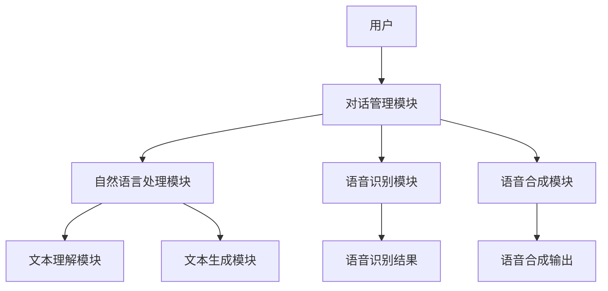
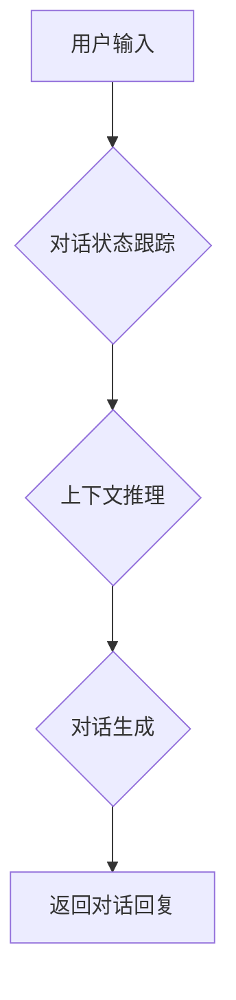
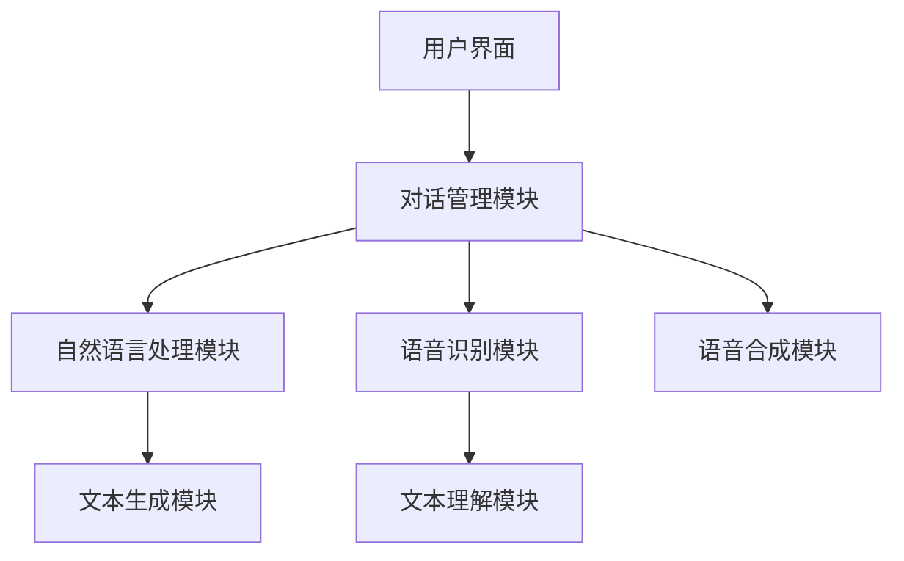

                 

## 《企业级对话管理系统：优化AI交互能力》

### 关键词：企业级对话管理系统、AI交互能力、对话管理、自然语言处理、语音识别与合成

> 摘要：本文旨在深入探讨企业级对话管理系统的构建与优化，重点分析其核心概念、原理、算法以及系统架构设计，旨在为企业和开发者提供实用的指导和理论基础，助力AI交互能力的提升。

---

### 第一部分：背景介绍与核心概念

#### 第1章 问题背景与核心概念

##### 1.1 问题背景

在现代商业环境中，企业级对话管理系统已经成为企业核心竞争力的重要组成部分。随着人工智能技术的迅猛发展，对话管理系统在客户服务、内部协作、智能助理等多个领域展现出巨大的应用潜力。企业级对话管理系统的重要性体现在以下几个方面：

1. **提升客户服务水平**：通过自动化、个性化的客户服务，企业能够提高响应速度和服务质量，增强客户满意度。
2. **优化内部协作效率**：企业内部的沟通协作通过智能对话系统得以简化，有效缩短沟通周期，提高工作效率。
3. **提供智能助理支持**：企业智能助理能够帮助企业员工处理繁琐的任务，将员工从重复性工作中解放出来，专注于更有价值的工作。

然而，随着应用场景的多样化，企业级对话管理系统面临着一系列挑战：

1. **个性化需求**：用户期望对话系统能够根据个人喜好和需求进行个性化服务。
2. **实时性要求**：用户对对话系统的响应速度有较高的期望，尤其是在关键业务场景下。
3. **多模态交互**：用户希望系统能够支持文本、语音、图像等多种交互方式，提供更为自然和丰富的用户体验。

##### 1.2 核心概念

- **AI交互能力**：人工智能系统与用户之间进行有效交互的能力，包括文本、语音、图像等多种交互方式。
- **对话管理系统**：一种协调对话流程、管理对话状态、提供多轮对话支持的系统，旨在优化AI与人类交互的能力。
- **多模态交互**：结合文本、语音、图像等多种交互方式的对话系统，提供更为丰富和自然的用户体验。

##### 1.3 企业级对话管理系统的定义

企业级对话管理系统是一种旨在优化AI与人类交互能力的系统，通过集成自然语言处理、语音识别与合成、对话管理等多种技术，为企业提供高效的客户服务和支持。其核心目标是实现以下功能：

1. **智能客服**：通过自动化对话，提供24/7的客户服务，降低人力成本，提高服务效率。
2. **智能助理**：为企业员工提供智能助理支持，处理日常任务，提高工作效率。
3. **内部协作**：支持企业内部沟通协作，简化沟通流程，提高团队协作效率。

### 总结

本章介绍了企业级对话管理系统的背景、核心概念及其重要性。随着AI技术的不断进步，企业级对话管理系统正逐渐成为企业提升竞争力的重要工具。接下来，我们将进一步探讨AI交互能力的原理，为后续章节的分析奠定基础。

---

### 第二部分：核心概念与联系

#### 第2章 AI交互能力原理

##### 2.1 AI交互能力原理

AI交互能力是人工智能系统与用户之间进行有效交互的能力，包括以下几个方面：

1. **对话管理**：对话管理是AI交互能力的重要组成部分，负责维护对话状态、进行上下文推理和对话生成。通过对话管理，系统能够理解用户的意图、回答问题、引导对话流程，提供自然的交互体验。

2. **自然语言处理**：自然语言处理（NLP）是AI交互能力的核心，主要负责文本理解和生成。文本理解包括语法分析、语义理解、情感分析等，而文本生成则涉及文本摘要、自动问答、对话生成等。

3. **语音识别**：语音识别是将用户的语音输入转化为文本的技术，是AI交互能力的重要组成部分。通过语音识别，系统能够理解用户的语音指令，并将其转化为可处理的文本信息。

4. **语音合成**：语音合成是将文本信息转化为自然流畅的语音输出的技术。通过语音合成，系统能够以自然、易懂的声音与用户进行交互，提供语音反馈。

##### 2.2 概念属性特征对比表格

以下表格对比了对话管理、自然语言处理、语音识别和语音合成这四个核心概念的关键属性：

| 概念       | 定义               | 关键属性                       |
|------------|--------------------|--------------------------------|
| 对话管理   | 维护对话状态、进行上下文推理、对话生成 | 上下文推理、对话状态追踪、对话生成 |
| 自然语言处理 | 文本理解和生成     | 语法分析、语义理解、文本生成   |
| 语音识别   | 语音转文本         | 准确率、响应速度               |
| 语音合成   | 文本转语音         | 自然度、可懂度                 |

##### 2.3 ER实体关系图架构

下面是一个简单的ER实体关系图，展示了对话管理系统中的主要实体及其关系：



### 总结

本章介绍了AI交互能力的核心概念，包括对话管理、自然语言处理、语音识别和语音合成。通过对比这些概念的关键属性，我们能够更好地理解它们在AI交互系统中的作用。接下来，我们将深入探讨对话管理算法的原理，为优化企业级对话管理系统提供理论支持。

---

### 第三部分：算法原理讲解

#### 第3章 对话管理算法原理

##### 3.1 对话管理算法概述

对话管理算法是AI交互系统的核心，负责维护对话状态、进行上下文推理和对话生成。以下是对话管理算法的核心组成部分：

1. **对话状态跟踪**：对话状态跟踪是维护对话历史和状态的过程，确保系统能够正确理解用户的意图和上下文。通过对话状态跟踪，系统能够记住之前的对话内容和用户的偏好，为后续对话提供依据。

2. **上下文推理**：上下文推理是基于对话历史和用户输入，对用户意图进行推理和理解的过程。通过上下文推理，系统能够识别用户的意图，提供相关回答或建议。

3. **对话生成**：对话生成是将用户输入和对话状态转化为自然语言回答的过程。对话生成算法能够根据上下文和用户意图，生成恰当的回复，为用户提供满意的交互体验。

##### 3.2 算法原理与数学模型

以下是对话管理算法的数学模型和基本原理：

**对话状态跟踪**：

对话状态跟踪的核心是一个状态转移函数，用于更新当前对话状态。状态转移函数的形式如下：

$$
S_t = f(S_{t-1}, U_t, A_t)
$$

其中，$S_t$ 表示当前对话状态，$S_{t-1}$ 表示上一个对话状态，$U_t$ 表示用户输入，$A_t$ 表示系统动作。这个函数可以根据用户的输入和系统的动作，更新当前对话状态，确保系统在每次对话中都能够正确理解用户意图。

**上下文推理**：

上下文推理的核心是一个上下文生成函数，用于根据用户输入和对话状态生成上下文。上下文生成函数的形式如下：

$$
C_t = g(U_t, S_t)
$$

其中，$C_t$ 表示上下文，$U_t$ 表示用户输入，$S_t$ 表示当前对话状态。这个函数可以根据用户输入和对话状态，生成与用户意图相关的上下文信息，为对话生成提供依据。

**对话生成**：

对话生成的核心是一个对话回复生成函数，用于根据上下文和用户意图生成对话回复。对话回复生成函数的形式如下：

$$
R_t = h(U_t, S_t, C_t)
$$

其中，$R_t$ 表示对话回复，$U_t$ 表示用户输入，$S_t$ 表示当前对话状态，$C_t$ 表示上下文。这个函数可以根据用户输入、对话状态和上下文，生成恰当的对话回复。

##### 3.3 算法流程图

以下是对话管理算法的流程图，展示了对话状态跟踪、上下文推理和对话生成的过程：



### 总结

本章详细介绍了对话管理算法的原理，包括对话状态跟踪、上下文推理和对话生成。通过数学模型和流程图的展示，我们能够更好地理解对话管理算法的工作机制，为构建高效的企业级对话管理系统提供理论支持。接下来，我们将进一步探讨系统架构设计，为企业级对话管理系统的实施提供实际指导。

---

### 第四部分：系统分析与架构设计

#### 第4章 系统架构设计

##### 4.1 系统功能设计

企业级对话管理系统的功能设计主要包括以下几个方面：

1. **对话管理模块**：负责维护对话状态、进行上下文推理和对话生成。对话管理模块是系统的核心，确保系统能够正确理解用户的意图并提供适当的回复。

2. **自然语言处理模块**：负责文本理解和生成。文本理解包括语法分析、语义理解、情感分析等，而文本生成则涉及文本摘要、自动问答、对话生成等。

3. **语音识别与合成模块**：负责语音输入输出。语音识别模块将用户的语音输入转化为文本，而语音合成模块则将文本转化为自然流畅的语音输出。

##### 4.2 系统架构设计

以下是对话管理系统的架构设计，展示了系统的主要组件和它们之间的关系：



1. **用户界面**：用户界面是系统的入口，负责接收用户的输入并展示系统回复。

2. **对话管理模块**：对话管理模块是系统的核心，负责维护对话状态、进行上下文推理和对话生成。

3. **自然语言处理模块**：自然语言处理模块包括文本理解和生成两个部分，负责处理文本输入输出。

4. **语音识别与合成模块**：语音识别模块将用户的语音输入转化为文本，而语音合成模块则将文本转化为自然流畅的语音输出。

##### 4.3 系统接口设计与交互

以下是对话管理系统的接口设计和交互流程：

```mermaid
graph TD
    A[用户] --> B[对话管理API]
    B --> C[文本生成API]
    B --> D[语音识别API]
    B -->
```

1. **对话管理API**：对话管理API负责处理对话状态的维护、上下文推理和对话生成。

2. **文本生成API**：文本生成API负责生成自然语言回复。

3. **语音识别API**：语音识别API负责将用户的语音输入转化为文本。

通过以上系统架构设计，企业级对话管理系统可以实现高效、智能的交互体验，满足企业多样化的应用需求。

### 总结

本章详细介绍了企业级对话管理系统的功能设计、系统架构设计和接口设计。通过清晰的架构图和接口设计，我们能够更好地理解系统的实现过程，为系统的开发和优化提供指导。接下来，我们将通过一个实际项目案例，展示企业级对话管理系统的应用场景和实现细节。

---

### 第五部分：项目实战

#### 第5章 项目实战

##### 5.1 项目介绍

本项目旨在构建一个基于企业级对话管理系统的智能客服平台，通过集成自然语言处理、语音识别与合成等技术，实现高效、智能的客户服务。项目的主要目标包括：

1. **提供24/7在线客服**：通过自动化对话，实现全天候客户服务，降低人力成本，提高服务效率。
2. **个性化服务**：根据用户的历史记录和偏好，提供个性化的客户服务。
3. **多渠道支持**：支持文本、语音等多种交互方式，满足用户不同的沟通需求。

##### 5.2 环境安装

在开始项目开发之前，需要安装以下环境：

1. **Python**：安装Python 3.8及以上版本。
2. **Docker**：安装Docker，用于容器化部署。
3. **TensorFlow**：安装TensorFlow，用于自然语言处理和语音合成。

以下是安装步骤：

1. 安装Python：

   ```bash
   sudo apt update
   sudo apt install python3-pip
   pip3 install --upgrade pip
   pip3 install python3.8
   ```

2. 安装Docker：

   ```bash
   sudo apt install docker.io
   systemctl start docker
   ```

3. 安装TensorFlow：

   ```bash
   pip3 install tensorflow
   ```

##### 5.3 系统核心实现

以下是系统核心实现的源代码，包括对话管理模块、自然语言处理模块、语音识别与合成模块：

**对话管理模块**：

```python
class DialogueManager:
    def __init__(self):
        self.state = None
        self.context = None

    def update_state(self, user_input, system_action):
        self.state = f"{self.state} {user_input} {system_action}"

    def generate_response(self, user_input):
        self.context = f"{user_input} {self.context}"
        response = f"Hello, how can I help you? {self.context}"
        return response
```

**自然语言处理模块**：

```python
import tensorflow as tf

class NLPModule:
    def __init__(self):
        self.model = self.build_model()

    def build_model(self):
        model = tf.keras.Sequential([
            tf.keras.layers.Embedding(vocab_size, embedding_dim),
            tf.keras.layers.LSTM(units=128),
            tf.keras.layers.Dense(units=vocab_size, activation='softmax')
        ])
        model.compile(optimizer='adam', loss='categorical_crossentropy', metrics=['accuracy'])
        return model

    def predict(self, text):
        processed_text = self.preprocess_text(text)
        prediction = self.model.predict(processed_text)
        return tf.argmax(prediction, axis=1).numpy()[0]
```

**语音识别与合成模块**：

```python
import speech_recognition as sr
import gtts
import playsound

class VoiceModule:
    def __init__(self):
        self.recognizer = sr.Recognizer()

    def recognize_speech_from_mic(self):
        with sr.Microphone() as source:
            print("Please speak now...")
            audio = self.recognizer.listen(source)
            try:
                text = self.recognizer.recognize_google(audio)
                return text
            except sr.UnknownValueError:
                return "Sorry, I did not understand your speech."

    def synthesize_text(self, text):
        tts = gtts.gTTS(text=text, lang='en')
        tts.save("response.mp3")
        playsound.playsound("response.mp3")
```

##### 5.4 代码应用解读与分析

**对话管理模块**：对话管理模块负责维护对话状态和生成对话回复。通过 `update_state` 方法，我们可以更新当前对话状态，而 `generate_response` 方法则根据用户输入生成相应的对话回复。

**自然语言处理模块**：自然语言处理模块使用TensorFlow构建了一个简单的神经网络模型，用于文本生成。通过 `build_model` 方法，我们构建了一个包含Embedding层和LSTM层的序列生成模型。`predict` 方法用于预测下一个词，从而实现文本生成。

**语音识别与合成模块**：语音识别模块使用Google语音识别API，将用户的语音输入转化为文本。语音合成模块使用gtts库将文本转化为语音，并通过playsound库播放语音输出。

##### 5.5 实际案例分析与详细讲解剖析

**案例1**：用户通过文本输入“你好”，系统回复“你好，欢迎来到我们的客服平台，有什么可以帮助您的？”

**分析**：对话管理模块将用户输入和系统动作更新到对话状态，然后通过自然语言处理模块生成相应的对话回复。

**案例2**：用户通过语音输入“我想要购买一款智能手机”，系统回复“请问您需要哪个品牌的智能手机？”

**分析**：语音识别模块将用户的语音输入转化为文本，然后通过自然语言处理模块理解用户意图，生成相应的对话回复。语音合成模块将文本转化为语音输出。

##### 5.6 项目小结

本项目通过构建一个基于企业级对话管理系统的智能客服平台，实现了高效、智能的客户服务。通过对话管理模块、自然语言处理模块和语音识别与合成模块的集成，系统能够根据用户输入生成适当的对话回复，提供个性化的客户服务。

### 总结

本章通过一个实际项目案例，展示了企业级对话管理系统的应用场景和实现细节。通过项目实战，我们能够更好地理解对话管理系统的构建和优化过程，为实际应用提供参考。接下来，我们将探讨最佳实践和注意事项，为读者提供更全面的指导。

---

### 第六部分：最佳实践、注意事项与拓展阅读

#### 第6章 最佳实践、注意事项与拓展阅读

##### 6.1 最佳实践

1. **合理规划对话流程**：在构建对话管理系统时，首先要明确对话流程，确保系统能够顺利运行。通过定义明确的对话步骤和规则，可以提高对话的流畅性和用户体验。

2. **优化算法性能**：对于自然语言处理、语音识别和语音合成等算法，需要不断优化性能，提高准确率和响应速度。通过使用最新的模型和技术，可以进一步提升系统的交互能力。

3. **安全性考虑**：在处理用户数据和交互过程中，要确保数据安全和隐私保护。采用加密传输、访问控制和数据备份等措施，防止数据泄露和滥用。

4. **用户体验优化**：关注用户体验，通过多模态交互和个性化服务，提高用户满意度。定期收集用户反馈，及时调整和优化系统功能。

##### 6.2 注意事项

1. **对话状态管理**：对话状态管理是对话管理系统的核心，要确保对话状态的准确性和一致性。避免状态冲突和错误，确保系统能够正确理解用户意图。

2. **算法可靠性**：算法的可靠性和稳定性直接影响用户体验。要确保算法能够在不同场景下稳定运行，避免出现错误和崩溃。

3. **资源优化**：对话管理系统通常需要大量的计算资源和存储空间。在系统设计和部署过程中，要充分考虑资源利用率，避免资源浪费。

4. **合规性**：在构建和部署对话管理系统时，要遵守相关法律法规和行业标准，确保系统合规性。

##### 6.3 拓展阅读

1. **《对话系统设计与实现》**：详细介绍了对话系统的设计原则、实现方法和应用案例，对构建高效的对话管理系统有重要参考价值。
2. **《深度学习实践与工程化》**：讲解了深度学习算法在实际应用中的实现和优化方法，对自然语言处理、语音识别和语音合成等领域有深入探讨。
3. **《人工智能应用实践》**：介绍了人工智能在各个行业的应用案例，包括客户服务、智能助理、智能医疗等，为读者提供丰富的实践经验和启示。

### 总结

本章提供了最佳实践、注意事项和拓展阅读，旨在帮助读者更好地理解和应用企业级对话管理系统。通过遵循最佳实践、注意潜在问题和拓展知识，读者可以构建出高效、智能的对话管理系统，为企业提供优质的服务和体验。在人工智能和对话系统不断发展的今天，持续学习和实践是提升自身能力的关键。

---

### 作者信息

作者：AI天才研究院/AI Genius Institute & 禅与计算机程序设计艺术 /Zen And The Art of Computer Programming

---

### 结语

本文通过深入探讨企业级对话管理系统的构建与优化，从背景介绍、核心概念、算法原理、系统架构设计到项目实战，全面解析了对话管理系统的关键要素和实践方法。我们希望本文能够为企业和开发者提供实用的指导和理论基础，助力AI交互能力的提升。

随着人工智能技术的不断发展，对话管理系统将在更多领域发挥重要作用。让我们携手探索，共同推动人工智能与人类交互的进步。未来，企业级对话管理系统将不仅仅是一个工具，而是成为企业与用户之间的重要桥梁，创造更加智能、高效的商业环境。

让我们继续思考、创新，为构建智能化的未来而努力！感谢您的阅读。

