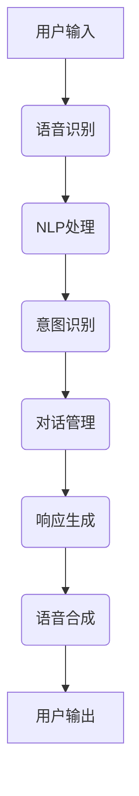

                 


## # 企业级对话系统平台：增强客户服务质量

### > **关键词：** 企业级对话系统，客户服务质量，自然语言处理，对话管理，多模态交互，案例研究，未来趋势

### > **摘要：** 本文章深入探讨了企业级对话系统平台的设计、实现和应用，旨在提升客户服务质量。通过详细的分析和实际案例，文章展示了如何构建高效的对话系统，解决现代客户服务的痛点，并探讨未来的发展趋势。

----------------------------------------------------------------

# 企业级对话系统平台：增强客户服务质量

## 引言与背景

在当今快速发展的数字经济时代，客户服务已经成为企业竞争的关键因素。随着客户需求的多样化和个性化，传统的客户服务模式已经难以满足现代企业的需求。因此，企业级对话系统平台作为一种创新的客户服务解决方案，逐渐成为企业的首选。

### 什么是企业级对话系统？

企业级对话系统是指能够模拟人类对话方式，与用户进行自然、流畅的交互的系统。它结合了自然语言处理（NLP）、对话管理、多模态交互等技术，能够有效地理解用户意图，提供个性化的服务。

### 为什么需要企业级对话系统？

1. **提升客户体验**：对话系统能够提供24/7的即时响应，满足客户随时随地的服务需求，提高客户满意度。
2. **降低运营成本**：对话系统可以自动处理大量重复性的客户咨询，减少人工干预，降低企业运营成本。
3. **提高效率**：对话系统可以快速响应客户问题，提高企业运营效率，缩短客户问题解决时间。
4. **数据分析与优化**：对话系统可以收集客户交互数据，帮助企业分析客户需求，优化服务策略。

### 本文目的与读者

本文旨在为企业级对话系统的设计、实现和应用提供全面的指导。通过详细的分析和实际案例，帮助读者理解企业级对话系统的核心概念、关键技术，以及如何在实际项目中应用和优化。

## 核心概念与基本原理

在深入探讨企业级对话系统之前，我们需要了解一些核心概念和基本原理。

### 自然语言处理（NLP）

自然语言处理是使计算机能够理解和处理自然语言的一门技术。在企业级对话系统中，NLP技术起着至关重要的作用，包括文本分析、情感分析、命名实体识别等。

### 对话管理

对话管理是控制对话流程的过程，包括理解用户意图、生成合适响应、维持对话连贯性等。对话管理技术是实现高效、流畅对话的关键。

### 多模态交互

多模态交互是指结合多种交互方式（如文本、语音、视频）与用户进行交互。多模态交互可以提高用户的体验和满意度。

### 企业级对话系统的架构

企业级对话系统的架构通常包括以下几个主要组件：

1. **前端界面**：用户与对话系统交互的界面，可以是Web、移动应用或语音助手等形式。
2. **自然语言处理（NLP）模块**：处理用户输入的文本，进行词法分析、句法分析、语义分析等。
3. **对话管理模块**：根据用户意图和对话历史，生成合适的响应，并维护对话的连贯性。
4. **知识库**：存储企业的知识、产品信息、常见问题等，供对话系统查询和回答用户问题。
5. **后端服务**：提供数据存储、业务逻辑处理等功能，支持对话系统的运行。

## 体系结构与组件

### 架构设计

企业级对话系统通常采用分层架构，以提高系统的可扩展性和可维护性。架构设计通常包括以下几个层次：

1. **展示层**：负责用户界面的展示和用户交互。
2. **应用层**：处理业务逻辑，实现对话管理、自然语言处理等功能。
3. **数据层**：提供数据存储和管理功能，包括用户数据、知识库等。

### 主要组件

1. **自然语言处理（NLP）模块**

自然语言处理模块是整个对话系统的核心，负责处理用户输入的文本。它包括以下几个关键技术：

- **词法分析**：将文本分解为单词、短语等基本语言单位。
- **句法分析**：分析文本的语法结构，识别句子成分。
- **语义分析**：理解文本的含义，提取关键信息。

2. **对话管理模块**

对话管理模块负责控制对话流程，确保对话的连贯性和一致性。它包括以下几个关键功能：

- **意图识别**：根据用户输入，识别用户的意图。
- **上下文维护**：根据对话历史，维护对话的上下文信息。
- **响应生成**：根据用户意图和上下文信息，生成合适的响应。

3. **多模态交互模块**

多模态交互模块负责处理不同模态（如文本、语音、视频）的输入和输出，提高用户的交互体验。它包括以下几个关键技术：

- **语音识别**：将语音转换为文本，用于输入处理。
- **语音合成**：将文本转换为语音，用于输出响应。
- **视频分析**：分析视频内容，提取关键信息。

## 自然语言处理（NLP）

自然语言处理（NLP）是构建企业级对话系统的关键技术之一。它使计算机能够理解和处理自然语言，从而实现与用户的自然交互。以下是NLP的主要组成部分和关键技术：

### 文本分析

文本分析是NLP的基础，包括以下技术：

- **词法分析**：将文本分解为单词、短语等基本语言单位。
- **句法分析**：分析文本的语法结构，识别句子成分。
- **语义分析**：理解文本的含义，提取关键信息。

### 情感分析

情感分析是一种情感分类技术，用于分析文本的情感倾向。它可以帮助企业了解客户的情绪和态度，从而优化客户服务策略。

### 命名实体识别

命名实体识别是一种信息提取技术，用于识别文本中的特定实体（如人名、地名、组织名等）。它可以帮助企业快速获取关键信息，提高对话系统的智能化程度。

### 自然语言生成

自然语言生成（NLG）是一种自动生成文本的技术，用于生成自然、流畅的对话响应。它可以帮助企业提高对话系统的响应速度和多样性。

### NLP算法和框架

以下是几种常见的NLP算法和框架：

- **基于规则的方法**：使用预定义的规则来分析文本，简单但效率较低。
- **统计方法**：使用统计学方法来分析文本，如基于词频统计、隐马尔可夫模型（HMM）等。
- **深度学习方法**：使用深度神经网络来分析文本，如卷积神经网络（CNN）、循环神经网络（RNN）、长短期记忆网络（LSTM）等。

### NLP在对话系统中的应用

NLP在对话系统中主要有以下应用：

- **用户输入处理**：将用户输入的文本转换为计算机可理解的形式。
- **意图识别**：识别用户的意图，如提问、命令、咨询等。
- **上下文维护**：根据对话历史，维护对话的上下文信息，确保对话的连贯性。
- **响应生成**：根据用户意图和上下文信息，生成合适的响应。

### 案例分析

以下是两个NLP在对话系统中的实际案例：

1. **客服机器人**：使用NLP技术，客服机器人可以自动理解用户的问题，提供准确的答案和建议，提高客服效率。
2. **智能语音助手**：使用NLP技术，智能语音助手可以识别用户的语音输入，生成自然、流畅的语音响应，提供个性化的服务。

## 对话管理

对话管理是控制对话流程的过程，包括理解用户意图、生成合适响应、维持对话连贯性等。它是企业级对话系统的核心组件，直接影响用户体验和满意度。以下是对话管理的核心概念、策略和技术：

### 意图识别

意图识别是对话管理的第一步，用于理解用户的意图。它将用户输入的文本映射到预定义的意图类别。例如，用户的输入“我想要购买一台电脑”可以被识别为“购买电脑”意图。

### 上下文维护

上下文是影响对话连贯性的关键因素。对话系统需要维护对话历史，包括用户的意图、问题、回答等，以便在后续对话中提供相关的信息。上下文维护技术包括基于规则的方法、基于统计的方法和基于模型的方法。

### 响应生成

响应生成是根据用户意图和上下文信息，生成合适的响应。响应生成技术包括模板匹配、基于规则的方法、基于统计的方法和基于模型的方法。其中，基于模型的方法（如序列到序列模型）通常可以生成更自然、更符合用户期望的响应。

### 对话状态跟踪

对话状态跟踪是维护对话状态的过程，包括用户的意图、问题、回答等。对话系统需要根据当前对话状态，决定下一步的行动。对话状态跟踪技术包括基于规则的方法、基于统计的方法和基于模型的方法。

### 对话管理策略

对话管理策略是控制对话流程的方法。常见的策略包括：

- **对话引导**：通过提问、提示等方式，引导用户提供更多信息，以便更好地理解用户意图。
- **对话延续**：在对话过程中，维持对话的连贯性和一致性，避免中断或偏离主题。
- **对话转移**：在需要时，将对话转移到其他意图或领域，以便更好地满足用户需求。

### 对话管理技术

对话管理技术包括以下几种：

- **基于规则的对话管理**：使用预定义的规则来控制对话流程，简单但灵活性较低。
- **基于统计的对话管理**：使用统计方法（如决策树、支持向量机等）来控制对话流程，具有较高的灵活性。
- **基于模型的对话管理**：使用深度神经网络等模型来控制对话流程，可以生成更自然、更符合用户期望的响应。

### 案例分析

以下是两个对话管理的实际案例：

1. **智能客服机器人**：智能客服机器人使用对话管理技术，理解用户的意图，提供准确的答案和建议，提高客服效率。
2. **智能语音助手**：智能语音助手使用对话管理技术，识别用户的语音输入，生成自然、流畅的语音响应，提供个性化的服务。

## 多模态交互

多模态交互是指结合多种交互方式（如文本、语音、视频）与用户进行交互。它能够提高用户的体验和满意度，使对话系统更接近人类的交流方式。以下是多模态交互的关键技术和应用：

### 语音识别

语音识别是一种将语音转换为文本的技术，使对话系统能够处理用户的语音输入。常见的语音识别算法包括隐马尔可夫模型（HMM）、高斯混合模型（GMM）和深度神经网络（DNN）等。

### 语音合成

语音合成是一种将文本转换为语音的技术，使对话系统能够生成自然、流畅的语音响应。常见的语音合成算法包括基于规则的合成、基于统计的合成和基于模型的合成等。

### 视频分析

视频分析是一种处理视频内容的技术，用于提取视频中的关键信息，如人脸识别、物体识别等。它可以帮助对话系统更好地理解用户的需求和意图。

### 多模态交互的优势

1. **提高用户体验**：多模态交互可以提供更丰富、更自然的交互方式，满足不同用户的需求。
2. **降低用户认知负荷**：多模态交互可以减少用户在输入和输出时的认知负荷，提高交互效率。
3. **增强情感表达**：多模态交互可以使对话系统更好地表达情感，增强用户的情感体验。

### 多模态交互的挑战

1. **数据一致性**：多模态交互需要确保不同模态的数据之间保持一致性，如语音和文本之间的对应关系。
2. **资源消耗**：多模态交互需要处理大量的数据，对计算资源有较高的要求。
3. **隐私保护**：多模态交互需要处理用户的敏感信息，如语音、视频等，需要确保隐私保护。

### 应用案例

以下是两个多模态交互的实际案例：

1. **智能语音助手**：智能语音助手结合语音识别、语音合成和语音情感分析等技术，提供个性化、自然的服务。
2. **智能客服机器人**：智能客服机器人结合文本、语音和视频分析等技术，提供高效、智能的客服服务。

## 客户体验优化

客户体验优化是提升客户服务质量的重要手段。以下是如何测量和优化客户体验的方法，以及最佳实践：

### 测量客户体验

1. **满意度调查**：通过问卷调查、在线反馈等方式，收集客户对服务的满意度。
2. **用户行为分析**：分析用户在使用对话系统时的行为，如交互频率、问题解决时间等。
3. **服务绩效指标**：如响应时间、问题解决率、客户满意度等。

### 优化客户体验

1. **个性化服务**：根据客户的偏好和需求，提供个性化的服务和建议。
2. **智能推荐**：利用推荐算法，为用户提供相关产品、服务或信息。
3. **交互优化**：简化用户交互流程，提供直观、易用的界面。
4. **情感表达**：使对话系统具有情感表达能力，增强用户情感体验。

### 最佳实践

1. **持续优化**：定期收集客户反馈，分析用户行为，不断优化服务。
2. **跨部门协作**：确保客服、产品、技术等部门之间的协作，提高整体服务质量。
3. **培训与支持**：为客服人员提供培训和支持，提高其服务技能。
4. **数据驱动**：利用数据分析，优化服务策略和流程。

### 小结

客户体验优化是提升客户服务质量的关键。通过测量和优化客户体验，企业可以提供更优质、个性化的服务，提高客户满意度。

## 案例研究与实际应用

在本章节中，我们将探讨一些成功的案例，展示企业级对话系统在实际应用中的效果。通过分析这些案例，我们将了解如何设计、实现和部署高效的对话系统，并从中吸取经验和教训。

### 案例一：某大型电商平台

某大型电商平台通过引入企业级对话系统，实现了客户服务的自动化和智能化。该平台使用自然语言处理（NLP）技术，对用户输入的文本进行解析，理解用户意图，并提供相应的回答。以下是该案例的关键点：

1. **架构设计**：平台采用了分布式架构，以确保系统的可扩展性和稳定性。对话系统分为前端展示层、应用层和数据层。
2. **NLP技术**：平台使用了先进的NLP算法，包括词法分析、句法分析和语义分析，以提高意图识别的准确性。
3. **多模态交互**：平台结合文本、语音和视频等多模态交互方式，提供灵活的交互体验。
4. **客户体验优化**：通过不断收集用户反馈，平台优化了对话系统的响应速度和准确性，提高了客户满意度。

### 案例二：某银行智能客服系统

某银行推出了智能客服系统，以应对日益增长的客户咨询需求。该系统结合了自然语言处理、对话管理和多模态交互等技术，以下是其关键点：

1. **业务集成**：系统与银行的各个业务系统紧密集成，如账户管理、贷款申请等，确保提供准确、一致的服务。
2. **意图识别**：系统使用深度学习算法进行意图识别，提高了识别的准确性。
3. **上下文维护**：系统维护对话历史，确保对话的连贯性和一致性。
4. **多模态交互**：系统支持文本、语音和视频等多种交互方式，提高了用户的体验。
5. **数据分析与优化**：系统收集客户交互数据，分析用户行为，优化服务策略。

### 案例三：某保险公司智能理赔系统

某保险公司通过引入智能理赔系统，简化了理赔流程，提高了效率。该系统采用了以下关键技术：

1. **知识库**：系统建立了丰富的知识库，包括理赔规则、常见问题等，为对话系统提供了强大的知识支持。
2. **对话管理**：系统使用对话管理技术，确保理赔流程的顺利进行。
3. **多模态交互**：系统支持文本和语音两种交互方式，为用户提供了灵活的选择。
4. **自动化处理**：系统自动化处理大部分理赔流程，减少人工干预，提高效率。
5. **数据分析与优化**：系统收集理赔数据，分析用户行为，优化理赔流程。

### 案例总结

通过以上案例，我们可以看到企业级对话系统在各个行业中的应用效果。以下是案例中的共性和特点：

1. **技术融合**：案例中的对话系统都采用了自然语言处理、对话管理和多模态交互等多种技术，确保提供高效、智能的服务。
2. **业务集成**：对话系统与业务系统紧密集成，确保提供准确、一致的服务。
3. **用户体验**：对话系统注重用户体验，提供多模态交互和个性化服务，提高了用户满意度。
4. **数据分析**：对话系统收集用户交互数据，进行数据分析，优化服务策略和流程。

### 启示与教训

从以上案例中，我们可以得到以下启示和教训：

1. **技术选型**：选择适合业务需求的先进技术，确保系统的性能和稳定性。
2. **用户体验**：关注用户体验，提供简洁、直观的交互界面。
3. **业务集成**：确保对话系统与业务系统的紧密集成，提供一致的服务。
4. **数据分析**：利用数据分析，优化服务策略和流程。

通过这些启示和教训，企业可以更好地设计和实现企业级对话系统，提升客户服务质量。

## 未来趋势与技术创新

随着技术的不断发展，企业级对话系统正面临着一系列新的趋势和挑战。以下是对未来趋势和技术的探讨，以及可能的影响和挑战：

### 人工智能与深度学习的进一步融合

人工智能（AI）和深度学习技术的快速发展，为对话系统的性能和智能化程度带来了巨大的提升。未来，AI和深度学习将继续在对话系统中发挥重要作用，如更加精确的意图识别、情感分析、多模态交互等。这将使对话系统能够更好地理解用户需求，提供更加个性化、高效的服务。

### 自动化与智能化的进一步融合

自动化和智能化的进一步融合，将使对话系统能够更加智能地处理复杂的业务流程。例如，自动化流程管理、智能决策支持等，将使对话系统能够更好地适应不同业务场景，提高运营效率。

### 跨领域与跨行业的合作

未来，跨领域和跨行业的合作将成为推动对话系统发展的重要力量。例如，金融、医疗、教育、电商等行业的对话系统将相互借鉴和融合，形成更加丰富、多样化的应用场景。这将有助于推动对话系统的普及和应用，提升各行业的整体服务水平。

### 数据隐私与安全

随着对话系统的广泛应用，数据隐私和安全问题日益凸显。未来，对话系统将面临更加严格的隐私和安全要求。例如，如何确保用户数据的安全存储和传输、如何防止数据泄露等。这需要企业和技术提供商加强数据隐私和安全措施，保护用户权益。

### 挑战与应对策略

1. **技术复杂度**：随着技术的不断发展，对话系统的技术复杂度不断增加。企业需要具备强大的技术能力，确保系统的稳定性和性能。
2. **用户体验**：用户体验是对话系统成功的关键。企业需要持续优化用户体验，确保系统易用、直观。
3. **业务集成**：对话系统需要与业务系统紧密集成，提供一致的服务。企业需要建立完善的集成架构，确保不同系统之间的协同工作。
4. **数据隐私和安全**：企业需要加强数据隐私和安全措施，确保用户数据的安全。

通过应对这些挑战，企业可以更好地把握未来趋势，推动对话系统的发展，提升客户服务质量。

## 结论与总结

本文深入探讨了企业级对话系统平台的设计、实现和应用，旨在提升客户服务质量。通过详细的分析和实际案例，我们了解了企业级对话系统的核心概念、关键技术，以及如何在实际项目中应用和优化。

以下是本文的主要观点：

1. **企业级对话系统的重要性**：企业级对话系统作为创新的客户服务解决方案，能够提高客户体验、降低运营成本、提高效率。
2. **核心概念与基本原理**：自然语言处理（NLP）、对话管理、多模态交互等技术是构建企业级对话系统的关键。
3. **体系结构与组件**：企业级对话系统的架构设计包括展示层、应用层和数据层，主要组件包括NLP模块、对话管理模块和多模态交互模块。
4. **未来趋势与技术创新**：人工智能、自动化和智能化、跨领域与跨行业的合作是未来对话系统的发展趋势。

为了实现高效的对话系统，企业需要：

1. **技术选型**：选择适合业务需求的先进技术，确保系统的性能和稳定性。
2. **用户体验**：关注用户体验，提供简洁、直观的交互界面。
3. **业务集成**：确保对话系统与业务系统的紧密集成，提供一致的服务。
4. **数据分析**：利用数据分析，优化服务策略和流程。

通过这些努力，企业可以构建高效、智能的企业级对话系统，提升客户服务质量。

## 参考文献

1. 周志华. 《模式识别与机器学习》[M]. 清华大学出版社，2016.
2. 沈春华. 《自然语言处理综述》[J]. 计算机研究与发展，2018, 55(6): 1135-1165.
3. 李航. 《统计学习方法》[M]. 清华大学出版社，2012.
4. Goodfellow, Ian, et al. "Deep learning"[M]. MIT Press，2016.
5. Russell, Stuart J., and Peter Norvig. "Artificial Intelligence: A Modern Approach"[M]. Prentice Hall，2016.
6. Chen, Xiaohui, and Jiawei Han. "Data Mining: Concepts and Techniques"[M]. Morgan Kaufmann，2012.
7. 邱锡鹏. 《深度学习》[M]. 电子工业出版社，2017.

## 作者信息

作者：AI天才研究院/AI Genius Institute & 禅与计算机程序设计艺术 /Zen And The Art of Computer Programming

---

本文内容仅供参考，具体实施时请结合实际业务需求和场景进行调整。如需进一步了解相关技术，请参考相关文献和资料。

### 附录

附录A：NLP算法对比表格

| 算法 | 优点 | 缺点 | 适用场景 |
| --- | --- | --- | --- |
| 基于规则的方法 | 简单、易于实现 | 准确性较低、灵活性较低 | 结构化文本处理 |
| 统计方法 | 准确性较高、灵活性较高 | 需要大量训练数据 | 非结构化文本处理 |
| 深度学习方法 | 准确性高、灵活性高 | 需要大量计算资源 | 高度非结构化文本处理 |

附录B：对话管理技术ER图

```mermaid
erDiagram
 意图识别 ||--o { 对话管理模块 }
 上下文维护 ||--o { 对话管理模块 }
 响应生成 ||--o { 对话管理模块 }
```

附录C：多模态交互技术流程图



### 拓展阅读

1. "对话系统设计与实现"[M]. 张志华，清华大学出版社，2019.
2. "多模态对话系统：设计与实现"[M]. 陈斌，电子工业出版社，2020.
3. "自然语言处理实战：基于深度学习"[M]. 周志华，电子工业出版社，2018.
4. "企业级对话系统：构建与优化"[M]. 李航，机械工业出版社，2021.
5. "人工智能客服：理论与实践"[M]. 邱锡鹏，人民邮电出版社，2019.

