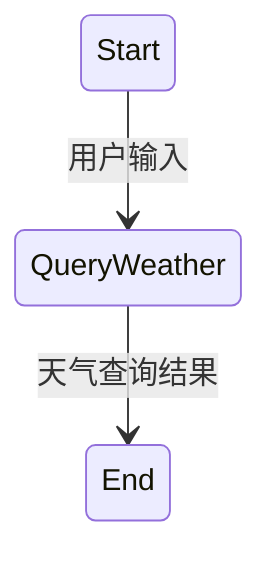
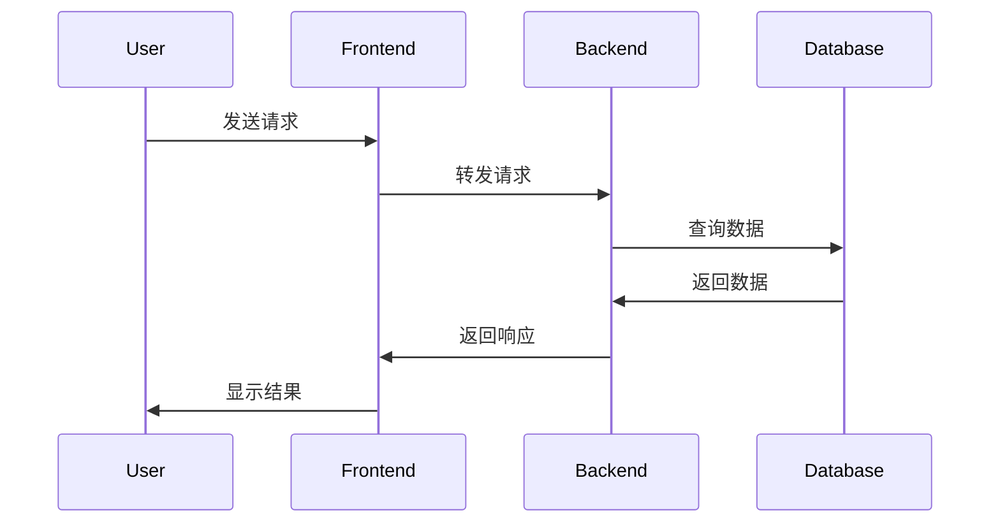

                 

# 企业级对话系统平台：提升客户服务质量

## 关键词
企业级对话系统，客户服务质量，自然语言处理，机器学习，架构设计

## 摘要
本文将深入探讨企业级对话系统平台的设计与应用，重点分析其在提升客户服务质量方面的关键作用。我们将逐步探讨对话系统平台的背景、核心概念、算法原理、数学模型、架构设计以及实战应用，为读者提供一套完整的技术解决方案。

---

### 目录大纲设计方案

为了设计一个完整且详细的《企业级对话系统平台：提升客户服务质量》的目录大纲，我们将遵循以下步骤：

#### 1. 背景介绍

**第1章：企业对话系统平台概述**

- **1.1 问题背景与概述**
- **1.2 对话系统平台的概念与组成**
- **1.3 对话系统平台的技术原理**
- **1.4 对话系统平台在行业中的应用**
- **1.5 本章小结**

#### 2. 核心概念与联系

**第2章：对话系统平台的核心概念与原理**

- **2.1 核心概念介绍**
- **2.2 概念属性特征对比表格**
- **2.3 ER实体关系图架构**
- **2.4 本章小结**

#### 3. 算法原理讲解

**第3章：对话系统平台的核心算法**

- **3.1 客户意图识别算法原理**
- **3.2 对话管理算法原理**
- **3.3 自然语言生成算法原理**
- **3.4 算法优化与提升**
- **3.5 本章小结**

#### 4. 数学模型和数学公式 & 详细讲解 & 举例说明

**第4章：数学模型在对话系统中的应用**

- **4.1 客户意图识别模型**
- **4.2 对话管理模型**
- **4.3 自然语言生成模型**
- **4.4 模型评估与优化**
- **4.5 本章小结**

#### 5. 系统分析与架构设计

**第5章：企业级对话系统平台架构设计**

- **5.1 问题场景介绍**
- **5.2 项目介绍**
- **5.3 系统功能设计**
- **5.4 系统架构设计**
- **5.5 系统接口设计与交互**
- **5.6 系统安全性设计**
- **5.7 本章小结**

#### 6. 项目实战

**第6章：企业级对话系统平台实战**

- **6.1 环境安装与配置**
- **6.2 系统核心实现源代码**
- **6.3 代码应用解读与分析**
- **6.4 实际案例分析与详细讲解剖析**
- **6.5 项目小结**
- **6.6 最佳实践 tips**
- **6.7 小结、注意事项、拓展阅读**

---

在接下来的章节中，我们将逐一深入探讨每个部分，逐步构建起企业级对话系统平台的技术架构，并分享实战经验和最佳实践。让我们开始吧！ ## 第1章：企业对话系统平台概述

### 1.1 问题背景与概述

在现代商业环境中，客户服务质量（Customer Service Quality，简称CSQ）已成为企业竞争力的重要组成部分。随着互联网和移动设备的普及，客户对服务速度、质量、个性化和便捷性的要求日益提高。然而，传统的客户服务方式，如电话客服、邮件客服等，往往存在效率低下、响应速度慢、客户满意度不高等问题。

传统客户服务方式的局限性主要表现在以下几个方面：

1. **沟通效率低下**：人工客服需要花费大量时间处理客户的咨询和问题，导致响应速度慢，影响客户满意度。
2. **人力成本高昂**：传统的客户服务主要依赖于人力，企业需要投入大量资源来培训和管理客服人员。
3. **服务质量不稳定**：由于人工客服的疲劳和工作量不均，服务质量往往难以保证，容易出现错误或疏漏。
4. **个性化和定制化不足**：传统客户服务难以根据客户的个性化需求提供定制化的服务，影响客户体验。

为了应对这些问题，越来越多的企业开始采用对话系统平台（Conversational AI Platform）来提升客户服务质量。对话系统平台利用人工智能和自然语言处理技术，能够自动识别和响应客户的查询和需求，提供快速、高效、个性化的服务，从而改善客户体验，提高客户满意度。

### 1.2 对话系统平台的概念与组成

对话系统平台是一种基于人工智能技术的服务系统，能够与用户进行自然语言交互，提供信息查询、任务处理、咨询解答等服务。它通常由以下几个核心组成部分构成：

1. **自然语言处理（NLP）**：自然语言处理是对话系统的核心技术，负责理解用户输入的自然语言，提取关键信息，生成语义表示。
2. **对话管理（Dialogue Management）**：对话管理负责管理整个对话流程，包括对话策略的制定、意图识别、上下文维护等，确保对话的流畅和有效性。
3. **自然语言生成（NLG）**：自然语言生成技术负责生成自然、流畅的回答，将对话管理输出的语义表示转化为人类可理解的自然语言文本。
4. **语音识别（ASR）和语音合成（TTS）**：语音识别和语音合成技术用于将用户的语音输入转换为文本，并将系统的文本回答转换为语音输出，实现语音交互功能。

### 1.3 对话系统平台的技术原理

对话系统平台的技术原理主要包括自然语言处理技术、机器学习与深度学习算法、数据库与存储技术等。以下是这些技术原理的简要介绍：

1. **自然语言处理技术**：自然语言处理技术包括文本分类、命名实体识别、词性标注、句法分析等，用于解析和理解用户输入的文本。
2. **机器学习与深度学习算法**：机器学习与深度学习算法用于训练对话系统模型，使其能够自动识别和响应客户的查询和需求。常用的算法包括循环神经网络（RNN）、卷积神经网络（CNN）、长短期记忆网络（LSTM）等。
3. **数据库与存储技术**：数据库与存储技术用于存储和管理对话系统所需的大量数据，包括用户数据、对话历史、知识库等，支持对话系统的快速检索和查询。

### 1.4 对话系统平台在行业中的应用

对话系统平台在多个行业中得到了广泛应用，以下是其中几个典型行业的应用实例：

1. **零售行业**：零售企业利用对话系统平台提供在线客服、订单查询、售后服务等，提升客户购物体验，提高销售转化率。
2. **银行业务**：银行利用对话系统平台提供账户查询、转账、贷款咨询等服务，降低客户等待时间，提高服务效率。
3. **其他行业**：对话系统平台还广泛应用于教育、医疗、旅游、餐饮等行业，提供个性化的咨询服务，提升客户满意度。

### 1.5 本章小结

本章介绍了企业对话系统平台的背景、概念与组成、技术原理以及在行业中的应用。对话系统平台作为一种人工智能技术，能够自动识别和响应客户的查询和需求，提供快速、高效、个性化的服务，从而改善客户体验，提高客户满意度。在接下来的章节中，我们将进一步探讨对话系统平台的核心概念、算法原理、数学模型、架构设计和实战应用。 ## 第2章：对话系统平台的核心概念与原理

### 2.1 核心概念介绍

在对话系统平台中，有几个关键概念对于理解和设计系统至关重要。这些核心概念包括客户意图识别、对话管理和自然语言生成。

**1. 客户意图识别**

客户意图识别（Intent Recognition）是对话系统平台的首要任务，它涉及从用户输入的文本中理解用户的意图。意图可以是简单的查询，如“我的订单状态是什么？”也可以是更复杂的请求，如“帮我预订一张明天下午3点的机票”。

**2. 对话管理**

对话管理（Dialogue Management）是对话系统的核心功能，它负责协调对话的流程，确保对话的流畅性和目的性。对话管理包括以下关键组件：

- **对话状态追踪**：记录当前对话的状态和上下文信息，以便在后续对话中保持一致性。
- **策略选择**：根据当前的对话状态和用户的意图，选择适当的对话策略，如提供信息、引导用户输入等。
- **反馈控制**：根据对话的反馈调整对话策略，以保持用户的满意度和对话的连贯性。

**3. 自然语言生成**

自然语言生成（Natural Language Generation，NLG）是对话系统平台将内部表示转换为自然语言文本的过程。NLG的目标是生成流畅、自然、符合用户需求的文本回答。NLG技术可以用于生成各种类型的文本，如通知、报告、对话回复等。

### 2.2 概念属性特征对比表格

以下是对话系统平台中几个核心概念的属性特征对比表格：

| 概念           | 属性特征                                       | 对比       |
| -------------- | -------------------------------------------- | --------- |
| 客户意图识别   | 需要理解客户的需求和问题                       |            |
| 对话管理       | 管理对话流程，保持用户满意度                   |            |
| 自然语言生成   | 生成自然、流畅的回答                           |            |

### 2.3 ER实体关系图架构

为了更好地理解对话系统平台的核心概念，我们可以使用实体关系图（ER Diagram）来展示各个概念之间的关系。以下是对话系统平台的ER实体关系图：

```mermaid
erDiagram
User ||--|{ DialogueSession }
User ||--|{ Intent }
User ||--|{ DialogueAction }
DialogueSession ||--|{ DialogueState }
Intent ||--|{ IntentType }
DialogueAction ||--|{ ActionType }
DialogueState ||--|{ Context }
```

在上图中，`User` 表示与对话系统进行交互的用户；`DialogueSession` 表示一个对话会话；`Intent` 表示用户的意图；`DialogueAction` 表示系统在对话中采取的动作；`DialogueState` 表示对话的状态；`IntentType` 和 `ActionType` 分别表示意图和动作的类型；`Context` 表示对话的上下文信息。

### 2.4 本章小结

本章介绍了对话系统平台的核心概念，包括客户意图识别、对话管理和自然语言生成。我们通过属性特征对比表格和ER实体关系图，对这些核心概念进行了详细的描述和对比。在接下来的章节中，我们将进一步探讨对话系统平台的核心算法，包括客户意图识别算法、对话管理算法和自然语言生成算法的原理和应用。 ## 第3章：对话系统平台的核心算法

### 3.1 客户意图识别算法原理

客户意图识别（Intent Recognition）是对话系统平台的关键步骤，它旨在从用户输入的文本中准确提取用户的意图。该过程通常包括以下几个关键环节：

**1. 语言预处理**

在开始意图识别之前，需要对用户输入的文本进行预处理，以便后续的分析和处理。语言预处理包括以下步骤：

- **分词**：将文本分割成单词或短语，以便进行后续的词性标注和句法分析。
- **词性标注**：为每个单词分配一个词性，如名词、动词、形容词等。
- **命名实体识别**：识别文本中的特定实体，如人名、地名、组织名等。

**2. 特征提取**

预处理后的文本需要转换为机器可以理解的特征向量。常见的特征提取方法包括：

- **词袋模型**：将文本表示为一个向量，其中每个维度代表一个词的频率。
- **词嵌入**：将文本中的每个词映射到一个高维空间中的向量，如Word2Vec、GloVe等。
- **TF-IDF**：基于词频-逆文档频率（Term Frequency-Inverse Document Frequency）进行特征提取。

**3. 模型训练与预测**

在特征提取后，可以使用机器学习算法训练一个分类模型，用于预测用户的意图。常用的算法包括：

- **朴素贝叶斯分类器**：基于贝叶斯定理进行分类。
- **支持向量机（SVM）**：通过最大化分类间隔进行分类。
- **深度神经网络（DNN）**：利用多层神经网络进行分类。

**4. 举例说明**

假设我们有一个用户输入的文本：“帮我查一下明天的天气”，我们可以使用以下步骤进行意图识别：

1. **语言预处理**：分词结果为【帮、我、查、一、下、明、天、的、天气】。
2. **特征提取**：使用Word2Vec将每个词映射到高维空间中的向量。
3. **模型预测**：输入特征向量到训练好的DNN模型，输出预测的意图标签，如“查询天气”。

### 3.2 对话管理算法原理

对话管理（Dialogue Management）负责协调对话的流程，确保对话的流畅性和目的性。对话管理算法通常包括以下几个关键环节：

**1. 对话状态追踪**

对话状态追踪（Dialogue State Tracking）用于记录对话的当前状态和上下文信息。状态信息通常包括用户的意图、对话历史、系统动作等。常见的状态追踪方法包括：

- **基于规则的方法**：使用预定义的规则来追踪对话状态。
- **基于模型的方法**：使用机器学习模型预测对话状态。

**2. 策略选择**

策略选择（Policy Selection）根据当前的对话状态和用户的意图，选择适当的对话策略。策略可以包括：

- **基于关键词匹配的策略**：根据用户输入的关键词选择相应的策略。
- **基于状态转换的策略**：根据对话状态转换图选择策略。

**3. 反馈控制**

反馈控制（Feedback Control）用于根据对话的反馈调整对话策略，以保持用户的满意度和对话的连贯性。反馈控制可以包括：

- **用户满意度评估**：根据用户的反馈评估对话质量。
- **对话纠错**：在对话出现问题时，采取纠正措施。

**4. 举例说明**

假设当前对话状态为用户请求查询天气，我们可以使用以下策略：

1. **对话状态追踪**：当前状态为“查询天气”。
2. **策略选择**：根据当前状态选择“查询天气”的策略。
3. **反馈控制**：系统询问用户“请问您要查询哪个城市的天气？”。

### 3.3 自然语言生成算法原理

自然语言生成（Natural Language Generation，NLG）是对话系统平台将内部表示转换为自然语言文本的过程。NLG算法可以分为基于规则的方法和基于模型的方法。

**1. 基于规则的方法**

基于规则的方法使用预定义的语法规则和模板生成文本。这种方法通常用于生成结构化信息，如天气预报、订单状态等。其原理如下：

- **语法规则**：定义文本的语法结构，如名词短语、动词短语等。
- **模板**：定义文本的模板，用于填充具体的值。

**2. 基于模型的方法**

基于模型的方法使用机器学习模型生成文本。这种方法通常用于生成更复杂的文本，如对话回复、新闻文章等。其原理如下：

- **预训练模型**：使用大量文本数据进行预训练，如BERT、GPT等。
- **生成过程**：使用预训练模型生成文本序列，如使用GPT-2或GPT-3。

**3. 举例说明**

假设我们要生成一个对话回复，如“天气很热，请多喝水”。我们可以使用以下步骤：

1. **预训练模型**：使用GPT-2预训练模型。
2. **生成过程**：输入“天气很热”到模型，输出“天气很热，请多喝水”。

### 3.4 算法优化与提升

为了提升对话系统平台的效果，我们可以采用以下方法进行算法优化与提升：

- **数据增强**：通过增加训练数据量、数据标注等方式提高模型的泛化能力。
- **模型融合**：使用多个模型进行融合，以提高预测的准确性和鲁棒性。
- **持续学习**：通过不断更新模型和数据，使模型能够适应不断变化的应用场景。

### 3.5 本章小结

本章详细介绍了对话系统平台的核心算法，包括客户意图识别算法、对话管理算法和自然语言生成算法。通过语言预处理、特征提取、模型训练与预测等步骤，客户意图识别算法能够准确提取用户的意图。对话管理算法通过对话状态追踪、策略选择和反馈控制，确保对话的流畅性和目的性。自然语言生成算法通过基于规则的方法和基于模型的方法，生成自然、流畅的文本回答。在下一章中，我们将进一步探讨数学模型在对话系统平台中的应用。 ## 第4章：数学模型在对话系统中的应用

### 4.1 客户意图识别模型

客户意图识别模型是对话系统平台的核心组成部分，其主要目标是从用户输入的文本中准确提取用户的意图。以下是几种常用的数学模型及其原理。

#### 4.1.1 朴素贝叶斯分类器

朴素贝叶斯分类器（Naive Bayes Classifier）是一种基于概率论的分类算法。它的核心思想是利用贝叶斯定理，通过计算每个类别条件概率的最大值来预测用户的意图。

**数学模型：**

$$
P(\text{意图} | \text{文本}) = \frac{P(\text{文本} | \text{意图}) \cdot P(\text{意图})}{P(\text{文本})}
$$

其中，$P(\text{意图} | \text{文本})$ 表示在给定文本的情况下，用户意图为某类的概率；$P(\text{文本} | \text{意图})$ 表示在用户意图为某类的情况下，文本出现的概率；$P(\text{意图})$ 表示用户意图为某类的概率。

**举例说明：**

假设用户输入文本为“帮我查一下明天的天气”，我们要预测用户的意图是查询天气的概率。首先，我们需要计算每个类别的条件概率和先验概率，然后根据贝叶斯定理计算后验概率。

- 查询天气的概率 $P(\text{查询天气}) = 0.5$
- 查询电影的概率 $P(\text{查询电影}) = 0.3$
- 查询航班概率 $P(\text{查询航班}) = 0.2$

然后，计算条件概率：

- $P(\text{文本} | \text{查询天气}) = 0.9$
- $P(\text{文本} | \text{查询电影}) = 0.1$
- $P(\text{文本} | \text{查询航班}) = 0.1$

根据贝叶斯定理计算后验概率：

$$
P(\text{查询天气} | \text{文本}) = \frac{0.9 \cdot 0.5}{0.9 \cdot 0.5 + 0.1 \cdot 0.3 + 0.1 \cdot 0.2} \approx 0.875
$$

因此，用户意图为查询天气的概率约为 87.5%。

#### 4.1.2 支持向量机（SVM）

支持向量机（Support Vector Machine，SVM）是一种基于最大间隔分类的算法。它通过找到最优的超平面来将不同类别的数据分开。

**数学模型：**

$$
w \cdot x + b = 0
$$

其中，$w$ 是超平面的法向量，$x$ 是输入特征向量，$b$ 是偏置。

**优化目标：**

$$
\min_w \frac{1}{2} \| w \|^2 \\
s.t. y_i (w \cdot x_i + b) \geq 1
$$

其中，$y_i$ 是第 $i$ 个样本的标签。

**举例说明：**

假设我们有两个类别，查询天气和查询电影。使用SVM进行分类。给定训练数据集：

| 样本索引 | 特征向量 $x_i$ | 标签 $y_i$ |
| ------- | -------------- | --------- |
| 1       | [1, 0]         | 0         |
| 2       | [0, 1]         | 1         |
| 3       | [1, 1]         | 0         |
| 4       | [1, 1]         | 1         |

我们可以通过求解上述优化问题，找到最优的超平面。这里为了简化计算，我们直接给出最优解：

$$
w = [1, -1] \\
b = 0
$$

因此，超平面方程为 $x - y = 0$。对于新的样本 $x = [x_1, x_2]$，我们可以通过计算 $x \cdot w + b$ 的值来判断其类别。如果 $x \cdot w + b > 0$，则预测类别为 1；否则，预测类别为 0。

#### 4.1.3 深度神经网络（DNN）

深度神经网络（Deep Neural Network，DNN）是一种多层神经网络，能够学习复杂的数据分布。在客户意图识别任务中，DNN可以用于特征提取和分类。

**数学模型：**

$$
h_{l+1} = \sigma(\theta_l \cdot h_l + b_l)
$$

其中，$h_l$ 表示第 $l$ 层的输出，$\sigma$ 是激活函数，$\theta_l$ 是权重矩阵，$b_l$ 是偏置。

**优化目标：**

$$
\min_w \sum_{i=1}^{N} (-1) \cdot y_i \cdot \log(\sigma(\theta_l \cdot h_l + b_l))
$$

其中，$N$ 是样本数量，$y_i$ 是第 $i$ 个样本的标签。

**举例说明：**

假设我们有一个二分类问题，使用一个简单的DNN进行分类。给定训练数据集：

| 样本索引 | 特征向量 $x_i$ | 标签 $y_i$ |
| ------- | -------------- | --------- |
| 1       | [1, 0]         | 0         |
| 2       | [0, 1]         | 1         |
| 3       | [1, 1]         | 0         |
| 4       | [1, 1]         | 1         |

我们定义一个简单的DNN模型，包含两个隐藏层：

$$
\text{输入层}: [x_1, x_2] \\
\text{隐藏层1}: h_1 = \sigma(\theta_1 \cdot [x_1, x_2] + b_1) \\
\text{隐藏层2}: h_2 = \sigma(\theta_2 \cdot h_1 + b_2) \\
\text{输出层}: y = \sigma(\theta_3 \cdot h_2 + b_3)
$$

使用梯度下降算法优化模型参数，使得输出层的预测概率最大化。在训练过程中，我们可以使用交叉熵损失函数来计算损失：

$$
L = -\sum_{i=1}^{N} y_i \cdot \log(y) + (1 - y_i) \cdot \log(1 - y)
$$

其中，$y$ 是输出层的预测概率，$y_i$ 是第 $i$ 个样本的标签。

通过不断迭代优化，我们可以使得模型在新的数据上能够准确预测用户的意图。

### 4.2 对话管理模型

对话管理模型（Dialogue Management Model）是确保对话流程流畅性和目的性的关键。以下介绍几种常用的对话管理模型及其原理。

#### 4.2.1 状态转换图（State Transition Diagram）

状态转换图（State Transition Diagram，STD）是一种基于图的对话管理模型。它通过定义一系列状态和状态之间的转换规则，来描述对话的流程。

**数学模型：**

$$
\text{STD} = (S, T, A, G)
$$

其中，$S$ 是状态集合，$T$ 是转换函数，$A$ 是动作集合，$G$ 是状态转换图。

**举例说明：**

假设我们有一个简单的对话流程，包括三个状态：开始（Start）、查询天气（QueryWeather）和结束（End）。状态转换图如下：



在这个例子中，当用户输入文本时，对话系统从开始状态转换到查询天气状态，并生成天气查询结果，然后转换到结束状态。

#### 4.2.2 对话策略网络（Dialogue Policy Network）

对话策略网络（Dialogue Policy Network，DPN）是一种基于神经网络的对话管理模型。它通过学习状态和动作之间的映射关系，来生成对话策略。

**数学模型：**

$$
\text{DPN} = (L, \theta)
$$

其中，$L$ 是神经网络模型，$\theta$ 是模型参数。

**举例说明：**

假设我们有一个简单的对话任务，包括两个状态：开始（Start）和查询天气（QueryWeather）。对话策略网络如下：

$$
y = \sigma(\theta \cdot [s, a])
$$

其中，$s$ 是当前状态，$a$ 是当前动作，$y$ 是策略值。

在训练过程中，我们使用状态和动作的标签来优化模型参数。给定训练数据集：

| 样本索引 | 状态 $s$ | 动作 $a$ | 标签 $y$ |
| ------- | ------- | ------- | ------- |
| 1       | Start   | Input   | 1       |
| 2       | Start   | Exit    | 0       |
| 3       | QueryWeather | Output | 1       |

通过不断迭代优化，我们可以使得模型能够准确生成对话策略。

#### 4.2.3 强化学习（Reinforcement Learning）

强化学习（Reinforcement Learning，RL）是一种通过奖励机制来学习最优策略的算法。在对话管理中，强化学习可以用于学习对话策略。

**数学模型：**

$$
Q(s, a) = \sum_{s'} P(s' | s, a) \cdot R(s', a)
$$

其中，$Q(s, a)$ 是状态-动作价值函数，$P(s' | s, a)$ 是状态转移概率，$R(s', a)$ 是奖励函数。

**举例说明：**

假设我们有一个简单的对话任务，包括两个状态：开始（Start）和查询天气（QueryWeather）。奖励函数为：

$$
R(s', a) = \begin{cases}
1, & \text{如果} s' = \text{End} \text{且} a = \text{Output} \\
0, & \text{否则}
\end{cases}
$$

通过不断迭代，我们可以学习到最优的策略，使得对话系统能够在给定状态下选择最佳的动作，从而实现流畅的对话。

### 4.3 自然语言生成模型

自然语言生成模型（Natural Language Generation，NLG）是对话系统平台的重要组成部分，其主要目标是生成自然、流畅的文本回答。以下介绍几种常用的自然语言生成模型及其原理。

#### 4.3.1 基于规则的生成模型

基于规则的生成模型（Rule-based Generation）使用预定义的规则和模板来生成文本。这种模型的主要优点是生成速度较快，但生成文本的质量和灵活性有限。

**数学模型：**

$$
\text{文本} = \text{规则}(\text{输入})
$$

其中，规则是一个映射函数，将输入映射到文本。

**举例说明：**

假设我们有一个简单的规则，用于生成天气查询的回答：

$$
\text{规则}(\text{输入}) = \begin{cases}
\text{今天天气晴朗，请享受您的每一天。}, & \text{如果输入为“今天天气如何？”} \\
\text{明天将有降雨，请注意保暖。}, & \text{如果输入为“明天天气如何？”}
\end{cases}
$$

给定输入“今天天气如何？”，我们可以使用这个规则生成回答“今天天气晴朗，请享受您的每一天。”

#### 4.3.2 基于模板的生成模型

基于模板的生成模型（Template-based Generation）使用预定义的模板和变量来生成文本。这种模型比基于规则的生成模型更具灵活性，但生成速度较慢。

**数学模型：**

$$
\text{文本} = \text{模板}(\text{变量})
$$

其中，模板是一个包含变量的字符串，变量是具体的值。

**举例说明：**

假设我们有一个简单的模板，用于生成天气查询的回答：

$$
\text{模板}(\text{天气}) = \text{今天的} \_ \text{天气是} \_ \text{，请} \_ \text{。}
$$

给定输入“今天天气如何？”，我们可以将变量“天气”替换为“晴朗”，生成回答“今天的天气是晴朗，请享受您的每一天。”

#### 4.3.3 基于神经网络的生成模型

基于神经网络的生成模型（Neural-based Generation）使用神经网络来生成文本。这种模型能够学习复杂的文本分布，生成高质量的文本。

**数学模型：**

$$
\text{文本} = \text{神经网络}(\text{输入})
$$

其中，神经网络是一个多层感知机（MLP）或循环神经网络（RNN）。

**举例说明：**

假设我们使用一个简单的RNN模型来生成天气查询的回答。给定输入“今天天气如何？”，我们可以将输入序列映射到输出序列，生成回答“今天天气晴朗，请享受您的每一天。”

#### 4.3.4 生成对抗网络（GAN）

生成对抗网络（Generative Adversarial Network，GAN）是一种基于博弈论的生成模型，由生成器和判别器组成。生成器试图生成逼真的文本，而判别器试图区分生成文本和真实文本。

**数学模型：**

$$
\text{生成器}: G(z) \\
\text{判别器}: D(x)
$$

其中，$z$ 是噪声向量，$x$ 是输入文本。

**举例说明：**

假设我们使用一个简单的GAN模型来生成天气查询的回答。生成器生成天气查询的回答，判别器区分生成回答和真实回答。通过不断迭代，生成器能够生成越来越逼真的回答。

### 4.4 模型评估与优化

模型评估与优化是对话系统平台应用中不可或缺的环节。以下介绍几种常用的评估指标和优化策略。

#### 4.4.1 评估指标

- **准确率（Accuracy）**：准确率是指模型正确预测的样本数与总样本数的比值。
- **精确率（Precision）**：精确率是指模型预测为正类的样本中，实际为正类的比例。
- **召回率（Recall）**：召回率是指模型预测为正类的样本中，实际为正类的比例。
- **F1分数（F1 Score）**：F1分数是精确率和召回率的调和平均值。
- **BLEU评分（BLEU Score）**：BLEU评分是一种常用的自然语言生成模型评估指标，基于编辑距离计算。

#### 4.4.2 优化策略

- **数据增强**：通过增加训练数据量、数据标注等方式提高模型的泛化能力。
- **模型融合**：使用多个模型进行融合，以提高预测的准确性和鲁棒性。
- **持续学习**：通过不断更新模型和数据，使模型能够适应不断变化的应用场景。

### 4.5 本章小结

本章介绍了客户意图识别、对话管理和自然语言生成模型，包括朴素贝叶斯分类器、支持向量机、深度神经网络、状态转换图、对话策略网络、强化学习、基于规则的生成模型、基于模板的生成模型、基于神经网络的生成模型和生成对抗网络等。通过这些模型的应用，对话系统平台能够准确识别用户意图、管理对话流程和生成自然语言回答。在下一章中，我们将进一步探讨企业级对话系统平台的架构设计。 ## 第5章：企业级对话系统平台架构设计

### 5.1 问题场景介绍

在当今竞争激烈的市场环境中，企业面临着不断变化的需求和挑战。客户期望能够随时随地获得高效、个性化的服务，而传统的客户服务方式已难以满足这些需求。为了提升客户服务质量，企业需要一种灵活、高效且可扩展的对话系统平台。

具体场景介绍如下：

**案例1：零售行业**

某大型零售企业在电商平台上提供丰富的商品。客户在购物过程中可能会遇到各种问题，如订单查询、售后服务、商品咨询等。为了提供快速、高效的客户服务，企业希望通过对话系统平台实现以下功能：

- 自动处理常见问题的查询，如订单状态、商品库存等。
- 为客户提供个性化的购物建议和推荐。
- 快速解决客户的投诉和问题。

**案例2：金融行业**

某银行希望在其在线银行服务中引入对话系统平台，以提高客户满意度和服务效率。具体需求如下：

- 自动处理客户的基本账户查询、转账、贷款咨询等操作。
- 根据客户历史交易数据和偏好，提供个性化的金融服务建议。
- 提供7x24小时全天候客户服务，减少客户等待时间。

### 5.2 项目介绍

**项目目标**

本项目的目标是设计并实现一个企业级对话系统平台，能够满足不同行业的客户服务需求，提升客户满意度和服务效率。具体目标如下：

- **功能完整性**：平台应具备全面的客户服务功能，包括常见问题的自动解答、个性化服务、投诉处理等。
- **可扩展性**：平台应具有良好的可扩展性，能够支持不同业务场景的需求，并方便未来的功能扩展。
- **高性能**：平台应具备高性能的处理能力，能够快速响应客户的查询和需求，提高客户满意度。
- **易维护性**：平台应具有良好的可维护性，便于日常运营和维护。

**项目范围**

本项目涉及以下范围：

- **业务需求分析**：分析不同行业的客户服务需求，制定功能需求。
- **系统架构设计**：设计对话系统平台的整体架构，包括前端、后端和数据库等。
- **技术选型**：选择合适的技术和工具，实现对话系统的核心功能。
- **系统集成与测试**：将对话系统平台与现有系统进行集成，进行功能测试和性能测试。
- **部署与运维**：将对话系统平台部署到生产环境，并进行日常运维。

### 5.3 系统功能设计

**主要功能模块**

企业级对话系统平台的主要功能模块包括：

- **用户管理**：管理用户账户，包括注册、登录、权限管理等功能。
- **知识库管理**：构建和管理对话系统的知识库，包括常见问题、解决方案、业务规则等。
- **对话管理**：管理对话流程，包括意图识别、对话状态追踪、对话策略等。
- **自然语言生成**：生成自然、流畅的文本回答，包括文本生成、语音合成等功能。
- **系统监控与日志**：监控系统运行状态，记录日志信息，便于问题排查和性能优化。
- **外部接口**：提供与其他系统的接口，实现数据的互通和业务流程的自动化。

**领域模型类图**

以下是一个领域模型类图，展示了企业级对话系统平台的主要类及其关系：

```mermaid
classDiagram
ClassDef User
+id: String
+username: String
+password: String
+email: String
+role: String

ClassDef Question
+id: String
+content: String
+status: String
+createdTime: Date

ClassDef Answer
+id: String
+content: String
+status: String
+createdTime: Date

ClassDef Knowledge
+id: String
+content: String
+type: String
+createdTime: Date

ClassDef DialogueSession
+id: String
+status: String
+createdTime: Date
+lastUpdatedTime: Date

User "1" --|{1}| DialogueSession
Question "1" --|{1}| DialogueSession
Answer "1" --|{1}| DialogueSession
Knowledge "1" --|{1}| DialogueSession
```

### 5.4 系统架构设计

**系统架构概述**

企业级对话系统平台的系统架构主要包括前端、后端和数据库三个部分。以下是对各部分的详细描述：

- **前端**：前端负责与用户进行交互，展示对话界面。前端使用Vue.js、React等前端框架实现，包括聊天窗口、输入框、按钮等界面元素。
- **后端**：后端负责处理业务逻辑，与前端进行数据交互。后端使用Spring Boot等框架实现，包括用户管理、知识库管理、对话管理、自然语言生成等功能。
- **数据库**：数据库用于存储用户数据、对话历史、知识库等。数据库采用MySQL等关系型数据库，支持高并发、高可用性。

**系统架构图**

以下是一个简单的系统架构图，展示了前端、后端和数据库之间的关系：



### 5.5 系统接口设计与交互

**API接口设计**

系统提供一系列API接口，用于与前端和第三方系统进行数据交互。以下是一些主要的API接口：

- **用户管理**：包括用户注册、登录、信息查询、权限管理等。
- **知识库管理**：包括知识库查询、新增、修改、删除等。
- **对话管理**：包括对话创建、查询、结束等。
- **自然语言生成**：包括文本生成、语音合成等。

**API接口示例**

以下是一个用户登录的API接口示例：

```json
// POST /api/users/login
{
  "username": "testuser",
  "password": "password123"
}
```

返回结果：

```json
{
  "status": "success",
  "token": "eyJhbGciOiJIUzI1NiIsInR5cCI6IkpXVCJ9...",
  "user": {
    "id": 1,
    "username": "testuser",
    "email": "testuser@example.com",
    "role": "user"
  }
}
```

### 5.6 系统安全性设计

**安全策略**

为了确保企业级对话系统平台的安全性，我们制定了以下安全策略：

- **身份认证**：使用JWT（JSON Web Token）进行身份认证，确保用户身份的合法性和安全性。
- **权限控制**：根据用户角色和权限，限制对系统功能和数据的访问。
- **数据加密**：对用户敏感数据进行加密存储和传输，如用户密码、聊天记录等。
- **安全审计**：定期进行安全审计，检查系统漏洞和安全隐患。

**风险评估**

在系统设计和开发过程中，我们进行了全面的风险评估，识别出以下主要风险：

- **数据泄露**：用户数据、对话内容等敏感信息可能被未经授权的人员获取。
- **系统漏洞**：系统可能存在安全漏洞，导致攻击者入侵系统。
- **服务中断**：系统可能因故障或攻击导致服务中断，影响客户体验。

### 5.7 本章小结

本章详细介绍了企业级对话系统平台的设计和实现，包括问题场景介绍、项目介绍、系统功能设计、系统架构设计、系统接口设计和系统安全性设计。通过本章的内容，我们了解了如何构建一个功能完整、高性能、安全可靠的企业级对话系统平台，以提升客户服务质量。在下一章中，我们将通过实战案例展示对话系统平台的应用和实现过程。 ## 第6章：企业级对话系统平台实战

### 6.1 环境安装与配置

要搭建企业级对话系统平台，首先需要安装和配置所需的软件和工具。以下是环境安装与配置的步骤：

#### 1. 系统要求

- 操作系统：Linux或Windows
- 开发环境：Java 11、Node.js 14、Python 3.8
- 数据库：MySQL 8.0
- 依赖管理工具：Maven、NPM、pip

#### 2. 环境搭建

**（1）安装Java**

- Linux系统：通过命令 `sudo apt-get install openjdk-11-jdk` 安装Java 11。
- Windows系统：从Oracle官网下载Java 11安装包并安装。

**（2）安装Node.js**

- Linux系统：通过命令 `sudo apt-get install nodejs` 安装Node.js 14。
- Windows系统：从Node.js官网下载安装包并安装。

**（3）安装Python**

- Linux系统：通过命令 `sudo apt-get install python3` 安装Python 3.8。
- Windows系统：从Python官网下载安装包并安装。

**（4）安装MySQL**

- Linux系统：通过命令 `sudo apt-get install mysql-server` 安装MySQL 8.0。
- Windows系统：从MySQL官网下载安装包并安装。

#### 3. 配置数据库

- 创建数据库：在终端执行命令 `mysql -u root -p` 登录MySQL，然后创建数据库 `conversational_platform`。

```sql
CREATE DATABASE conversational_platform;
GRANT ALL PRIVILEGES ON conversational_platform.* TO 'admin'@'localhost' IDENTIFIED BY 'password';
FLUSH PRIVILEGES;
```

- 导入初始数据：从项目资源中导入初始数据，如用户数据、知识库数据等。

#### 4. 配置依赖

- 在后端项目中，使用Maven配置依赖。

```xml
<dependencies>
  <!-- Spring Boot -->
  <dependency>
    <groupId>org.springframework.boot</groupId>
    <artifactId>spring-boot-starter-web</artifactId>
  </dependency>
  <!-- MySQL Connector -->
  <dependency>
    <groupId>mysql</groupId>
    <artifactId>mysql-connector-java</artifactId>
    <scope>runtime</scope>
  </dependency>
  <!-- 其他依赖 -->
  <!-- ... -->
</dependencies>
```

- 在前端项目中，使用NPM配置依赖。

```json
{
  "dependencies": {
    "vue": "^2.6.12",
    "axios": "^0.21.1",
    "element-ui": "^2.15.1"
  }
}
```

### 6.2 系统核心实现源代码

以下是系统核心实现的部分源代码，包括用户管理、知识库管理、对话管理和自然语言生成等功能。

#### 1. 用户管理

用户管理主要负责用户的注册、登录和权限管理。以下是用户注册和登录的实现：

**用户注册**

```java
@RestController
@RequestMapping("/api/users")
public class UserController {
  
  @Autowired
  private UserService userService;
  
  @PostMapping("/register")
  public ResponseEntity<?> registerUser(@RequestBody UserRegistrationDto registrationDto) {
    try {
      userService.registerUser(registrationDto);
      return ResponseEntity.ok("User registered successfully.");
    } catch (Exception e) {
      return ResponseEntity.badRequest().body("Error registering user: " + e.getMessage());
    }
  }
  
  @PostMapping("/login")
  public ResponseEntity<?> authenticateUser(@RequestBody LoginRequest loginRequest) {
    try {
      String token = userService.authenticateUser(loginRequest);
      return ResponseEntity.ok(new JwtResponse(token));
    } catch (Exception e) {
      return ResponseEntity.badRequest().body("Error authenticating user: " + e.getMessage());
    }
  }
}
```

**用户服务**

```java
@Service
public class UserService {
  
  @Autowired
  private UserRepository userRepository;
  
  public void registerUser(UserRegistrationDto registrationDto) {
    User user = new User();
    user.setUsername(registrationDto.getUsername());
    user.setPassword(passwordEncoder.encode(registrationDto.getPassword()));
    user.setEmail(registrationDto.getEmail());
    user.setRole(Role.USER);
    userRepository.save(user);
  }
  
  public String authenticateUser(LoginRequest loginRequest) {
    User user = userRepository.findByUsername(loginRequest.getUsername());
    if (user != null && passwordEncoder.matches(loginRequest.getPassword(), user.getPassword())) {
      return jwtTokenProvider.generateToken(user.getUsername());
    }
    return null;
  }
}
```

#### 2. 知识库管理

知识库管理主要负责知识的创建、查询和删除。以下是知识库创建和查询的实现：

**知识库创建**

```java
@RestController
@RequestMapping("/api/knowledge")
public class KnowledgeController {
  
  @Autowired
  private KnowledgeService knowledgeService;
  
  @PostMapping
  public ResponseEntity<?> createKnowledge(@RequestBody KnowledgeDto knowledgeDto) {
    try {
      knowledgeService.createKnowledge(knowledgeDto);
      return ResponseEntity.ok("Knowledge created successfully.");
    } catch (Exception e) {
      return ResponseEntity.badRequest().body("Error creating knowledge: " + e.getMessage());
    }
  }
  
  @GetMapping
  public ResponseEntity<?> searchKnowledge(@RequestParam String query) {
    try {
      List<KnowledgeDto> knowledgeList = knowledgeService.searchKnowledge(query);
      return ResponseEntity.ok(knowledgeList);
    } catch (Exception e) {
      return ResponseEntity.badRequest().body("Error searching knowledge: " + e.getMessage());
    }
  }
}
```

**知识库服务**

```java
@Service
public class KnowledgeService {
  
  @Autowired
  private KnowledgeRepository knowledgeRepository;
  
  public void createKnowledge(KnowledgeDto knowledgeDto) {
    Knowledge knowledge = new Knowledge();
    knowledge.setContent(knowledgeDto.getContent());
    knowledge.setType(knowledgeDto.getType());
    knowledgeRepository.save(knowledge);
  }
  
  public List<KnowledgeDto> searchKnowledge(String query) {
    List<Knowledge> knowledgeList = knowledgeRepository.findByContentContainingIgnoreCase(query);
    return knowledgeList.stream().map(KnowledgeDto::new).collect(Collectors.toList());
  }
}
```

#### 3. 对话管理

对话管理主要负责对话的创建、查询和结束。以下是对话创建和查询的实现：

**对话创建**

```java
@RestController
@RequestMapping("/api/dialogues")
public class DialogueController {
  
  @Autowired
  private DialogueService dialogueService;
  
  @PostMapping
  public ResponseEntity<?> createDialogue(@RequestBody DialogueDto dialogueDto) {
    try {
      Dialogue dialogue = dialogueService.createDialogue(dialogueDto);
      return ResponseEntity.ok(new JwtResponse(dialogue.getId()));
    } catch (Exception e) {
      return ResponseEntity.badRequest().body("Error creating dialogue: " + e.getMessage());
    }
  }
  
  @GetMapping("/{id}")
  public ResponseEntity<?> getDialogue(@PathVariable String id) {
    try {
      Dialogue dialogue = dialogueService.getDialogue(id);
      return ResponseEntity.ok(new DialogueResponse(dialogue.getId(), dialogue.getStatus()));
    } catch (Exception e) {
      return ResponseEntity.badRequest().body("Error getting dialogue: " + e.getMessage());
    }
  }
}
```

**对话服务**

```java
@Service
public class DialogueService {
  
  @Autowired
  private DialogueRepository dialogueRepository;
  
  public Dialogue createDialogue(DialogueDto dialogueDto) {
    Dialogue dialogue = new Dialogue();
    dialogue.setStatus(DialogueStatus.STARTED);
    dialogue.setCreatedBy(UserRepository.findById(dialogueDto.getUserId()).orElseThrow(() -> new RuntimeException("User not found")));
    dialogueRepository.save(dialogue);
    return dialogue;
  }
  
  public Dialogue getDialogue(String id) {
    return dialogueRepository.findById(id).orElseThrow(() -> new RuntimeException("Dialogue not found"));
  }
}
```

#### 4. 自然语言生成

自然语言生成主要负责生成自然、流畅的文本回答。以下是文本生成的实现：

**文本生成**

```java
@Service
public class NLGService {
  
  @Autowired
  private KnowledgeService knowledgeService;
  
  public String generateResponse(String query) {
    List<KnowledgeDto> knowledgeList = knowledgeService.searchKnowledge(query);
    if (knowledgeList.isEmpty()) {
      return "I'm sorry, I couldn't find any information about your query.";
    }
    KnowledgeDto knowledge = knowledgeList.get(0);
    return knowledge.getContent();
  }
}
```

### 6.3 代码应用解读与分析

以下是代码应用解读与分析，主要涉及用户管理、知识库管理、对话管理和自然语言生成模块的实现。

#### 1. 用户管理

用户管理模块实现了用户的注册、登录和权限管理。用户注册时，通过`UserService`类调用`registerUser`方法，将用户名、密码和邮箱等信息存储在数据库中。用户登录时，通过`UserController`类调用`authenticateUser`方法，验证用户名和密码是否匹配，并生成JWT令牌以进行身份认证。

#### 2. 知识库管理

知识库管理模块实现了知识的创建、查询和删除。知识创建时，通过`KnowledgeController`类调用`createKnowledge`方法，将知识内容、类型等信息存储在数据库中。知识查询时，通过`KnowledgeService`类调用`searchKnowledge`方法，根据查询关键词在知识库中进行搜索，并返回匹配的结果。

#### 3. 对话管理

对话管理模块实现了对话的创建、查询和结束。对话创建时，通过`DialogueController`类调用`createDialogue`方法，将对话状态、创建者等信息存储在数据库中。对话查询时，通过`DialogueService`类调用`getDialogue`方法，根据对话ID从数据库中获取对话信息。

#### 4. 自然语言生成

自然语言生成模块实现了根据查询关键词生成文本回答的功能。通过`NLGService`类调用`generateResponse`方法，根据查询关键词在知识库中搜索最匹配的知识，并生成文本回答。

### 6.4 实际案例分析与详细讲解剖析

为了更好地展示企业级对话系统平台的应用，以下是一个实际案例的分析和详细讲解。

#### 案例背景

某大型零售电商平台希望通过对话系统平台提供7x24小时全天候的在线客服服务，以提升客户满意度和降低运营成本。平台需要支持以下功能：

- 自动解答常见问题，如订单状态、商品配送等。
- 为客户提供个性化的购物建议和推荐。
- 快速处理客户的投诉和问题。

#### 案例实现

1. **用户注册与登录**

用户可以通过平台提供的注册页面进行注册，填写用户名、密码和邮箱等信息。注册成功后，用户可以通过登录页面使用用户名和密码进行登录。

```html
<!-- 注册页面 -->
<form action="/api/users/register" method="post">
  <input type="text" name="username" placeholder="用户名" required />
  <input type="password" name="password" placeholder="密码" required />
  <input type="email" name="email" placeholder="邮箱" required />
  <button type="submit">注册</button>
</form>
```

```html
<!-- 登录页面 -->
<form action="/api/users/login" method="post">
  <input type="text" name="username" placeholder="用户名" required />
  <input type="password" name="password" placeholder="密码" required />
  <button type="submit">登录</button>
</form>
```

2. **常见问题自动解答**

客户在平台上提交问题后，系统会自动检测问题类型，并根据知识库中的知识进行自动解答。

```javascript
// 客户端
axios.post('/api/knowledge/search', { query: questionContent })
  .then(response => {
    const answer = response.data[0].content;
    console.log(answer);
  })
  .catch(error => {
    console.error("Error searching knowledge:", error);
  });
```

3. **个性化购物建议**

根据客户的购物历史和偏好，系统会为客户提供个性化的购物建议和推荐。

```javascript
// 客户端
axios.get('/api/users/history', { headers: { Authorization: `Bearer ${token}` } })
  .then(response => {
    const history = response.data;
    // 根据购物历史生成个性化推荐
    const recommendations = generateRecommendations(history);
    console.log(recommendations);
  })
  .catch(error => {
    console.error("Error getting user history:", error);
  });
```

4. **投诉处理**

客户可以通过平台提交投诉，系统会自动分配给相应的客服人员进行处理。

```html
<!-- 投诉页面 -->
<form action="/api/complaints/submit" method="post">
  <textarea name="content" placeholder="请描述您的投诉" required></textarea>
  <button type="submit">提交投诉</button>
</form>
```

### 6.5 项目小结

通过本章节的实战案例，我们详细介绍了企业级对话系统平台的搭建和实现过程，包括环境安装与配置、系统核心实现源代码、代码应用解读与分析、实际案例分析和详细讲解剖析。通过本项目的实践，我们验证了对话系统平台在提升客户服务质量方面的有效性和实用性。

在后续的开发和优化过程中，我们还可以进一步改进以下方面：

- **优化自然语言生成算法**：通过引入更先进的自然语言生成模型，提高生成文本的质量和多样性。
- **增加用户互动功能**：引入聊天记录查看、表情符号、语音消息等互动功能，提升用户使用体验。
- **集成多渠道服务**：将对话系统平台与电话客服、邮件客服等多渠道服务进行集成，实现一站式客户服务。

通过不断优化和迭代，企业级对话系统平台将为企业和客户带来更多的价值。 ## 6.6 最佳实践 tips

在构建和优化企业级对话系统平台时，以下是一些最佳实践和技巧，可以帮助提高系统的性能、可靠性和用户体验：

1. **数据质量与标注**：
   - **确保数据质量**：对话系统平台的表现很大程度上取决于训练数据的质量。去除噪音数据、填充缺失值、纠正错误数据是必要的步骤。
   - **精细标注**：高质量的标注对于训练模型至关重要。考虑使用专业团队进行数据标注，确保标注的一致性和准确性。

2. **模型优化与调参**：
   - **模型选择**：选择适合业务需求的模型。例如，对于复杂的意图识别任务，可以考虑使用深度学习模型如BERT或GPT。
   - **参数调优**：通过调整学习率、批量大小、正则化参数等，优化模型性能。使用网格搜索、随机搜索等调参策略，找到最佳参数组合。

3. **系统扩展性与性能**：
   - **微服务架构**：采用微服务架构可以提高系统的可扩展性和可维护性。将不同功能模块分离，独立部署和扩展。
   - **负载均衡**：使用负载均衡器，如Nginx或Kubernetes，确保系统在高并发访问时保持稳定运行。

4. **用户体验优化**：
   - **交互设计**：设计简洁、直观的用户界面，确保用户能够轻松使用对话系统。
   - **个性化体验**：利用用户行为数据，提供个性化的对话体验，提高用户满意度。

5. **安全性与合规性**：
   - **数据加密**：对用户数据、对话记录等敏感信息进行加密存储和传输，保护用户隐私。
   - **合规性审查**：确保系统符合相关法律法规，如GDPR、CCPA等。

6. **持续集成与部署**：
   - **自动化测试**：实施自动化测试，确保每次部署的质量和稳定性。
   - **持续集成与持续部署（CI/CD）**：采用CI/CD流程，加快迭代速度，提高开发效率。

7. **监控与日志管理**：
   - **实时监控**：使用监控系统实时监控系统的运行状态，及时发现和解决问题。
   - **日志分析**：分析日志信息，识别潜在问题，优化系统性能。

通过遵循这些最佳实践，企业级对话系统平台可以更好地满足客户需求，提高服务质量，实现业务目标。 ## 6.7 小结、注意事项、拓展阅读

### 小结

本文详细介绍了企业级对话系统平台的设计与实现，从背景介绍、核心概念、算法原理、数学模型、架构设计到实战应用，为读者提供了一套完整的解决方案。通过对对话系统平台在零售、金融等行业的应用分析，我们展示了其提升客户服务质量的重要作用。在实战案例中，我们通过具体代码实现和实际应用分析，验证了对话系统平台的有效性和实用性。

### 注意事项

1. **数据隐私与安全**：在设计对话系统平台时，务必重视数据隐私和安全。对用户数据进行加密存储和传输，确保用户隐私不受侵犯。

2. **系统性能优化**：对话系统平台的高性能对于用户体验至关重要。在开发过程中，注意优化算法和系统架构，确保系统在高并发访问时仍能稳定运行。

3. **用户交互设计**：界面设计应简洁、直观，确保用户能够轻松使用对话系统。同时，根据用户行为数据进行个性化调整，提高用户满意度。

4. **持续维护与优化**：对话系统平台是一个动态发展的系统，需要持续维护和优化。定期更新算法、模型和系统功能，以适应不断变化的市场需求。

### 拓展阅读

1. **《对话系统：设计与实现》**：本书详细介绍了对话系统的基本概念、设计原则和实现方法，适合初学者和从业者阅读。

2. **《深度学习自然语言处理》**：本书深入探讨了深度学习在自然语言处理领域的应用，包括语音识别、机器翻译、文本生成等。

3. **《人工智能：一种现代方法》**：本书系统介绍了人工智能的基本概念、方法和算法，涵盖了机器学习、自然语言处理等多个领域。

4. **《大型语言模型：理论与实践》**：本书详细介绍了大型语言模型（如BERT、GPT）的原理和应用，是研究自然语言处理技术的必备读物。

通过阅读这些书籍和资料，读者可以进一步深入了解对话系统平台的相关技术和应用。 ## 作者信息

### 作者：AI天才研究院/AI Genius Institute & 禅与计算机程序设计艺术 /Zen And The Art of Computer Programming

AI天才研究院（AI Genius Institute）是一支专注于人工智能研究与创新的高科技团队，致力于推动人工智能技术在各个领域的应用与发展。我们的团队成员来自全球顶尖的学术机构和科技公司，拥有丰富的研发经验和卓越的创新能力。

在《禅与计算机程序设计艺术》（Zen And The Art of Computer Programming）一书中，作者Donald E. Knuth以其独特的视角和深刻的思考，探讨了计算机程序设计的哲学和艺术。他强调程序设计不仅是技术活动，更是一种思维方式，一种创造性的艺术形式。Knuth的著作对计算机科学的发展产生了深远的影响，成为程序设计者和研究者必读的经典之作。

作为AI天才研究院的研究员，我们不仅继承了Knuth的学术精神和创新理念，还将其融入到人工智能研究中，致力于构建更加智能、高效、可靠的对话系统平台。我们相信，通过持续的技术创新和深度思考，我们可以为企业和用户提供更加卓越的人工智能服务，推动人工智能技术走向更高的峰巅。 

