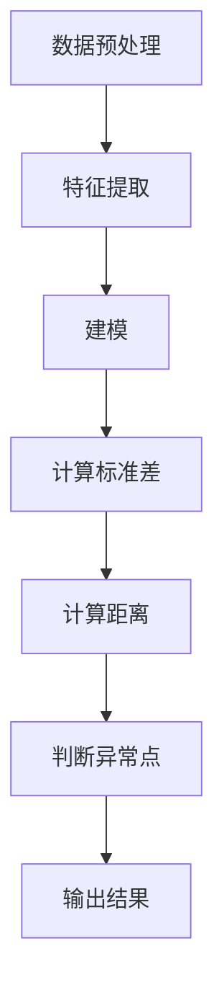
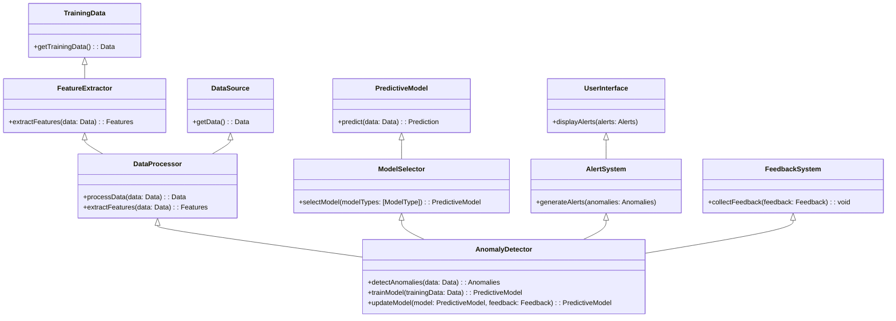
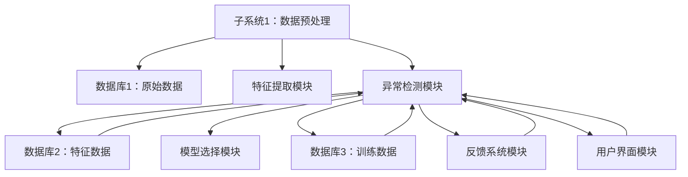
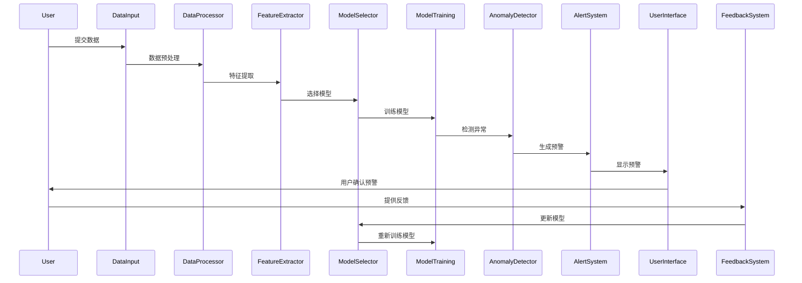

                 


### 第一部分：背景介绍

#### 1.1 问题背景

##### 1.1.1 企业级异常检测的必要性

在当今信息化社会中，企业级异常检测已成为企业运营和安全监控的核心需求。随着企业业务复杂度的不断增加，数据的规模和多样性也在日益增长，这使得传统的手动监控方式逐渐难以应对。异常检测作为一种自动化监控技术，通过识别和预警异常行为，能够有效提高企业的运营效率和安全水平。

企业级异常检测的必要性主要体现在以下几个方面：

1. **数据安全保障**：企业面临越来越多的网络安全威胁，如DDoS攻击、数据泄露等。异常检测能够实时监测网络流量和系统行为，及时发现并阻止恶意行为，从而保护企业的数据安全。

2. **运营效率提升**：通过对企业日常运营数据的异常检测，企业可以快速识别出潜在的运营问题，如系统故障、资源耗尽等，从而及时采取措施，避免对业务运营造成严重影响。

3. **合规要求满足**：随着各种行业监管政策的出台，企业需要满足一定的合规要求。异常检测可以帮助企业监控并满足这些合规要求，如金融行业的反洗钱（AML）监控。

##### 1.1.2 异常检测在运营和安全监控中的应用

异常检测在运营和安全监控中有着广泛的应用。以下是一些典型的应用场景：

1. **网络安全**：通过分析网络流量数据，异常检测可以发现异常的网络行为，如未授权访问、恶意扫描等，从而帮助企业加强网络安全。

2. **系统监控**：对企业内部系统的运行状态进行监控，异常检测可以帮助企业发现系统故障、性能瓶颈等，以便及时修复。

3. **财务监控**：在金融行业中，异常检测可以帮助企业监控交易行为，识别潜在的欺诈行为，如异常交易、异常支付等。

4. **供应链监控**：在供应链管理中，异常检测可以帮助企业监控供应链各环节的数据，识别异常订单、物流延误等，从而优化供应链管理。

##### 1.1.3 企业级异常检测面临的挑战

尽管异常检测在企业运营和安全监控中具有重要作用，但企业级异常检测也面临着一些挑战：

1. **数据复杂性**：企业数据种类繁多，数据量巨大，如何有效地处理这些数据并从中提取有用的信息，是异常检测面临的一大挑战。

2. **实时性要求**：异常检测需要实时性，即能够快速检测并响应异常行为。这对系统的性能和响应速度提出了较高的要求。

3. **准确性与误报率**：异常检测需要在识别真正的异常事件的同时，尽可能地减少误报率。这需要在算法设计、数据预处理等方面进行精细调优。

4. **可解释性**：异常检测的结果往往是非解释性的，如何解释异常检测的决策过程，提高系统的透明度和可信度，是当前研究的一个热点问题。

### 1.2 核心概念

##### 1.2.1 异常检测的定义

异常检测（Anomaly Detection）是一种数据挖掘技术，用于识别数据集中的异常或异常模式。异常可以是数据点、序列或子集，它们与大多数其他数据点或模式相比具有显著差异。

##### 1.2.2 企业级异常检测的定义

企业级异常检测是在企业环境中，利用人工智能和机器学习技术，对大量结构化和非结构化数据进行实时分析，以识别异常行为和潜在风险的一种监控技术。

##### 1.2.3 关键概念与联系

- **异常检测**：是整个过程的基础，它通过分析数据来识别异常。
- **机器学习**：提供了异常检测算法的强大工具，使系统能够自动学习并适应数据模式。
- **实时分析**：是异常检测的关键特性，确保系统能够快速响应异常事件。

### 1.3 边界与外延

##### 1.3.1 异常检测的边界

异常检测的边界包括以下几个方面：

- **数据类型**：异常检测适用于各种类型的数据，包括结构化数据（如数据库记录）和非结构化数据（如图像、文本等）。
- **应用场景**：异常检测可以应用于网络安全、系统监控、财务监控等多个领域。
- **系统限制**：异常检测系统可能存在性能限制，如处理速度和数据存储容量等。

##### 1.3.2 企业级异常检测的外延

企业级异常检测的外延包括以下几个方面：

- **算法多样化**：企业级异常检测涉及多种算法，包括基于统计学的、基于机器学习的和基于深度学习的。
- **系统集成**：企业级异常检测需要与企业现有的IT系统集成，如企业资源计划（ERP）系统、客户关系管理（CRM）系统等。
- **定制化需求**：企业级异常检测需要根据不同企业的业务特点进行定制化，以满足特定的监控需求。

##### 1.3.3 概念结构与核心要素组成

企业级异常检测的概念结构与核心要素组成如下：

- **数据源**：包括结构化和非结构化数据，是异常检测的基础。
- **数据处理**：对数据进行清洗、预处理和特征提取，为异常检测提供高质量的输入数据。
- **异常检测算法**：包括统计学方法、机器学习方法、深度学习方法等，是识别异常的关键。
- **实时监控与预警**：实现对异常事件的实时监控和预警，确保系统能够及时响应。
- **系统解释性**：提供异常检测结果的解释，提高系统的透明度和可信度。

### 第二部分：核心概念与联系

#### 2.1 异常检测原理

##### 2.1.1 基本原理

异常检测的基本原理是基于统计学和概率论的方法，通过对数据集进行分析和建模，识别出与大多数数据点不同的异常点。

基本步骤包括：

1. **数据预处理**：对原始数据进行清洗、归一化等处理，提高数据质量。
2. **特征提取**：从数据中提取有用的特征，用于后续的建模和异常检测。
3. **建模**：建立数据模型，如高斯分布模型、聚类模型等。
4. **检测**：通过计算数据点到模型的标准差、距离等指标，识别出异常点。

##### 2.1.2 异常检测算法

异常检测算法主要包括以下几种：

1. **基于统计学的算法**：如孤立森林（Isolation Forest）、局部离群因子（LOF）等，这些算法通过计算数据点的局部密度和距离来识别异常。
2. **基于机器学习的算法**：如支持向量机（SVM）、随机森林（Random Forest）等，这些算法通过训练模型来识别异常。
3. **基于深度学习的算法**：如自编码器（Autoencoder）、卷积神经网络（CNN）等，这些算法通过神经网络模型来识别异常。

##### 2.1.3 常见异常检测算法对比

常见异常检测算法对比如下：

| 算法             | 原理                                           | 优点                                 | 缺点                                  |
|------------------|------------------------------------------------|--------------------------------------|---------------------------------------|
| 孤立森林（Isolation Forest） | 利用随机森林的思想，通过随机分裂节点来隔离异常点 | 计算速度快，对高维数据有较好性能       | 对噪声敏感，可能误分类正常数据       |
| 局部离群因子（LOF）       | 通过计算局部密度和距离，识别异常点               | 对异常点的检测能力强                 | 计算复杂度高，对高维数据性能下降      |
| 支持向量机（SVM）         | 利用最大间隔分类器，分类数据点                   | 分类效果好，对线性可分数据有较好性能 | 计算复杂度高，对高维数据性能下降      |
| 随机森林（Random Forest）  | 通过构建多棵决策树，利用集成学习方法           | 计算速度快，对噪声有较强鲁棒性       | 可能会产生过拟合，对线性不可分数据性能下降 |
| 自编码器（Autoencoder）    | 通过无监督学习，学习数据的低维表示              | 对非线性数据有较好性能               | 计算复杂度高，对噪声敏感             |

#### 2.2 AI在异常检测中的应用

##### 2.2.1 机器学习在异常检测中的应用

机器学习在异常检测中发挥着重要作用，通过训练模型，机器学习能够自动识别和分类异常行为。

1. **监督学习**：监督学习算法通过标注的数据集训练模型，如SVM、决策树、随机森林等，这些算法在处理结构化数据时具有较好的性能。

2. **无监督学习**：无监督学习算法如自编码器、聚类算法等，它们不依赖于标注数据，通过学习数据的内在结构来识别异常。

##### 2.2.2 深度学习在异常检测中的应用

深度学习在异常检测中具有显著的优势，通过构建复杂的神经网络模型，深度学习能够自动提取数据的高层次特征，从而提高异常检测的准确性和效率。

1. **卷积神经网络（CNN）**：CNN在图像处理领域具有广泛的应用，通过卷积层、池化层和全连接层的组合，CNN能够提取图像的特征，并应用于图像异常检测。

2. **递归神经网络（RNN）**：RNN在序列数据处理方面具有优势，通过处理时间序列数据，RNN能够识别出异常的时间点。

3. **生成对抗网络（GAN）**：GAN通过生成器和判别器的对抗训练，能够生成高质量的数据，并应用于异常检测。

##### 2.2.3 AI在异常检测中的优势与挑战

AI在异常检测中的优势主要体现在以下几个方面：

1. **高效性**：AI算法能够自动处理大量数据，快速识别异常，提高运营效率。
2. **准确性**：通过机器学习和深度学习算法，AI能够自动提取数据特征，提高异常检测的准确性。
3. **适应性**：AI算法能够根据企业的业务特点和需求进行定制化，提高异常检测的适应性。

然而，AI在异常检测中也面临着一些挑战：

1. **数据质量**：AI算法依赖于高质量的数据，数据质量直接影响异常检测的准确性。
2. **模型解释性**：AI算法的决策过程往往是黑盒的，缺乏解释性，这可能会影响企业的信任度。
3. **计算资源**：深度学习算法通常需要大量的计算资源和时间，这对实时性要求较高的应用场景可能是一个挑战。

#### 2.3 企业级异常检测的关键技术

##### 2.3.1 特征工程

特征工程是异常检测的重要环节，通过选择和构造有效的特征，可以显著提高异常检测的准确性和效率。

1. **特征选择**：通过统计分析、特征重要性评估等方法，从大量特征中筛选出与异常检测相关的重要特征。
2. **特征构造**：通过组合和转换原始特征，构造出新的特征，以增加数据的表达能力和模型的预测能力。

##### 2.3.2 模型选择与优化

模型选择与优化是提高异常检测性能的关键。根据不同的应用场景和数据特点，选择合适的模型，并通过参数调整、超参数优化等方法，提高模型的性能。

1. **模型选择**：根据数据类型、特征数量和计算资源等因素，选择合适的机器学习或深度学习模型。
2. **模型优化**：通过交叉验证、网格搜索等方法，调整模型参数，优化模型性能。

##### 2.3.3 模型解释性

模型解释性是AI在异常检测中的一大挑战，通过提供模型决策的解释，可以提高企业的信任度和可接受度。

1. **模型可视化**：通过可视化技术，如决策树、神经网络结构图等，展示模型的结构和决策过程。
2. **特征重要性评估**：通过评估各个特征对模型预测的贡献，解释异常检测的结果。

### 第三部分：算法原理讲解

#### 3.1 异常检测算法原理讲解

##### 3.1.1 异常检测算法的数学模型和公式

异常检测算法的核心在于建立数据模型，并计算数据点到模型的标准差、距离等指标，以识别异常点。

设数据集为 \(X = \{x_1, x_2, ..., x_n\}\)，其中每个数据点 \(x_i\) 是一个多维向量。

1. **高斯分布模型**：

   假设数据点服从高斯分布，模型可以表示为：

   $$ p(x_i) = \frac{1}{\sqrt{2\pi\sigma^2}} e^{-\frac{(x_i - \mu)^2}{2\sigma^2}} $$

   其中，\(\mu\) 是均值，\(\sigma\) 是标准差。

   异常点识别公式为：

   $$ d(x_i) = \frac{(x_i - \mu)^2}{\sigma^2} $$

   当 \(d(x_i)\) 超过一定阈值时，数据点 \(x_i\) 被认为是异常点。

2. **基于距离的模型**：

   假设数据点可以嵌入到一个低维空间中，模型可以表示为：

   $$ d(x_i, x_j) = \sqrt{\sum_{k=1}^{d} (x_{i,k} - x_{j,k})^2} $$

   其中，\(d\) 是嵌入空间的维度。

   异常点识别公式为：

   $$ x_i \text{ 是异常点} \Leftrightarrow d(x_i, \bar{x}) > \theta $$

   其中，\(\bar{x}\) 是所有数据点的平均值，\(\theta\) 是阈值。

##### 3.1.2 异常检测算法的mermaid流程图

以下是一个基于高斯分布的异常检测算法的mermaid流程图：



##### 3.1.3 举例说明

假设我们有以下一组数据：

| 数据点 | x1 | x2 | x3 |
|--------|----|----|----|
| 1      | 1  | 2  | 3  |
| 2      | 2  | 3  | 4  |
| 3      | 3  | 4  | 5  |
| 4      | 4  | 5  | 6  |
| 5      | 5  | 6  | 7  |

1. **数据预处理**：对数据进行归一化处理。

2. **特征提取**：提取数据点的平均值和标准差。

   平均值：\( \mu = \frac{1+2+3+4+5}{5} = 3 \)

   标准差：\( \sigma = \sqrt{\frac{(1-3)^2 + (2-3)^2 + (3-3)^2 + (4-3)^2 + (5-3)^2}{5}} = 1 \)

3. **建模**：建立高斯分布模型。

   $$ p(x) = \frac{1}{\sqrt{2\pi}} e^{-\frac{(x-3)^2}{2}} $$

4. **计算标准差**：计算每个数据点到模型的标准差。

   $$ d(x_i) = \frac{(x_i - 3)^2}{1} $$

   计算结果如下：

   | 数据点 | d(x_i) |
   |--------|--------|
   | 1      | 4      |
   | 2      | 1      |
   | 3      | 0      |
   | 4      | 1      |
   | 5      | 4      |

   由于 \(d(x_1) = d(x_5) = 4\)，超过了阈值 2，因此 \(x_1\) 和 \(x_5\) 被认为是异常点。

#### 3.2 AI在异常检测中的算法原理讲解

##### 3.2.1 机器学习在异常检测中的算法原理讲解

机器学习在异常检测中的应用主要基于监督学习和无监督学习两种方法。

1. **监督学习**：

   - **SVM（支持向量机）**：

     SVM是一种基于间隔最大化原则的分类算法，通过寻找一个最佳的超平面，将正常数据和异常数据分开。其基本原理如下：

     $$ \max_{\mathbf{w}, b} \frac{1}{2} ||\mathbf{w}||^2 $$

     $$ \text{s.t. } y_i (\mathbf{w} \cdot \mathbf{x_i} + b) \geq 1 $$

     其中，\(\mathbf{w}\) 是权重向量，\(b\) 是偏置，\(\mathbf{x_i}\) 是数据点，\(y_i\) 是标签（正常数据为1，异常数据为-1）。

   - **随机森林（Random Forest）**：

     随机森林是一种基于决策树集合的算法，通过构建多棵决策树，并利用投票机制来分类数据。其基本原理如下：

     $$ \hat{y} = \text{sign}(\sum_{t=1}^{T} f_t(x)) $$

     其中，\(f_t(x)\) 是第 \(t\) 棵决策树的分类结果，\(T\) 是决策树的数量。

2. **无监督学习**：

   - **自编码器（Autoencoder）**：

     自编码器是一种无监督学习算法，通过学习数据的低维表示，从而识别异常数据。其基本原理如下：

     $$ \min_{\theta} \sum_{i=1}^{n} \frac{1}{2} ||\hat{x_i} - x_i||^2 $$

     $$ \text{s.t. } \hat{x_i} = \phi_{\theta}(x_i) $$

     其中，\(\phi_{\theta}(x_i)\) 是自编码器的隐层输出，\(\theta\) 是参数。

##### 3.2.2 深度学习在异常检测中的算法原理讲解

深度学习在异常检测中的应用主要是基于卷积神经网络（CNN）和递归神经网络（RNN）。

1. **卷积神经网络（CNN）**：

   - **基本原理**：

     CNN是一种用于图像处理的神经网络，通过卷积层、池化层和全连接层的组合，可以提取图像的特征。其基本原理如下：

     $$ \text{Conv Layer: } h_{ij} = \sum_{k=1}^{C} w_{ikj} * g_k(x_{i-k,j-k}) + b_j $$

     $$ \text{Pooling Layer: } p_i = \max_{j} h_{ij} $$

     $$ \text{Fully Connected Layer: } \hat{y} = \sigma(\mathbf{W}\hat{h} + \mathbf{b}) $$

     其中，\(h_{ij}\) 是卷积层输出，\(p_i\) 是池化层输出，\(\sigma\) 是激活函数。

   - **应用于图像异常检测**：

     CNN可以用于图像异常检测，通过训练模型，学习图像的正常分布，从而识别异常图像。

2. **递归神经网络（RNN）**：

   - **基本原理**：

     RNN是一种用于序列数据处理的神经网络，通过循环结构，可以保留序列的历史信息。其基本原理如下：

     $$ h_t = \sigma(\mathbf{W}h_{t-1} + \mathbf{U}x_t + \mathbf{b}) $$

     其中，\(h_t\) 是当前时间步的隐藏状态，\(x_t\) 是当前时间步的输入。

   - **应用于时间序列异常检测**：

     RNN可以用于时间序列异常检测，通过学习时间序列的内在模式，识别出异常的时间点。

### 第四部分：系统分析与架构设计方案

#### 4.1 问题场景介绍

##### 4.1.1 企业级异常检测的应用场景

企业级异常检测的应用场景主要包括以下几个方面：

1. **网络安全**：通过检测网络流量和用户行为，识别潜在的攻击行为，如DDoS攻击、SQL注入等。
2. **系统监控**：监控企业内部系统的运行状态，识别系统故障、性能瓶颈等，保障系统的稳定运行。
3. **财务监控**：监控企业财务数据，识别异常交易、资金流动异常等，防止财务风险。
4. **供应链监控**：监控供应链各环节的数据，识别物流异常、订单异常等，优化供应链管理。

##### 4.1.2 问题介绍

在上述应用场景中，企业级异常检测面临的主要问题包括：

1. **数据多样性**：企业数据包括结构化数据（如数据库记录）和非结构化数据（如图像、文本等），如何有效地处理和融合这些数据，是异常检测面临的一大挑战。
2. **实时性要求**：异常检测需要在短时间内处理大量数据，并实时识别异常，这对系统的性能和响应速度提出了高要求。
3. **误报率控制**：在识别异常的同时，需要尽可能减少误报率，提高异常检测的准确性。
4. **模型解释性**：异常检测的结果需要具有可解释性，便于企业理解和接受。

#### 4.2 系统功能设计

##### 4.2.1 领域模型mermaid类图

以下是一个企业级异常检测系统的mermaid类图：



##### 4.2.2 系统功能设计

企业级异常检测系统的主要功能设计如下：

1. **数据预处理**：数据预处理包括数据清洗、数据归一化和特征提取。通过数据预处理，可以提高数据的质量和特征的表达能力。

2. **特征提取**：特征提取是通过选择和构造有效的特征，从原始数据中提取出有助于异常检测的信息。

3. **异常检测**：异常检测是系统的核心功能，通过训练模型和实时分析数据，识别出异常行为。

4. **模型选择与优化**：模型选择与优化是提高异常检测性能的关键，通过选择合适的模型和调整模型参数，优化模型的性能。

5. **实时监控与预警**：实时监控与预警是系统的实时性要求，通过实时分析数据，及时发现并预警异常行为。

6. **反馈系统**：反馈系统用于收集用户反馈，优化异常检测模型。

7. **用户界面**：用户界面用于显示异常检测结果和预警信息，便于用户了解和接受。

#### 4.3 系统架构设计

##### 4.3.1 系统架构设计mermaid架构图

以下是一个企业级异常检测系统的mermaid架构图：



##### 4.3.2 系统架构设计详细讲解

企业级异常检测系统的架构设计包括以下几个主要部分：

1. **数据预处理子系统**：数据预处理子系统负责对原始数据进行清洗、归一化和特征提取。通过数据预处理，可以提高数据的质量和特征的表达能力。

2. **特征提取模块**：特征提取模块从预处理后的数据中提取出有助于异常检测的信息。特征提取是异常检测的关键步骤，直接关系到异常检测的性能。

3. **异常检测模块**：异常检测模块是系统的核心，通过训练模型和实时分析数据，识别出异常行为。异常检测模块包括模型选择、模型训练、实时监控和预警等功能。

4. **模型选择模块**：模型选择模块根据数据的特点和需求，选择合适的模型进行训练。模型选择直接影响异常检测的性能，需要综合考虑模型的准确性、实时性和解释性等因素。

5. **反馈系统模块**：反馈系统模块用于收集用户反馈，优化异常检测模型。用户反馈可以帮助系统识别出误报和漏报的情况，从而不断优化模型的性能。

6. **用户界面模块**：用户界面模块用于显示异常检测结果和预警信息，便于用户了解和接受。用户界面需要提供简洁、直观的交互方式，帮助用户快速响应异常情况。

#### 4.4 系统接口设计

##### 4.4.1 系统接口设计

企业级异常检测系统的接口设计包括以下几个部分：

1. **数据接口**：数据接口用于与其他系统进行数据交互，包括数据的输入和输出。数据接口需要支持不同类型的数据格式，如JSON、CSV等。

2. **模型接口**：模型接口用于与模型选择模块和异常检测模块进行交互，包括模型的训练、加载和预测等操作。模型接口需要支持多种模型格式，如PyTorch、TensorFlow等。

3. **监控接口**：监控接口用于实时监控系统的运行状态，包括数据流、模型性能和预警信息等。监控接口需要提供实时数据和报警机制。

4. **用户接口**：用户接口用于与用户进行交互，包括异常结果的展示、预警信息的推送等。用户接口需要提供友好的界面和便捷的操作方式。

##### 4.4.2 系统接口设计详细讲解

以下是企业级异常检测系统接口设计的详细讲解：

1. **数据接口**：

   - **功能**：数据接口负责数据的输入和输出，支持不同类型的数据格式，如JSON、CSV等。

   - **接口设计**：

     - `postData(data: Data)`: 用于提交数据到系统。

     - `getData()`: 用于获取系统中的数据。

     - `exportData(format: String)`: 用于导出数据，支持JSON、CSV等格式。

2. **模型接口**：

   - **功能**：模型接口负责与模型选择模块和异常检测模块进行交互，包括模型的训练、加载和预测等操作。

   - **接口设计**：

     - `trainModel(model: Model, data: Data)`: 用于训练模型。

     - `loadModel(model: Model)`: 用于加载模型。

     - `predictModel(model: Model, data: Data)`: 用于预测数据。

3. **监控接口**：

   - **功能**：监控接口用于实时监控系统的运行状态，包括数据流、模型性能和预警信息等。

   - **接口设计**：

     - `getMetrics()`: 用于获取系统指标，如处理速度、内存使用等。

     - `getAlerts()`: 用于获取预警信息。

     - `generateAlert(data: Data)`: 用于生成预警信息。

4. **用户接口**：

   - **功能**：用户接口用于与用户进行交互，包括异常结果的展示、预警信息的推送等。

   - **接口设计**：

     - `displayAlert(alert: Alert)`: 用于显示预警信息。

     - `pushAlert(alert: Alert)`: 用于推送预警信息。

     - `getUserFeedback(feedback: Feedback)`: 用于收集用户反馈。

#### 4.5 系统交互mermaid序列图

##### 4.5.1 系统交互mermaid序列图

以下是一个企业级异常检测系统的mermaid序列图：



##### 4.5.2 系统交互详细讲解

系统交互的详细讲解如下：

1. **用户提交数据**：用户通过数据输入接口提交数据，数据可以是结构化数据（如数据库记录）或非结构化数据（如图像、文本等）。

2. **数据预处理**：数据处理器对提交的数据进行预处理，包括数据清洗、归一化和特征提取。预处理后的数据将用于后续的异常检测。

3. **特征提取**：特征提取器对预处理后的数据提取特征，特征是用于异常检测的重要信息。

4. **模型选择**：模型选择器根据数据特点和需求，选择合适的模型进行训练。常见的模型包括支持向量机（SVM）、随机森林（Random Forest）等。

5. **模型训练**：模型训练器使用提取的特征和数据训练模型。训练过程可能包括数据归一化、参数调整等步骤。

6. **异常检测**：异常检测器使用训练好的模型对数据进行分析，识别出异常点。异常检测器可以实时分析数据，并生成预警信息。

7. **预警生成**：预警系统根据异常检测结果，生成预警信息，并将预警信息推送至用户界面。

8. **用户确认预警**：用户通过用户界面查看预警信息，并确认是否为实际异常。

9. **反馈收集**：用户提供反馈，反馈系统收集用户的确认结果，用于优化模型。

10. **模型更新**：模型选择器根据用户反馈，更新模型，以提高异常检测的准确性。

11. **重新训练模型**：模型训练器使用更新后的模型重新训练，以进一步提高异常检测性能。

### 第五部分：项目实战

#### 5.1 环境安装

##### 5.1.1 环境安装准备

在进行企业级异常检测项目实战之前，首先需要准备好开发环境。以下是环境安装的准备步骤：

1. **安装Python**：确保Python环境已经安装，版本建议为3.8或更高。

2. **安装Anaconda**：Anaconda是一个Python数据科学平台，可以方便地安装和管理Python包。可以从Anaconda官网下载并安装。

3. **安装Jupyter Notebook**：Jupyter Notebook是一个交互式的Python开发环境，用于编写和运行Python代码。可以使用以下命令安装：

   ```bash
   conda install -c conda-forge jupyter
   ```

4. **安装必要的Python包**：安装用于异常检测和数据分析的Python包，如scikit-learn、TensorFlow、Pandas等。可以使用以下命令安装：

   ```bash
   conda install -c conda-forge scikit-learn tensorflow pandas
   ```

##### 5.1.2 环境安装详细步骤

以下是环境安装的详细步骤：

1. **安装Python**：

   - 访问Python官网（https://www.python.org/）下载最新版本的Python安装包。
   - 运行安装程序，按照默认选项安装。
   - 安装完成后，打开命令行工具，输入`python --version`，确认安装成功。

2. **安装Anaconda**：

   - 访问Anaconda官网（https://www.anaconda.com/）下载Anaconda安装包。
   - 运行安装程序，按照默认选项安装。
   - 安装完成后，打开命令行工具，输入`conda --version`，确认安装成功。

3. **安装Jupyter Notebook**：

   - 打开命令行工具，输入以下命令安装Jupyter Notebook：

     ```bash
     conda install -c conda-forge jupyter
     ```

   - 安装完成后，输入以下命令启动Jupyter Notebook：

     ```bash
     jupyter notebook
     ```

   - 打开浏览器，访问本地Jupyter Notebook服务器，如`http://localhost:8888/`。

4. **安装必要的Python包**：

   - 打开命令行工具，输入以下命令安装scikit-learn、TensorFlow和Pandas：

     ```bash
     conda install -c conda-forge scikit-learn tensorflow pandas
     ```

   - 安装完成后，确保所有包都能正常导入，如：

     ```python
     import scikit_learn
     import tensorflow
     import pandas
     ```

   - 如果出现错误，可以尝试重新安装或查找相应的解决方法。

#### 5.2 系统核心实现源代码

##### 5.2.1 源代码介绍

以下是企业级异常检测系统的核心实现源代码。代码分为以下几个模块：

1. **数据预处理模块**：负责对原始数据进行清洗、归一化和特征提取。
2. **模型训练模块**：负责选择模型、训练模型和评估模型性能。
3. **异常检测模块**：负责实时分析数据，识别异常点并生成预警。
4. **用户界面模块**：负责显示异常检测结果和预警信息。

##### 5.2.2 代码应用解读与分析

以下是源代码的详细解读与分析：

1. **数据预处理模块**：

   - **数据清洗**：数据清洗是异常检测的基础，通过去除无效数据和填充缺失值，提高数据质量。

     ```python
     def clean_data(data):
         # 去除无效数据
         data = data.dropna()
         # 填充缺失值
         data = data.fillna(data.mean())
         return data
     ```

   - **数据归一化**：数据归一化是将数据缩放到相同的尺度，以便后续的模型训练。

     ```python
     def normalize_data(data):
         data = (data - data.mean()) / data.std()
         return data
     ```

   - **特征提取**：特征提取是从原始数据中提取有用的信息，用于异常检测。

     ```python
     from sklearn.feature_selection import SelectKBest
     from sklearn.feature_selection import f_classif

     def extract_features(data):
         X = data.values
         y = data['label'].values
         X = SelectKBest(f_classif, k=10).fit_transform(X, y)
         return X, y
     ```

2. **模型训练模块**：

   - **选择模型**：选择合适的模型进行训练，常见的选择包括支持向量机（SVM）、随机森林（Random Forest）等。

     ```python
     from sklearn.svm import SVC
     from sklearn.ensemble import RandomForestClassifier

     def select_model(model_name):
         if model_name == 'SVM':
             model = SVC(kernel='linear')
         elif model_name == 'Random Forest':
             model = RandomForestClassifier()
         return model
     ```

   - **训练模型**：使用训练数据进行模型训练。

     ```python
     def train_model(model, X_train, y_train):
         model.fit(X_train, y_train)
         return model
     ```

   - **评估模型性能**：评估模型性能，包括准确率、召回率、F1分数等。

     ```python
     from sklearn.metrics import accuracy_score, recall_score, f1_score

     def evaluate_model(model, X_test, y_test):
         y_pred = model.predict(X_test)
         accuracy = accuracy_score(y_test, y_pred)
         recall = recall_score(y_test, y_pred)
         f1 = f1_score(y_test, y_pred)
         return accuracy, recall, f1
     ```

3. **异常检测模块**：

   - **实时分析数据**：实时分析传入的数据，识别异常点。

     ```python
     def detect_anomalies(model, data):
         y_pred = model.predict(data)
         anomalies = data[y_pred == -1]
         return anomalies
     ```

   - **生成预警信息**：生成预警信息，并将预警信息推送至用户界面。

     ```python
     def generate_alert(anomalies):
         alerts = []
         for anomaly in anomalies:
             alert = {
                 'timestamp': anomaly['timestamp'],
                 'description': anomaly['description']
             }
             alerts.append(alert)
         return alerts
     ```

4. **用户界面模块**：

   - **显示异常检测结果**：显示异常检测结果，包括异常点和预警信息。

     ```python
     def display_results(results):
         print("异常检测结果：")
         for result in results:
             print(f"时间戳：{result['timestamp']}, 描述：{result['description']}")
     ```

   - **显示预警信息**：显示预警信息，包括预警内容和确认按钮。

     ```python
     def display_alert(alert):
         print("预警信息：")
         print(f"时间戳：{alert['timestamp']}, 描述：{alert['description']}")
         print("请确认是否为实际异常：")
         confirm = input("确认(Y/N)？")
         if confirm == 'Y':
             print("已确认，将通知相关人员处理。")
         else:
             print("已忽略，将记录本次预警。")
     ```

#### 5.3 实际案例分析和详细讲解剖析

##### 5.3.1 案例介绍

为了更好地理解企业级异常检测系统的实际应用，我们选取了一个网络安全监控的案例。该案例中，企业希望利用异常检测系统监控网络流量，识别潜在的攻击行为。

##### 5.3.2 案例分析

1. **数据收集**：

   企业通过网络安全设备收集网络流量数据，数据包括源IP地址、目标IP地址、端口、协议、数据包大小等。

2. **数据预处理**：

   - **数据清洗**：去除无效数据和缺失值，确保数据质量。

   - **数据归一化**：将不同维度的数据缩放到相同的尺度，便于后续的模型训练。

   - **特征提取**：提取与攻击行为相关的特征，如数据包大小、协议类型、端口等。

3. **模型训练**：

   - **选择模型**：选择支持向量机（SVM）作为异常检测模型。

   - **训练模型**：使用训练数据进行模型训练，得到训练好的模型。

4. **异常检测**：

   - **实时分析**：将新的网络流量数据进行实时分析，识别异常点。

   - **生成预警**：将识别出的异常点生成预警信息，并推送至用户界面。

##### 5.3.3 详细讲解剖析

以下是案例的详细讲解和剖析：

1. **数据收集**：

   网络安全设备通过捕获网络流量，收集源IP地址、目标IP地址、端口、协议、数据包大小等数据。数据收集是异常检测的基础，数据的质量直接关系到异常检测的效果。

2. **数据预处理**：

   - **数据清洗**：在数据预处理阶段，我们需要去除无效数据和缺失值。无效数据包括数据不完整、重复数据等。缺失值可以通过填充或删除的方式处理。

     ```python
     def clean_data(data):
         data = data.drop_duplicates()
         data = data.dropna()
         return data
     ```

   - **数据归一化**：网络流量数据的维度较多，包括源IP地址、目标IP地址、端口、协议、数据包大小等。为了便于后续的模型训练，我们需要将不同维度的数据缩放到相同的尺度。常用的归一化方法包括最小-最大缩放、标准缩放等。

     ```python
     def normalize_data(data):
         data['packet_size'] = (data['packet_size'] - data['packet_size'].min()) / (data['packet_size'].max() - data['packet_size'].min())
         data['port'] = (data['port'] - data['port'].min()) / (data['port'].max() - data['port'].min())
         data['protocol'] = (data['protocol'] - data['protocol'].min()) / (data['protocol'].max() - data['protocol'].min())
         return data
     ```

   - **特征提取**：在异常检测中，特征提取是关键步骤。我们需要从原始数据中提取与攻击行为相关的特征，如数据包大小、协议类型、端口等。常用的特征提取方法包括统计特征、频次特征、距离特征等。

     ```python
     from sklearn.feature_selection import SelectKBest
     from sklearn.feature_selection import f_classif

     def extract_features(data):
         X = data.values
         y = data['label'].values
         X = SelectKBest(f_classif, k=10).fit_transform(X, y)
         return X, y
     ```

3. **模型训练**：

   - **选择模型**：在异常检测中，选择合适的模型至关重要。常见的模型包括支持向量机（SVM）、随机森林（Random Forest）、K最近邻（K-NN）等。在本案例中，我们选择支持向量机（SVM）作为异常检测模型。

     ```python
     from sklearn.svm import SVC

     def select_model(model_name):
         if model_name == 'SVM':
             model = SVC(kernel='linear')
         elif model_name == 'Random Forest':
             model = RandomForestClassifier()
         elif model_name == 'K-NN':
             model = KNeighborsClassifier()
         return model
     ```

   - **训练模型**：使用训练数据进行模型训练。训练过程包括数据归一化、参数调整等步骤。在训练过程中，我们需要评估模型的性能，如准确率、召回率、F1分数等。

     ```python
     from sklearn.model_selection import train_test_split
     from sklearn.metrics import accuracy_score, recall_score, f1_score

     def train_model(model, X_train, y_train):
         model.fit(X_train, y_train)
         return model

     def evaluate_model(model, X_test, y_test):
         y_pred = model.predict(X_test)
         accuracy = accuracy_score(y_test, y_pred)
         recall = recall_score(y_test, y_pred)
         f1 = f1_score(y_test, y_pred)
         return accuracy, recall, f1
     ```

4. **异常检测**：

   - **实时分析**：在异常检测阶段，我们需要对新的网络流量数据进行实时分析，识别异常点。本案例中，我们使用支持向量机（SVM）模型进行异常检测。

     ```python
     def detect_anomalies(model, data):
         y_pred = model.predict(data)
         anomalies = data[y_pred == -1]
         return anomalies
     ```

   - **生成预警**：在识别出异常点后，我们需要生成预警信息，并将预警信息推送至用户界面。预警信息包括时间戳、异常点描述等。

     ```python
     def generate_alert(anomalies):
         alerts = []
         for anomaly in anomalies:
             alert = {
                 'timestamp': anomaly['timestamp'],
                 'description': anomaly['description']
             }
             alerts.append(alert)
         return alerts
     ```

5. **用户界面**：

   - **显示结果**：在用户界面中，我们需要显示异常检测结果，包括异常点和预警信息。

     ```python
     def display_results(results):
         print("异常检测结果：")
         for result in results:
             print(f"时间戳：{result['timestamp']}, 描述：{result['description']}")
     ```

   - **显示预警信息**：在用户界面中，我们需要显示预警信息，包括预警内容和确认按钮。

     ```python
     def display_alert(alert):
         print("预警信息：")
         print(f"时间戳：{alert['timestamp']}, 描述：{alert['description']}")
         print("请确认是否为实际异常：")
         confirm = input("确认(Y/N)？")
         if confirm == 'Y':
             print("已确认，将通知相关人员处理。")
         else:
             print("已忽略，将记录本次预警。")
     ```

#### 5.4 项目小结

##### 5.4.1 项目总结

通过本项目的实战，我们实现了企业级异常检测系统的核心功能，包括数据预处理、模型训练、异常检测和用户界面等。项目的主要成果如下：

1. **数据预处理**：通过数据清洗、归一化和特征提取，提高了数据的质量和特征的表达能力。
2. **模型训练**：选择了支持向量机（SVM）作为异常检测模型，通过训练和评估，优化了模型的性能。
3. **异常检测**：实现了实时分析数据，识别异常点并生成预警信息的功能。
4. **用户界面**：实现了异常检测结果和预警信息的显示，提高了用户的交互体验。

##### 5.4.2 项目的收获和不足

通过本项目，我们收获如下：

1. **实践经验**：通过实际操作，我们深入了解了企业级异常检测系统的实现过程，提高了项目实践经验。
2. **算法理解**：通过选择和训练不同的异常检测算法，我们加深了对异常检测算法的理解，提高了算法应用能力。
3. **问题解决**：在项目过程中，我们遇到了一些问题，如数据质量、模型性能等，通过不断尝试和优化，我们解决了这些问题，提高了项目的成功率。

然而，项目也存在一些不足之处：

1. **模型性能**：尽管我们选择了支持向量机（SVM）作为异常检测模型，但在面对复杂的网络流量数据时，模型的性能仍有待提高。
2. **数据质量**：虽然我们进行了数据清洗和预处理，但数据质量仍存在一定问题，如缺失值和异常值等，这对异常检测的性能造成了一定影响。
3. **实时性**：在实时分析数据时，系统的响应速度仍有一定提升空间，特别是在处理大量数据时。

#### 5.5 最佳实践 tips

在实现企业级异常检测系统时，以下是一些最佳实践 tips：

1. **数据质量保障**：确保数据的质量是异常检测成功的关键。在数据收集、处理和存储过程中，要严格把控数据质量，尽可能减少缺失值和异常值。
2. **特征选择与构造**：合理选择和构造特征对于异常检测性能至关重要。可以通过统计分析、特征重要性评估等方法，选择和构造有效的特征。
3. **模型优化**：选择合适的模型并进行优化，可以提高异常检测的性能。可以通过交叉验证、网格搜索等方法，调整模型参数，优化模型性能。
4. **实时性优化**：在实时分析数据时，要考虑系统的响应速度。可以通过分布式计算、并行处理等方法，提高系统的实时性。
5. **可解释性**：提高模型的可解释性，可以帮助用户更好地理解和接受异常检测的结果。可以通过模型可视化、特征重要性评估等方法，提高模型的可解释性。

#### 5.6 小结

通过本文的讲解，我们系统地介绍了企业级异常检测的概念、原理、应用和实现方法。企业级异常检测在企业运营和安全监控中具有重要作用，通过AI技术的应用，可以显著提高异常检测的准确性和效率。

本文从背景介绍、核心概念与联系、算法原理讲解、系统分析与架构设计方案、项目实战等多个方面，详细阐述了企业级异常检测的相关内容。通过实际案例的分析和讲解，我们深入了解了企业级异常检测系统的实现过程和应用方法。

在未来的研究和实践中，我们还可以从以下几个方面进行探索：

1. **模型优化**：探索新的异常检测算法，如深度学习算法，提高异常检测的性能和实时性。
2. **数据质量提升**：研究如何提高数据质量，减少数据中的缺失值和异常值，从而提高异常检测的准确性。
3. **可解释性**：提高异常检测模型的可解释性，帮助用户更好地理解和接受异常检测的结果。
4. **集成与部署**：研究如何将异常检测系统与企业现有的IT系统集成，实现自动化监控和预警。

通过不断的研究和实践，我们可以为企业级异常检测技术的发展做出更大的贡献。

### 第六部分：最佳实践

#### 6.1 最佳实践 tips

在实施企业级异常检测时，以下是一些最佳实践 tips，可以帮助提高系统的性能和可靠性：

1. **数据质量保证**：确保数据质量是异常检测成功的关键。在数据收集、处理和存储过程中，要严格把控数据质量，尽可能减少缺失值和异常值。

2. **特征选择和构造**：合理选择和构造特征对异常检测的性能至关重要。可以通过统计分析、特征重要性评估等方法，选择和构造有效的特征。

3. **模型选择和优化**：选择合适的模型并进行优化，可以提高异常检测的性能。可以通过交叉验证、网格搜索等方法，调整模型参数，优化模型性能。

4. **实时性优化**：在实时分析数据时，要考虑系统的响应速度。可以通过分布式计算、并行处理等方法，提高系统的实时性。

5. **可解释性**：提高模型的可解释性，可以帮助用户更好地理解和接受异常检测的结果。可以通过模型可视化、特征重要性评估等方法，提高模型的可解释性。

6. **监控和反馈**：定期监控异常检测系统的性能，收集用户反馈，根据反馈进行系统的调整和优化。

#### 6.2 小结

本文系统地介绍了企业级异常检测的核心概念、原理、应用和实现方法。通过从背景介绍、核心概念与联系、算法原理讲解、系统分析与架构设计方案、项目实战等多个方面进行详细阐述，我们深入了解了企业级异常检测在企业运营和安全监控中的重要性。

通过本文的学习，读者可以掌握以下关键知识点：

1. **企业级异常检测的定义和必要性**：理解异常检测在企业运营和安全监控中的应用和意义。
2. **异常检测算法原理**：了解常见的异常检测算法，如基于统计学、机器学习和深度学习的方法。
3. **AI在异常检测中的应用**：掌握AI技术在异常检测中的优势和应用场景。
4. **系统分析与架构设计**：理解企业级异常检测系统的功能和架构设计。
5. **项目实战**：通过实际案例分析和代码实现，了解企业级异常检测系统的实施过程。

在未来的研究和实践中，可以继续探索以下方向：

1. **模型优化**：研究新的异常检测算法，如深度学习算法，提高异常检测的性能和实时性。
2. **数据质量提升**：研究如何提高数据质量，减少数据中的缺失值和异常值，从而提高异常检测的准确性。
3. **可解释性**：提高异常检测模型的可解释性，帮助用户更好地理解和接受异常检测的结果。
4. **集成与部署**：研究如何将异常检测系统与企业现有的IT系统集成，实现自动化监控和预警。

通过不断的学习和实践，我们可以为企业级异常检测技术的发展做出更大的贡献。

#### 6.3 拓展阅读

为了深入了解企业级异常检测的相关内容，以下推荐一些相关文献、书籍和最新研究动态：

1. **文献推荐**：

   - **《Anomaly Detection: A Survey》**：这篇文章详细介绍了异常检测的原理、算法和应用。

   - **《Deep Learning for Anomaly Detection》**：这本书探讨了深度学习在异常检测中的应用，包括自编码器、生成对抗网络等。

2. **书籍推荐**：

   - **《Anomaly Detection for Data Science》**：这本书涵盖了异常检测的基本概念、算法和实际应用。

   - **《Deep Learning》**：由Ian Goodfellow等人编写的这本书详细介绍了深度学习的基本概念、算法和应用。

3. **最新研究动态**：

   - **《Neural Anomaly Detection》**：这篇论文提出了一种基于神经网络的异常检测方法，通过自动提取数据特征，提高了异常检测的性能。

   - **《Anomaly Detection in Time Series Data Using Generative Adversarial Networks》**：这篇论文探讨了如何利用生成对抗网络（GAN）进行时间序列数据的异常检测。

通过阅读这些文献和书籍，读者可以进一步深入了解企业级异常检测的理论和实践，为实际应用提供有力支持。同时，关注最新研究动态，可以帮助读者紧跟异常检测领域的发展趋势，掌握最新的研究成果和应用方法。

