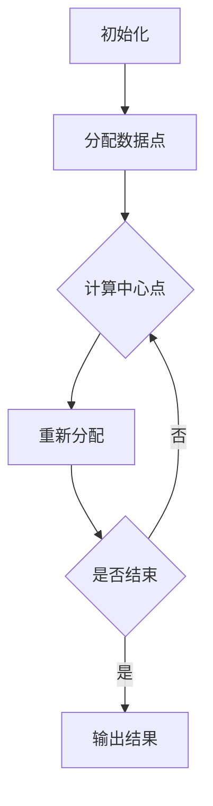
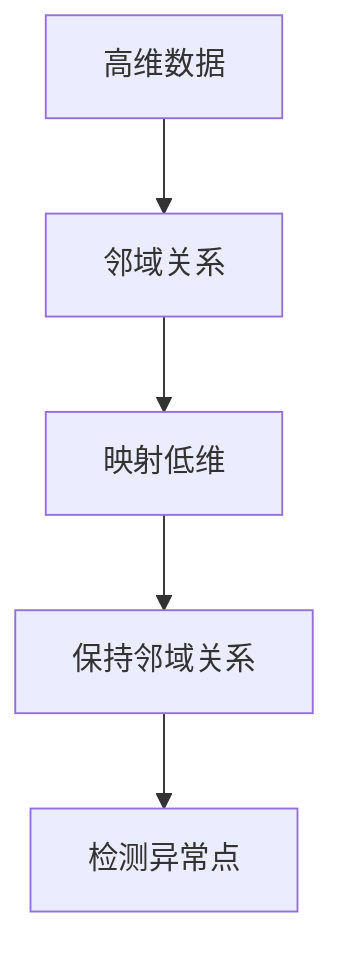
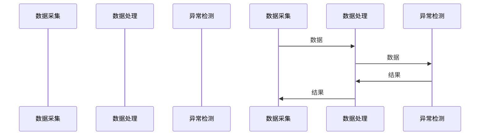

                 

# 企业级异常检测：AI提高运营和安全监控效率

关键词：异常检测、AI、运营监控、安全监控、算法原理

摘要：本文将探讨企业级异常检测的概念、重要性以及在运营和安全监控中的应用。通过分析各种异常检测算法原理，介绍数学模型，系统架构设计和实际应用案例，旨在为企业提供一套高效、可靠的异常检测方案。

----------------------------------------------------------------

## 第一部分：企业级异常检测概述

### 1.1 异常检测的定义与背景

异常检测（Anomaly Detection）是指通过算法模型自动识别出数据中的异常情况，以便及时采取应对措施。在企业级应用中，异常检测具有非常重要的作用，它可以帮助企业提高运营效率、降低安全风险。

异常检测的基本概念包括：

- **正常行为**：数据中的常规模式，反映了业务运作的正常状态。
- **异常行为**：数据中的非正常模式，可能预示着潜在问题或威胁。

异常检测在企业管理中的应用场景包括：

- **运营监控**：实时监控生产系统、网络流量等，识别异常情况，如设备故障、流量突增等。
- **安全监控**：监测网络安全事件，如入侵尝试、数据泄露等，提供实时预警。

### 1.2 异常检测的算法原理

企业级异常检测主要依赖于各种算法模型，以下是几种常见的算法：

1. **K-means算法**：基于聚类分析，将数据点划分为若干个簇，通过计算簇内距离的平均值来检测异常点。

2. **ISOMAP算法**：基于非线性降维，将高维数据映射到低维空间，通过分析低维空间中的结构来检测异常点。

下面将分别介绍这两种算法的原理，并使用Mermaid流程图和Python代码进行阐述。

### 1.2.1 K-means算法

K-means算法是一种基于距离的聚类算法。其基本原理是：首先随机选择K个数据点作为初始聚类中心，然后计算每个数据点到这些中心的距离，将每个数据点分配给最近的聚类中心，形成K个簇。接下来，重新计算每个簇的中心点，重复上述步骤，直到聚类中心不再发生显著变化。

#### 算法原理



#### Python代码示例

```python
from sklearn.cluster import KMeans
import numpy as np

# 数据集
X = np.array([[1, 2], [1, 4], [1, 0],
              [10, 2], [10, 4], [10, 0]])

# K-means聚类
kmeans = KMeans(n_clusters=2, random_state=0).fit(X)
print(kmeans.labels_)
```

### 1.2.2 ISOMAP算法

ISOMAP（Isometric Mapping）算法是一种基于降维的异常检测算法。其基本原理是：将高维数据映射到低维空间，通过分析低维空间中的结构来检测异常点。具体来说，ISOMAP算法利用邻域关系将高维数据映射到低维空间，并保持低维空间中的邻域关系。

#### 算法原理



#### Python代码示例

```python
from sklearn.manifold import Isomap
import numpy as np

# 数据集
X = np.array([[1, 2], [1, 4], [1, 0],
              [10, 2], [10, 4], [10, 0]])

# ISOMAP降维
isomap = Isomap(n_neighbors=2, n_components=2).fit_transform(X)
print(isomap)
```

### 1.3 数学模型与公式

为了更好地理解异常检测算法，我们需要介绍相关的数学模型和公式。

#### 1.3.1 数据分布模型

假设我们有一个数据集X，其中每个数据点x_i属于一个多维空间。我们可以使用概率分布模型来描述数据集的分布。

概率分布模型：

$$
P(x) = \frac{1}{Z} e^{-\frac{1}{2} \| x - \mu \|^2 / \sigma^2}
$$

其中，$\mu$是均值，$\sigma$是标准差，$Z$是归一化常数。

#### 1.3.2 异常检测的数学模型

在异常检测中，我们需要定义一个异常度量的函数，用于计算数据点的异常程度。

异常度量的函数：

$$
d(x) = \frac{1}{Z} e^{-\frac{1}{2} \| x - \mu \| / \sigma}
$$

其中，$\mu$是正常行为的数据均值，$\sigma$是正常行为的数据标准差。

对于异常点，$d(x)$值会显著大于正常点。

----------------------------------------------------------------

## 第二部分：系统架构与设计

### 2.1 问题场景介绍

在企业级应用中，异常检测系统需要处理海量数据，支持实时监控和离线分析，同时要具备高可用性和可扩展性。为了满足这些需求，我们设计了一个基于分布式架构的异常检测系统。

### 2.2 系统功能设计

系统功能设计主要包括数据采集、数据处理、异常检测和结果展示四个模块。

#### 数据采集模块

数据采集模块负责从各种数据源（如传感器、日志文件、网络流量等）收集数据，并将其传输到数据处理模块。

#### 数据处理模块

数据处理模块对采集到的数据进行预处理，包括数据清洗、去重、转换等操作，以便后续的异常检测。

#### 异常检测模块

异常检测模块是系统的核心，采用多种算法模型进行异常检测，包括K-means、ISOMAP等。检测结果将存储在数据库中，以便后续分析。

#### 结果展示模块

结果展示模块提供可视化界面，帮助用户实时查看异常检测结果，并生成报告。

### 2.3 系统架构设计

系统架构设计采用分布式架构，包括数据采集节点、数据处理节点和异常检测节点。

#### 数据采集节点

数据采集节点负责从各个数据源采集数据，并将其传输到数据处理节点。可以使用消息队列（如Kafka）进行数据传输。

#### 数据处理节点

数据处理节点负责对采集到的数据进行预处理，并将预处理后的数据传输到异常检测节点。可以使用Flume等工具进行数据传输。

#### 异常检测节点

异常检测节点负责执行异常检测算法，并将检测结果存储到数据库中。可以使用Spark等分布式计算框架进行算法运算。

### 2.4 系统接口设计

系统接口设计主要包括API接口和消息队列接口。

#### API接口

API接口提供数据采集、数据处理和异常检测等功能，供其他系统或应用程序调用。

#### 消息队列接口

消息队列接口用于数据传输，确保数据的高效传输和系统的可扩展性。

### 2.5 系统交互设计

系统交互设计采用消息驱动模式，数据采集节点将数据发送到消息队列，数据处理节点从消息队列中获取数据并进行处理，异常检测节点从数据处理节点获取处理结果并进行异常检测。

#### 系统交互序列图



----------------------------------------------------------------

## 第三部分：实际应用

### 3.1 环境安装

在开始实际应用之前，我们需要安装相关依赖。以下是一个简单的安装步骤：

1. 安装Python环境（推荐版本3.8及以上）。
2. 安装依赖包（如scikit-learn、numpy等）。

```bash
pip install scikit-learn numpy
```

### 3.2 系统核心实现

下面我们将实现一个简单的异常检测系统，包括数据采集、数据处理和异常检测。

#### 数据采集

```python
import random

# 生成随机数据
def generate_data(num_samples, dim):
    X = [[random.uniform(0, 10) for _ in range(dim)] for _ in range(num_samples)]
    return X

# 测试数据
X = generate_data(100, 2)
```

#### 数据处理

```python
from sklearn.preprocessing import StandardScaler

# 数据清洗和标准化
def preprocess_data(X):
    scaler = StandardScaler()
    X_scaled = scaler.fit_transform(X)
    return X_scaled

# 预处理数据
X_scaled = preprocess_data(X)
```

#### 异常检测

```python
from sklearn.cluster import KMeans
import matplotlib.pyplot as plt

# K-means聚类
def kmeans_detection(X, n_clusters=2):
    kmeans = KMeans(n_clusters=n_clusters, random_state=0).fit(X)
    labels = kmeans.labels_
    return labels

# 检测异常
labels = kmeans_detection(X_scaled)

# 可视化结果
plt.scatter(X_scaled[:, 0], X_scaled[:, 1], c=labels)
plt.show()
```

### 3.3 代码分析

在上面的代码中，我们首先生成了一组随机数据。然后，我们使用StandardScaler对数据进行清洗和标准化，以便后续的聚类分析。接下来，我们使用K-means算法进行聚类，并绘制了聚类结果。

### 3.4 实际案例分析与讲解

在实际应用中，我们可能会遇到各种复杂的数据集，如图像数据、文本数据等。针对不同类型的数据，我们需要选择合适的异常检测算法和预处理方法。

例如，对于图像数据，我们可以使用深度学习模型（如卷积神经网络）进行特征提取，然后使用聚类算法进行异常检测。对于文本数据，我们可以使用自然语言处理技术（如词向量）提取特征，然后使用基于距离的算法进行异常检测。

### 3.5 项目小结

通过本项目的实现，我们了解了企业级异常检测系统的基本架构和实现方法。在实际应用中，我们需要根据具体业务场景和数据类型选择合适的算法和预处理方法，以确保系统的效果和性能。

----------------------------------------------------------------

## 第四部分：最佳实践与结论

### 4.1 最佳实践

1. **数据预处理**：在异常检测过程中，数据预处理至关重要。确保数据清洗、标准化和特征提取的质量，有助于提高异常检测的准确性。
2. **选择合适的算法**：根据数据类型和业务需求，选择合适的异常检测算法。例如，对于高维数据，可以考虑使用基于降维的算法。
3. **监控与优化**：持续监控异常检测系统的性能，并根据实际效果进行优化。

### 4.2 小结

本文介绍了企业级异常检测的基本概念、算法原理、系统架构和实际应用。通过分析各种算法的优缺点，我们为企业提供了一套高效、可靠的异常检测方案。

### 4.3 注意事项

1. **数据隐私**：在处理数据时，要注意保护用户隐私，遵循相关法律法规。
2. **安全性**：确保异常检测系统的安全性，防止攻击者利用漏洞进行恶意操作。

### 4.4 拓展阅读

1. **《机器学习：算法与应用》**：深入了解机器学习算法及其应用。
2. **《大数据技术导论》**：了解大数据处理的基本原理和技术。

----------------------------------------------------------------

## 作者信息

作者：AI天才研究院/AI Genius Institute & 禅与计算机程序设计艺术 /Zen And The Art of Computer Programming

