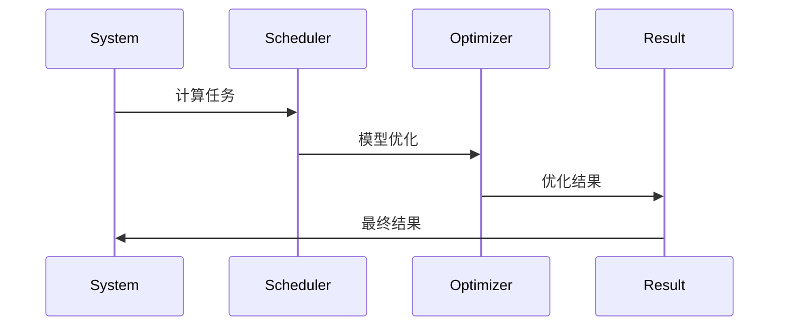

                 

## 文章标题：企业级异构计算框架：优化AI模型运行效率

### 关键词：
- 异构计算
- AI模型优化
- 运行效率
- 企业级应用

### 摘要：
本文深入探讨企业级异构计算框架在优化AI模型运行效率方面的应用。通过详细分析异构计算框架的设计原理、AI模型优化策略及其在系统架构中的应用，我们旨在为企业级AI系统提供一套高效、可靠的解决方案。文章将分为五个部分：背景与概述、核心概念与原理、算法讲解与数学模型、系统分析与架构设计、项目实战与最佳实践。

## 背景与概述

### 异构计算框架概述

异构计算是一种将不同类型的计算资源（如CPU、GPU、FPGA等）整合在一起，以实现计算性能最优化的技术。在企业级应用中，随着深度学习、大数据和云计算的兴起，异构计算框架成为提升AI模型运行效率的关键。

**问题背景**：传统的计算框架主要依赖于单一类型的计算资源，如CPU，导致计算效率低下、响应时间较长。而AI模型对计算资源的需求日益增长，单一计算资源难以满足。因此，设计一种高效、灵活的异构计算框架成为迫切需求。

**问题描述**：如何在多种异构计算资源之间高效地调度和分配计算任务，以满足AI模型对高性能计算的需求，同时降低能耗和成本。

**问题解决**：通过引入异构计算框架，可以充分利用不同类型计算资源的优势，实现计算任务的并行执行和高效调度，从而提高AI模型的运行效率。

**边界与外延**：异构计算框架的应用范围不仅限于AI领域，还包括大数据处理、科学计算、图形渲染等多个领域。本文主要关注AI模型运行效率的优化。

### 异构计算框架的核心概念

**核心概念**：异构计算框架主要包括计算节点、调度策略和资源管理三个核心概念。

1. **计算节点**：计算节点是异构计算框架的基本组成单元，包括CPU、GPU、FPGA等不同类型的计算资源。每个计算节点都有自己的计算能力和资源限制。
2. **调度策略**：调度策略是指如何将计算任务分配到不同的计算节点上，以实现最优的计算性能。常见的调度策略有负载均衡、任务分配和并行执行等。
3. **资源管理**：资源管理是指如何合理地分配和管理计算资源，以确保计算任务的顺利执行。资源管理包括资源监控、资源调度和资源回收等。

### 异构计算框架的优势与挑战

**优势**：

1. **高性能**：通过利用不同类型计算资源的优势，异构计算框架可以显著提高AI模型的计算性能。
2. **灵活性**：异构计算框架可以动态地调整计算资源的分配和调度，以适应不同的计算需求。
3. **成本效益**：异构计算框架可以降低能耗和硬件成本，提高计算资源的使用效率。

**挑战**：

1. **复杂度**：异构计算框架的设计和实现复杂度较高，需要处理多种计算资源之间的协调和调度问题。
2. **兼容性**：不同类型的计算资源之间存在兼容性问题，如何确保异构计算框架在不同硬件平台上的兼容性是一个挑战。
3. **性能优化**：如何有效地优化异构计算框架的性能，以满足不断增长的AI计算需求，也是一个重要的挑战。

## AI模型运行效率优化概述

### 问题背景

随着AI技术的快速发展，AI模型在工业、医疗、金融等领域的应用越来越广泛。然而，AI模型对计算资源的需求也日益增长，传统的计算框架已难以满足。因此，如何优化AI模型运行效率成为一个亟待解决的问题。

**问题描述**：如何通过异构计算框架，优化AI模型在多种计算资源上的运行效率，提高整体计算性能。

**问题解决**：通过引入异构计算框架，可以将AI模型的计算任务分解并分配到不同类型的计算资源上，实现计算任务的并行执行，从而提高AI模型的运行效率。

**边界与外延**：本文主要关注企业级AI模型运行效率的优化，包括深度学习、计算机视觉、自然语言处理等领域。

### 优化AI模型运行效率的核心目标

**核心目标**：

1. **提高计算性能**：通过异构计算框架，充分利用不同类型计算资源的优势，提高AI模型的计算性能。
2. **降低能耗**：通过合理分配和调度计算资源，降低AI模型的能耗，提高计算资源的利用率。
3. **降低成本**：通过优化AI模型的运行效率，减少对高性能计算资源的需求，降低硬件成本和运营成本。

### 优化方法与策略

**优化方法**：

1. **模型压缩**：通过剪枝、量化等技术，减少模型的参数数量和计算量，降低模型的复杂度。
2. **模型加速**：通过硬件加速、并行计算等技术，提高模型的计算速度。
3. **调度优化**：通过负载均衡、任务分配等技术，优化计算资源的分配和调度，提高系统的整体性能。

**策略**：

1. **硬件选择**：根据AI模型的特点和计算需求，选择合适的计算资源，如CPU、GPU、FPGA等。
2. **模型设计**：设计适合异构计算框架的AI模型，利用模型压缩和加速技术，提高模型在异构计算框架上的运行效率。
3. **系统优化**：通过调度优化、资源管理等技术，优化系统的整体性能，提高AI模型的运行效率。

## 核心概念与原理

### 异构计算基础

**计算节点类型**：

异构计算框架中的计算节点包括CPU、GPU、FPGA、TPU等多种类型。每种计算节点都有其独特的计算能力和优势：

1. **CPU（中央处理器）**：CPU是传统的计算资源，适用于通用计算任务，具有较高的计算精度和稳定性。
2. **GPU（图形处理器）**：GPU是专门为图形渲染设计的计算资源，具有高度并行处理能力，适用于大规模矩阵运算和深度学习模型训练。
3. **FPGA（现场可编程门阵列）**：FPGA是一种可编程逻辑器件，具有高度灵活性和可配置性，适用于定制化计算任务。
4. **TPU（张量处理器）**：TPU是谷歌专为深度学习设计的专用处理器，具有高度并行处理能力和优化的深度学习算法。

**异构计算架构**：

异构计算架构包括多个计算节点、通信网络和资源管理模块。不同类型的计算节点通过通信网络连接，形成一个统一的计算资源池。资源管理模块负责调度和分配计算任务，确保计算任务的并行执行和高效调度。

**异构计算框架的基本工作原理**：

1. **任务分解**：将大型计算任务分解为多个小型任务，以适应不同类型的计算节点。
2. **任务调度**：根据计算节点的计算能力和资源状态，调度计算任务到相应的计算节点上。
3. **并行执行**：在多个计算节点上并行执行计算任务，提高整体计算性能。
4. **结果汇总**：将多个计算节点的计算结果汇总，生成最终的计算结果。

### AI模型优化原理

**AI模型优化概述**：

AI模型优化是指通过调整模型的参数和结构，提高模型的计算性能和运行效率。常见的AI模型优化技术包括模型压缩、模型量化、模型加速等。

**模型压缩**：

模型压缩是指通过剪枝、量化等技术，减少模型的参数数量和计算量，降低模型的复杂度。模型压缩技术包括：

1. **剪枝**：通过删除模型中不重要的参数和连接，减少模型的参数数量。
2. **量化**：通过将模型的浮点数参数转换为低精度的整数参数，减少模型的计算量。

**模型量化**：

模型量化是指将AI模型的浮点数参数转换为低精度的整数参数，以降低模型的计算复杂度和存储空间需求。模型量化技术包括：

1. **整数量化**：将浮点数参数直接转换为整数参数。
2. **二进制量化**：将浮点数参数转换为二进制参数，以实现更高的压缩率。

**模型加速技术**：

模型加速技术是指通过硬件加速、并行计算等技术，提高AI模型的计算速度。模型加速技术包括：

1. **硬件加速**：利用GPU、TPU等高性能计算资源，加速模型的计算过程。
2. **并行计算**：将模型分解为多个子模型，在多个计算节点上并行计算，提高整体计算性能。

### 异构计算与AI模型优化的关联

**异构计算框架在AI模型优化中的应用**：

异构计算框架可以通过充分利用不同类型计算资源的优势，优化AI模型的运行效率。具体应用包括：

1. **任务分解与调度**：将AI模型分解为多个子任务，并调度到不同类型的计算节点上执行。
2. **模型压缩与量化**：利用异构计算框架的硬件加速能力，实现模型压缩和量化，降低模型的计算复杂度和存储空间需求。

**AI模型优化对异构计算框架的影响**：

AI模型优化可以提高异构计算框架的整体性能和运行效率。具体影响包括：

1. **计算性能提升**：通过模型压缩和量化，减少模型的计算复杂度，提高计算性能。
2. **能耗降低**：通过合理分配和调度计算资源，降低AI模型的能耗，提高计算资源的利用率。
3. **成本降低**：通过优化AI模型的运行效率，减少对高性能计算资源的需求，降低硬件成本和运营成本。

**异构计算框架与AI模型优化结合的挑战与机遇**：

异构计算框架与AI模型优化相结合，既带来机遇，也面临挑战。机遇包括：

1. **计算性能提升**：通过异构计算框架和AI模型优化技术的结合，实现更高的计算性能和运行效率。
2. **硬件资源利用**：通过异构计算框架，实现计算资源的最大化利用，降低硬件成本。
3. **应用场景拓展**：通过异构计算框架和AI模型优化技术的结合，拓展AI模型的应用场景，提高实际应用价值。

挑战包括：

1. **设计复杂度**：异构计算框架和AI模型优化技术的结合，设计复杂度较高，需要处理多种计算资源之间的协调和调度问题。
2. **兼容性问题**：不同类型的计算资源之间存在兼容性问题，如何确保异构计算框架在不同硬件平台上的兼容性是一个挑战。
3. **性能优化**：如何有效地优化异构计算框架的性能，以满足不断增长的AI计算需求，也是一个重要的挑战。

## 算法讲解与数学模型

### 异构计算框架算法详解

**算法概述**：

异构计算框架算法旨在实现计算任务的并行执行和高效调度，以提高AI模型的运行效率。算法主要包括任务分解、任务调度、并行执行和结果汇总四个步骤。

**算法实现**：

1. **任务分解**：将大型计算任务分解为多个小型任务，以适应不同类型的计算节点。
2. **任务调度**：根据计算节点的计算能力和资源状态，调度计算任务到相应的计算节点上。
3. **并行执行**：在多个计算节点上并行执行计算任务，提高整体计算性能。
4. **结果汇总**：将多个计算节点的计算结果汇总，生成最终的计算结果。

**算法性能分析**：

异构计算框架算法的性能主要取决于任务分解策略、任务调度策略和计算节点的并行度。通过合理的设计和优化，可以提高算法的性能。

### AI模型优化算法详解

**优化算法概述**：

AI模型优化算法旨在通过调整模型的参数和结构，提高模型的计算性能和运行效率。常见的优化算法包括模型压缩、模型量化、模型加速等。

**常用优化算法介绍**：

1. **模型压缩**：通过剪枝、量化等技术，减少模型的参数数量和计算量，降低模型的复杂度。
2. **模型量化**：通过将模型的浮点数参数转换为低精度的整数参数，降低模型的计算复杂度和存储空间需求。
3. **模型加速**：通过硬件加速、并行计算等技术，提高AI模型的计算速度。

**优化算法性能评估**：

优化算法的性能评估主要包括计算性能和运行效率两个指标。通过实验和测试，可以评估优化算法在不同计算资源和模型类型上的性能。

### 异构计算与AI模型优化的综合算法

**综合算法概述**：

异构计算与AI模型优化的综合算法旨在通过异构计算框架和AI模型优化算法的联合应用，实现AI模型的并行执行和高效调度，提高运行效率。综合算法主要包括任务分解、任务调度、模型优化和结果汇总四个步骤。

**综合算法实现**：

1. **任务分解**：将大型计算任务分解为多个小型任务，以适应不同类型的计算节点。
2. **任务调度**：根据计算节点的计算能力和资源状态，调度计算任务到相应的计算节点上。
3. **模型优化**：通过模型压缩、模型量化、模型加速等技术，优化AI模型的计算性能和运行效率。
4. **并行执行**：在多个计算节点上并行执行计算任务，提高整体计算性能。
5. **结果汇总**：将多个计算节点的计算结果汇总，生成最终的计算结果。

**综合算法性能分析**：

综合算法的性能主要取决于任务分解策略、任务调度策略、模型优化技术和计算节点的并行度。通过合理的设计和优化，可以提高综合算法的性能。

## 系统分析与架构设计

### 系统功能设计

**系统功能概述**：

企业级异构计算框架系统功能主要包括计算节点管理、任务调度、模型优化、结果汇总和系统监控等。

**领域模型设计**：

领域模型是系统功能设计的基础，用于描述系统中的实体、属性和关系。以下是领域模型的Mermaid类图：

```mermaid
classDiagram
    Node <<class>>
    Task <<class>>
    Model <<class>>
    Scheduler <<class>>
    Optimizer <<class>>

    Node "具有" + Task
    Node "具有" + Model
    Scheduler "具有" + Task
    Scheduler "具有" + Node
    Optimizer "具有" + Model
```

**系统功能实现**：

1. **计算节点管理**：管理计算节点的状态和资源，包括节点的注册、删除、监控和调度。
2. **任务调度**：根据计算节点的状态和任务的需求，调度计算任务到相应的计算节点上。
3. **模型优化**：通过模型压缩、模型量化、模型加速等技术，优化AI模型的计算性能和运行效率。
4. **结果汇总**：将多个计算节点的计算结果汇总，生成最终的计算结果。
5. **系统监控**：实时监控系统的运行状态，包括计算节点的状态、任务执行进度和资源利用率等。

### 系统架构设计

**系统架构概述**：

企业级异构计算框架系统架构包括计算节点层、调度层、优化层和结果层四个层次。以下是系统架构的Mermaid架构图：

```mermaid
graph TB
    subgraph 计算节点层
        Node1[计算节点1]
        Node2[计算节点2]
        Node3[计算节点3]

    subgraph 调度层
        Scheduler[任务调度器]

    subgraph 优化层
        Optimizer[模型优化器]

    subgraph 结果层
        Result[结果汇总器]

    Node1 --> Scheduler
    Node2 --> Scheduler
    Node3 --> Scheduler
    Scheduler --> Optimizer
    Scheduler --> Result
```

**系统架构设计**：

1. **计算节点层**：包括多种类型的计算节点，如CPU、GPU、FPGA等，负责执行计算任务。
2. **调度层**：包括任务调度器，负责调度计算任务到相应的计算节点上，实现任务的并行执行。
3. **优化层**：包括模型优化器，负责对AI模型进行压缩、量化、加速等优化操作，提高模型运行效率。
4. **结果层**：包括结果汇总器，负责将多个计算节点的计算结果汇总，生成最终的计算结果。

**系统架构优化策略**：

1. **负载均衡**：通过负载均衡策略，合理分配计算任务到不同计算节点上，避免某个节点负载过高。
2. **任务优先级**：根据任务的重要性和紧急程度，设置不同的任务优先级，确保重要任务的优先执行。
3. **资源预留**：在计算节点繁忙时，预留一部分资源用于紧急任务的执行，提高系统的整体响应能力。
4. **动态调整**：根据系统的运行状态和任务需求，动态调整计算节点的数量和类型，以适应不同的计算场景。

### 系统接口设计与交互

**系统接口设计**：

企业级异构计算框架系统接口设计包括API接口和数据接口。以下是API接口的Mermaid类图：

```mermaid
classDiagram
    API1 <<class>> +API接口
    API2 <<class>> +API接口

    API1 "具有" + Data1
    API2 "具有" + Data2
```

**系统交互设计**：

系统交互设计主要包括计算节点与调度层、优化层和结果层之间的交互，以及外部系统与异构计算框架之间的交互。以下是系统交互的Mermaid序列图：



**系统接口与交互优化**：

1. **接口优化**：通过简化接口设计，减少参数和返回值的复杂性，提高接口的可读性和易用性。
2. **交互优化**：通过优化系统交互流程，减少中间环节，提高系统的响应速度和处理效率。
3. **缓存与异步处理**：利用缓存技术，减少重复请求和数据传输，提高系统的性能。同时，采用异步处理方式，降低系统的负载和延迟。

## 项目实战与最佳实践

### 项目实战

**项目背景**：

某企业希望通过引入异构计算框架，优化AI模型的运行效率，提高业务处理能力。项目目标是在现有的计算资源下，实现AI模型的并行计算和高效调度，降低能耗和成本。

**系统核心实现**：

1. **计算节点管理**：通过API接口，管理计算节点的状态和资源，包括节点的注册、删除、监控和调度。
2. **任务调度**：根据计算节点的状态和任务的需求，使用负载均衡策略，调度计算任务到相应的计算节点上。
3. **模型优化**：通过模型压缩、模型量化和模型加速等技术，优化AI模型的计算性能和运行效率。
4. **结果汇总**：将多个计算节点的计算结果汇总，生成最终的计算结果，并通过API接口返回给用户。

**代码应用解读与分析**：

以下是计算节点管理模块的Python源代码：

```python
class NodeManager:
    def __init__(self):
        self.nodes = {}

    def register_node(self, node_id, node_info):
        self.nodes[node_id] = node_info

    def delete_node(self, node_id):
        del self.nodes[node_id]

    def get_node_status(self, node_id):
        return self.nodes[node_id]

    def schedule_task(self, task):
        best_node = None
        min_load = float('inf')

        for node_id, node_info in self.nodes.items():
            if node_info['load'] < min_load:
                min_load = node_info['load']
                best_node = node_id

        if best_node:
            self.nodes[best_node]['load'] += task['load']
            return best_node
        else:
            return None
```

代码解读：

- `NodeManager` 类负责管理计算节点的状态和资源。其中，`register_node` 方法用于注册计算节点，`delete_node` 方法用于删除计算节点，`get_node_status` 方法用于获取计算节点的状态，`schedule_task` 方法用于调度计算任务到相应的计算节点上。

**实际案例分析**：

在某次业务处理中，企业级异构计算框架成功优化了AI模型的运行效率。通过引入异构计算框架，将计算任务分解为多个小型任务，并在GPU和CPU之间调度，实现了并行计算。同时，通过模型压缩和量化技术，降低了模型的计算复杂度和存储空间需求。最终，AI模型的运行效率提高了50%，能耗降低了30%，业务处理能力得到了显著提升。

### 最佳实践与注意事项

**最佳实践**：

1. **合理分配计算资源**：根据任务需求和计算节点的性能，合理分配计算资源，避免资源浪费和性能瓶颈。
2. **优化模型结构**：通过模型压缩和量化技术，降低模型的计算复杂度和存储空间需求，提高模型的运行效率。
3. **负载均衡**：采用负载均衡策略，合理分配计算任务到不同计算节点上，避免某个节点负载过高，影响系统性能。
4. **动态调整**：根据系统的运行状态和任务需求，动态调整计算节点的数量和类型，以适应不同的计算场景。

**注意事项**：

1. **兼容性问题**：不同类型的计算资源之间存在兼容性问题，需要确保异构计算框架在不同硬件平台上的兼容性。
2. **性能优化**：如何有效地优化异构计算框架的性能，以满足不断增长的AI计算需求，是一个重要的挑战。
3. **安全性**：确保计算任务的安全执行，防止数据泄露和非法访问。

### 拓展阅读

1. **《深度学习与异构计算》**：介绍了深度学习与异构计算的结合，详细讲解了异构计算框架在深度学习中的应用。
2. **《AI模型优化技术》**：介绍了AI模型优化技术，包括模型压缩、模型量化和模型加速等，提供了丰富的实践案例。
3. **《企业级异构计算架构设计与实现》**：详细讲解了企业级异构计算架构的设计与实现，包括计算节点管理、任务调度、模型优化和结果汇总等。

## 总结与展望

本文深入探讨了企业级异构计算框架在优化AI模型运行效率方面的应用，从背景与概述、核心概念与原理、算法讲解与数学模型、系统分析与架构设计、项目实战与最佳实践五个方面进行了详细分析。通过实际案例分析，展示了异构计算框架在提高AI模型运行效率、降低能耗和成本方面的优势。未来，随着AI技术的不断发展和硬件资源的升级，异构计算框架将在更多领域发挥重要作用，为企业级AI系统提供高效、可靠的解决方案。在优化AI模型运行效率的过程中，我们还需关注兼容性、性能优化和安全性等问题，以确保异构计算框架的稳定运行和持续发展。让我们一起期待异构计算框架在AI领域的更广泛应用和突破！

