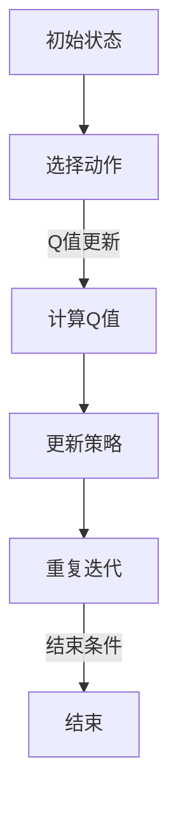
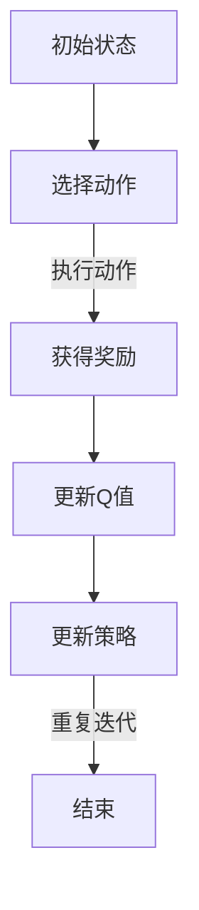
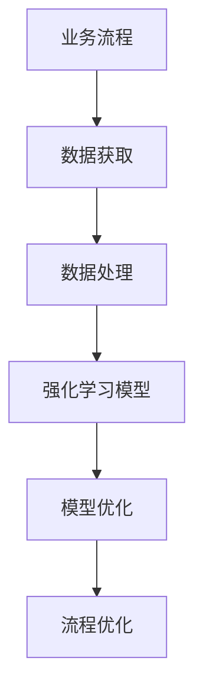
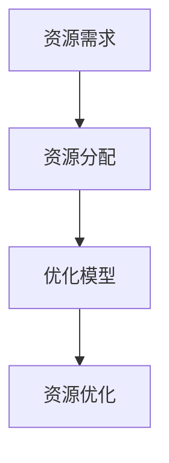
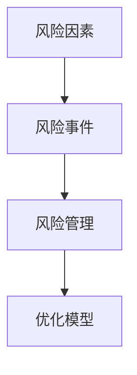

                 

# 企业级强化学习应用：优化复杂业务决策

> 关键词：强化学习、企业级应用、复杂业务决策、优化

> 摘要：本文将深入探讨强化学习在企业级业务决策中的应用，分析其面临的挑战和优势，并通过具体案例，详细讲解如何利用强化学习技术优化复杂业务流程、资源分配和风险管理。

---

## 第一部分：企业级强化学习应用概述

### 第1章：强化学习与企业级应用

#### 1.1 强化学习的背景与发展

##### 1.1.1 问题背景

随着人工智能技术的飞速发展，强化学习作为机器学习的重要分支，逐渐成为解决复杂决策问题的重要工具。强化学习起源于心理学和神经科学，通过模拟人类的学习过程，使机器能够在动态环境中进行自主学习和决策。

##### 1.1.1.1 强化学习的发展历程

强化学习最早由Richard Sutton和Andrew Barto在1980年代提出，随后在1990年代和2000年代经历了快速发展。近年来，随着深度学习和计算能力的提升，强化学习在工业界和学术界都取得了显著进展。

##### 1.1.1.2 强化学习的基本概念

强化学习通过智能体（agent）与环境的交互，不断调整策略，以实现最大化累积奖励的目标。核心概念包括动作（action）、状态（state）、奖励（reward）和价值函数（value function）。

##### 1.1.1.3 强化学习在企业级应用的重要性

强化学习在企业级应用中具有重要意义。它能够帮助企业应对复杂多变的市场环境，提高业务决策的效率和质量，实现资源的优化配置，降低风险。

#### 1.2 企业级应用的挑战

##### 1.2.1 复杂的业务环境

企业级应用面临的一个主要挑战是业务环境的复杂性。业务流程可能涉及多个部门、多个系统和多层次的决策，这使得强化学习模型的设计和实现变得更加困难。

##### 1.2.1.1 系统的复杂性

企业系统通常包含大量的子系统和组件，这些组件之间的交互和依赖关系复杂，对强化学习模型的可扩展性和鲁棒性提出了较高要求。

##### 1.2.1.2 数据的多样性与质量

企业级应用需要处理多种类型的数据，包括结构化和非结构化数据。此外，数据的质量也是强化学习成功的关键因素。数据的不完整性和噪声可能会对模型的性能产生负面影响。

##### 1.2.1.3 决策的时间敏感性

在许多企业场景中，决策需要在短时间内完成，这要求强化学习模型具备快速学习和响应的能力。

#### 1.3 强化学习在企业级应用的优势

##### 1.3.1 自适应与持续学习

强化学习模型能够根据环境的变化自适应地调整策略，实现持续学习。这对于应对动态变化的业务环境具有重要意义。

##### 1.3.1.1 强化学习的适应性

强化学习模型能够处理复杂的非线性问题，并能够适应不同的业务场景。

##### 1.3.1.2 强化学习的持续学习能力

通过不断与环境交互，强化学习模型能够不断优化决策策略，提高业务效率。

##### 1.3.2 高效的业务优化

强化学习可以帮助企业优化业务流程、资源分配和风险管理，从而提高整体运营效率。

##### 1.3.2.1 业务流程的优化

强化学习可以通过自动化和智能化手段，优化业务流程，减少人工干预，提高业务效率。

##### 1.3.2.2 资源分配的优化

强化学习可以帮助企业优化资源配置，实现资源的最优分配，降低运营成本。

##### 1.3.2.3 风险控制的优化

强化学习可以通过预测和评估风险，帮助企业制定更有效的风险控制策略。

### 第2章：强化学习的基本概念与原理

#### 2.1 强化学习的核心概念

##### 2.1.1 强化学习的基本要素

强化学习的基本要素包括动作、状态、奖励和价值函数。这些要素构成了强化学习的基础框架，使得智能体能够在动态环境中进行学习。

##### 2.1.1.1 动作、状态、奖励与价值函数

动作（action）：智能体在某个状态下可以选择的动作。

状态（state）：环境在某一时刻的状态。

奖励（reward）：智能体执行某一动作后获得的即时奖励。

价值函数（value function）：衡量智能体在某个状态下选择某一动作的长期效益。

##### 2.1.1.2 Q学习与值函数迭代

Q学习是一种基于值函数迭代的方法，通过更新Q值来优化策略。Q值表示在某个状态下执行某个动作的期望收益。

##### 2.1.1.3 策略迭代

策略迭代是通过不断迭代策略来优化决策的过程。策略迭代方法包括贪婪策略迭代和随机策略迭代。

#### 2.2 强化学习的基本算法

##### 2.2.1 Q-learning算法

Q-learning算法是一种值函数迭代方法，通过更新Q值来优化策略。其基本原理如下：

$$
\text{Q}(s, a) = \text{Q}(s, a) + \alpha [r + \gamma \max_{a'} \text{Q}(s', a') - \text{Q}(s, a)]
$$

其中，$\alpha$为学习率，$r$为即时奖励，$\gamma$为折扣因子。

##### 2.2.1.1 Q-learning算法的基本原理

Q-learning算法通过在某个状态下选择当前最优动作，并根据即时奖励和未来价值更新Q值，逐步优化策略。

##### 2.2.1.2 Q-learning算法的mermaid流程图



##### 2.2.1.3 Q-learning算法的Python实现

```python
import numpy as np

# 初始化Q值
Q = np.zeros([S, A])

# 学习参数
alpha = 0.1
gamma = 0.9

# 迭代次数
num_episodes = 1000

# 游戏环境
env = ...

for episode in range(num_episodes):
    # 初始化状态
    state = env.reset()
    
    # 游戏结束标志
    done = False
    
    while not done:
        # 预测动作
        action = np.argmax(Q[state])
        
        # 执行动作
        next_state, reward, done = env.step(action)
        
        # 更新Q值
        Q[state, action] = Q[state, action] + alpha * (reward + gamma * np.max(Q[next_state]) - Q[state, action])
        
        # 更新状态
        state = next_state
```

##### 2.2.2 SARSA算法

SARSA算法是一种基于策略迭代的方法，与Q-learning算法类似，但不同之处在于它使用实际执行的动作来更新Q值。

$$
\text{Q}(s, a) = \text{Q}(s, a) + \alpha [\text{r} + \gamma \text{Q}(s', a')]
$$

##### 2.2.2.1 SARSA算法的基本原理

SARSA算法通过在某个状态下选择当前最优动作，并根据即时奖励和未来Q值更新Q值，逐步优化策略。

##### 2.2.2.2 SARSA算法的mermaid流程图



##### 2.2.2.3 SARSA算法的Python实现

```python
import numpy as np

# 初始化Q值
Q = np.zeros([S, A])

# 学习参数
alpha = 0.1
gamma = 0.9

# 迭代次数
num_episodes = 1000

# 游戏环境
env = ...

for episode in range(num_episodes):
    # 初始化状态
    state = env.reset()
    
    # 游戏结束标志
    done = False
    
    while not done:
        # 预测动作
        action = np.argmax(Q[state])
        
        # 执行动作
        next_state, reward, done = env.step(action)
        
        # 更新Q值
        Q[state, action] = Q[state, action] + alpha * (reward + gamma * Q[next_state, action])
        
        # 更新状态
        state = next_state
```

---

## 第二部分：强化学习在企业级业务决策中的应用

### 第3章：强化学习在企业级业务决策中的应用

#### 3.1 强化学习在优化业务流程中的应用

##### 3.1.1 业务流程优化的挑战

业务流程优化是企业提高运营效率的重要手段。然而，企业级业务流程的优化面临着以下挑战：

##### 3.1.1.1 业务流程的复杂性

企业级业务流程通常涉及多个部门、多个系统和多个业务环节，这使得流程的优化变得更加复杂。

##### 3.1.1.2 数据的获取与处理

业务流程优化需要大量的数据支持，包括业务数据、运营数据等。然而，数据的质量和获取难度也成为了优化流程的挑战。

##### 3.1.1.3 模型的实时部署与更新

优化模型需要在实际业务环境中进行部署和更新，这对模型的实时性、可靠性和鲁棒性提出了高要求。

##### 3.1.2 强化学习在业务流程优化中的应用

强化学习可以应用于企业级业务流程的优化，通过自动化和智能化手段，实现流程的优化。

##### 3.1.2.1 业务流程优化的mermaid类图

```mermaid
classDiagram
    BusinessProcess <<class>>
    DataProcessing <<class>>
    OptimizationModel <<class>>
    BusinessProcess "uses" DataProcessing
    BusinessProcess "uses" OptimizationModel
```

##### 3.1.2.2 强化学习在业务流程优化中的mermaid架构图



#### 3.2 强化学习在资源分配中的应用

##### 3.2.1 资源分配的挑战

资源分配是企业运营中的一项重要任务，面临着以下挑战：

##### 3.2.1.1 资源的稀缺性

企业资源（如人力、资金、设备等）往往是有限的，如何合理分配资源以最大化效益是一个重要问题。

##### 3.2.1.2 资源的多样性

企业面临多种资源类型，如何根据业务需求合理配置不同类型的资源也是一个挑战。

##### 3.2.1.3 资源分配的动态性

企业运营环境不断变化，资源需求也在不断变化，如何实时调整资源分配策略也是一个挑战。

##### 3.2.2 强化学习在资源分配中的应用

强化学习可以通过模拟和优化资源分配过程，实现资源的优化配置。

##### 3.2.2.1 资源分配优化的mermaid类图

```mermaid
classDiagram
    Resource <<class>>
    ResourceAllocation <<class>>
    OptimizationModel <<class>>
    ResourceAllocation "uses" Resource
    ResourceAllocation "uses" OptimizationModel
```

##### 3.2.2.2 强化学习在资源分配优化中的mermaid架构图



#### 3.3 强化学习在风险管理中的应用

##### 3.3.1 风险管理的挑战

风险管理是企业运营中的一项重要任务，面临着以下挑战：

##### 3.3.1.1 风险因素的多样性

企业运营中可能面临多种风险因素，如市场风险、信用风险、运营风险等。

##### 3.3.1.2 风险事件的不可预测性

风险事件的发生往往具有不可预测性，这使得风险管理变得更加复杂。

##### 3.3.1.3 风险管理的实时性

风险事件需要实时监控和管理，以便及时采取应对措施。

##### 3.3.2 强化学习在风险管理中的应用

强化学习可以通过模拟和优化风险管理过程，实现风险的有效控制。

##### 3.3.2.1 风险管理优化的mermaid类图

```mermaid
classDiagram
    RiskFactor <<class>>
    RiskEvent <<class>>
    RiskManagement <<class>>
    RiskModel <<class>>
    RiskManagement "uses" RiskFactor
    RiskManagement "uses" RiskModel
    RiskManagement "responds to" RiskEvent
```

##### 3.3.2.2 强化学习在风险管理优化中的mermaid架构图



---

## 第三部分：企业级强化学习应用案例分析

### 第4章：企业级强化学习应用案例分析

#### 4.1 案例一：金融风控

##### 4.1.1 案例背景

金融风控是金融行业中的一个关键环节，涉及资金安全、信用评估、市场风险等多个方面。随着金融市场的复杂性和不确定性增加，传统的风险管理方法已经难以满足需求。

##### 4.1.1.1 金融风险管理的现状

当前，金融风险管理主要依赖于统计分析和规则匹配等方法，这些方法在面对复杂和动态的金融市场时存在一定的局限性。

##### 4.1.1.2 强化学习在金融风控中的应用

强化学习在金融风控中的应用主要包括以下几个方面：

1. **信用风险评估**：通过强化学习模型，对借款人的信用状况进行评估，提高风险评估的准确性。
2. **市场风险预测**：利用强化学习模型，对市场风险进行预测和评估，帮助金融机构制定相应的风险控制策略。
3. **交易策略优化**：通过强化学习模型，优化交易策略，提高交易收益。

##### 4.1.2 案例分析

在这个案例中，我们选择信用风险评估作为强化学习应用的主要场景。

##### 4.1.2.1 业务流程与数据流程

1. **业务流程**：
   - 数据收集：收集借款人的个人信息、财务状况、信用记录等数据。
   - 数据处理：对收集的数据进行清洗、预处理和特征提取。
   - 模型训练：利用预处理后的数据训练强化学习模型。
   - 风险评估：利用训练好的模型对新的借款人进行风险评估。
   - 决策：根据风险评估结果，决定是否批准借款人的贷款申请。

2. **数据流程**：
   - 数据源：借款人个人信息、财务状况、信用记录等。
   - 数据预处理：数据清洗、数据标准化、特征提取等。
   - 模型输入：预处理后的特征数据。
   - 模型输出：风险评估结果。

##### 4.1.2.2 强化学习算法的选择与实现

在这个案例中，我们选择Q-learning算法作为信用风险评估的模型。

1. **Q-learning算法的基本原理**：
   - Q-learning算法通过更新Q值来优化策略，Q值表示在某个状态下执行某个动作的期望收益。
   - Q-learning算法的基本公式为：
     $$
     \text{Q}(s, a) = \text{Q}(s, a) + \alpha [r + \gamma \max_{a'} \text{Q}(s', a') - \text{Q}(s, a)]
     $$

2. **Q-learning算法的实现**：

```python
import numpy as np

# 初始化Q值
Q = np.zeros([S, A])

# 学习参数
alpha = 0.1
gamma = 0.9

# 迭代次数
num_episodes = 1000

# 游戏环境
env = ...

for episode in range(num_episodes):
    # 初始化状态
    state = env.reset()
    
    # 游戏结束标志
    done = False
    
    while not done:
        # 预测动作
        action = np.argmax(Q[state])
        
        # 执行动作
        next_state, reward, done = env.step(action)
        
        # 更新Q值
        Q[state, action] = Q[state, action] + alpha * (reward + gamma * np.max(Q[next_state]) - Q[state, action])
        
        # 更新状态
        state = next_state
```

##### 4.1.2.3 应用效果与评价

通过强化学习模型，金融机构能够更准确地评估借款人的信用风险，提高贷款审批的准确性。同时，强化学习模型能够根据借款人的实时数据，动态调整风险评估策略，提高模型的适应性。

然而，强化学习模型在金融风控中的应用也存在一定的挑战，如数据的质量和多样性、模型的可解释性等。这些问题需要在实践中不断探索和解决。

---

## 总结与展望

本文深入探讨了强化学习在企业级业务决策中的应用，分析了其在复杂业务环境中的挑战和优势，并通过具体案例展示了强化学习在业务流程优化、资源分配和风险管理中的应用。强化学习作为一种具有自适应性和持续学习能力的人工智能技术，为企业级业务决策提供了新的思路和工具。

未来，随着人工智能技术的进一步发展，强化学习在企业级应用中的潜力将不断释放。我们需要关注以下几个方面：

1. **数据质量与多样性**：提高数据质量，丰富数据类型，为强化学习模型提供更丰富的训练数据。
2. **模型可解释性**：增强模型的可解释性，提高模型的透明度和可信度。
3. **实时性**：优化模型算法，提高模型在实时环境下的响应速度和鲁棒性。
4. **跨领域应用**：探索强化学习在更多行业和领域的应用，如医疗、制造、能源等。

通过不断探索和实践，强化学习将在企业级业务决策中发挥更大的作用，为企业创造更大的价值。

---

## 作者信息

作者：AI天才研究院/AI Genius Institute & 禅与计算机程序设计艺术 /Zen And The Art of Computer Programming

---

## 拓展阅读

1. Sutton, R. S., & Barto, A. G. (2018). ** reinforcement Learning: An Introduction** (Second Edition). MIT Press.
2. Mnih, V., Kavukcuoglu, K., Silver, D., et al. (2013). **Reinforcement Learning and Control with Deep Neural Networks**. *arXiv preprint arXiv:1509.02971*.
3. Sutton, R. S., & Barto, A. G. (1998). **Reinforcement Learning: An Introduction**. MIT Press.
4. Boubakri, L., El-Khatib, A., & Ouelhadj, D. (2015). **Q-Learning in Real-Time Systems: A Survey**. *Journal of Real-Time Systems*, 51(1), 3-41.
5. Riedmiller, M. A., & Furht, M. (2017). **Practical Methods for Direct Reinforcement Learning**. *IEEE Transactions on Systems, Man, and Cybernetics: Systems*, 47(2), 208-223.

