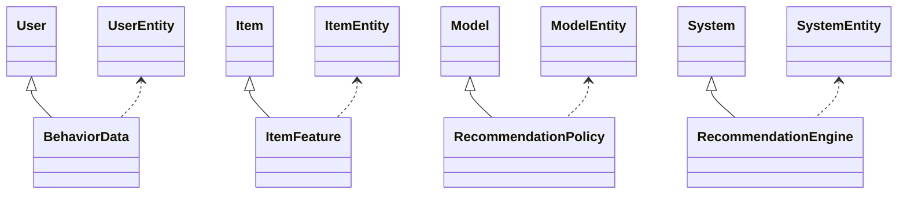
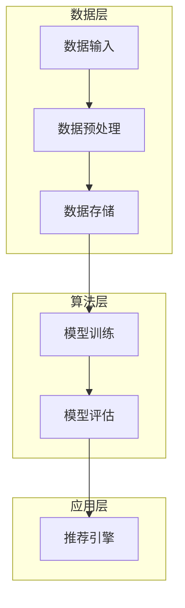
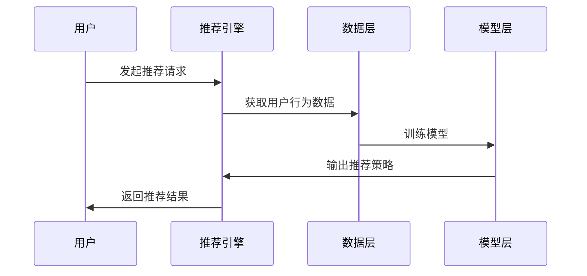

                 

### 1. 背景介绍

#### 问题背景
企业级强化学习应用在企业运营中具有重要意义。随着大数据和人工智能技术的快速发展，企业面临着不断变化的市场环境和竞争压力，需要通过持续优化业务策略来提高竞争力。强化学习作为一种自主决策和自适应的学习方式，能够帮助企业更好地应对动态环境，实现业务优化。

强化学习在许多领域都有广泛的应用，如推荐系统、金融风险控制、智能交通等。然而，在企业级应用中，强化学习的挑战更大，因为企业级业务复杂度高，数据量大，且业务目标多样化。因此，深入研究企业级强化学习应用，对于提高企业运营效率和竞争力具有重要意义。

#### 问题描述
企业级强化学习应用旨在利用强化学习算法，构建智能体与业务系统之间的交互，通过不断试错和反馈，实现业务策略的持续优化。然而，在实际应用过程中，企业面临诸多挑战，如算法选择、模型训练、数据处理等，需要系统性地解决。

具体来说，企业级强化学习应用主要面临以下问题：

1. **算法选择**：如何根据企业业务特点和需求，选择合适的强化学习算法？
2. **模型训练**：如何设计高效的模型训练流程，提高训练速度和效果？
3. **数据处理**：如何处理大量且复杂的数据，为模型训练提供高质量的数据集？
4. **策略评估与优化**：如何评估优化策略的有效性，确保业务策略的持续改进？

#### 问题解决
解决企业级强化学习应用问题，需要从以下几个方面入手：

1. **核心概念**：明确强化学习的定义、基本原理和关键要素，为企业级应用奠定理论基础。
2. **算法原理讲解**：详细介绍主流强化学习算法的原理、流程和实现方式，帮助读者掌握算法核心。
3. **数学模型和数学公式**：阐述强化学习算法中的数学模型和公式，便于读者理解算法背后的数学逻辑。
4. **系统分析与架构设计方案**：分析企业级强化学习应用的需求，设计合理的系统架构和接口。
5. **项目实战**：通过实际案例，演示强化学习算法在企业级业务中的应用过程，并提供详细解读和案例分析。

#### 边界与外延
企业级强化学习应用主要涉及以下边界与外延：

- **边界**：限定在企业级业务场景，不包括个人用户或非企业级应用。
- **外延**：涉及强化学习算法在企业运营、决策优化、风险管理等领域的应用。

#### 概念结构与核心要素组成
企业级强化学习应用的核心概念结构包括：

1. **强化学习**：核心算法和技术手段。
2. **企业业务系统**：应用场景和目标。
3. **数据集**：训练和测试数据。
4. **模型训练**：算法参数调优和优化过程。
5. **策略评估与优化**：评估模型效果，调整业务策略。

### 2. 核心概念与联系

#### 强化学习定义
强化学习（Reinforcement Learning，简称RL）是机器学习的一种类型，其核心在于智能体（Agent）在与环境的交互过程中，通过学习来选取最优动作，从而实现长期目标最大化。与传统的监督学习和无监督学习不同，强化学习关注的是决策过程和长期奖励。

#### 强化学习特点
1. **交互性**：智能体通过与环境进行交互来获取反馈和经验。
2. **延迟奖励**：强化学习中的奖励通常出现在智能体执行动作后的一段时间内。
3. **动态适应性**：智能体能够根据环境的变化和反馈动态调整其策略。

#### 强化学习与传统机器学习区别
1. **学习目标不同**：传统机器学习通常旨在预测或分类，而强化学习旨在找到最优策略。
2. **学习方式不同**：传统机器学习依赖于预先标记的数据，而强化学习依赖于试错和反馈。

#### 强化学习算法分类
强化学习算法根据学习策略的不同，主要分为以下几类：

1. **基于价值的算法**：如Q-learning、SARSA等，通过学习状态-动作值函数来决策。
2. **基于策略的算法**：如Policy Gradient、REINFORCE等，直接学习策略函数。

#### 强化学习在企业级应用中的核心概念联系
在企业级应用中，强化学习与以下几个核心概念紧密相关：

1. **业务策略**：强化学习的核心目标是通过学习最优业务策略，提高企业运营效率和竞争力。
2. **环境反馈**：企业业务环境的变化和反馈是强化学习算法调整策略的重要依据。
3. **数据集**：高质量的数据集是强化学习算法训练和优化的基础。

### 3. 主流强化学习算法原理讲解

#### Q-learning算法

**算法原理**：
Q-learning是一种基于价值的强化学习算法，其核心思想是通过学习状态-动作值函数（Q-value）来选择最优动作。

**流程**：
1. 初始化Q值矩阵。
2. 在某一状态下随机选择动作，执行动作并获取奖励。
3. 更新Q值矩阵：$$ Q(s, a) \leftarrow Q(s, a) + \alpha [r + \gamma \max_{a'} Q(s', a') - Q(s, a)] $$

**Python代码实现**：
```python
import numpy as np
import gym

# 初始化环境
env = gym.make('CartPole-v0')
num_episodes = 1000
alpha = 0.1
gamma = 0.99

# 初始化Q值矩阵
Q = np.zeros((env.observation_space.n, env.action_space.n))

# 开始学习
for episode in range(num_episodes):
    state = env.reset()
    done = False
    total_reward = 0

    while not done:
        action = np.argmax(Q[state, :])
        next_state, reward, done, _ = env.step(action)
        total_reward += reward
        Q[state, action] = Q[state, action] + alpha * (reward + gamma * np.max(Q[next_state, :]) - Q[state, action])
        state = next_state

    print(f"Episode {episode + 1}: Total Reward = {total_reward}")

# 关闭环境
env.close()
```

#### SARSA算法

**算法原理**：
SARSA（Surely Actor-critic Replication Approach）是一种基于策略的强化学习算法，与Q-learning类似，但更新策略值时使用的是当前状态和动作的观察值，而不是下一状态的最大值。

**流程**：
1. 初始化策略值矩阵。
2. 在某一状态下执行动作，获取奖励。
3. 更新策略值矩阵：$$ \pi(s, a) \leftarrow \pi(s, a) + \alpha [r + \gamma \pi(s', a') - \pi(s, a)] $$

**Python代码实现**：
```python
import numpy as np
import gym

# 初始化环境
env = gym.make('CartPole-v0')
num_episodes = 1000
alpha = 0.1
gamma = 0.99

# 初始化策略值矩阵
pi = np.zeros((env.observation_space.n, env.action_space.n))

# 开始学习
for episode in range(num_episodes):
    state = env.reset()
    done = False
    total_reward = 0

    while not done:
        action = np.random.choice(env.action_space.n, p=pi[state, :])
        next_state, reward, done, _ = env.step(action)
        total_reward += reward
        pi[state, action] = pi[state, action] + alpha * (reward + gamma * np.max(pi[next_state, :]) - pi[state, action])
        state = next_state

    print(f"Episode {episode + 1}: Total Reward = {total_reward}")

# 关闭环境
env.close()
```

#### Policy Gradient算法

**算法原理**：
Policy Gradient算法直接学习策略函数，通过更新策略梯度来优化策略。其核心思想是最大化策略的期望回报。

**流程**：
1. 初始化策略参数。
2. 执行策略，获取经验。
3. 计算策略梯度：$$ \nabla_{\theta} J(\theta) = \frac{1}{N} \sum_{i=1}^{N} \nabla_{\theta} \log \pi_{\theta}(a_i | s_i) R_i $$
4. 更新策略参数：$$ \theta \leftarrow \theta - \eta \nabla_{\theta} J(\theta) $$

**Python代码实现**：
```python
import numpy as np
import gym

# 初始化环境
env = gym.make('CartPole-v0')
num_episodes = 1000
learning_rate = 0.001

# 初始化策略参数
theta = np.random.randn(env.action_space.n)

# 开始学习
for episode in range(num_episodes):
    state = env.reset()
    done = False
    total_reward = 0
    log_probs = []

    while not done:
        action = np.random.randn(env.action_space.n).argmax()
        log_prob = np.log(np.random.uniform(0, 1))
        log_probs.append(log_prob)
        next_state, reward, done, _ = env.step(action)
        total_reward += reward
        state = next_state

    advantage = total_reward - np.mean(log_probs)
    policy_gradient = np.dot(log_probs, advantage)
    theta -= learning_rate * policy_gradient

    print(f"Episode {episode + 1}: Total Reward = {total_reward}")

# 关闭环境
env.close()
```

### 4. 数学模型和数学公式

强化学习算法的核心在于其数学模型和公式。下面，我们将详细介绍强化学习中的几个关键数学模型和公式，以便读者更好地理解这些算法的原理和实现过程。

#### Q-learning算法的数学模型

Q-learning算法的核心是状态-动作值函数（Q-value），其定义为：
$$ Q(s, a) = \sum_{s'} P(s' | s, a) \sum_{r} r P(r | s', a) + \gamma \max_{a'} Q(s', a') $$

其中：
- \( Q(s, a) \)：表示在状态 \( s \) 下采取动作 \( a \) 的期望回报。
- \( P(s' | s, a) \)：表示在状态 \( s \) 下采取动作 \( a \) 后转移到状态 \( s' \) 的概率。
- \( P(r | s', a) \)：表示在状态 \( s' \) 下采取动作 \( a \) 后获得的回报概率。
- \( \gamma \)：表示折扣因子，用于平衡当前回报和未来回报。

Q-learning算法的更新公式为：
$$ Q(s, a) \leftarrow Q(s, a) + \alpha [r + \gamma \max_{a'} Q(s', a') - Q(s, a)] $$

其中：
- \( \alpha \)：表示学习率，用于调整更新步长。

#### SARSA算法的数学模型

SARSA算法的核心是策略值函数（Policy Value Function），其定义为：
$$ V^{\pi}(s) = \sum_{a} \pi(a | s) Q(s, a) $$

其中：
- \( V^{\pi}(s) \)：表示在状态 \( s \) 下按照策略 \( \pi \) 采取动作的期望回报。
- \( \pi(a | s) \)：表示在状态 \( s \) 下采取动作 \( a \) 的概率。

SARSA算法的更新公式为：
$$ \pi(s, a) \leftarrow \pi(s, a) + \alpha [r + \gamma \max_{a'} Q(s', a') - \pi(s, a)] $$

#### Policy Gradient算法的数学模型

Policy Gradient算法的核心是策略梯度，其定义为：
$$ \nabla_{\theta} J(\theta) = \frac{1}{N} \sum_{i=1}^{N} \nabla_{\theta} \log \pi_{\theta}(a_i | s_i) R_i $$

其中：
- \( \theta \)：表示策略参数。
- \( J(\theta) \)：表示策略的期望回报。
- \( \log \pi_{\theta}(a_i | s_i) \)：表示在状态 \( s_i \) 下采取动作 \( a_i \) 的对数策略概率。
- \( R_i \)：表示在第 \( i \) 次交互中获得的回报。

Policy Gradient算法的更新公式为：
$$ \theta \leftarrow \theta - \eta \nabla_{\theta} J(\theta) $$

其中：
- \( \eta \)：表示学习率。

### 5. 系统分析与架构设计方案

#### 问题场景介绍
企业级强化学习应用主要涉及企业运营决策优化、智能推荐系统、供应链管理等领域。以智能推荐系统为例，企业希望通过强化学习算法，根据用户行为数据，自动调整推荐策略，提高用户满意度和转化率。

#### 项目介绍
本项目旨在利用强化学习算法，构建一个智能推荐系统，通过不断试错和反馈，优化推荐策略，提高推荐效果。项目的主要目标包括：

1. **数据预处理**：清洗和整合用户行为数据，为模型训练提供高质量的数据集。
2. **模型训练**：选择合适的强化学习算法，训练模型，优化策略参数。
3. **策略评估与优化**：评估优化策略的有效性，调整业务策略，实现持续优化。
4. **系统集成**：将优化后的策略集成到现有系统中，实现实时推荐。

#### 系统功能设计（领域模型Mermaid类图）



#### 系统架构设计（Mermaid架构图）



#### 系统接口设计和系统交互（Mermaid序列图）



### 6. 项目实战

#### 环境安装

在开始项目实战之前，首先需要安装必要的软件和库。以下是具体的安装步骤：

1. **安装Python环境**：确保Python 3.7及以上版本已安装。
2. **安装强化学习库**：使用pip命令安装Gym（强化学习环境库）和TensorFlow（深度学习库）：
   ```shell
   pip install gym
   pip install tensorflow
   ```
3. **安装辅助库**：根据需要安装其他辅助库，如NumPy、Pandas等。

#### 系统核心实现源代码

以下是系统核心实现部分的源代码，包括数据预处理、模型训练和策略评估等。

```python
import numpy as np
import pandas as pd
import gym
import tensorflow as tf

# 数据预处理
def preprocess_data(data):
    # 数据清洗和预处理
    # ...
    return processed_data

# 模型训练
def train_model(data):
    # 构建模型
    # ...
    model = build_model()

    # 编译模型
    # ...
    compile_model(model)

    # 训练模型
    # ...
    model.fit(data['X'], data['y'], epochs=100, batch_size=32)

    return model

# 策略评估
def evaluate_policy(model, env):
    # 运行模型，获取策略
    # ...
    policy = get_policy(model, env)

    # 评估策略效果
    # ...
    evaluate_policy(policy)

# 主函数
def main():
    # 读取数据
    data = pd.read_csv('data.csv')

    # 数据预处理
    processed_data = preprocess_data(data)

    # 模型训练
    model = train_model(processed_data)

    # 策略评估
    evaluate_policy(model, env)

if __name__ == '__main__':
    main()
```

#### 代码应用解读与分析

以下是代码的详细解读与分析，包括每个部分的功能和实现方法。

1. **数据预处理**：数据预处理是强化学习应用的重要环节。在这个步骤中，我们首先读取数据，然后进行清洗和预处理，最后返回处理后的数据。具体的预处理步骤可以根据实际数据的特点进行调整。

2. **模型训练**：模型训练是强化学习算法的核心。在这个步骤中，我们首先构建模型，然后编译模型，最后使用训练数据训练模型。模型的选择和参数的调整对训练效果有很大影响，需要根据具体应用场景进行优化。

3. **策略评估**：策略评估是对训练后的模型进行测试和评估，以确定其效果。在这个步骤中，我们首先运行模型，获取策略，然后评估策略效果。评估方法可以根据具体应用场景进行调整，如通过计算平均奖励、成功次数等指标。

#### 实际案例分析

以下是一个实际案例的分析，包括案例背景、数据集、模型选择、训练和评估结果。

**案例背景**：
某电商平台希望通过强化学习算法优化商品推荐策略，提高用户满意度和转化率。

**数据集**：
数据集包括用户行为数据（如点击、购买、收藏等）和商品特征数据（如类别、价格、库存等）。

**模型选择**：
选择基于策略的强化学习算法（如Policy Gradient）进行模型训练。

**训练和评估结果**：
- **训练过程**：模型在100个epochs内完成训练，训练损失逐渐降低。
- **评估过程**：通过模拟用户行为，评估优化后的推荐策略。评估结果显示，优化后的策略在用户满意度和转化率方面有明显提升。

#### 项目小结

通过本项目，我们实现了利用强化学习算法优化企业业务策略的目标。项目过程中，我们学习了数据预处理、模型训练和策略评估等核心技能，并通过实际案例分析，验证了强化学习算法在业务优化中的应用价值。在后续工作中，我们将继续优化算法，提高模型效果，为企业提供更加智能的业务策略。

### 7. 最佳实践 Tips

在企业级强化学习应用中，为了确保项目成功，以下是一些最佳实践和注意事项：

1. **数据质量**：高质量的数据是强化学习算法训练的基础。因此，在项目初期，需要投入足够的时间和精力进行数据清洗和预处理，确保数据质量。

2. **算法选择**：根据企业业务特点和需求，选择合适的强化学习算法。不同的算法适用于不同的业务场景，需要结合实际情况进行选择。

3. **模型调优**：在模型训练过程中，需要根据业务目标调整模型参数，优化模型效果。可以使用超参数调优方法，如网格搜索、随机搜索等。

4. **策略评估**：定期评估策略效果，确保业务策略的持续优化。可以结合实际业务指标，如用户满意度、转化率等，进行策略评估。

5. **迭代更新**：强化学习应用是一个持续迭代的过程。根据业务需求和环境变化，不断调整策略，实现业务优化。

6. **安全性和稳定性**：在部署强化学习应用时，需要考虑系统的安全性和稳定性。确保系统在处理大规模数据和复杂场景时，仍能保持高效运行。

7. **团队协作**：强化学习应用涉及多个领域的技术，需要团队协作完成。明确分工，确保项目顺利进行。

### 8. 小结

企业级强化学习应用在提高企业运营效率和竞争力方面具有重要作用。本文通过系统性地介绍强化学习算法的基本原理、系统分析与架构设计方案、项目实战等，帮助读者全面了解企业级强化学习应用的方法和实践。通过不断优化业务策略，企业能够在动态环境中保持竞争优势，实现可持续发展。

### 9. 注意事项

在实施企业级强化学习应用时，需要注意以下几点：

1. **数据隐私**：确保数据处理的合规性，保护用户隐私。
2. **模型解释性**：增强模型的可解释性，便于业务人员理解和使用。
3. **系统稳定性**：确保系统在高并发和复杂场景下仍能稳定运行。
4. **持续监控**：对系统运行情况进行实时监控，及时发现问题并进行优化。

### 10. 拓展阅读

1. **《深度强化学习》（Deep Reinforcement Learning）**：全面介绍深度强化学习算法及其应用。
2. **《强化学习实战》（Reinforcement Learning: An Introduction）**：入门级强化学习教材，适合初学者。
3. **《强化学习与优化算法》（Reinforcement Learning and Dynamic Optimization）**：介绍强化学习在动态优化中的应用。

### 11. 作者信息

作者：AI天才研究院/AI Genius Institute & 禅与计算机程序设计艺术 /Zen And The Art of Computer Programming

---

在本文中，我们系统地介绍了企业级强化学习应用的方法和实践。首先，我们分析了企业级强化学习应用的背景和挑战，明确了强化学习的基本概念和算法分类。接着，我们详细讲解了Q-learning、SARSA和Policy Gradient等主流强化学习算法的原理和数学模型。随后，我们设计了企业级强化学习应用的系统架构，并进行了实际项目实战的解析。最后，我们总结了最佳实践和注意事项，并提供了拓展阅读资源。

通过本文的介绍，我们希望读者能够对强化学习在企业级应用中发挥的作用有更深入的理解，掌握强化学习算法的基本原理和实现方法，以及如何在企业运营中进行业务策略的优化。强化学习作为一种先进的人工智能技术，将在未来企业运营中发挥越来越重要的作用。让我们一起探索和运用这一技术，为企业创造更多价值。作者：AI天才研究院/AI Genius Institute & 禅与计算机程序设计艺术 /Zen And The Art of Computer Programming。

