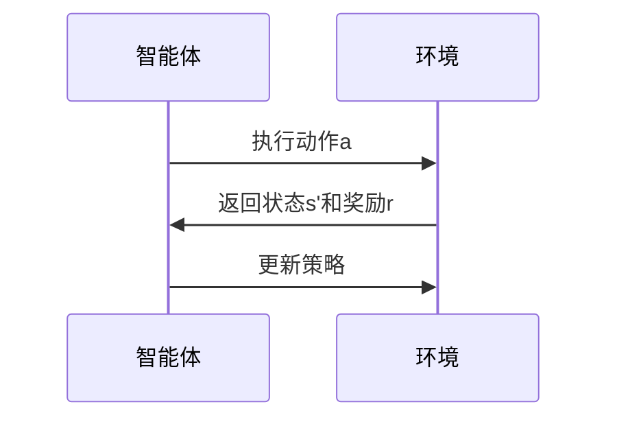

                 


### 文章标题：企业级强化学习应用：持续优化复杂业务流程

#### 关键词：强化学习，企业级，业务流程优化，复杂系统，人工智能

> 摘要：本文深入探讨企业级强化学习在复杂业务流程优化中的应用。首先，我们将介绍强化学习的基本概念、核心原理和算法，随后分析其在企业级应用中的优势与挑战。文章将通过具体案例，阐述强化学习在业务流程优化中的实际应用，并提供一些建议和注意事项。

---

### 第一部分：强化学习基础

#### 第1章：强化学习概述

##### 1.1 问题背景

强化学习是机器学习领域的一个重要分支，它通过智能体与环境的交互来学习最优策略。在企业级应用中，强化学习因其能够处理复杂动态环境，提高业务流程的效率与准确性，而备受关注。

##### 1.2 问题描述

在复杂业务流程中，如何实现持续优化是一个长期挑战。传统的优化方法往往依赖于固定的规则和模型，而无法适应环境变化。强化学习通过试错和反馈机制，能够逐步调整策略，实现自我优化。

##### 1.3 问题解决

强化学习通过智能体（Agent）和环境（Environment）的互动，不断调整行为策略，以最大化累积奖励。其核心在于奖励机制的设定和策略的学习。

##### 1.4 强化学习的基本原理

强化学习主要包含三个核心元素：状态（State）、动作（Action）、奖励（Reward）。智能体在特定状态下采取动作，根据动作的结果获取奖励，并通过经验调整策略。

##### 1.5 强化学习的边界与外延

强化学习的应用范围广泛，包括但不限于推荐系统、游戏AI、自动驾驶等。在企业级应用中，强化学习可以用于生产调度、物流优化、金融投资等领域。

---

#### 第2章：强化学习中的核心概念与联系

##### 2.1 核心概念

强化学习中的核心概念包括策略（Policy）、值函数（Value Function）、模型（Model）。它们共同构成了强化学习的理论基础。

##### 2.1.1 强化学习的基本要素

- **状态（State）**：智能体所处环境的描述。
- **动作（Action）**：智能体在状态下的可选行为。
- **奖励（Reward）**：动作结果对智能体的奖励或惩罚。

##### 2.1.2 策略、值函数与模型

- **策略（Policy）**：智能体在状态s下采取的动作a的概率分布。
- **值函数（Value Function）**：描述智能体在状态s下执行最优策略的预期回报。
- **模型（Model）**：环境状态转移和奖励的预测模型。

##### 2.2 概念属性特征对比表格

| 概念       | 属性特征                                       |
|------------|------------------------------------------------|
| 状态       | 描述环境状态                                   |
| 动作       | 智能体的可选行为                               |
| 奖励       | 行动结果对智能体的奖励或惩罚                   |
| 策略       | 动作概率分布                                   |
| 值函数     | 预期回报                                     |
| 模型       | 状态转移和奖励预测                             |

##### 2.3 ER实体关系图架构

使用Mermaid绘制ER图，展示强化学习中的实体关系。

```mermaid
erDiagram
  State ||--|{ Action }|| Reward
  Action ||--|{ State }|| Reward
  Policy ||--|{ State }|| ValueFunction
  Model ||--|{ State }|| ValueFunction
```

---

#### 第3章：强化学习算法原理讲解

##### 3.1 算法mermaid流程图

使用Mermaid绘制强化学习算法的基本流程。



##### 3.2 Python源代码讲解

以下是一个简单的Q-Learning算法的Python实现。

```python
import numpy as np

# 初始化Q值表
Q = np.zeros((状态数，动作数))

# 学习参数
alpha = 0.1  # 学习率
gamma = 0.6  # 折扣因子

# Q-Learning算法
for episode in range(1000):
    state = env.reset()
    done = False
    
    while not done:
        action = np.argmax(Q[state])
        next_state, reward, done, _ = env.step(action)
        
        # 更新Q值
        Q[state][action] = Q[state][action] + alpha * (reward + gamma * np.max(Q[next_state]) - Q[state][action])
        
        state = next_state
```

##### 3.3 算法原理的数学模型和公式

强化学习算法的数学模型主要包括Q-Learning和SARS

