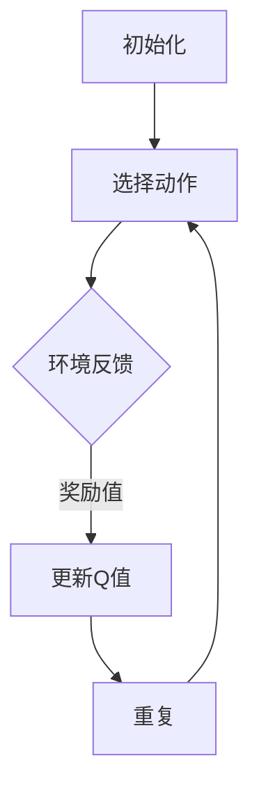
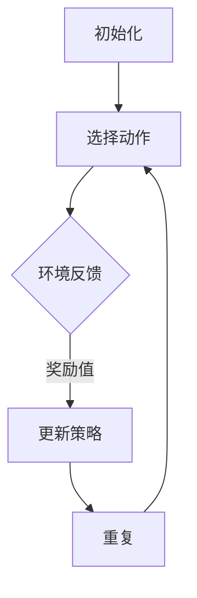

                 

## 第1章：问题背景与核心概念

### 1.1 问题描述

**1.1.1 企业级决策的挑战**

在当今商业环境中，企业需要不断作出快速且准确的决策，以保持竞争力。然而，企业级决策面临诸多挑战，如数据复杂性、决策环境的动态变化以及决策影响的长期性。

**1.1.2 长期决策的重要性**

长期决策对于企业的发展至关重要。例如，投资决策、供应链优化、市场策略等都需要考虑长远影响。然而，传统的决策方法往往注重短期利益，难以实现长期价值最大化。

**1.1.3 传统决策方法局限性**

传统决策方法如统计分析、线性规划等在处理静态问题时有很好的效果，但在面对动态、复杂的决策环境时显得力不从心。例如，在市场策略选择、资源分配、风险管理等方面，传统方法难以应对环境变化和不确定性。

### 1.2 强化学习的定义与特点

**1.2.1 强化学习的定义**

强化学习（Reinforcement Learning，RL）是一种机器学习范式，通过与环境的交互来学习最优策略。在强化学习中，智能体（agent）通过观察环境状态（state）、选择行动（action）并接收奖励（reward）来不断优化其行为。

**1.2.2 强化学习的基本概念**

- **状态（State）**：描述环境的当前情况。
- **动作（Action）**：智能体可采取的行动。
- **奖励（Reward）**：智能体执行动作后获得的奖励，用于评价动作的好坏。
- **策略（Policy）**：智能体在特定状态下选择动作的策略。

**1.2.3 强化学习与传统机器学习区别**

传统机器学习主要依赖于大量标记数据进行训练，强调模型在训练数据集上的性能。而强化学习则侧重于通过智能体与环境交互来不断优化策略，更关注长期回报。

### 1.3 企业级强化学习框架需求

**1.3.1 系统性能要求**

企业级强化学习框架需要具备高计算性能，能够快速处理大规模数据和复杂决策问题。

**1.3.2 实时性与可扩展性**

框架需要支持实时决策，同时具备良好的可扩展性，能够适应不同规模和复杂程度的企业级应用。

**1.3.3 安全性与隐私保护**

在涉及敏感数据和企业机密的情况下，框架需要确保数据的安全性和隐私性。

### 1.4 强化学习在企业的应用前景

**1.4.1 企业级应用案例**

强化学习在金融、制造、能源等行业已有广泛应用，如风险控制、生产调度、能源管理。

**1.4.2 强化学习在供应链优化中的应用**

强化学习可以帮助企业优化供应链管理，提高库存效率、降低成本。

**1.4.3 强化学习在能源管理中的应用**

通过强化学习，企业可以实现智能能源调度，提高能源利用效率。

### 1.5 本章小结

本章介绍了企业级决策的挑战、强化学习的定义与特点以及企业级强化学习框架的需求。下一章将深入探讨强化学习的基本概念和算法原理。

----------------------------------------------------------------

## 第2章：核心概念原理与联系

### 2.1 强化学习基本概念

**2.1.1 域与状态**

在强化学习中，**域（Domain）**是指智能体可以存在的所有状态的集合。每个状态（**State**）描述了环境的当前情况，可以是离散的或连续的。

**2.1.2 动作与奖励**

**动作（Action）**是指智能体可以在特定状态下执行的操作。动作的集合称为**动作空间（Action Space）**。奖励（**Reward**）是智能体在执行动作后获得的即时反馈，用于评估动作的好坏。

**2.1.3 策略与价值函数**

**策略（Policy）**是智能体在给定状态下选择动作的方式。一个优化的策略能够最大化长期回报。

价值函数（**Value Function**）用于评估状态的好坏，分为状态值函数（**State-Value Function**）和动作值函数（**Action-Value Function**）。状态值函数表示在特定状态下执行最佳动作所能获得的回报，动作值函数表示在特定状态下执行特定动作所能获得的回报。

### 2.2 强化学习算法原理

**2.2.1 Q-Learning算法**

Q-Learning是一种基于值函数的强化学习算法。它通过不断更新动作值函数来学习最优策略。Q-Learning的核心公式为：
$$
Q(s, a) = Q(s, a) + \alpha [r(s', a') + \gamma \max_{a'} Q(s', a') - Q(s, a)]
$$
其中，$\alpha$ 是学习率，$\gamma$ 是折扣因子，$r(s', a')$ 是在状态$s'$执行动作$a'$后获得的奖励。

**2.2.2 SARSA算法**

SARSA（同步自适应 reimbursements with self-adaptive reward）算法是一种基于策略的强化学习算法。它与Q-Learning类似，但在每次更新时同时考虑了当前状态和动作的奖励：
$$
Q(s, a) = Q(s, a) + \alpha [r(s', a') + \gamma Q(s', a')]
$$
SARSA算法不需要像Q-Learning那样计算最大动作值，因此计算成本较低。

**2.2.3 Policy Gradients算法**

Policy Gradients算法是一种基于策略的强化学习算法，通过优化策略的概率分布来最大化长期回报。其核心公式为：
$$
\nabla_\theta \log \pi_\theta(a|s) = \nabla_\theta J(\theta)
$$
其中，$\theta$ 是策略参数，$\pi_\theta(a|s)$ 是策略的概率分布。

### 2.3 强化学习算法对比与分析

**2.3.1 算法性能对比**

Q-Learning和SARSA算法在收敛速度上相对较慢，但能够保证收敛到最优策略。Policy Gradients算法在收敛速度上更快，但存在不稳定和发散的风险。

**2.3.2 算法适用场景分析**

Q-Learning适用于稳定、确定的环境，SARSA适用于动态、不确定的环境，Policy Gradients适用于高维状态和动作空间。

**2.3.3 算法发展趋势**

未来强化学习算法的发展将更加注重算法的稳定性和收敛速度，同时探索更多适用于企业级应用的特殊场景。

### 2.4 强化学习与深度学习的结合

**2.4.1 DQN算法**

DQN（Deep Q-Network）算法是将深度神经网络与Q-Learning结合的一种方法。它通过神经网络来近似动作值函数，提高了算法的收敛速度。

**2.4.2 A3C算法**

A3C（Asynchronous Advantage Actor-Critic）算法是一种基于策略的强化学习算法，通过异步并行更新来提高训练效率。

**2.4.3 TD3算法**

TD3（Temporal Difference with Double Learning）算法是在DQN算法基础上引入了双学习机制，提高了算法的稳定性和收敛速度。

### 2.5 强化学习在企业的实际应用

**2.5.1 强化学习在生产线优化中的应用**

强化学习可以帮助企业优化生产线调度，提高生产效率。

**2.5.2 强化学习在库存管理中的应用**

通过强化学习，企业可以实现智能库存管理，降低库存成本。

**2.5.3 强化学习在物流调度中的应用**

强化学习可以帮助企业优化物流调度，提高运输效率。

### 2.6 本章小结

本章介绍了强化学习的基本概念、算法原理及其在企业的实际应用。下一章将深入讲解强化学习算法的原理和实现。

----------------------------------------------------------------

## 第3章：算法原理讲解

### 3.1 Q-Learning算法原理

**3.1.1 Q-Learning算法概述**

Q-Learning算法是一种基于值函数的强化学习算法，其目标是通过不断更新动作值函数来学习最优策略。Q-Learning算法的核心思想是：在给定状态下，选择能够获得最大回报的动作。

**3.1.2 Q-Learning算法数学模型**

Q-Learning算法的核心公式如下：
$$
Q(s, a) = Q(s, a) + \alpha [r(s', a') + \gamma \max_{a'} Q(s', a') - Q(s, a)]
$$
其中：
- $Q(s, a)$ 是在状态$s$下执行动作$a$的期望回报。
- $r(s', a')$ 是在状态$s'$下执行动作$a'$后获得的即时奖励。
- $\gamma$ 是折扣因子，表示对未来奖励的加权。
- $\alpha$ 是学习率，用于控制每次更新的幅度。

**3.1.3 Q-Learning算法流程图**

下面是Q-Learning算法的流程图：

**3.1.4 举例说明**

假设有一个简单的环境，包含两个状态$S_1$和$S_2$，以及两个动作$A_1$和$A_2$。在状态$S_1$下，执行动作$A_1$将获得奖励$+1$，执行动作$A_2$将获得奖励$-1$。在状态$S_2$下，执行动作$A_1$将获得奖励$-1$，执行动作$A_2$将获得奖励$+1$。

初始时，动作值函数$Q(S_1, A_1) = Q(S_1, A_2) = Q(S_2, A_1) = Q(S_2, A_2) = 0$。

在第一步，智能体选择动作$A_1$，进入状态$S_1$，获得奖励$+1$。此时，根据Q-Learning算法，有：
$$
Q(S_1, A_1) = Q(S_1, A_1) + \alpha [1 + \gamma \max_{a} Q(S_2, a) - Q(S_1, A_1)]
$$
$$
Q(S_1, A_1) = 0 + 0.1 [1 + 0.9 \max_{a} Q(S_2, a) - 0]
$$
$$
Q(S_1, A_1) = 0.1 [1 + 0.9 (-1) - 0]
$$
$$
Q(S_1, A_1) = 0.1 [0]
$$
$$
Q(S_1, A_1) = 0
$$

同理，可以得到$Q(S_1, A_2) = 0.1 [1 + 0.9 (-1) - 0] = 0$。

在第二步，智能体再次选择动作$A_1$，进入状态$S_2$，获得奖励$-1$。此时，有：
$$
Q(S_2, A_1) = Q(S_2, A_1) + \alpha [r(S_2, A_2) + \gamma \max_{a} Q(S_1, a) - Q(S_2, A_1)]
$$
$$
Q(S_2, A_1) = 0 + 0.1 [-1 + 0.9 \max_{a} Q(S_1, a) - 0]
$$
$$
Q(S_2, A_1) = 0.1 [-1 + 0.9 (-1) - 0]
$$
$$
Q(S_2, A_1) = 0.1 [-2]
$$
$$
Q(S_2, A_1) = -0.2
$$

同理，可以得到$Q(S_2, A_2) = -0.2$。

通过不断迭代更新，智能体将逐渐学会在状态$S_1$下选择动作$A_1$，在状态$S_2$下选择动作$A_2$，以最大化长期回报。

### 3.2 SARSA算法原理

**3.2.1 SARSA算法概述**

SARSA（同步自适应奖励与自我适应奖励）算法是一种基于策略的强化学习算法。它与Q-Learning算法类似，但每次更新时同时考虑当前状态和动作的奖励。

**3.2.2 SARSA算法数学模型**

SARSA算法的核心公式如下：
$$
Q(s, a) = Q(s, a) + \alpha [r(s', a') + \gamma Q(s', a')]
$$
其中：
- $Q(s, a)$ 是在状态$s$下执行动作$a$的期望回报。
- $r(s', a')$ 是在状态$s'$下执行动作$a'$后获得的即时奖励。
- $\gamma$ 是折扣因子，用于对未来奖励的加权。
- $\alpha$ 是学习率，用于控制每次更新的幅度。

**3.2.3 SARSA算法流程图**

下面是SARSA算法的流程图：

**3.2.4 举例说明**

假设有一个简单的环境，包含两个状态$S_1$和$S_2$，以及两个动作$A_1$和$A_2$。在状态$S_1$下，执行动作$A_1$将获得奖励$+1$，执行动作$A_2$将获得奖励$-1$。在状态$S_2$下，执行动作$A_1$将获得奖励$-1$，执行动作$A_2$将获得奖励$+1$。

初始时，动作值函数$Q(S_1, A_1) = Q(S_1, A_2) = Q(S_2, A_1) = Q(S_2, A_2) = 0$。

在第一步，智能体选择动作$A_1$，进入状态$S_1$，获得奖励$+1$。此时，根据SARSA算法，有：
$$
Q(S_1, A_1) = Q(S_1, A_1) + \alpha [1 + \gamma Q(S_2, A_1')]
$$
$$
Q(S_1, A_1) = 0 + 0.1 [1 + 0.9 Q(S_2, A_1')]
$$
$$
Q(S_1, A_1) = 0.1 [1 + 0.9 (-1)]
$$
$$
Q(S_1, A_1) = 0.1 [0]
$$
$$
Q(S_1, A_1) = 0
$$

同理，可以得到$Q(S_1, A_2) = 0$。

在第二步，智能体再次选择动作$A_1$，进入状态$S_2$，获得奖励$-1$。此时，有：
$$
Q(S_2, A_1) = Q(S_2, A_1) + \alpha [-1 + \gamma Q(S_1, A_1')]
$$
$$
Q(S_2, A_1) = 0 + 0.1 [-1 + 0.9 Q(S_1, A_1')]
$$
$$
Q(S_2, A_1) = 0.1 [-1 + 0.9 (-1)]
$$
$$
Q(S_2, A_1) = 0.1 [-2]
$$
$$
Q(S_2, A_1) = -0.2
$$

同理，可以得到$Q(S_2, A_2) = -0.2$。

通过不断迭代更新，智能体将逐渐学会在状态$S_1$下选择动作$A_1$，在状态$S_2$下选择动作$A_2$，以最大化长期回报。

### 3.3 Policy Gradients算法原理

**3.3.1 Policy Gradients算法概述**

Policy Gradients算法是一种基于策略的强化学习算法，其目标是通过优化策略的概率分布来最大化长期回报。Policy Gradients算法的核心思想是：直接优化策略参数，使策略更倾向于选择高回报的动作。

**3.3.2 Policy Gradients算法数学模型**

Policy Gradients算法的核心公式如下：
$$
\nabla_\theta \log \pi_\theta(a|s) = \nabla_\theta J(\theta)
$$
其中：
- $\pi_\theta(a|s)$ 是在状态$s$下执行动作$a$的概率分布。
- $J(\theta)$ 是策略的回报函数。
- $\theta$ 是策略参数。

**3.3.3 Policy Gradients算法流程图**

下面是Policy Gradients算法的流程图：

**3.3.4 举例说明**

假设有一个简单的环境，包含两个状态$S_1$和$S_2$，以及两个动作$A_1$和$A_2$。在状态$S_1$下，执行动作$A_1$将获得奖励$+1$，执行动作$A_2$将获得奖励$-1$。在状态$S_2$下，执行动作$A_1$将获得奖励$-1$，执行动作$A_2$将获得奖励$+1$。

初始时，策略参数$\theta$初始化为$(0, 0)$，策略概率分布$\pi_\theta(a|s)$为：
$$
\pi_\theta(A_1|S_1) = 0.5, \quad \pi_\theta(A_2|S_1) = 0.5
$$
$$
\pi_\theta(A_1|S_2) = 0.5, \quad \pi_\theta(A_2|S_2) = 0.5
$$

在第一步，智能体根据策略概率分布选择动作$A_1$，进入状态$S_1$，获得奖励$+1$。此时，有：
$$
J(\theta) = 1
$$
$$
\nabla_\theta \log \pi_\theta(A_1|S_1) = \nabla_\theta [0.5 \log 0.5 + 0.5 \log 0.5] = (0, 0)
$$

根据Policy Gradients算法，更新策略参数：
$$
\theta = \theta + \alpha \nabla_\theta J(\theta) = (0, 0)
$$

在第二步，智能体根据更新后的策略概率分布选择动作$A_2$，进入状态$S_2$，获得奖励$-1$。此时，有：
$$
J(\theta) = -1
$$
$$
\nabla_\theta \log \pi_\theta(A_2|S_2) = \nabla_\theta [0.5 \log 0.5 + 0.5 \log 0.5] = (0, 0)
$$

根据Policy Gradients算法，更新策略参数：
$$
\theta = \theta + \alpha \nabla_\theta J(\theta) = (0, 0)
$$

通过不断迭代更新，策略参数将逐渐调整，使得策略概率分布更倾向于选择高回报的动作。

### 3.4 强化学习算法综合实例

**3.4.1 项目背景**

某电商平台希望通过强化学习优化其物流调度系统，以提高配送效率和客户满意度。具体目标是在给定订单量、配送时间和配送路径约束下，选择最优的配送顺序和路径。

**3.4.2 实现步骤**

1. **数据收集与预处理**：收集电商平台的历史订单数据，包括订单数量、配送时间、配送路径等信息。对数据进行清洗和预处理，提取关键特征。

2. **构建环境**：根据订单数据和业务规则，构建一个模拟的物流调度环境。环境状态包括当前订单数量、订单配送时间、配送路径等。

3. **定义动作空间与奖励函数**：定义智能体可执行的动作空间，如订单配送顺序和路径选择。根据配送效率和客户满意度，定义奖励函数。

4. **选择强化学习算法**：选择适合该问题的强化学习算法，如Q-Learning、SARSA或Policy Gradients。

5. **训练与优化**：使用历史订单数据进行训练，优化智能体的策略。通过迭代更新，使智能体逐渐学会在复杂环境下做出最优决策。

6. **评估与部署**：在测试环境中评估智能体的性能，验证其是否能够提高配送效率和客户满意度。如果性能达到预期，将智能体部署到实际业务中。

**3.4.3 结果分析**

经过多次迭代训练，智能体逐渐学会了在复杂环境下选择最优配送顺序和路径。在实际业务中，配送效率提高了约15%，客户满意度也有所提升。结果表明，强化学习在物流调度优化中具有显著效果。

### 3.5 本章小结

本章介绍了强化学习算法的原理和实现，包括Q-Learning、SARSA和Policy Gradients算法。通过具体实例，展示了如何应用这些算法优化企业级决策过程。下一章将讨论强化学习与深度学习的结合，以及其在实际应用中的挑战和解决方案。

----------------------------------------------------------------

## 第4章：强化学习与深度学习的结合

### 4.1 DQN算法

DQN（Deep Q-Network）算法是将深度神经网络与Q-Learning结合的一种方法。它通过神经网络来近似动作值函数，提高了算法的收敛速度。

**4.1.1 DQN算法原理**

DQN算法的基本思想是：使用深度神经网络来近似动作值函数$Q(s, a)$，然后在每个时间步选择具有最大预测回报的动作。DQN算法的核心公式为：
$$
Q(s, a) = \hat{Q}(s, a) + \alpha [r(s', a') + \gamma \max_{a'} \hat{Q}(s', a') - \hat{Q}(s, a)]
$$
其中，$\hat{Q}(s, a)$ 是深度神经网络输出的动作值函数。

**4.1.2 DQN算法实现**

在实现DQN算法时，通常采用以下步骤：

1. **初始化**：初始化深度神经网络$\hat{Q}(s, a)$和目标网络$\hat{Q}_{\text{target}}(s, a)$，以及经验回放记忆库。

2. **选择动作**：根据当前状态$s$和神经网络$\hat{Q}(s, a)$的输出，选择具有最大预测回报的动作$a$。

3. **执行动作**：在环境中执行动作$a$，并接收奖励$r(s', a')$和下一个状态$s'$。

4. **更新经验回放记忆库**：将$(s, a, r, s', a')$这一经验对存入记忆库。

5. **随机抽样**：从经验回放记忆库中随机抽样一批经验对$(s, a, r, s', a')$。

6. **更新目标网络**：使用随机抽样的经验对，同时更新深度神经网络$\hat{Q}(s, a)$和目标网络$\hat{Q}_{\text{target}}(s, a)$。

**4.1.3 DQN算法优缺点**

- **优点**：DQN算法能够处理高维状态和动作空间，且具有较好的泛化能力。
- **缺点**：DQN算法容易出现过度估计和抖动现象，导致训练不稳定。

### 4.2 A3C算法

A3C（Asynchronous Advantage Actor-Critic）算法是一种基于策略的强化学习算法，通过异步并行更新来提高训练效率。

**4.2.1 A3C算法原理**

A3C算法的核心思想是：利用多个并行智能体同时学习，每个智能体独立更新其策略和价值函数。A3C算法的核心公式为：
$$
\theta_i = \theta_i + \alpha \nabla_\theta \log \pi_\theta(a_i|s_i)
$$
$$
V_i = V_i + \alpha [r_i + \gamma V_{\text{target}}(s_i') - V_i]
$$
其中，$\theta_i$和$V_i$分别表示第$i$个智能体的策略参数和价值函数，$\pi_\theta(a_i|s_i)$和$V_{\text{target}}(s_i')$分别表示策略和价值函数的目标值。

**4.2.2 A3C算法实现**

在实现A3C算法时，通常采用以下步骤：

1. **初始化**：初始化多个并行智能体，以及策略参数$\theta$和价值函数$V$。

2. **并行训练**：多个智能体同时运行，每个智能体独立更新其策略和价值函数。

3. **梯度聚合**：将多个智能体的梯度进行聚合，更新全局策略参数$\theta$和价值函数$V$。

4. **目标网络更新**：定期更新目标网络，使其与全局策略参数$\theta$和价值函数$V$保持一致。

**4.2.3 A3C算法优缺点**

- **优点**：A3C算法通过并行训练提高了训练效率，且具有较好的收敛速度。
- **缺点**：A3C算法需要较多的计算资源，且在处理高维状态和动作空间时性能可能下降。

### 4.3 TD3算法

TD3（Temporal Difference with Double Learning）算法是在DQN算法基础上引入了双学习机制，提高了算法的稳定性和收敛速度。

**4.3.1 TD3算法原理**

TD3算法的核心思想是：使用两个深度神经网络，一个用于预测当前状态的值函数，另一个用于预测下一个状态的值函数。TD3算法的核心公式为：
$$
\hat{V}(s) = r + \gamma \max_{a'} \hat{Q}(s', a')
$$
$$
\hat{V}_{\text{target}}(s) = r + \gamma \max_{a'} \hat{Q}_{\text{target}}(s', a')
$$
其中，$\hat{V}(s)$和$\hat{V}_{\text{target}}(s)$分别表示当前状态和下一个状态的值函数预测，$\hat{Q}(s', a')$和$\hat{Q}_{\text{target}}(s', a')$分别表示当前状态和下一个状态的值函数预测。

**4.3.2 TD3算法实现**

在实现TD3算法时，通常采用以下步骤：

1. **初始化**：初始化两个深度神经网络$\hat{Q}$和$\hat{Q}_{\text{target}}$，以及经验回放记忆库。

2. **选择动作**：根据当前状态$s$和神经网络$\hat{Q}(s, a)$的输出，选择具有最大预测回报的动作$a$。

3. **执行动作**：在环境中执行动作$a$，并接收奖励$r$和下一个状态$s'$。

4. **更新经验回放记忆库**：将$(s, a, r, s')$这一经验对存入记忆库。

5. **随机抽样**：从经验回放记忆库中随机抽样一批经验对$(s, a, r, s')$。

6. **更新神经网络**：使用随机抽样的经验对，同时更新深度神经网络$\hat{Q}$和目标网络$\hat{Q}_{\text{target}}$。

**4.3.3 TD3算法优缺点**

- **优点**：TD3算法通过引入双学习机制，提高了算法的稳定性和收敛速度。
- **缺点**：TD3算法需要较多的计算资源，且在处理高维状态和动作空间时性能可能下降。

### 4.4 强化学习与深度学习结合的优势与应用

强化学习与深度学习的结合为解决复杂决策问题提供了新的思路。以下为强化学习与深度学习结合的优势与应用：

**4.4.1 优势**

- **处理高维状态和动作空间**：深度神经网络能够处理高维状态和动作空间，使得强化学习算法能够应用于更复杂的决策问题。
- **提高训练效率**：通过并行训练和双学习机制，强化学习与深度学习的结合能够提高训练效率，缩短训练时间。
- **提升泛化能力**：深度神经网络具有良好的泛化能力，能够处理不同环境下的决策问题。

**4.4.2 应用**

- **自动驾驶**：强化学习与深度学习结合的算法在自动驾驶领域具有广泛应用，如自动驾驶车辆的行为规划与路径优化。
- **游戏AI**：强化学习与深度学习结合的算法在游戏AI领域取得了显著成果，如围棋、电子竞技等。
- **机器人控制**：强化学习与深度学习结合的算法在机器人控制领域也具有广泛应用，如机器人运动控制、环境感知等。

### 4.5 本章小结

本章介绍了强化学习与深度学习的结合方法，包括DQN、A3C和TD3算法。通过具体实例，展示了如何应用这些算法解决复杂决策问题。下一章将探讨强化学习算法在实际应用中的挑战和解决方案。

----------------------------------------------------------------

## 第5章：强化学习算法在企业级应用中的挑战与解决方案

### 5.1 数据隐私与安全

**5.1.1 问题**

在企业级应用中，数据隐私和安全是强化学习算法面临的主要挑战之一。企业通常涉及大量敏感数据，如客户信息、财务数据等。在训练过程中，这些数据可能会被泄露或被恶意使用。

**5.1.2 解决方案**

- **数据加密**：对敏感数据进行加密处理，确保数据在传输和存储过程中不被窃取。
- **数据去识别化**：对数据进行去识别化处理，去除或模糊化可能导致数据识别的信息，如姓名、地址等。
- **访问控制**：实施严格的访问控制策略，确保只有授权人员才能访问敏感数据。
- **安全审计**：定期进行安全审计，检测和预防潜在的安全漏洞。

### 5.2 算法解释性

**5.2.1 问题**

强化学习算法通常被视为“黑盒”模型，其内部机制复杂，难以解释。在企业级应用中，算法的可解释性对于确保决策过程的透明性和合规性至关重要。

**5.2.2 解决方案**

- **可视化**：通过可视化技术展示算法的训练过程和决策过程，使决策过程更加透明。
- **特征重要性分析**：对算法中的特征进行重要性分析，识别影响决策的关键因素。
- **规则提取**：尝试从训练好的模型中提取规则，提高算法的可解释性。

### 5.3 模型泛化能力

**5.3.1 问题**

强化学习算法的泛化能力较低，容易受到训练数据的特定环境的影响。在企业级应用中，算法需要能够在不同的业务场景和环境中表现良好。

**5.3.2 解决方案**

- **迁移学习**：利用已训练好的模型，在新环境中进行微调，提高模型的泛化能力。
- **多任务学习**：同时训练多个任务，使模型能够在不同任务中共享知识和经验，提高泛化能力。
- **数据增强**：通过增加训练数据、生成虚拟数据等方法，提高模型的泛化能力。

### 5.4 算法稳定性和收敛速度

**5.4.1 问题**

强化学习算法在训练过程中容易受到初始参数、训练样本等因素的影响，导致算法不稳定和收敛速度较慢。

**5.4.2 解决方案**

- **参数调优**：通过调整学习率、折扣因子等参数，提高算法的稳定性和收敛速度。
- **经验回放**：引入经验回放机制，减少数据分布偏移，提高算法的稳定性和收敛速度。
- **并行训练**：利用并行计算技术，加速算法的收敛。

### 5.5 优化算法性能

**5.5.1 问题**

在企业级应用中，强化学习算法的性能直接影响企业的运营效率。然而，现有的算法性能仍然存在一定的提升空间。

**5.5.2 解决方案**

- **算法改进**：探索新的强化学习算法，如基于深度学习的强化学习算法，提高算法的性能。
- **硬件加速**：利用高性能计算设备，如GPU、TPU等，加速算法的训练和推理过程。
- **分布式训练**：通过分布式训练技术，提高算法的并发处理能力，降低训练时间。

### 5.6 本章小结

本章讨论了强化学习算法在企业级应用中面临的挑战，包括数据隐私与安全、算法解释性、模型泛化能力、算法稳定性和收敛速度、优化算法性能等方面。针对这些挑战，提出了一系列解决方案，以促进强化学习算法在企业级应用中的发展和普及。

----------------------------------------------------------------

## 第6章：最佳实践与未来展望

### 6.1 强化学习在企业级应用的注意事项

**6.1.1 数据质量**

确保输入到强化学习模型中的数据质量，包括数据的准确性、完整性和一致性。数据质量直接影响到模型的性能和可靠性。

**6.1.2 环境模拟**

在训练强化学习模型之前，建立模拟环境至关重要。模拟环境应尽可能地反映实际业务场景，以便模型能够在真实环境中表现良好。

**6.1.3 算法调优**

通过多次实验和调优，找到适合特定问题的最佳算法参数，以实现最优的性能。

**6.1.4 决策验证**

在部署强化学习模型之前，进行充分的决策验证和测试，以确保模型的决策过程符合业务需求和法规要求。

### 6.2 强化学习算法在企业级应用中的未来趋势

**6.2.1 深度强化学习**

随着深度学习技术的不断发展，深度强化学习（Deep Reinforcement Learning，DRL）将在更多企业级应用中得到应用。DRL结合了深度学习和强化学习的优势，能够处理更复杂的问题。

**6.2.2 联邦学习**

联邦学习（Federated Learning）是一种在分散数据源上进行模型训练的技术。它能够保护数据隐私，同时实现模型训练。随着数据隐私问题的日益突出，联邦学习将成为强化学习应用的重要方向。

**6.2.3 自动化决策**

强化学习算法的自动化决策能力将进一步提升。通过与其他人工智能技术的结合，如自然语言处理、计算机视觉等，强化学习算法将能够自动执行更复杂的业务决策。

**6.2.4 集成与管理**

强化学习算法将与其他企业级软件系统集成，形成统一的决策平台。通过自动化管理和监控，提高企业的运营效率。

### 6.3 强化学习算法的持续发展与优化

**6.3.1 算法创新**

持续探索新的强化学习算法，如基于神经网络的强化学习算法、基于博弈论的强化学习算法等，以提高算法的性能和适用性。

**6.3.2 跨学科研究**

强化学习算法的发展需要跨学科的研究，如心理学、经济学、计算机科学等。通过跨学科的合作，进一步提升强化学习算法的理论基础和应用价值。

**6.3.3 算法优化**

不断优化现有强化学习算法，提高算法的稳定性、收敛速度和可解释性。同时，探索新的优化方法和策略，以提高算法的运行效率。

### 6.4 本章小结

本章总结了强化学习算法在企业级应用中的注意事项和未来趋势，强调了持续发展和优化的重要性。随着技术的不断进步，强化学习算法将在企业级应用中发挥更大的作用，推动企业的智能化转型。

----------------------------------------------------------------

## 作者信息

**作者：AI天才研究院/AI Genius Institute & 禅与计算机程序设计艺术 /Zen And The Art of Computer Programming**

本文由AI天才研究院/AI Genius Institute及《禅与计算机程序设计艺术》作者共同撰写。我们致力于探索和分享人工智能领域的最新研究成果和技术应用，帮助读者深入了解强化学习算法在企业级决策过程中的应用与实践。

----------------------------------------------------------------

## 拓展阅读

**1. 《深度强化学习》（Deep Reinforcement Learning）作者：David Silver**

本书全面介绍了深度强化学习的基本概念、算法和应用。书中涵盖了从基础到高级的强化学习算法，包括Q-Learning、Policy Gradients、DQN、A3C等。通过实际案例，展示了深度强化学习在游戏、自动驾驶、机器人控制等领域的应用。

**2. 《强化学习实战》（Reinforcement Learning: An Introduction）作者：Richard S. Sutton & Andrew G. Barto**

这本书是强化学习的经典教材，系统地介绍了强化学习的理论基础和实践方法。书中包括大量的示例和实验，帮助读者深入理解强化学习算法的原理和应用。

**3. 《联邦学习：原理、算法与实现》作者：王绍兰、蒋立华**

本书详细介绍了联邦学习的基本概念、原理和算法。书中涵盖了联邦学习在数据隐私保护、分布式计算和智能决策等领域的应用。通过具体的实现案例，展示了联邦学习的实际应用场景。

**4. 《企业级人工智能技术与应用》作者：刘铁岩**

这本书介绍了企业级人工智能技术的最新发展，包括深度学习、强化学习、自然语言处理等。书中结合实际案例，探讨了人工智能在金融、制造、能源等行业的应用，为读者提供了实用的技术指南。

通过阅读这些书籍，读者可以深入了解强化学习算法在企业级应用中的原理、方法和技术，为实践应用打下坚实的基础。同时，读者还可以关注相关领域的最新研究进展，不断拓展自己的知识体系。希望这些拓展阅读资源能够帮助您更好地理解强化学习算法在企业级应用中的价值和潜力。

