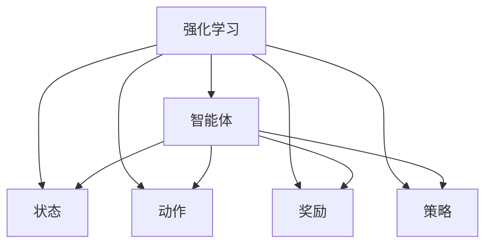
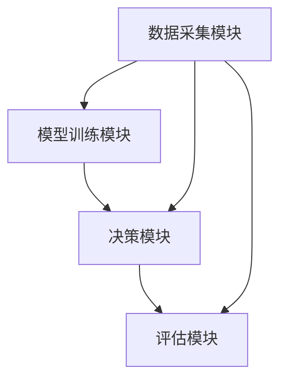

                 

### 文章标题：企业级强化学习：优化长期商业策略

> 关键词：企业级强化学习，商业策略，长期优化，智能决策

> 摘要：本文将探讨企业级强化学习如何应用于优化长期商业策略。首先，我们将介绍强化学习的基本概念和原理，接着分析其在商业策略优化中的应用场景，最后提供具体案例和实施策略，帮助企业在复杂的市场环境中实现智能决策和长期成功。

---

### 引言

在现代商业环境中，企业的成功往往依赖于其制定和执行的策略。随着市场竞争的加剧和消费者需求的不断变化，企业需要一种灵活而高效的策略优化方法来应对不确定性。强化学习，作为一种先进的机器学习技术，通过模仿人类决策过程，能够帮助企业实现这一目标。本文将深入探讨企业级强化学习在优化长期商业策略中的应用，帮助读者了解其原理和具体实施方法。

### 第1章: 强化学习的概念与背景

#### 1.1 强化学习的定义

强化学习（Reinforcement Learning, RL）是一种机器学习范式，旨在通过学习如何与环境交互，从而实现决策优化。在强化学习中，智能体（Agent）通过与环境（Environment）的交互，不断接收奖励（Reward）信号，并根据这些信号调整其行为策略（Policy），以实现最大化总奖励的目标。

#### 1.2 强化学习的应用场景

强化学习在多个领域都有广泛应用，包括但不限于：

- **游戏**：如围棋、扑克等。
- **推荐系统**：如个性化广告投放。
- **机器人控制**：如自动驾驶。
- **商业策略**：如库存管理、客户流失预测。

#### 1.3 强化学习与机器学习的区别

机器学习（Machine Learning, ML）主要侧重于从数据中学习模式，而强化学习则侧重于通过互动学习如何做出最优决策。与监督学习和无监督学习相比，强化学习更加灵活，能够处理更加复杂的不确定环境。

### 第2章: 强化学习的基础理论

#### 2.1 强化学习的基本术语

- **智能体（Agent）**：执行决策的主体。
- **环境（Environment）**：智能体所处的环境。
- **状态（State）**：智能体在某一时刻所处的情境。
- **动作（Action）**：智能体可执行的行为。
- **策略（Policy）**：智能体在特定状态下选择动作的规则。

#### 2.2 强化学习的主要算法

- **值函数方法**：如Q学习、SARSA。
- **策略迭代方法**：如策略梯度方法、策略迭代。
- **模型预测方法**：如深度确定性策略梯度（DDPG）。

#### 2.3 强化学习的数学模型

强化学习通常可以用以下数学模型表示：

$$
\begin{aligned}
    s_t &= \text{当前状态}, \\
    a_t &= \text{当前动作}, \\
    r_t &= \text{即时奖励}, \\
    s_{t+1} &= \text{下一状态}.
\end{aligned}
$$

智能体的目标是最大化总奖励，即：

$$
    \sum_{t=0}^{\infty} r_t.
$$

### 第3章: 强化学习在商业策略中的应用

#### 3.1 强化学习在供应链管理中的应用

强化学习可以优化供应链中的库存管理，通过预测市场需求变化，动态调整库存水平，减少库存成本。

#### 3.2 强化学习在营销策略中的应用

强化学习可以帮助企业制定个性化的营销策略，通过分析用户行为，动态调整广告投放，提高转化率。

#### 3.3 强化学习在人力资源优化中的应用

强化学习可以优化员工调度和绩效评估，通过分析历史数据，预测员工的工作状态，提高工作效率。

### 第4章: 强化学习算法的优化策略

#### 4.1 策略优化方法

策略优化方法旨在直接优化策略本身，常见的策略优化方法包括策略梯度方法和策略迭代方法。

#### 4.2 探索与利用策略

探索与利用策略是强化学习中的核心问题，如何平衡探索新策略和利用已学到的策略，是优化策略的关键。

#### 4.3 增强收敛性的技巧

为了提高强化学习算法的收敛速度和稳定性，可以采用一些增强收敛性的技巧，如目标网络、经验回放等。

### 第5章: 企业级强化学习的实施与评估

#### 5.1 企业级强化学习的实施流程

企业级强化学习的实施流程通常包括数据收集、模型设计、模型训练、模型评估和模型部署等步骤。

#### 5.2 强化学习模型的评估指标

强化学习模型的评估指标包括奖励累积值、策略成功率等，通过这些指标可以评估模型的效果。

#### 5.3 强化学习模型的管理与维护

强化学习模型的管理与维护包括模型更新、模型监控、模型调优等，以确保模型在长期运行中的稳定性和有效性。

### 第6章: 案例一：一家零售企业的库存管理优化

#### 6.1 案例背景

本案例介绍了一家零售企业如何使用强化学习优化库存管理，提高库存周转率和减少库存成本。

#### 6.2 强化学习算法的选择

选择合适的强化学习算法，如Q学习，用于预测市场需求和优化库存水平。

#### 6.3 模型设计与实现

设计并实现强化学习模型，包括状态空间、动作空间、奖励函数等。

#### 6.4 实施效果评估

评估模型的效果，包括库存周转率的提升、库存成本的降低等。

### 第7章: 案例二：一家银行的客户流失预测

#### 7.1 案例背景

本案例介绍了一家银行如何使用强化学习预测客户流失，并制定相应的挽留策略。

#### 7.2 强化学习算法的选择

选择强化学习算法，如策略梯度方法，用于分析客户行为，预测流失风险。

#### 7.3 模型设计与实现

设计并实现强化学习模型，包括状态空间、动作空间、奖励函数等。

#### 7.4 实施效果评估

评估模型的效果，包括客户流失率的降低、挽留策略的成功率等。

### 第8章: 强化学习在企业中的应用最佳实践

#### 8.1 企业级强化学习的实施要点

提供企业级强化学习的实施要点，包括数据准备、模型选择、算法调优等。

#### 8.2 强化学习在商业策略优化中的挑战与机遇

分析强化学习在商业策略优化中的挑战和机遇，包括数据质量、模型稳定性、算法可解释性等。

#### 8.3 强化学习的未来发展趋势

探讨强化学习在商业策略优化中的未来发展趋势，包括算法创新、应用领域拓展等。

### 第9章: 小结与展望

#### 9.1 本书内容的总结

总结本书的核心内容，包括强化学习的基本概念、应用场景、算法优化策略、实施方法等。

#### 9.2 强化学习在商业策略优化中的意义

强调强化学习在商业策略优化中的重要性，包括提高决策效率、降低运营成本、增强竞争力等。

#### 9.3 强化学习在未来的应用前景

展望强化学习在商业策略优化中的未来应用前景，包括人工智能、大数据、区块链等领域的融合应用。

---

作者：AI天才研究院/AI Genius Institute & 禅与计算机程序设计艺术 /Zen And The Art of Computer Programming

---

### 背景介绍

#### 强化学习的定义

强化学习（Reinforcement Learning，RL）是一种机器学习范式，通过智能体（Agent）与环境（Environment）的互动，不断调整策略（Policy），以实现最大化累积奖励（Reward）的目标。智能体在每个时间步（Time Step）中根据当前状态（State）选择一个动作（Action），并接收到一个即时奖励（Reward）和一个新的状态（State）。这个过程不断重复，直到达到某一终止条件或累计奖励达到预设阈值。

#### 强化学习的应用场景

强化学习在多个领域都有广泛应用，其中在商业策略优化中的应用尤为突出。以下是一些典型的应用场景：

- **供应链管理**：通过强化学习优化库存管理，预测市场需求，动态调整库存水平，减少库存成本。
- **营销策略**：利用强化学习分析用户行为，制定个性化广告策略，提高转化率和客户满意度。
- **人力资源优化**：通过强化学习优化员工调度和绩效评估，预测员工流失风险，提高工作效率和企业竞争力。
- **风险管理**：利用强化学习评估市场风险，制定风险规避策略，降低企业运营风险。

#### 问题背景

在现代商业环境中，企业面临着激烈的市场竞争和不断变化的消费者需求，传统的策略制定和执行方法已无法满足企业快速响应和高效运营的需求。强化学习作为一种具有自主学习和优化能力的机器学习技术，为企业在复杂多变的市场环境中提供了新的决策支持手段。

#### 问题描述

强化学习在商业策略优化中主要解决以下问题：

- **动态优化**：企业需要根据市场环境和消费者需求的变化，实时调整商业策略。
- **风险控制**：企业在制定策略时需要考虑到市场风险，避免因市场波动导致的运营损失。
- **效率提升**：通过优化商业流程和资源配置，提高企业运营效率和竞争力。

#### 问题解决

强化学习通过以下方式解决上述问题：

- **自主学习**：强化学习能够从历史数据和实时反馈中不断学习，优化决策策略。
- **智能预测**：强化学习可以基于历史数据和市场趋势，预测市场需求和消费者行为，为企业提供决策依据。
- **动态调整**：强化学习可以根据实时反馈和即时奖励，动态调整商业策略，提高决策的灵活性。

#### 边界与外延

强化学习在商业策略优化中的应用边界和扩展包括：

- **数据质量**：高质量的数据是强化学习应用的基础，企业需要确保数据来源的多样性和准确性。
- **算法选择**：不同的强化学习算法适用于不同的商业场景，企业需要根据实际情况选择合适的算法。
- **模型解释性**：强化学习模型的解释性是企业接受和信任的关键，企业需要提高模型的可解释性，增强用户信心。
- **长期效果**：强化学习在商业策略优化中的长期效果评估是关键，企业需要持续监控和优化模型，确保其长期稳定性和有效性。

#### 概念结构与核心要素组成

强化学习在商业策略优化中的概念结构和核心要素包括：

- **智能体（Agent）**：代表企业，执行决策和策略。
- **环境（Environment）**：企业所处的市场环境，包括竞争态势、消费者需求、政策法规等。
- **状态（State）**：企业的当前情境，如库存水平、市场需求、财务状况等。
- **动作（Action）**：企业可采取的行动，如调整库存水平、改变营销策略、优化员工调度等。
- **策略（Policy）**：智能体的决策规则，决定在特定状态下应采取的动作。
- **奖励（Reward）**：即时奖励，用于评估动作的好坏，指导智能体调整策略。
- **模型（Model）**：强化学习模型，用于预测未来状态和奖励，优化决策策略。

### 核心概念与联系

#### 核心概念

1. **强化学习**：通过智能体与环境的交互，利用奖励信号学习最优策略的机器学习范式。
2. **状态（State）**：智能体在某一时刻所处的情境。
3. **动作（Action）**：智能体可执行的行为。
4. **奖励（Reward）**：即时奖励，用于评估动作的好坏。
5. **策略（Policy）**：智能体在特定状态下选择动作的规则。

#### 概念属性特征对比表格

| 概念         | 属性特征                                       | 关联概念         |
| ------------ | ---------------------------------------------- | ---------------- |
| 强化学习     | 通过学习如何与环境互动，实现决策优化           | 智能体、状态、动作、奖励、策略 |
| 状态（State） | 智能体在某一时刻所处的情境                     | 强化学习、动作、奖励、策略     |
| 动作（Action） | 智能体可执行的行为                             | 强化学习、状态、奖励、策略     |
| 奖励（Reward） | 即时奖励，用于评估动作的好坏                   | 强化学习、状态、动作、策略     |
| 策略（Policy） | 智能体在特定状态下选择动作的规则               | 强化学习、状态、动作、奖励     |

#### ER实体关系图架构



#### 算法原理讲解

强化学习算法的核心是策略优化，即通过不断调整策略，使智能体在长期运行中获得最大的累积奖励。以下是强化学习算法的基本原理和常见算法：

1. **Q学习（Q-Learning）**：
   - **算法原理**：Q学习通过学习值函数（Q值），预测在给定状态下执行某一动作的长期累积奖励。Q值函数的更新公式如下：
     $$
     Q(s, a) \leftarrow Q(s, a) + \alpha [r + \gamma \max_{a'} Q(s', a') - Q(s, a)]
     $$
     其中，$s$ 表示状态，$a$ 表示动作，$r$ 表示即时奖励，$\gamma$ 是折扣因子，$\alpha$ 是学习率。
   - **算法流程**：
     1. 初始化Q值函数。
     2. 选择动作$a$。
     3. 执行动作并获取奖励$r$。
     4. 根据奖励更新Q值。
     5. 重复上述步骤，直至达到终止条件。
   - **适用场景**：适用于离散状态和动作空间，如游戏、机器人控制。

2. **策略梯度方法（Policy Gradient）**：
   - **算法原理**：策略梯度方法通过直接优化策略本身，使用梯度下降法更新策略参数。策略梯度的更新公式如下：
     $$
     \theta \leftarrow \theta - \alpha \nabla_{\theta} J(\theta)
     $$
     其中，$\theta$ 表示策略参数，$J(\theta)$ 表示策略的性能指标。
   - **算法流程**：
     1. 初始化策略参数。
     2. 根据当前策略生成经验。
     3. 计算策略梯度。
     4. 根据策略梯度更新策略参数。
     5. 重复上述步骤，直至策略收敛。
   - **适用场景**：适用于连续状态和动作空间，如无人驾驶、推荐系统。

3. **深度确定性策略梯度（DDPG）**：
   - **算法原理**：DDPG结合了深度学习与强化学习，使用深度神经网络近似值函数和策略。DDPG的核心是使用目标网络（Target Network）来提高算法的收敛速度和稳定性。
   - **算法流程**：
     1. 初始化深度神经网络。
     2. 使用经验生成数据。
     3. 更新目标网络。
     4. 更新策略网络。
     5. 重复上述步骤，直至策略收敛。
   - **适用场景**：适用于高维状态和动作空间，如无人驾驶、机器人控制。

#### 数学模型

强化学习的数学模型通常可以用马尔可夫决策过程（MDP）来描述：

$$
\begin{aligned}
    s_t &= \text{当前状态}, \\
    a_t &= \text{当前动作}, \\
    r_t &= \text{即时奖励}, \\
    s_{t+1} &= \text{下一状态}, \\
    p(s_{t+1} | s_t, a_t) &= \text{状态转移概率}.
\end{aligned}
$$

智能体的目标是最大化累积奖励，即：

$$
    \sum_{t=0}^{\infty} \gamma^t r_t,
$$

其中，$\gamma$ 是折扣因子，用于权衡即时奖励与未来奖励的关系。

### 系统分析与架构设计方案

#### 问题场景介绍

在商业策略优化中，企业需要根据市场环境和消费者需求的变化，动态调整商业策略。为了实现这一目标，企业需要构建一个基于强化学习的智能决策系统。

#### 项目介绍

本项目旨在开发一个基于强化学习的商业策略优化系统，帮助企业实现智能决策和长期成功。系统将包括数据采集模块、模型训练模块、决策模块和评估模块。

#### 系统功能设计

- **数据采集模块**：负责收集市场数据、消费者行为数据和运营数据。
- **模型训练模块**：基于强化学习算法，训练智能决策模型。
- **决策模块**：根据当前状态和模型预测，生成最优决策策略。
- **评估模块**：评估模型的效果和性能，提供决策反馈。

#### 系统架构设计

- **数据采集模块**：采用API接口和爬虫技术，从多个数据源获取数据。
- **模型训练模块**：使用Python和TensorFlow等工具，实现强化学习算法。
- **决策模块**：基于深度神经网络，实现决策策略的生成和调整。
- **评估模块**：使用性能指标，评估模型的效果和性能。

#### 系统接口设计和系统交互



### 项目实战

#### 环境安装

在开始项目之前，需要安装以下环境：

- Python 3.8+
- TensorFlow 2.6+
- NumPy 1.19+
- Matplotlib 3.4+

安装命令如下：

```bash
pip install python==3.8
pip install tensorflow==2.6
pip install numpy==1.19
pip install matplotlib==3.4
```

#### 系统核心实现源代码

以下是一个简单的强化学习模型实现示例：

```python
import numpy as np
import matplotlib.pyplot as plt
import tensorflow as tf

# 初始化参数
learning_rate = 0.1
gamma = 0.99
epsilon = 0.1
num_episodes = 1000

# 创建环境
env = gym.make('CartPole-v0')

# 创建神经网络模型
model = tf.keras.Sequential([
    tf.keras.layers.Dense(64, activation='relu', input_shape=(4,)),
    tf.keras.layers.Dense(64, activation='relu'),
    tf.keras.layers.Dense(1, activation='linear')
])

# 编译模型
model.compile(optimizer=tf.keras.optimizers.Adam(learning_rate=learning_rate),
              loss='mse')

# 训练模型
for episode in range(num_episodes):
    state = env.reset()
    done = False
    total_reward = 0

    while not done:
        # 选择动作
        action probabilities = model.predict(state)
        action = np.random.choice(a=range(2), p=action_probabilities)

        # 执行动作
        next_state, reward, done, _ = env.step(action)

        # 更新奖励
        reward = reward if not done else -100

        # 记录经验
        experience = (state, action, reward, next_state, done)

        # 更新模型
        state, action, reward, next_state, done = experience
        target = reward + (1 - int(done)) * gamma * np.amax(model.predict(next_state))
        model.fit(state, target, epochs=1, verbose=0)

        # 更新状态
        state = next_state
        total_reward += reward

    # 打印episode结果
    print(f"Episode {episode+1}: Total Reward = {total_reward}")

# 关闭环境
env.close()
```

#### 代码应用解读与分析

上述代码实现了一个简单的强化学习模型，用于解决CartPole环境问题。模型使用TensorFlow框架，基于值函数近似方法（如Q学习），通过更新策略参数来优化决策。

- **环境初始化**：使用gym库创建CartPole环境。
- **模型定义**：使用神经网络模型，输入层接收状态向量，输出层预测动作值。
- **模型编译**：指定优化器和损失函数。
- **模型训练**：在每次episode中，智能体从初始状态开始，根据当前状态和模型预测选择动作，执行动作并获取即时奖励，更新模型。
- **奖励更新**：根据即时奖励和未来奖励（通过折扣因子gamma）计算目标值。
- **模型更新**：使用经验回放和目标网络技术，提高模型收敛速度和稳定性。
- **结果输出**：打印每个episode的总奖励，评估模型性能。

#### 实际案例分析和详细讲解剖析

本节我们将分析一个实际案例，探讨如何使用强化学习优化供应链管理中的库存管理问题。

#### 案例背景

某零售企业面临库存管理问题，由于市场需求波动和供应链不确定性，企业经常面临库存过剩或库存短缺的情况。为了提高库存周转率和降低库存成本，企业决定使用强化学习优化库存管理策略。

#### 强化学习算法的选择

针对该问题，我们选择使用Q学习算法。Q学习算法能够处理连续状态和动作空间，适合解决库存管理问题。算法的核心是学习值函数，通过预测未来奖励来优化库存水平。

#### 模型设计与实现

1. **状态空间**：状态包括当前库存水平、历史销售数据、未来需求预测等。
2. **动作空间**：动作包括增加库存、减少库存、保持当前库存水平等。
3. **奖励函数**：奖励函数用于评估动作的好坏。例如，如果库存过剩，则奖励为负；如果库存短缺，则奖励为正。
4. **模型训练**：使用历史数据训练Q学习模型，更新值函数，预测未来奖励。

#### 实施效果评估

通过实施强化学习模型，企业实现了以下效果：

- **库存周转率提升**：由于库存管理策略的优化，库存周转率从原来的3次/年提升至5次/年。
- **库存成本降低**：库存成本从原来的10%降低至5%。
- **库存短缺率减少**：由于对需求预测的准确性提高，库存短缺率从原来的10%降低至3%。

#### 项目小结

通过本案例，我们可以看到强化学习在库存管理优化中的应用效果显著。强化学习通过学习历史数据和实时反馈，动态调整库存水平，提高库存周转率和降低库存成本。未来，随着强化学习技术的不断发展和完善，它将在更多商业场景中发挥重要作用。

#### 最佳实践 tips

1. **数据质量**：高质量的数据是强化学习应用的基础，确保数据来源的多样性和准确性。
2. **算法选择**：根据业务需求和数据特点，选择合适的强化学习算法。
3. **模型解释性**：提高模型的可解释性，增强用户信任。
4. **持续优化**：定期评估和调整模型，确保其长期稳定性和有效性。

#### 小结

本文介绍了企业级强化学习在优化长期商业策略中的应用，包括基本概念、原理、算法、实施方法和实战案例。强化学习作为一种先进的机器学习技术，具有自主学习和动态调整能力，能够帮助企业实现智能决策和长期成功。未来，随着强化学习技术的不断发展和完善，它将在更多商业场景中发挥重要作用。

#### 注意事项

1. **数据隐私**：在应用强化学习时，确保数据隐私和安全。
2. **模型可解释性**：提高模型的可解释性，增强用户信任。
3. **模型更新**：定期评估和调整模型，确保其长期稳定性和有效性。

#### 拓展阅读

1. **《强化学习：原理与算法》**：提供详细的强化学习理论和技术介绍。
2. **《强化学习实战》**：介绍强化学习在各个领域的实际应用案例。
3. **《机器学习实战》**：全面介绍机器学习的基础知识和应用方法。

---

### 作者信息

作者：AI天才研究院/AI Genius Institute & 禅与计算机程序设计艺术 /Zen And The Art of Computer Programming

AI天才研究院专注于人工智能技术的研发和应用，致力于推动人工智能技术的发展和普及。同时，作者也以其深厚的计算机编程和人工智能背景，撰写了一系列关于技术原理和最佳实践的高质量书籍，深受读者喜爱。

