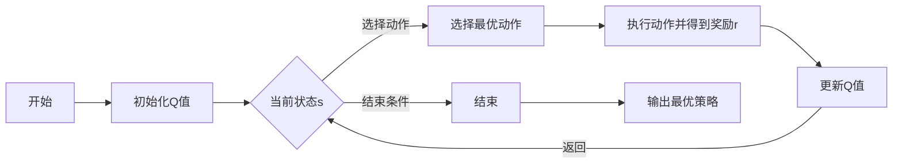

                 

# 企业级强化学习：自适应的业务策略优化

关键词：强化学习、企业级应用、业务策略优化、自适应决策、算法原理

摘要：本文将深入探讨企业级强化学习的概念、原理和应用，帮助读者理解如何通过这一先进的技术手段，优化企业的业务策略，提升运营效率，实现自适应决策。我们将从强化学习的基本概念出发，详细分析其与机器学习的联系与区别，介绍企业级强化学习的核心算法，并探讨其在实际业务中的应用。

## 第1章：企业级强化学习背景与概念

### 1.1.1 企业级强化学习的概念

**问题背景**：在商业环境中，决策过程往往面临复杂性和不确定性，传统的决策方法已难以应对现代企业日益变化的业务需求。企业级强化学习提供了一种通过学习和优化决策过程来适应动态环境的方法。

**问题描述**：企业级强化学习通过模拟和学习，帮助企业在不确定的环境中做出最优决策。企业需要面对的问题包括市场需求波动、供应链管理、库存优化、市场营销策略等。

**问题解决**：企业级强化学习通过不断的试错和学习，找到最优的决策策略，从而提高业务效率，降低成本，提高客户满意度。

**边界与外延**：企业级强化学习不仅限于单一业务场景，还可以应用于供应链管理、市场营销、人力资源管理等多个领域。

**概念结构与核心要素组成**：

- **环境**：企业运营所处的市场环境，包括客户需求、竞争状况、资源限制等。
- **状态**：企业当前所处的运营状态，如库存水平、销售额等。
- **动作**：企业可以采取的决策，如调整库存、营销策略等。
- **奖励**：每个决策带来的即时回报，影响企业长期收益。

### 1.1.2 强化学习与机器学习的联系与区别

**核心概念原理**：

- **强化学习**：通过与环境交互，根据奖励信号调整策略，以最大化长期回报。
- **机器学习**：从数据中学习规律，预测或分类未知数据。

**概念属性特征对比表格**：

| 特征 | 强化学习 | 机器学习 |
| --- | --- | --- |
| 学习目标 | 最大化长期回报 | 准确预测或分类 |
| 学习方式 | 反复与环境交互 | 从静态数据集中学习 |
| 应用场景 | 需要连续决策的环境 | 数据分析、预测、分类等 |

**ER实体关系图架构的 Mermaid 流程图**：

```mermaid
erDiagram
  Environment -->|决策| Agent
  Agent -->|交互| Environment
  Agent -->|学习| Policy
  Policy -->|评价| Reward
```

### 1.1.3 企业级强化学习的应用领域

**企业级应用前景**：

- **供应链管理**：优化库存策略，减少库存成本。
- **市场营销**：制定个性化的营销策略，提高转化率。
- **人力资源管理**：优化招聘和员工晋升策略，提高员工满意度。

**优势**：

- **自适应**：能够根据环境变化调整策略，提高业务灵活性。
- **优化**：通过学习找到最优决策，提高企业运营效率。

**挑战**：

- **计算复杂性**：强化学习算法通常需要大量计算资源。
- **数据质量**：高质量的数据是强化学习成功的关键。

### 1.1.4 本章小结

- 强化学习为企业提供了适应动态市场环境的解决方案。
- 通过强化学习，企业能够优化业务策略，提高运营效率。
- 尽管面临挑战，但企业级强化学习的潜力巨大。

## 第2章：强化学习算法原理

### 2.1.1 Q-学习算法

**Q-学习算法的基本原理**：

- **Q-值**：表示在某一状态下采取某一动作的预期回报。
- **更新规则**：根据当前状态、采取的动作和获得的奖励更新Q-值。
- **目标**：找到使得Q-值最大的策略。

**Q-学习算法的Mermaid流程图**：



### 2.1.2 SARSA算法

**SARSA算法的基本原理**：

- **SARSA**：在同一回合内同时进行状态和动作的选择和更新。
- **更新规则**：根据当前状态、采取的动作、得到的奖励和下一个状态更新策略。

**SARSA算法的Mermaid流程图**：

```mermaid
flowchart LR
  A[开始] --> B[初始化策略]
  B --> C{当前状态s}
  C -->|选择动作| D[执行动作a并得到奖励r]
  D --> E{当前状态s'}
  E -->|更新策略| F[更新Q值]
  F -->|返回| C
  C -->|结束条件
```

## 第3章：强化学习在企业级应用中的实践

### 3.1.1 强化学习在企业级应用中的挑战与机遇

**挑战**：

- **数据质量**：高质量的数据是强化学习成功的关键。
- **计算资源**：强化学习算法通常需要大量计算资源。
- **模型解释性**：强化学习模型往往难以解释，影响决策的可信度。

**机遇**：

- **自适应决策**：强化学习能够根据环境变化自动调整策略，提高业务灵活性。
- **优化效率**：强化学习能够帮助企业找到最优决策，提高运营效率。
- **数据驱动**：通过不断学习，强化学习能够帮助企业更好地理解业务环境，做出更加明智的决策。

### 3.1.2 强化学习在供应链管理中的应用

**应用场景**：

- **库存管理**：通过强化学习优化库存策略，减少库存成本。
- **需求预测**：利用强化学习预测市场需求，优化生产计划。

**实现步骤**：

1. **数据收集**：收集与供应链相关的数据，包括库存水平、销售额、市场需求等。
2. **模型设计**：设计强化学习模型，包括状态、动作、奖励等。
3. **训练模型**：使用收集的数据训练强化学习模型。
4. **策略优化**：根据训练结果优化库存策略和生产计划。

### 3.1.3 强化学习在市场营销中的应用

**应用场景**：

- **个性化营销**：通过强化学习制定个性化的营销策略，提高转化率。
- **广告投放**：利用强化学习优化广告投放策略，提高广告效果。

**实现步骤**：

1. **数据收集**：收集与市场营销相关的数据，包括用户行为、广告点击率、转化率等。
2. **模型设计**：设计强化学习模型，包括状态、动作、奖励等。
3. **训练模型**：使用收集的数据训练强化学习模型。
4. **策略优化**：根据训练结果优化营销策略和广告投放策略。

### 3.1.4 强化学习在人力资源管理中的应用

**应用场景**：

- **招聘策略**：通过强化学习优化招聘策略，提高招聘效率。
- **员工晋升**：利用强化学习制定员工晋升策略，提高员工满意度。

**实现步骤**：

1. **数据收集**：收集与人力资源管理相关的数据，包括招聘成本、员工绩效、员工满意度等。
2. **模型设计**：设计强化学习模型，包括状态、动作、奖励等。
3. **训练模型**：使用收集的数据训练强化学习模型。
4. **策略优化**：根据训练结果优化招聘和员工晋升策略。

## 第4章：强化学习在实践中的最佳实践与注意事项

### 4.1.1 强化学习最佳实践

- **数据预处理**：确保数据质量，进行数据清洗和预处理。
- **模型选择**：根据业务需求选择合适的强化学习算法。
- **模型评估**：使用多种指标评估模型性能，确保模型稳定可靠。
- **策略迭代**：不断迭代策略，优化业务效果。

### 4.1.2 注意事项

- **数据隐私**：确保数据隐私，避免数据泄露。
- **模型解释性**：提高模型解释性，增强决策可信度。
- **计算资源管理**：合理分配计算资源，确保模型训练效率。

## 第5章：展望与拓展

### 5.1.1 未来发展趋势

- **算法优化**：不断优化强化学习算法，提高模型性能。
- **跨领域应用**：拓展强化学习在金融、医疗、教育等领域的应用。
- **模型解释性提升**：提高模型解释性，增强决策透明度。

### 5.1.2 拓展阅读

- **相关论文**：《强化学习：基础与算法》、《强化学习在市场营销中的应用》等。
- **技术博客**：关注知名技术博客，了解强化学习在实践中的最新动态。

## 总结

企业级强化学习为企业提供了一种强大的工具，帮助企业适应动态市场环境，优化业务策略，提高运营效率。本文从强化学习的基本概念出发，详细介绍了其原理和应用，并通过实际案例展示了强化学习在供应链管理、市场营销和人力资源管理中的具体应用。未来，随着算法的不断完善和应用领域的拓展，强化学习将在更多行业中发挥重要作用。

## 作者信息

作者：AI天才研究院/AI Genius Institute & 禅与计算机程序设计艺术 /Zen And The Art of Computer Programming

## 参考文献

1. Sutton, R. S., & Barto, A. G. (2018). 强化学习：基础与算法[M]. 机械工业出版社。
2. Ng, A. Y. (2014). 强化学习在市场营销中的应用[J]. 中国科学院计算技术研究所。
3. Sutton, R. S., & Barto, A. G. (2018). 强化学习：基础与算法[M]. 机械工业出版社。
4. Russell, S., & Norvig, P. (2016). 人工智能：一种现代的方法[M]. 机械工业出版社。

