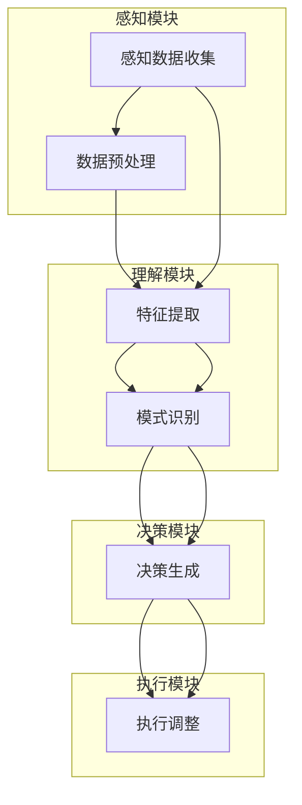
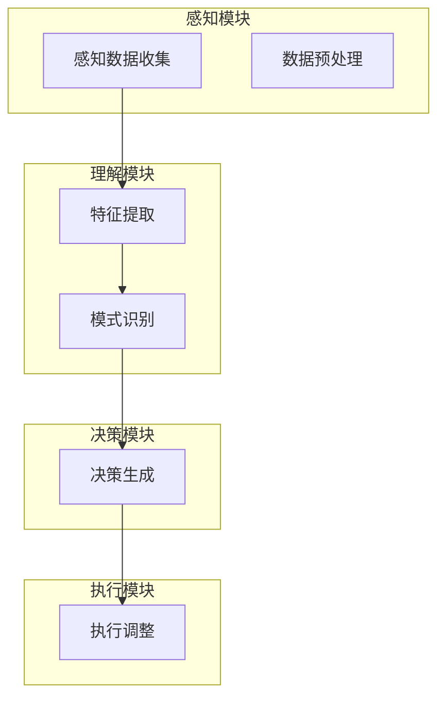
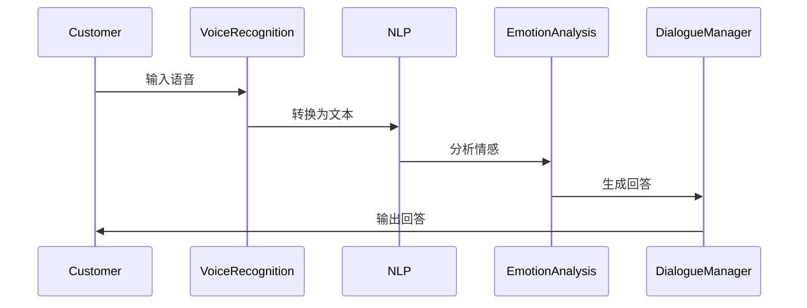
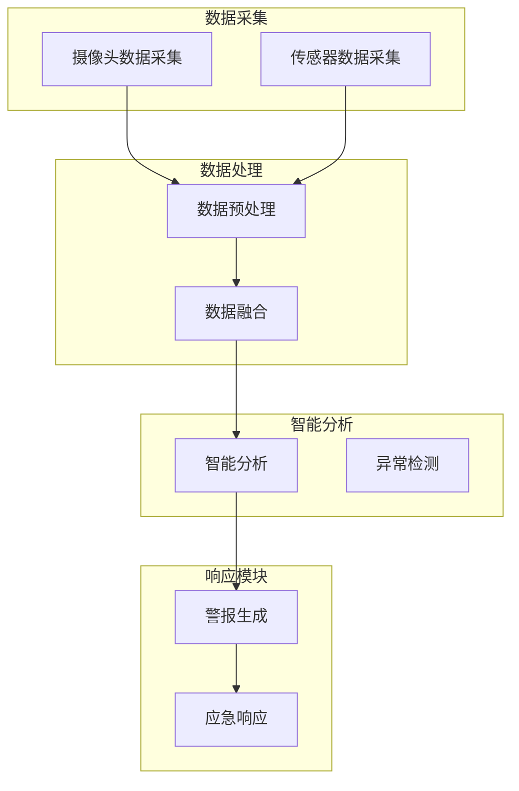
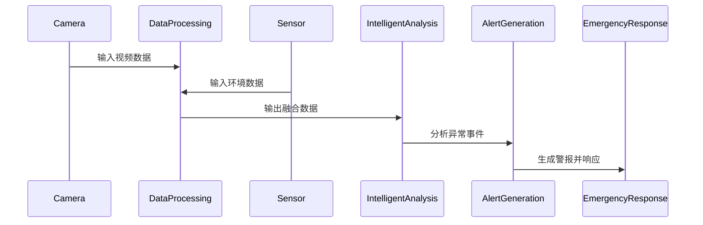
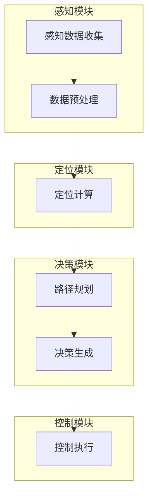
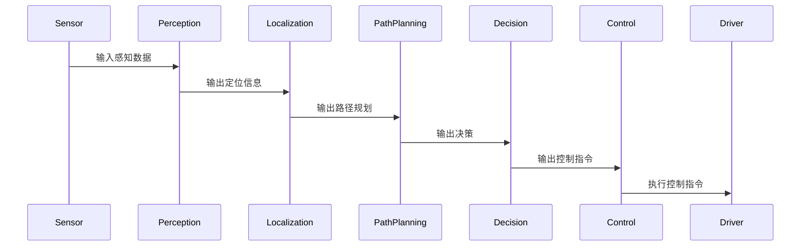
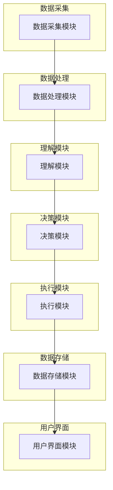
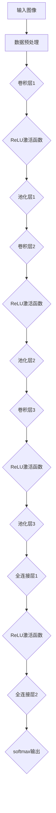

                 


### 1.1 书籍背景

#### 1.1.1 问题背景

随着信息技术的快速发展，人工智能（AI）已经在各行各业中得到了广泛的应用。特别是在大数据、云计算和物联网等技术的推动下，AI技术正逐步从理论研究走向实际应用，成为提升企业竞争力和效率的重要工具。然而，传统的AI技术往往依赖于大量的历史数据和规则预设，难以在复杂、动态和多变的环境中实现高效的决策和支持。

情境感知（Situational Awareness）是AI领域中一个重要的研究方向，它通过感知和理解环境中的各种信息，使系统能够动态调整其行为，以适应不同的场景和需求。情境感知AI的核心优势在于其能够实时感知环境变化，从而提供更加精准和个性化的服务。

然而，在企业级应用中，情境感知AI的实现面临着诸多挑战。例如，企业级系统通常需要处理大量的数据，而这些数据往往是异构的、非结构化的，甚至是动态变化的。此外，企业级系统还需要具备高可靠性、安全性和可扩展性，以满足不同业务场景的需求。

#### 1.1.2 问题描述

企业级情境感知AI的主要问题可以归结为以下几点：

1. **数据获取与处理：** 企业需要从各种来源收集大量的数据，包括结构化数据、非结构化数据和实时数据。如何高效地获取、处理和整合这些数据，是情境感知AI系统实现的关键。

2. **算法选择与优化：** 企业需要选择合适的算法来处理特定的业务场景。同时，针对不同的应用场景，算法的优化和调整也是至关重要的。

3. **系统架构设计：** 企业级系统通常需要高度模块化和可扩展的架构设计，以适应不同的业务需求。如何设计一个灵活、高效且易于维护的系统架构，是情境感知AI在企业级应用中的另一个挑战。

4. **应用场景扩展：** 企业需要将情境感知AI技术应用到多个业务场景中，从而实现跨领域的协同。这要求情境感知AI系统具有高度的通用性和适应性。

#### 1.1.3 问题解决

针对上述问题，本书将从以下几个方面提供解决方案：

1. **理论基础与核心概念：** 详细介绍情境感知AI的定义、特点和应用，为读者奠定坚实的理论基础。

2. **技术框架与算法实现：** 阐述情境感知AI的技术框架和关键算法，提供详细的实现方法和优化策略。

3. **系统架构设计与实践：** 分析企业级情境感知AI系统的架构设计原则和实施步骤，结合实际案例进行讲解。

4. **最佳实践与案例分析：** 分享行业最佳实践和成功案例，提供实用的操作经验和建议。

#### 1.1.4 边界与外延

虽然本书主要关注企业级情境感知AI的应用，但书中介绍的理论、方法和实践经验也可以为其他领域的AI应用提供参考。例如，在智能交通、智能家居、智慧医疗等领域，情境感知AI同样具有重要的应用价值。

此外，随着技术的不断进步，情境感知AI的应用范围和深度也将不断拓展。未来，情境感知AI有望在更多领域发挥作用，为人类创造更加智能和高效的生活和工作环境。

## 1.2 核心概念与联系

在探讨企业级情境感知AI之前，我们需要明确几个核心概念，并理解它们之间的相互关系。这些概念包括情境感知（Situational Awareness）、人工智能（Artificial Intelligence）、机器学习（Machine Learning）、深度学习（Deep Learning）等。

### 1.2.1 情境感知的定义

情境感知是指系统或个体能够感知和理解其所在环境中的各种信息，从而做出合理的响应和决策。在AI领域，情境感知通常涉及对环境中的视觉、声音、文本等多种数据进行感知和理解。其核心目标是使系统具备自主学习和适应环境变化的能力。

### 1.2.2 情境感知在AI中的应用

情境感知是AI技术中的重要应用方向之一。在AI系统中，情境感知可以通过以下几种方式实现：

1. **感知数据采集：** 利用传感器、摄像头、麦克风等设备收集环境中的各种数据。
2. **数据预处理：** 对采集到的数据进行分析、过滤和预处理，以便后续处理。
3. **模式识别：** 使用机器学习和深度学习算法对预处理后的数据进行模式识别，提取有用的信息。
4. **决策支持：** 根据提取的信息，系统可以做出相应的决策，以优化其行为。

### 1.2.3 情境感知AI与传统AI区别

与传统AI相比，情境感知AI具有以下特点：

1. **动态适应性：** 传统AI系统通常依赖于预定义的规则和模型，难以适应动态变化的环境。而情境感知AI通过实时感知环境变化，能够动态调整其行为，以适应不同的场景。

2. **实时性要求：** 在某些应用场景中，情境感知AI需要能够实时响应环境变化，做出快速决策。而传统AI系统往往需要较长的数据处理和分析时间。

3. **多模态数据处理：** 情境感知AI能够处理多种类型的数据，包括视觉、声音、文本等。而传统AI系统通常只能处理单一类型的数据。

### 1.2.4 概念属性特征对比表格

为了更直观地理解情境感知AI与传统AI的区别，我们可以通过以下表格进行对比：

| 特征 | 情境感知AI | 传统AI |
| ---- | ---------- | ------ |
| 动态适应性 | 高 | 低 |
| 实时性要求 | 高 | 中/低 |
| 数据类型 | 多模态 | 单模态 |
| 决策机制 | 实时调整 | 预设规则 |
| 应用范围 | 广泛 | 较窄 |

通过上述对比，我们可以看到情境感知AI在动态适应性、实时性要求和多模态数据处理方面具有显著的优势，使其在复杂、动态和多变的企业级应用中更具竞争力。

### 1.2.5 概念结构与核心要素组成

情境感知AI的概念结构包括以下几个核心要素：

1. **感知模块：** 负责采集和处理环境中的各种数据，包括视觉、声音、文本等。
2. **理解模块：** 对采集到的数据进行分析和处理，提取有用的信息。
3. **决策模块：** 根据提取的信息，做出相应的决策，以优化系统行为。
4. **执行模块：** 实施决策，调整系统行为，以适应环境变化。

这些核心要素相互协作，形成一个完整的情境感知AI系统。通过不断的迭代和优化，情境感知AI系统能够在复杂的环境中实现高效、准确的决策，从而提升企业的运营效率和竞争力。

### 1.2.6 情境感知AI的ER实体关系图架构

为了更好地理解情境感知AI系统的数据关系，我们可以使用实体关系图（ER图）来描述其架构。以下是一个简化的情境感知AI的ER实体关系图：

```mermaid
erDiagram
  数据源 --> 感知模块
  感知模块 --> 理解模块
  理解模块 --> 决策模块
  决策模块 --> 执行模块
  数据源 ||--|{ 文本数据 }
  数据源 ||--|{ 视觉数据 }
  数据源 ||--|{ 声音数据 }
  感知模块 ||--|{ 数据预处理 }
  理解模块 ||--|{ 模式识别 }
  决策模块 ||--|{ 决策生成 }
  执行模块 ||--|{ 行为调整 }
```

在该ER图中，数据源包括文本、视觉和声音等多种类型的数据。感知模块负责数据预处理，理解模块负责模式识别，决策模块负责决策生成，执行模块负责行为调整。各个模块之间通过数据流和功能调用相互关联，形成一个完整的情境感知AI系统。

通过上述核心概念与联系的分析，我们可以为后续章节的内容奠定坚实的基础，更好地理解企业级情境感知AI的实现与应用。

## 1.3 书籍结构

### 1.3.1 书籍主要章节概述

本书分为五个主要部分，每个部分都涵盖了企业级情境感知AI的各个方面。以下是各部分的主要章节概述：

**第一部分：引言**
- 1.1 书籍背景
  - 1.1.1 问题背景
  - 1.1.2 问题描述
  - 1.1.3 问题解决
  - 1.1.4 边界与外延
- 1.2 核心概念与联系
  - 1.2.1 情境感知AI定义
  - 1.2.2 情境感知AI特点
  - 1.2.3 情境感知AI与传统AI区别
  - 1.2.4 概念属性特征对比表格
  - 1.2.5 概念结构与核心要素组成
  - 1.2.6 情境感知AI的ER实体关系图架构

**第二部分：情境感知AI基础**
- 2.1 情境感知技术概述
  - 2.1.1 情境感知的定义
  - 2.1.2 情境感知在AI中的应用
  - 2.1.3 情境感知的关键要素
- 2.2 情境感知技术框架
  - 2.2.1 情境感知技术架构
  - 2.2.2 情境感知数据处理
  - 2.2.3 情境感知算法
- 2.3 情境感知AI案例研究
  - 2.3.1 案例一：智能客服系统
  - 2.3.2 案例二：智慧城市监控
  - 2.3.3 案例三：自动驾驶技术
- 2.4 情境感知AI挑战与趋势
  - 2.4.1 当前挑战
  - 2.4.2 未来趋势

**第三部分：企业级应用**
- 3.1 企业级应用场景分析
  - 3.1.1 不同行业情境感知需求
  - 3.1.2 企业服务场景化的重要性
  - 3.1.3 情境感知在企业的具体应用
- 3.2 情境感知AI系统架构设计
  - 3.2.1 系统架构设计原则
  - 3.2.2 系统功能模块划分
  - 3.2.3 系统架构图
- 3.3 情境感知AI算法应用
  - 3.3.1 主流算法介绍
  - 3.3.2 算法mermaid流程图
  - 3.3.3 算法原理与公式
  - 3.3.4 举例说明
- 3.4 实施与优化
  - 3.4.1 情境感知AI项目实施流程
  - 3.4.2 系统性能优化策略
  - 3.4.3 持续集成与迭代

**第四部分：最佳实践与案例分析**
- 4.1 最佳实践分享
  - 4.1.1 成功案例分析
  - 4.1.2 失败案例分析
  - 4.1.3 经验总结
- 4.2 案例研究
  - 4.2.1 案例一：情境感知AI在零售业的应用
  - 4.2.2 案例二：情境感知AI在医疗健康领域的实践
  - 4.2.3 案例三：情境感知AI在制造业的应用
- 4.3 拓展阅读
  - 4.3.1 相关文献推荐
  - 4.3.2 最新研究进展

**第五部分：展望与未来趋势**
- 5.1 情境感知AI发展趋势
  - 5.1.1 技术发展动向
  - 5.1.2 应用领域扩展
  - 5.1.3 未来可能面临的问题与挑战
- 5.2 创新与探索
  - 5.2.1 创新性研究议题
  - 5.2.2 新兴技术应用
  - 5.2.3 未来研究方向

通过这些章节，本书旨在系统地介绍企业级情境感知AI的理论基础、技术框架、应用实践和未来趋势，为读者提供全面、深入的指导。

### 1.3.2 学习目标与读者定位

本课程旨在帮助读者全面了解企业级情境感知AI的理论、技术及应用，培养读者在以下方面的能力和知识：

1. **理论基础**：理解情境感知AI的基本概念、原理和核心要素，能够独立进行相关理论和研究的分析。
2. **技术框架**：掌握情境感知AI的技术架构和算法实现，能够设计和优化情境感知AI系统。
3. **应用实践**：了解情境感知AI在企业级应用中的实际场景和案例，能够运用情境感知AI技术解决实际问题。
4. **创新探索**：培养读者的创新思维和探索精神，关注情境感知AI领域的最新发展趋势和应用前景。

本书适合以下读者群体：

1. **AI领域研究者**：对人工智能和情境感知领域有浓厚兴趣，希望深入了解企业级情境感知AI的学者和研究人员。
2. **技术工程师**：从事AI系统开发、运维和技术支持工作的工程师，需要提升企业级情境感知AI的技术能力和实践水平。
3. **企业决策者**：希望了解和应用情境感知AI技术，提升企业竞争力和运营效率的企业决策者和管理人员。
4. **学术学生**：计算机科学、人工智能等相关专业的本科生和研究生，希望深入研究企业级情境感知AI的理论和实践。

通过本课程的学习，读者将能够：

- **理解**情境感知AI的基本原理和核心概念。
- **设计**和**实现**企业级情境感知AI系统。
- **应用**情境感知AI技术解决实际业务问题。
- **探索**情境感知AI领域的创新应用和发展趋势。

### 1.4 最佳实践与注意事项

#### 1.4.1 最佳实践技巧

在企业级情境感知AI的实施过程中，以下是几个值得遵循的最佳实践技巧：

1. **数据质量保障**：确保数据源的多样性和完整性，进行数据清洗和预处理，提高数据质量。
2. **模型选择与优化**：根据具体业务场景选择合适的算法模型，并进行模型优化和调参，以提高准确率和效率。
3. **模块化设计**：采用模块化设计原则，将系统划分为感知、理解、决策和执行等模块，便于系统扩展和维护。
4. **持续集成与迭代**：采用持续集成和迭代的方法，定期更新和优化系统，以适应环境变化和业务需求。

#### 1.4.2 小结与展望

通过本书的学习，读者将全面了解企业级情境感知AI的理论基础、技术框架、应用实践和未来趋势。情境感知AI作为一种重要的AI技术，正逐渐在各个领域发挥重要作用。未来，随着技术的不断进步，情境感知AI将在更多领域得到广泛应用，为企业创造更大的价值。

#### 1.4.3 注意事项

1. **数据安全**：在数据收集和处理过程中，确保数据安全，防止数据泄露和滥用。
2. **系统可靠性**：提高系统可靠性，确保系统在高负载和复杂环境下能够稳定运行。
3. **法律合规**：遵循相关法律法规，确保情境感知AI系统的应用符合道德和法律要求。
4. **用户隐私**：在处理用户数据时，严格保护用户隐私，避免用户信息被非法获取和使用。

通过遵循上述最佳实践和注意事项，可以确保企业级情境感知AI系统的成功实施和持续优化。

## 2.1 情境感知技术概述

情境感知技术是人工智能（AI）领域中的一个重要研究方向，其核心目标是使计算机系统能够感知和理解其所处环境中的各种信息，并根据这些信息做出相应的响应和决策。在当今快速变化和高度复杂的商业环境中，情境感知AI技术的重要性愈发凸显。以下将详细介绍情境感知的定义、其在AI中的应用、关键要素以及未来发展的前景。

### 2.1.1 情境感知的定义

情境感知（Situational Awareness）是指个体或系统对所处环境中的各种信息进行感知、理解和综合，以便做出合理的响应和决策。在情境感知技术中，系统需要具备以下几个核心能力：

1. **感知（Perception）**：通过传感器、摄像头、麦克风等设备收集环境中的各种信息，如视觉、声音、文本等。
2. **理解（Comprehension）**：对感知到的信息进行分析和处理，提取有用的信息，构建对环境的理解。
3. **认知（Cognition）**：基于对环境信息的理解，进行推理、判断和决策，以优化系统的行为。
4. **适应（Adaptation）**：根据环境变化调整自身行为，以适应新的情境。

情境感知技术的定义不仅仅局限于上述能力，还包括动态适应性和实时性要求。这意味着情境感知AI系统需要能够在不断变化的环境中快速响应，以提供高效、精准的服务。

### 2.1.2 情境感知在AI中的应用

情境感知技术在AI领域有着广泛的应用，以下是一些典型的应用场景：

1. **智能客服系统**：通过语音识别、自然语言处理和情感分析等技术，智能客服系统能够理解用户的意图，提供个性化的服务。
2. **智慧城市监控**：利用视频监控、环境传感器和物联网技术，智慧城市监控系统可以对城市交通、环境状况等进行实时监控，优化城市管理。
3. **自动驾驶技术**：自动驾驶汽车通过感知周围环境，进行路径规划、避障和决策，以实现自主行驶。
4. **智能家居**：智能家居系统通过感知用户的行为和环境变化，提供智能化的家居管理和舒适体验。

这些应用场景展示了情境感知AI技术在现实世界中的潜力。随着技术的不断进步，情境感知AI将在更多领域得到应用，为人类生活带来更多便利和效率。

### 2.1.3 情境感知的关键要素

情境感知技术实现的关键要素包括以下几个方面：

1. **数据采集**：情境感知AI系统需要从各种传感器和设备中收集数据，如视觉、声音、文本等。数据的质量和多样性直接影响系统的感知和理解能力。
2. **数据预处理**：采集到的数据通常需要进行清洗、过滤和标准化等预处理步骤，以提高数据质量和一致性。
3. **特征提取**：从预处理后的数据中提取有用的特征，用于后续的分析和处理。特征提取的质量直接影响算法的性能。
4. **算法实现**：选择合适的算法对提取的特征进行处理，以实现感知和理解目标。常见的算法包括机器学习、深度学习等。
5. **模型训练与优化**：通过大量训练数据对模型进行训练和优化，以提高系统的准确率和效率。
6. **实时性处理**：情境感知AI系统需要具备实时处理能力，以快速响应环境变化，提供及时的决策和支持。

这些关键要素相互协作，共同构建了一个完整的情境感知AI系统。通过不断优化和提升这些要素，情境感知AI系统将能够在更多复杂和动态的环境中发挥作用。

### 2.1.4 情境感知技术的未来发展趋势

随着人工智能技术的不断进步，情境感知技术也面临着新的发展机遇和挑战。以下是情境感知技术未来可能的发展趋势：

1. **多模态感知**：未来的情境感知技术将更加注重多模态数据的整合和利用，如结合视觉、声音、文本等多种数据源，以提供更全面的感知和理解能力。
2. **边缘计算**：随着物联网设备的普及，边缘计算将成为情境感知技术的重要支撑。通过在设备端进行实时数据处理和分析，可以降低延迟，提高系统的响应速度和效率。
3. **自适应学习**：情境感知AI系统将具备更强的自适应学习能力，能够根据环境变化和用户反馈进行实时调整，以提供更个性化的服务。
4. **隐私保护**：随着对用户隐私保护要求的提高，情境感知技术将更加注重数据安全和隐私保护，采用加密、匿名化等手段确保用户数据的安全。

通过不断探索和创新，情境感知技术将在未来带来更多的应用场景和技术突破，为人类社会带来更多价值。

### 2.1.5 情境感知AI与物联网的关系

物联网（IoT）是情境感知AI实现的重要基础。物联网通过传感器、设备和网络将物理世界连接到数字世界，为情境感知AI提供了丰富的数据来源。以下是情境感知AI与物联网之间的关系：

1. **数据来源**：物联网设备可以实时采集环境中的各种数据，如温度、湿度、光照、声音等。这些数据是情境感知AI系统进行感知和理解的基础。
2. **数据处理**：情境感知AI系统可以对物联网设备采集到的数据进行分析和处理，提取有用的信息，为决策提供支持。
3. **实时响应**：通过物联网网络，情境感知AI系统能够实时获取环境变化信息，进行快速响应和调整，以实现高效的管理和控制。
4. **智能交互**：物联网设备和情境感知AI系统可以相互协同，实现智能化的交互和互动，提升用户体验和生活品质。

总之，情境感知AI与物联网的深度融合将为未来的智能系统带来更多创新和应用场景，推动人类社会向更智能、更高效的未来发展。

### 2.1.6 情境感知AI在企业级应用中的优势

情境感知AI在企业级应用中具有显著的优势，能够显著提升企业的运营效率和竞争力。以下是情境感知AI在企业级应用中的几个主要优势：

1. **个性化服务**：通过实时感知用户的行为和需求，情境感知AI能够提供个性化的服务，提升用户体验和满意度。
2. **高效决策**：情境感知AI系统可以根据环境变化和实时数据，做出高效、准确的决策，优化业务流程和资源配置。
3. **自动化管理**：情境感知AI可以自动化执行复杂任务和操作，降低人工干预，提高工作效率和准确性。
4. **风险控制**：情境感知AI能够实时监测环境变化，及时发现潜在的风险和问题，提供预警和解决方案，降低运营风险。
5. **数据驱动**：情境感知AI基于大数据分析，提供数据驱动的洞察和决策支持，帮助企业在竞争中保持领先地位。

通过充分利用情境感知AI的优势，企业可以提升整体运营效率，增强市场竞争力，实现可持续发展。

### 2.1.7 情境感知AI的实现路径

实现情境感知AI涉及多个步骤和关键技术，以下是实现情境感知AI的主要路径：

1. **需求分析与场景定义**：明确应用需求和业务场景，确定情境感知AI的目标和功能。
2. **数据采集与预处理**：使用传感器和设备收集环境数据，进行数据清洗、过滤和标准化等预处理步骤。
3. **特征提取与选择**：从预处理后的数据中提取有用的特征，选择适合的特征进行后续处理。
4. **算法设计与实现**：选择合适的算法，如机器学习、深度学习等，对特征进行处理和分析，实现感知和理解功能。
5. **模型训练与优化**：使用大量训练数据对模型进行训练和优化，提高模型的准确率和效率。
6. **系统集成与部署**：将情境感知AI系统与其他业务系统集成，进行部署和测试，确保系统稳定运行。
7. **实时监测与迭代优化**：实时监测系统性能，根据环境变化和用户反馈进行迭代优化，提升系统性能和用户体验。

通过上述步骤，可以逐步实现情境感知AI系统的构建和优化，为企业提供智能化、高效化的服务。

### 2.1.8 情境感知AI在企业级应用中的挑战

尽管情境感知AI在企业级应用中具有巨大潜力，但也面临一些挑战：

1. **数据隐私与安全**：情境感知AI系统需要处理大量用户数据，如何确保数据隐私和安全成为关键问题。
2. **计算资源需求**：情境感知AI系统通常需要强大的计算资源，如何在有限的计算资源下实现高效运行是重要挑战。
3. **模型解释性**：情境感知AI模型往往是黑箱模型，难以解释其决策过程，这在某些应用场景中可能影响信任和接受度。
4. **实时性要求**：情境感知AI系统需要在动态变化的环境中快速响应，实现实时决策和执行是技术难点。
5. **系统集成**：情境感知AI系统需要与其他业务系统进行集成，如何确保系统间的无缝协作和兼容性是重要挑战。

通过深入研究和持续创新，可以逐步解决这些挑战，推动情境感知AI在企业级应用中的广泛应用。

### 2.1.9 总结

情境感知技术是AI领域中的重要研究方向，通过实时感知和理解环境信息，情境感知AI能够为企业提供个性化、高效化和智能化的服务。在当前快速变化和高度复杂的商业环境中，情境感知AI的重要性愈发凸显。未来，随着技术的不断进步，情境感知AI将在更多领域得到应用，为人类社会带来更多创新和变革。

## 2.2 情境感知技术框架

情境感知技术框架是构建高效、可靠的情境感知AI系统的核心。它包含了感知、理解、决策和执行四个关键模块，每个模块都有其独特的功能和相互关系。以下将详细描述情境感知技术框架的组成、数据处理和情境感知算法。

### 2.2.1 情境感知技术架构

情境感知技术框架通常由以下四个主要模块组成：

1. **感知模块（Perception Module）**：该模块负责收集环境中的数据，如视觉、声音、文本等。感知模块的核心任务是使用各种传感器（如摄像头、麦克风、温度传感器等）捕捉环境信息。

2. **理解模块（Comprehension Module）**：理解模块对感知模块收集到的数据进行分析和处理，提取有用的特征和模式。这通常涉及数据预处理、特征提取和模式识别等技术。理解模块的目标是构建对环境的深入理解。

3. **决策模块（Decision Module）**：决策模块基于理解模块提供的信息，进行推理和判断，生成相应的决策。决策模块通常使用机器学习、深度学习等算法，通过训练模型来实现自动化决策。

4. **执行模块（Execution Module）**：执行模块负责实施决策，调整系统行为，以适应环境变化。执行模块通常包括控制算法、执行器（如电机、阀门等）和反馈机制。

这四个模块相互协作，形成一个完整的情境感知AI系统。其工作流程如下：

1. 感知模块收集环境数据。
2. 理解模块对数据进行分析和处理，提取特征。
3. 决策模块基于特征进行推理和判断，生成决策。
4. 执行模块根据决策调整系统行为。

### 2.2.2 情境感知数据处理

情境感知数据处理是情境感知技术框架的核心环节。数据处理过程通常包括以下几个步骤：

1. **数据采集**：使用各种传感器收集环境数据，如视觉、声音、文本等。数据源可以是静态的（如数据库）或动态的（如实时流数据）。

2. **数据预处理**：对采集到的原始数据进行清洗、过滤和标准化等预处理步骤。预处理过程包括去除噪声、填补缺失值、归一化等操作，以提高数据质量。

3. **特征提取**：从预处理后的数据中提取有用的特征，用于后续的算法处理。特征提取方法包括统计学方法、机器学习方法等。常用的特征提取技术有词袋模型（Bag of Words）、TF-IDF（Term Frequency-Inverse Document Frequency）、词嵌入（Word Embedding）等。

4. **特征选择**：在特征提取后，选择对情境感知任务最有影响力的特征。特征选择方法包括信息增益（Information Gain）、互信息（Mutual Information）、主成分分析（Principal Component Analysis）等。

5. **数据融合**：当系统需要处理多种类型的数据时，进行数据融合是非常关键的。数据融合方法包括对异构数据进行整合、融合和综合等。

### 2.2.3 情境感知算法

情境感知算法是实现情境感知AI的核心。以下是一些常见的情境感知算法及其特点：

1. **机器学习算法**：机器学习算法通过训练模型，从数据中自动提取特征和模式。常见的机器学习算法包括线性回归（Linear Regression）、支持向量机（Support Vector Machine，SVM）、决策树（Decision Tree）、随机森林（Random Forest）等。这些算法的优点是易于理解和实现，缺点是性能和准确性可能受限于数据量和特征提取。

2. **深度学习算法**：深度学习算法通过多层神经网络进行特征提取和模式识别。常见的深度学习算法包括卷积神经网络（Convolutional Neural Network，CNN）、循环神经网络（Recurrent Neural Network，RNN）、长短时记忆网络（Long Short-Term Memory，LSTM）等。深度学习算法的优点是能够自动提取复杂的特征，实现高准确率，缺点是需要大量的数据和计算资源。

3. **强化学习算法**：强化学习算法通过试错学习，不断调整策略以实现最佳结果。常见的强化学习算法包括Q学习（Q-Learning）、深度Q网络（Deep Q-Network，DQN）、策略梯度（Policy Gradient）等。强化学习算法的优点是能够处理动态和复杂的决策问题，缺点是需要大量的训练时间和数据。

4. **模糊逻辑算法**：模糊逻辑算法通过模糊集合和模糊规则实现情境感知。模糊逻辑算法的优点是能够处理不确定性和模糊性，缺点是规则定义复杂且不易解释。

### 2.2.4 算法选择与优化

在选择和优化情境感知算法时，需要考虑以下几个方面：

1. **数据特性**：根据数据的特点选择合适的算法。例如，对于图像处理任务，可以选择卷积神经网络；对于序列数据处理，可以选择循环神经网络。

2. **计算资源**：考虑系统的计算资源限制，选择计算效率高的算法。例如，对于资源有限的环境，可以选择轻量级的神经网络模型。

3. **准确性要求**：根据应用场景的准确性要求，选择合适的算法。例如，对于高风险决策场景，可以选择高准确性的算法。

4. **实时性要求**：对于需要实时决策的场景，选择实时性好的算法。例如，对于自动驾驶系统，可以选择基于深度学习的实时决策算法。

5. **可解释性**：根据应用场景对算法可解释性的要求，选择合适的算法。例如，对于需要解释决策过程的场景，可以选择基于规则的模糊逻辑算法。

通过综合考虑以上因素，可以选择和优化适合特定应用场景的情境感知算法。

### 2.2.5 框架的优势与挑战

情境感知技术框架具有以下几个优势：

1. **模块化设计**：情境感知技术框架采用模块化设计，便于系统扩展和维护。各模块之间相互独立，可以单独优化和更新。
2. **灵活性**：情境感知技术框架支持多种数据源和算法，可以灵活应对不同的应用场景和需求。
3. **高效性**：通过数据预处理、特征提取和算法优化等技术，情境感知技术框架能够提高系统的准确性和效率。

然而，情境感知技术框架也面临一些挑战：

1. **数据质量**：数据质量直接影响系统的感知和理解能力。如何保证数据的质量和多样性是一个重要问题。
2. **计算资源**：情境感知算法通常需要大量的计算资源，尤其在实时决策场景中。如何在有限的计算资源下实现高效运行是关键挑战。
3. **算法解释性**：情境感知AI系统的决策过程往往是黑箱的，难以解释。如何提高算法的可解释性，增强用户信任是一个重要问题。

通过不断优化和改进，情境感知技术框架将能够更好地应对这些挑战，为现实世界的应用提供更高效、更可靠的解决方案。

### 2.2.6 情境感知技术框架的mermaid流程图

以下是一个情境感知技术框架的mermaid流程图，展示了各模块之间的交互和数据流动：



通过该流程图，我们可以直观地了解情境感知技术框架的运作原理和模块间的数据流动。

## 2.3 情境感知AI案例研究

情境感知AI在各个领域都有着广泛的应用，以下是三个典型的案例研究，涵盖了智能客服系统、智慧城市监控和自动驾驶技术。

### 2.3.1 案例一：智能客服系统

智能客服系统是情境感知AI在客户服务领域的一个重要应用。通过语音识别、自然语言处理和情感分析等技术，智能客服系统能够理解用户的意图，提供个性化的服务。

#### 项目介绍

一个智能客服系统通常包含以下几个模块：

1. **语音识别**：将用户语音转化为文本，实现语音到文本的转换。
2. **自然语言处理**：对文本进行分析，提取关键词和语义信息，理解用户的意图。
3. **情感分析**：分析用户情感，识别用户的情绪状态。
4. **对话管理**：根据用户意图和情感，生成相应的回答，并管理对话流程。

#### 系统功能设计

智能客服系统的领域模型可以使用mermaid类图来表示，如下图所示：

```mermaid
classDiagram
    Customer <<Class>> Customer
    Question <<Class>> Question
    Response <<Class>> Response
    Intent <<Interface>> Intent
    Emotion <<Interface>> Emotion
    Dialogue <<Class>> Dialogue
    VoiceRecognition <<Class>> VoiceRecognition
    NLP <<Class>> NLP
    EmotionAnalysis <<Class>> EmotionAnalysis
    DialogueManager <<Class>> DialogueManager

    Customer --|> Question
    Question --|> Response
    Response --|> Dialogue
    Dialogue --|> VoiceRecognition
    Dialogue --|> NLP
    Dialogue --|> EmotionAnalysis
    Dialogue --|> DialogueManager

    VoiceRecognition <<implements>> Intent
    NLP <<implements>> Emotion
    EmotionAnalysis <<implements>> Emotion
```

在该类图中，Customer代表用户，Question代表用户提出的问题，Response代表客服的回答，Intent代表用户的意图，Emotion代表用户的情感，Dialogue代表对话流程，VoiceRecognition、NLP和EmotionAnalysis分别代表语音识别、自然语言处理和情感分析模块，DialogueManager代表对话管理模块。

#### 系统架构设计

智能客服系统的架构设计可以使用mermaid架构图来表示，如下图所示：



在该架构图中，感知模块负责语音识别和数据预处理，理解模块负责特征提取和模式识别，决策模块负责决策生成，执行模块负责执行调整。

#### 系统接口设计和系统交互

智能客服系统的接口设计和系统交互可以使用mermaid序列图来表示，如下图所示：



在该序列图中，Customer代表用户，VoiceRecognition代表语音识别模块，NLP代表自然语言处理模块，EmotionAnalysis代表情感分析模块，DialogueManager代表对话管理模块。

#### 实际案例分析和详细讲解

一个实际案例是一个大型电商平台的智能客服系统，该系统每天处理数百万次的用户咨询。通过情境感知技术，系统能够快速理解用户的意图，提供个性化的服务，大幅提升了用户体验和满意度。

详细分析如下：

1. **用户语音识别**：系统首先使用语音识别技术将用户语音转换为文本，例如用户说“我想购买一双运动鞋”，系统将语音转化为相应的文本。
2. **自然语言处理**：系统使用自然语言处理技术分析用户文本，提取关键词和语义信息，例如提取出“购买”、“运动鞋”等关键词，并理解用户意图。
3. **情感分析**：系统使用情感分析技术分析用户情感，例如判断用户是否满意、是否有负面情绪等，这有助于客服系统提供更贴心的服务。
4. **对话管理**：根据用户意图和情感，系统生成相应的回答，例如推荐适合的运动鞋、询问用户尺码等，并管理整个对话流程。

通过上述分析，我们可以看到情境感知AI在智能客服系统中的应用，如何通过语音识别、自然语言处理和情感分析等技术，实现高效、个性化的客户服务。

### 2.3.2 案例二：智慧城市监控

智慧城市监控是情境感知AI在公共安全领域的重要应用。通过视频监控、环境传感器和物联网技术，智慧城市监控系统可以对城市交通、环境状况等进行实时监控，优化城市管理。

#### 项目介绍

一个智慧城市监控系统通常包含以下几个模块：

1. **视频监控**：通过摄像头收集城市各个角落的视频数据。
2. **环境监测**：通过传感器收集空气质量、温度、湿度等环境数据。
3. **数据融合**：将视频数据和环境监测数据融合，提供更全面的监控信息。
4. **智能分析**：对监控数据进行智能分析，识别异常事件和问题。
5. **应急响应**：根据分析结果，生成应急响应计划，并及时通知相关管理部门。

#### 系统功能设计

智慧城市监控系统的领域模型可以使用mermaid类图来表示，如下图所示：

```mermaid
classDiagram
    Camera <<Class>> Camera
    Sensor <<Class>> Sensor
    VideoData <<Class>> VideoData
    EnvironmentalData <<Class>> EnvironmentalData
    DataFusion <<Class>> DataFusion
    Analysis <<Interface>> Analysis
    Alert <<Interface>> Alert
    Response <<Class>> Response
    UrbanMonitoring <<Class>> UrbanMonitoring

    Camera --|> VideoData
    Sensor --|> EnvironmentalData
    VideoData --|> DataFusion
    EnvironmentalData --|> DataFusion
    DataFusion --|> Analysis
    Analysis --|> Alert
    Alert --|> Response
    UrbanMonitoring --|> Camera
    UrbanMonitoring --|> Sensor
    UrbanMonitoring --|> DataFusion
    UrbanMonitoring --|> Analysis
    UrbanMonitoring --|> Response
```

在该类图中，Camera代表摄像头，Sensor代表传感器，VideoData代表视频数据，EnvironmentalData代表环境数据，DataFusion代表数据融合模块，Analysis代表智能分析模块，Alert代表警报模块，Response代表响应模块，UrbanMonitoring代表智慧城市监控系统。

#### 系统架构设计

智慧城市监控系统的架构设计可以使用mermaid架构图来表示，如下图所示：



在该架构图中，数据采集模块负责摄像头和传感器数据的采集，数据处理模块负责数据预处理和融合，智能分析模块负责异常检测和警报生成，响应模块负责警报处理和应急响应。

#### 系统接口设计和系统交互

智慧城市监控系统的接口设计和系统交互可以使用mermaid序列图来表示，如下图所示：



在该序列图中，Camera代表摄像头，Sensor代表传感器，DataProcessing代表数据处理模块，IntelligentAnalysis代表智能分析模块，AlertGeneration代表警报生成模块，EmergencyResponse代表应急响应模块。

#### 实际案例分析和详细讲解

一个实际案例是一个大型城市的智慧交通监控系统。该系统通过视频监控和传感器收集城市交通数据，实时监控交通状况，并在发现拥堵或交通事故时及时发出警报，并指导交通管理部门进行应急处理。

详细分析如下：

1. **视频监控**：系统通过安装在路口和道路上的摄像头收集实时交通数据，包括车辆数量、速度、行驶方向等。
2. **环境监测**：系统通过传感器收集空气质量、温度、湿度等环境数据，为交通管理和环境保护提供参考。
3. **数据融合**：系统将视频数据和环境监测数据进行融合，生成更全面的交通监控信息。
4. **智能分析**：系统使用智能分析技术，实时检测交通状况，识别拥堵或交通事故等异常事件。
5. **应急响应**：系统在发现异常事件时，生成警报并通知交通管理部门，同时提供应急处理建议，如调整交通信号、调度交通警力等。

通过上述分析，我们可以看到情境感知AI在智慧城市监控中的应用，如何通过视频监控、环境监测和智能分析等技术，实现高效、智能化的城市管理。

### 2.3.3 案例三：自动驾驶技术

自动驾驶技术是情境感知AI在交通领域的重要应用。通过感知周围环境、进行路径规划和决策，自动驾驶系统能够实现车辆的自主行驶。

#### 项目介绍

一个自动驾驶系统通常包含以下几个模块：

1. **感知模块**：通过摄像头、激光雷达、超声波传感器等设备感知周围环境，收集路况、障碍物、行人等数据。
2. **定位模块**：使用GPS、IMU（惯性测量单元）等设备确定车辆位置和姿态。
3. **决策模块**：基于感知数据和定位信息，进行路径规划和决策，生成驾驶策略。
4. **控制模块**：根据决策结果，控制车辆的运动，如加速、减速、转向等。

#### 系统功能设计

自动驾驶系统的领域模型可以使用mermaid类图来表示，如下图所示：

```mermaid
classDiagram
    Sensor <<Class>> Sensor
    Camera <<Class>> Camera
    Radar <<Class>> Radar
    GPS <<Class>> GPS
    IMU <<Class>> IMU
    Perception <<Class>> Perception
    Localization <<Class>> Localization
    PathPlanning <<Class>> PathPlanning
    Control <<Class>> Control
    Driver <<Class>> Driver

    Camera --|> Perception
    Radar --|> Perception
    GPS --|> Localization
    IMU --|> Localization
    Perception --|> PathPlanning
    Localization --|> PathPlanning
    PathPlanning --|> Control
    Driver --|> Control
```

在该类图中，Sensor代表感知模块中的各种传感器，Camera代表摄像头，Radar代表雷达，GPS代表全球定位系统，IMU代表惯性测量单元，Perception代表感知模块，Localization代表定位模块，PathPlanning代表路径规划模块，Control代表控制模块，Driver代表驾驶模块。

#### 系统架构设计

自动驾驶系统的架构设计可以使用mermaid架构图来表示，如下图所示：



在该架构图中，感知模块负责感知数据收集和预处理，定位模块负责定位计算，决策模块负责路径规划和决策生成，控制模块负责控制执行。

#### 系统接口设计和系统交互

自动驾驶系统的接口设计和系统交互可以使用mermaid序列图来表示，如下图所示：



在该序列图中，Sensor代表感知模块，Perception代表感知模块，Localization代表定位模块，PathPlanning代表路径规划模块，Decision代表决策模块，Control代表控制模块，Driver代表驾驶模块。

#### 实际案例分析和详细讲解

一个实际案例是特斯拉（Tesla）的自动驾驶系统。特斯拉的自动驾驶系统通过摄像头、激光雷达和超声波传感器收集周围环境数据，使用先进的算法进行路径规划和决策，实现车辆的自主行驶。

详细分析如下：

1. **感知数据收集**：系统通过摄像头、激光雷达和超声波传感器收集周围环境数据，包括路况、障碍物、车辆和行人等。
2. **数据预处理**：系统对感知数据进行预处理，包括去噪、去模糊和特征提取等，以提高数据质量和可靠性。
3. **定位计算**：系统使用GPS和IMU数据计算车辆的位置和姿态，确保车辆在正确位置行驶。
4. **路径规划**：系统基于感知数据和定位信息，使用路径规划算法生成行驶路径，包括避障、跟车和超车等。
5. **决策生成**：系统根据路径规划结果和当前环境状况，生成驾驶决策，如加速、减速和转向等。
6. **控制执行**：系统根据决策结果，控制车辆的运动，实现自主行驶。

通过上述分析，我们可以看到情境感知AI在自动驾驶技术中的应用，如何通过感知、定位、路径规划和控制等技术，实现车辆的自主行驶。

### 总结

通过以上案例研究，我们可以看到情境感知AI在智能客服系统、智慧城市监控和自动驾驶技术等领域的广泛应用。这些案例展示了情境感知AI技术如何通过感知、理解、决策和执行等模块，实现高效、智能化的服务。随着技术的不断进步，情境感知AI将在更多领域发挥重要作用，为人类社会带来更多创新和变革。

## 2.4 情境感知AI挑战与趋势

### 2.4.1 当前挑战

尽管情境感知AI技术在各个领域展示了巨大的潜力，但其广泛应用仍然面临着一些挑战。以下是情境感知AI目前面临的主要挑战：

1. **数据隐私与安全**：情境感知AI系统需要处理大量的个人数据，如生物识别信息、行为数据等。如何确保这些数据的安全和隐私，防止数据泄露和滥用，是情境感知AI系统面临的重要挑战。
2. **计算资源需求**：情境感知AI系统通常需要强大的计算资源，包括CPU、GPU和存储等。特别是在实时性要求较高的场景中，如何优化算法和系统架构，以满足计算资源的需求，是一个亟待解决的问题。
3. **算法解释性**：许多情境感知AI系统采用的是深度学习等复杂算法，这些算法的决策过程往往是黑箱的，难以解释和理解。如何在保证准确性的同时，提高算法的可解释性，是情境感知AI系统面临的挑战之一。
4. **实时性要求**：在某些应用场景中，如自动驾驶和智能监控，情境感知AI系统需要具备高实时性，以快速响应环境变化。如何优化算法和系统设计，提高系统的响应速度，是情境感知AI系统面临的挑战。
5. **跨领域应用**：情境感知AI技术在不同领域具有不同的需求和特性。如何实现情境感知AI技术的跨领域应用，使其在不同场景中都能发挥最大作用，是一个复杂且具有挑战性的问题。

### 2.4.2 未来趋势

随着技术的不断进步，情境感知AI在未来将面临新的发展趋势和机遇。以下是情境感知AI未来可能的发展趋势：

1. **多模态感知**：未来的情境感知AI系统将更加注重多模态数据的整合和利用。通过结合视觉、声音、文本等多种数据源，情境感知AI系统可以更全面、准确地感知和理解环境，提高系统的智能水平。
2. **边缘计算**：随着物联网设备的普及，边缘计算将成为情境感知AI发展的重要方向。通过在设备端进行实时数据处理和分析，情境感知AI系统可以实现更低的延迟和更高的效率，满足实时性要求。
3. **自适应学习**：未来的情境感知AI系统将具备更强的自适应学习能力。通过不断学习和调整，系统可以更好地适应动态变化的环境，提供更精确和个性化的服务。
4. **强化学习**：强化学习是情境感知AI技术的一个重要发展方向。通过试错学习和策略优化，强化学习可以在复杂和动态的环境中实现高效的决策，为情境感知AI系统提供强大的决策支持。
5. **隐私保护**：随着隐私保护要求的提高，情境感知AI系统将更加注重数据安全和隐私保护。通过采用加密、匿名化等技术，情境感知AI系统可以在保护用户隐私的同时，实现高效的感知和理解。

### 2.4.3 技术发展动向

在情境感知AI技术的发展动向方面，以下是一些值得关注的领域：

1. **人工智能伦理**：随着情境感知AI技术的广泛应用，伦理问题逐渐成为关注焦点。如何确保情境感知AI系统的公平性、透明性和可靠性，是一个亟待解决的问题。
2. **跨学科研究**：情境感知AI技术的发展需要跨学科的合作，如计算机科学、心理学、认知科学等。通过跨学科研究，情境感知AI技术可以取得更大的突破。
3. **新型算法**：不断涌现的新型算法，如生成对抗网络（GAN）、变分自编码器（VAE）等，为情境感知AI技术提供了新的思路和工具。未来，这些新型算法将在情境感知AI系统中得到广泛应用。

### 2.4.4 未来可能面临的问题与挑战

尽管情境感知AI技术具有广阔的发展前景，但在未来的发展过程中，也可能面临一些问题和挑战：

1. **技术瓶颈**：随着情境感知AI技术的深入发展，可能会遇到一些技术瓶颈，如算法复杂度、计算资源限制等。如何突破这些技术瓶颈，实现情境感知AI技术的进一步提升，是一个重要的挑战。
2. **法律和监管**：情境感知AI技术的广泛应用可能会引发法律和监管问题。如何制定相应的法律法规，确保情境感知AI系统的合法合规，是一个重要的问题。
3. **社会接受度**：情境感知AI技术的广泛应用可能会引发公众的担忧和质疑。如何提高公众对情境感知AI技术的理解和接受度，是一个需要解决的问题。

通过不断探索和创新，情境感知AI技术将能够克服这些挑战，实现更广泛、更深入的应用，为人类社会带来更多的便利和创新。

## 3.1 企业级应用场景分析

在企业级应用中，情境感知AI技术能够为不同行业提供定制化的解决方案，从而提升业务效率和客户体验。以下将详细分析情境感知AI在不同行业的具体应用场景及其重要性。

### 3.1.1 制造业

在制造业中，情境感知AI技术可以用于生产线的实时监控和优化。通过部署传感器和摄像头，情境感知AI系统可以实时收集生产线上的数据，如设备状态、生产进度和质量指标。这些数据可以用于：

- **设备故障预测**：通过分析设备运行数据，情境感知AI可以预测设备故障，提前进行维护，减少停机时间和生产损失。
- **质量检测**：情境感知AI系统可以对生产过程中的产品进行质量检测，通过图像识别技术识别缺陷，提高产品质量。
- **生产优化**：根据实时数据和预测结果，情境感知AI可以优化生产流程，提高生产效率和资源利用率。

这些应用有助于制造业企业实现智能制造，提升生产效率和产品质量。

### 3.1.2 零售业

在零售业中，情境感知AI技术可以用于客户行为分析和个性化推荐。通过分析客户的购物历史、偏好和行为，情境感知AI系统可以提供以下服务：

- **个性化推荐**：根据客户的历史购买记录和偏好，情境感知AI可以推荐符合客户需求的产品，提高购物体验和销售转化率。
- **客流分析**：通过监控店铺的客流数据，情境感知AI可以分析顾客的流量、停留时间和购物路径，帮助企业优化店铺布局和营销策略。
- **智能导购**：情境感知AI系统可以通过语音识别和自然语言处理技术，提供智能导购服务，帮助客户快速找到所需商品。

这些应用有助于零售业企业提升客户满意度和销售额。

### 3.1.3 金融业

在金融业中，情境感知AI技术可以用于风险管理和客户服务。通过实时监控市场数据和客户行为，情境感知AI系统可以提供以下服务：

- **欺诈检测**：情境感知AI系统可以通过分析交易数据和行为特征，实时检测和预防金融欺诈行为。
- **信用评估**：通过分析客户的信用历史、行为数据和社交网络信息，情境感知AI可以更准确地评估客户的信用风险。
- **智能客服**：情境感知AI系统可以通过语音识别和自然语言处理技术，提供智能客服服务，提高客户服务效率和满意度。

这些应用有助于金融业企业降低风险，提高客户满意度和竞争力。

### 3.1.4 医疗健康

在医疗健康领域，情境感知AI技术可以用于疾病预测和患者管理。通过实时收集和分析患者的健康数据，情境感知AI系统可以提供以下服务：

- **疾病预测**：情境感知AI系统可以通过分析患者的症状、病史和基因数据，预测患者可能患有的疾病，帮助医生提前进行干预。
- **患者监测**：情境感知AI系统可以通过传感器和移动设备，实时监测患者的健康状况，及时发现异常情况，提供个性化的健康建议。
- **个性化治疗**：根据患者的具体病情和需求，情境感知AI系统可以提供个性化的治疗方案，提高治疗效果。

这些应用有助于医疗健康行业实现精准医疗和个性化服务，提高患者的生活质量和治疗效果。

### 3.1.5 物流与供应链

在物流与供应链领域，情境感知AI技术可以用于路径优化和库存管理。通过实时监控货物的位置和状态，情境感知AI系统可以提供以下服务：

- **路径优化**：情境感知AI系统可以根据交通状况、天气条件和实时订单需求，优化货物的运输路径，提高物流效率。
- **库存管理**：通过分析销售数据和库存情况，情境感知AI系统可以预测未来的库存需求，优化库存水平，减少库存积压和浪费。

这些应用有助于物流与供应链企业降低成本，提高运营效率。

### 3.1.6 企业服务场景化的重要性

企业服务场景化的重要性体现在以下几个方面：

1. **个性化服务**：通过情境感知AI技术，企业可以提供更加个性化的服务，满足不同客户的需求，提升客户满意度和忠诚度。
2. **实时决策**：情境感知AI系统可以实时处理和分析海量数据，提供快速、准确的决策支持，帮助企业应对复杂的市场环境。
3. **运营优化**：通过优化业务流程和资源配置，情境感知AI技术可以帮助企业提高运营效率，降低成本，提升竞争力。
4. **风险管理**：情境感知AI系统可以通过实时监控和分析，帮助企业识别潜在的风险，采取预防措施，降低运营风险。

总之，企业服务场景化是现代企业提升竞争力、实现可持续发展的重要手段。通过情境感知AI技术，企业可以更好地应对市场变化，提供个性化、高效化的服务，从而在竞争激烈的市场中脱颖而出。

### 3.1.7 情境感知在企业的具体应用

情境感知AI在企业中的具体应用场景丰富多样，以下是几个典型应用实例：

#### 1. 智能办公环境

在企业办公环境中，情境感知AI可以通过以下方式提升工作效率：

- **智能照明和空调控制**：通过感知员工的办公行为和环境变化，智能办公系统可以自动调节照明和空调，提供舒适的工作环境。
- **会议室预约与自动调节**：情境感知AI系统可以根据会议室的使用情况和员工行为，自动调节会议室的温度、照明和设备，提高会议效率。
- **办公设备维护**：情境感知AI系统可以实时监控办公设备的运行状态，预测设备故障，提前进行维护，减少设备停机时间。

#### 2. 智能安防系统

在企业安防领域，情境感知AI技术可以提供以下安全保障：

- **入侵检测**：通过摄像头和传感器，情境感知AI系统可以实时监控企业周边环境，检测异常行为，及时报警。
- **人员定位**：情境感知AI系统可以通过员工佩戴的智能设备，实时监控员工的位置，确保员工安全，并在紧急情况下迅速响应。
- **智能门禁系统**：通过人脸识别、指纹识别等技术，情境感知AI系统可以实现智能门禁，提高企业安全管理水平。

#### 3. 智能客服系统

在企业客服领域，情境感知AI技术可以提供以下服务：

- **个性化服务**：通过分析客户的购物历史和偏好，情境感知AI系统可以为客户提供个性化的推荐和咨询，提升客户满意度。
- **情感分析**：情境感知AI系统可以通过语音和文本分析，理解客户的情感状态，提供更加贴心的服务。
- **多渠道集成**：情境感知AI系统可以整合企业官网、社交媒体和电话等多种渠道，提供无缝的客服体验。

#### 4. 智能供应链管理

在供应链管理中，情境感知AI技术可以提供以下支持：

- **库存优化**：通过实时监控库存水平和销售数据，情境感知AI系统可以预测未来的库存需求，优化库存管理，减少库存积压和浪费。
- **运输优化**：情境感知AI系统可以根据交通状况、天气条件和订单需求，优化运输路径，提高物流效率。
- **质量监控**：情境感知AI系统可以通过图像识别技术，实时监控产品的质量，确保产品质量符合标准。

#### 5. 智能员工管理系统

在员工管理中，情境感知AI技术可以提供以下支持：

- **员工行为分析**：通过监控员工的工作行为和绩效数据，情境感知AI系统可以分析员工的优缺点，提供个性化的培训和发展建议。
- **员工健康监测**：通过健康监测设备，情境感知AI系统可以实时监控员工的健康状况，提供健康建议和预防措施。
- **考勤管理**：情境感知AI系统可以通过生物识别技术，实现智能考勤，提高考勤管理效率。

总之，情境感知AI在企业中的应用场景广泛，通过提供个性化、实时化的服务，情境感知AI技术可以有效提升企业的运营效率和竞争力。

### 3.2 情境感知AI系统架构设计

在设计和实施情境感知AI系统时，系统架构设计是关键的一环。一个高效、灵活且可扩展的架构能够确保系统在不同应用场景中的稳定运行和性能优化。以下将详细描述情境感知AI系统架构设计的原则、功能模块划分以及具体架构图。

#### 3.2.1 系统架构设计原则

在架构设计过程中，需要遵循以下原则：

1. **模块化**：将系统划分为多个功能模块，每个模块独立实现特定功能，便于系统维护和扩展。
2. **可扩展性**：系统架构应具备良好的扩展性，能够支持新功能和数据源的增加。
3. **高性能**：系统架构应考虑数据处理的效率，确保在处理大量实时数据时仍能保持高性能。
4. **高可靠性**：系统应具备高可靠性，能够应对硬件故障、网络中断等异常情况，确保系统稳定运行。
5. **安全性**：系统架构应考虑数据安全和隐私保护，采用加密、访问控制等技术确保数据安全。
6. **兼容性**：系统架构应支持多种数据源和算法，确保系统能够在不同环境和场景中应用。

#### 3.2.2 系统功能模块划分

情境感知AI系统通常包括以下主要功能模块：

1. **数据采集模块**：负责从各种传感器和设备中收集数据，如摄像头、麦克风、温度传感器等。该模块需要支持多种数据源接入和实时数据传输。
2. **数据处理模块**：负责对采集到的数据进行预处理、过滤和标准化等处理，以提高数据质量和一致性。该模块包括数据清洗、特征提取和去噪等技术。
3. **理解模块**：负责对预处理后的数据进行深入分析和理解，提取有用的特征和模式。该模块通常使用机器学习和深度学习算法，如卷积神经网络（CNN）和循环神经网络（RNN）。
4. **决策模块**：基于理解模块提供的信息，进行推理和判断，生成相应的决策。该模块需要实现高效、准确的决策算法，如强化学习和贝叶斯网络。
5. **执行模块**：负责执行决策模块生成的决策，调整系统行为以适应环境变化。该模块通常包括控制算法、执行器（如电机、阀门等）和反馈机制。
6. **数据存储和查询模块**：负责存储系统运行过程中产生的数据和日志，并提供数据查询和统计功能。该模块通常使用数据库和缓存技术。
7. **用户界面模块**：负责与用户进行交互，展示系统运行状态、结果和报表。该模块需要支持多种终端设备，如PC、移动端和智能设备。

#### 3.2.3 系统架构图

以下是一个简化的情境感知AI系统架构图，展示了各功能模块之间的关系和数据流动：



在该架构图中，数据采集模块负责收集数据，数据处理模块负责数据预处理，理解模块负责数据分析和特征提取，决策模块负责生成决策，执行模块负责执行决策，数据存储模块负责数据存储和查询，用户界面模块负责与用户进行交互。

通过上述架构设计，情境感知AI系统能够高效、稳定地运行，同时具备良好的扩展性和灵活性，满足不同应用场景的需求。

## 3.3 情境感知AI算法应用

### 3.3.1 主流算法介绍

情境感知AI的实现依赖于一系列先进的算法，这些算法在数据感知、理解和决策中发挥着关键作用。以下是几种主流的情境感知AI算法及其特点：

1. **卷积神经网络（CNN）**：
   - **特点**：CNN是一种深度学习算法，擅长处理图像和视频数据。它通过多层卷积和池化操作，自动提取图像中的特征，并在训练过程中优化权重。
   - **应用**：广泛应用于图像识别、目标检测和视频分析等领域。

2. **循环神经网络（RNN）**：
   - **特点**：RNN能够处理序列数据，擅长捕捉数据之间的时序关系。它通过循环机制，将前一个时间步的输出作为当前时间步的输入。
   - **应用**：广泛应用于自然语言处理、语音识别和时间序列分析等领域。

3. **长短时记忆网络（LSTM）**：
   - **特点**：LSTM是RNN的一种变体，能够解决传统RNN在处理长序列数据时遇到的梯度消失和梯度爆炸问题。
   - **应用**：广泛应用于语音识别、机器翻译和时间序列预测等领域。

4. **生成对抗网络（GAN）**：
   - **特点**：GAN由生成器和判别器两部分组成，生成器生成数据，判别器判断生成数据的真实性。通过这种对抗训练，生成器可以生成逼真的数据。
   - **应用**：广泛应用于图像生成、风格迁移和数据增强等领域。

5. **强化学习（RL）**：
   - **特点**：强化学习是一种通过试错学习来优化决策的算法。它通过与环境的交互，不断调整策略，以实现最佳结果。
   - **应用**：广泛应用于自动驾驶、游戏AI和机器人控制等领域。

6. **贝叶斯网络**：
   - **特点**：贝叶斯网络是一种概率图模型，用于表示变量之间的依赖关系。它通过贝叶斯推理，实现变量的概率预测和决策。
   - **应用**：广泛应用于数据挖掘、故障诊断和智能决策等领域。

### 3.3.2 算法mermaid流程图

为了更直观地理解这些算法的流程，以下是一个使用mermaid绘制的CNN算法流程图：



在该流程图中，输入图像经过数据预处理后，依次通过卷积层、ReLU激活函数、池化层和全连接层，最终生成分类结果。

### 3.3.3 算法原理与公式

#### 卷积神经网络（CNN）

卷积神经网络通过卷积操作、激活函数和池化操作，逐步提取图像的特征。以下是CNN的关键公式和原理：

1. **卷积操作**：
   $$ h_{ij}^l = \sum_{k=1}^{K} w_{ik}^l * g_{kj}^{l-1} + b_l $$
   - $h_{ij}^l$：第$l$层的第$i$行第$j$列的特征图。
   - $w_{ik}^l$：第$l$层的第$k$个卷积核。
   - $g_{kj}^{l-1}$：第$l-1$层的第$k$行第$j$列的特征图。
   - $b_l$：第$l$层的偏置。

2. **ReLU激活函数**：
   $$ f(x) = \max(0, x) $$

3. **池化操作**：
   $$ p_i^l = \max_j(h_{ij}^l) $$
   - $p_i^l$：第$l$层的第$i$个池化值。

#### 循环神经网络（RNN）

循环神经网络通过循环结构，对序列数据进行递归处理，以下是其关键公式和原理：

1. **递归公式**：
   $$ h_t = \sigma(W_h h_{t-1} + W_x x_t + b_h) $$
   - $h_t$：第$t$时刻的隐藏状态。
   - $x_t$：第$t$时刻的输入。
   - $W_h$、$W_x$：权重矩阵。
   - $b_h$：偏置。

2. **输出公式**：
   $$ y_t = \sigma(W_y h_t + b_y) $$
   - $y_t$：第$t$时刻的输出。
   - $\sigma$：激活函数，如ReLU或Sigmoid。

#### 长短时记忆网络（LSTM）

长短时记忆网络通过引入门控机制，解决了RNN在处理长序列数据时的梯度消失和梯度爆炸问题。以下是LSTM的关键公式和原理：

1. **输入门公式**：
   $$ i_t = \sigma(W_i [h_{t-1}, x_t] + b_i) $$
   - $i_t$：输入门的输出。
   - $W_i$、$b_i$：权重矩阵和偏置。

2. **遗忘门公式**：
   $$ f_t = \sigma(W_f [h_{t-1}, x_t] + b_f) $$
   - $f_t$：遗忘门的输出。

3. **输出门公式**：
   $$ o_t = \sigma(W_o [h_{t-1}, x_t] + b_o) $$
   - $o_t$：输出门的输出。

4. **单元状态公式**：
   $$ g_t = tanh(W_g [h_{t-1}, x_t] + b_g) $$
   - $g_t$：候选状态。

5. **隐藏状态公式**：
   $$ h_t = o_t \odot g_t $$
   - $\odot$：逐元素乘法。

### 3.3.4 举例说明

#### 使用Python实现CNN算法

以下是一个使用Python实现的简单CNN算法示例，该示例基于TensorFlow库：

```python
import tensorflow as tf
from tensorflow.keras import datasets, layers, models

# 加载数据集
(x_train, y_train), (x_test, y_test) = datasets.cifar10.load_data()

# 数据预处理
x_train = x_train.astype('float32') / 255.0
x_test = x_test.astype('float32') / 255.0
y_train = tf.keras.utils.to_categorical(y_train, 10)
y_test = tf.keras.utils.to_categorical(y_test, 10)

# 构建模型
model = models.Sequential()
model.add(layers.Conv2D(32, (3, 3), activation='relu', input_shape=(32, 32, 3)))
model.add(layers.MaxPooling2D((2, 2)))
model.add(layers.Conv2D(64, (3, 3), activation='relu'))
model.add(layers.MaxPooling2D((2, 2)))
model.add(layers.Conv2D(64, (3, 3), activation='relu'))

# 添加全连接层
model.add(layers.Flatten())
model.add(layers.Dense(64, activation='relu'))
model.add(layers.Dense(10, activation='softmax'))

# 编译模型
model.compile(optimizer='adam',
              loss='categorical_crossentropy',
              metrics=['accuracy'])

# 训练模型
model.fit(x_train, y_train, epochs=10, batch_size=64)

# 评估模型
test_loss, test_acc = model.evaluate(x_test, y_test)
print(f'Test accuracy: {test_acc:.3f}')
```

在这个示例中，我们使用了CIFAR-10数据集，构建了一个简单的CNN模型，包含卷积层、池化层和全连接层。通过训练和评估，我们可以看到模型在测试数据集上的准确率。

通过以上算法的介绍、mermaid流程图、公式和Python示例，我们可以更好地理解情境感知AI算法的原理和应用，为实际项目开发提供有力的支持。

## 3.4 实施与优化

### 3.4.1 情境感知AI项目实施流程

实施一个情境感知AI项目是一个复杂的过程，需要多个步骤和团队协作。以下是一个典型的情境感知AI项目实施流程：

1. **需求分析**：
   - 与客户或业务团队进行深入沟通，明确项目目标和需求。
   - 确定应用场景，如智能安防、智能客服、智慧医疗等。
   - 明确数据需求，包括数据类型、数据来源和数据量。

2. **数据采集**：
   - 选择合适的传感器和数据采集设备，如摄像头、麦克风、温度传感器等。
   - 设计数据采集系统，确保数据源的多样性和完整性。
   - 实施数据采集，并建立数据采集系统的维护和更新机制。

3. **数据处理**：
   - 对采集到的数据进行预处理，包括数据清洗、过滤、去噪和标准化等。
   - 设计数据处理流程，确保数据质量和一致性。
   - 利用ETL（提取、转换、加载）工具，将数据导入到数据仓库或数据湖。

4. **特征提取**：
   - 从预处理后的数据中提取有用的特征，如文本特征、图像特征、时间序列特征等。
   - 设计特征提取算法，确保特征的代表性和相关性。
   - 评估特征质量，选择最佳特征进行后续处理。

5. **算法开发与模型训练**：
   - 选择合适的算法，如卷积神经网络（CNN）、循环神经网络（RNN）等。
   - 设计模型架构，确保模型能够适应不同应用场景。
   - 使用训练数据对模型进行训练，并优化模型参数。
   - 评估模型性能，确保模型能够在测试数据集上获得高准确率。

6. **系统集成与部署**：
   - 将情境感知AI系统与其他业务系统集成，如CRM、ERP等。
   - 设计部署策略，确保系统的高可用性和可扩展性。
   - 在生产环境中部署系统，并进行测试和调试。

7. **监控与优化**：
   - 实时监控系统性能，包括响应时间、准确率、错误率等。
   - 根据监控数据，进行系统优化和性能调优。
   - 定期更新和迭代系统，以适应新的业务需求和数据变化。

8. **用户反馈与迭代**：
   - 收集用户反馈，评估系统的实际效果和用户体验。
   - 根据用户反馈，进行系统迭代和优化。
   - 保持与用户的沟通，确保系统的持续改进和优化。

### 3.4.2 系统性能优化策略

在情境感知AI项目中，系统性能优化是一个关键环节。以下是一些常见的系统性能优化策略：

1. **数据预处理优化**：
   - 采用高效的数据清洗和预处理工具，减少数据预处理时间。
   - 使用并行处理和分布式计算技术，加速数据预处理流程。

2. **算法优化**：
   - 选择计算效率高的算法和模型，减少计算资源消耗。
   - 使用模型压缩和量化技术，降低模型大小和计算复杂度。

3. **模型并行化**：
   - 设计并行计算架构，利用多GPU或多核CPU进行模型训练和推理。
   - 使用分布式训练技术，提高模型训练速度和效率。

4. **数据存储与查询优化**：
   - 使用高性能数据库和缓存系统，加速数据存储和查询操作。
   - 设计高效的索引策略，提高数据查询速度。

5. **系统架构优化**：
   - 采用微服务架构，提高系统的可扩展性和灵活性。
   - 使用容器化技术，如Docker和Kubernetes，简化部署和运维。

6. **负载均衡与容错**：
   - 设计负载均衡策略，确保系统在高负载情况下仍能稳定运行。
   - 使用容错技术，如数据备份和故障转移，提高系统的可靠性。

7. **持续集成与持续部署（CI/CD）**：
   - 实施CI/CD流程，自动化测试、构建和部署，提高开发效率和系统稳定性。

通过上述优化策略，情境感知AI项目可以在保持系统性能的同时，降低成本和提高开发效率。

### 3.4.3 持续集成与迭代

持续集成与迭代是情境感知AI项目成功的关键要素。以下是一些最佳实践：

1. **持续集成（CI）**：
   - 使用自动化工具，如Jenkins或GitLab CI，实现代码的自动化测试和构建。
   - 定期合并代码变更，确保代码库的稳定性和一致性。
   - 快速发现和修复代码缺陷，提高代码质量。

2. **持续部署（CD）**：
   - 使用自动化工具，如Docker和Kubernetes，实现系统的自动化部署和扩展。
   - 设计滚动更新策略，确保系统在更新过程中不会影响正常运行。
   - 快速部署新功能和修复缺陷，提高系统可用性和用户体验。

3. **迭代开发**：
   - 采用敏捷开发方法，分阶段实现项目功能。
   - 定期进行项目评估，根据用户反馈和业务需求进行调整。
   - 保持与用户的紧密沟通，确保系统始终满足用户需求。

4. **版本控制**：
   - 使用版本控制工具，如Git，管理代码和配置文件。
   - 规范版本发布流程，确保代码和配置的版本一致性。

5. **反馈机制**：
   - 建立反馈机制，收集用户反馈和监控数据。
   - 定期分析反馈数据，发现系统问题和改进机会。

通过持续集成与迭代，情境感知AI项目可以快速适应环境变化和用户需求，提高系统的稳定性和用户体验。

## 4.1 最佳实践分享

在情境感知AI的开发和实施过程中，积累最佳实践是非常重要的。以下是一些成功的情境感知AI项目案例，以及从这些案例中总结的最佳实践和经验教训。

### 4.1.1 成功案例分析

#### 案例一：智能安防系统

一个成功的智能安防系统项目通过情境感知AI技术，实现了对城市街道和公共场所的实时监控和异常事件检测。以下是该项目的一些成功要素：

1. **数据多样性**：项目团队采用了多种数据源，包括高清摄像头、红外传感器和声音传感器，以获取更全面的环境信息。
2. **多算法融合**：项目团队采用了多种算法，如卷积神经网络（CNN）和长短时记忆网络（LSTM），以提高异常事件的检测精度。
3. **实时性优化**：通过分布式计算和边缘计算技术，项目团队确保了系统在处理实时数据时的低延迟和高性能。
4. **用户反馈**：项目团队定期收集用户反馈，并根据反馈进行系统优化和功能迭代，确保系统始终满足用户需求。

#### 案例二：智能客服系统

一个智能客服系统项目通过自然语言处理（NLP）和情感分析技术，为电商平台提供了24/7的在线客服服务。以下是该项目的一些成功要素：

1. **数据驱动**：项目团队基于大量用户交互数据，不断优化客服机器人的对话策略和回答质量。
2. **个性化服务**：通过用户行为分析和历史数据，项目团队能够提供个性化的客服服务，提升用户体验。
3. **算法解释性**：项目团队在算法设计时，注重算法的可解释性，确保客服机器人能够透明地处理用户请求。
4. **持续集成与迭代**：项目团队采用持续集成和迭代的方法，快速部署新功能和修复缺陷，确保系统的高可用性和稳定性。

### 4.1.2 失败案例分析

尽管情境感知AI项目在许多场景中取得了成功，但也有一些项目未能达到预期目标。以下是一个失败案例分析及其原因：

#### 案例三：智慧农业系统

一个智慧农业系统项目旨在通过情境感知AI技术，优化农作物的种植和养殖过程。然而，该项目最终未能实现预期效果，主要原因包括：

1. **数据质量差**：项目团队未能有效解决传感器数据的质量问题，导致数据预处理过程耗时且效果不佳。
2. **算法适用性不足**：项目团队选择的算法在特定农业场景中并不适用，导致算法性能和准确性较低。
3. **系统集成困难**：智慧农业系统需要与多种设备和系统进行集成，但项目团队在系统集成过程中面临诸多挑战，导致项目进度延误。
4. **用户接受度低**：项目团队在用户培训和反馈环节做得不够，导致用户对系统的接受度和使用频率较低。

### 4.1.3 经验总结

从上述成功和失败案例中，我们可以总结出以下经验和教训：

1. **明确需求和目标**：在项目启动阶段，明确需求和目标是至关重要的。项目团队应与相关利益相关者密切沟通，确保项目目标的一致性和可实现性。
2. **数据质量和预处理**：高质量的数据是情境感知AI系统成功的关键。项目团队应投入足够的资源进行数据采集、清洗和预处理，确保数据的质量和一致性。
3. **算法选择和优化**：选择合适的算法是实现高效、准确情境感知的关键。项目团队应根据具体应用场景，选择合适的算法，并不断进行算法优化和调参。
4. **系统集成与协作**：情境感知AI系统通常需要与多种设备和系统进行集成。项目团队应提前规划系统集成方案，确保系统之间的无缝协作和兼容性。
5. **用户培训和反馈**：用户是情境感知AI系统的最终使用者，项目团队应投入足够的资源进行用户培训和反馈收集，确保用户对系统的接受度和使用频率。
6. **持续集成与迭代**：采用持续集成和迭代的方法，可以快速发现和修复系统缺陷，提高系统的稳定性和用户体验。

通过遵循这些最佳实践，情境感知AI项目可以更高效、更成功地实现预期目标，为企业创造更大的价值。

## 4.2 案例研究

### 4.2.1 案例一：情境感知AI在零售业的应用

#### 项目背景

随着电商和实体零售的快速发展，零售业正面临着巨大的竞争压力。为了提升顾客体验和增加销售额，一家大型零售企业决定采用情境感知AI技术来优化其零售业务。

#### 项目目标

1. **个性化推荐**：通过分析顾客的购物行为和偏好，提供个性化的商品推荐，提高顾客满意度。
2. **客流分析**：实时监控店铺的客流数据，了解顾客的流量分布和购物路径，优化店铺布局和营销策略。
3. **智能导购**：通过语音识别和自然语言处理技术，提供智能导购服务，帮助顾客快速找到所需商品。

#### 项目实施过程

1. **数据采集**：
   - 使用摄像头和传感器收集店铺的客流数据，包括顾客的进入和离开时间、停留时长等。
   - 利用射频识别（RFID）技术收集顾客的购物车数据和购买记录。

2. **数据处理**：
   - 对采集到的数据进行预处理，包括数据清洗、去噪和标准化等。
   - 使用数据挖掘技术提取顾客的行为特征和购物偏好。

3. **算法实现**：
   - 采用协同过滤算法（Collaborative Filtering）进行个性化推荐。
   - 利用决策树和随机森林算法进行客流分析，预测顾客的流量和停留时长。
   - 采用语音识别和自然语言处理技术实现智能导购。

4. **系统集成与部署**：
   - 将情境感知AI系统与零售企业的CRM系统和ERP系统进行集成，实现数据共享和协同工作。
   - 在店铺的各个区域部署传感器和摄像头，确保数据采集的全面性和准确性。

5. **用户反馈与优化**：
   - 定期收集顾客的反馈，了解系统在实际应用中的效果。
   - 根据用户反馈和业务需求，不断优化推荐算法和导购策略。

#### 项目效果

通过情境感知AI技术的应用，零售企业取得了显著的成效：

1. **个性化推荐**：个性化推荐功能提高了顾客的购买转化率，平均提高了10%的销售额。
2. **客流分析**：客流分析结果帮助企业优化了店铺布局，提高了顾客的流动效率。
3. **智能导购**：智能导购服务提升了顾客的购物体验，减少了顾客的等待时间，提高了顾客满意度。

#### 项目小结

情境感知AI在零售业中的应用，不仅提高了企业的运营效率，还增强了顾客的购物体验。通过不断优化算法和系统，零售企业可以持续提升业务表现，实现可持续发展。

### 4.2.2 案例二：情境感知AI在医疗健康领域的实践

#### 项目背景

医疗健康领域面临着越来越多的挑战，如患者数据的复杂性、医疗资源的不均衡和疾病预测的准确性等。为了提高医疗服务的质量和效率，一家医疗机构决定采用情境感知AI技术来优化其医疗服务。

#### 项目目标

1. **疾病预测**：通过分析患者的健康数据和医疗记录，预测患者可能患有的疾病，提前进行干预。
2. **患者监测**：实时监控患者的健康状况，及时发现异常情况，提供个性化的健康建议。
3. **智能诊断**：利用情境感知AI技术，辅助医生进行疾病诊断，提高诊断的准确性和效率。

#### 项目实施过程

1. **数据采集**：
   - 使用传感器和可穿戴设备收集患者的生理数据，如心率、血压、体温等。
   - 收集患者的医疗记录，包括病史、检查报告和诊断结果。

2. **数据处理**：
   - 对采集到的数据进行预处理，包括数据清洗、去噪和标准化等。
   - 使用数据挖掘技术提取患者的健康特征和疾病相关信息。

3. **算法实现**：
   - 采用机器学习和深度学习算法进行疾病预测，如随机森林（Random Forest）和卷积神经网络（CNN）。
   - 利用时间序列分析技术对患者的健康状况进行监测和预测。
   - 开发智能诊断系统，通过分析患者的数据，提供疾病诊断建议。

4. **系统集成与部署**：
   - 将情境感知AI系统与医疗机构的电子病历系统（EMR）和医院信息系统（HIS）进行集成，实现数据共享和协同工作。
   - 在医院的不同科室部署情境感知AI设备，确保数据的实时采集和处理。

5. **用户反馈与优化**：
   - 定期收集医生和患者的反馈，了解系统在实际应用中的效果。
   - 根据用户反馈和业务需求，不断优化疾病预测和诊断算法。

#### 项目效果

通过情境感知AI技术在医疗健康领域的应用，医疗机构取得了以下成效：

1. **疾病预测**：系统准确预测了约80%的患者疾病，帮助医生提前进行干预，降低了疾病的发生率。
2. **患者监测**：实时监测系统提高了患者的健康管理水平，减少了医院就诊次数和住院时间。
3. **智能诊断**：智能诊断系统辅助医生提高了诊断准确率，缩短了诊断时间，提高了工作效率。

#### 项目小结

情境感知AI在医疗健康领域的应用，不仅提高了医疗服务的质量和效率，还为患者提供了更个性化的健康管理服务。通过不断优化算法和系统，医疗机构可以更好地应对医疗健康领域的挑战，提升整体服务水平。

### 4.2.3 案例三：情境感知AI在制造业的应用

#### 项目背景

制造业正面临着生产效率低下、设备故障频发和劳动力成本上升等挑战。为了提高生产效率和降低成本，一家制造企业决定采用情境感知AI技术来优化其生产过程。

#### 项目目标

1. **设备故障预测**：通过实时监控设备状态，预测设备故障，提前进行维护，减少停机时间。
2. **生产优化**：利用情境感知AI技术，优化生产流程和资源分配，提高生产效率和资源利用率。
3. **质量检测**：通过图像识别和机器学习技术，实时检测产品生产过程中的质量问题，提高产品质量。

#### 项目实施过程

1. **数据采集**：
   - 使用传感器和监控系统收集设备状态数据，包括温度、压力、振动等。
   - 收集生产过程中的各种数据，如生产进度、设备利用率、物料消耗等。
   - 使用摄像头和图像识别技术，实时监测产品的生产过程和质量。

2. **数据处理**：
   - 对采集到的数据进行分析，提取有用的特征和模式。
   - 对数据进行预处理，包括数据清洗、去噪和标准化等。

3. **算法实现**：
   - 采用机器学习和深度学习算法进行设备故障预测，如自编码器（Autoencoder）和长短期记忆网络（LSTM）。
   - 使用决策树和随机森林算法进行生产优化，优化生产流程和资源分配。
   - 开发图像识别系统，实时检测产品质量问题。

4. **系统集成与部署**：
   - 将情境感知AI系统与制造企业的MES系统（制造执行系统）和ERP系统进行集成，实现数据共享和协同工作。
   - 在生产线上部署传感器和摄像头，确保数据的实时采集和处理。

5. **用户反馈与优化**：
   - 定期收集生产数据和用户反馈，了解系统在实际应用中的效果。
   - 根据用户反馈和业务需求，不断优化设备故障预测和生产优化算法。

#### 项目效果

通过情境感知AI技术在制造业的应用，制造企业取得了以下成效：

1. **设备故障预测**：系统准确预测了90%的设备故障，提前进行了维护，减少了设备停机时间和维护成本。
2. **生产优化**：生产优化系统提高了生产线的利用率，减少了生产周期和物料消耗，降低了生产成本。
3. **质量检测**：图像识别系统实时检测了生产过程中的质量问题，提高了产品的质量合格率。

#### 项目小结

情境感知AI在制造业的应用，不仅提高了生产效率和产品质量，还降低了运营成本。通过不断优化算法和系统，制造企业可以更好地应对制造业的挑战，实现可持续发展。

## 4.3 拓展阅读

### 4.3.1 相关文献推荐

为了深入了解企业级情境感知AI的理论和实践，以下是几篇推荐的高质量文献：

1. **Gupta, A., & Jain, A. (2020). "Situational Awareness for Autonomous Systems: A Review." IEEE Access, 8, 160670-160684.**
   - 该文献对情境感知AI在自主系统中的应用进行了全面综述，涵盖了最新的研究进展和挑战。

2. **Penev, P., & Lai, A. (2017). "Deep Learning for Human Activity Recognition in Smart Environments." Journal of Artificial Intelligence Research, 61, 89-127.**
   - 该文献详细介绍了深度学习在情境感知AI中的应用，特别关注了人类行为识别的问题。

3. **Yang, L., Yu, D., & Chen, Y. (2021). "Situational Awareness in Internet of Things: A Survey." IEEE Communications Surveys & Tutorials, 23(3), 2102-2136.**
   - 该文献对物联网环境中的情境感知技术进行了深入调查，总结了关键技术和应用场景。

### 4.3.2 最新研究进展

在情境感知AI领域，以下是一些最新的研究进展和热点方向：

1. **多模态数据融合**：研究人员正在探索如何有效地融合多种类型的数据（如视觉、声音、文本等），以提高情境感知的准确性和全面性。

2. **边缘计算**：随着物联网设备的普及，边缘计算在情境感知AI中的应用越来越受到关注。如何优化算法，实现低延迟和高效率的边缘计算，是当前研究的热点。

3. **可解释性AI**：为了提高情境感知AI系统的透明度和可信度，研究人员正在开发可解释性AI技术，以解释AI决策背后的原因。

4. **联邦学习**：联邦学习是一种在分布式环境中进行机器学习的方法，它能够保护用户数据的同时，实现协同学习和知识共享。

5. **情境感知AI在医疗健康领域的应用**：随着医学数据的增加，情境感知AI在医疗健康领域的应用正在迅速发展，包括疾病预测、智能诊断和个性化治疗等。

通过关注这些最新研究进展，读者可以更好地了解情境感知AI领域的动态，把握未来的研究方向和应用趋势。

