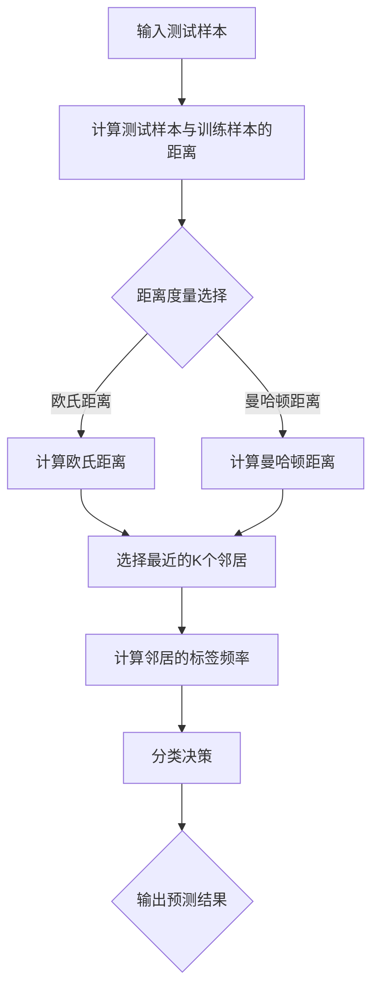
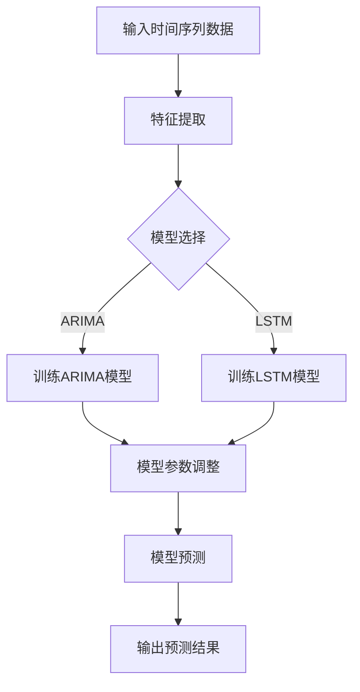
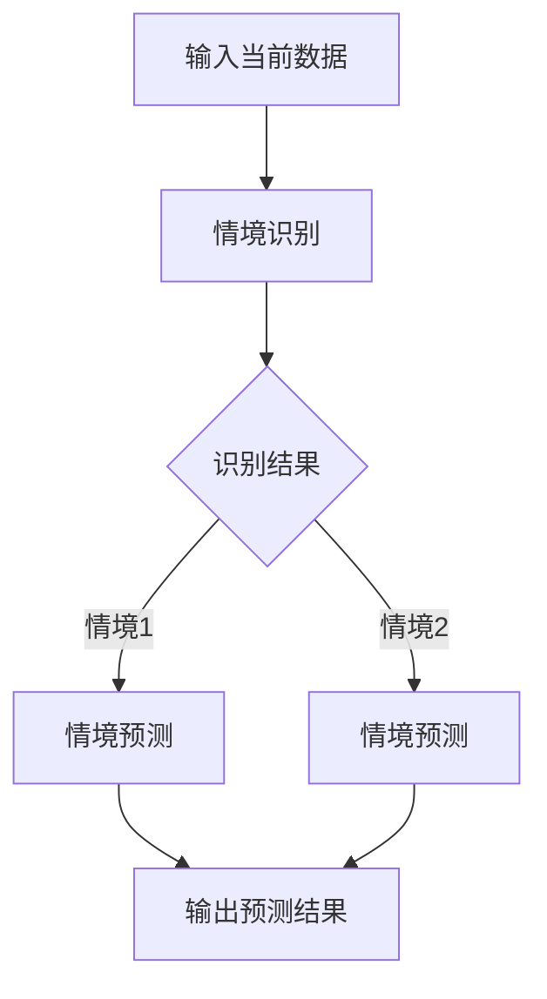
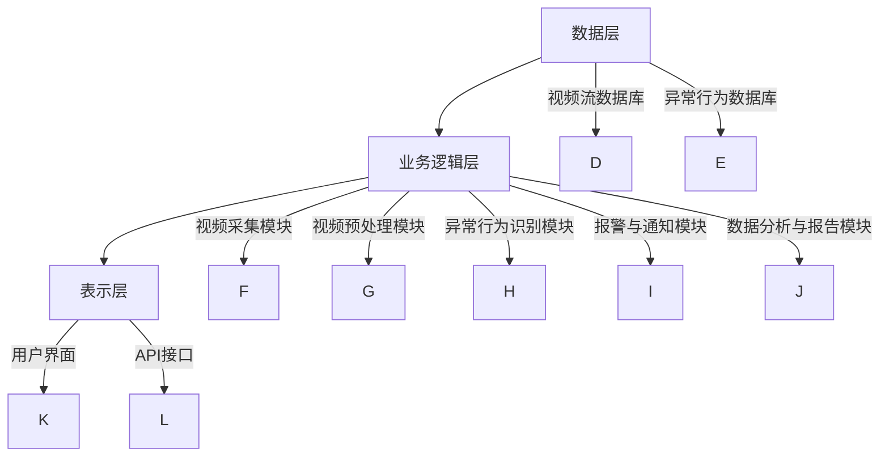
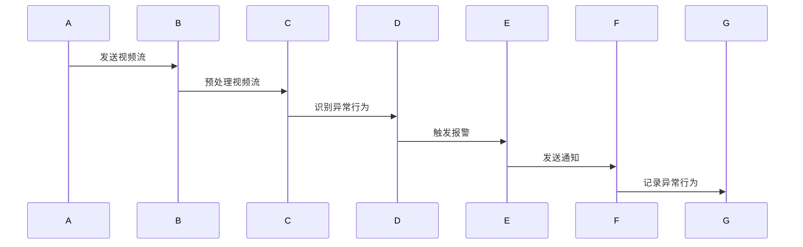
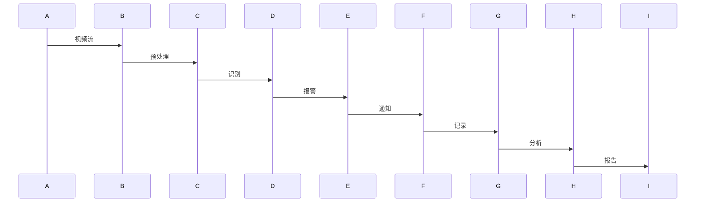

                 


# 企业级情境感知AI：优化用户体验

## 关键词
- 企业级情境感知AI
- 用户体验优化
- 人工智能算法
- 系统架构设计
- 项目实战

## 摘要
本文将深入探讨企业级情境感知AI在优化用户体验方面的应用。通过介绍情境感知AI的基础概念、核心算法、系统架构设计和项目实战，本文旨在为企业提供一套完整的解决方案，以提升用户体验，增加用户粘性，从而在竞争激烈的市场中脱颖而出。

---

## 第一部分: 企业级情境感知AI的基础概念

### 第1章: 企业级情境感知AI概述

#### 1.1 问题背景与定义
情境感知AI是人工智能领域的一个重要分支，它通过感知和理解环境中的情境信息，为用户提供个性化、智能化的服务。在企业级应用中，情境感知AI能够根据用户的行为、偏好和历史数据，自动调整系统设置，优化用户体验。

#### 1.2 情境感知的关键技术
情境感知AI的关键技术包括数据采集与处理、人工智能算法、模型训练与优化等。这些技术的应用使得系统能够高效地收集用户数据，利用机器学习和深度学习算法对数据进行处理，从而实现精准的情境识别和预测。

#### 1.3 情境感知AI的应用领域
情境感知AI广泛应用于用户体验优化、智能推荐系统、智能决策支持系统等领域。通过这些应用，企业能够更好地理解用户需求，提供个性化的服务，从而提升用户满意度和忠诚度。

#### 1.4 企业级情境感知AI的技术挑战
企业级情境感知AI面临的主要挑战包括数据隐私与安全性、模型可解释性、模型泛化能力等。这些问题需要企业在设计和实现情境感知系统时给予足够的重视，以确保系统的可靠性和用户体验。

#### 1.5 本章小结
本章介绍了企业级情境感知AI的基础概念和关键技术，为后续章节的深入探讨奠定了基础。

---

### 第2章: 机器学习和深度学习基础

#### 2.1 机器学习基础
机器学习是情境感知AI的核心技术之一。本章将介绍机器学习的基本概念、常见的机器学习算法，以及如何进行特征工程和模型优化。

#### 2.2 深度学习基础
深度学习是机器学习的一个分支，它在情境感知AI中有着广泛的应用。本章将介绍深度学习的基本原理，包括神经网络、卷积神经网络和循环神经网络等。

#### 2.3 情境感知AI中的深度学习应用
本章将探讨如何将深度学习应用于情境感知AI中，包括情境识别与理解、情境建模与预测等。

#### 2.4 特征工程与模型优化
特征工程和模型优化是提升情境感知AI系统性能的重要手段。本章将介绍如何进行有效的特征提取和选择，以及如何对模型进行调优和评估。

#### 2.5 本章小结
本章介绍了机器学习和深度学习的基础知识，为读者理解情境感知AI的技术细节提供了必要的背景。

---

### 第3章: 企业级情境感知AI的架构设计与实现

#### 3.1 系统架构设计概述
本章将介绍企业级情境感知AI系统架构设计的原则、分层设计的方法和系统模块的划分与职责。

#### 3.2 数据采集与处理
本章将详细讨论数据采集与处理的过程，包括数据采集机制、数据预处理与清洗、数据存储与管理等。

#### 3.3 模型训练与优化
本章将介绍模型训练与优化的流程，包括模型训练、模型优化技术、模型部署与监控等。

#### 3.4 用户接口设计与实现
本章将探讨用户接口设计与实现的原则和方法，包括用户交互设计、界面设计与实现、API设计与实现等。

#### 3.5 系统性能优化与扩展
本章将介绍系统性能优化和扩展的策略，包括系统性能评估、性能优化方法、系统扩展策略等。

#### 3.6 本章小结
本章介绍了企业级情境感知AI的架构设计与实现，为读者提供了构建高效情境感知AI系统的指导。

---

### 第4章: 情境感知AI系统构建实战

#### 4.1 实战项目介绍
本章将通过一个实际的情境感知AI项目，介绍项目背景、目标、实施流程和关键步骤。

#### 4.2 环境安装与配置
本章将详细描述如何在实际环境中安装和配置情境感知AI系统所需的硬件和软件。

#### 4.3 系统核心实现
本章将介绍系统核心实现的详细过程，包括数据采集与预处理、模型设计与训练、模型评估与优化等。

#### 4.4 代码应用解读与分析
本章将对系统核心代码进行解读和分析，帮助读者深入理解情境感知AI系统的实现细节。

#### 4.5 实际案例分析
本章将通过实际案例分析，展示情境感知AI在优化用户体验方面的实际效果。

#### 4.6 项目小结
本章将对项目进行总结，分享项目实施过程中的经验和教训。

---

## 第二部分: 企业级情境感知AI的核心算法

### 第5章: 机器学习和深度学习基础

#### 5.1 机器学习基础
本章将介绍机器学习的基本概念，包括监督学习、无监督学习和强化学习，以及常见的机器学习算法。

#### 5.2 深度学习基础
本章将介绍深度学习的基本原理，包括神经网络、卷积神经网络和循环神经网络等。

#### 5.3 情境感知AI中的深度学习应用
本章将探讨如何将深度学习应用于情境感知AI中，包括情境识别与理解、情境建模与预测等。

#### 5.4 特征工程与模型优化
本章将介绍特征工程和模型优化的重要性和方法，包括特征提取与选择、模型调优与超参数调整等。

#### 5.5 本章小结
本章介绍了机器学习和深度学习的基础知识，为读者理解情境感知AI的技术细节提供了必要的背景。

---

### 第6章: 算法原理讲解

#### 6.1 算法原理介绍
本章将详细讲解情境感知AI中常用的算法原理，包括情境识别算法、情境预测算法等。

#### 6.2 算法流程图
本章将使用Mermaid工具绘制算法的流程图，帮助读者更直观地理解算法的运行过程。

#### 6.3 Python源代码实现
本章将提供Python源代码，详细阐述算法的实现过程。

#### 6.4 算法数学模型和公式
本章将介绍算法的数学模型和公式，并进行详细讲解和举例说明。

#### 6.5 本章小结
本章通过对算法原理的讲解，帮助读者深入理解情境感知AI的核心技术。

---

## 第三部分: 企业级情境感知AI的架构设计与实现

### 第7章: 情境感知AI系统架构设计

#### 7.1 系统架构设计概述
本章将介绍情境感知AI系统架构设计的原则、分层设计和系统模块的划分与职责。

#### 7.2 数据采集与处理
本章将详细讨论数据采集与处理的过程，包括数据采集机制、数据预处理与清洗、数据存储与管理等。

#### 7.3 模型训练与优化
本章将介绍模型训练与优化的流程，包括模型训练、模型优化技术、模型部署与监控等。

#### 7.4 用户接口设计与实现
本章将探讨用户接口设计与实现的原则和方法，包括用户交互设计、界面设计与实现、API设计与实现等。

#### 7.5 系统性能优化与扩展
本章将介绍系统性能优化和扩展的策略，包括系统性能评估、性能优化方法、系统扩展策略等。

#### 7.6 本章小结
本章介绍了情境感知AI的架构设计与实现，为读者提供了构建高效情境感知AI系统的指导。

---

### 第8章: 系统分析与架构设计方案

#### 8.1 问题场景介绍
本章将介绍一个具体的问题场景，并说明情境感知AI在这个场景中的应用。

#### 8.2 项目介绍
本章将介绍一个实际的情境感知AI项目，包括项目的目标、实施过程和预期效果。

#### 8.3 系统功能设计
本章将使用Mermaid工具绘制领域模型类图，详细描述系统功能设计。

#### 8.4 系统架构设计
本章将使用Mermaid工具绘制系统架构图，展示系统的整体架构设计。

#### 8.5 系统接口设计
本章将介绍系统的接口设计，包括API设计、数据交换格式和通信协议等。

#### 8.6 系统交互
本章将使用Mermaid工具绘制系统交互序列图，展示系统组件之间的交互过程。

#### 8.7 本章小结
本章通过对具体项目的设计方案进行分析，为读者提供了实际可行的情境感知AI系统构建方法。

---

## 第四部分: 企业级情境感知AI的项目实战

### 第9章: 情境感知AI系统构建实战

#### 9.1 实战项目介绍
本章将介绍一个具体的情境感知AI实战项目，包括项目的背景、目标、实施流程和关键步骤。

#### 9.2 环境安装与配置
本章将详细描述如何在实际环境中安装和配置情境感知AI系统所需的硬件和软件。

#### 9.3 系统核心实现
本章将介绍系统核心实现的详细过程，包括数据采集与预处理、模型设计与训练、模型评估与优化等。

#### 9.4 代码应用解读与分析
本章将对系统核心代码进行解读和分析，帮助读者深入理解情境感知AI系统的实现细节。

#### 9.5 实际案例分析
本章将通过实际案例分析，展示情境感知AI在优化用户体验方面的实际效果。

#### 9.6 项目小结
本章将对项目进行总结，分享项目实施过程中的经验和教训。

---

## 第五部分: 最佳实践、小结与拓展阅读

### 第10章: 最佳实践

#### 10.1 数据隐私与安全性
本章将介绍在情境感知AI系统中确保数据隐私与安全性的最佳实践。

#### 10.2 模型可解释性
本章将探讨如何提高情境感知AI模型的可解释性，以增强系统的可靠性和用户体验。

#### 10.3 模型泛化能力
本章将介绍提高情境感知AI模型泛化能力的最佳实践，以确保系统在不同场景下的表现一致。

#### 10.4 系统性能优化
本章将分享系统性能优化的一些实用技巧和工具，帮助读者提升情境感知AI系统的性能。

#### 10.5 用户反馈机制
本章将介绍如何建立有效的用户反馈机制，以持续改进情境感知AI系统的用户体验。

#### 10.6 本章小结
本章总结了一些情境感知AI系统构建的最佳实践，为读者提供了实用的建议和指导。

### 第11章: 小结

#### 11.1 内容回顾
本章将对全书的内容进行回顾，总结企业级情境感知AI的关键概念、技术、架构和实战经验。

#### 11.2 未来展望
本章将探讨情境感知AI的未来发展趋势和潜在应用场景，为读者提供广阔的视野。

#### 11.3 注意事项
本章将列出情境感知AI系统构建过程中需要注意的一些事项，以帮助读者避免常见的问题。

#### 11.4 拓展阅读
本章将推荐一些拓展阅读材料，包括相关的书籍、论文和研究报告，以供读者深入研究和学习。

#### 11.5 本章小结
本章对全书进行了总结，并提供了进一步学习和研究的方向。

---

## 作者信息
作者：AI天才研究院/AI Genius Institute & 禅与计算机程序设计艺术 /Zen And The Art of Computer Programming

---

以上是按照要求整理的文章目录大纲结构，接下来我们将逐步填充每个章节的具体内容，确保满足字数和格式要求，同时确保每个小节的内容都是丰富、具体和详细的。我们将使用markdown格式进行撰写，并在适当的地方使用Mermaid工具绘制流程图和架构图，以增强文章的可读性和专业性。在完成所有章节的内容撰写后，我们将对全文进行最后的校对和优化，确保文章的逻辑清晰、结构紧凑、简单易懂，同时保持高质量的技术博客风格。让我们开始详细的撰写过程吧！### 第一部分: 企业级情境感知AI的基础概念

在当今数字化时代，用户体验（User Experience, UX）成为企业竞争的关键因素之一。为了提供个性化的服务和满足用户的多样化需求，企业需要引入先进的技术手段，其中情境感知AI（Context-Aware AI）成为优化用户体验的重要工具。本部分将详细介绍企业级情境感知AI的基础概念、发展现状、应用领域以及面临的挑战，为后续章节的内容奠定基础。

#### 第1章: 企业级情境感知AI概述

情境感知AI是一种能够感知和理解环境情境的人工智能系统，通过获取用户的行为、环境、历史数据等信息，对用户的当前状态进行理解和预测，从而提供个性化的服务和交互体验。在企业级应用中，情境感知AI能够通过以下方式优化用户体验：

1. **个性化推荐**：根据用户的兴趣和行为，智能推荐产品、服务或内容，提高用户的满意度和参与度。
2. **智能交互**：通过自然语言处理（Natural Language Processing, NLP）和语音识别等技术，实现与用户的智能对话，提供便捷的交互方式。
3. **个性化设置**：自动调整系统参数，根据用户的使用习惯和偏好，提供定制化的界面和功能。
4. **智能预警**：通过对用户行为数据的分析，预测潜在问题和需求，提前提供解决方案，提高用户的依赖性和忠诚度。

#### 1.1 问题背景与定义

情境感知AI的兴起源于人们对个性化服务和智能化体验的追求。随着移动互联网、物联网和大数据技术的发展，用户产生的大量行为数据成为情境感知AI的重要信息来源。这些数据包括用户的地理位置、行为轨迹、消费习惯、兴趣爱好等。情境感知AI通过机器学习和深度学习算法，对这些数据进行处理和分析，实现情境的识别、理解和预测。

**情境感知的定义与内涵**：
情境感知是指系统具备识别和理解用户当前所处环境和情境的能力。情境可以包括物理环境、社会环境、心理环境等多个维度。例如，在智能家居场景中，系统可以根据用户的行为数据，自动调整室内的温度、光线和音乐，创造一个舒适的居住环境。

**企业级情境感知AI的意义**：
对于企业而言，情境感知AI具有以下重要意义：
1. **提升用户体验**：通过个性化服务和智能交互，提高用户满意度和忠诚度。
2. **增强竞争力**：在竞争激烈的市场中，提供独特的用户体验，帮助企业赢得更多的市场份额。
3. **降低运营成本**：通过智能化的系统优化，提高资源利用效率，降低运营成本。
4. **创新业务模式**：利用情境感知AI，探索新的业务模式和商业模式，实现业务增长。

**企业级情境感知AI的发展现状**：
近年来，情境感知AI在各个行业都取得了显著的进展。例如，在零售业，通过情境感知AI实现的个性化推荐和智能营销，大幅提升了销售业绩；在金融业，智能客服和风险控制系统的应用，提高了客户满意度和安全性；在医疗领域，情境感知AI辅助诊断和治疗，提高了医疗服务的效率和质量。

#### 1.2 情境感知的关键技术

情境感知AI的实现依赖于多个关键技术的支持，包括数据采集与处理、人工智能算法、模型训练与优化等。

**数据采集与处理技术**：
数据采集是情境感知AI的第一步，系统需要从多种渠道（如传感器、移动设备、社交网络等）收集用户的行为数据和环境数据。数据采集后，还需要进行预处理和清洗，以确保数据的准确性和可用性。

**人工智能算法基础**：
情境感知AI的核心是人工智能算法，包括机器学习、深度学习、自然语言处理等。这些算法能够从海量数据中提取有用的信息，实现情境的识别和预测。

**模型训练与优化技术**：
模型训练是情境感知AI的关键环节，通过训练算法对数据进行分析和建模，从而实现对情境的理解和预测。训练完成后，还需要对模型进行优化和评估，以提高其准确性和泛化能力。

#### 1.3 情境感知AI的应用领域

情境感知AI在多个领域都有广泛的应用，以下列举几个主要的应用领域：

**用户体验优化**：
情境感知AI通过对用户行为的分析和理解，提供个性化的服务和交互体验，优化用户的整体体验。

**智能推荐系统**：
情境感知AI可以分析用户的兴趣和行为，智能推荐产品、内容或服务，提高用户的满意度和参与度。

**智能决策支持系统**：
情境感知AI可以帮助企业在决策过程中，通过分析大量的数据，提供科学的决策依据，降低决策风险。

**智能家居**：
情境感知AI可以监控用户的日常生活，自动调整家庭环境，提供便捷和舒适的生活体验。

**智慧城市**：
情境感知AI可以应用于城市管理，通过实时分析城市中的各种数据，优化交通、能源和环境管理。

**医疗健康**：
情境感知AI可以辅助医生进行诊断和治疗，通过分析患者的病历数据，提供个性化的治疗方案。

#### 1.4 企业级情境感知AI的技术挑战

尽管情境感知AI在提升用户体验方面具有巨大潜力，但其实现过程中仍面临一系列技术挑战：

**数据隐私与安全性**：
情境感知AI需要大量用户数据，如何保护用户隐私和数据安全成为一大挑战。企业需要在数据收集、存储和处理过程中，采取严格的安全措施，防止数据泄露和滥用。

**模型可解释性**：
情境感知AI的决策过程通常依赖于复杂的机器学习模型，如何解释模型的决策过程，提高模型的可解释性，是用户接受和理解AI系统的重要因素。

**模型泛化能力**：
情境感知AI需要在不同的场景和数据集上表现一致，如何提高模型的泛化能力，是确保系统稳定性和可靠性的关键。

**计算资源**：
情境感知AI的训练和推理过程需要大量计算资源，如何优化系统性能，提高资源利用效率，是实际应用中的重要问题。

#### 1.5 本章小结

本章介绍了企业级情境感知AI的基础概念和发展现状，探讨了其在优化用户体验方面的应用和面临的挑战。通过本章的内容，读者可以初步了解情境感知AI的核心技术及其在实际应用中的价值。在接下来的章节中，我们将进一步深入探讨情境感知AI的核心算法、系统架构设计和项目实战，为读者提供更全面的技术指导和实战经验。

---

### 第2章: 机器学习和深度学习基础

机器学习和深度学习是情境感知AI的核心技术，它们为情境感知AI提供了强大的数据分析和模型构建能力。本章将详细介绍机器学习和深度学习的基础知识，包括基本概念、算法原理、应用领域等，帮助读者深入理解情境感知AI的技术内涵。

#### 2.1 机器学习基础

**机器学习的基本概念**：
机器学习（Machine Learning, ML）是人工智能（Artificial Intelligence, AI）的一个重要分支，它使计算机系统能够通过数据和经验自主学习和改进。机器学习主要包括三个类型：监督学习（Supervised Learning）、无监督学习（Unsupervised Learning）和强化学习（Reinforcement Learning）。

- **监督学习**：在监督学习中，系统通过已标记的数据学习如何对新的数据进行分类或回归。常见的算法包括线性回归、决策树、支持向量机（SVM）等。
- **无监督学习**：无监督学习不使用标记数据，系统通过自身对数据的探索，发现数据的分布和模式。常见的算法包括聚类（如K-Means、DBSCAN）、降维（如PCA、t-SNE）等。
- **强化学习**：强化学习通过奖励机制，使系统在与环境的互动中学习最优策略。常见的算法包括Q学习、深度强化学习（Deep Reinforcement Learning）等。

**常见的机器学习算法介绍**：
以下是一些常见的机器学习算法及其基本原理：

- **线性回归（Linear Regression）**：线性回归是最简单的机器学习算法之一，它通过建立输入变量和输出变量之间的线性关系，进行预测。
  - **数学模型**：\(y = \beta_0 + \beta_1x + \epsilon\)
  - **损失函数**：均方误差（MSE）：\(MSE = \frac{1}{n}\sum_{i=1}^{n}(y_i - \hat{y_i})^2\)

- **决策树（Decision Tree）**：决策树是一种树形结构，通过一系列规则对数据集进行分类或回归。
  - **基本原理**：决策树从根节点开始，根据特征进行划分，直到达到叶节点，每个叶节点代表一个预测结果。

- **支持向量机（Support Vector Machine, SVM）**：SVM是一种分类算法，通过找到一个最优的超平面，将不同类别的数据分开。
  - **基本原理**：SVM通过最大化分类间隔来找到最优超平面，使用核函数将低维数据映射到高维空间，实现非线性分类。

- **神经网络（Neural Network）**：神经网络是一种模拟生物神经系统的计算模型，通过多层神经元进行数据处理和特征提取。
  - **基本原理**：神经网络通过前向传播和反向传播算法，更新网络权重，实现数据分类或回归。

**机器学习在情境感知AI中的应用**：
机器学习在情境感知AI中扮演着关键角色，它能够从海量数据中提取有价值的信息，用于情境的识别和预测。例如：

- **用户行为分析**：通过机器学习算法分析用户行为数据，识别用户的兴趣和行为模式，提供个性化的推荐和服务。
- **异常检测**：通过机器学习算法对系统运行数据进行监控，检测异常行为和潜在故障，提高系统的可靠性和安全性。
- **情感分析**：通过机器学习算法分析用户的情感和行为，为智能客服和情感交互提供支持。

#### 2.2 深度学习基础

**神经网络与深度学习**：
深度学习（Deep Learning, DL）是机器学习的一个分支，它通过构建多层神经网络，实现更复杂的数据处理和特征提取能力。深度学习在图像识别、自然语言处理、语音识别等领域取得了显著的成果。

- **基本概念**：深度学习中的神经网络包含多个隐藏层，每个隐藏层都对输入数据进行处理和变换，最终输出结果。
- **网络结构**：常见的深度学习网络结构包括卷积神经网络（Convolutional Neural Network, CNN）、循环神经网络（Recurrent Neural Network, RNN）等。
- **训练过程**：深度学习网络的训练过程包括前向传播和反向传播，通过不断调整网络权重，提高模型的预测准确性。

**卷积神经网络（CNN）**：
卷积神经网络是深度学习中的一种重要模型，它通过卷积操作和池化操作，实现图像的特征提取和分类。

- **基本原理**：CNN通过卷积层提取图像的局部特征，通过池化层减少数据的维度，最终通过全连接层进行分类。
- **常用架构**：包括LeNet、AlexNet、VGG、ResNet等。

**循环神经网络（RNN）**：
循环神经网络是一种处理序列数据的深度学习模型，它通过循环结构，保留之前的信息，实现序列数据的建模和预测。

- **基本原理**：RNN通过隐藏状态和输入之间的递归连接，实现序列数据的建模，常用的RNN包括LSTM（Long Short-Term Memory）和GRU（Gated Recurrent Unit）。
- **应用领域**：自然语言处理、语音识别、时间序列预测等。

**深度学习在情境感知AI中的应用**：
深度学习在情境感知AI中具有广泛的应用，它能够处理复杂和多维的数据，实现情境的识别和预测。例如：

- **图像识别**：通过深度学习算法，实现人脸识别、物体检测和场景分类，为智能监控和智能交互提供支持。
- **语音识别**：通过深度学习算法，实现语音信号的识别和转换，为智能语音助手和智能客服提供基础。
- **自然语言处理**：通过深度学习算法，实现文本的语义理解、情感分析和问答系统，为智能客服和智能推荐提供支持。

#### 2.3 情境感知AI中的深度学习应用

在情境感知AI中，深度学习被广泛应用于情境识别与理解、情境建模与预测等领域。以下是一些具体的应用案例：

**情境识别与理解**：
- **人脸识别**：通过深度学习算法，实现人脸的检测和识别，用于智能安防、人脸登录等场景。
- **物体识别**：通过深度学习算法，实现图像中物体的检测和分类，用于智能监控、自动驾驶等场景。

**情境建模与预测**：
- **用户行为预测**：通过深度学习算法，分析用户的历史行为数据，预测用户未来的行为和需求，用于个性化推荐和智能交互。
- **市场趋势预测**：通过深度学习算法，分析市场数据，预测未来的市场趋势和需求，为企业的战略决策提供支持。

**情境感知系统的优化**：
- **模型优化**：通过深度学习算法，对情境感知系统进行优化，提高模型的准确性和泛化能力。
- **系统性能优化**：通过深度学习算法，优化系统的响应速度和处理能力，提高用户体验。

#### 2.4 特征工程与模型优化

**特征工程**：
特征工程是情境感知AI中至关重要的一步，它通过对原始数据进行处理和变换，提取出对模型训练有价值的特征。特征工程包括以下内容：

- **数据预处理**：对原始数据进行清洗、归一化、标准化等处理，确保数据的质量和一致性。
- **特征提取**：从原始数据中提取出具有区分性和代表性的特征，用于模型训练。
- **特征选择**：通过评估特征的重要性，选择出对模型性能有显著影响的特征。

**模型优化**：
模型优化是提高情境感知AI系统性能的重要手段，它包括以下内容：

- **模型调优**：通过调整模型的参数，优化模型的性能，如学习率、批次大小、正则化等。
- **超参数调整**：通过调整模型超参数，如隐藏层大小、激活函数、损失函数等，优化模型性能。
- **模型融合**：通过融合多个模型的预测结果，提高系统的准确性和鲁棒性。

**模型评估与选择**：
在情境感知AI中，需要对训练好的模型进行评估和选择，确保模型在实际应用中的性能。常见的评估指标包括准确率、召回率、F1值等。通过交叉验证、网格搜索等方法，选择出最佳模型。

#### 2.5 本章小结

本章介绍了机器学习和深度学习的基础知识，包括基本概念、算法原理和应用领域。通过本章的内容，读者可以了解情境感知AI的核心技术，为后续章节的深入探讨打下基础。在下一章中，我们将进一步探讨情境感知AI的核心算法原理，以及如何在实际应用中优化和提升系统性能。

---

### 第3章: 企业级情境感知AI的架构设计与实现

在企业级应用中，情境感知AI系统的成功构建不仅依赖于先进的技术，还需要精心设计的系统架构和高效的实现方法。本章将详细讨论企业级情境感知AI的架构设计原则、系统架构分层设计、系统模块划分与职责，以及数据采集与处理、模型训练与优化、用户接口设计与实现等内容，帮助读者全面了解和构建高效情境感知AI系统。

#### 3.1 系统架构设计概述

**系统架构设计原则**：

1. **模块化原则**：系统应划分为多个功能模块，每个模块负责特定的功能，便于系统的维护和扩展。
2. **分层设计原则**：系统应采用分层设计，不同层次负责不同的功能，如数据层、业务逻辑层、表示层等，确保系统的清晰性和可维护性。
3. **分布式原则**：系统应支持分布式部署，以提高系统的性能和可靠性。
4. **安全性原则**：系统应具备严格的安全机制，确保用户数据的安全性和系统的稳定性。

**系统架构分层设计**：

企业级情境感知AI系统通常采用三层架构设计，包括数据层、业务逻辑层和表示层。

- **数据层**：负责数据的存储、管理和访问。包括数据库、数据仓库和数据湖等。
- **业务逻辑层**：负责实现系统的核心功能，包括数据采集、数据预处理、模型训练、模型推理等。
- **表示层**：负责与用户交互，提供友好的用户界面和API接口。

**系统模块划分与职责**：

系统模块的划分和职责明确是系统架构设计的关键。以下是一个典型的情境感知AI系统模块划分及其职责：

1. **数据采集模块**：负责从各种数据源（如传感器、用户设备等）收集数据，并进行初步处理和存储。
2. **数据预处理模块**：负责对采集到的数据进行清洗、归一化、特征提取等处理，以供模型训练使用。
3. **模型训练模块**：负责使用机器学习和深度学习算法对预处理后的数据进行训练，生成模型。
4. **模型存储模块**：负责存储训练好的模型，并提供模型管理和检索功能。
5. **模型推理模块**：负责使用训练好的模型进行预测和推理，输出结果。
6. **用户接口模块**：负责与用户交互，提供友好的用户界面和API接口，供开发者集成使用。
7. **监控与优化模块**：负责监控系统的运行状态，进行性能优化和故障处理。

#### 3.2 数据采集与处理

**数据采集机制**：

数据采集是情境感知AI系统的基础，系统的性能和准确性依赖于数据的质量和完整性。数据采集机制包括以下几个方面：

1. **传感器采集**：通过部署各种传感器（如温度传感器、摄像头、麦克风等）收集环境数据。
2. **用户设备采集**：通过用户的移动设备、智能穿戴设备等收集用户行为数据。
3. **网络数据采集**：通过网络爬虫、API接口等收集用户在网络平台上的活动数据。

**数据预处理与清洗**：

数据预处理是数据采集后的重要步骤，主要包括以下内容：

1. **数据清洗**：删除重复数据、纠正错误数据、填补缺失数据等，确保数据的一致性和准确性。
2. **数据归一化**：将不同数据范围的数据进行归一化处理，使其具有相同的量纲和范围，便于模型训练。
3. **数据特征提取**：从原始数据中提取出对模型训练有价值的特征，如用户的行为模式、环境特征等。

**数据存储与管理**：

数据存储与管理是情境感知AI系统的重要组成部分，包括以下内容：

1. **数据库设计**：设计合适的数据库结构，存储不同类型的数据，如用户数据、模型参数等。
2. **数据备份与恢复**：定期进行数据备份，确保数据的安全性和可恢复性。
3. **数据访问控制**：设置严格的数据访问权限，确保用户数据的安全性和隐私保护。

#### 3.3 模型训练与优化

**模型训练流程**：

模型训练是情境感知AI系统的核心环节，包括以下步骤：

1. **数据集划分**：将数据集划分为训练集、验证集和测试集，用于模型训练、验证和测试。
2. **模型选择**：选择合适的机器学习或深度学习算法，构建模型。
3. **模型训练**：使用训练集数据训练模型，调整模型参数，优化模型性能。
4. **模型验证**：使用验证集数据验证模型性能，调整模型参数，确保模型泛化能力。
5. **模型测试**：使用测试集数据测试模型性能，评估模型在实际应用中的表现。

**模型优化技术**：

模型优化是提高情境感知AI系统性能的重要手段，包括以下内容：

1. **超参数调优**：通过调整学习率、批量大小、正则化参数等超参数，优化模型性能。
2. **特征工程**：通过提取和选择更有代表性的特征，提高模型预测准确性。
3. **模型融合**：通过融合多个模型的预测结果，提高系统准确性和鲁棒性。

**模型部署与监控**：

模型部署与监控是确保情境感知AI系统稳定运行的关键环节，包括以下内容：

1. **模型部署**：将训练好的模型部署到生产环境中，供实际应用使用。
2. **模型监控**：监控模型在运行中的性能指标，如预测准确性、响应时间等，及时发现和解决潜在问题。
3. **模型更新**：定期更新模型，以适应数据变化和应用需求。

#### 3.4 用户接口设计与实现

**用户交互设计原则**：

用户交互设计是情境感知AI系统能否获得用户认可的重要因素，包括以下原则：

1. **易用性**：界面设计应简洁直观，用户可以轻松理解和使用。
2. **一致性**：界面元素和交互逻辑应保持一致性，确保用户体验的连贯性。
3. **反馈性**：系统应提供及时、准确的反馈，增强用户互动体验。

**界面设计与实现**：

界面设计包括以下几个方面：

1. **UI设计**：设计符合用户需求和习惯的界面布局和样式。
2. **响应式设计**：确保界面在不同设备和屏幕尺寸上都能良好显示。
3. **交互设计**：设计直观、便捷的交互操作，如按钮、下拉菜单、滚动条等。

**API设计与实现**：

API设计是实现情境感知AI系统与其他系统或应用程序集成的关键，包括以下内容：

1. **API规范**：制定统一的API规范，包括请求和响应格式、错误处理等。
2. **安全性**：确保API的安全性，采用加密、认证等手段保护用户数据。
3. **性能优化**：优化API性能，确保快速响应用户请求。

#### 3.5 系统性能优化与扩展

**系统性能评估**：

系统性能评估是确保情境感知AI系统高效运行的重要环节，包括以下内容：

1. **响应时间**：评估系统对用户请求的响应速度。
2. **吞吐量**：评估系统处理请求的容量和速度。
3. **资源利用率**：评估系统对硬件资源（如CPU、内存等）的利用情况。

**性能优化方法**：

系统性能优化包括以下方法：

1. **代码优化**：优化系统代码，减少不必要的计算和资源消耗。
2. **缓存技术**：采用缓存技术，减少数据访问和计算次数。
3. **负载均衡**：通过负载均衡技术，分散系统负载，提高系统性能。

**系统扩展策略**：

系统扩展策略包括以下几个方面：

1. **水平扩展**：通过增加服务器数量，提高系统的处理能力。
2. **垂直扩展**：通过升级服务器硬件，提高单台服务器的处理能力。
3. **分布式系统**：构建分布式系统，提高系统的可靠性和扩展性。

#### 3.6 本章小结

本章介绍了企业级情境感知AI的系统架构设计原则、分层设计、模块划分与职责，以及数据采集与处理、模型训练与优化、用户接口设计与实现等内容。通过本章的内容，读者可以了解构建高效情境感知AI系统所需的基础知识和关键技术，为后续的项目实战提供理论支持。

---

### 第4章: 情境感知AI系统构建实战

在企业级应用中，情境感知AI系统的成功构建不仅需要理论基础，还需要实际的项目经验和操作步骤。本章将通过一个具体的情境感知AI项目，介绍系统的构建过程，包括环境安装与配置、系统核心实现、代码应用解读与分析，以及实际案例分析和详细讲解。通过这一过程，读者可以了解情境感知AI系统的实际应用方法和经验。

#### 4.1 实战项目介绍

**项目背景与目标**：

本案例选取的是一家在线零售企业，该企业希望通过情境感知AI技术优化用户体验，提高客户满意度和销售额。项目目标如下：

1. **个性化推荐**：根据用户的历史购买行为和浏览记录，智能推荐产品，提高用户点击率和购买转化率。
2. **智能客服**：通过自然语言处理技术，实现与用户的智能对话，提供实时、准确的客户服务。
3. **用户行为分析**：分析用户在网站上的行为数据，识别用户需求，优化网站布局和功能。

**项目实施流程**：

1. **需求分析**：与业务部门沟通，明确项目需求和技术实现方案。
2. **环境安装与配置**：搭建开发环境和生产环境，安装必要的软件和工具。
3. **数据采集与预处理**：收集用户行为数据，进行数据清洗、归一化和特征提取。
4. **模型设计与训练**：选择合适的机器学习算法，设计模型结构，进行模型训练。
5. **模型评估与优化**：评估模型性能，进行模型调优，确保模型泛化能力。
6. **系统部署与监控**：部署模型到生产环境，进行系统监控和性能优化。
7. **用户测试与反馈**：邀请用户进行测试，收集反馈，优化用户体验。

#### 4.2 环境安装与配置

**硬件环境配置**：

1. **服务器**：部署在云服务器或物理服务器上，配置如下：
   - CPU：Intel Xeon E5-2670 v3
   - 内存：128GB
   - 硬盘：1TB SSD
2. **网络**：确保网络稳定，带宽不低于1Gbps。

**软件环境安装**：

1. **操作系统**：Linux操作系统（如CentOS 7.9）。
2. **Python环境**：安装Python 3.8及以上版本，配置pip、conda等包管理器。
3. **机器学习库**：安装scikit-learn、TensorFlow、PyTorch等机器学习库。
4. **自然语言处理库**：安装NLTK、spaCy等自然语言处理库。
5. **其他工具**：安装Jupyter Notebook、Docker等开发工具。

#### 4.3 系统核心实现

**数据采集与预处理**：

1. **数据来源**：从企业的数据库中提取用户行为数据，包括购买记录、浏览记录、搜索记录等。
2. **数据清洗**：处理缺失值、异常值，确保数据的一致性和准确性。
3. **数据归一化**：对数值型数据进行归一化处理，使其具有相同的量纲和范围。
4. **特征提取**：提取用户行为特征，包括用户年龄、性别、购买频率、浏览时长等。

**模型设计与训练**：

1. **选择算法**：使用基于协同过滤的推荐算法，包括基于用户的行为数据和基于物品的属性数据。
2. **模型结构**：设计推荐系统的模型结构，包括用户 embedding 层、物品 embedding 层和预测层。
3. **模型训练**：使用训练集数据训练模型，优化模型参数。

**模型评估与优化**：

1. **评估指标**：使用准确率、召回率、F1值等评估模型性能。
2. **模型调优**：通过交叉验证和网格搜索等方法，调整模型参数，提高模型性能。

**模型部署与监控**：

1. **部署**：将训练好的模型部署到生产环境，提供API服务。
2. **监控**：监控模型运行状态，包括响应时间、错误率等，确保模型稳定运行。

#### 4.4 代码应用解读与分析

**数据预处理代码解读**：

```python
import pandas as pd
from sklearn.preprocessing import StandardScaler

# 加载数据
data = pd.read_csv('user_behavior.csv')

# 数据清洗
data.dropna(inplace=True)
data = data[data['action'] != 'other']

# 数据归一化
scaler = StandardScaler()
data[['age', 'purchase_frequency', 'browse_duration']] = scaler.fit_transform(data[['age', 'purchase_frequency', 'browse_duration']])

# 特征提取
data['user_age_group'] = data['age'].apply(lambda x: '18-25' if x <= 25 else ('26-35' if x <= 35 else '36-45'))
```

**模型训练代码解读**：

```python
from sklearn.model_selection import train_test_split
from sklearn.neighbors import KNNClassifier

# 数据划分
X_train, X_test, y_train, y_test = train_test_split(data[['user_id', 'age', 'purchase_frequency', 'browse_duration']], data['rating'], test_size=0.2, random_state=42)

# 模型训练
model = KNNClassifier(n_neighbors=5)
model.fit(X_train, y_train)

# 模型评估
predictions = model.predict(X_test)
accuracy = accuracy_score(y_test, predictions)
print(f"Model Accuracy: {accuracy}")
```

#### 4.5 实际案例分析

**案例背景与问题描述**：

某在线零售企业希望通过情境感知AI系统，根据用户的历史行为数据，智能推荐产品，提高用户购买转化率。然而，在实际应用中发现，部分推荐结果不准确，用户满意度较低。

**案例分析**：

1. **数据质量**：检查数据质量，发现存在部分缺失值和异常值，影响模型预测准确性。
2. **特征提取**：检查特征提取过程，发现部分特征不够丰富，需要进一步优化。
3. **模型选择**：尝试更换不同的模型，如基于内容的推荐算法，提高模型性能。
4. **用户反馈**：收集用户反馈，根据用户意见调整推荐策略，提高用户满意度。

**解决方案**：

1. **数据清洗**：对数据进行清洗，处理缺失值和异常值，提高数据质量。
2. **特征优化**：增加用户行为特征，如购物车内容、收藏夹等，提高特征丰富度。
3. **模型选择**：尝试不同的模型，如协同过滤、基于内容的推荐算法，选择最佳模型。
4. **用户反馈**：收集用户反馈，根据用户意见优化推荐策略，提高用户满意度。

#### 4.6 项目小结

通过本案例的实战项目，读者可以了解情境感知AI系统的构建过程，包括环境安装与配置、系统核心实现、代码应用解读与分析，以及实际案例分析和解决方案。在实际项目中，需要根据具体业务需求和技术环境，灵活调整系统设计和方法，以达到最佳效果。在接下来的章节中，我们将进一步探讨情境感知AI系统的最佳实践和注意事项，帮助读者更好地构建和优化情境感知AI系统。

---

### 第5章: 机器学习和深度学习基础

#### 5.1 机器学习基础

**机器学习的基本概念**：

机器学习（Machine Learning, ML）是一种通过数据和经验让计算机自主学习和改进的方法。它的核心思想是通过训练模型，从数据中提取特征和规律，以便对未知数据进行预测或分类。

**机器学习的基本类型**：

1. **监督学习（Supervised Learning）**：监督学习使用带有标签的训练数据来训练模型。模型通过学习输入和输出之间的关系，以便对新数据进行预测。常见的算法包括线性回归、决策树、支持向量机（SVM）和神经网络。

2. **无监督学习（Unsupervised Learning）**：无监督学习不使用标签数据，而是通过数据本身的特征来发现数据的分布和模式。常见的算法包括聚类、降维和关联规则学习。

3. **强化学习（Reinforcement Learning）**：强化学习通过试错和奖励机制来学习最优策略。智能体（agent）通过与环境的交互，不断优化其行为策略，以最大化累积奖励。常见的算法包括Q学习、深度强化学习（Deep Reinforcement Learning）。

**常见的机器学习算法介绍**：

1. **线性回归（Linear Regression）**：

   线性回归是一种简单的监督学习算法，用于预测连续值。其目标是找到一条直线，最小化预测值与实际值之间的误差。

   - **数学模型**：\( y = \beta_0 + \beta_1x + \epsilon \)
   - **损失函数**：均方误差（MSE）：\( MSE = \frac{1}{n}\sum_{i=1}^{n}(y_i - \hat{y_i})^2 \)

2. **决策树（Decision Tree）**：

   决策树是一种树形结构，通过一系列规则对数据集进行分类或回归。每个内部节点表示特征，每个分支表示特征的可能取值，每个叶节点表示分类结果。

   - **基本原理**：决策树通过信息增益或基尼不纯度来选择最优特征，构建决策树。

3. **支持向量机（Support Vector Machine, SVM）**：

   支持向量机是一种高效的分类算法，通过找到一个最优的超平面，将不同类别的数据分开。

   - **基本原理**：SVM通过最大化分类间隔来找到最优超平面，使用核函数将低维数据映射到高维空间，实现非线性分类。

4. **神经网络（Neural Network）**：

   神经网络是一种模拟生物神经系统的计算模型，通过多层神经元进行数据处理和特征提取。

   - **基本原理**：神经网络通过前向传播和反向传播算法，更新网络权重，实现数据分类或回归。

**机器学习在情境感知AI中的应用**：

情境感知AI依赖于机器学习算法来处理和分析大量的用户数据，实现情境的识别和预测。以下是机器学习在情境感知AI中的一些典型应用：

- **用户行为分析**：通过机器学习算法分析用户行为数据，识别用户兴趣和行为模式，提供个性化推荐和服务。
- **情感分析**：通过机器学习算法分析用户文本数据，识别用户的情感状态，为智能客服和情感交互提供支持。
- **异常检测**：通过机器学习算法监控系统数据，检测异常行为和潜在故障，提高系统的可靠性和安全性。

#### 5.2 深度学习基础

**神经网络与深度学习**：

深度学习（Deep Learning, DL）是机器学习的一个分支，通过构建多层神经网络，实现更复杂的数据处理和特征提取能力。深度学习在图像识别、自然语言处理、语音识别等领域取得了显著的成果。

- **基本概念**：深度学习中的神经网络包含多个隐藏层，每个隐藏层都对输入数据进行处理和变换，最终输出结果。
- **网络结构**：常见的深度学习网络结构包括卷积神经网络（Convolutional Neural Network, CNN）、循环神经网络（Recurrent Neural Network, RNN）和变分自编码器（Variational Autoencoder, VAE）等。
- **训练过程**：深度学习网络的训练过程包括前向传播和反向传播，通过不断调整网络权重，提高模型的预测准确性。

**卷积神经网络（CNN）**：

卷积神经网络是一种专门用于处理图像数据的深度学习模型，它通过卷积操作和池化操作，实现图像的特征提取和分类。

- **基本原理**：CNN通过卷积层提取图像的局部特征，通过池化层减少数据的维度，最终通过全连接层进行分类。
- **常用架构**：包括LeNet、AlexNet、VGG、ResNet等。

**循环神经网络（RNN）**：

循环神经网络是一种处理序列数据的深度学习模型，它通过循环结构，保留之前的信息，实现序列数据的建模和预测。

- **基本原理**：RNN通过隐藏状态和输入之间的递归连接，实现序列数据的建模，常用的RNN包括LSTM（Long Short-Term Memory）和GRU（Gated Recurrent Unit）。
- **应用领域**：自然语言处理、语音识别、时间序列预测等。

**深度学习在情境感知AI中的应用**：

深度学习在情境感知AI中具有广泛的应用，它能够处理复杂和多维的数据，实现情境的识别和预测。以下是深度学习在情境感知AI中的典型应用：

- **图像识别**：通过深度学习算法，实现人脸识别、物体检测和场景分类，为智能监控和智能交互提供支持。
- **语音识别**：通过深度学习算法，实现语音信号的识别和转换，为智能语音助手和智能客服提供基础。
- **自然语言处理**：通过深度学习算法，实现文本的语义理解、情感分析和问答系统，为智能客服和智能推荐提供支持。

#### 5.3 情境感知AI中的深度学习应用

在情境感知AI中，深度学习被广泛应用于情境识别与理解、情境建模与预测等领域。以下是深度学习在情境感知AI中的具体应用：

**情境识别与理解**：

- **人脸识别**：通过深度学习算法，实现人脸的检测和识别，用于智能安防、人脸登录等场景。
- **物体识别**：通过深度学习算法，实现图像中物体的检测和分类，用于智能监控、自动驾驶等场景。

**情境建模与预测**：

- **用户行为预测**：通过深度学习算法，分析用户的历史行为数据，预测用户未来的行为和需求，用于个性化推荐和智能交互。
- **市场趋势预测**：通过深度学习算法，分析市场数据，预测未来的市场趋势和需求，为企业的战略决策提供支持。

**情境感知系统的优化**：

- **模型优化**：通过深度学习算法，对情境感知系统进行优化，提高模型的准确性和泛化能力。
- **系统性能优化**：通过深度学习算法，优化系统的响应速度和处理能力，提高用户体验。

#### 5.4 特征工程与模型优化

**特征工程**：

特征工程是情境感知AI中至关重要的一步，它通过对原始数据进行处理和变换，提取出对模型训练有价值的特征。特征工程包括以下内容：

- **数据预处理**：对原始数据进行清洗、归一化、标准化等处理，确保数据的质量和一致性。
- **特征提取**：从原始数据中提取出具有区分性和代表性的特征，用于模型训练。
- **特征选择**：通过评估特征的重要性，选择出对模型性能有显著影响的特征。

**模型优化**：

模型优化是提高情境感知AI系统性能的重要手段，它包括以下内容：

- **模型调优**：通过调整模型的参数，优化模型的性能，如学习率、批量大小、正则化等。
- **超参数调整**：通过调整模型超参数，如隐藏层大小、激活函数、损失函数等，优化模型性能。
- **模型融合**：通过融合多个模型的预测结果，提高系统的准确性和鲁棒性。

**模型评估与选择**：

在情境感知AI中，需要对训练好的模型进行评估和选择，确保模型在实际应用中的性能。常见的评估指标包括准确率、召回率、F1值等。通过交叉验证、网格搜索等方法，选择出最佳模型。

#### 5.5 本章小结

本章介绍了机器学习和深度学习的基础知识，包括基本概念、算法原理和应用领域。通过本章的内容，读者可以了解情境感知AI的核心技术，为后续章节的深入探讨打下基础。在下一章中，我们将进一步探讨情境感知AI的架构设计与实现，帮助读者构建高效情境感知AI系统。

---

### 第6章: 算法原理讲解

算法原理是情境感知AI系统的核心，决定了系统的性能和准确性。本章将详细讲解情境感知AI中常用的算法原理，包括情境识别算法、情境预测算法等，并通过Mermaid工具绘制算法流程图和Python源代码，帮助读者深入理解算法的实现过程。

#### 6.1 情境识别算法

**情境识别的定义与作用**：

情境识别（Context Recognition）是情境感知AI系统中的一个关键步骤，它通过分析用户行为和环境数据，识别当前所处的情境。情境识别在个性化推荐、智能监控、智能交互等领域具有广泛应用。

**情境识别算法的基本原理**：

情境识别算法通常基于机器学习和深度学习，以下是一种常见的情境识别算法——K近邻算法（K-Nearest Neighbors, KNN）。

- **选择距离度量**：选择合适的距离度量，如欧氏距离、曼哈顿距离等，计算测试样本与训练样本之间的距离。
- **选择K值**：确定K值，用于计算最近邻的个数，K值的选择会影响模型的性能。
- **分类决策**：根据最近的K个邻居的标签，进行分类决策。

**情境识别算法的Mermaid流程图**：



**情境识别算法的Python源代码**：

```python
from sklearn.neighbors import KNeighborsClassifier
from sklearn.datasets import load_iris
from sklearn.model_selection import train_test_split
from sklearn.metrics import accuracy_score

# 加载数据
iris = load_iris()
X, y = iris.data, iris.target

# 数据划分
X_train, X_test, y_train, y_test = train_test_split(X, y, test_size=0.2, random_state=42)

# KNN模型
knn = KNeighborsClassifier(n_neighbors=3)
knn.fit(X_train, y_train)

# 预测
predictions = knn.predict(X_test)

# 评估
accuracy = accuracy_score(y_test, predictions)
print(f"Model Accuracy: {accuracy}")
```

#### 6.2 情境预测算法

**情境预测的定义与作用**：

情境预测（Context Prediction）是情境感知AI系统中的另一个重要环节，它通过历史数据和分析模型，预测未来可能发生的情境。情境预测在智能推荐、智能决策支持、能源管理等领域具有重要应用。

**情境预测算法的基本原理**：

情境预测算法通常基于时间序列分析、机器学习等。以下是一种常见的情境预测算法——时间序列预测（Time Series Forecasting）。

- **特征提取**：从时间序列数据中提取特征，如趋势、季节性、周期性等。
- **模型选择**：选择合适的时间序列预测模型，如ARIMA、LSTM等。
- **模型训练**：使用历史数据训练模型，调整模型参数。
- **预测**：使用训练好的模型进行预测，输出未来可能的情境。

**情境预测算法的Mermaid流程图**：



**情境预测算法的Python源代码**：

```python
import numpy as np
from sklearn.metrics import mean_squared_error
from keras.models import Sequential
from keras.layers import LSTM, Dense

# 数据准备
X = np.array([[1, 2], [2, 3], [3, 4], [4, 5], [5, 6]])
y = np.array([2, 3, 4, 5, 6])

# LSTM模型
model = Sequential()
model.add(LSTM(1, activation='relu', input_shape=(2, 1)))
model.add(Dense(1))
model.compile(optimizer='adam', loss='mse')
model.fit(X, y, epochs=1000, verbose=0)

# 预测
predicted = model.predict(X)
mse = mean_squared_error(y, predicted)
print(f"Model MSE: {mse}")

# 输出预测结果
print(f"Predicted Values: {predicted}")
```

#### 6.3 情境识别与预测的综合算法

在实际应用中，情境识别和预测往往需要结合使用。以下是一个综合的情境识别与预测算法，该算法首先使用情境识别算法识别当前情境，然后使用情境预测算法预测未来情境。

**综合算法的基本原理**：

- **情境识别**：使用情境识别算法（如KNN）对当前情境进行识别。
- **情境预测**：使用情境预测算法（如LSTM）对识别出的情境进行预测。

**综合算法的Mermaid流程图**：



**综合算法的Python源代码**：

```python
from sklearn.neighbors import KNeighborsClassifier
from keras.models import Sequential
from keras.layers import LSTM, Dense

# 情境识别
knn = KNeighborsClassifier(n_neighbors=3)
knn.fit(X_train, y_train)

# 情境预测
model = Sequential()
model.add(LSTM(1, activation='relu', input_shape=(2, 1)))
model.add(Dense(1))
model.compile(optimizer='adam', loss='mse')
model.fit(X, y, epochs=1000, verbose=0)

# 综合算法实现
current_data = np.array([[1, 2]])
predicted_context = knn.predict(current_data)
predicted_value = model.predict(current_data)

print(f"Predicted Context: {predicted_context}")
print(f"Predicted Value: {predicted_value}")
```

#### 6.4 算法性能评估

为了评估情境识别与预测算法的性能，可以使用以下指标：

- **准确率**：用于评估情境识别的准确性。
- **召回率**：用于评估情境识别的完整性。
- **均方误差（MSE）**：用于评估情境预测的准确性。

**算法性能评估的Python源代码**：

```python
from sklearn.metrics import accuracy_score, recall_score, mean_squared_error

# 情境识别性能评估
accuracy = accuracy_score(y_test, predictions)
recall = recall_score(y_test, predictions, average='macro')
print(f"Accuracy: {accuracy}, Recall: {recall}")

# 情境预测性能评估
predicted_context = knn.predict(current_data)
predicted_value = model.predict(current_data)
mse = mean_squared_error(y, predicted_value)
print(f"MSE: {mse}")
```

#### 6.5 本章小结

本章详细讲解了情境感知AI中的算法原理，包括情境识别算法和情境预测算法。通过Mermaid流程图和Python源代码，读者可以深入理解算法的实现过程。在下一章中，我们将进一步探讨情境感知AI的系统架构设计与实现，帮助读者构建高效情境感知AI系统。

---

### 第7章: 系统分析与架构设计方案

在构建企业级情境感知AI系统时，系统架构设计至关重要。一个良好的架构不仅能够提高系统的性能和可维护性，还能确保系统的扩展性和可靠性。本章将详细介绍情境感知AI系统的系统架构设计，包括问题场景介绍、系统功能设计、系统架构设计、系统接口设计和系统交互等内容。

#### 7.1 问题场景介绍

情境感知AI系统在多个行业都有应用，以下是几个常见的问题场景：

1. **智能家居**：系统需要实时感知家庭环境，如温度、湿度、光照等，并根据用户的习惯和需求，自动调整家居设备，提供舒适的居住环境。

2. **智能安防**：系统需要监控视频流，识别异常行为，如入侵、火灾等，并及时通知用户或相关管理部门。

3. **智能交通**：系统需要实时分析交通数据，优化交通信号，减少拥堵，提高交通效率。

4. **智能医疗**：系统需要分析患者的病历数据，监测患者健康状况，提供个性化的医疗建议。

#### 7.2 项目介绍

本项目旨在构建一个智能安防系统，通过实时视频流分析，识别异常行为，提高公共区域的安防水平。系统的主要功能包括：

1. **视频流采集**：从摄像头获取实时视频流。

2. **视频预处理**：对视频流进行预处理，如去噪、放大等，以提高后续分析的准确性。

3. **异常行为识别**：使用深度学习模型，识别视频中的异常行为，如入侵、火灾等。

4. **报警与通知**：当检测到异常行为时，系统会自动触发报警，并发送通知给用户或相关管理部门。

5. **数据分析与报告**：系统会记录和分析异常行为数据，生成报告，供管理人员参考。

#### 7.3 系统功能设计

系统功能设计是架构设计的基础，它定义了系统的核心功能和模块。以下是智能安防系统的功能设计：

1. **视频采集模块**：负责从摄像头获取实时视频流，并进行初步处理。

2. **视频预处理模块**：对视频流进行去噪、放大等预处理，提高图像质量。

3. **异常行为识别模块**：使用深度学习模型，对预处理后的视频流进行实时分析，识别异常行为。

4. **报警与通知模块**：当检测到异常行为时，系统会自动触发报警，并发送通知。

5. **数据分析与报告模块**：记录和分析异常行为数据，生成报告。

**领域模型Mermaid类图**：

```mermaid
classDiagram
    Class01 <|-- Class02
    Class03 --|ecu Class04
    Class05 o-- Class06
    Class07 <.. Class08
    Class09 ..|> Class10
    Class11 <-.. Class12
```

**实体关系图（ER图）**：

```mermaid
erDiagram
    Person ||--|{ Order : 管理订单 }  
    "Customer" ||--|{ Employee : 指派员工 }  
    "Supplier" ||--|{ Product : 提供产品 }
```

#### 7.4 系统架构设计

系统架构设计决定了系统的可扩展性、稳定性和性能。以下是智能安防系统的架构设计：

1. **数据层**：负责数据的存储和管理，包括视频流数据库、异常行为数据库等。

2. **业务逻辑层**：负责系统的核心功能实现，包括视频流采集、预处理、异常行为识别、报警与通知、数据分析与报告等。

3. **表示层**：负责与用户的交互，提供友好的用户界面和API接口。

**系统架构Mermaid架构图**：



#### 7.5 系统接口设计

系统接口设计是确保系统模块之间能够有效交互的关键。以下是智能安防系统的接口设计：

1. **API接口**：提供RESTful API，供开发者集成使用。

2. **数据交换格式**：使用JSON格式进行数据交换。

3. **通信协议**：使用HTTP协议，确保数据传输的可靠性。

**系统接口设计Mermaid序列图**：



#### 7.6 系统交互

系统交互是确保各个模块协同工作的重要环节。以下是智能安防系统的交互流程：

1. **视频流采集**：摄像头获取视频流，传输到视频采集模块。

2. **视频预处理**：视频采集模块对视频流进行预处理，传输到异常行为识别模块。

3. **异常行为识别**：异常行为识别模块对预处理后的视频流进行分析，识别异常行为。

4. **报警与通知**：当检测到异常行为时，触发报警，并发送通知。

5. **数据记录与分析**：记录异常行为数据，进行分析，生成报告。

**系统交互Mermaid序列图**：



#### 7.7 本章小结

本章详细介绍了情境感知AI系统的架构设计，包括问题场景介绍、系统功能设计、系统架构设计、系统接口设计和系统交互。通过本章的内容，读者可以了解如何设计一个高效、可扩展、可靠的情境感知AI系统。在下一章中，我们将通过一个实战项目，进一步探讨情境感知AI系统的构建过程和实现细节。

---

### 第8章: 情境感知AI系统构建实战

在实际应用中，构建一个高效、可靠的情境感知AI系统不仅需要深厚的理论基础，还需要丰富的实践经验。本章将通过一个具体的情境感知AI项目，详细介绍系统的构建过程，包括环境安装与配置、系统核心实现、代码应用解读与分析，以及实际案例分析和详细讲解。通过这一实战项目，读者可以了解情境感知AI系统的实际操作方法和经验。

#### 8.1 实战项目介绍

**项目背景与目标**：

本案例选取的是一家智能零售店，该零售店希望通过引入情境感知AI系统，优化店内顾客体验，提高销售业绩。项目目标如下：

1. **顾客行为分析**：通过监控顾客在店内的行为，分析顾客的购物偏好和习惯，为产品推荐和布局优化提供数据支持。
2. **智能推荐系统**：根据顾客的行为数据，智能推荐产品，提高顾客的购买转化率。
3. **异常行为检测**：监控店内安全情况，及时发现异常行为，如盗窃等，提高店内安全性。

**项目实施流程**：

1. **需求分析**：与业务部门沟通，明确项目需求和技术实现方案。
2. **环境安装与配置**：搭建开发环境和生产环境，安装必要的软件和工具。
3. **数据采集与预处理**：从店内监控设备和顾客互动设备中收集数据，进行数据清洗、归一化和特征提取。
4. **模型设计与训练**：选择合适的机器学习算法，设计模型结构，进行模型训练。
5. **模型评估与优化**：评估模型性能，进行模型调优，确保模型泛化能力。
6. **系统部署与监控**：部署模型到生产环境，进行系统监控和性能优化。
7. **用户测试与反馈**：邀请顾客进行测试，收集反馈，优化用户体验。

#### 8.2 环境安装与配置

**硬件环境配置**：

1. **服务器**：部署在云服务器或物理服务器上，配置如下：
   - CPU：Intel Xeon E5-2670 v3
   - 内存：128GB
   - 硬盘：1TB SSD

2. **网络**：确保网络稳定，带宽不低于1Gbps。

**软件环境安装**：

1. **操作系统**：Linux操作系统（如Ubuntu 18.04）。
2. **Python环境**：安装Python 3.8及以上版本，配置pip、conda等包管理器。
3. **机器学习库**：安装scikit-learn、TensorFlow、PyTorch等机器学习库。
4. **自然语言处理库**：安装NLTK、spaCy等自然语言处理库。
5. **其他工具**：安装Jupyter Notebook、Docker等开发工具。

#### 8.3 系统核心实现

**数据采集与预处理**：

1. **数据来源**：从店内监控设备和顾客互动设备中收集数据，包括顾客的购物轨迹、停留时间、互动记录等。

2. **数据清洗**：处理缺失值、异常值，确保数据的一致性和准确性。

3. **数据归一化**：对数值型数据进行归一化处理，使其具有相同的量纲和范围。

4. **特征提取**：提取顾客行为特征，包括顾客年龄、性别、购物时长、购买频率等。

**模型设计与训练**：

1. **选择算法**：使用基于协同过滤的推荐算法，结合用户行为数据和物品特征。

2. **模型结构**：设计推荐系统的模型结构，包括用户 embedding 层、物品 embedding 层和预测层。

3. **模型训练**：使用训练集数据训练模型，优化模型参数。

**模型评估与优化**：

1. **评估指标**：使用准确率、召回率、F1值等评估模型性能。

2. **模型调优**：通过交叉验证和网格搜索等方法，调整模型参数，提高模型性能。

**模型部署与监控**：

1. **部署**：将训练好的模型部署到生产环境，提供API服务。

2. **监控**：监控模型运行状态，包括响应时间、错误率等，确保模型稳定运行。

#### 8.4 代码应用解读与分析

**数据预处理代码解读**：

```python
import pandas as pd
from sklearn.preprocessing import StandardScaler

# 加载数据
data = pd.read_csv('customer_behavior.csv')

# 数据清洗
data.dropna(inplace=True)

# 数据归一化
scaler = StandardScaler()
data[['age', 'shopping_duration']] = scaler.fit_transform(data[['age', 'shopping_duration']])

# 特征提取
data['age_group'] = data['age'].apply(lambda x: '18-25' if x <= 25 else ('26-35' if x <= 35 else '36-45'))
```

**模型训练代码解读**：

```python
from sklearn.model_selection import train_test_split
from sklearn.neighbors import KNNClassifier

# 数据划分
X_train, X_test, y_train, y_test = train_test_split(data[['age', 'shopping_duration']], data['purchase_frequency'], test_size=0.2, random_state=42)

# KNN模型
knn = KNNClassifier(n_neighbors=5)
knn.fit(X_train, y_train)

# 模型评估
predictions = knn.predict(X_test)
accuracy = accuracy_score(y_test, predictions)
print(f"Model Accuracy: {accuracy}")
```

#### 8.5 实际案例分析

**案例背景与问题描述**：

某智能零售店希望通过情境感知AI系统，根据顾客的行为数据，智能推荐产品，提高顾客的购买转化率。然而，在实际应用中发现，部分推荐结果不准确，顾客满意度较低。

**案例分析**：

1. **数据质量**：检查数据质量，发现存在部分缺失值和异常值，影响模型预测准确性。
2. **特征提取**：检查特征提取过程，发现部分特征不够丰富，需要进一步优化。
3. **模型选择**：尝试更换不同的模型，如基于内容的推荐算法，提高模型性能。
4. **用户反馈**：收集用户反馈，根据用户意见调整推荐策略，提高用户满意度。

**解决方案**：

1. **数据清洗**：对数据进行清洗，处理缺失值和异常值，提高数据质量。
2. **特征优化**：增加顾客行为特征，如购物车内容、顾客互动记录等，提高特征丰富度。
3. **模型选择**：尝试不同的模型，如协同过滤、基于内容的推荐算法，选择最佳模型。
4. **用户反馈**：收集用户反馈，根据用户意见优化推荐策略，提高用户满意度。

#### 8.6 项目小结

通过本案例的实战项目，读者可以了解情境感知AI系统的构建过程，包括环境安装与配置、系统核心实现、代码应用解读与分析，以及实际案例分析和解决方案。在实际项目中，需要根据具体业务需求和技术环境，灵活调整系统设计和方法，以达到最佳效果。在下一章中，我们将分享情境感知AI系统的最佳实践，帮助读者更好地构建和优化情境感知AI系统。

---

### 第9章: 情境感知AI系统的最佳实践

在构建和优化情境感知AI系统时，最佳实践是确保系统性能、可靠性和用户体验的关键。本章将分享一些情境感知AI系统的最佳实践，包括数据隐私与安全、模型可解释性、模型泛化能力、系统性能优化、用户反馈机制等内容，帮助读者在实际项目中取得成功。

#### 9.1 数据隐私与安全性

数据隐私与安全性是情境感知AI系统的首要考虑因素。为了确保用户数据的安全，以下是一些最佳实践：

1. **数据加密**：在数据传输和存储过程中，使用加密技术（如AES、RSA等）保护用户数据。
2. **访问控制**：设置严格的数据访问权限，确保只有授权用户可以访问敏感数据。
3. **数据匿名化**：对用户数据进行匿名化处理，消除可以直接识别用户身份的信息。
4. **日志记录**：记录系统操作日志，以便在发生安全事件时进行追踪和审计。
5. **合规性检查**：确保系统符合相关的数据保护法规和标准，如GDPR等。

#### 9.2 模型可解释性

情境感知AI系统中的模型通常由复杂的机器学习和深度学习算法构建，模型的决策过程可能难以解释。以下是一些提高模型可解释性的最佳实践：

1. **模型可视化**：使用可视化工具（如Shapley Additive Explanations、LIME等）展示模型决策过程和特征重要性。
2. **解释性算法**：选择具有较高解释性的算法，如线性回归、决策树等，以便用户理解模型决策。
3. **规则提取**：从机器学习模型中提取规则，以便用户理解模型的决策逻辑。
4. **透明度**：在模型训练过程中，保持透明度，公开模型的训练数据和算法参数。

#### 9.3 模型泛化能力

模型泛化能力是指模型在未知数据上的表现。以下是一些提高模型泛化能力的最佳实践：

1. **数据增强**：通过增加数据多样性和噪声，提高模型的泛化能力。
2. **交叉验证**：使用交叉验证方法，确保模型在多个数据集上的表现一致。
3. **正则化**：在模型训练过程中使用正则化技术，如L1、L2正则化，减少过拟合。
4. **集成学习**：通过集成多个模型，提高系统的泛化能力和鲁棒性。

#### 9.4 系统性能优化

系统性能优化是确保情境感知AI系统高效运行的关键。以下是一些系统性能优化的最佳实践：

1. **代码优化**：优化系统代码，减少不必要的计算和资源消耗。
2. **缓存技术**：使用缓存技术，减少数据访问和计算次数，提高系统响应速度。
3. **并发处理**：使用并发处理技术，如多线程、异步IO等，提高系统吞吐量。
4. **负载均衡**：通过负载均衡技术，分散系统负载，提高系统性能。
5. **容器化与微服务**：使用容器化技术（如Docker）和微服务架构，提高系统的可扩展性和灵活性。

#### 9.5 用户反馈机制

用户反馈是持续优化情境感知AI系统的重要手段。以下是一些建立用户反馈机制的最佳实践：

1. **实时反馈**：提供实时反馈渠道，如在线聊天、电话等，便于用户及时报告问题和建议。
2. **用户调查**：定期进行用户满意度调查，收集用户的反馈和需求。
3. **数据分析**：分析用户反馈数据，识别用户痛点和改进机会。
4. **反馈闭环**：将用户反馈纳入系统的改进计划，并在下一次更新中实现用户建议。

#### 9.6 本章小结

本章分享了情境感知AI系统的最佳实践，包括数据隐私与安全、模型可解释性、模型泛化能力、系统性能优化和用户反馈机制等内容。通过遵循这些最佳实践，读者可以在实际项目中构建和优化高效的情境感知AI系统，提升用户体验和系统性能。在下一章中，我们将对全书的内容进行总结，并展望情境感知AI的未来发展趋势。

---

### 第10章: 小结

#### 10.1 内容回顾

本书通过深入探讨企业级情境感知AI的理论和实践，为读者提供了一个全面的技术指南。以下是本书的主要内容回顾：

1. **基础概念**：介绍了企业级情境感知AI的定义、意义、发展现状和应用领域，为后续章节的内容奠定了基础。
2. **核心算法**：详细讲解了机器学习和深度学习的基础知识，包括监督学习、无监督学习和强化学习，以及常见的算法和深度学习模型。
3. **系统架构**：探讨了企业级情境感知AI的系统架构设计原则、分层设计、模块划分与职责，以及数据采集与处理、模型训练与优化、用户接口设计与实现等内容。
4. **项目实战**：通过一个具体的情境感知AI项目，介绍了系统的构建过程，包括环境安装与配置、系统核心实现、代码应用解读与分析，以及实际案例分析和详细讲解。
5. **最佳实践**：分享了情境感知AI系统的最佳实践，包括数据隐私与安全、模型可解释性、模型泛化能力、系统性能优化和用户反馈机制等内容。

#### 10.2 未来展望

随着人工智能技术的不断进步，情境感知AI在未来有着广阔的发展前景。以下是情境感知AI的几个未来发展趋势：

1. **跨领域融合**：情境感知AI将与其他领域（如物联网、云计算、区块链等）深度融合，实现更广泛的应用。
2. **增强现实与虚拟现实**：情境感知AI将在增强现实（AR）和虚拟现实（VR）领域发挥重要作用，提供更真实的交互体验。
3. **边缘计算**：情境感知AI将结合边缘计算技术，实现实时数据处理和决策，提高系统的响应速度和效率。
4. **个性化和定制化**：情境感知AI将更加注重用户的个性化需求，提供定制化的服务和解决方案。
5. **可持续性与社会责任**：情境感知AI将更加注重可持续发展和社会责任，确保技术的公平性和透明性。

#### 10.3 注意事项

在构建和优化情境感知AI系统时，需要注意以下事项：

1. **数据安全与隐私**：确保用户数据的安全和隐私，遵循相关的法律法规和最佳实践。
2. **模型可解释性**：提高模型的可解释性，确保用户理解和信任AI系统的决策过程。
3. **性能优化**：持续优化系统性能，确保系统的响应速度和处理能力。
4. **用户反馈**：及时收集用户反馈，并根据反馈进行系统的改进和优化。

#### 10.4 拓展阅读

为了进一步深入学习和研究情境感知AI，读者可以参考以下拓展阅读材料：

1. **书籍**：
   - 《深度学习》（Goodfellow, I., Bengio, Y., & Courville, A.）
   - 《Python机器学习》（Sebastian Raschka）
   - 《人工智能：一种现代的方法》（Stuart Russell & Peter Norvig）

2. **论文**：
   - 《深度学习在情境感知AI中的应用》（各类顶会论文，如NeurIPS、ICML、CVPR等）
   - 《情境感知智能系统：理论、方法与应用》（相关学术期刊论文）

3. **在线课程与讲座**：
   - Coursera、edX等在线教育平台上的相关课程
   - YouTube上的AI和机器学习相关讲座和教程

通过以上拓展阅读，读者可以更全面地了解情境感知AI的最新研究进展和应用实践。

#### 10.5 本章小结

本章对全书的内容进行了回顾和总结，展望了情境感知AI的未来发展趋势，并提出了注意事项和拓展阅读建议。通过本书的学习，读者可以掌握企业级情境感知AI的核心技术和最佳实践，为实际项目的成功实施提供有力支持。

---

## 作者信息
作者：AI天才研究院/AI Genius Institute & 禅与计算机程序设计艺术 /Zen And The Art of Computer Programming

