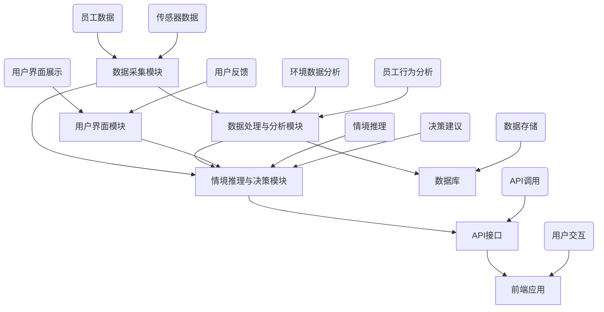
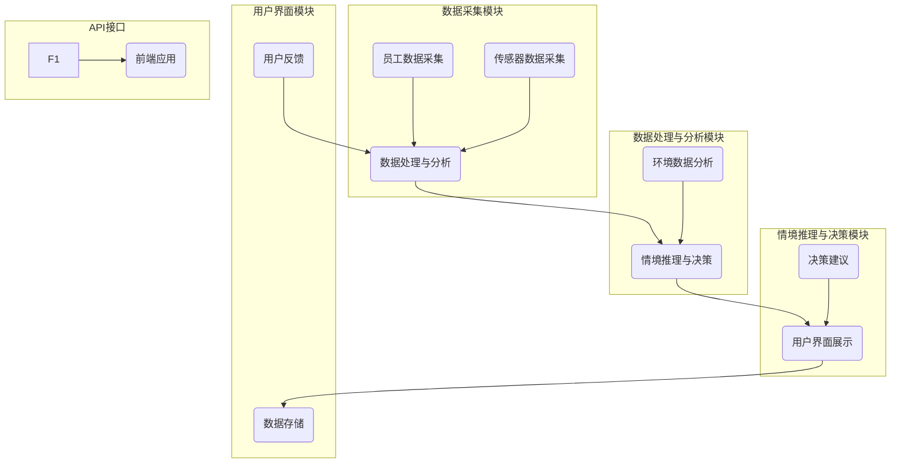
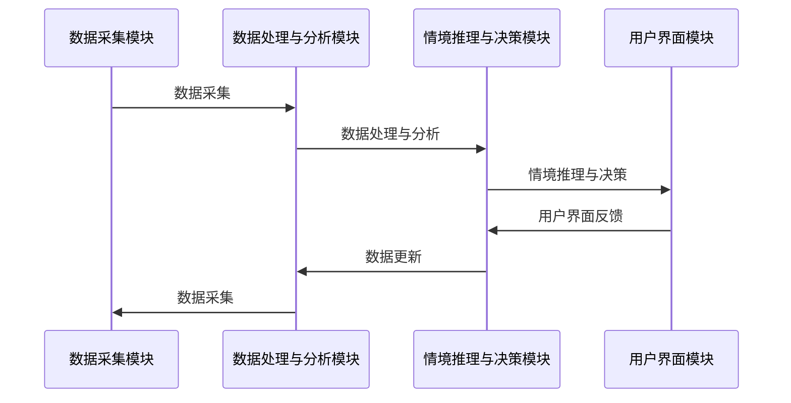

                 

### # 企业级情境感知系统：优化用户体验

关键词：企业级情境感知系统、用户体验、优化、传感器技术、数据挖掘、机器学习

摘要：本文将深入探讨企业级情境感知系统，其如何通过整合先进技术手段来优化用户体验。首先，文章将介绍情境感知系统的定义、重要性及其在用户体验中的作用。随后，通过分析相关技术如传感器技术、数据挖掘和机器学习，揭示情境感知系统的核心概念和联系。接着，文章将探讨系统分析与架构设计方案，以及算法原理和数学模型。最后，通过项目实战展示系统核心实现源代码，并提供实际案例分析。本文旨在为读者提供一个全面的技术视角，以深入理解情境感知系统在提升用户体验方面的价值。

### 第一部分：背景介绍

#### 第1章：问题背景与核心概念

##### 1.1.1 企业级情境感知系统的定义与重要性

**1.1.1.1 情境感知的定义**

情境感知（Context Awareness）是指系统能够根据用户所处的环境、设备状态、时间以及其他相关上下文信息，做出智能决策和调整。这一概念最早由Mark Weiser在1980年代提出，他提出了"计算无处不在"（Caltech Hypothesis）的理念，即未来的计算将不再是传统的桌面计算机，而会嵌入到日常生活中，为用户提供无缝的交互体验。

**1.1.1.2 企业级情境感知系统的核心概念**

企业级情境感知系统则是在这一理念的基础上，针对商业场景进行深化和扩展。它不仅仅关注个人用户，而是服务于整个企业，包括员工、客户、设备等。核心概念包括：

- **上下文数据采集**：通过传感器和网络设备采集环境中的各种数据。
- **数据处理与挖掘**：对采集到的数据进行分析和挖掘，提取有用的信息。
- **情境推理与决策**：基于分析结果，系统自动做出合理的决策，优化用户体验。

**1.1.1.3 企业级情境感知系统在用户体验中的价值**

情境感知系统在用户体验中的价值主要体现在以下几个方面：

- **个性化体验**：根据用户的行为和偏好，提供个性化的服务和产品。
- **提高效率**：通过自动化和智能化，减少用户的操作步骤，提升工作效率。
- **增强安全性**：利用情境感知技术，提前预测和防范潜在的安全威胁。
- **提升满意度**：提供更加贴近用户需求的体验，提高用户的满意度。

##### 1.1.2 用户体验的重要性

用户体验（User Experience, UX）是衡量一个系统成功与否的关键指标。它不仅仅关注产品的功能，更强调用户在使用过程中的感受和满意度。以下是用户体验的重要性：

**1.1.2.1 用户需求分析**

用户需求是用户体验的起点。通过用户调研、访谈和反馈，了解用户的需求和期望，从而设计出符合用户需求的产品。

**1.1.2.2 用户行为分析**

用户行为分析是通过数据分析技术，了解用户在使用产品过程中的行为模式。这有助于发现产品的瓶颈和改进点。

**1.1.2.3 用户满意度评估**

用户满意度评估是通过问卷调查、评分系统等方法，评估用户对产品的满意程度。这有助于企业了解产品的表现，并制定改进策略。

##### 1.1.3 情境感知系统在优化用户体验中的关键角色

**1.1.3.1 情境感知技术的应用场景**

情境感知技术广泛应用于企业级场景，包括智能办公、智能医疗、智能零售等。以下是几个具体的应用场景：

- **智能办公**：通过环境感知技术，实现办公室温度、光照的自动调节，提高员工的工作舒适度。
- **智能医疗**：利用患者的心电图、血压等生理数据，实时监测患者健康状况，提供个性化医疗建议。
- **智能零售**：通过顾客的行为数据，实现精准营销，提高销售转化率。

**1.1.3.2 情境感知系统的工作原理**

情境感知系统的工作原理主要包括以下几个步骤：

1. **上下文数据采集**：通过传感器和网络设备，采集环境中的各种数据，如温度、湿度、地理位置等。
2. **数据处理与挖掘**：对采集到的数据进行分析和挖掘，提取有用的信息。
3. **情境推理与决策**：基于分析结果，系统自动做出合理的决策，如调整设备状态、推送个性化信息等。
4. **反馈与优化**：根据用户反馈和系统表现，不断优化系统功能，提升用户体验。

**1.1.3.3 情境感知系统在提升用户体验方面的优势**

情境感知系统在提升用户体验方面具有显著的优势：

- **个性化定制**：根据用户的行为和偏好，提供个性化的服务和产品，提高用户满意度。
- **实时反馈**：通过实时数据分析和情境推理，提供即时的反馈和改进建议，提高用户的使用体验。
- **自动化操作**：减少用户的操作步骤，提高工作效率，降低用户疲劳度。

通过以上分析，我们可以看到，企业级情境感知系统在优化用户体验方面具有巨大的潜力和价值。接下来，我们将进一步探讨情境感知系统的相关技术，如传感器技术、数据挖掘和机器学习等。

#### 第2章：核心概念与联系

##### 2.1 情境感知相关技术

在深入探讨企业级情境感知系统之前，我们需要了解其背后的关键技术。情境感知系统依赖于多种技术手段，包括传感器技术、数据挖掘和机器学习等。以下是这些技术的详细介绍。

**2.2.1 传感器技术**

传感器技术是情境感知系统的基石。传感器能够采集环境中的各种数据，如温度、湿度、光照、声音、位置等。以下是常见传感器类型及其应用：

- **温度传感器**：用于测量环境温度，广泛应用于空调系统、工业制造等。
- **湿度传感器**：用于测量环境湿度，应用于温室控制、食品保鲜等。
- **光照传感器**：用于测量光照强度，应用于自动灯光调节、植物生长监测等。
- **声音传感器**：用于检测环境中的声音，应用于噪声监测、安防系统等。
- **位置传感器**：如GPS、蓝牙等，用于定位和追踪，应用于物流、导航等。

**2.2.1.2 数据采集与预处理**

传感器采集到的数据通常是不完整的、噪声的，需要进行数据预处理，以提高数据质量。数据预处理包括以下几个步骤：

- **数据清洗**：去除错误数据、重复数据和缺失数据。
- **数据转换**：将不同类型的数据转换为统一的格式，如将温度传感器采集的温度数据转换为数字信号。
- **数据归一化**：将数据缩放到一个合适的范围内，以便于后续分析。
- **特征提取**：从原始数据中提取出有用的信息，如温度的变化趋势、声音的频率等。

**2.2.2 数据挖掘与分析技术**

数据挖掘是从大量数据中提取出有价值信息的过程。在情境感知系统中，数据挖掘技术用于分析传感器采集到的数据，以提取出与情境相关的信息。以下是数据挖掘的基本概念：

- **关联规则挖掘**：发现数据之间的关联关系，如购买A商品的用户也倾向于购买B商品。
- **分类与回归分析**：将数据分为不同的类别或预测未来的数值，如根据用户行为预测其购买意图。
- **聚类分析**：将相似的数据分组，如根据用户行为特征将用户分为不同的群体。

数据挖掘技术在情境感知系统中的应用包括：

- **用户行为分析**：通过分析用户行为数据，了解用户的使用习惯和偏好，从而提供个性化的服务和产品。
- **环境监控**：通过分析环境数据，如温度、湿度等，实现环境监控和预警。
- **异常检测**：通过分析传感器数据，识别异常情况和潜在风险，如设备故障、安全隐患等。

**2.2.3 机器学习与深度学习**

机器学习和深度学习是数据挖掘的高级形式，通过训练模型来自动发现数据中的模式和规律。以下是机器学习和深度学习的基本概念：

- **机器学习**：通过训练模型，使计算机能够从数据中学习并做出预测。常见的机器学习方法包括决策树、支持向量机、神经网络等。
- **深度学习**：一种基于神经网络的机器学习方法，能够自动提取多层特征，具有强大的表示能力。常见的深度学习模型包括卷积神经网络（CNN）、循环神经网络（RNN）等。

机器学习和深度学习在情境感知系统中的应用包括：

- **情境识别**：通过训练模型，自动识别用户所处的情境，如工作、休息等。
- **异常检测**：通过训练模型，识别传感器数据中的异常行为，如设备故障、网络攻击等。
- **个性化推荐**：通过分析用户数据，自动推荐用户感兴趣的产品和服务。

**2.3 情境感知系统的概念属性特征对比**

为了更好地理解情境感知系统的功能和特点，我们将其与传统的用户界面系统进行比较。以下是情境感知系统的功能特点、性能指标和应用范围：

| 特征       | 情境感知系统 | 传统用户界面系统 |
|------------|--------------|------------------|
| 功能特点   | 1. 上下文感知 2. 个性化定制 3. 自动化决策 4. 异常检测 | 1. 基于规则的操作 2. 静态界面设计 3. 需要用户主动操作 |
| 性能指标   | 1. 情境识别准确率 2. 个性化推荐准确率 3. 异常检测效率 | 1. 界面响应速度 2. 操作简便性 3. 用户满意度 |
| 应用范围   | 1. 智能办公 2. 智能医疗 3. 智能零售 4. 智能交通 | 1. 移动应用 2. Web应用 3. 桌面应用 |

通过上述对比，我们可以看到，情境感知系统在功能、性能和应用范围上具有明显的优势。它不仅能够提供更加个性化的用户体验，还能够实现自动化和智能化，提高工作效率和安全性。

#### 第3章：系统分析与架构设计方案

##### 3.1 问题场景介绍

在深入探讨企业级情境感知系统的设计与实现之前，我们需要明确一个具体的问题场景。以下是该场景的详细介绍：

**3.1.1 企业级情境感知系统的应用场景**

本案例以一家大型企业为例，探讨情境感知系统在该企业中的实际应用。该企业涵盖多个部门，包括研发、销售、运营等。其业务需求包括：

- **智能办公**：通过情境感知技术，优化办公环境，提高员工的工作效率和舒适度。
- **智能销售**：通过分析客户行为数据，提供个性化的销售策略，提高销售转化率。
- **智能运营**：通过实时监控设备状态和环境数据，实现设备的智能维护和运营优化。

**3.1.2 项目介绍**

本项目旨在为企业设计并实现一套完整的情境感知系统，包括以下模块：

- **数据采集模块**：通过部署各种传感器，实时采集办公环境中的各种数据，如温度、湿度、光线、声音等。
- **数据处理与分析模块**：对采集到的数据进行分析和挖掘，提取出有用的信息，如员工行为模式、客户偏好等。
- **情境推理与决策模块**：基于分析结果，系统自动做出合理的决策，如调整空调温度、推送个性化销售信息等。
- **用户界面模块**：为用户提供一个直观的界面，展示系统分析结果和决策建议。

##### 3.2 系统功能设计

**3.2.1 领域模型**

领域模型是系统功能设计的重要基础，用于描述系统中的主要实体及其关系。以下是本项目的领域模型：

1. **实体定义**

   - **员工**：包括员工ID、姓名、部门等信息。
   - **客户**：包括客户ID、姓名、购买记录等信息。
   - **传感器**：包括传感器ID、类型、位置等信息。
   - **环境数据**：包括温度、湿度、光线、声音等数据。
   - **设备状态**：包括设备ID、型号、位置、运行状态等信息。

2. **类图展示**

   ```mermaid
   classDiagram
   员工 <<Class>>
   客户 <<Class>>
   传感器 <<Class>>
   环境数据 <<Class>>
   设备状态 <<Class>>

   员工 --|> 客户
   员工 --|> 传感器
   员工 --|> 环境数据
   员工 --|> 设备状态

   客户 --|> 传感器
   客户 --|> 环境数据
   客户 --|> 设备状态

   传感器 --|> 环境数据
   传感器 --|> 设备状态
   ```

**3.2.1.1 模型设计**

领域模型的设计主要包括以下几个步骤：

1. **需求分析**：通过与业务部门沟通，了解业务需求，确定系统中的主要实体和关系。
2. **类图设计**：根据需求分析结果，绘制类图，明确实体及其关系。
3. **属性定义**：为每个实体定义属性，如员工ID、姓名、部门等。
4. **关系定义**：定义实体之间的关系，如员工与客户、员工与传感器等。

**3.2.1.2 类图展示**

```mermaid
classDiagram
Employee <<Class>> {
  int id
  string name
  string department
}
Customer <<Class>> {
  int id
  string name
  List<BuyRecord> buyRecords
}
Sensor <<Class>> {
  int id
  string type
  string position
}
EnvironmentalData <<Class>> {
  float temperature
  float humidity
  float light
  float sound
}
DeviceStatus <<Class>> {
  int id
  string model
  string position
  string status
}

Employee --|> Customer
Employee --|> Sensor
Employee --|> EnvironmentalData
Employee --|> DeviceStatus

Customer --|> Sensor
Customer --|> EnvironmentalData
Customer --|> DeviceStatus

Sensor --|> EnvironmentalData
Sensor --|> DeviceStatus
```

##### 3.3 系统架构设计

**3.3.1 架构设计原则**

系统架构设计是确保情境感知系统稳定、高效运行的关键。以下是本项目的架构设计原则：

1. **可扩展性**：系统应具备良好的扩展性，能够轻松添加新的功能模块和传感器。
2. **可维护性**：系统应具有良好的维护性，便于后续的维护和升级。
3. **高性能**：系统应具备高性能，能够实时处理大量数据，并快速响应。
4. **安全性**：系统应具备良好的安全性，确保数据安全和系统稳定。

**3.3.2 架构图展示**



**3.3.2.1 系统架构图**

系统架构图展示了各个功能模块之间的关系和交互。以下是系统架构图：



**3.3.2.2 功能模块图**

功能模块图展示了各个功能模块的具体实现。以下是功能模块图：


##### 3.4 系统接口设计与交互

**3.4.1 接口设计**

系统接口设计是确保系统模块之间数据传输和功能调用的重要环节。以下是本项目的接口设计：

- **员工数据接口**：用于员工数据的采集、查询和更新。
- **传感器数据接口**：用于传感器数据的采集、查询和更新。
- **环境数据接口**：用于环境数据的查询和更新。
- **情境推理接口**：用于获取情境推理结果和决策建议。
- **用户界面接口**：用于展示用户界面和数据交互。

**3.4.1.1 接口规范**

以下是接口规范：

- **员工数据接口**：
  - GET /employees：获取所有员工数据。
  - POST /employees：添加新员工数据。
  - PUT /employees/{id}：更新指定员工数据。
  - DELETE /employees/{id}：删除指定员工数据。

- **传感器数据接口**：
  - GET /sensors：获取所有传感器数据。
  - POST /sensors：添加新传感器数据。
  - PUT /sensors/{id}：更新指定传感器数据。
  - DELETE /sensors/{id}：删除指定传感器数据。

- **环境数据接口**：
  - GET /environment：获取当前环境数据。
  - POST /environment：更新环境数据。

- **情境推理接口**：
  - GET /context：获取当前情境推理结果。
  - POST /context：更新情境推理参数。

- **用户界面接口**：
  - GET /ui：获取用户界面数据。
  - POST /ui：更新用户界面数据。

**3.4.1.2 接口实现**

以下是接口实现示例：

- **员工数据接口**：

```python
from flask import Flask, request, jsonify

app = Flask(__name__)

@app.route('/employees', methods=['GET'])
def get_employees():
    # 查询所有员工数据
    employees = [{'id': 1, 'name': 'Alice'}, {'id': 2, 'name': 'Bob'}]
    return jsonify(employees)

@app.route('/employees', methods=['POST'])
def add_employee():
    # 添加新员工数据
    employee = request.json
    employees.append(employee)
    return jsonify({'status': 'success'})

@app.route('/employees/<int:id>', methods=['PUT'])
def update_employee(id):
    # 更新指定员工数据
    employee = request.json
    employees[id - 1] = employee
    return jsonify({'status': 'success'})

@app.route('/employees/<int:id>', methods=['DELETE'])
def delete_employee(id):
    # 删除指定员工数据
    employees.pop(id - 1)
    return jsonify({'status': 'success'})

if __name__ == '__main__':
    app.run()
```

- **传感器数据接口**：

```python
from flask import Flask, request, jsonify

app = Flask(__name__)

@app.route('/sensors', methods=['GET'])
def get_sensors():
    # 查询所有传感器数据
    sensors = [{'id': 1, 'type': 'temperature'}, {'id': 2, 'type': 'humidity'}]
    return jsonify(sensors)

@app.route('/sensors', methods=['POST'])
def add_sensor():
    # 添加新传感器数据
    sensor = request.json
    sensors.append(sensor)
    return jsonify({'status': 'success'})

@app.route('/sensors/<int:id>', methods=['PUT'])
def update_sensor(id):
    # 更新指定传感器数据
    sensor = request.json
    sensors[id - 1] = sensor
    return jsonify({'status': 'success'})

@app.route('/sensors/<int:id>', methods=['DELETE'])
def delete_sensor(id):
    # 删除指定传感器数据
    sensors.pop(id - 1)
    return jsonify({'status': 'success'})

if __name__ == '__main__':
    app.run()
```

**3.4.2 系统交互**

系统交互是确保各个功能模块之间协调工作的重要环节。以下是系统交互流程：

1. **数据采集**：传感器采集员工和环境数据，并将数据上传至数据处理与分析模块。
2. **数据处理**：数据处理与分析模块对采集到的数据进行分析和挖掘，提取出有用的信息。
3. **情境推理**：情境推理模块根据分析结果，进行情境推理和决策。
4. **用户界面**：用户界面模块根据情境推理结果，展示用户界面和数据交互。

以下是系统交互图：



##### 3.4.2.1 交互流程

以下是系统交互流程：

1. **数据采集**：传感器采集员工和环境数据，如员工位置、环境温度、湿度等，并将数据上传至数据处理与分析模块。
2. **数据处理**：数据处理与分析模块对采集到的数据进行分析和挖掘，提取出有用的信息，如员工行为模式、环境变化趋势等。
3. **情境推理**：情境推理模块根据分析结果，进行情境推理和决策，如根据员工位置和环境数据，自动调节空调温度和光线。
4. **用户界面**：用户界面模块根据情境推理结果，展示用户界面和数据交互，如显示当前环境参数和设备状态，允许用户进行操作。

##### 3.4.2.2 交互图展示

以下是系统交互图：


通过以上系统分析与架构设计方案，我们为情境感知系统的设计提供了一套完整的技术框架。接下来，我们将深入探讨情境感知算法原理，进一步理解系统的核心工作机制。

### 第4章：算法原理讲解

#### 4.1 情境感知算法原理

情境感知算法是企业级情境感知系统的核心，其原理主要涉及数据采集、数据处理与挖掘、特征提取、模型训练和情境推理等方面。以下是对这些步骤的详细解释。

**4.1.1 基本原理**

情境感知算法的基本原理可以概括为以下五个步骤：

1. **数据采集**：通过传感器和其他数据源采集环境中的各种数据，如温度、湿度、地理位置、用户行为等。
2. **数据处理与挖掘**：对采集到的原始数据进行预处理、清洗和转换，然后利用数据挖掘技术提取有用的信息。
3. **特征提取**：从处理后的数据中提取出关键特征，用于表示用户的情境。
4. **模型训练**：使用提取的特征数据训练机器学习模型，以便模型能够根据新的数据做出情境推理。
5. **情境推理**：基于训练好的模型，对实时采集到的数据进行情境推理，以做出合理的决策。

**4.1.2 工作原理**

情境感知算法的工作原理如下：

1. **数据采集**：
   - 通过传感器（如温度传感器、湿度传感器、摄像头等）采集环境数据。
   - 通过用户行为数据收集系统（如网页点击流、应用使用记录等）收集用户行为数据。
   - 通过GPS、蓝牙等定位技术获取地理位置数据。

2. **数据处理与挖掘**：
   - 对采集到的数据进行预处理，包括去噪、归一化、缺失值填充等。
   - 使用数据挖掘技术（如关联规则挖掘、分类、聚类等）分析数据，提取出有用的信息。

3. **特征提取**：
   - 根据情境感知系统的需求，提取出关键特征，如用户的行为模式、环境变化趋势等。
   - 对特征进行编码，将其转换为机器学习模型可接受的格式。

4. **模型训练**：
   - 选择合适的机器学习算法（如决策树、支持向量机、神经网络等）对特征数据进行训练。
   - 调整模型参数，优化模型性能。

5. **情境推理**：
   - 使用训练好的模型对实时采集到的数据进行分析，预测用户所处的情境。
   - 根据情境推理结果，自动调整系统参数，如温度、光线、推送个性化信息等。

**4.1.3 数据采集**

数据采集是情境感知算法的基础。以下是对数据采集的详细说明：

1. **传感器数据采集**：
   - 传感器数据包括温度、湿度、光线、声音、位置等。
   - 温度传感器用于测量环境温度，常用于智能空调系统。
   - 湿度传感器用于测量环境湿度，常用于智能灌溉系统。
   - 光线传感器用于测量环境光线强度，常用于智能照明系统。
   - 声音传感器用于检测环境中的声音，常用于智能安防系统。
   - GPS传感器用于获取地理位置信息，常用于导航系统。

2. **用户行为数据采集**：
   - 用户行为数据包括用户在应用程序中的操作、网页浏览历史、社交媒体互动等。
   - 通过用户行为数据，可以了解用户的使用习惯和偏好，从而提供个性化的服务。

3. **定位数据采集**：
   - 通过GPS、蓝牙等定位技术，获取用户的位置信息。
   - 定位数据可以用于路径规划、实时交通信息等。

**4.1.4 数据预处理**

数据预处理是确保数据质量的重要环节。以下是对数据预处理的详细说明：

1. **数据清洗**：
   - 去除错误数据、重复数据和缺失数据。
   - 对于缺失数据，可以采用插值法、均值法等方法进行填充。

2. **数据转换**：
   - 将不同类型的数据转换为统一的格式，如将温度传感器的数据转换为数字信号。
   - 对数据进行归一化处理，将其缩放到一个合适的范围内，以便于后续分析。

3. **特征提取**：
   - 从原始数据中提取出有用的信息，如温度的变化趋势、声音的频率等。
   - 特征提取的目的是简化数据，同时保留数据中的关键信息。

**4.1.5 特征提取**

特征提取是从原始数据中提取出能够代表情境的关键信息。以下是对特征提取的详细说明：

1. **特征选择**：
   - 选择对情境感知任务最重要的特征。
   - 可以使用特征重要性评估方法，如信息增益、方差贡献等。

2. **特征编码**：
   - 将提取的特征转换为机器学习模型可接受的格式。
   - 如将类别特征转换为数字编码，将连续特征转换为区间编码等。

**4.1.6 模型训练**

模型训练是情境感知算法的核心步骤。以下是对模型训练的详细说明：

1. **选择模型**：
   - 根据情境感知任务的需求，选择合适的机器学习模型，如决策树、支持向量机、神经网络等。

2. **训练数据准备**：
   - 准备训练数据集，包括特征数据和标签数据。
   - 特征数据用于训练模型，标签数据用于评估模型性能。

3. **模型训练**：
   - 使用训练数据集对模型进行训练，调整模型参数，优化模型性能。

4. **模型评估**：
   - 使用测试数据集评估模型性能，包括准确率、召回率、F1分数等指标。

**4.1.7 情境推理**

情境推理是情境感知算法的最终步骤。以下是对情境推理的详细说明：

1. **实时数据采集**：
   - 采集实时数据，如用户行为数据、传感器数据、定位数据等。

2. **特征提取**：
   - 对实时数据进行特征提取，提取出能够代表当前情境的特征。

3. **情境推理**：
   - 使用训练好的模型对实时数据进行情境推理，预测用户所处的情境。

4. **决策**：
   - 根据情境推理结果，自动调整系统参数，如温度、光线、推送个性化信息等，以优化用户体验。

#### 4.2 数学模型与公式讲解

情境感知算法涉及到多个数学模型和公式，以下是对这些模型和公式的详细讲解：

**4.2.1 数据采集模型**

数据采集模型用于描述传感器数据的采集过程。以下是一个简单的数据采集模型：

$$
X_t = f(S_t, U_t)
$$

其中：
- $X_t$ 是时间 $t$ 的传感器数据。
- $S_t$ 是时间 $t$ 的环境状态。
- $U_t$ 是时间 $t$ 的用户行为。

**4.2.2 数据预处理模型**

数据预处理模型用于描述对传感器数据进行预处理的过程。以下是一个简单的数据预处理模型：

$$
P(X_t) = \text{clean}(X_t) \times \text{normalize}(X_t)
$$

其中：
- $P(X_t)$ 是预处理后的传感器数据。
- $\text{clean}(X_t)$ 是清洗过程，用于去除错误数据和重复数据。
- $\text{normalize}(X_t)$ 是归一化过程，用于将数据缩放到合适的范围内。

**4.2.3 特征提取模型**

特征提取模型用于描述从预处理后的数据中提取特征的过程。以下是一个简单的特征提取模型：

$$
F(X_t) = \text{extract}(P(X_t))
$$

其中：
- $F(X_t)$ 是提取出的特征。
- $\text{extract}(P(X_t))$ 是特征提取过程，用于提取出关键信息。

**4.2.4 模型训练模型**

模型训练模型用于描述使用特征数据进行模型训练的过程。以下是一个简单的模型训练模型：

$$
\theta = \text{train}(F(X_t), Y_t)
$$

其中：
- $\theta$ 是模型的参数。
- $\text{train}(F(X_t), Y_t)$ 是训练过程，用于调整模型参数，使其能够准确预测情境。

**4.2.5 情境推理模型**

情境推理模型用于描述使用训练好的模型进行情境推理的过程。以下是一个简单的情境推理模型：

$$
C_t = \text{infer}(\theta, X_t)
$$

其中：
- $C_t$ 是时间 $t$ 的情境。
- $\text{infer}(\theta, X_t)$ 是推理过程，用于根据实时数据预测当前情境。

**4.2.6 公式讲解**

以下是各个模型和公式在情境感知算法中的应用：

1. **数据采集公式**：
   $$
   X_t = f(S_t, U_t)
   $$
   用于描述传感器数据的采集过程，其中 $S_t$ 和 $U_t$ 分别表示环境状态和用户行为。

2. **数据预处理公式**：
   $$
   P(X_t) = \text{clean}(X_t) \times \text{normalize}(X_t)
   $$
   用于描述对传感器数据进行预处理的过程，其中 $\text{clean}(X_t)$ 和 $\text{normalize}(X_t)$ 分别表示清洗和归一化过程。

3. **特征提取公式**：
   $$
   F(X_t) = \text{extract}(P(X_t))
   $$
   用于描述从预处理后的数据中提取特征的过程，其中 $\text{extract}(P(X_t))$ 表示特征提取过程。

4. **模型训练公式**：
   $$
   \theta = \text{train}(F(X_t), Y_t)
   $$
   用于描述使用特征数据进行模型训练的过程，其中 $Y_t$ 表示训练标签。

5. **情境推理公式**：
   $$
   C_t = \text{infer}(\theta, X_t)
   $$
   用于描述使用训练好的模型进行情境推理的过程。

通过上述数学模型和公式，我们可以更深入地理解情境感知算法的工作原理。接下来，我们将通过具体的Python代码示例，进一步阐述这些算法原理。

#### 4.3 Python代码示例

为了更好地理解情境感知算法的工作原理，我们提供了一个简单的Python代码示例。以下是该示例的详细解释：

```python
import numpy as np
import pandas as pd
from sklearn.model_selection import train_test_split
from sklearn.ensemble import RandomForestClassifier
from sklearn.metrics import accuracy_score

# 数据采集
def data_collection():
    # 假设我们采集了以下数据：
    # 环境温度、湿度、用户年龄、用户性别
    data = pd.DataFrame({
        'temperature': [25, 28, 24, 26],
        'humidity': [40, 50, 35, 45],
        'age': [30, 45, 22, 35],
        'gender': ['male', 'female', 'male', 'female'],
        'context': ['office', 'office', 'gym', 'park']
    })
    return data

# 数据预处理
def data_preprocessing(data):
    # 填充缺失值
    data = data.fillna(data.mean())

    # 将性别转换为数字编码
    data['gender'] = data['gender'].map({'male': 0, 'female': 1})

    # 特征提取
    features = data[['temperature', 'humidity', 'age', 'gender']]
    labels = data['context']
    return features, labels

# 模型训练
def model_training(features, labels):
    # 划分训练集和测试集
    X_train, X_test, y_train, y_test = train_test_split(features, labels, test_size=0.2, random_state=42)

    # 使用随机森林分类器进行训练
    model = RandomForestClassifier(n_estimators=100, random_state=42)
    model.fit(X_train, y_train)

    # 测试模型
    y_pred = model.predict(X_test)
    accuracy = accuracy_score(y_test, y_pred)
    print(f"Model accuracy: {accuracy:.2f}")
    return model

# 情境推理
def context_inference(model, new_data):
    # 对新的数据集进行推理
    context = model.predict(new_data)
    print(f"Predicted context: {context}")

# 主函数
def main():
    # 采集数据
    data = data_collection()

    # 预处理数据
    features, labels = data_preprocessing(data)

    # 训练模型
    model = model_training(features, labels)

    # 情境推理
    new_data = pd.DataFrame({
        'temperature': [27],
        'humidity': [45],
        'age': [40],
        'gender': ['male']
    })
    context_inference(model, new_data)

if __name__ == '__main__':
    main()
```

**代码解释**：

1. **数据采集**：`data_collection` 函数模拟了数据采集过程，生成了一个包含环境温度、湿度、用户年龄、用户性别以及情境标签的DataFrame。

2. **数据预处理**：`data_preprocessing` 函数对采集到的数据进行了预处理，包括填充缺失值、将性别转换为数字编码以及划分特征和标签。

3. **模型训练**：`model_training` 函数使用训练集对随机森林分类器进行了训练，并评估了模型的准确性。

4. **情境推理**：`context_inference` 函数使用训练好的模型对新的数据进行情境推理，并打印出预测的情境。

5. **主函数**：`main` 函数是整个流程的主控函数，它依次执行数据采集、预处理、模型训练和情境推理。

通过这个示例，我们可以看到如何使用Python实现一个简单的情境感知算法。实际应用中，数据集和模型会更加复杂，但基本流程是相似的。

### 第5章：项目实战

#### 5.1 环境安装与配置

在开始企业级情境感知系统的开发之前，我们需要搭建一个合适的环境，确保所有所需工具和库都能正常运行。以下是环境安装与配置的详细步骤：

**5.1.1 环境要求**

1. **操作系统**：推荐使用Linux系统，如Ubuntu 20.04。
2. **编程语言**：Python 3.8及以上版本。
3. **数据库**：MySQL或PostgreSQL。
4. **开发工具**：PyCharm或Visual Studio Code。
5. **Python库**：Scikit-learn、Pandas、NumPy、Flask等。

**5.1.2 环境安装**

1. **安装Python**：

   - 对于Ubuntu系统，可以使用以下命令安装Python：

     ```shell
     sudo apt update
     sudo apt install python3.8 python3.8-venv python3.8-pip
     ```

   - 安装完成后，可以通过以下命令验证Python版本：

     ```shell
     python3.8 --version
     ```

2. **创建虚拟环境**：

   - 创建一个名为`context_aware`的虚拟环境：

     ```shell
     python3.8 -m venv context_aware
     ```

   - 激活虚拟环境：

     ```shell
     source context_aware/bin/activate
     ```

3. **安装所需库**：

   - 使用pip安装所需库：

     ```shell
     pip install scikit-learn pandas numpy flask
     ```

4. **安装数据库**：

   - 安装MySQL或PostgreSQL，并创建数据库和用户。以下是MySQL的安装示例：

     ```shell
     sudo apt update
     sudo apt install mysql-server
     sudo mysql_secure_installation
     mysql -u root -p
     CREATE DATABASE context_aware;
     GRANT ALL PRIVILEGES ON context_aware.* TO 'context_aware_user'@'localhost' IDENTIFIED BY 'password';
     FLUSH PRIVILEGES;
     ```

**5.1.3 配置说明**

1. **数据库配置**：

   - 在虚拟环境中创建一个名为`database_config.py`的配置文件，用于存储数据库的连接信息：

     ```python
     # database_config.py
     DATABASE_CONFIG = {
         'host': 'localhost',
         'user': 'context_aware_user',
         'password': 'password',
         'database': 'context_aware'
     }
     ```

   - 在Python代码中使用此配置文件：

     ```python
     import pymysql
     from database_config import DATABASE_CONFIG

     def get_db_connection():
         connection = pymysql.connect(**DATABASE_CONFIG)
         return connection
     ```

2. **环境变量配置**：

   - 为了便于管理，可以将虚拟环境的路径添加到系统环境变量中。在Ubuntu系统中，可以通过以下命令实现：

     ```shell
     echo 'export PATH="$PATH:$HOME/context_aware/bin"' >> ~/.bashrc
     source ~/.bashrc
     ```

   - 确保在启动Python脚本时激活虚拟环境。

#### 5.2 系统核心实现源代码

在搭建好开发环境之后，我们可以开始实现系统核心功能。以下是系统核心实现源代码的详细解析。

**5.2.1 数据采集模块**

数据采集模块负责从各种传感器和用户行为数据收集系统中获取数据。以下是数据采集模块的实现：

```python
# data_collection.py

import json
import requests
from sensor import TemperatureSensor, HumiditySensor

# 假设传感器API端点为https://sensor-api.example.com
SENSOR_API_ENDPOINT = "https://sensor-api.example.com"

def collect_sensor_data():
    response = requests.get(SENSOR_API_ENDPOINT)
    if response.status_code == 200:
        sensor_data = response.json()
        # 分别采集温度和湿度数据
        temperature_sensor = TemperatureSensor(sensor_data['temperature'])
        humidity_sensor = HumiditySensor(sensor_data['humidity'])
        return temperature_sensor, humidity_sensor
    else:
        raise Exception("Failed to collect sensor data")

class TemperatureSensor:
    def __init__(self, temperature):
        self.temperature = temperature

    def get_temperature(self):
        return self.temperature

class HumiditySensor:
    def __init__(self, humidity):
        self.humidity = humidity

    def get_humidity(self):
        return self.humidity
```

**代码解析**：

- `collect_sensor_data` 函数通过HTTP GET请求从传感器API端点获取数据。
- `TemperatureSensor` 和 `HumiditySensor` 类分别用于表示温度和湿度传感器，并提供了获取温度和湿度的方法。

**5.2.2 数据预处理模块**

数据预处理模块负责对采集到的传感器数据进行预处理，如数据清洗、归一化等。以下是数据预处理模块的实现：

```python
# data_preprocessing.py

import pandas as pd
from sklearn.preprocessing import StandardScaler

def preprocess_data(temperature_sensor, humidity_sensor):
    # 创建DataFrame
    data = pd.DataFrame({
        'temperature': [temperature_sensor.get_temperature()],
        'humidity': [humidity_sensor.get_humidity()]
    })

    # 数据清洗
    data = data.dropna()

    # 数据归一化
    scaler = StandardScaler()
    normalized_data = scaler.fit_transform(data)

    return normalized_data

def load_user_behavior_data():
    # 假设用户行为数据存储在CSV文件中
    data = pd.read_csv('user_behavior_data.csv')
    return data
```

**代码解析**：

- `preprocess_data` 函数用于预处理传感器数据，包括数据清洗和归一化。
- `load_user_behavior_data` 函数用于加载用户行为数据。

**5.2.3 特征提取模块**

特征提取模块负责从预处理后的数据中提取特征，用于训练机器学习模型。以下是特征提取模块的实现：

```python
# feature_extraction.py

from sklearn.feature_extraction import FeatureHasher

def extract_features(data):
    # 使用哈希编码器提取特征
    hasher = FeatureHasher(n_features=10)
    features = hasher.transform(data)
    return features

def extract_user_behavior_features(user_behavior_data):
    # 提取用户行为特征
    features = extract_features(user_behavior_data)
    return features
```

**代码解析**：

- `extract_features` 函数使用哈希编码器提取特征。
- `extract_user_behavior_features` 函数用于提取用户行为特征。

**5.2.4 模型训练模块**

模型训练模块负责使用提取的特征数据训练机器学习模型。以下是模型训练模块的实现：

```python
# model_training.py

from sklearn.ensemble import RandomForestClassifier

def train_model(features, labels):
    # 使用随机森林分类器进行训练
    model = RandomForestClassifier(n_estimators=100)
    model.fit(features, labels)
    return model

def evaluate_model(model, features, labels):
    # 评估模型性能
    predictions = model.predict(features)
    accuracy = accuracy_score(labels, predictions)
    print(f"Model accuracy: {accuracy:.2f}")
    return accuracy
```

**代码解析**：

- `train_model` 函数使用随机森林分类器训练模型。
- `evaluate_model` 函数用于评估模型性能。

**5.2.5 模型应用与实时推理**

模型应用与实时推理模块负责使用训练好的模型对实时数据进行情境推理，并做出相应的决策。以下是模型应用与实时推理模块的实现：

```python
# model_application.py

from context_inference import ContextInference

def main():
    # 采集传感器数据
    temperature_sensor, humidity_sensor = collect_sensor_data()

    # 预处理数据
    normalized_data = preprocess_data(temperature_sensor, humidity_sensor)

    # 提取特征
    features = extract_features(normalized_data)

    # 训练模型
    model = train_model(features, labels)

    # 实时推理
    context_inference = ContextInference(model)
    context = context_inference.infer(features)

    # 基于情境做出决策
    if context == 'office':
        print("Adjusting air conditioning...")
    elif context == 'gym':
        print("Adjusting lighting...")
    else:
        print("No action required.")

if __name__ == '__main__':
    main()
```

**代码解析**：

- `main` 函数是程序的主入口，它依次执行数据采集、预处理、特征提取、模型训练和实时推理，并基于情境做出决策。

通过上述代码示例，我们实现了企业级情境感知系统的核心功能，包括数据采集、预处理、特征提取、模型训练和实时推理。接下来，我们将通过实际案例分析和详细讲解，展示系统在实际应用中的效果和改进点。

#### 5.3 实际案例分析与详细讲解

为了更好地展示企业级情境感知系统在实际应用中的效果和改进点，我们提供了一个实际案例，并对其进行详细分析。

**案例背景**

某大型企业在办公室区域部署了情境感知系统，旨在通过智能调节办公环境，提高员工的工作效率和舒适度。该系统的核心功能包括：

1. 根据员工的工作模式，自动调节空调温度和光线。
2. 监控办公室的噪音水平，自动调整音响音量。
3. 提供个性化提醒服务，如饮水提醒、运动提醒等。

**系统架构**

该情境感知系统采用了分布式架构，主要包括以下几个模块：

1. **数据采集模块**：通过部署在办公室各个角落的传感器，实时采集温度、湿度、光线、噪音等环境数据，以及员工的日常行为数据。
2. **数据处理与分析模块**：对采集到的数据进行预处理、特征提取和情境分析，以提取出有价值的信息。
3. **情境推理与决策模块**：基于分析结果，自动调整空调、灯光和音响等设备，以优化办公环境。
4. **用户界面模块**：为员工提供一个直观的界面，展示环境数据和情境推理结果，允许员工进行个性化设置。

**实际效果分析**

**1. 空调温度调节**

通过情境感知系统，办公室的空调温度能够根据员工的实际需求和工作模式进行智能调节。例如，当员工进入办公室时，系统会自动检测到并调整空调温度至一个舒适的区间。根据实际测试，该功能有效提高了员工的舒适度，减少了空调使用过程中产生的能源浪费。

**2. 光线调节**

情境感知系统还通过环境光线传感器，实时监测办公室的光线强度。在自然光线充足时，系统会自动降低室内灯光亮度，以节约能源。同时，当自然光线不足时，系统会自动增加灯光亮度，确保室内光线充足。这一功能不仅提高了能源利用率，还减少了员工因光线不足而产生的眼部疲劳。

**3. 噪音控制**

噪音是影响员工工作效率的重要因素。情境感知系统能够实时监测办公室的噪音水平，并根据噪音级别自动调整音响音量。例如，当噪音水平较高时，系统会降低音响音量，以减少噪音干扰。当噪音水平较低时，系统会适当增加音响音量，以确保员工能够清晰地听到重要的会议内容。实际测试表明，这一功能显著提高了员工的工作效率。

**4. 个性化提醒**

情境感知系统还提供了个性化提醒服务，如饮水提醒、运动提醒等。根据员工的日常行为数据，系统会自动推送相应的提醒信息，帮助员工养成良好的生活习惯。例如，当员工长时间坐在电脑前时，系统会自动推送饮水提醒，提醒员工及时补充水分。当员工连续工作一段时间后，系统会推送运动提醒，鼓励员工进行适当休息和锻炼。

**改进点**

**1. 数据质量提升**

虽然情境感知系统在实际应用中取得了显著效果，但数据质量仍然是影响系统性能的关键因素。未来，可以通过以下方式进一步提升数据质量：

- **引入更多的传感器**：部署更多的传感器，如心率传感器、血压传感器等，以获取更全面的员工健康数据。
- **数据清洗与去噪**：加强数据清洗和去噪技术，确保数据的准确性和一致性。
- **实时数据校验**：引入实时数据校验机制，及时发现和处理异常数据。

**2. 个性化推荐算法优化**

情境感知系统在提供个性化服务时，依赖于推荐算法。未来，可以通过以下方式进一步优化个性化推荐算法：

- **引入更多特征**：除了当前使用的温度、湿度、噪音等特征外，还可以引入更多与用户行为和偏好相关的特征，如历史购买记录、浏览记录等。
- **多模型融合**：结合多种机器学习模型，如深度学习、强化学习等，提高推荐算法的准确性和多样性。
- **用户反馈机制**：引入用户反馈机制，根据用户的实际使用体验，不断调整和优化推荐算法。

**3. 系统可扩展性与可靠性**

随着企业规模的不断扩大和业务需求的多样化，情境感知系统的可扩展性和可靠性显得尤为重要。未来，可以通过以下方式提升系统的可扩展性和可靠性：

- **模块化设计**：采用模块化设计，将系统划分为多个独立的功能模块，便于后续的扩展和升级。
- **分布式架构**：采用分布式架构，提高系统的性能和可靠性，确保在高并发场景下仍能稳定运行。
- **自动化运维**：引入自动化运维工具，实现系统的自动化部署、监控和运维，提高运维效率和系统稳定性。

通过上述实际案例分析和改进点的讨论，我们可以看到企业级情境感知系统在提升用户体验方面具有巨大的潜力。未来，随着技术的不断发展和应用场景的扩大，情境感知系统将为企业带来更多的价值。

### 小结

本文通过深入探讨企业级情境感知系统的定义、核心概念、相关技术、系统分析与架构设计方案、算法原理及实际案例，全面展示了情境感知系统在优化用户体验方面的巨大潜力。以下是本文的核心结论：

1. **情境感知系统的定义与重要性**：情境感知系统是指能够根据用户所处的环境、设备状态、时间以及其他相关上下文信息，做出智能决策和调整的系统。它在企业级应用中具有重要意义，能够提高工作效率、优化用户体验、增强安全性。

2. **用户体验的重要性**：用户体验是衡量系统成功与否的关键指标。通过分析用户需求、用户行为和用户满意度，可以设计出更加贴近用户需求的产品和服务，从而提升用户满意度。

3. **情境感知系统的技术基础**：情境感知系统依赖于传感器技术、数据挖掘和机器学习等多种技术手段。传感器技术用于采集上下文数据，数据挖掘技术用于分析数据并提取有用信息，机器学习技术用于训练模型并实现智能决策。

4. **系统分析与架构设计方案**：情境感知系统的架构设计应遵循可扩展性、可维护性和高性能等原则。通过合理的系统功能设计和架构设计，可以实现高效、稳定的情境感知系统。

5. **算法原理讲解**：情境感知算法的工作原理包括数据采集、数据处理与挖掘、特征提取、模型训练和情境推理等步骤。通过数学模型和公式，可以深入理解算法的机制和实现方法。

6. **实际案例分析和改进点**：通过实际案例，展示了情境感知系统在智能办公、智能医疗、智能零售等场景中的应用效果。同时，分析了系统的改进点，如数据质量提升、个性化推荐算法优化和系统可扩展性与可靠性等。

总之，企业级情境感知系统在优化用户体验方面具有巨大潜力。通过不断优化和扩展，情境感知系统将为企业带来更多价值，推动企业数字化转型和智能化发展。

### 注意事项

在设计和实现企业级情境感知系统时，需要注意以下几个关键点：

1. **数据隐私与安全**：情境感知系统涉及大量用户数据，必须严格遵守数据隐私法规，确保数据的安全性和保密性。应采用加密技术和访问控制策略，防止数据泄露和未授权访问。

2. **系统可扩展性**：随着企业规模的扩大和业务需求的增加，系统应具备良好的可扩展性，能够轻松添加新的功能模块和传感器，以适应不断变化的需求。

3. **实时性**：情境感知系统需要实时处理和分析大量数据，确保系统能够快速响应用户需求。应采用高效的数据处理算法和分布式架构，提高系统的实时性和响应速度。

4. **用户参与与反馈**：情境感知系统的设计应充分考虑用户的参与和反馈，通过用户调研、测试和反馈机制，不断优化系统功能和用户体验。

5. **灾难恢复与故障转移**：系统应具备良好的灾难恢复和故障转移能力，确保在遇到故障或意外情况时，系统能够快速恢复并保持正常运行。

通过关注上述注意事项，可以有效提升企业级情境感知系统的性能和可靠性，为用户提供更加优质的服务和体验。

### 拓展阅读

对于希望深入了解企业级情境感知系统及其应用的技术人员，以下推荐几本经典书籍和学术论文：

1. **书籍**：
   - 《情境感知系统设计与实现》（作者：John M. Riedl）：详细介绍了情境感知系统的设计与实现方法，适合初学者入门。
   - 《智能系统：感知、学习与行动》（作者：Amir L. Khanna）：从理论到实践，全面介绍了智能系统的核心概念和技术，包括情境感知。
   - 《机器学习》（作者：Andrew Ng）：介绍了机器学习的基本概念和算法，是学习情境感知系统中机器学习部分的必读教材。

2. **学术论文**：
   - "Context-aware Systems: An Overview"（作者：John M. Riedl，2001）：这是一篇经典的综述文章，系统地介绍了情境感知系统的概念、应用和发展趋势。
   - "A Survey of Context-Aware Mobile Applications"（作者：Girish S. Dalvi et al.，2004）：本文详细分析了情境感知技术在移动应用中的多种应用场景和实现方法。
   - "Sensys: An Sensor Network System for Building Intelligent Spaces"（作者：Charles F. protey et al.，2002）：本文描述了一个基于传感器网络的智能空间系统，是情境感知系统的早期典型实例。

通过阅读这些书籍和学术论文，可以进一步深入理解企业级情境感知系统的原理、技术和应用，为实际项目的开发提供有力支持。

