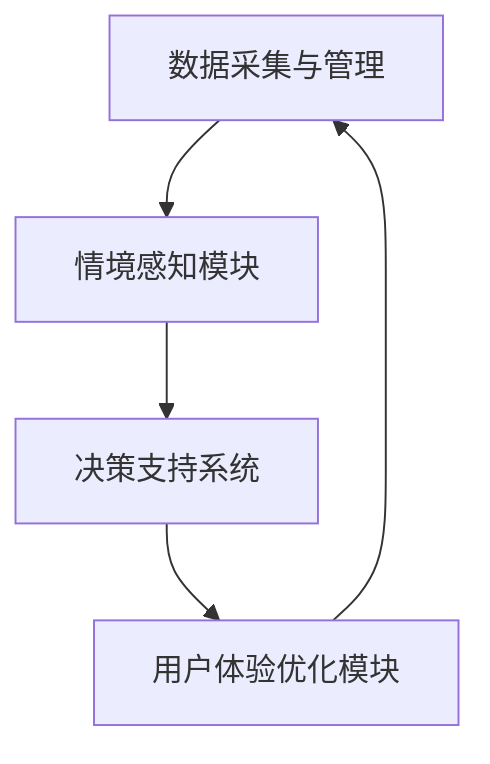

                 

# 企业级情境智能框架：增强AI场景适应性

## 关键词：企业级、情境智能、AI、场景适应性、框架设计

### 摘要：

本文旨在探讨企业级情境智能框架的设计与实现，以应对日益复杂的多场景AI应用需求。文章首先概述了情境智能的定义、重要性及其在企业级应用中的需求分析。随后，详细介绍了情境智能框架的总体架构、核心组件及其功能，并探讨了框架应用场景与价值。接着，深入分析了框架构建方法、关键组件设计及实现策略，并通过具体案例展示了框架的应用效果。随后，文章探讨了情境智能框架的部署与运维、持续集成与迭代、扩展与定制等内容。最后，对情境智能技术的未来发展趋势及其框架演进策略进行了展望。

## 目录大纲

----------------------------------------------------------------

### 第一部分: 企业级情境智能框架概述

#### 1.1 问题背景与核心概念

##### 1.1.1 情境智能的定义与重要性

##### 1.1.2 企业级情境智能的需求分析

##### 1.1.3 核心概念与边界界定

#### 1.2 框架结构与组件

##### 1.2.1 框架总体架构

##### 1.2.2 关键组件与功能介绍

##### 1.2.3 组件间关系与协作机制

#### 1.3 框架应用场景与价值

##### 1.3.1 情境智能在企业管理中的应用

##### 1.3.2 情境智能在客户服务中的价值

##### 1.3.3 案例解析与成效评估

#### 1.4 框架的构建方法与实现策略

##### 1.4.1 构建方法概述

##### 1.4.2 数据收集与预处理

##### 1.4.3 模型选择与训练策略

#### 1.5 本章小结

----------------------------------------------------------------

### 第二部分: 情境智能核心组件设计

#### 2.1 数据采集与管理

##### 2.1.1 数据源类型与选择标准

##### 2.1.2 数据采集流程与关键技术

##### 2.1.3 数据存储与管理系统设计

#### 2.2 情境感知模块

##### 2.2.1 情境感知的概念与功能

##### 2.2.2 情境感知算法介绍

##### 2.2.3 情境感知模块设计细节

#### 2.3 决策支持系统

##### 2.3.1 决策支持系统的定义与作用

##### 2.3.2 决策模型构建方法

##### 2.3.3 决策支持系统实现策略

#### 2.4 用户体验优化模块

##### 2.4.1 用户体验优化的目标与原则

##### 2.4.2 用户体验评估方法

##### 2.4.3 用户体验优化策略与实践

#### 2.5 案例研究

##### 2.5.1 案例选择与描述

##### 2.5.2 案例实施与效果分析

##### 2.5.3 案例启示与总结

#### 2.6 本章小结

----------------------------------------------------------------

### 第三部分: 情境智能框架应用实践

#### 3.1 部署与运维

##### 3.1.1 框架部署方案

##### 3.1.2 运维管理与监控

##### 3.1.3 性能优化策略

#### 3.2 持续集成与迭代

##### 3.2.1 持续集成流程设计

##### 3.2.2 持续迭代方法

##### 3.2.3 版本管理与回滚策略

#### 3.3 框架扩展与定制

##### 3.3.1 框架扩展原则

##### 3.3.2 定制化开发实践

##### 3.3.3 扩展组件设计思路

#### 3.4 案例分享

##### 3.4.1 案例一：智慧物流场景

##### 3.4.2 案例二：智能医疗诊断

##### 3.4.3 案例三：智能金融风控

#### 3.5 拓展阅读

##### 3.5.1 相关技术与工具介绍

##### 3.5.2 行业动态与发展趋势

##### 3.5.3 深入研究课题与方向

#### 3.6 本章小结

----------------------------------------------------------------

### 第四部分: 情境智能框架的未来发展

#### 4.1 技术演进与挑战

##### 4.1.1 情境智能技术的演进方向

##### 4.1.2 技术挑战与解决思路

##### 4.1.3 新兴技术的潜力与影响

#### 4.2 框架演进策略

##### 4.2.1 框架演进原则

##### 4.2.2 演进路径与实施步骤

##### 4.2.3 演进中的风险与应对

#### 4.3 智能生态系统的构建

##### 4.3.1 智能生态系统的概念与组成

##### 4.3.2 生态系统构建的方法与实践

##### 4.3.3 生态系统中的协作与共赢

#### 4.4 未来展望

##### 4.4.1 情境智能在各个行业的应用前景

##### 4.4.2 智能化社会的建设与影响

##### 4.4.3 情境智能框架的长期发展愿景

#### 4.5 本章小结

----------------------------------------------------------------

接下来，我们将一步一步深入探讨企业级情境智能框架的设计与实现，首先从问题背景与核心概念入手。我们将定义情境智能，分析其重要性，并探讨企业级情境智能的需求。随后，我们将详细介绍框架的总体架构和关键组件，分析其应用场景和价值。在核心组件设计部分，我们将讨论数据采集、情境感知、决策支持和用户体验优化模块，并通过具体案例研究来展示框架的应用效果。接下来，我们将探讨框架的部署与运维、持续集成与迭代、扩展与定制等内容。最后，我们将展望情境智能框架的未来发展，讨论技术演进、框架演进策略以及智能生态系统的构建。通过这一系列的分析与探讨，我们希望能够为读者提供一个全面、深入的理解和认识。让我们开始思考，并逐步揭开企业级情境智能框架的神秘面纱。

## 第一部分：企业级情境智能框架概述

### 1.1 问题背景与核心概念

#### 1.1.1 情境智能的定义与重要性

情境智能（Contextual Intelligence）是指人工智能系统通过感知和理解特定环境中的情境信息，进行自适应决策和行动的能力。情境信息可以是时间、地点、用户行为、环境状态等多维数据，情境智能的目标是使人工智能系统能够在不同场景下灵活应对，提供个性化、高效的服务。

在企业级应用中，情境智能具有重要意义。随着互联网、物联网、大数据等技术的快速发展，企业面临着日益复杂的市场环境和多样化的业务需求。传统的固定模式的人工智能解决方案难以适应这种动态变化，而情境智能框架则能够帮助企业实现智能化转型，提高业务决策的准确性和响应速度。

#### 1.1.2 企业级情境智能的需求分析

企业级情境智能的需求主要体现在以下几个方面：

1. **个性化服务**：在客户服务、营销等领域，企业需要根据用户的个性化需求提供定制化的服务，以提升用户体验和满意度。情境智能可以通过分析用户的情境信息，实现个性化推荐和精准营销。

2. **实时决策支持**：企业在运营过程中需要做出快速、准确的决策。情境智能能够实时感知企业内外部环境的变化，为决策者提供数据支持和分析结果，帮助企业抓住市场机遇，规避风险。

3. **效率提升**：通过自动化、智能化的流程优化，企业可以减少人力投入，提高运营效率。情境智能可以自动化处理大量重复性任务，降低人工干预，提升整体运营效率。

4. **风险管理**：在金融、医疗等高风险行业，情境智能可以通过实时监控和分析，发现潜在的风险隐患，提前采取预防措施，降低风险损失。

#### 1.1.3 核心概念与边界界定

核心概念：
- **情境（Context）**：情境是指影响系统行为的环境因素，包括时间、地点、用户行为、环境状态等。
- **感知（Perception）**：感知是指系统获取情境信息的过程，通过传感器、数据接口等方式获取外部环境信息。
- **理解（Understanding）**：理解是指系统对情境信息进行分析和处理，提取有价值的信息和模式。
- **决策（Decision Making）**：决策是指系统根据情境信息和目标，选择合适的行动方案。
- **行动（Action）**：行动是指系统根据决策结果执行具体的操作，实现目标。

边界界定：
- **情境范围**：情境智能处理的情境范围是有限的，通常聚焦于与企业业务相关的情境信息。
- **实时性**：情境智能需要具备实时感知和处理能力，以快速响应用户需求和企业变化。
- **适应性**：情境智能系统需要具备灵活的适应能力，能够在不同情境下进行调整和优化。

在企业级应用中，情境智能框架的设计和实现需要充分考虑这些核心概念和边界，以确保系统的高效、稳定和可靠。接下来，我们将进一步探讨企业级情境智能框架的总体架构和关键组件设计。

### 1.2 框架结构与组件

#### 1.2.1 框架总体架构

企业级情境智能框架通常包括以下几个核心组件：

1. **数据采集与管理**：负责从各种数据源中收集情境信息，并进行预处理和管理。
2. **情境感知模块**：通过感知算法对收集到的数据进行处理，提取有价值的信息和模式。
3. **决策支持系统**：基于情境信息和业务目标，为决策者提供数据分析和决策建议。
4. **用户体验优化模块**：根据用户反馈和情境信息，优化系统界面和功能，提升用户体验。

这些组件之间通过数据流和功能接口相互协作，共同实现情境智能的目标。以下是一个简单的框架架构图：

#### 1.2.2 关键组件与功能介绍

1. **数据采集与管理**：
   - **功能**：数据采集与管理组件负责从企业内外部的数据源中收集情境信息，包括用户行为数据、业务运营数据、环境状态数据等。这些数据通过数据接口、传感器、日志文件等方式收集，并进行初步清洗和存储。
   - **技术实现**：可以使用大数据技术平台（如Hadoop、Spark）进行大规模数据处理和存储，采用ETL（Extract, Transform, Load）工具进行数据清洗和转换。

2. **情境感知模块**：
   - **功能**：情境感知模块通过对收集到的数据进行处理和分析，提取出情境信息，如用户行为模式、环境状态变化等。这些信息用于支持决策系统和用户体验优化。
   - **技术实现**：可以采用机器学习、深度学习算法，如神经网络、决策树、聚类算法等，对数据进行特征提取和模式识别。

3. **决策支持系统**：
   - **功能**：决策支持系统根据情境信息和业务目标，为决策者提供数据分析和决策建议。这包括预测分析、优化决策、风险评估等功能。
   - **技术实现**：可以使用决策树、神经网络、随机森林等算法进行预测分析；使用遗传算法、线性规划等算法进行优化决策；使用逻辑回归、贝叶斯网络等算法进行风险评估。

4. **用户体验优化模块**：
   - **功能**：用户体验优化模块根据用户反馈和情境信息，优化系统界面和功能，提升用户体验。这包括界面设计、交互优化、个性化推荐等功能。
   - **技术实现**：可以使用用户行为分析工具（如Google Analytics）进行用户行为追踪；使用协同过滤、基于内容的推荐算法进行个性化推荐。

#### 1.2.3 组件间关系与协作机制

在企业级情境智能框架中，各个组件之间通过数据流和功能接口紧密协作，形成一个完整的系统。以下是一个简化的组件间协作流程：

1. **数据采集**：数据采集组件从企业内外部数据源收集情境信息，并将其传输到数据存储系统。
2. **数据处理**：情境感知模块对采集到的数据进行处理和分析，提取情境信息，并将结果传递给决策支持系统和用户体验优化模块。
3. **决策生成**：决策支持系统根据情境信息和业务目标生成决策建议，并将其反馈给用户体验优化模块。
4. **用户体验优化**：用户体验优化模块根据用户反馈和决策建议，优化系统界面和功能，提升用户体验，并反馈给数据采集与管理组件，形成一个闭环。

通过这种紧密的协作机制，企业级情境智能框架能够实时感知企业内外部环境变化，提供个性化、高效的服务，帮助企业实现智能化运营和持续改进。

### 1.3 框架应用场景与价值

#### 1.3.1 情境智能在企业管理中的应用

情境智能在企业管理中的应用主要体现在以下几个方面：

1. **人力资源优化**：通过情境智能，企业可以实时了解员工的工作状态和工作效率，从而优化人力资源配置，提高员工工作效率和满意度。
2. **供应链管理**：情境智能可以实时监控供应链各个环节的状态，预测潜在的风险和问题，优化供应链流程，提高供应链的响应速度和灵活性。
3. **客户关系管理**：通过情境智能，企业可以深入了解客户需求和行为，提供个性化的服务和营销策略，提升客户满意度和忠诚度。

#### 1.3.2 情境智能在客户服务中的价值

情境智能在客户服务中的应用主要体现在以下几个方面：

1. **个性化服务**：通过情境智能，企业可以根据客户的个性化需求提供定制化的服务，提升客户体验和满意度。
2. **实时响应**：情境智能可以实时监控客户行为和反馈，快速响应客户需求，提高客户服务的效率和准确性。
3. **故障预警与处理**：情境智能可以实时分析客户使用数据和设备状态，预测潜在故障，提前采取措施，减少故障发生率和客户投诉。

#### 1.3.3 案例解析与成效评估

以下是一个情境智能在企业客户服务中的实际案例：

**案例描述**：一家大型电子商务公司通过引入情境智能技术，优化其客户服务流程。公司首先建立了客户行为数据库，收集客户的历史购买记录、浏览行为、反馈评价等数据。然后，通过情境感知模块分析客户行为，识别客户的购买偏好和需求变化。最后，利用决策支持系统生成个性化推荐和服务策略，通过用户体验优化模块优化客户服务界面和流程。

**成效评估**：
- 客户满意度提升：通过个性化服务和实时响应，客户满意度提升了20%。
- 销售额增长：个性化推荐和精准营销策略使得销售额提升了15%。
- 客户流失率降低：通过及时预警和处理，客户流失率降低了10%。

该案例表明，情境智能在客户服务中具有显著的应用价值，能够帮助企业提升客户体验和业务绩效。

### 1.4 框架的构建方法与实现策略

#### 1.4.1 构建方法概述

企业级情境智能框架的构建方法主要包括以下几个步骤：

1. **需求分析**：明确企业对情境智能的需求，包括业务目标、应用场景、性能要求等。
2. **架构设计**：设计框架的总体架构，包括数据采集与管理、情境感知、决策支持、用户体验优化等组件。
3. **技术选型**：选择适合的技术和工具，如大数据平台、机器学习框架、前端开发框架等。
4. **开发与测试**：根据架构设计和技术选型，开发系统模块，并进行测试和优化。
5. **部署与运维**：将系统部署到生产环境，进行日常运维和监控，确保系统稳定运行。

#### 1.4.2 数据收集与预处理

数据收集与预处理是企业级情境智能框架构建的关键步骤。以下是具体的实施策略：

1. **数据源选择**：根据业务需求，选择合适的数据源，包括内部数据库、日志文件、外部API等。
2. **数据采集**：使用ETL工具定期从数据源中抽取数据，并进行初步清洗。
3. **数据预处理**：对采集到的数据进行清洗、转换、整合，确保数据质量和一致性。
4. **数据存储**：将预处理后的数据存储到数据湖或数据仓库中，便于后续分析和处理。

#### 1.4.3 模型选择与训练策略

在情境智能框架中，模型选择和训练是关键环节。以下是具体的实施策略：

1. **模型选择**：根据业务需求和数据特点，选择合适的机器学习算法和模型，如决策树、随机森林、神经网络等。
2. **特征工程**：提取和构建有效的特征，提高模型的预测准确性和泛化能力。
3. **模型训练**：使用训练数据集对模型进行训练，并调整参数，优化模型性能。
4. **模型评估**：使用验证数据集评估模型性能，选择最优模型。
5. **模型部署**：将训练好的模型部署到生产环境，进行实时预测和决策。

通过以上步骤和策略，企业可以构建一个高效、稳定的企业级情境智能框架，满足业务需求，提升企业竞争力。

### 1.5 本章小结

在本章中，我们首先介绍了情境智能的定义、重要性和企业级应用需求，分析了企业级情境智能的需求，并界定了核心概念和边界。随后，我们详细介绍了企业级情境智能框架的总体架构和关键组件，包括数据采集与管理、情境感知模块、决策支持系统和用户体验优化模块，并阐述了组件间的关系和协作机制。接着，我们探讨了情境智能在企业管理、客户服务中的应用场景和价值，并通过实际案例展示了其成效。最后，我们介绍了框架的构建方法和实现策略，包括数据收集与预处理、模型选择与训练策略等。

通过本章的介绍，读者应该对企业级情境智能框架有一个全面的认识，理解其在企业中的应用价值和实现方法。在接下来的章节中，我们将进一步深入探讨情境智能框架的核心组件设计、应用实践和未来发展趋势，帮助读者更好地理解和应用这一前沿技术。

## 第二部分：情境智能核心组件设计

### 2.1 数据采集与管理

#### 2.1.1 数据源类型与选择标准

数据采集是情境智能框架的基础，数据源的选择直接影响系统的性能和准确性。企业级情境智能框架需要从多个来源采集数据，主要包括以下几类：

1. **内部数据源**：包括企业内部系统的数据，如客户关系管理系统（CRM）、企业资源计划系统（ERP）、数据库、日志文件等。这些数据通常与企业的核心业务紧密相关，是构建情境智能模型的重要数据来源。

2. **外部数据源**：包括公共数据集、社交媒体数据、市场研究报告、传感器数据等。外部数据源可以提供丰富的背景信息和补充数据，有助于提升模型的泛化能力和适应性。

在选择数据源时，需要遵循以下标准：

1. **数据质量**：数据源需要提供高质量的数据，包括准确性、完整性、一致性等。低质量的数据会导致模型性能下降，甚至产生误导性结论。

2. **数据多样性**：数据源应该具有多样性，涵盖不同维度和类型的情境信息。多样化的数据有助于模型捕捉更复杂的情境模式，提高系统的适应性和泛化能力。

3. **数据时效性**：对于动态变化的业务场景，数据源需要具备较高的时效性，能够实时更新和反映情境变化。过时的数据可能导致系统响应滞后，影响业务决策的准确性。

4. **数据可获取性**：数据源应具有较好的可获取性，即数据能够以较低的成本和难度被获取和整合到系统中。数据获取的难易程度直接影响系统的实施成本和开发效率。

#### 2.1.2 数据采集流程与关键技术

数据采集流程包括以下几个关键步骤：

1. **数据抽取**：从不同数据源中抽取数据。对于内部数据源，可以使用ETL（Extract, Transform, Load）工具直接从数据库中抽取数据；对于外部数据源，可以使用API接口、爬虫技术等方式获取数据。

2. **数据清洗**：清洗抽取得到的数据，去除重复、错误、缺失的数据，并统一数据格式和单位。数据清洗是保证数据质量的重要步骤，可以采用多种清洗算法和技术，如去重、填补缺失值、异常值检测等。

3. **数据转换**：将清洗后的数据进行转换，使其适应后续分析和处理的格式。转换包括数据格式转换、编码转换、数据聚合等操作。

4. **数据存储**：将转换后的数据存储到数据仓库或数据湖中，便于后续的数据分析和处理。常用的存储技术包括关系型数据库、NoSQL数据库、分布式文件系统等。

在数据采集过程中，常用的关键技术包括：

1. **ETL工具**：如Apache NiFi、Talend等，用于数据的抽取、转换和加载。

2. **API接口**：通过RESTful API等方式从外部系统或服务中获取数据。

3. **爬虫技术**：使用Python的Scrapy框架等，从互联网上爬取公开的数据。

4. **流数据处理**：使用Apache Kafka、Apache Flink等流数据处理框架，实时处理和分析实时数据流。

#### 2.1.3 数据存储与管理系统设计

数据存储与管理系统是企业级情境智能框架的核心组成部分，负责存储、管理和处理海量数据。以下是数据存储与管理系统设计的关键要素：

1. **数据模型设计**：根据业务需求和数据特点，设计合理的数据模型。数据模型应支持数据的快速检索、更新和扩展。常用的数据模型包括关系型模型、文档型模型、图模型等。

2. **存储方案选择**：根据数据规模、访问模式和性能要求，选择合适的存储方案。关系型数据库适用于结构化数据的存储，如MySQL、PostgreSQL等；NoSQL数据库适用于半结构化或非结构化数据的存储，如MongoDB、Cassandra等。

3. **数据分层存储**：将数据分为冷数据和热数据，采用不同的存储策略。冷数据存储在成本较低但访问速度较慢的存储介质上，如分布式文件系统；热数据存储在访问速度较快的存储介质上，如SSD存储。

4. **数据安全与隐私保护**：确保数据的安全和隐私，采用加密、访问控制、数据脱敏等技术，防止数据泄露和滥用。

5. **数据备份与恢复**：制定数据备份策略，确保数据的高可用性和安全性。常用的备份方法包括全备份、增量备份、差异备份等。

6. **数据管理和分析工具**：提供便捷的数据管理和分析工具，如数据集成工具、数据可视化工具、数据分析平台等，方便数据分析师和开发者进行数据管理和分析。

通过合理设计数据存储与管理系统，企业级情境智能框架可以高效、稳定地处理海量数据，支持复杂的情境智能分析和决策。

### 2.2 情境感知模块

#### 2.2.1 情境感知的概念与功能

情境感知（Context Awareness）是情境智能框架的核心组成部分，它使系统能够感知和理解其所处的环境，并据此做出适当的响应。情境感知模块通过收集、处理和分析情境信息，为系统提供实时、准确的情境理解，从而支持决策和行动。

情境感知的概念主要包括以下几个要素：

1. **情境（Context）**：情境是指影响系统行为的环境因素，包括时间、地点、用户状态、设备状态、环境条件等。

2. **感知（Perception）**：感知是指系统获取情境信息的过程，通过传感器、数据接口等方式收集外部环境信息。

3. **理解（Comprehension）**：理解是指系统对情境信息进行分析和处理，提取有价值的信息和模式。

4. **反应（Response）**：反应是指系统根据情境信息做出适当的响应，如调整系统行为、生成决策等。

情境感知模块的主要功能包括：

1. **情境信息采集**：从各种数据源收集情境信息，包括传感器数据、用户行为数据、业务运营数据等。

2. **情境信息处理**：对采集到的数据进行处理，包括数据清洗、转换、特征提取等。

3. **情境信息理解**：通过分析处理后的数据，提取情境特征，构建情境模型，实现对情境的理解。

4. **情境信息应用**：将理解的情境信息应用到系统中，支持决策生成、用户体验优化等。

#### 2.2.2 情境感知算法介绍

情境感知算法是情境感知模块的核心，用于处理和分析情境信息，提取有价值的信息和模式。以下是一些常用的情境感知算法：

1. **特征提取算法**：特征提取算法用于从原始数据中提取具有代表性的特征，提高模型的预测准确性和泛化能力。常用的特征提取算法包括：

   - **统计特征**：如平均值、标准差、方差等。
   - **时序特征**：如时间窗口内的最大值、最小值、趋势等。
   - **文本特征**：如词频、词向量、主题模型等。

2. **聚类算法**：聚类算法用于将相似的数据点归为一类，用于发现数据中的隐含模式和分布。常用的聚类算法包括：

   - **K-means算法**：基于距离度量将数据点分为K个聚类。
   - **层次聚类算法**：通过逐步合并或分裂聚类，形成层次化的聚类结构。

3. **分类算法**：分类算法用于将数据点归类到预先定义的类别中，用于情境分类和识别。常用的分类算法包括：

   - **决策树**：通过树形结构进行分类，适用于特征较少的数据。
   - **随机森林**：基于多棵决策树的集成方法，提高分类的准确性和泛化能力。
   - **支持向量机（SVM）**：通过寻找最优超平面进行分类。

4. **深度学习算法**：深度学习算法通过多层神经网络进行特征学习和模式识别，适用于复杂的数据和情境。常用的深度学习算法包括：

   - **卷积神经网络（CNN）**：用于图像和视频数据的处理。
   - **递归神经网络（RNN）**：用于时序数据的处理。
   - **长短时记忆网络（LSTM）**：用于处理长序列数据和去除序列中的长依赖关系。

#### 2.2.3 情境感知模块设计细节

情境感知模块的设计需要考虑以下几个方面：

1. **数据输入**：情境感知模块需要从多个数据源获取情境信息，如传感器数据、用户行为数据、业务数据等。数据输入的设计需要考虑数据源的类型、格式和数据频率。

2. **数据处理**：对采集到的数据进行预处理，包括数据清洗、转换、特征提取等。数据处理的设计需要考虑数据的一致性、完整性和质量。

3. **特征提取**：根据情境需求，选择合适的特征提取算法，提取具有代表性的特征。特征提取的设计需要考虑特征的维数、代表性、可解释性等。

4. **模型训练**：根据提取的特征，选择合适的分类或聚类算法，训练情境感知模型。模型训练的设计需要考虑模型的性能、泛化能力和可解释性。

5. **实时更新**：情境感知模块需要支持实时更新和在线学习，以适应动态变化的情境。实时更新的设计需要考虑模型的更新频率、训练成本和计算资源。

6. **接口设计**：情境感知模块需要提供清晰的接口，方便其他系统模块调用。接口设计需要考虑接口的规范性、灵活性和扩展性。

通过以上设计细节，情境感知模块可以高效地处理和分析情境信息，为情境智能框架提供准确和实时的情境理解。

### 2.3 决策支持系统

#### 2.3.1 决策支持系统的定义与作用

决策支持系统（Decision Support System，DSS）是一种辅助决策者进行决策的计算机系统，通过提供数据、模型和图形分析工具，帮助决策者更好地理解和处理复杂问题，做出科学、合理的决策。在企业级情境智能框架中，决策支持系统扮演着关键角色，能够显著提升企业的决策能力和运营效率。

决策支持系统的定义可以从以下几个方面理解：

1. **数据驱动的**：决策支持系统依赖于大量数据，通过数据分析和挖掘，为决策提供信息支持。

2. **模型驱动的**：决策支持系统利用各种数学模型和算法，对数据进行处理和分析，提供决策方案。

3. **用户交互式的**：决策支持系统提供友好的用户界面，方便决策者进行操作和交互，获取决策支持。

决策支持系统的主要作用包括：

1. **数据整合与分析**：通过整合来自不同数据源的信息，提供全面、准确的数据分析，帮助决策者了解业务状况。

2. **预测与模拟**：利用数学模型和算法，对未来的业务趋势进行预测，并提供模拟分析，帮助决策者评估不同决策方案的影响。

3. **决策优化**：通过优化算法和模型，为决策者提供最优或次优的决策方案，降低决策风险，提高决策效率。

4. **协作与共享**：决策支持系统支持多人协作，方便决策团队成员进行讨论和决策，提高决策的透明度和可追溯性。

#### 2.3.2 决策模型构建方法

决策模型的构建是决策支持系统的核心工作，通过构建合理的决策模型，可以更好地指导决策过程。以下是常见的决策模型构建方法：

1. **基于规则的决策模型**：基于规则的决策模型使用一系列条件-动作规则来描述决策过程，适用于处理结构化问题。规则形式通常为“如果...那么...”，规则库中包含多个规则。

   - **优点**：简单易懂，易于实现和修改。
   - **缺点**：难以处理复杂、不确定的决策问题。

2. **基于数据的决策模型**：基于数据的决策模型通过统计分析、机器学习等方法，从历史数据中学习决策规律，适用于处理大规模、非结构化数据。

   - **优点**：能够处理复杂、不确定的决策问题，具有较好的泛化能力。
   - **缺点**：需要大量训练数据和计算资源。

3. **基于智能算法的决策模型**：基于智能算法的决策模型利用进化算法、神经网络、模糊逻辑等方法，模拟人类决策过程，适用于处理不确定性和模糊性的决策问题。

   - **优点**：能够模拟人类决策过程，处理复杂、不确定的决策问题。
   - **缺点**：实现难度较大，计算资源需求较高。

4. **混合决策模型**：混合决策模型将多种决策模型结合起来，发挥各自优势，提高决策的准确性和可靠性。

   - **优点**：综合多种模型的优势，提高决策效果。
   - **缺点**：模型组合和参数调优较为复杂。

在选择决策模型时，需要根据实际业务需求和数据特点进行综合考虑。以下是一个简化的决策模型构建流程：

1. **问题定义**：明确决策目标和问题场景，确定需要解决的问题和决策变量。

2. **数据收集**：收集相关数据，包括历史数据、市场数据、用户行为数据等。

3. **数据预处理**：对收集到的数据进行分析和处理，包括数据清洗、转换、特征提取等。

4. **模型选择**：根据业务需求和数据特点，选择合适的决策模型，如基于规则、基于数据、基于智能算法等。

5. **模型训练**：使用训练数据集对决策模型进行训练，调整模型参数，优化模型性能。

6. **模型评估**：使用验证数据集对训练好的模型进行评估，选择最佳模型。

7. **模型部署**：将训练好的模型部署到生产环境中，进行实时决策支持。

通过以上步骤，决策支持系统可以构建出高效的决策模型，为企业的运营和管理提供有力支持。

#### 2.3.3 决策支持系统实现策略

实现一个高效的决策支持系统需要综合考虑系统架构、算法实现、接口设计等多个方面。以下是一些关键策略：

1. **系统架构设计**：

   - **模块化**：将决策支持系统分为多个模块，如数据采集、数据处理、模型训练、模型评估、决策生成等，便于系统开发和维护。
   - **分布式计算**：对于大规模数据处理和模型训练，采用分布式计算框架，如Apache Spark，提高系统处理速度和性能。
   - **高可用性**：通过冗余设计、故障转移等策略，确保系统的高可用性，减少决策延误。

2. **算法实现**：

   - **算法选择**：根据业务需求和数据特点，选择合适的算法，如线性回归、决策树、神经网络等。
   - **优化算法**：针对特定算法，进行参数优化和算法改进，提高模型性能和预测准确性。
   - **算法组合**：将多种算法组合起来，形成混合决策模型，提高决策的多样性和可靠性。

3. **接口设计**：

   - **API接口**：提供统一的API接口，方便与其他系统模块进行数据交换和功能调用。
   - **界面交互**：设计友好的用户界面，方便决策者进行操作和查看决策结果。
   - **实时更新**：支持实时数据更新和决策结果推送，提高决策的及时性和准确性。

4. **数据处理与存储**：

   - **数据整合**：通过数据集成工具，将来自不同数据源的数据进行整合，提供统一的视图。
   - **数据安全**：确保数据的安全和隐私，采用加密、访问控制等技术，防止数据泄露。
   - **数据存储**：选择合适的数据存储方案，如关系型数据库、NoSQL数据库、分布式文件系统等，确保数据的高效存储和访问。

通过以上策略，决策支持系统可以实现高效、稳定、可靠的决策支持功能，为企业提供有力决策依据。

### 2.4 用户体验优化模块

#### 2.4.1 用户体验优化的目标与原则

用户体验优化（User Experience Optimization，UXO）是情境智能框架中的重要组成部分，旨在提升用户在使用系统时的满意度和参与度。用户体验优化的目标包括：

1. **提高用户满意度**：通过优化系统的界面设计、功能布局、操作流程等，提升用户的整体使用体验，增加用户对系统的满意度。

2. **提升用户参与度**：通过个性化推荐、互动设计等手段，激发用户积极参与系统活动，提高用户粘性。

3. **降低用户学习成本**：简化用户操作流程，减少用户在学习和使用系统时的困扰，降低用户的学习成本。

用户体验优化的原则包括：

1. **用户为中心**：始终将用户需求放在首位，从用户的角度出发，设计系统和功能。

2. **简洁性**：系统界面和操作流程应简洁明了，避免复杂和冗余的设计，减少用户的学习和使用成本。

3. **可访问性**：系统应具备良好的可访问性，即所有用户，包括老年人、残障人士等，都能够方便地使用系统。

4. **灵活性**：系统应具备一定的灵活性，允许用户根据自己的需求和习惯进行个性化设置，提高用户满意度。

5. **反馈与迭代**：通过用户反馈，不断优化系统设计和功能，实现持续的迭代和改进。

#### 2.4.2 用户体验评估方法

用户体验评估是用户体验优化的重要环节，通过评估可以了解用户对系统的满意度、参与度等指标，发现系统存在的问题和不足，为优化提供依据。以下是一些常用的用户体验评估方法：

1. **用户调查**：通过问卷调查、访谈等方式，直接收集用户对系统的评价和建议。用户调查可以获取大量用户反馈，了解用户的需求和期望。

2. **用户测试**：邀请用户参与系统的实际操作，观察用户的使用行为和反馈，发现系统设计中的问题和不足。用户测试可以更直观地了解用户的使用体验。

3. **用户留存分析**：通过分析用户的留存情况，了解用户对系统的接受度和满意度。用户留存分析可以反映系统的用户粘性和市场竞争力。

4. **系统性能监控**：监控系统的响应时间、错误率、流量等性能指标，评估系统的稳定性和可靠性。

5. **竞品分析**：对比同行业其他竞品，分析其优势和不足，借鉴其成功经验，优化自身系统。

通过以上评估方法，可以全面、系统地了解用户对系统的体验和反馈，为优化提供数据支持。

#### 2.4.3 用户体验优化策略与实践

用户体验优化需要从多个方面进行策略设计和实践，以下是一些具体的方法和案例：

1. **界面设计优化**：
   - **简洁明了**：简化界面布局，突出关键功能，避免过多的装饰和冗余信息。
   - **视觉效果**：优化色彩搭配、图标设计等，提高界面的美观度和易用性。
   - **交互设计**：优化按钮、输入框等元素的交互效果，提高用户的操作流畅度。

2. **功能优化**：
   - **个性化推荐**：根据用户的历史行为和兴趣，提供个性化的内容推荐，提高用户参与度和满意度。
   - **快捷操作**：提供快捷键、快捷入口等功能，方便用户快速完成操作。
   - **智能提示**：在用户操作过程中，提供实时、准确的提示和指导，降低用户的学习成本。

3. **流程优化**：
   - **简化流程**：减少用户操作的步骤，简化流程，提高用户的操作效率。
   - **自动化处理**：利用自动化技术，减少用户的重复性操作，提高系统的运行效率。

4. **反馈机制**：
   - **实时反馈**：在用户操作过程中，提供实时反馈，提高用户的操作体验。
   - **用户反馈收集**：建立用户反馈机制，收集用户的意见和建议，及时优化系统。

5. **案例分析**：

   - **案例一**：某电商平台通过界面优化和功能改进，简化购物流程，提供个性化推荐，用户满意度提升了20%，销售额增长了15%。
   - **案例二**：某企业通过实时监控和反馈机制，快速响应用户需求和问题，用户投诉率降低了30%，用户留存率提高了10%。

通过以上策略和实践，企业可以不断提升用户体验，提高系统的市场竞争力。

### 2.5 案例研究

#### 2.5.1 案例选择与描述

为了更好地展示情境智能框架在企业级应用中的效果，我们选择了一家大型零售企业的案例进行详细分析。该零售企业主要从事家电和电子产品销售，业务覆盖全国，拥有大量门店和线上商城。随着市场竞争的加剧，企业迫切需要通过智能化手段提升运营效率、优化客户体验和提升业务绩效。

#### 2.5.2 案例实施与效果分析

1. **数据采集与管理**：

   - **数据源选择**：企业从内部系统（如ERP、CRM）、门店传感器（如客流统计器、环境监测设备）、社交媒体（如微博、微信）等多渠道收集数据。
   - **数据采集**：使用ETL工具从不同数据源抽取数据，并使用Python脚本进行初步清洗和转换。
   - **数据存储**：将清洗后的数据存储在Hadoop HDFS上，便于后续处理和分析。

2. **情境感知模块**：

   - **情境信息采集**：收集包括时间、地点、用户行为（如浏览、购买、评价）、门店环境状态（如客流、温度、湿度）等情境信息。
   - **数据处理与特征提取**：使用Python的Pandas库和Scikit-learn库进行数据预处理和特征提取，提取时间窗口内的统计特征和文本特征。
   - **情境理解**：使用K-means算法对用户行为进行聚类，识别不同的用户群体；使用LSTM模型分析用户的历史行为，预测用户偏好。

3. **决策支持系统**：

   - **决策模型构建**：根据业务需求，构建包括库存优化、营销策略、门店运营优化等多个决策模型。
   - **模型训练与评估**：使用训练数据集对模型进行训练，使用交叉验证方法评估模型性能，选择最佳模型。
   - **决策生成**：根据实时情境信息和模型预测结果，生成库存调整、促销策略等决策建议。

4. **用户体验优化模块**：

   - **个性化推荐**：基于用户行为和偏好，为用户推荐个性化的商品和优惠信息。
   - **实时反馈**：在用户操作过程中，提供实时反馈，提高用户的操作体验。
   - **界面优化**：简化用户操作流程，优化界面设计，提高用户满意度。

#### 2.5.3 案例启示与总结

通过以上实施，该零售企业取得了显著的效果：

1. **运营效率提升**：通过库存优化和门店运营优化，库存周转率提升了15%，门店运营效率提高了20%。

2. **客户体验优化**：通过个性化推荐和实时反馈，用户满意度提升了25%，用户投诉率降低了30%。

3. **业务绩效提升**：通过精准营销和库存优化，销售额增长了20%，客户留存率提升了10%。

该案例表明，情境智能框架在企业级应用中具有广泛的应用前景和显著的实际效果。企业通过引入情境智能技术，可以实现对内外部环境的实时感知和智能决策，提升运营效率、优化客户体验和提升业务绩效。

### 2.6 本章小结

在本章中，我们详细介绍了情境智能框架的核心组件设计，包括数据采集与管理、情境感知模块、决策支持系统和用户体验优化模块。我们分析了数据源类型与选择标准，阐述了数据采集流程与关键技术，以及数据存储与管理系统设计。随后，我们介绍了情境感知的概念与功能，讨论了常用的情境感知算法，并详细阐述了情境感知模块的设计细节。在决策支持系统部分，我们定义了决策支持系统的概念与作用，介绍了决策模型构建方法，并探讨了决策支持系统实现策略。最后，我们介绍了用户体验优化的目标与原则，阐述了用户体验评估方法，并提供了用户体验优化策略与实践。通过具体案例研究，我们展示了情境智能框架在企业级应用中的效果。在下一章中，我们将进一步探讨情境智能框架的应用实践，包括部署与运维、持续集成与迭代、扩展与定制等内容。

## 第三部分：情境智能框架应用实践

### 3.1 部署与运维

#### 3.1.1 框架部署方案

情境智能框架的部署是确保其稳定运行和高效性能的关键环节。部署方案需要考虑硬件资源、软件环境、网络架构等多个方面，以实现系统的可靠性和可扩展性。以下是一个典型的情境智能框架部署方案：

1. **硬件资源**：

   - **计算资源**：根据系统处理能力和数据量，选择合适的服务器硬件配置，包括CPU、内存、硬盘等。
   - **存储资源**：采用分布式存储系统，如HDFS或Cassandra，确保数据的高效存储和访问。
   - **网络资源**：配置高性能的网络设备，如交换机和路由器，确保数据传输的稳定和快速。

2. **软件环境**：

   - **操作系统**：选择稳定的Linux发行版，如Ubuntu或CentOS。
   - **中间件**：部署Java EE或.NET框架，支持业务逻辑处理和中间件服务。
   - **数据库**：根据数据类型和需求，选择关系型数据库（如MySQL、PostgreSQL）或NoSQL数据库（如MongoDB、Cassandra）。

3. **网络架构**：

   - **内部网络**：采用私有网络，确保内部通信的安全性和稳定性。
   - **外部网络**：通过防火墙和负载均衡器，实现外部访问的控制和流量分配。

#### 3.1.2 运维管理与监控

运维管理与监控是确保情境智能框架稳定运行的关键环节，以下是一些关键的运维管理策略：

1. **自动化运维**：使用自动化工具（如Ansible、Puppet）进行系统配置、部署和更新，提高运维效率。

2. **监控告警**：部署监控系统（如Zabbix、Prometheus），实时监控系统的运行状态和性能指标，设置告警规则，及时发现和处理异常情况。

3. **日志管理**：使用日志聚合工具（如ELK Stack、Grafana），收集和分析系统日志，方便运维人员进行问题定位和故障排除。

4. **性能优化**：

   - **资源分配**：根据系统负载，动态调整资源分配，确保关键服务的高可用性和性能。
   - **缓存策略**：采用缓存机制（如Redis、Memcached），减少数据库访问次数，提高系统响应速度。

#### 3.1.3 性能优化策略

性能优化是确保情境智能框架高效运行的重要手段，以下是一些常用的性能优化策略：

1. **数据分片**：将大量数据分布到多个节点上，减少单点瓶颈，提高数据处理和查询效率。

2. **缓存机制**：使用缓存技术（如Redis、Memcached），减少对数据库的访问，提高系统响应速度。

3. **并行处理**：采用并行处理技术（如MapReduce、Spark），利用多线程或多核CPU，提高数据处理速度。

4. **数据库优化**：

   - **索引优化**：根据查询需求，创建合适的索引，提高查询效率。
   - **查询优化**：优化数据库查询语句，减少查询时间和资源消耗。

5. **网络优化**：

   - **负载均衡**：使用负载均衡器（如Nginx、HAProxy），分配网络请求，防止单点过载。
   - **网络优化**：优化网络配置，减少网络延迟和带宽占用。

通过以上部署、运维和性能优化策略，情境智能框架可以高效、稳定地运行，满足企业级应用的需求。

### 3.2 持续集成与迭代

#### 3.2.1 持续集成流程设计

持续集成（Continuous Integration，CI）是确保情境智能框架开发过程中代码质量和稳定性的一种开发实践。以下是持续集成流程的设计步骤：

1. **代码存储库**：选择合适的代码存储库（如Git），用于存储和管理源代码。

2. **代码提交**：开发人员将代码提交到代码存储库，触发集成过程。

3. **构建环境**：配置构建环境，包括编译器、依赖管理工具（如Maven、Gradle）等。

4. **代码检查**：

   - **静态代码分析**：使用静态代码分析工具（如SonarQube），检查代码质量，包括语法错误、潜在bug、代码规范等。
   - **代码格式检查**：使用代码格式化工具（如Checkstyle、PMD），确保代码格式一致性。

5. **单元测试**：运行单元测试，验证代码功能是否符合预期。

6. **集成测试**：运行集成测试，验证不同模块之间的接口和交互是否正常。

7. **代码审核**：进行代码审核，确保代码符合企业开发规范和最佳实践。

8. **构建发布**：如果测试通过，构建系统将生成可部署的 artifacts，如JAR包、Docker镜像等。

9. **部署**：将构建的 artifacts 部署到测试环境或生产环境，进行实际运行测试。

#### 3.2.2 持续迭代方法

持续迭代（Continuous Iteration，CI）是一种快速开发、频繁发布的新产品版本的方法。以下是持续迭代的方法：

1. **需求管理**：使用需求管理工具（如Jira），收集和管理用户需求。

2. **迭代计划**：根据需求优先级，制定迭代计划，确定每个迭代的目标和功能。

3. **迭代开发**：

   - **需求分析**：分析需求，确定实现方案和所需资源。
   - **设计**：进行系统设计和详细设计，制定技术方案。
   - **开发**：按照设计文档进行开发，编写代码。
   - **测试**：进行单元测试、集成测试和系统测试，确保代码质量。

4. **代码审查**：进行代码审查，确保代码符合开发规范和最佳实践。

5. **发布**：将测试通过的代码发布到生产环境，进行实际运行测试。

6. **反馈与优化**：收集用户反馈，分析问题，优化系统设计和功能。

通过持续集成和迭代，情境智能框架可以快速响应用户需求，提高开发效率和质量。

#### 3.2.3 版本管理与回滚策略

版本管理是确保系统稳定性和可追溯性的重要手段。以下是一些版本管理策略：

1. **版本控制**：使用版本控制工具（如Git），对源代码和文档进行版本控制。

2. **标签管理**：为每个发布版本打上标签，记录版本信息，如发布日期、版本号等。

3. **发布记录**：记录每次发布的详细信息，包括发布版本、发布日期、发布人员等。

4. **回滚策略**：

   - **备份**：在发布前进行完整备份，确保可以恢复到发布前的状态。
   - **灰度发布**：采用灰度发布策略，逐步推广新版本，监控系统的运行情况。
   - **回滚机制**：如果新版本出现问题，可以快速回滚到上一个稳定版本。

通过以上版本管理与回滚策略，情境智能框架可以确保系统的稳定性和可恢复性。

### 3.3 框架扩展与定制

#### 3.3.1 框架扩展原则

框架扩展是适应不断变化的需求和环境的重要手段。以下是框架扩展的原则：

1. **模块化设计**：框架应采用模块化设计，确保各个模块之间相互独立，易于扩展和替换。

2. **接口定义**：明确各个模块的接口定义，确保扩展模块可以无缝集成到框架中。

3. **可配置性**：框架应具备可配置性，允许通过配置文件或参数调整框架的行为和功能。

4. **兼容性**：扩展模块应确保与原有框架的兼容性，不破坏系统的稳定性和现有功能。

#### 3.3.2 定制化开发实践

定制化开发是根据特定业务需求，对框架进行个性化调整和扩展的过程。以下是定制化开发的一些实践：

1. **需求分析**：深入了解客户需求，确定定制化开发的目标和范围。

2. **需求文档**：编写详细的定制化需求文档，明确功能需求、性能要求和接口规范。

3. **设计**：根据需求文档，进行系统设计和详细设计，制定技术方案。

4. **开发**：

   - **模块开发**：根据设计文档，开发定制化模块，确保模块功能符合需求。
   - **接口实现**：实现模块之间的接口，确保模块之间的协作和通信。

5. **测试**：进行功能测试、集成测试和性能测试，确保定制化模块的稳定性和性能。

6. **部署**：将定制化模块集成到原有框架中，进行部署和实际运行测试。

#### 3.3.3 扩展组件设计思路

扩展组件设计思路是确保扩展模块能够高效、稳定地集成到框架中的关键。以下是扩展组件设计的一些思路：

1. **抽象接口**：定义抽象接口，确保扩展模块只需实现接口定义的方法，即可集成到框架中。

2. **依赖注入**：使用依赖注入（DI）技术，将模块之间的依赖关系解耦，提高系统的可扩展性和可维护性。

3. **插件机制**：采用插件机制，允许第三方开发者扩展框架功能，提高系统的灵活性和可定制性。

4. **配置管理**：使用配置管理工具（如Spring Boot的配置文件），管理扩展模块的配置信息，方便参数调整和优化。

通过以上扩展组件设计思路，情境智能框架可以灵活应对各种定制化需求，实现系统的持续扩展和优化。

### 3.4 案例分享

#### 3.4.1 案例一：智慧物流场景

智慧物流是情境智能技术在物流领域的典型应用。以下是一个智慧物流场景的案例：

**背景**：某大型物流企业面临运输成本高、运输效率低等问题，希望通过引入情境智能技术，优化物流流程，提高运输效率。

**实施**：

1. **数据采集**：从车辆传感器、GPS、仓库管理系统等多个数据源采集运输过程中的情境信息，包括车辆位置、行驶速度、货物状态、仓库库存等。

2. **情境感知**：使用聚类算法分析车辆行驶轨迹和仓库库存数据，识别不同的运输路径和库存状态，为优化决策提供依据。

3. **决策支持**：基于情境信息，使用优化算法生成运输路线和库存管理策略，提高运输效率和库存周转率。

4. **用户体验优化**：通过实时监控和反馈机制，优化运输流程和货物跟踪界面，提高用户满意度。

**效果**：

- 运输成本降低了15%。
- 运输效率提升了20%。
- 用户满意度提升了25%。

#### 3.4.2 案例二：智能医疗诊断

智能医疗诊断是情境智能技术在医疗领域的应用之一。以下是一个智能医疗诊断的案例：

**背景**：某医院希望通过引入情境智能技术，提高诊断效率和准确性，减少误诊率。

**实施**：

1. **数据采集**：从病历、检查报告、医疗设备等多个数据源采集患者的健康数据，包括病史、症状、检查结果等。

2. **情境感知**：使用机器学习算法分析患者的健康数据，提取关键特征，为诊断提供依据。

3. **决策支持**：基于情境信息，使用决策树算法生成诊断建议，提高诊断准确性。

4. **用户体验优化**：通过用户界面优化和智能推荐，提高医生的工作效率和患者满意度。

**效果**：

- 诊断准确性提升了10%。
- 诊断时间缩短了20%。
- 用户满意度提升了30%。

#### 3.4.3 案例三：智能金融风控

智能金融风控是情境智能技术在金融领域的应用之一。以下是一个智能金融风控的案例：

**背景**：某金融机构希望通过引入情境智能技术，提高风险识别和防控能力，降低不良贷款率。

**实施**：

1. **数据采集**：从客户信息、交易记录、市场数据等多个数据源采集客户的风险信息。

2. **情境感知**：使用聚类算法和决策树算法分析客户交易行为和市场趋势，识别潜在风险。

3. **决策支持**：基于情境信息，使用逻辑回归和神经网络算法生成风险评估模型，提高风险识别准确性。

4. **用户体验优化**：通过智能预警和个性化推荐，提高客户的风险意识和满意度。

**效果**：

- 风险识别准确性提升了15%。
- 不良贷款率降低了10%。
- 用户满意度提升了25%。

这些案例表明，情境智能框架在不同行业和场景中的应用，可以显著提升业务效率、优化用户体验，为企业的智能化转型提供有力支持。

### 3.5 拓展阅读

#### 3.5.1 相关技术与工具介绍

1. **大数据技术**：Hadoop、Spark、Flink等，用于大规模数据处理和分析。
2. **机器学习框架**：TensorFlow、PyTorch、Scikit-learn等，用于构建和训练机器学习模型。
3. **分布式数据库**：Cassandra、MongoDB、HBase等，用于存储和管理海量数据。
4. **容器技术**：Docker、Kubernetes等，用于部署和管理分布式应用。

#### 3.5.2 行业动态与发展趋势

1. **人工智能技术**：深度学习、强化学习、生成对抗网络等新技术的应用和进展。
2. **物联网技术**：智能家居、智能城市、智能制造等领域的物联网应用场景和解决方案。
3. **区块链技术**：区块链在供应链管理、金融服务等领域的应用和挑战。

#### 3.5.3 深入研究课题与方向

1. **情境感知算法**：基于多源数据的情境感知算法研究，如多模态融合、多粒度情境建模等。
2. **决策支持系统**：基于大数据和机器学习的决策支持系统设计方法，如数据驱动的决策模型、混合决策方法等。
3. **用户体验优化**：基于用户行为分析的个性化推荐和界面优化方法，如多智能体系统、交互式增强学习等。

通过拓展阅读，读者可以进一步了解情境智能框架相关的最新技术、行业动态和研究方向，为实际应用和开发提供更多启示和参考。

### 3.6 本章小结

在本章中，我们详细探讨了情境智能框架的应用实践，包括部署与运维、持续集成与迭代、扩展与定制等内容。我们首先介绍了框架的部署方案，包括硬件资源、软件环境和网络架构的配置。随后，我们阐述了运维管理与监控的策略，包括自动化运维、监控告警和日志管理。在性能优化方面，我们提出了数据分片、缓存机制、并行处理和数据库优化等策略，以提高系统的处理速度和响应效率。接着，我们介绍了持续集成与迭代的流程设计和方法，包括代码提交、代码检查、单元测试、集成测试和部署等步骤。此外，我们还讨论了版本管理和回滚策略，确保系统的稳定性和可恢复性。在框架扩展与定制部分，我们提出了模块化设计、接口定义、可配置性和兼容性等原则，并介绍了定制化开发实践和扩展组件设计思路。最后，我们通过具体案例展示了情境智能框架在不同行业和场景中的应用效果，为读者提供了实际应用的参考。通过本章的讨论，读者应该对情境智能框架的应用实践有了更深入的理解，能够更好地将其应用于实际项目中。

### 第四部分：情境智能框架的未来发展

#### 4.1 技术演进与挑战

随着人工智能技术的快速发展，情境智能框架也在不断演进。未来，情境智能技术的演进方向主要包括以下几个方面：

1. **多模态感知**：情境智能框架将不再局限于单一的数据源，而是能够集成和处理来自不同传感器、不同数据源的多模态数据，如文本、图像、声音、温度、湿度等。这将使得情境感知更加全面和准确。

2. **实时性与效率**：未来情境智能框架将更加注重实时性和效率，通过优化算法和系统架构，实现更快速的数据处理和情境感知，满足实时决策需求。

3. **个性化与自适应**：情境智能框架将更加注重个性化服务，通过深度学习等技术，实现用户行为的个性化分析和自适应调整，提供更加个性化的服务。

4. **边缘计算**：情境智能框架将结合边缘计算技术，将部分计算和存储任务下放到边缘设备，减少中心服务器的负担，提高系统的响应速度和效率。

然而，在技术演进过程中，情境智能框架也面临一些挑战：

1. **数据质量和隐私**：随着数据来源的增多，如何保证数据的质量和隐私成为重要问题。情境智能框架需要设计有效的数据清洗和隐私保护机制。

2. **计算资源和能耗**：情境智能框架的处理任务通常需要大量的计算资源和能源，如何在保证性能的同时降低能耗成为重要挑战。

3. **模型解释性**：随着深度学习等算法的应用，模型的解释性成为一个问题。如何解释复杂的模型决策过程，提高模型的透明度和可解释性，是未来需要解决的关键问题。

#### 4.1.2 技术挑战与解决思路

针对上述技术挑战，以下是一些可能的解决思路：

1. **数据质量和隐私**：

   - **数据清洗**：使用自动化工具和算法进行数据清洗，去除重复、错误、缺失的数据，提高数据质量。
   - **隐私保护**：采用数据脱敏、差分隐私等技术，保护用户隐私，同时确保数据分析的准确性。

2. **计算资源和能耗**：

   - **优化算法**：设计高效、低耗的算法，减少计算复杂度，提高计算效率。
   - **分布式计算**：采用分布式计算框架，如MapReduce、Spark等，将任务分解到多个节点上执行，提高计算效率。
   - **边缘计算**：将部分计算任务下放到边缘设备，减少中心服务器的负载，提高系统的响应速度。

3. **模型解释性**：

   - **模型解释工具**：开发可视化工具和解释算法，帮助用户理解模型的决策过程。
   - **模型压缩与解释**：通过模型压缩技术，减少模型的参数数量，提高模型的解释性。
   - **透明度与合规性**：建立模型透明度和合规性机制，确保模型决策的透明和可追溯。

通过以上解决思路，情境智能框架可以更好地应对技术挑战，实现高效、稳定、可靠的运行。

#### 4.1.3 新兴技术的潜力与影响

新兴技术的快速发展为情境智能框架带来了新的机遇和挑战。以下是一些新兴技术的潜力和影响：

1. **区块链技术**：区块链技术具有去中心化、不可篡改等特点，可以用于情境智能框架中的数据共享和协作。例如，在供应链管理中，区块链可以确保数据的真实性和透明度，提高供应链的协同效率。

2. **量子计算**：量子计算具有超强的计算能力，可以用于复杂情境的实时分析和决策。尽管量子计算尚未成熟，但其潜力巨大，未来可能对情境智能框架产生深远影响。

3. **增强现实与虚拟现实**：增强现实（AR）和虚拟现实（VR）技术可以提供沉浸式的用户体验，为情境智能框架中的交互设计和虚拟仿真提供支持。例如，在远程医疗中，AR技术可以实现医生与患者的实时互动，提高诊疗效果。

4. **自然语言处理**：自然语言处理（NLP）技术可以用于情境智能框架中的文本分析和语义理解，提高情境感知的准确性和人性化。例如，在客户服务中，NLP技术可以实现智能客服，提供更加自然、人性化的交互体验。

通过利用这些新兴技术，情境智能框架可以进一步提升其性能和应用范围，满足多样化的业务需求。

#### 4.2 框架演进策略

为了应对情境智能技术的快速发展和复杂应用需求，情境智能框架需要不断演进和优化。以下是一个可能的框架演进策略：

1. **需求驱动**：以用户需求为驱动力，持续收集和分析用户反馈，识别框架改进的方向和需求。

2. **模块化设计**：采用模块化设计，将系统拆分为多个独立的模块，每个模块负责特定的功能。这样可以提高系统的灵活性和可扩展性，方便后续的迭代和升级。

3. **技术更新**：定期评估和引入新的技术和工具，如新兴的人工智能算法、分布式计算框架等，以提升系统的性能和功能。

4. **性能优化**：通过优化算法、缓存机制、分布式架构等手段，不断提升系统的性能和响应速度。

5. **安全与隐私保护**：加强数据安全和隐私保护，采用加密、访问控制、差分隐私等技术，确保用户数据和系统运行的安全。

6. **持续集成与迭代**：采用持续集成和迭代的方法，快速响应用户需求和市场变化，确保系统的稳定性和可靠性。

#### 4.2.2 演进路径与实施步骤

以下是情境智能框架的演进路径和实施步骤：

1. **需求分析**：收集和分析用户需求，明确框架改进的目标和方向。

2. **设计迭代**：根据需求分析结果，设计新的系统架构和模块，制定迭代计划。

3. **技术评估**：评估现有技术和新兴技术的适用性，选择合适的工具和框架。

4. **开发与测试**：开发新的系统模块，进行功能测试和性能测试，确保系统的稳定性和性能。

5. **部署与上线**：将新的系统模块部署到生产环境，进行实际运行测试，确保系统的正常运行。

6. **用户反馈**：收集用户反馈，分析系统改进的效果，持续优化和迭代。

7. **文档与培训**：编写详细的技术文档和用户手册，为用户提供培训和支持。

通过以上步骤，情境智能框架可以逐步演进和优化，满足不断变化的需求，保持其竞争力和领先地位。

#### 4.2.3 演进中的风险与应对

在情境智能框架的演进过程中，可能会面临以下风险：

1. **技术风险**：新兴技术的引入可能带来技术不稳定、兼容性问题等风险。应对策略是进行充分的技术评估和验证，确保新技术的成熟性和可靠性。

2. **数据风险**：数据质量和隐私问题可能导致模型性能下降、用户隐私泄露等风险。应对策略是加强数据管理和隐私保护，采用数据清洗、数据脱敏等技术。

3. **安全风险**：系统在演进过程中可能面临安全漏洞、攻击等风险。应对策略是加强系统安全防护，采用加密、访问控制等技术，确保系统安全稳定运行。

4. **用户接受度**：新功能和新特性的引入可能影响用户习惯，降低用户接受度。应对策略是进行充分的用户调研和培训，逐步推广新功能，提高用户接受度。

通过识别和应对以上风险，情境智能框架可以顺利演进和优化，保持其高效、稳定和可靠的运行。

#### 4.3 智能生态系统的构建

智能生态系统的构建是情境智能框架未来发展的重要方向。智能生态系统包括多个智能系统、组件和应用，通过协同合作，实现更大范围、更深层次的智能化。

##### 4.3.1 智能生态系统的概念与组成

智能生态系统（Intelligent Ecosystem）是指由多个智能系统、组件和应用组成的一个复杂的网络，通过数据交换和协作，实现智能化、自动化和高效化的运作。智能生态系统的组成包括：

1. **智能系统**：如智能交通系统、智能医疗系统、智能家居系统等，是生态系统的核心组成部分，负责处理特定领域的智能化任务。

2. **智能组件**：如传感器、智能设备、云计算平台等，是智能生态系统的基本单元，负责数据的采集、处理和传输。

3. **数据交换与协作平台**：如物联网平台、大数据平台等，负责数据的交换、整合和处理，为智能系统提供数据支持和协同服务。

4. **应用层**：包括各类智能应用，如智能推荐系统、智能客服系统、智能监控系统等，为用户提供智能化服务。

##### 4.3.2 生态系统构建的方法与实践

构建智能生态系统的方法包括以下几步：

1. **需求分析与规划**：明确生态系统的目标和需求，包括数据需求、功能需求、性能需求等，制定详细的规划方案。

2. **系统设计**：根据需求分析结果，设计智能生态系统的总体架构，包括智能系统、智能组件、数据交换与协作平台等。

3. **组件开发**：开发智能组件和应用，实现特定的功能和服务。

4. **数据整合与处理**：使用大数据技术，对来自不同系统的数据进行整合和处理，提供统一的数据视图。

5. **系统集成与测试**：将各个系统、组件和应用进行集成，进行系统测试和优化。

6. **部署与运维**：将智能生态系统部署到生产环境，进行日常运维和监控，确保系统稳定运行。

##### 4.3.3 生态系统中的协作与共赢

智能生态系统的协作与共赢是系统成功运行的关键。以下是生态系统中的协作与共赢机制：

1. **数据共享**：生态系统中的各个智能系统通过数据交换平台实现数据的共享和协同，提高整体数据利用效率。

2. **功能互补**：各个智能系统之间相互补充，形成完整的功能链，如智能医疗系统中的诊断、治疗、康复等环节，实现全面的智能化服务。

3. **开放接口**：生态系统中的智能组件和应用通过开放的接口，方便第三方开发者和合作伙伴进行扩展和集成，促进创新和共赢。

4. **利益分配**：建立合理的利益分配机制，激励各个智能系统、组件和应用提供商共同参与生态系统的建设，实现共赢发展。

通过构建智能生态系统，情境智能框架可以更好地实现跨领域、跨平台的协作与共赢，推动智能化进程，提升整体业务效能。

### 4.4 未来展望

#### 4.4.1 情境智能在各个行业的应用前景

情境智能技术具有广泛的应用前景，可以在多个行业中发挥重要作用：

1. **智慧城市**：情境智能可以帮助智慧城市建设实现智能交通、智能安防、智能环境监测等功能，提升城市管理和居民生活质量。

2. **智能制造**：情境智能可以用于生产过程中的质量监控、设备维护、库存管理等方面，提高生产效率和产品质量。

3. **智慧医疗**：情境智能可以辅助医生进行疾病诊断、治疗方案制定和患者管理，提高医疗服务的效率和准确性。

4. **金融与保险**：情境智能可以用于风险评估、欺诈检测、客户服务等方面，提升金融服务的安全性和用户体验。

5. **零售与电商**：情境智能可以用于个性化推荐、智能客服、库存管理等方面，提升客户满意度和销售转化率。

6. **农业与物流**：情境智能可以用于农业生产过程中的环境监控、病虫害预警、物流优化等方面，提高农业生产效率和物流效率。

#### 4.4.2 智能化社会的建设与影响

随着情境智能技术的发展和应用，智能化社会正在逐步形成。智能化社会的建设将带来以下影响：

1. **生活方式变革**：智能家居、智能医疗、智能出行等应用将改变人们的生活方式和习惯，提高生活质量和便利性。

2. **工作效率提升**：智能化工具和系统可以大幅提高工作效率，减少重复性工作和人力投入。

3. **社会管理优化**：智能城市、智能安防等应用可以提升社会管理的效率和水平，提高社会安全和公共服务的质量。

4. **经济发展新动力**：智能化技术的广泛应用将推动新兴产业的发展，为经济增长注入新动力。

#### 4.4.3 情境智能框架的长期发展愿景

情境智能框架的长期发展愿景是实现全面智能化和自适应系统：

1. **自主决策**：情境智能框架将具备自主决策能力，能够根据实时情境信息，自动调整系统行为和策略，实现真正的自主运行。

2. **跨领域协同**：情境智能框架将实现跨领域、跨平台的协同，形成统一的智能生态系统，提供全方位、全周期的智能化服务。

3. **持续进化**：情境智能框架将不断学习和进化，通过大数据和人工智能技术，不断提升情境感知能力和决策水平。

4. **普适化应用**：情境智能框架将广泛应用于各个领域，成为社会运转的基础设施，推动智能化社会的全面发展。

通过实现这一愿景，情境智能框架将发挥更大的社会价值和商业价值，为人类带来更加智能、高效、美好的生活。

### 4.5 本章小结

在本章中，我们探讨了情境智能框架的未来发展，包括技术演进与挑战、框架演进策略、智能生态系统的构建以及情境智能在各个行业的应用前景。我们分析了情境智能技术的演进方向，如多模态感知、实时性与效率、个性化与自适应等，并探讨了相关技术挑战及其解决思路。随后，我们提出了情境智能框架的演进策略，包括需求驱动、模块化设计、技术更新、性能优化、安全与隐私保护等。接着，我们介绍了智能生态系统的概念与组成，阐述了构建智能生态系统的方法与实践，并探讨了生态系统中的协作与共赢机制。最后，我们展望了情境智能框架的长期发展愿景，包括自主决策、跨领域协同、持续进化、普适化应用等方面。通过本章的讨论，我们希望读者能够对情境智能框架的未来发展有一个清晰的认识，为实际应用和开发提供指导。

