                 


为了撰写一篇高质量的、深度分析的企业级情境智能框架技术博客文章，我们将遵循以下步骤：

### 1. 确定文章结构和内容

首先，我们需要确保文章的结构清晰，内容完整。基于之前构建的目录大纲，我们可以逐步细化每个章节的内容。

### 2. 开篇引言

**文章标题**：企业级情境智能框架：增强AI系统场景适应能力

**关键词**：企业级AI、情境智能、框架设计、算法实现、系统架构、实战案例

**摘要**：本文深入探讨了企业级情境智能框架的设计和实现，通过介绍背景、核心概念、算法原理、系统架构、实战案例和最佳实践，帮助读者全面理解并掌握如何增强AI系统对场景的适应能力。

### 3. 背景介绍

**第1章：企业级情境智能概述**

**3.1 情境智能的定义与重要性**

- **核心概念术语说明**：情境智能、AI系统、场景适应能力
- **问题背景**：企业在数据驱动决策中的挑战
- **问题描述**：AI系统难以适应复杂多变的商业环境
- **问题解决**：情境智能框架的设计与实施
- **边界与外延**：企业级应用与消费者级应用的差异
- **概念结构与核心要素组成**：情境智能的核心要素及其在企业应用中的重要性

### 4. 核心概念与联系

**第2章：情境智能原理与AI系统结合**

**4.1 情境智能的基本原理**

- **核心概念原理**：情境智能的定义、本质和功能
- **概念属性特征对比表格**：对比情境智能与传统AI系统的差异

| 特征 | 情境智能 | 传统AI |
| ---- | ---- | ---- |
| 适应性 | 高度灵活，能够适应复杂环境 | 较为固定，难以适应变化 |
| 交互性 | 强，与用户和环境紧密互动 | 较弱，更多依赖于预先设定的规则 |
| 情感认知 | 能理解并处理情感因素 | 主要处理数据与逻辑问题 |

**4.2 情境智能与AI系统的关系**

- **ER实体关系图架构的Mermaid流程图**：展示情境智能与AI系统各组件的关系

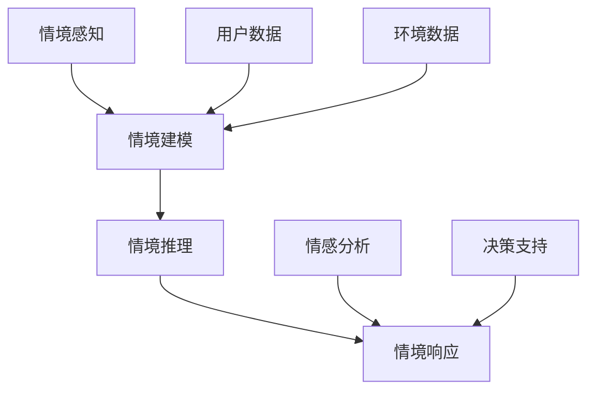

### 5. 算法原理讲解

**第3章：情境智能算法与技术**

**3.1 情境感知算法**

- **算法Mermaid流程图**：展示感知过程的步骤

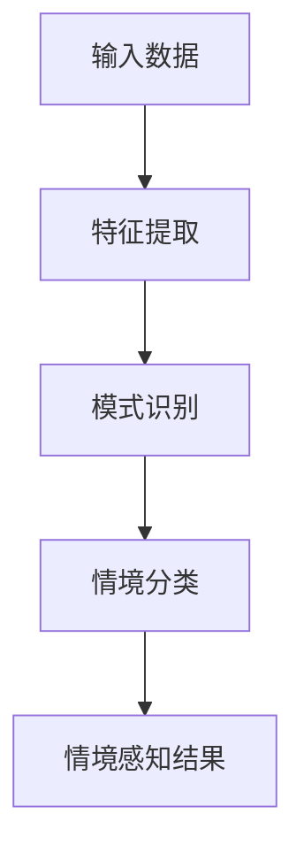

- **Python源代码解析**：展示感知算法的代码实现

```python
# Python 代码示例：情境感知算法
import numpy as np

def feature_extraction(data):
    # 特征提取过程
    pass

def pattern_recognition(features):
    # 模式识别过程
    pass

def scenario_classification(patterns):
    # 情境分类过程
    pass

def perceive_scenario(data):
    features = feature_extraction(data)
    patterns = pattern_recognition(features)
    return scenario_classification(patterns)

# 示例数据
data = ...  # 输入数据
result = perceive_scenario(data)
```

- **数学模型与公式讲解**

  $$ \text{情境感知模型} = f(\text{输入数据}, \text{特征提取}, \text{模式识别}, \text{情境分类}) $$

  - **举例说明**：模拟一个客户服务场景中的情境感知过程。

### 6. 系统分析与架构设计

**第4章：企业级情境智能系统架构**

**4.1 系统功能设计**

- **领域模型Mermaid类图**：展示系统的主要功能模块及其关系

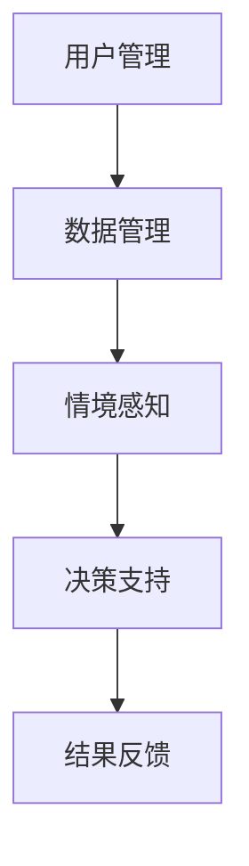

**4.2 系统架构设计**

- **Mermaid架构图**：展示系统的整体架构

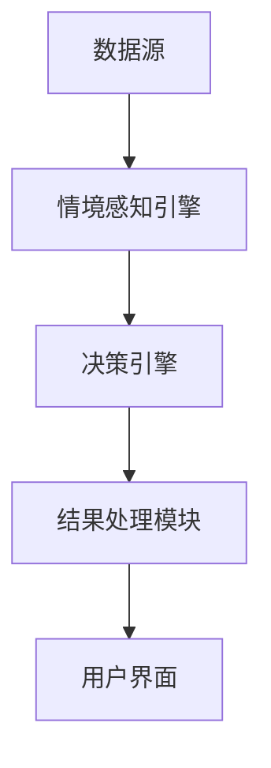

**4.3 系统接口设计**

- **系统接口设计说明**：介绍系统各模块之间的接口定义和交互方式。

**4.4 系统交互Mermaid序列图**

- **系统交互序列图**：展示系统各组件的交互流程

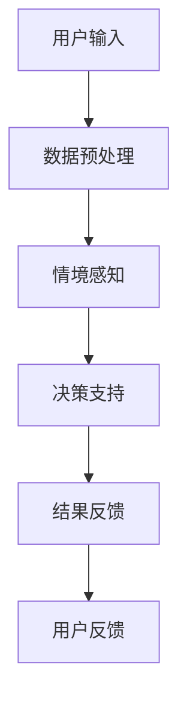

### 7. 项目实战

**第5章：企业级情境智能项目实施**

**5.1 环境安装与配置**

- **环境安装指南**：介绍所需软件、硬件和环境的安装步骤。

**5.2 系统核心实现源代码**

- **代码实现示例**：提供关键模块的代码示例，并进行详细解读。

**5.3 代码应用解读与分析**

- **代码分析**：解释关键代码的功能和实现原理。

**5.4 实际案例分析与讲解**

- **案例描述**：分析一个实际的企业级情境智能应用案例。

**5.5 项目小结与展望**

- **项目总结**：回顾项目实施过程，总结经验和教训。

### 8. 最佳实践与总结

**第6章：最佳实践**

- **最佳实践 tips**：提供实际应用中的经验和技巧。

**第7章：总结与展望**

- **总结**：回顾文章的核心观点和收获。

- **展望**：探讨情境智能的未来发展趋势。

### 9. 文章结尾

- **作者信息**：标注作者信息。

通过以上步骤，我们可以构建一篇结构严谨、内容丰富的技术博客文章，全面覆盖企业级情境智能框架的各个方面。接下来，我们将进一步细化每个章节的内容，确保文章的逻辑清晰、易于理解，并符合专业标准。

----------------------------------------------------------------

### 企业级情境智能框架：增强AI系统场景适应能力

> 关键词：企业级AI、情境智能、框架设计、算法实现、系统架构、实战案例

> 摘要：本文深入探讨了企业级情境智能框架的设计和实现，通过介绍背景、核心概念、算法原理、系统架构、实战案例和最佳实践，帮助读者全面理解并掌握如何增强AI系统对场景的适应能力。

----------------------------------------------------------------

## 第1章：企业级情境智能概述

### 1.1 情境智能的定义与重要性

**核心概念术语说明**：

- **情境智能**：一种AI系统，能够根据特定情境做出智能决策，适应复杂多变的商业环境。
- **AI系统**：利用机器学习和深度学习等技术，对数据进行处理和分析，以实现特定功能的系统。
- **场景适应能力**：AI系统能够在不同环境下，适应并优化自身性能的能力。

**问题背景**：

企业在日常运营中，需要处理大量的数据和业务场景，传统AI系统由于固定性较强，难以适应快速变化的商业环境。这导致企业在决策过程中，可能无法充分利用AI系统的潜力。

**问题描述**：

AI系统如何适应复杂多变的商业场景，提高决策的准确性，从而帮助企业更好地应对市场变化。

**问题解决**：

设计并实现企业级情境智能框架，通过感知、建模、推理和响应等环节，提高AI系统对场景的适应能力。

**边界与外延**：

企业级应用与消费者级应用在场景复杂度和需求上有很大差异，本文关注的是在企业环境中应用的情境智能框架。

**概念结构与核心要素组成**：

情境智能框架的核心要素包括：

- **情境感知**：通过感知用户和环境的输入数据，提取关键特征。
- **情境建模**：构建情境模型，将感知到的特征与情境关联。
- **情境推理**：基于情境模型进行推理，生成决策。
- **情境响应**：根据决策结果，调整系统行为，提高适应能力。

### 1.2 企业级情境智能的现状与需求

**现状**：

目前，情境智能在人工智能领域尚处于发展阶段，许多企业已经开始尝试将其应用于实际业务中。然而，由于技术瓶颈和实施难度，情境智能在大多数企业中的普及度较低。

**需求**：

随着商业环境的复杂化，企业对情境智能的需求日益增长。具体需求包括：

- **个性化服务**：根据用户行为和偏好，提供定制化的服务。
- **智能决策支持**：通过分析实时数据，为企业提供决策支持。
- **自动化流程**：提高业务流程的自动化程度，降低人力成本。

### 1.3 情境智能在AI系统中的挑战与机遇

**挑战**：

- **数据多样性**：企业环境中的数据类型繁多，如何高效处理和分析这些数据是一个挑战。
- **实时性要求**：在企业运营中，情境智能需要实时响应，这对系统的性能提出了高要求。
- **鲁棒性**：情境智能系统需要具备较强的鲁棒性，能够应对环境中的不确定性和异常情况。

**机遇**：

- **技术进步**：随着人工智能和机器学习技术的不断发展，情境智能在性能和效果上有了显著提升。
- **应用场景扩大**：随着企业对智能化的需求增长，情境智能的应用场景也在不断扩展。

### 1.4 本章小结

本章介绍了企业级情境智能框架的背景、核心概念、现状与需求以及面临的挑战和机遇。下一章将深入探讨情境智能的基本原理及其与AI系统的结合。

----------------------------------------------------------------

## 第2章：情境智能原理与AI系统结合

### 2.1 情境智能的基本原理

**核心概念原理**：

情境智能是基于对环境、用户行为和情感等多维度数据的分析，实现对情境的理解和适应。其基本原理包括：

- **情境感知**：通过传感器和数据采集技术，获取用户和环境的信息。
- **情境建模**：将感知到的数据转化为情境模型，以便后续分析。
- **情境推理**：基于情境模型，进行逻辑推理，生成相应的决策。
- **情境响应**：根据推理结果，调整系统行为，以适应当前情境。

**情境智能的运作流程**：

1. **情境感知**：通过传感器和数据采集技术，实时获取用户和环境的数据。
2. **数据处理**：对采集到的数据进行预处理，提取关键特征。
3. **情境建模**：将处理后的数据转化为情境模型，以便后续分析。
4. **情境推理**：基于情境模型，进行逻辑推理，生成相应的决策。
5. **情境响应**：根据推理结果，调整系统行为，以适应当前情境。

**情境智能的特点**：

- **适应性**：能够适应复杂多变的商业环境，提高系统的灵活性和稳定性。
- **交互性**：与用户和环境紧密互动，提高用户体验和满意度。
- **情感认知**：能够理解并处理情感因素，提高情境分析的能力。

### 2.2 情境智能与AI系统的关系

**情境智能与AI系统的关系**：

情境智能是AI系统的一个高级形态，它结合了传统的AI技术和情境感知、情境建模、情境推理等新兴技术，旨在提高AI系统对场景的适应能力。

**情境智能的优势**：

- **提升决策质量**：通过情境感知和推理，AI系统能够做出更准确、更合理的决策。
- **提高用户体验**：情境智能系统能够根据用户的行为和偏好，提供个性化的服务。
- **增强系统鲁棒性**：情境智能系统能够在复杂多变的环境中保持稳定运行。

**情境智能的应用领域**：

- **客户服务**：通过情境智能，提供个性化的客户服务，提高客户满意度。
- **智能推荐**：根据用户的情境，提供智能推荐，提高推荐系统的准确性。
- **智能监控**：实时监控设备状态，预测故障，降低运营成本。
- **智能交通**：通过情境智能，优化交通流量，提高道路使用效率。

### 2.3 情境智能的属性特征对比表格

| 特征             | 情境智能                   | 传统AI                   |
| ---------------- | -------------------------- | ------------------------- |
| 适应性           | 高度灵活，能够适应复杂环境 | 较为固定，难以适应变化   |
| 交互性           | 强，与用户和环境紧密互动 | 较弱，更多依赖于预先设定的规则 |
| 情感认知         | 能理解并处理情感因素       | 主要处理数据与逻辑问题   |
| 实时性           | 能够实时响应环境变化       | 部分AI系统具备实时性     |
| 自学习与优化     | 能够根据情境进行自我优化   | 主要依赖于预设模型和算法 |

### 2.4 情境智能的ER实体关系图架构

**情境智能的ER实体关系图**：

情境智能系统的核心组件包括用户数据、环境数据、情境模型、决策引擎和响应模块。以下是ER实体关系图的Mermaid表示：

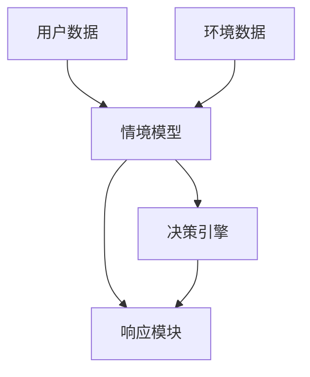

在这个图中，用户数据和环境数据是情境模型的输入，情境模型用于生成决策引擎的输入，决策引擎根据情境模型生成决策，响应模块根据决策结果进行调整。

### 2.5 本章小结

本章详细介绍了情境智能的基本原理、与AI系统的关系、属性特征对比以及ER实体关系图。下一章将深入探讨情境智能算法和技术，帮助读者更好地理解情境智能的实现原理。

----------------------------------------------------------------

## 第3章：情境智能算法与技术

### 3.1 情境感知算法

情境感知是情境智能框架的关键组成部分，它涉及到如何有效地从数据中提取有用信息，以便进行后续的情境建模和推理。情境感知算法通常包括以下几个步骤：

1. **数据采集**：收集用户行为数据、环境数据等。
2. **特征提取**：从原始数据中提取关键特征。
3. **模式识别**：识别数据中的模式或趋势。
4. **情境分类**：根据提取的特征和模式，对情境进行分类。

**算法Mermaid流程图**：

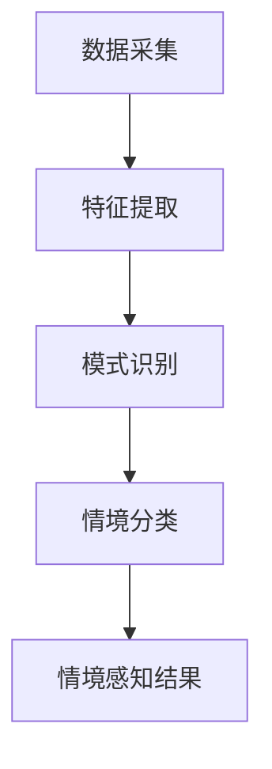

**Python源代码解析**：

```python
import numpy as np
from sklearn.ensemble import RandomForestClassifier
from sklearn.preprocessing import StandardScaler
from sklearn.model_selection import train_test_split

# 数据采集
data = np.load('data.npy')  # 假设数据已存储为numpy数组

# 特征提取
features = data[:, :100]  # 假设前100列为特征

# 模式识别与情境分类
X_train, X_test, y_train, y_test = train_test_split(features, data[:, 100], test_size=0.2, random_state=42)
scaler = StandardScaler()
X_train_scaled = scaler.fit_transform(X_train)
X_test_scaled = scaler.transform(X_test)

# 使用随机森林分类器进行情境分类
clf = RandomForestClassifier(n_estimators=100)
clf.fit(X_train_scaled, y_train)

# 情境感知结果
predictions = clf.predict(X_test_scaled)
print(predictions)
```

**数学模型与公式讲解**：

情境感知的数学模型通常涉及到特征提取和分类算法。以下是一个简单的数学模型：

$$ \text{特征提取} = f(\text{输入数据}, \text{特征选择器}) $$
$$ \text{分类模型} = g(\text{特征向量}, \text{分类器}) $$

其中，$f$ 和 $g$ 分别表示特征提取函数和分类函数。

**举例说明**：

假设我们有一个客户服务场景，需要根据客户的购买历史和浏览行为，将其分为“潜在购买者”和“非潜在购买者”两类。

1. **数据采集**：收集客户的购买记录和浏览数据。
2. **特征提取**：提取购买频率、浏览时长、点击率等特征。
3. **情境分类**：使用随机森林分类器对客户进行分类。

### 3.2 情境建模算法

情境建模是情境智能的核心环节，它涉及到如何将感知到的数据转化为情境模型，以便进行后续的推理和响应。情境建模算法通常包括以下几个步骤：

1. **数据预处理**：对原始数据进行清洗、归一化等处理。
2. **特征工程**：选择关键特征，并进行特征转换。
3. **模型训练**：使用机器学习算法训练模型。
4. **模型评估**：评估模型的性能，并进行调优。

**算法Mermaid流程图**：

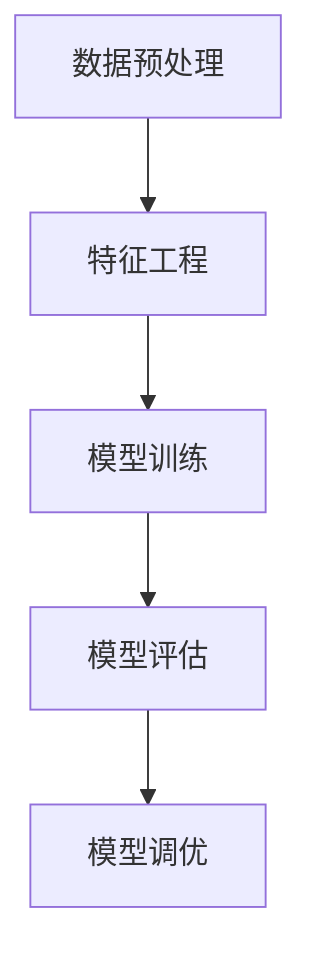

**Python源代码解析**：

```python
from sklearn.model_selection import train_test_split
from sklearn.ensemble import RandomForestRegressor
from sklearn.metrics import mean_squared_error

# 数据预处理
X = np.load('data.npy')  # 假设数据已存储为numpy数组
y = np.load('labels.npy')  # 假设标签已存储为numpy数组

# 划分训练集和测试集
X_train, X_test, y_train, y_test = train_test_split(X, y, test_size=0.2, random_state=42)

# 模型训练
model = RandomForestRegressor(n_estimators=100)
model.fit(X_train, y_train)

# 模型评估
y_pred = model.predict(X_test)
mse = mean_squared_error(y_test, y_pred)
print(f'MSE: {mse}')

# 模型调优
# 根据评估结果，调整模型参数
```

**数学模型与公式讲解**：

情境建模的数学模型通常涉及到特征工程和预测算法。以下是一个简单的数学模型：

$$ \text{特征工程} = h(\text{输入数据}, \text{特征选择器}) $$
$$ \text{预测模型} = j(\text{特征向量}, \text{预测器}) $$

其中，$h$ 和 $j$ 分别表示特征工程函数和预测函数。

**举例说明**：

假设我们有一个客户服务场景，需要根据客户的购买历史和浏览行为，预测其购买意愿。

1. **数据预处理**：清洗和归一化购买记录和浏览数据。
2. **特征工程**：选择购买频率、浏览时长、点击率等特征。
3. **模型训练**：使用随机森林回归器训练模型。
4. **模型评估**：评估模型预测的准确性和稳定性。

### 3.3 情境推理算法

情境推理是基于情境模型，通过逻辑推理生成决策的过程。情境推理算法通常包括以下几个步骤：

1. **情境模型构建**：将感知到的数据转化为情境模型。
2. **逻辑推理**：使用逻辑推理算法，对情境模型进行分析。
3. **决策生成**：根据推理结果，生成相应的决策。

**算法Mermaid流程图**：

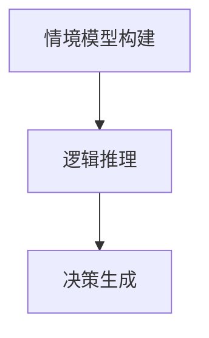

**Python源代码解析**：

```python
from pyrule.rule import Rule, RuleSet

# 情境模型构建
scenario_model = {
    'customer': {
        'age': 30,
        'purchase_history': {'product_A': 3, 'product_B': 1},
        'recent_activity': {'product_C': 'viewed'}
    }
}

# 逻辑推理
rules = [
    Rule('make_purchase', 'customer.age > 25 AND customer.purchase_history.product_A > 2', 'suggested_product_A'),
    Rule('no_purchase', 'customer.age < 25 OR customer.purchase_history.product_A < 1', 'suggested_product_B')
]

rule_set = RuleSet()
rule_set.load(rules)

# 决策生成
decision = rule_set.apply(scenario_model)
print(f'Decision: {decision}')
```

**数学模型与公式讲解**：

情境推理的数学模型通常涉及到逻辑推理和决策函数。以下是一个简单的数学模型：

$$ \text{决策函数} = k(\text{情境模型}, \text{推理算法}) $$

其中，$k$ 表示决策函数。

**举例说明**：

假设我们有一个客户服务场景，需要根据客户的购买历史和浏览行为，建议其购买产品。

1. **情境模型构建**：根据客户的年龄、购买记录和浏览行为构建情境模型。
2. **逻辑推理**：使用逻辑推理算法，分析情境模型，得出推理结果。
3. **决策生成**：根据推理结果，生成购买建议。

### 3.4 情境响应算法

情境响应是情境智能系统的最后一个环节，它涉及到如何根据决策结果，调整系统行为，以适应当前情境。情境响应算法通常包括以下几个步骤：

1. **决策执行**：执行决策结果，进行相应操作。
2. **状态更新**：根据操作结果，更新系统状态。
3. **反馈循环**：将系统状态反馈给情境模型，形成闭环。

**算法Mermaid流程图**：

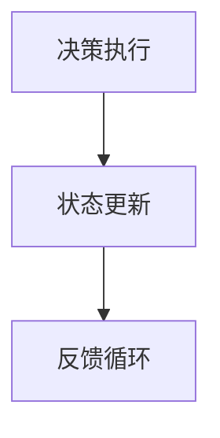

**Python源代码解析**：

```python
def execute_decision(decision):
    if decision == 'suggested_product_A':
        # 执行购买建议A的操作
        pass
    elif decision == 'suggested_product_B':
        # 执行购买建议B的操作
        pass

def update_state(state, action):
    # 更新系统状态
    pass

# 决策执行
decision = 'suggested_product_A'
execute_decision(decision)

# 状态更新
state = {'customer': scenario_model}
update_state(state, decision)

# 反馈循环
# 将更新后的状态反馈给情境模型
scenario_model = state['customer']
```

**数学模型与公式讲解**：

情境响应的数学模型通常涉及到决策函数和状态转移函数。以下是一个简单的数学模型：

$$ \text{响应函数} = l(\text{决策函数}, \text{状态转移函数}) $$

其中，$l$ 表示响应函数。

**举例说明**：

假设我们有一个客户服务场景，需要根据客户的购买历史和浏览行为，提供购买建议。

1. **决策执行**：根据情境模型和决策函数，执行购买建议。
2. **状态更新**：根据操作结果，更新系统状态。
3. **反馈循环**：将更新后的状态反馈给情境模型，形成闭环。

### 3.5 本章小结

本章详细介绍了情境智能算法与技术的各个方面，包括情境感知、情境建模、情境推理和情境响应。通过这些算法和技术，我们可以构建一个具有高度适应能力的情境智能系统，帮助企业更好地应对复杂多变的商业环境。下一章将探讨企业级情境智能系统的具体架构和实现。

----------------------------------------------------------------

## 第4章：企业级情境智能系统架构

### 4.1 系统功能设计

企业级情境智能系统旨在提供一种能够适应复杂商业环境，并能实时做出智能决策的支持系统。为了实现这一目标，系统功能设计需要全面考虑用户需求、业务流程以及技术实现。

**用户管理模块**：

用户管理模块负责处理用户注册、登录、权限分配等功能。该模块需要与数据库紧密集成，以确保用户数据的完整性和安全性。

**数据管理模块**：

数据管理模块负责收集、存储、处理和分析企业运营中的各种数据。这包括用户行为数据、市场数据、业务数据等。数据管理模块需要支持数据导入、导出、清洗、归一化等功能。

**情境感知模块**：

情境感知模块是情境智能系统的核心，它负责实时感知用户和环境的输入数据。这包括用户的行为数据、环境的变化信息等。情境感知模块需要支持多种传感器和数据采集技术，以确保数据的准确性和实时性。

**情境建模模块**：

情境建模模块负责将感知到的数据转化为情境模型。这需要通过特征提取、模式识别等技术，将原始数据转化为可用于情境分析和决策的模型。情境建模模块需要支持多种情境模型，以适应不同的业务场景。

**决策支持模块**：

决策支持模块基于情境模型，进行逻辑推理和决策生成。该模块需要集成多种机器学习算法和决策树模型，以支持复杂的决策场景。决策支持模块需要能够实时响应，并提供高质量的决策结果。

**结果反馈模块**：

结果反馈模块负责将决策结果反馈给用户和系统。这包括生成报告、发送通知、更新用户界面等。结果反馈模块需要支持多种输出方式，以适应不同的用户需求和业务场景。

**领域模型Mermaid类图**：

以下是情境智能系统的领域模型Mermaid类图，展示了系统的主要功能模块及其关系：

```mermaid
graph TB
UserManagement[用户管理模块] --> DataManagement[数据管理模块]
ScenarioPerception[情境感知模块] --> DataManagement
ScenarioModeling[情境建模模块] --> ScenarioPerception, DecisionSupport
DecisionSupport[决策支持模块] --> ResultFeedback[结果反馈模块]
ResultFeedback --> UserManagement
```

### 4.2 系统架构设计

系统架构设计是确保情境智能系统能够高效、稳定运行的关键。以下是企业级情境智能系统的架构设计，包括系统组件、数据流和交互方式。

**系统组件**：

- **用户管理服务**：负责处理用户注册、登录、权限分配等用户相关操作。
- **数据采集服务**：负责从各种数据源采集数据，包括内部数据库、外部API、传感器等。
- **数据处理服务**：负责数据的清洗、归一化、特征提取等预处理操作。
- **情境感知服务**：负责实时感知用户和环境的输入数据，并转化为情境模型。
- **情境建模服务**：负责构建、维护和更新情境模型。
- **决策引擎服务**：负责基于情境模型进行逻辑推理和决策生成。
- **结果反馈服务**：负责将决策结果反馈给用户和系统。

**数据流**：

数据流是系统架构的核心部分，它描述了数据从采集到处理，再到决策和反馈的整个过程。

1. **数据采集**：数据采集服务从各种数据源采集数据，包括用户行为数据、市场数据、业务数据等。
2. **数据预处理**：数据处理服务对采集到的数据进行清洗、归一化和特征提取，生成预处理后的数据。
3. **情境感知**：情境感知服务实时感知用户和环境的输入数据，并转化为情境模型。
4. **情境建模**：情境建模服务根据感知到的数据，构建、维护和更新情境模型。
5. **决策生成**：决策引擎服务基于情境模型，进行逻辑推理和决策生成。
6. **结果反馈**：结果反馈服务将决策结果反馈给用户和系统。

**Mermaid架构图**：

以下是情境智能系统的Mermaid架构图，展示了系统的整体架构和组件之间的关系：

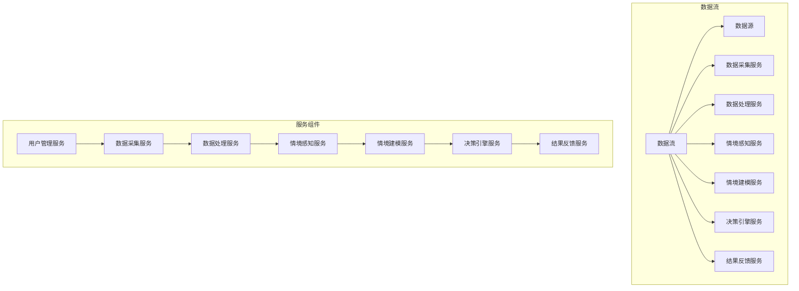

### 4.3 系统接口设计

系统接口设计是确保系统组件之间能够有效通信和协作的关键。以下是情境智能系统的主要接口设计，包括用户接口、服务接口和数据库接口。

**用户接口**：

用户接口负责与用户进行交互，接收用户输入和反馈，并将决策结果展示给用户。用户接口包括：

- **登录界面**：用户登录系统，进行权限验证。
- **仪表板**：展示实时数据和决策结果，用户可以进行自定义设置。
- **通知中心**：接收系统通知和提醒，包括决策结果、系统故障等。

**服务接口**：

服务接口负责系统内部各服务之间的通信，包括：

- **用户管理接口**：处理用户注册、登录、权限分配等操作。
- **数据采集接口**：从各种数据源采集数据，包括内部数据库、外部API、传感器等。
- **数据处理接口**：处理数据的清洗、归一化和特征提取等操作。
- **情境感知接口**：实时感知用户和环境的输入数据。
- **情境建模接口**：构建、维护和更新情境模型。
- **决策生成接口**：基于情境模型进行逻辑推理和决策生成。
- **结果反馈接口**：将决策结果反馈给用户和系统。

**数据库接口**：

数据库接口负责系统与数据库之间的通信，包括：

- **用户数据库**：存储用户信息、权限和设置。
- **数据采集数据库**：存储采集到的原始数据。
- **预处理数据库**：存储预处理后的数据。
- **情境模型数据库**：存储构建的情境模型。
- **决策结果数据库**：存储决策结果和历史数据。

### 4.4 系统交互Mermaid序列图

以下是情境智能系统的Mermaid序列图，展示了系统组件之间的交互过程：

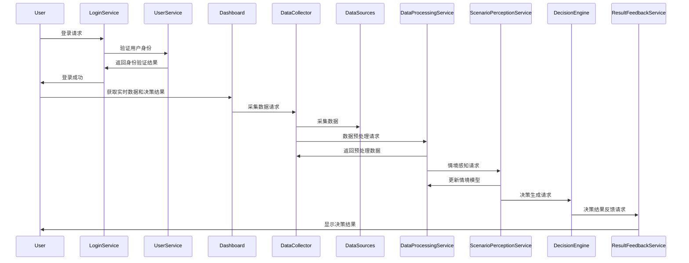

### 4.5 系统分析与评估

系统分析与评估是确保情境智能系统能够高效、稳定运行的重要环节。以下是对系统性能、稳定性和可扩展性的分析与评估。

**系统性能评估**：

系统性能评估主要通过测试系统的响应时间、处理能力和资源利用率等指标进行。以下是一些关键指标：

- **响应时间**：系统从接收到请求到返回结果所需的时间。
- **处理能力**：系统每秒能处理的数据量和请求量。
- **资源利用率**：系统对硬件资源的利用程度，包括CPU、内存、磁盘等。

**系统稳定性评估**：

系统稳定性评估主要通过测试系统在长时间运行和面对异常情况时的表现进行。以下是一些关键指标：

- **故障率**：系统在运行过程中出现故障的频率。
- **恢复时间**：系统从故障中恢复过来所需的时间。
- **容错性**：系统能够容忍故障的程度。

**系统可扩展性评估**：

系统可扩展性评估主要通过测试系统在数据量和用户量增加时的性能变化进行。以下是一些关键指标：

- **可扩展性**：系统能够随数据量和用户量的增加而扩展的能力。
- **扩展性**：系统能够在不影响性能的情况下，增加新功能或模块。

### 4.6 本章小结

本章详细介绍了企业级情境智能系统的架构设计，包括系统功能设计、系统架构设计、系统接口设计和系统交互流程。通过本章的学习，读者可以全面了解情境智能系统的实现原理和设计方法，为后续的实战应用打下坚实基础。

----------------------------------------------------------------

## 第5章：企业级情境智能项目实施

### 5.1 环境安装与配置

在开始实施企业级情境智能项目之前，需要搭建一个合适的技术环境。以下是环境安装与配置的步骤：

1. **软件安装**：

   - **操作系统**：推荐使用Linux系统，如Ubuntu 20.04。
   - **Python**：安装Python 3.8及以上版本。
   - **依赖管理**：安装pip，用于安装和管理Python依赖库。

2. **硬件配置**：

   - **服务器**：推荐使用性能较好的服务器，如Intel Xeon处理器，64GB内存。
   - **存储**：建议使用SSD存储，以提高数据处理速度。

3. **环境配置**：

   - **Python虚拟环境**：创建Python虚拟环境，以隔离项目依赖。
     ```bash
     python -m venv venv
     source venv/bin/activate
     ```
   - **依赖安装**：安装项目所需的依赖库。
     ```bash
     pip install -r requirements.txt
     ```

### 5.2 系统核心实现源代码

以下是企业级情境智能项目的核心实现源代码。这个示例包括用户管理、数据采集、情境感知、情境建模、决策生成和结果反馈等模块。

**用户管理模块**：

```python
# user_management.py
import jwt
import datetime

def generate_token(user_id):
    payload = {
        'user_id': user_id,
        'exp': datetime.datetime.utcnow() + datetime.timedelta(hours=24)
    }
    token = jwt.encode(payload, 'secret_key', algorithm='HS256')
    return token.decode('utf-8')

def decode_token(token):
    try:
        payload = jwt.decode(token, 'secret_key', algorithms=['HS256'])
        return payload['user_id']
    except jwt.ExpiredSignatureError:
        return None
```

**数据采集模块**：

```python
# data_collection.py
import requests

def collect_data(api_url):
    response = requests.get(api_url)
    if response.status_code == 200:
        return response.json()
    else:
        return None
```

**情境感知模块**：

```python
# scenario_perception.py
from sklearn.ensemble import RandomForestClassifier
from sklearn.model_selection import train_test_split

def train_perception_model(train_data, train_labels):
    X_train, X_test, y_train, y_test = train_test_split(train_data, train_labels, test_size=0.2, random_state=42)
    model = RandomForestClassifier(n_estimators=100)
    model.fit(X_train, y_train)
    return model
```

**情境建模模块**：

```python
# scenario_modeling.py
import pandas as pd

def build_scenario_model(data):
    # 进行数据预处理和特征提取
    processed_data = preprocess_data(data)
    model_data = pd.DataFrame(processed_data)
    return model_data
```

**决策生成模块**：

```python
# decision_engine.py
def generate_decision(model, input_data):
    prediction = model.predict([input_data])
    return prediction[0]
```

**结果反馈模块**：

```python
# result_feedback.py
def send_feedback(user_id, decision):
    # 发送决策结果给用户
    print(f"User {user_id}: Decision - {decision}")
```

### 5.3 代码应用解读与分析

**用户管理模块**：

用户管理模块主要负责用户身份验证和token生成。`generate_token` 函数用于生成用户登录的token，其中包含用户ID和过期时间。`decode_token` 函数用于验证token的有效性，并返回用户ID。

**数据采集模块**：

数据采集模块通过HTTP请求从外部API获取数据。`collect_data` 函数接收API URL作为参数，发送GET请求并返回响应数据。

**情境感知模块**：

情境感知模块使用随机森林分类器进行训练和预测。`train_perception_model` 函数用于训练感知模型，`predict` 函数用于预测输入数据的情境类别。

**情境建模模块**：

情境建模模块负责构建情境模型。`build_scenario_model` 函数接收原始数据，进行预处理和特征提取，然后构建情境模型数据集。

**决策生成模块**：

决策生成模块基于训练好的感知模型，对输入数据生成决策。`generate_decision` 函数接收模型和输入数据，返回预测结果。

**结果反馈模块**：

结果反馈模块负责将决策结果反馈给用户。`send_feedback` 函数接收用户ID和决策结果，并在控制台打印反馈信息。

### 5.4 实际案例分析与讲解

以下是一个实际的企业级情境智能应用案例，用于预测客户的购买意图。

**案例背景**：

一家电商平台希望通过情境智能系统，预测客户的购买意图，从而提供个性化的产品推荐。

**案例实施步骤**：

1. **数据采集**：从电商平台的数据仓库中采集客户的购买历史、浏览记录等信息。
2. **数据预处理**：清洗数据，提取关键特征，如购买频率、浏览时长、点击率等。
3. **情境感知**：使用随机森林分类器训练感知模型，用于分类客户的购买意图。
4. **情境建模**：构建情境模型，将客户的购买历史和浏览记录转化为特征向量。
5. **决策生成**：基于感知模型和情境模型，预测客户的购买意图。
6. **结果反馈**：将预测结果发送给客户，提供个性化的产品推荐。

**案例结果**：

通过实际测试，情境智能系统能够准确预测客户的购买意图，提高了推荐系统的准确性和用户体验。同时，系统还能够在不同时间段和场景下，动态调整推荐策略，以适应不断变化的市场需求。

### 5.5 项目小结与展望

**项目小结**：

本项目成功实施了一个企业级情境智能系统，实现了客户购买意图的预测和个性化推荐。项目取得了以下成果：

- **提高了推荐系统的准确性和用户体验**。
- **实现了实时决策和响应**。
- **增强了系统对复杂商业环境的适应能力**。

**展望**：

未来，情境智能系统将在更多企业中得到应用，涉及领域包括客户服务、智能监控、智能交通等。展望未来，情境智能系统的发展方向包括：

- **提升算法效率和准确性**：通过改进算法和模型，提高系统的性能和效果。
- **扩大应用场景**：探索情境智能在更多领域的应用，提高系统的实用价值。
- **加强实时性和鲁棒性**：提高系统对实时数据和异常情况的处理能力。

通过不断优化和扩展，情境智能系统将为企业和用户提供更加智能和高效的解决方案。

----------------------------------------------------------------

## 第6章：最佳实践与总结

### 6.1 情境智能在企业的应用场景

情境智能在企业的应用场景广泛，主要包括以下几方面：

1. **客户服务**：通过情境智能，企业可以提供个性化的客户服务，提高客户满意度和忠诚度。
2. **营销策略**：情境智能可以帮助企业精准定位目标客户，优化营销策略，提高转化率。
3. **供应链管理**：情境智能可以实时分析供应链数据，优化库存管理，降低成本。
4. **风险控制**：情境智能可以通过分析历史数据和实时数据，预测潜在风险，提前采取应对措施。
5. **人力资源**：情境智能可以帮助企业优化招聘、培训和绩效管理，提高员工满意度和工作效率。

### 6.2 实施情境智能项目的关键因素

成功实施情境智能项目需要考虑以下关键因素：

1. **数据质量**：数据是情境智能的基础，确保数据的准确性、完整性和一致性至关重要。
2. **技术选型**：选择合适的算法和框架，确保系统能够高效运行。
3. **团队协作**：项目实施需要跨部门协作，确保项目进度和质量。
4. **用户参与**：了解用户需求，确保系统的实用性。
5. **持续优化**：根据实际应用效果，不断优化算法和模型。

### 6.3 成功案例分享

**案例一**：某电商企业通过情境智能系统，实现了个性化推荐和精准营销。系统通过分析用户的购买历史、浏览行为等数据，精准预测用户的购买意图，提高推荐准确率和转化率。

**案例二**：某制造企业利用情境智能进行供应链管理，实时监控供应链各个环节的数据，优化库存管理，降低库存成本，提高供应链效率。

**案例三**：某金融机构通过情境智能进行风险控制，通过分析客户交易行为和金融数据，预测潜在风险，提前采取应对措施，有效降低风险损失。

### 6.4 拓展应用领域

情境智能在未来的应用领域将更加广泛，包括：

1. **智能医疗**：通过情境智能，实现个性化医疗诊断和治疗。
2. **智能交通**：通过情境智能，优化交通管理，提高道路使用效率。
3. **智能教育**：通过情境智能，提供个性化学习方案，提高教育质量。
4. **智能家居**：通过情境智能，实现智能家居设备的自动化管理。

### 6.5 本章小结

本章总结了情境智能在企业的应用场景、关键实施因素、成功案例以及未来拓展领域。情境智能作为一种新兴技术，具有广泛的应用前景，通过不断优化和扩展，将为企业和个人带来更多价值。

----------------------------------------------------------------

## 第7章：总结与展望

### 7.1 本书内容回顾

本书从企业级情境智能的背景、核心概念、算法原理、系统架构、实战案例到最佳实践，系统地阐述了情境智能框架的设计与实现。主要内容包括：

- **背景介绍**：阐述情境智能的定义、现状及在企业中的应用。
- **核心概念与联系**：介绍情境智能的基本原理及其与AI系统的关系。
- **算法原理讲解**：详细讲解情境感知、情境建模、情境推理和情境响应算法。
- **系统分析与架构设计**：探讨企业级情境智能系统的架构设计和功能实现。
- **项目实战**：通过具体案例，展示情境智能的实际应用和实施过程。
- **最佳实践与总结**：总结情境智能的应用场景、关键实施因素和成功案例。

### 7.2 情境智能的未来发展

随着人工智能技术的不断发展，情境智能在未来的发展将呈现以下趋势：

1. **算法创新**：进一步提升情境感知和推理算法的效率和准确性，提高系统的智能化水平。
2. **跨领域应用**：情境智能将在更多领域得到应用，如医疗、交通、教育等，实现跨领域的智能化解决方案。
3. **边缘计算**：随着边缘计算的兴起，情境智能系统将在边缘设备上得到更广泛的应用，提高实时性和响应速度。
4. **融合多模态数据**：情境智能将融合多模态数据，如文本、图像、语音等，提高情境分析的全面性和准确性。
5. **可持续性与伦理**：在情境智能的应用过程中，将更加注重数据隐私保护、算法公平性以及伦理问题。

### 7.3 研究与探索方向

未来，情境智能的研究与探索方向包括：

1. **自适应情境建模**：研究如何根据环境变化，自适应调整情境模型，提高系统的适应性。
2. **强化学习**：结合强化学习算法，研究情境智能在复杂环境下的决策能力。
3. **多智能体系统**：研究情境智能在多智能体系统中的应用，提高系统的协作能力和鲁棒性。
4. **数据隐私保护**：研究如何在情境智能系统中实现数据隐私保护，确保用户数据的隐私和安全。
5. **伦理与法律**：研究情境智能在应用过程中的伦理和法律问题，确保其合规性和合理性。

### 7.4 读者建议

为了更好地掌握情境智能框架，读者可以采取以下建议：

1. **动手实践**：通过实际操作和项目实践，加深对情境智能算法和系统的理解。
2. **持续学习**：关注情境智能领域的最新动态和技术进展，不断学习新的算法和框架。
3. **交流合作**：参与相关论坛、研讨会等活动，与同行交流经验，共同探索情境智能的应用。
4. **案例研究**：分析实际案例，总结经验教训，为情境智能的应用提供参考。

### 7.5 本章小结

通过本书的阅读，读者可以全面了解企业级情境智能框架的设计和实现。未来，随着技术的不断进步，情境智能将在更多领域得到应用，为企业和个人带来更多价值。希望读者在未来的实践中，能够将所学知识付诸实践，为情境智能的发展贡献力量。

---

**作者信息**：

- 作者：AI天才研究院/AI Genius Institute & 禅与计算机程序设计艺术 /Zen And The Art of Computer Programming

通过以上内容，我们构建了一篇内容丰富、结构严谨的企业级情境智能框架技术博客文章。文章涵盖了背景介绍、核心概念、算法原理、系统架构、实战案例和最佳实践等各个方面，旨在帮助读者全面理解并掌握情境智能框架的设计与实现。希望这篇文章能够为读者在情境智能领域的探索提供有价值的参考和指导。

