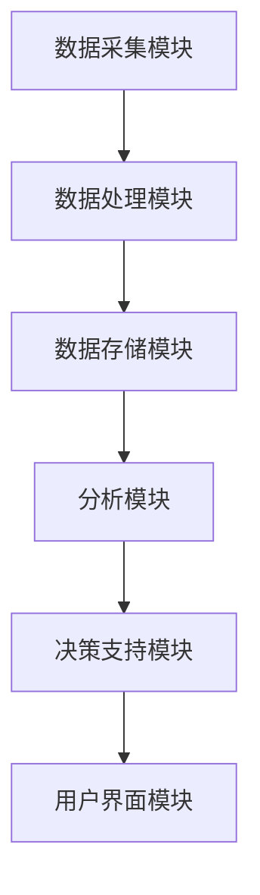
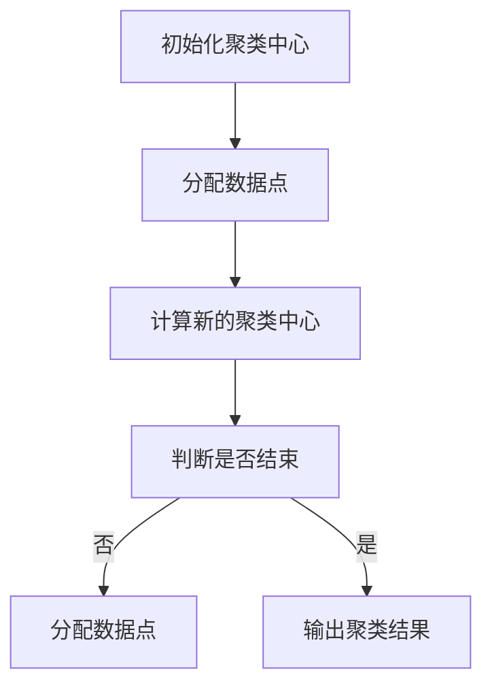
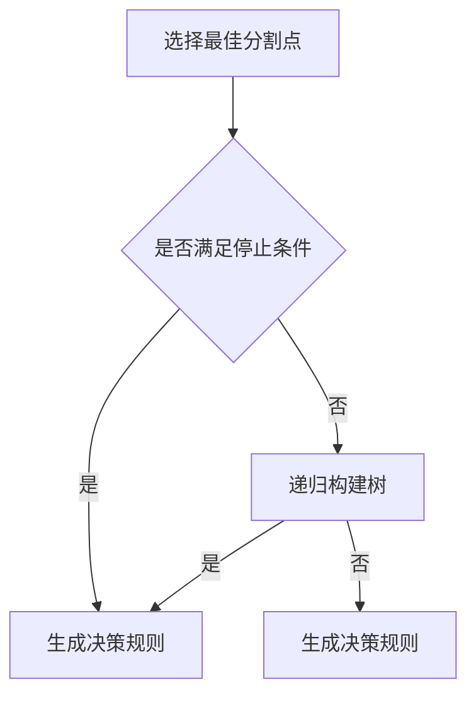

                 

# 企业级情境智能框架：增强场景适应性

关键词：情境智能、企业级、场景适应性、智能框架、架构设计、算法原理

摘要：本文深入探讨了企业级情境智能框架的设计理念、核心组件以及增强场景适应性的方法。通过详细分析背景、核心概念、设计原则、架构组件和具体应用场景，本文旨在为企业和开发者提供一套系统、实用的智能解决方案，以应对快速变化的市场环境。

## 引言

在现代商业环境中，企业面临的挑战日益复杂和多样化。快速变化的市场需求、激烈的竞争压力以及不确定的宏观经济环境，使得企业必须具备高度的情境适应能力。情境智能（Situational Intelligence）作为一种新兴的智能技术，能够在动态环境中为企业提供实时、准确的信息分析和决策支持，从而提升企业的应变能力和竞争力。

### 情境智能的定义与重要性

情境智能是指通过实时数据收集、处理和分析，对当前环境进行深入理解，从而生成有针对性的洞察和行动建议。在企业级应用中，情境智能不仅能够帮助企业更好地理解市场动态和客户需求，还能够优化内部运营流程，提高决策效率。

### 企业级情境智能框架的设计目标

企业级情境智能框架的设计目标主要包括以下几个方面：

1. **增强场景适应性**：框架需要具备灵活的架构和强大的数据处理能力，能够适应不同企业的特定需求。
2. **提高决策效率**：通过实时分析，为企业提供快速、准确的决策支持。
3. **优化运营流程**：通过智能分析，优化企业的运营流程，提高效率。
4. **保障数据安全**：确保企业数据的安全性和隐私性，防止数据泄露。

### 本文结构

本文将分为以下几个部分：

1. **背景与核心概念**：介绍情境智能的基本概念，探讨企业面临的情境适应性挑战。
2. **设计原则与架构**：详细阐述情境智能框架的设计原则和核心组件。
3. **核心模型与算法**：介绍情境智能框架中使用的核心模型和算法，并使用实例进行说明。
4. **系统分析与架构设计**：分析系统功能设计、系统架构设计和系统接口设计。
5. **项目实战与案例分析**：通过具体的项目实战，展示情境智能框架的实际应用。
6. **最佳实践与拓展阅读**：总结最佳实践，提出注意事项，并推荐相关阅读资源。

## 背景与核心概念

### 情境智能的基本概念

情境智能（Situational Intelligence）是指通过实时数据收集、处理和分析，对当前环境进行深入理解，从而生成有针对性的洞察和行动建议。它涵盖了从数据采集、处理、分析到决策的全过程。

在企业级应用中，情境智能的关键在于：

- **实时性**：能够实时捕捉环境变化，为企业提供及时的信息。
- **准确性**：通过准确的数据分析和处理，提供可靠的信息支持。
- **针对性**：根据企业的具体需求，提供有针对性的建议。

### 企业面临的情境适应性挑战

企业面临的情境适应性挑战主要包括：

1. **市场变化快**：市场需求快速变化，企业需要迅速调整战略。
2. **竞争压力大**：竞争对手不断涌现，企业需要保持竞争优势。
3. **运营效率低**：内部运营流程繁琐，效率低下。
4. **数据不完整**：数据来源多样，数据质量参差不齐。

这些挑战使得企业需要具备高度的情境适应能力，以应对快速变化的市场环境。

### 情境智能在企业管理中的应用

情境智能在企业管理中的应用主要体现在以下几个方面：

1. **战略规划**：通过实时数据分析，为企业提供战略规划的决策支持。
2. **市场预测**：通过分析市场数据，预测未来市场趋势。
3. **风险管理**：通过实时监控，及时识别和应对潜在风险。
4. **运营优化**：通过智能分析，优化内部运营流程。

### 情境智能框架的设计目标

企业级情境智能框架的设计目标主要包括以下几个方面：

1. **增强场景适应性**：框架需要具备灵活的架构和强大的数据处理能力，能够适应不同企业的特定需求。
2. **提高决策效率**：通过实时分析，为企业提供快速、准确的决策支持。
3. **优化运营流程**：通过智能分析，优化企业的运营流程，提高效率。
4. **保障数据安全**：确保企业数据的安全性和隐私性，防止数据泄露。

## 设计原则与架构

### 设计原则

企业级情境智能框架的设计原则主要包括：

1. **模块化与可扩展性**：框架应该采用模块化设计，便于扩展和升级。
2. **实时数据处理**：框架需要具备强大的数据处理能力，能够实时处理海量数据。
3. **数据安全与隐私保护**：在数据处理过程中，需要确保数据的安全性和隐私性。
4. **用户友好性**：框架需要易于使用，提供友好的用户界面。
5. **高效性与稳定性**：框架需要保证高效性和稳定性，能够持续运行。

### 架构组件

企业级情境智能框架的核心组件主要包括：

1. **数据采集模块**：负责收集来自不同源的数据，包括内部数据和外部数据。
2. **数据处理模块**：负责对收集到的数据进行清洗、转换和存储。
3. **分析模块**：负责对数据进行分析和挖掘，提取有价值的信息。
4. **决策支持模块**：负责根据分析结果，提供决策支持。
5. **用户界面模块**：负责与用户交互，提供直观的界面展示。

### 模块交互与数据流

在框架中，各个模块之间的交互和数据流设计至关重要。具体来说，数据采集模块将数据传输到数据处理模块，经过清洗和转换后存储在数据存储模块。分析模块从数据存储模块中获取数据，进行数据分析和挖掘，并将分析结果传输到决策支持模块。决策支持模块根据分析结果，提供相应的决策建议。最后，用户界面模块将决策建议以直观的方式展示给用户。

### 架构设计图

为了更清晰地展示框架的架构设计，可以使用Mermaid流程图来表示。以下是框架的架构设计图：



## 核心概念与模型

### 核心概念

在企业级情境智能框架中，核心概念包括数据采集、数据处理、数据分析和决策支持。以下是这些核心概念的详细解释：

1. **数据采集**：数据采集是指从各种来源收集数据的过程。这些来源包括企业内部的数据源，如ERP系统、CRM系统和数据库，以及外部数据源，如社交媒体、市场报告和公共数据集。

2. **数据处理**：数据处理是指对采集到的数据进行的清洗、转换和存储。清洗数据是为了去除噪声和错误，转换数据是为了将其格式化为适合分析和存储的格式，存储数据是为了方便后续的访问和分析。

3. **数据分析**：数据分析是指对处理后的数据进行分析和挖掘，以提取有价值的信息。这包括统计方法、机器学习算法和深度学习模型等。

4. **决策支持**：决策支持是指根据分析结果，提供决策建议。这些决策建议可以是基于数据的预测、优化方案或风险提示。

### 概念属性特征对比表格

以下是一个概念属性特征对比表格，展示了数据采集、数据处理、数据分析和决策支持之间的区别：

| 概念       | 属性特征                           | 关联流程 |
|------------|-----------------------------------|---------|
| 数据采集   | 数据来源多样，实时性要求高         | 数据收集 |
| 数据处理   | 数据清洗、转换、存储               | 数据处理 |
| 数据分析   | 统计方法、机器学习、深度学习       | 数据分析 |
| 决策支持   | 基于数据分析的结果，提供决策建议   | 决策支持 |

### ER实体关系图架构

为了更好地理解框架中各个概念之间的关系，可以使用Mermaid ER图来表示。以下是ER实体关系图：

```mermaid
erDiagram
  数据采集 ||--|{ 数据处理 }||> 数据存储
  数据采集 ||--|{ 数据分析 }||> 数据分析结果
  数据分析结果 ||--|{ 决策支持 }||> 决策建议
```

## 核心模型与算法

### 聚类算法

在情境智能框架中，聚类算法是一种常用的数据分析方法。聚类算法将数据集分为多个类别，使得同一类别内的数据点相似度较高，不同类别之间的数据点相似度较低。

#### 原理

聚类算法的基本原理如下：

1. **初始化**：随机选择一个数据点作为初始聚类中心。
2. **分配**：将数据集中的每个数据点分配给距离其最近的聚类中心。
3. **更新**：计算新的聚类中心，并重复步骤2和3，直到聚类中心不再发生变化。

#### Mermaid流程图

以下是聚类算法的Mermaid流程图：



#### Python源代码

以下是一个简单的Python聚类算法实现：

```python
import numpy as np

def k_means(data, k, max_iters=100):
    # 初始化聚类中心
    centroids = data[np.random.choice(data.shape[0], k, replace=False)]
    
    for _ in range(max_iters):
        # 分配数据点
        distances = np.linalg.norm(data - centroids, axis=1)
        labels = np.argmin(distances, axis=1)
        
        # 计算新的聚类中心
        new_centroids = np.array([data[labels == i].mean(axis=0) for i in range(k)])
        
        # 判断是否结束
        if np.all(centroids == new_centroids):
            break
        
        centroids = new_centroids
    
    return centroids, labels

# 示例数据
data = np.array([[1, 2], [1, 4], [1, 0],
                  [10, 2], [10, 4], [10, 0]])

# 聚类结果
centroids, labels = k_means(data, 2)

print("聚类中心：", centroids)
print("数据点标签：", labels)
```

#### 数学模型与公式

聚类算法的数学模型可以表示为：

$$
C = \{C_1, C_2, ..., C_k\}
$$

其中，$C$是聚类集合，$C_i$是第$i$个聚类。

对于每个聚类$C_i$，其中心可以表示为：

$$
\mu_i = \frac{1}{N_i} \sum_{x \in C_i} x
$$

其中，$N_i$是聚类$C_i$中的数据点数量。

### 决策树算法

决策树是一种常用的机器学习算法，可以用于分类和回归任务。决策树通过一系列的决策规则，将数据集分割成多个子集，并基于这些子集的属性特征进行分类或预测。

#### 原理

决策树的基本原理如下：

1. **选择最佳分割点**：在每个节点，选择一个最佳的分割点，将数据集分为两个或多个子集。
2. **递归构建树**：对每个子集，重复上述步骤，直到满足停止条件（如最大深度、最小样本量等）。
3. **生成决策规则**：将每个节点生成的分割规则组合起来，形成完整的决策树。

#### Mermaid流程图

以下是决策树算法的Mermaid流程图：



#### Python源代码

以下是一个简单的Python决策树实现：

```python
from sklearn.datasets import load_iris
from sklearn.model_selection import train_test_split
from sklearn.tree import DecisionTreeClassifier
import matplotlib.pyplot as plt

# 加载数据集
iris = load_iris()
X = iris.data
y = iris.target

# 分割数据集
X_train, X_test, y_train, y_test = train_test_split(X, y, test_size=0.3, random_state=42)

# 构建决策树模型
clf = DecisionTreeClassifier()
clf.fit(X_train, y_train)

# 可视化决策树
from sklearn.tree import plot_tree
plt.figure(figsize=(12, 8))
plot_tree(clf, filled=True, feature_names=iris.feature_names, class_names=iris.target_names)
plt.show()
```

#### 数学模型与公式

决策树算法的数学模型可以表示为：

$$
T = \{t_1, t_2, ..., t_n\}
$$

其中，$T$是决策树，$t_i$是第$i$个节点。

每个节点$t_i$可以表示为：

$$
t_i = (x_i, y_i, l_i, r_i)
$$

其中，$x_i$是节点的属性特征，$y_i$是节点的标签，$l_i$是节点的左子节点，$r_i$是节点的右子节点。

### 结论

本文详细介绍了企业级情境智能框架的设计理念、核心组件、核心模型和算法。通过聚类算法和决策树算法的实例，展示了如何在实际应用中实现情境智能。企业级情境智能框架不仅能够帮助企业更好地理解市场动态和客户需求，还能够优化内部运营流程，提高决策效率。随着技术的不断发展，情境智能将为企业带来更多的价值。

### 最佳实践与注意事项

1. **数据质量是关键**：确保数据质量是情境智能框架成功的关键。数据清洗、去噪和标准化是数据处理过程中的重要步骤。
2. **模块化设计便于扩展**：在设计情境智能框架时，采用模块化设计可以方便后续的扩展和升级。
3. **安全性和隐私保护不可忽视**：在数据处理和分析过程中，必须确保数据的安全性和隐私性，避免数据泄露。
4. **用户友好性**：提供直观的用户界面和友好的交互体验，可以帮助用户更好地理解和利用情境智能框架。

### 拓展阅读

- **《大数据时代：生活、工作与思维的大变革》** 作者：麦克·哈特
- **《深度学习》** 作者：伊恩·古德费洛、约书亚·本吉奥、亚伦·库维尔
- **《Python数据科学手册》** 作者：约翰·库明斯

### 作者信息

作者：AI天才研究院/AI Genius Institute & 禅与计算机程序设计艺术 /Zen And The Art of Computer Programming

