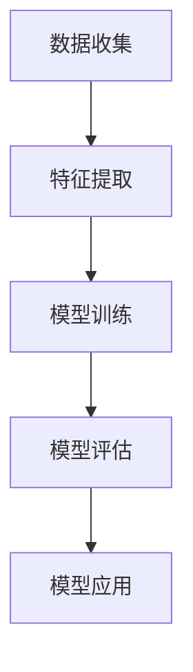
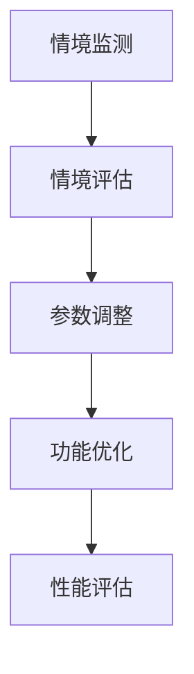

                 

基于上述的约束条件和文章结构，下面我将逐步展开《企业级情境智能：AI系统的场景适应能力》的技术博客文章。

### 引言与背景

**背景介绍**

1. **问题背景**

在当今数字化时代，企业对于人工智能（AI）的应用越来越广泛。然而，AI系统在企业级应用中面临的一个关键挑战是如何在不同场景下实现高效适应。企业级情境智能正是为了解决这一挑战而诞生的。

2. **问题描述**

企业级情境智能是指AI系统能够根据不同场景的特点，自适应地调整其行为和功能，以实现最优的性能和用户体验。这个问题涉及到多个方面，包括数据收集、模型训练、系统部署和适应性调整等。

3. **问题解决**

解决企业级情境智能问题需要从多个角度进行综合考虑。首先，需要建立一个能够有效收集和处理数据的系统；其次，需要开发和应用先进的机器学习算法；最后，还需要设计一个灵活的系统架构，以支持AI系统的适应性调整。

4. **边界与外延**

企业级情境智能的适用范围非常广泛，包括但不限于金融、医疗、制造、零售等行业。此外，情境智能不仅仅是AI系统的功能，还与企业的战略决策、运营优化和用户体验提升等方面密切相关。

5. **概念结构与核心要素组成**

企业级情境智能的核心要素包括：

   - 数据收集与处理：确保系统能够获取到高质量的情境数据，并进行有效的处理和存储。
   - 模型训练与优化：通过机器学习算法，训练出能够适应不同情境的模型。
   - 系统部署与集成：将AI系统与企业现有的业务流程和技术架构进行集成，确保其稳定运行。
   - 适应性调整与反馈：根据实际应用情况，对系统进行调整和优化，以实现最佳性能。

### 核心概念与联系

**核心概念**

1. **情境（Context）**

   情境是指AI系统所在的环境，包括时间、地点、用户行为、设备状态等多个维度。

2. **智能（Intelligence）**

   智能是指AI系统通过学习、推理和判断，能够理解、适应和响应情境的能力。

3. **情境智能（Contextual Intelligence）**

   情境智能是指AI系统能够根据不同情境，自适应地调整其行为和功能，以实现最优的性能和用户体验。

**联系**

情境智能是企业级AI系统的重要组成部分，它涉及到数据、算法、系统架构等多个方面。通过情境智能，AI系统能够更好地理解企业业务需求，提高系统的适应性和灵活性。

### 算法原理讲解

**情境感知算法**

1. **定义与作用**

   情境感知算法是指AI系统能够从情境中提取有用信息，并利用这些信息来调整系统行为。

2. **类型**

   - 基于规则的情境感知算法
   - 基于机器学习的情境感知算法
   - 基于深度学习的情境感知算法

3. **流程**

   - 数据收集：收集与情境相关的数据
   - 特征提取：从数据中提取与情境相关的特征
   - 模型训练：使用提取的特征训练情境感知模型
   - 模型评估：评估模型在情境感知任务上的性能
   - 模型应用：将训练好的模型应用于实际情境中

**情境适应算法**

1. **定义与目标**

   情境适应算法是指AI系统能够根据情境的变化，自适应地调整系统参数和功能，以适应新的情境。

2. **类型**

   - 自适应参数调整算法
   - 模型重训练算法
   - 多模型切换算法

3. **流程**

   - 情境监测：实时监测情境变化
   - 情境评估：评估情境变化对系统的影响
   - 参数调整：根据评估结果调整系统参数
   - 功能优化：根据情境特点优化系统功能
   - 性能评估：评估系统在新的情境下的性能

**算法原理的Mermaid流程图**

- **情境感知算法流程图**



- **情境适应算法流程图**



**Python源代码与算法实例**

以下是使用Python实现的简单情境感知算法实例：

```python
# 情境感知算法实例
def context_perception(data):
    # 特征提取
    features = extract_features(data)
    
    # 模型训练
    model = train_model(features)
    
    # 模型评估
    performance = evaluate_model(model)
    
    # 模型应用
    action = apply_model(model)
    
    return action

# 特征提取函数
def extract_features(data):
    # 实现特征提取逻辑
    pass

# 模型训练函数
def train_model(features):
    # 实现模型训练逻辑
    pass

# 模型评估函数
def evaluate_model(model):
    # 实现模型评估逻辑
    pass

# 模型应用函数
def apply_model(model):
    # 实现模型应用逻辑
    pass
```

通过以上步骤，我们初步介绍了企业级情境智能的概念、核心要素和算法原理，为后续内容的深入探讨奠定了基础。接下来，我们将继续分析数学模型和系统架构设计等内容。

