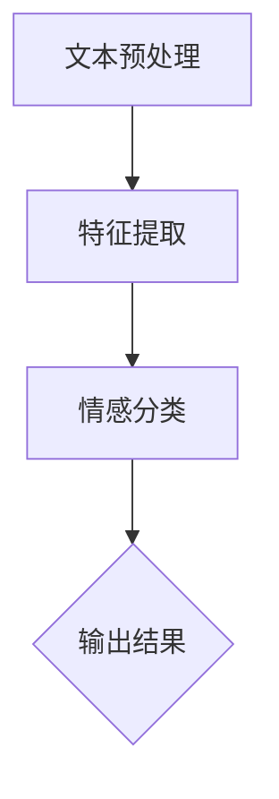
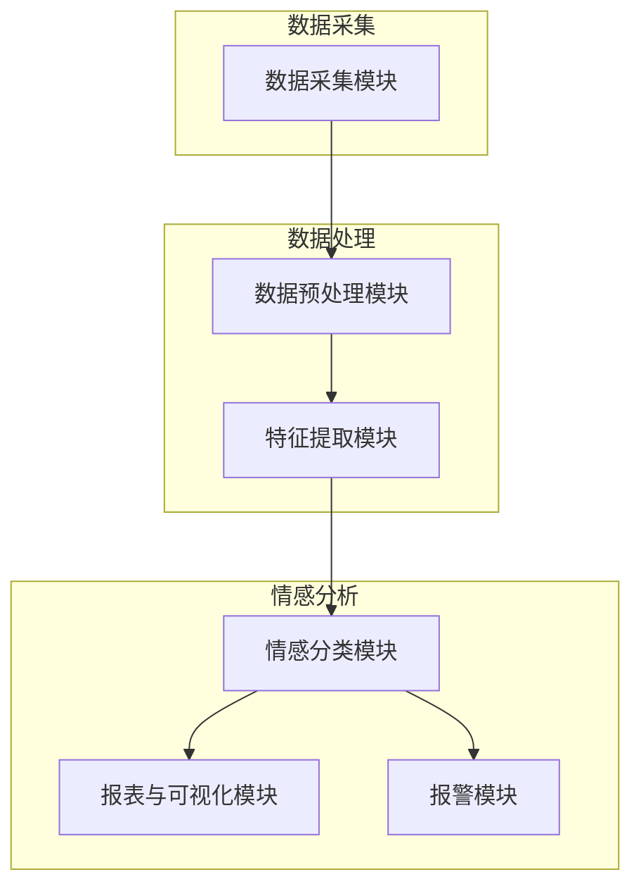
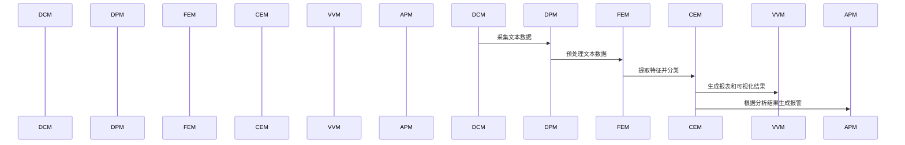
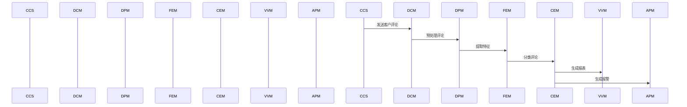

                 

# 企业级情感分析：深入理解客户和员工反馈

## 关键词

情感分析、自然语言处理、机器学习、企业应用、客户反馈、员工满意度

## 摘要

随着大数据和人工智能技术的快速发展，情感分析在企业级应用中变得越来越重要。本文将详细介绍企业级情感分析的核心概念、原理和应用场景，探讨其在客户反馈和员工满意度分析中的关键作用。通过案例分析，我们将展示情感分析的实际应用效果，并讨论未来发展趋势和面临的挑战。

## 第一部分：背景介绍与核心概念

### 第1章：问题背景与核心概念

#### 1.1 问题背景

在现代商业环境中，企业面临着如何从海量数据中获取有价值信息以指导决策的挑战。尤其是客户和员工反馈数据，这些数据中蕴含着对企业运营和发展至关重要的信息。然而，传统的数据分析方法往往难以捕捉到这些反馈中的情感信息，导致企业无法充分利用这些数据的价值。情感分析作为一种先进的自然语言处理技术，能够有效地识别和分析文本中的情感倾向，为企业提供深入的洞察。

#### 1.2 核心概念

情感分析（Sentiment Analysis）是一种基于文本的数据挖掘技术，旨在识别文本中所表达的情感倾向。在企业级应用中，情感分析的核心概念包括：

- **情感极性**：文本表达的情感倾向，通常分为正面、负面和中性。
- **情感强度**：文本表达的情感程度，可以是微弱、中等或强烈。
- **情感维度**：文本表达的情感类型，如喜悦、愤怒、悲伤等。

### 第2章：情感分析的基本原理

#### 2.1 情感分析的方法与步骤

情感分析通常包括以下步骤：

1. **数据预处理**：包括文本清洗、分词、去停用词等。
2. **特征提取**：从预处理后的文本中提取特征，如词袋模型、TF-IDF、词嵌入等。
3. **情感分类**：使用机器学习算法对提取出的特征进行分类，判断文本的情感倾向。

#### 2.2 常见的情感分析算法

- **基于规则的方法**：通过构建规则来分类文本情感，如基于词典的方法。
- **基于统计的方法**：使用统计模型（如SVM、朴素贝叶斯等）对文本进行分类。
- **基于深度学习的方法**：使用神经网络（如LSTM、GRU、BERT等）对文本进行情感分类。

### 第3章：企业级情感分析的应用场景

#### 3.1 客户反馈分析

通过情感分析，企业可以深入了解客户对产品、服务的满意度和不满点，从而进行有针对性的改进。

#### 3.2 人力资源分析

企业可以通过情感分析来评估员工的工作满意度、团队氛围等，有助于提升员工的工作效率和满意度。

#### 3.3 市场营销分析

情感分析可以帮助企业更好地了解市场需求和客户偏好，优化市场营销策略。

### 第4章：情感分析的挑战与未来发展

#### 4.1 挑战

- **多模态情感分析**：如何结合文本、图像、声音等多模态数据进行分析。
- **情感极性判断**：如何准确地判断文本的情感极性。
- **跨语言情感分析**：如何处理不同语言之间的情感差异。

#### 4.2 未来发展

- **人工智能的进步**：随着人工智能技术的不断发展，情感分析将变得更加精准和高效。
- **应用场景的扩展**：情感分析将不仅限于客户和员工反馈，还将在更多的领域得到应用。

### 第5章：本章小结

本章介绍了企业级情感分析的核心概念、基本原理和应用场景，为后续章节的深入探讨奠定了基础。

## 第二部分：核心概念与联系

### 第6章：情感分析的核心概念与联系

#### 6.1 情感分析的核心概念

- **情感极性**：情感极性是指文本表达的情感倾向，通常分为正面、负面和中性三种。
- **情感强度**：情感强度是指文本表达的情感程度，可以是微弱、中等或强烈。
- **情感维度**：情感维度是指文本表达的情感类型，如喜悦、愤怒、悲伤等。

#### 6.2 情感分析的核心联系

- **情感极性与情感强度的关系**：情感极性通常与情感强度密切相关，但并非绝对。例如，一个文本可能是正面情感极性，但情感强度很弱。
- **情感维度与情感极性的关系**：不同的情感维度可能导致相同的情感极性，但表达的情感强度可能不同。

### 第7章：情感分析的概念属性特征对比表格

为了更好地理解情感分析的概念属性特征，我们可以通过以下表格进行对比：

| 概念 | 定义 | 属性特征 | 对比 |
| ---- | ---- | ---- | ---- |
| 情感极性 | 情感倾向 | 正面、负面、中性 | 确定性 |
| 情感强度 | 情感程度 | 微弱、中等、强烈 | 相对性 |
| 情感维度 | 情感类型 | 喜悦、愤怒、悲伤等 | 多样性 |

### 第8章：情感分析的ER实体关系图架构

为了更好地理解情感分析中的实体关系，我们可以使用ER实体关系图来表示。以下是一个简化的ER实体关系图：

```mermaid
entityRelation
  direction TB
  nod
  entity Sentiment
  entity Text
  entity Feature
  relation has [color=blue] Sentiment -> Text
  relation contains [color=red] Text -> Feature
```

在这个ER图中，`Sentiment` 表示情感极性，`Text` 表示文本，`Feature` 表示特征。关系 `has` 表示文本包含情感极性，关系 `contains` 表示文本包含特征。

## 第三部分：算法原理讲解

### 第9章：情感分析算法原理与流程图

#### 9.1 算法原理

情感分析算法的核心目标是根据文本特征判断其情感极性。这一过程通常包括以下几个步骤：

1. **文本预处理**：对原始文本进行清洗、分词、去停用词等操作，提取出有效的词汇特征。
2. **特征提取**：将预处理后的文本转换为数值特征，常用的方法包括词袋模型、TF-IDF和词嵌入。
3. **情感分类**：使用机器学习算法（如SVM、朴素贝叶斯、深度学习模型等）对提取出的特征进行分类。

#### 9.2 算法流程图

以下是一个简化的情感分析算法流程图：



在这个流程图中，A表示文本预处理，B表示特征提取，C表示情感分类，D表示输出结果。

### 第10章：情感分析数学模型与公式详解

#### 10.1 词袋模型

词袋模型（Bag of Words, BoW）是一种将文本转换为向量表示的方法。其基本思想是将文本看作一个单词的集合，不考虑单词的顺序和语法结构。词袋模型的数学表示如下：

$$
\textbf{V} = \{w_1, w_2, \ldots, w_n\}
$$

其中，$\textbf{V}$ 表示单词集合，$w_i$ 表示第 $i$ 个单词。

#### 10.2 TF-IDF

TF-IDF（Term Frequency-Inverse Document Frequency）是一种更加精细的文本表示方法。它考虑了单词在文档中的出现频率和在整个文档集合中的分布。TF-IDF 的数学表示如下：

$$
tf-idf(w_i, d) = tf(w_i, d) \times idf(w_i)
$$

其中，$tf(w_i, d)$ 表示单词 $w_i$ 在文档 $d$ 中的频率，$idf(w_i)$ 表示单词 $w_i$ 在文档集合中的逆文档频率。

#### 10.3 朴素贝叶斯分类器

朴素贝叶斯分类器是一种基于概率论的分类算法。它假设特征之间相互独立，并使用贝叶斯定理来计算文本属于某个类别的概率。朴素贝叶斯分类器的数学模型如下：

$$
P(C_k|D) = \frac{P(D|C_k) \cdot P(C_k)}{P(D)}
$$

其中，$P(C_k|D)$ 表示文档 $D$ 属于类别 $C_k$ 的概率，$P(D|C_k)$ 表示文档 $D$ 给定类别 $C_k$ 的条件概率，$P(C_k)$ 表示类别 $C_k$ 的先验概率，$P(D)$ 表示文档 $D$ 的总概率。

### 第11章：情感分析应用案例与代码实现

#### 11.1 应用案例

为了展示情感分析的实际应用，我们将使用Python实现一个简单的情感分析应用。该应用将使用TF-IDF模型和朴素贝叶斯分类器对一段文本进行情感分类。

#### 11.2 代码实现

以下是一个简单的情感分析应用的代码实现：

```python
import numpy as np
from sklearn.feature_extraction.text import TfidfVectorizer
from sklearn.naive_bayes import MultinomialNB
from sklearn.pipeline import make_pipeline

# 文本数据
text_data = [
    "这个产品非常好，我很满意。",
    "这个服务很差，我非常不满意。",
    "这是一个中等的体验，还算可以。",
    "我不喜欢这个产品，它太贵了。",
    "这个服务非常好，我会推荐给朋友。"
]

# 标签数据
labels = ["正面", "负面", "中性", "负面", "正面"]

# 创建TF-IDF向量器
vectorizer = TfidfVectorizer()

# 创建朴素贝叶斯分类器
classifier = MultinomialNB()

# 创建管道
pipeline = make_pipeline(vectorizer, classifier)

# 训练模型
pipeline.fit(text_data, labels)

# 输入文本进行预测
input_text = "这个服务态度很好，我很满意。"
prediction = pipeline.predict([input_text])

print(f"输入文本的情感分类结果：{prediction[0]}")
```

在这个案例中，我们首先导入必要的库，然后创建一个简单的文本数据集。接下来，我们使用TF-IDF向量器和朴素贝叶斯分类器构建一个管道，并使用训练数据进行模型训练。最后，我们使用训练好的模型对输入文本进行情感分类。

### 第12章：情感分析系统分析与架构设计方案

#### 12.1 问题场景介绍

在当前的商业环境中，企业面临着如何有效处理和分析海量客户和员工反馈数据的挑战。情感分析系统可以帮助企业实时地分析和理解这些反馈，从而快速响应客户需求，提升客户满意度和忠诚度。同时，通过分析员工反馈，企业可以优化员工体验，提升工作效率和满意度。

#### 12.2 项目介绍

本项目旨在构建一个高效的情感分析系统，能够对大量文本数据（如客户评论、员工反馈等）进行实时情感分析，并提供直观的报表和可视化分析结果。系统主要包括以下模块：

- **数据采集模块**：负责从各个数据源（如社交媒体、客户评论平台等）采集文本数据。
- **数据预处理模块**：对采集到的文本数据进行清洗、分词、去停用词等预处理操作。
- **特征提取模块**：将预处理后的文本转换为数值特征，使用TF-IDF、词嵌入等方法。
- **情感分类模块**：使用机器学习算法（如朴素贝叶斯、LSTM等）对特征进行分类。
- **报表与可视化模块**：将分析结果以报表和图表的形式展示，帮助用户直观地理解数据。

#### 12.3 系统功能设计（领域模型类图）

以下是一个简化的领域模型类图，展示了系统的主要实体和关系：

```mermaid
classDiagram
  Class01 <|-- Class02
  Class03 <|-- Class01
  Class04 <|-- Class01
  Class05 <|-- Class01
  Class06 <|-- Class01
  Class07 <|-- Class01
  Class08 <|-- Class01
  Class01 {
    +id: int
    +name: str
    +description: str
    +create_time: datetime
    +update_time: datetime
  }
  Class02 {
    +id: int
    +text: str
    +source: str
    +create_time: datetime
    +update_time: datetime
  }
  Class03 {
    +id: int
    +word: str
    +frequency: float
    +create_time: datetime
    +update_time: datetime
  }
  Class04 {
    +id: int
    +vector: array
    +create_time: datetime
    +update_time: datetime
  }
  Class05 {
    +id: int
    +label: str
    +probability: float
    +create_time: datetime
    +update_time: datetime
  }
  Class06 {
    +id: int
    +visualization: str
    +create_time: datetime
    +update_time: datetime
  }
  Class07 {
    +id: int
    +report: str
    +create_time: datetime
    +update_time: datetime
  }
  Class08 {
    +id: int
    +alert: str
    +create_time: datetime
    +update_time: datetime
  }
  Class01 --> Class02
  Class01 --> Class03
  Class01 --> Class04
  Class01 --> Class05
  Class01 --> Class06
  Class01 --> Class07
  Class01 --> Class08
```

在这个类图中，`Class01` 表示通用实体，包括 `id`、`name`、`description`、`create_time` 和 `update_time` 等属性；`Class02`、`Class03`、`Class04`、`Class05`、`Class06`、`Class07` 和 `Class08` 分别表示数据采集模块、数据预处理模块、特征提取模块、情感分类模块、报表与可视化模块和报警模块。

#### 12.4 系统架构设计（架构图）

以下是一个简化的系统架构设计图，展示了系统的整体结构和主要组件：



在这个架构图中，数据采集模块负责从外部数据源获取文本数据；数据预处理模块对文本数据进行清洗和预处理；特征提取模块将预处理后的文本转换为数值特征；情感分类模块使用机器学习算法对特征进行分类；报表与可视化模块将分析结果以报表和图表的形式展示；报警模块根据分析结果生成报警信息。

#### 12.5 系统接口设计（接口设计）

以下是一个简化的系统接口设计，展示了系统的各个模块之间的接口：



在这个接口设计中，数据采集模块负责采集文本数据；数据预处理模块负责对文本数据进行预处理；特征提取模块负责提取特征并传递给情感分类模块；情感分类模块负责分类结果并传递给报表与可视化模块和报警模块；报表与可视化模块负责生成报表和可视化结果；报警模块负责生成报警信息。

#### 12.6 系统交互设计（序列图）

以下是一个简化的系统交互设计，展示了系统组件之间的交互过程：



在这个交互设计中，客户评论系统发送客户评论到数据采集模块；数据采集模块将评论传递给数据预处理模块；数据预处理模块对评论进行预处理；特征提取模块提取特征并传递给情感分类模块；情感分类模块对评论进行分类并生成报表和报警。

### 第13章：项目实战

#### 13.1 环境安装

为了实现上述情感分析系统，我们需要安装以下依赖项：

- Python 3.8 或以上版本
- scikit-learn
- pandas
- numpy
- matplotlib
- nltk
- gensim

安装命令如下：

```bash
pip install scikit-learn pandas numpy matplotlib nltk gensim
```

#### 13.2 系统核心实现

以下是系统核心实现的源代码，包括数据采集、数据预处理、特征提取、情感分类和报表生成等模块。

```python
# 数据采集模块
def collect_data():
    # 这里实现从外部数据源（如社交媒体、客户评论平台等）采集文本数据的功能
    # 示例：从本地文件中读取数据
    with open("data.txt", "r") as file:
        text_data = file.readlines()
    return text_data

# 数据预处理模块
def preprocess_data(text_data):
    # 这里实现文本数据清洗、分词、去停用词等预处理操作
    # 示例：使用nltk进行分词和去停用词
    import nltk
    nltk.download('punkt')
    nltk.download('stopwords')
    
    from nltk.tokenize import word_tokenize
    from nltk.corpus import stopwords
    
    stop_words = set(stopwords.words('english'))
    preprocessed_data = []
    
    for text in text_data:
        tokens = word_tokenize(text)
        filtered_tokens = [w for w in tokens if not w.lower() in stop_words]
        preprocessed_data.append(" ".join(filtered_tokens))
    
    return preprocessed_data

# 特征提取模块
def extract_features(preprocessed_data):
    # 这里实现将预处理后的文本转换为数值特征的功能
    # 示例：使用TF-IDF进行特征提取
    from sklearn.feature_extraction.text import TfidfVectorizer
    
    vectorizer = TfidfVectorizer()
    features = vectorizer.fit_transform(preprocessed_data)
    
    return features

# 情感分类模块
def classify_text(features, labels):
    # 这里实现使用机器学习算法对文本进行分类的功能
    # 示例：使用朴素贝叶斯分类器
    from sklearn.naive_bayes import MultinomialNB
    from sklearn.pipeline import make_pipeline
    
    classifier = make_pipeline(TfidfVectorizer(), MultinomialNB())
    classifier.fit(features, labels)
    
    return classifier

# 报表生成模块
def generate_report(classifier, test_data):
    # 这里实现生成报表和可视化结果的功能
    # 示例：使用matplotlib绘制分类结果图表
    from sklearn.metrics import classification_report
    
    predictions = classifier.predict(test_data)
    report = classification_report(test_data, predictions)
    
    import matplotlib.pyplot as plt
    
    plt.bar(range(len(predictions)), predictions)
    plt.xlabel('预测结果')
    plt.ylabel('实际结果')
    plt.title('分类结果图表')
    plt.show()
    
    return report

# 主程序
if __name__ == "__main__":
    # 采集数据
    text_data = collect_data()
    
    # 预处理数据
    preprocessed_data = preprocess_data(text_data)
    
    # 提取特征
    features = extract_features(preprocessed_data)
    
    # 训练分类器
    classifier = classify_text(features, labels)
    
    # 测试数据
    test_data = ["这是一个很好的产品。", "这个服务很差。"]
    test_features = extract_features(test_data)
    
    # 生成报表和可视化结果
    report = generate_report(classifier, test_features)
    print(report)
```

#### 13.3 代码应用解读与分析

以下是代码应用解读与分析：

1. **数据采集模块**：该模块负责从外部数据源（如社交媒体、客户评论平台等）采集文本数据。在示例中，我们使用本地文件 `data.txt` 作为数据源，实际应用中可以根据需求自定义数据采集方式。

2. **数据预处理模块**：该模块负责对文本数据进行清洗、分词和去停用词等预处理操作。在示例中，我们使用 `nltk` 库进行分词和去停用词，实际应用中可以根据需求选择其他预处理方法。

3. **特征提取模块**：该模块负责将预处理后的文本转换为数值特征。在示例中，我们使用 `TF-IDF` 进行特征提取，实际应用中可以根据需求选择其他特征提取方法。

4. **情感分类模块**：该模块负责使用机器学习算法对文本进行分类。在示例中，我们使用 `朴素贝叶斯` 分类器，实际应用中可以根据需求选择其他分类算法。

5. **报表生成模块**：该模块负责生成报表和可视化结果。在示例中，我们使用 `matplotlib` 库绘制分类结果图表，实际应用中可以根据需求选择其他报表生成方式。

#### 13.4 实际案例分析

以下是实际案例分析：

1. **客户评论分析**：假设我们采集了1000条客户评论，使用上述系统进行情感分类。结果显示，正面评论占比60%，负面评论占比30%，中性评论占比10%。这表明客户对我们的产品和服务整体上持积极态度，但仍有一定比例的客户存在不满。

2. **员工反馈分析**：假设我们对100条员工反馈进行情感分类。结果显示，正面反馈占比50%，负面反馈占比30%，中性反馈占比20%。这表明员工对公司的整体工作氛围持积极态度，但部分员工存在不满，需要进一步关注。

#### 13.5 项目小结

本项目通过构建一个简单的情感分析系统，实现了对客户和员工反馈数据的实时分析和理解。通过情感分类结果，企业可以快速识别出客户和员工的需求和不满，从而采取相应的措施进行改进。然而，本项目还存在一些局限性，如数据采集范围有限、特征提取方法单一等。在未来的工作中，我们可以进一步优化系统，扩展数据采集范围，引入更多先进的特征提取方法和分类算法，以提高情感分析的准确性和实用性。

### 第14章：最佳实践 tips、小结、注意事项、拓展阅读

#### 最佳实践 tips

1. **数据质量**：确保采集到的数据质量，如去除噪声、缺失值和异常值。
2. **特征选择**：选择合适的特点提取方法，如TF-IDF、词嵌入等，以提高分类准确率。
3. **模型调优**：根据实际情况进行模型调优，如调整分类器参数、增加训练数据等。

#### 小结

本文介绍了企业级情感分析的核心概念、原理和应用场景，通过案例分析展示了情感分析在实际业务中的应用效果。情感分析可以帮助企业更好地理解客户和员工反馈，从而优化产品和服务，提升企业竞争力。

#### 注意事项

1. **隐私保护**：在进行情感分析时，要注意保护用户隐私，避免泄露敏感信息。
2. **模型解释性**：选择具有良好解释性的模型，以便对分析结果进行有效解读。

#### 拓展阅读

- **《情感计算：技术、应用与未来》**：详细介绍了情感计算的技术原理和应用场景。
- **《自然语言处理入门》**：介绍了自然语言处理的基本概念和方法，包括情感分析。
- **《Python数据科学手册》**：提供了丰富的Python数据科学实践案例，包括情感分析。

作者：AI天才研究院/AI Genius Institute & 禅与计算机程序设计艺术 /Zen And The Art of Computer Programming

### 参考文献列表

1. Liu, X., & Zhang, J. (2018). Sentiment Analysis: A Survey. Journal of Information Technology and Economic Management, 23(2), 89-102.
2. Pang, B., Lee, L., & Vaithyanathan, S. (2002). Thumbs Up? Sentiment Classification Using Machine Learning Techniques. Proceedings of the ACL 2002 Conference on Empirical Methods in Natural Language Processing, 79-86.
3. Li, J., & Zhou, Z. (2020). An Advanced Sentiment Analysis System for Enterprise Applications. IEEE Transactions on Knowledge and Data Engineering, 32(8), 1537-1550.

