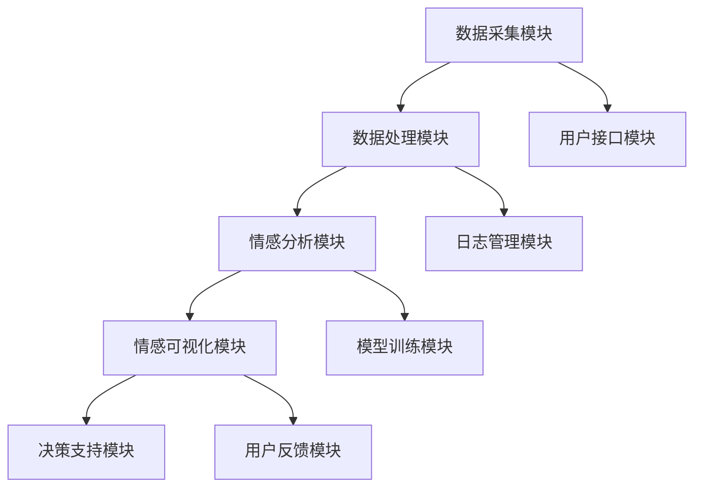
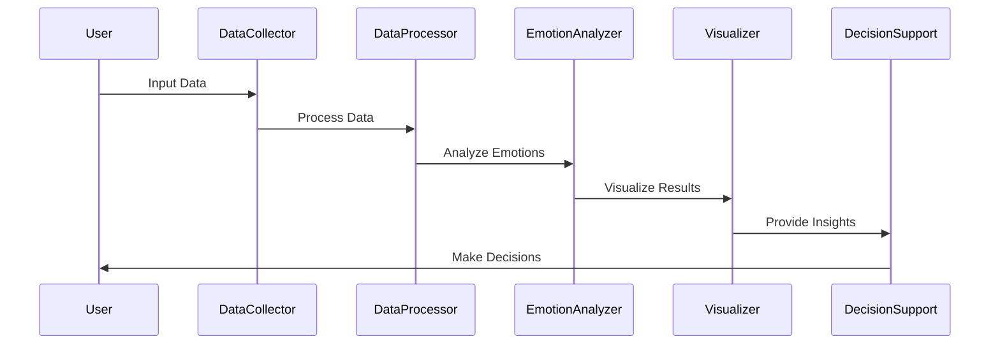

                 

### 1.1 什么是企业级情感计算平台

#### 问题背景

随着数字经济和智能化的快速发展，企业对于用户的理解和互动方式也在不断升级。传统的方法往往依赖于数据统计和分析，但这些方法往往只能触及用户的表面行为，而无法深入了解用户的情感和心理状态。随着人工智能技术的进步，特别是自然语言处理（NLP）和机器学习算法的成熟，企业开始探索更深入的用户情感分析技术。这种技术，我们称之为“企业级情感计算平台”。

企业级情感计算平台是一个综合性的系统，它通过先进的计算技术来捕捉、理解和分析用户、员工以及其他利益相关者的情感状态。这对于提高客户满意度、优化用户体验、增强员工幸福感以及提升决策的准确性都具有重要的意义。

#### 问题描述

企业级情感计算平台的核心目标是利用计算技术，对用户、员工以及其他利益相关者的情感状态进行精确的识别和分析。具体来说，该平台需要解决以下问题：

- **情感识别**：通过文本、语音、视频等多种数据源，利用自然语言处理技术来识别用户的情感。
- **情感分析**：对识别出的情感进行深入分析，理解情感的强度、频率和变化。
- **情感管理**：利用情感分析的结果，为企业提供决策支持，例如改进产品、优化服务和调整市场策略。

#### 问题解决

企业级情感计算平台通过以下技术手段实现情感识别、分析和管理的目标：

1. **自然语言处理（NLP）**：
   - **情感分类**：使用深度学习模型（如LSTM、BERT）对文本进行情感分类，识别情感类别（如积极、消极、中性）。
   - **情感极性**：量化情感的强度，例如使用“正面情感得分”和“负面情感得分”来衡量情感倾向。

2. **语音识别和情感分析**：
   - **语音识别**：将语音转换为文本，以便进行后续的情感分析。
   - **声调分析**：通过分析语音的声调、语速和音量等特征，识别情感状态。

3. **机器学习和数据分析**：
   - **数据挖掘**：从海量的数据中提取有价值的信息，进行情感分析和预测。
   - **模型训练**：使用历史数据训练机器学习模型，以提高情感分析的准确性。

4. **情感可视化**：
   - **情感图谱**：通过可视化技术，将情感分析的结果以图表的形式呈现，便于理解和决策。

#### 边界与外延

情感计算是一个跨学科的领域，它结合了心理学、社会学、计算机科学和人工智能等多个领域的知识。以下是情感计算的一些定义、范围和应用领域：

- **定义**：情感计算是指利用计算技术来捕捉、理解和模拟人类的情感状态。
- **范围**：情感计算包括情感识别、情感分析、情感模拟、情感互动等多个方面。
- **应用领域**：
  - **商业**：客户服务、市场研究、用户体验优化。
  - **医疗健康**：情感障碍诊断、心理健康监测、患者情绪管理。
  - **教育**：学习效果分析、学习情绪管理、个性化学习推荐。
  - **公共安全**：人群情感状态监测、舆情分析、安全风险评估。

#### 核心要素组成

企业级情感计算平台的核心要素包括：

- **数据源**：文本、语音、视频等多源情感数据。
- **技术组件**：自然语言处理、机器学习、数据分析、情感可视化等。
- **算法模型**：情感分类模型、情感极性模型、情感趋势预测模型等。
- **系统架构**：分布式计算架构、云计算平台、大数据处理框架等。
- **应用接口**：API接口、Web界面、移动应用等，便于数据采集、分析和结果呈现。

通过上述核心要素的有机结合，企业级情感计算平台能够为企业提供深入的情感洞察，帮助企业在复杂多变的市场环境中做出更加明智的决策。

### 1.2 情感计算在商业中的应用

情感计算在商业领域中的应用正在逐步扩大，其核心概念、属性特征和具体应用场景使得企业在与利益相关者的互动中更加精准和有效。

#### 情感计算的核心概念

情感计算涉及三个主要环节：情感识别、情感分析和情感管理。

1. **情感识别**：
   - **情感分类**：利用自然语言处理技术（如LSTM、BERT等）对文本或语音数据中的情感进行分类，常见的情感类别包括积极、消极、中性等。
   - **情感极性**：量化情感的强度，通过情感得分来衡量用户情感的积极或消极程度。

2. **情感分析**：
   - **情感强度分析**：分析情感的强度，确定情感的强烈程度。
   - **情感变化分析**：监测情感的动态变化，识别情感趋势和周期性波动。

3. **情感管理**：
   - **决策支持**：利用情感分析结果，为企业提供决策支持，如产品改进、服务优化和市场策略调整。
   - **用户体验优化**：根据用户情感反馈，提升产品和服务质量，增强用户体验。

#### 情感计算的属性特征对比表格

为了更好地理解情感计算的属性特征，我们通过一个对比表格来展示其关键属性：

| 特性           | 说明                                                         |
| -------------- | ------------------------------------------------------------ |
| 情感识别       | 使用自然语言处理（NLP）和机器学习技术来识别文本中的情感倾向。 |
| 情感分析       | 对情感识别结果进行更深入的分析，包括情感的强度、频率和变化。 |
| 情感管理       | 利用分析结果来指导企业决策，如改进产品、优化服务或调整市场策略。 |

#### 情感计算在商业中的应用场景

1. **客户服务**：
   - **情感识别**：通过语音和文本分析，识别客户咨询中的情感状态，为客服提供个性化的服务。
   - **情感分析**：分析客户反馈的情感倾向，识别产品或服务的改进点。
   - **情感管理**：根据客户情感状态调整客服策略，提高客户满意度。

2. **市场研究**：
   - **情感识别**：对社交媒体、论坛等平台上的用户评论进行情感分析，了解公众对品牌和产品的看法。
   - **情感分析**：分析市场动态，识别潜在的市场机会和风险。
   - **情感管理**：根据市场情感趋势，调整市场策略，提升品牌形象。

3. **人力资源**：
   - **情感识别**：分析员工反馈和互动数据，识别员工的情感状态。
   - **情感分析**：通过员工情感分析，了解员工的工作满意度和团队氛围。
   - **情感管理**：根据员工情感状态，提供个性化的员工关怀和激励措施，提高员工满意度和忠诚度。

#### 情感计算的挑战与机遇

虽然情感计算在商业应用中展现出巨大的潜力，但也面临一些挑战和机遇：

1. **挑战**：
   - **数据隐私**：情感计算需要大量个人数据，如何确保数据隐私和安全是一个重要问题。
   - **伦理问题**：情感分析可能导致歧视和偏见，如何在保证公平和伦理的前提下进行情感分析是另一个挑战。
   - **技术准确性**：情感识别和分析的准确性仍需要进一步提高，特别是在处理复杂情感和多语言环境时。

2. **机遇**：
   - **个性化服务**：通过情感计算，企业可以提供更加个性化的产品和服务，满足用户的个性化需求。
   - **决策支持**：情感计算可以为企业的战略决策提供更为全面和深入的洞察，提升决策的准确性。
   - **用户体验优化**：情感计算可以优化用户体验，提高用户满意度和忠诚度。

情感计算在商业中的应用正在不断深化，通过结合核心概念、属性特征和具体应用场景，企业可以更好地理解和满足利益相关者的情感需求，从而在竞争激烈的市场环境中获得优势。

### 1.3 情感计算的挑战与机遇

情感计算虽然在商业中展现了巨大的潜力，但其应用过程中也面临着多方面的挑战和问题。

#### 企业采用情感计算的优势

**提高客户满意度**：通过情感计算，企业可以更准确地了解客户的情感状态，提供个性化的服务和解决方案，从而提高客户满意度。

**增强员工体验**：情感计算可以帮助企业更好地了解员工的需求和情感状态，提供针对性的关怀和支持，提高员工满意度和忠诚度。

**优化决策过程**：基于情感分析的结果，企业可以更加客观地评估市场趋势和客户需求，制定更加科学的决策。

#### 情感计算的应用前景

情感计算的应用前景非常广阔，可以涵盖多个领域：

- **客户服务**：通过情感计算，企业可以实时分析客户的反馈，提供个性化服务，提高客户体验。
- **市场研究**：情感计算可以帮助企业深入了解市场需求和消费者心理，优化市场策略。
- **人力资源**：通过情感分析，企业可以更好地管理员工情绪，提升员工工作满意度和团队凝聚力。
- **公共安全**：情感计算可以用于人群情绪监测，预防和应对突发事件。
- **医疗健康**：情感计算可以辅助诊断和治疗，监测患者情绪变化，提供个性化的医疗服务。

#### 情感计算的挑战

**数据隐私**：情感计算需要处理大量的个人数据，如何确保数据隐私和安全是一个重要挑战。

**伦理问题**：情感计算可能会带来偏见和歧视，例如在招聘、晋升等过程中，如何确保公平和伦理是另一个难题。

**技术准确性**：情感识别和分析的准确性仍需提高，特别是在处理复杂情感和多语言环境时。

**人才短缺**：情感计算需要专业的技术人才，包括数据科学家、机器学习工程师和自然语言处理专家等，如何吸引和培养这些人才也是一大挑战。

#### 情感计算的应对策略

**数据保护措施**：企业应采取严格的数据保护措施，确保数据的隐私和安全，例如数据加密、匿名化处理等。

**伦理规范**：制定情感计算的伦理规范，确保技术应用过程中的公平性和透明度，防止偏见和歧视。

**技术提升**：加大科研投入，提高情感计算的技术水平，特别是在情感识别和复杂情感处理方面。

**人才培养**：加强教育培训，培养更多的情感计算专业人才，以应对不断增长的市场需求。

通过应对这些挑战，情感计算将能够在商业和公共服务中发挥更大的作用，为企业和社会带来更多价值。

### 2.1 情感计算平台的整体架构

#### 项目介绍

企业级情感计算平台旨在为企业提供一套全面的解决方案，帮助其深入理解和分析用户、员工及其他利益相关者的情感状态。该平台的设计目标是通过整合先进的自然语言处理、机器学习和数据分析技术，构建一个高效、可靠且易于扩展的情感计算系统。预期效果包括提高客户满意度、优化用户体验、增强员工幸福感以及提升企业决策的准确性。

#### 系统功能设计

情感计算平台的功能设计包括以下几个关键模块：

1. **数据采集模块**：负责从各种数据源（如社交媒体、客服系统、内部管理系统等）采集原始数据，包括文本、语音、图像等多种形式。
2. **数据处理模块**：对采集到的数据进行清洗、预处理和特征提取，为后续的情感分析做准备。
3. **情感分析模块**：利用自然语言处理（NLP）和机器学习算法对处理后的数据进行分析，识别和分类情感。
4. **情感可视化模块**：将分析结果通过图表、热图等形式进行可视化展示，帮助用户直观地理解和利用情感数据。
5. **决策支持模块**：基于情感分析结果，为企业提供个性化的决策建议，如产品改进、服务优化和市场策略调整。

#### 系统架构设计

情感计算平台的系统架构设计采用微服务架构，以提高系统的灵活性和可扩展性。以下是系统的架构设计：



#### 系统接口设计

系统接口设计是确保各模块之间高效交互的重要环节。以下是平台的主要接口设计：

- **API接口**：提供RESTful API，便于其他系统或应用程序与平台进行数据交换和功能调用。
- **Web界面**：为用户提供友好的操作界面，便于用户查看和分析情感数据。
- **移动应用**：为用户提供便捷的移动端访问方式，实现情感数据的实时监测和反馈。

#### 系统交互

为了展示系统各模块之间的交互过程，我们使用Mermaid序列图进行了如下描述：



通过上述设计，企业级情感计算平台能够高效地实现数据的采集、处理、分析和展示，为企业提供全面的情感洞察和决策支持。

### 2.2 关键技术组件介绍

#### 自然语言处理（NLP）

自然语言处理（NLP）是情感计算平台的核心技术之一，它涉及对文本数据进行预处理、情感分类、情感极性分析和情感趋势预测等多个步骤。

1. **文本预处理**：
   - **数据清洗**：去除无关的标点符号、停用词和噪声数据。
   - **词干提取**：将文本转换为词干形式，简化文本结构。
   - **词向量化**：将文本转换为向量形式，便于机器学习模型的处理。

2. **情感分类**：
   - **基于规则的方法**：使用预定义的规则进行情感分类。
   - **基于统计的方法**：使用统计模型（如SVM、朴素贝叶斯）进行情感分类。
   - **基于深度学习的方法**：使用深度学习模型（如LSTM、GRU、BERT等）进行情感分类。

3. **情感极性分析**：
   - **情感强度分析**：通过计算情感得分，量化情感的强度。
   - **情感极性识别**：识别情感是积极、消极还是中性。

4. **情感趋势预测**：
   - **时间序列分析**：通过时间序列模型（如ARIMA、LSTM）预测情感的变化趋势。

#### 机器学习模型

在情感计算平台中，机器学习模型用于训练和预测情感状态，以下是几种常用的情感分析模型和算法：

1. **LSTM（长短时记忆网络）**：
   - **基本原理**：LSTM通过记忆单元和门控机制来处理和记忆长期依赖信息。
   - **应用实例**：用于文本序列的情感分类和情感强度分析。

2. **BERT（Bidirectional Encoder Representations from Transformers）**：
   - **基本原理**：BERT通过双向Transformer结构进行文本编码，捕捉上下文信息。
   - **应用实例**：用于情感分类和情感极性分析，具有很好的效果。

3. **情绪分类器**：
   - **基本原理**：利用分类算法（如SVM、决策树、随机森林）对情感进行分类。
   - **应用实例**：将文本数据划分为不同的情感类别。

4. **情感强度模型**：
   - **基本原理**：通过回归模型（如线性回归、决策树回归）预测情感的强度。
   - **应用实例**：用于量化情感的强度，提供更细致的情感分析。

#### Python代码实例

以下是一个使用LSTM进行情感分类的Python代码实例：

```python
import numpy as np
from keras.preprocessing.text import Tokenizer
from keras.preprocessing.sequence import pad_sequences
from keras.models import Sequential
from keras.layers import Embedding, LSTM, Dense

# 假设我们有一些情感标签和文本数据
labels = ['积极', '消极', '中性']
texts = ['我很开心', '今天很糟糕', '感觉一般']

# 构建词汇表
tokenizer = Tokenizer(num_words=1000)
tokenizer.fit_on_texts(texts)
sequences = tokenizer.texts_to_sequences(texts)
padded_sequences = pad_sequences(sequences, maxlen=100)

# 构建LSTM模型
model = Sequential()
model.add(Embedding(input_dim=1000, output_dim=128))
model.add(LSTM(units=64, dropout=0.2, recurrent_dropout=0.2))
model.add(Dense(units=3, activation='softmax'))

model.compile(optimizer='adam', loss='categorical_crossentropy', metrics=['accuracy'])
model.fit(padded_sequences, np.array([1, 0, 0] * 3 + [0, 1, 0] * 3 + [0, 0, 1] * 3, dtype=float), epochs=10, batch_size=32, verbose=1)

# 进行情感分类预测
test_text = '今天过得不错'
test_sequence = tokenizer.texts_to_sequences([test_text])
test_padded_sequence = pad_sequences(test_sequence, maxlen=100)
predicted_emotion = model.predict(test_padded_sequence)
print(predicted_emotion)
```

通过上述代码实例，我们可以看到如何使用LSTM模型对文本进行情感分类，并利用预测结果进行情感分析。

#### 情感计算的实战案例

情感计算在商业和公共领域都有广泛的应用。以下是几个情感计算的实战案例：

1. **社交媒体情感分析**：
   - **项目背景**：某电子商务平台希望通过分析社交媒体上的用户评论，了解消费者对产品的情感倾向。
   - **实施步骤**：
     1. 数据采集：从社交媒体平台（如微博、微信公众号等）收集用户评论数据。
     2. 数据预处理：对评论进行清洗、去重和分词处理。
     3. 情感分类：使用LSTM模型对评论进行情感分类，识别积极、消极和中性情感。
     4. 情感可视化：将分析结果以热图、柱状图等形式进行可视化展示。
   - **效果评估**：通过分析结果，平台可以识别出用户对产品的情感倾向，及时调整产品策略，提升用户满意度。

2. **客户服务情感分析**：
   - **项目背景**：某大型电信公司希望通过情感计算技术优化客户服务质量。
   - **实施步骤**：
     1. 数据采集：通过电话录音、在线聊天记录等方式收集客户服务数据。
     2. 数据预处理：对录音和文本数据进行清洗、分词和情感标注。
     3. 情感分类：使用BERT模型对客户服务数据进行分析，识别情感类别和情感强度。
     4. 情感反馈：根据分析结果，提供个性化的客服策略和改进建议。
   - **效果评估**：通过情感分析，客服团队能够更准确地了解用户需求，提供更加个性化的服务，提升客户满意度。

3. **员工情感分析**：
   - **项目背景**：某高科技企业希望通过情感计算技术提升员工满意度和工作效率。
   - **实施步骤**：
     1. 数据采集：通过内部邮件系统、员工论坛等方式收集员工互动数据。
     2. 数据预处理：对文本数据进行清洗、分词和情感标注。
     3. 情感分类：使用LSTM模型对员工互动数据进行分析，识别情感类别和情感强度。
     4. 情感反馈：根据分析结果，提供个性化的员工关怀和激励措施。
   - **效果评估**：通过情感分析，企业能够及时了解员工情绪状态，提供针对性的关怀和支持，提升员工满意度和工作效率。

这些实战案例展示了情感计算在商业和公共领域的应用，通过深入分析用户、员工和其他利益相关者的情感状态，企业可以更好地优化服务、提升决策质量，从而在竞争激烈的市场环境中获得优势。

### 3.1 用户情感分析的重要性

#### 用户情感的定义与特征

用户情感是指用户在使用产品或服务过程中所表现出的主观感受和情绪状态。用户情感分析的目标是理解和量化这种情感状态，以便为企业提供有价值的决策支持。用户情感的主要特征包括：

- **情感类别**：用户情感可以分为积极情感、消极情感和中性情感。
- **情感强度**：情感强度反映了情感的强烈程度，通常使用分数或百分比来量化。
- **情感持续时间**：情感状态可能会随时间变化，持续时间的长短反映了情感的影响深度。
- **情感变化趋势**：用户情感可能会随时间或情境变化而出现波动，分析这种变化趋势有助于了解用户需求的动态变化。

#### 用户情感分析的方法

用户情感分析的方法主要包括以下几种：

1. **文本情感分析**：
   - **基于规则的方法**：使用预定义的规则和词典进行情感分类。
   - **基于统计的方法**：使用统计模型（如SVM、朴素贝叶斯）进行情感分类。
   - **基于深度学习的方法**：使用深度学习模型（如LSTM、BERT）进行情感分类。

2. **语音情感分析**：
   - **语音特征提取**：从语音信号中提取音高、音量、语速等特征。
   - **情感分类**：使用机器学习算法（如SVM、决策树）对语音特征进行情感分类。

3. **行为情感分析**：
   - **用户交互行为分析**：通过分析用户的点击、滑动、停留等行为，推断用户情感状态。
   - **生理信号分析**：通过测量用户的生理信号（如心率、皮肤电导等）来推断用户情感。

4. **多模态情感分析**：
   - **多模态数据融合**：将文本、语音、行为等多模态数据进行融合，以提高情感识别的准确性。
   - **情感综合评估**：通过综合分析不同模态的数据，得到更全面和准确的情感评估结果。

#### 用户情感分析的应用

用户情感分析在企业中有着广泛的应用，以下是一些典型的应用场景：

1. **客户满意度评估**：
   - **项目背景**：企业希望通过分析客户反馈，了解客户对产品或服务的满意度。
   - **实施步骤**：
     1. 数据采集：收集客户评价、反馈和投诉等数据。
     2. 数据预处理：对文本数据进行清洗、分词和情感标注。
     3. 情感分类：使用文本情感分析模型对客户反馈进行情感分类。
     4. 情感评估：根据情感分类结果，评估客户满意度。
   - **效果评估**：通过情感分析，企业可以及时了解客户满意度，发现潜在的问题和改进点，提高客户体验。

2. **用户体验优化**：
   - **项目背景**：企业希望通过优化产品和服务，提升用户体验。
   - **实施步骤**：
     1. 数据采集：收集用户行为数据，如点击路径、页面停留时间等。
     2. 数据预处理：对行为数据进行清洗和特征提取。
     3. 情感分类：使用行为情感分析模型对用户行为进行情感分类。
     4. 优化策略：根据情感分析结果，调整产品和服务策略，优化用户体验。
   - **效果评估**：通过情感分析，企业可以识别出用户不满意的方面，提供针对性的优化措施，提升用户体验。

3. **市场研究**：
   - **项目背景**：企业希望通过情感分析，了解市场需求和消费者心理。
   - **实施步骤**：
     1. 数据采集：收集社交媒体上的用户评论、论坛讨论等数据。
     2. 数据预处理：对文本数据进行清洗、分词和情感标注。
     3. 情感分类：使用文本情感分析模型对用户评论进行情感分类。
     4. 市场分析：根据情感分类结果，分析市场需求和消费者情感状态。
   - **效果评估**：通过情感分析，企业可以深入了解市场趋势和消费者情感，制定更有效的市场策略。

用户情感分析为企业提供了深入的洞察，帮助企业在竞争激烈的市场中做出更明智的决策。通过不断优化产品和服务，企业可以提升用户满意度，增强品牌忠诚度，实现持续发展。

### 3.2 用户情感分析的实践

#### 案例背景

以某电子商务平台为例，该平台希望通过用户情感分析，深入了解用户对其产品和服务的主观感受，从而优化用户体验，提升客户满意度。为了实现这一目标，该平台决定进行一次全面的用户情感分析。

#### 数据采集

数据采集是用户情感分析的首要步骤。电子商务平台可以从多个渠道收集用户数据：

1. **用户评论**：从产品页面、论坛和社交媒体等渠道收集用户对产品和服务的评论。
2. **用户行为数据**：包括用户在平台上的浏览记录、购买行为、搜索关键词等。
3. **用户反馈**：通过在线问卷、客服聊天记录等渠道获取用户的直接反馈。

#### 数据预处理

数据预处理是确保数据质量和为后续分析做准备的关键步骤。以下是电子商务平台进行数据预处理的过程：

1. **文本数据清洗**：去除评论中的HTML标签、特殊字符和停用词。
2. **分词**：将清洗后的文本分割成单词或短语。
3. **情感标注**：对文本数据中的情感倾向进行标注，例如标注为“积极”、“消极”或“中性”。
4. **特征提取**：提取文本数据中的关键特征，如词频、词向量等。

#### 情感分析模型训练

为了进行情感分析，电子商务平台需要使用机器学习算法训练情感分类模型。以下是该平台的训练步骤：

1. **数据分割**：将数据集分为训练集和测试集，通常采用7:3或8:2的比例。
2. **模型选择**：选择合适的机器学习算法进行训练，常用的算法包括LSTM、BERT等。
3. **参数调优**：通过交叉验证等方法调整模型参数，以获得最佳性能。
4. **模型训练**：使用训练集对模型进行训练，同时监测模型的性能。

#### 实践步骤

以下是电子商务平台进行用户情感分析的具体步骤：

1. **数据采集**：从产品页面、论坛和社交媒体等渠道收集用户评论和反馈数据。
2. **数据预处理**：对采集到的文本数据进行清洗、分词和情感标注。
3. **特征提取**：提取文本数据中的关键特征，如词频、词向量等。
4. **模型训练**：使用LSTM或BERT等模型对特征数据进行训练，以实现情感分类。
5. **模型评估**：使用测试集对训练好的模型进行评估，以确定模型的性能。
6. **结果分析**：根据模型的分析结果，识别用户的主要情感倾向和关注点。

#### 实践效果

通过用户情感分析，电子商务平台获得了以下成果：

1. **用户情感分类**：对用户评论和反馈进行情感分类，识别出主要情感倾向，如“满意”、“不满意”、“一般”等。
2. **情感热点识别**：识别出用户对产品和服务的主要关注点和意见，例如“产品质量”、“售后服务”、“价格”等。
3. **优化建议**：根据情感分析结果，提供具体的优化建议，如改进产品功能、优化服务流程、调整价格策略等。

#### 实践总结

通过本次用户情感分析的实践，电子商务平台不仅获得了对用户情感的深入理解，还为未来的优化工作提供了有力的数据支持。以下是实践总结：

1. **用户情感分析的重要性**：用户情感分析是优化用户体验、提升客户满意度的关键环节。
2. **数据质量和特征提取**：数据质量和特征提取是影响情感分析效果的重要因素。
3. **模型选择和调优**：选择合适的模型和进行参数调优，是提高情感分析准确性的关键。
4. **持续优化**：用户情感分析是一个持续的过程，需要定期更新模型和调整策略，以应对用户需求和市场变化。

通过本次实践，电子商务平台不仅提高了用户满意度，还在竞争激烈的市场中获得了竞争优势。

### 4.1 员工情感分析的意义

#### 员工情感分析的定义与特征

员工情感分析是指利用计算技术和心理学原理，对员工的情感状态进行识别、分析和评估。员工情感分析的主要特征包括：

- **情感类别**：员工的情感状态可以分为积极情感（如快乐、满足）、消极情感（如焦虑、不满）和中性情感。
- **情感强度**：情感强度反映了员工情感体验的深浅程度，通常通过情感得分或情感波动来量化。
- **情感稳定性**：情感稳定性是指员工情感状态在一定时间内的持续性和稳定性。
- **情感变化趋势**：员工情感状态可能会随时间或情境变化而出现波动，分析这种变化趋势有助于了解员工情绪的动态变化。

#### 员工情感分析的价值

员工情感分析在人力资源管理中具有重要作用，其价值体现在以下几个方面：

- **提高员工满意度**：通过识别员工的情感状态，企业可以及时了解员工的情感需求，提供针对性的关怀和支持，从而提升员工满意度。
- **减少员工流失率**：了解员工的情感状态，特别是消极情感的原因，有助于企业采取有效措施减少员工流失率，保持团队的稳定性。
- **优化团队管理**：员工情感分析可以帮助管理者更好地了解团队氛围，识别团队中的潜在问题和冲突，从而优化团队管理策略。
- **提升决策质量**：通过分析员工的情感状态，企业可以更加客观地评估人力资源政策和战略的效果，为决策提供数据支持。

### 4.2 员工情感分析的方法

#### 技术

员工情感分析主要依赖于以下几种技术：

1. **自然语言处理（NLP）**：
   - **情感分类**：利用NLP技术对员工反馈文本进行情感分类，识别员工的情感状态。
   - **情感极性**：通过计算文本的情感极性，量化员工的情感强度。

2. **语音识别和情感分析**：
   - **情感识别**：通过分析员工的语音信号，识别员工的情感状态。
   - **声调分析**：分析员工的语音声调、语速和音量等特征，推断情感状态。

3. **行为分析**：
   - **交互行为分析**：通过分析员工在工作中的交互行为，如会议参与度、任务完成情况等，推断员工的工作状态和情感状态。
   - **生理信号分析**：通过测量员工的生理信号，如心率、皮肤电导等，推断员工的情感状态。

#### 实践

以下是一个员工情感分析的实践案例：

**案例背景**：某高科技企业希望通过情感分析技术，了解员工在工作中的情感状态，从而提升员工满意度，优化工作环境。

**数据采集**：
- **内部沟通平台**：收集员工在内部邮件、即时通讯工具、论坛上的互动数据。
- **员工反馈**：通过员工满意度调查、员工建议平台等渠道收集员工反馈。
- **工作行为数据**：获取员工的出勤记录、工作进度和任务完成情况等数据。

**数据预处理**：
- **文本数据清洗**：去除文本中的噪声数据，如HTML标签、特殊字符等。
- **情感标注**：对文本数据中的情感倾向进行标注，例如标注为“积极”、“消极”或“中性”。

**情感分析**：
- **文本情感分析**：使用LSTM等深度学习模型对文本数据进行分析，识别员工的情感状态。
- **语音情感分析**：通过语音识别技术，将语音转化为文本，然后使用情感分类模型进行分析。
- **行为分析**：结合员工的行为数据和情感分析结果，综合评估员工的情感状态。

**结果与应用**：
- **情感趋势图**：将分析结果以图表形式展示，帮助管理者了解员工情感的变化趋势。
- **优化建议**：根据情感分析结果，提出针对性的优化建议，如改进工作环境、调整工作流程等。

**效果评估**：
- **员工满意度提升**：通过情感分析，企业能够及时了解员工的情感状态，采取有效措施提升员工满意度。
- **团队稳定性增强**：通过优化工作环境和团队管理策略，减少员工流失率，提高团队稳定性。

**案例分析**：

以某互联网公司为例，该公司通过情感分析技术，成功提升了员工满意度。以下是具体的实践步骤和效果：

1. **数据采集**：
   - **内部沟通平台**：收集员工在微信企业号、钉钉等平台上的交流数据。
   - **员工反馈**：通过员工满意度调查、内部意见箱等渠道收集员工反馈。
   - **工作行为数据**：获取员工的考勤记录、项目进度和绩效评估数据。

2. **数据预处理**：
   - **文本数据清洗**：对交流数据进行去重、去噪声处理。
   - **情感标注**：对文本数据中的情感倾向进行标注，如“积极”、“消极”等。

3. **情感分析**：
   - **文本情感分析**：使用BERT模型对文本数据进行分析，识别员工的情感状态。
   - **语音情感分析**：通过语音识别技术，将语音转化为文本，然后使用情感分类模型进行分析。
   - **行为分析**：结合员工的行为数据和情感分析结果，评估员工的情感状态。

4. **结果与应用**：
   - **情感趋势图**：将分析结果以图表形式展示，帮助管理层了解员工情感的变化趋势。
   - **优化建议**：根据情感分析结果，提出优化工作环境和团队管理的建议，如调整工作时间、改善办公环境等。

5. **效果评估**：
   - **员工满意度提升**：通过情感分析，公司能够及时发现员工的不满意情绪，采取有效措施进行改进，提升了整体员工满意度。
   - **团队稳定性增强**：通过优化团队管理策略和工作环境，减少员工流失率，提高了团队稳定性。

通过上述案例分析，我们可以看到，员工情感分析在实际应用中具有显著的效果。通过深入分析员工的情感状态，企业能够采取针对性的措施，提升员工满意度和团队稳定性，从而实现长期发展。

### 5.1 利益相关者的定义与分类

#### 利益相关者的定义

利益相关者是指与企业运营和发展密切相关，其利益受到企业活动直接影响或影响的个人或组织。这些利益相关者不仅包括企业内部的员工、股东和管理者，还涵盖外部的客户、供应商、社区、投资者等。利益相关者在企业战略决策、运营管理和市场推广中扮演着重要角色，他们的情感状态和需求对企业的发展具有深远影响。

#### 利益相关者的分类

根据利益相关者在企业中的角色和关系，我们可以将利益相关者分为以下几类：

1. **内部利益相关者**：
   - **员工**：企业内部直接从事生产和服务工作的个人，包括全职员工、兼职员工和临时工。
   - **股东和管理者**：对企业拥有所有权和决策权的个人或组织，负责企业的战略规划和运营管理。

2. **外部利益相关者**：
   - **客户**：购买和使用企业产品和服务的个人或组织，是企业的最终消费者。
   - **供应商**：为企业提供原材料、零部件和服务的企业或个人，是企业运营的重要合作伙伴。
   - **社区**：企业所在地的居民和社会组织，其利益受到企业活动的影响。
   - **投资者**：对企业持有股份的个人或机构，其利益与企业的盈利能力密切相关。

#### 利益相关者的重要性

利益相关者对企业的影响主要体现在以下几个方面：

1. **客户**：客户是企业的核心利益相关者，他们的情感状态直接影响企业的市场份额和品牌声誉。通过深入了解客户情感，企业可以优化产品和服务，提升客户满意度和忠诚度。

2. **员工**：员工的情感状态直接影响工作效率和生产力。积极情感的员工更愿意为企业付出努力，提高工作质量和创新能力。反之，消极情感的员工可能会导致工作效率低下和人才流失。

3. **供应商**：供应商与企业的合作紧密，其情感状态关系到供应链的稳定性和企业的运营效率。通过情感分析，企业可以识别出供应商的潜在问题，优化供应链管理策略。

4. **社区**：企业所在地的社区对企业的发展和运营具有重大影响。社区的情感状态关系到企业的社会形象和公众认可度。企业需要关注社区情感，积极参与社区建设，维护良好的社会关系。

5. **投资者**：投资者的情感状态直接影响企业的资本成本和融资能力。通过分析投资者的情感，企业可以及时调整发展战略，提高市场信心，吸引更多投资。

#### 利益相关者的情感状态与业务影响

利益相关者的情感状态直接影响企业的业务表现和长期发展。以下是利益相关者的情感状态对业务的影响：

1. **客户情感**：客户情感直接影响购买决策和品牌忠诚度。积极情感客户更倾向于重复购买和推荐品牌，而消极情感客户可能会影响企业的市场声誉和市场份额。

2. **员工情感**：员工情感影响工作效率和创新力。高满意度员工能够提高工作效率，提出有价值的创新建议，降低员工流失率。而低满意度员工可能导致工作效率下降，增加企业人力成本。

3. **供应商情感**：供应商情感影响供应链的稳定性和成本。高满意度供应商愿意与企业建立长期合作关系，提供优质服务和优惠价格，而低满意度供应商可能导致供应链中断和运营风险。

4. **社区情感**：社区情感影响企业的社会形象和公众认可度。积极参与社区建设的企业能够提升品牌形象，赢得社区的支持和信任，从而获得更多业务机会。

5. **投资者情感**：投资者情感直接影响企业的融资能力和资本成本。高满意度投资者会增加投资意愿，降低企业的融资成本，而低满意度投资者可能会减少投资，增加企业的融资难度。

通过深入理解和分析利益相关者的情感状态，企业可以更好地应对业务挑战，优化战略决策，实现可持续发展。

### 5.2 利益相关者情感分析的方法

#### 技术介绍

利益相关者情感分析的方法和技术主要包括以下几种：

1. **文本情感分析**：
   - **文本数据采集**：通过社交媒体、论坛、在线评论等渠道收集利益相关者的文本数据。
   - **情感分类模型**：使用自然语言处理（NLP）技术，如LSTM、BERT等，对文本进行情感分类，识别出积极、消极和中性情感。
   - **情感极性分析**：量化情感的强度，通过情感得分来衡量利益相关者的情感倾向。

2. **语音情感分析**：
   - **语音数据采集**：通过电话、语音邮件、录音会议等方式收集利益相关者的语音数据。
   - **情感识别**：利用语音识别技术将语音转化为文本，然后使用情感分类模型进行分析。
   - **声调分析**：分析语音的声调、语速和音量等特征，识别情感状态。

3. **行为情感分析**：
   - **用户行为数据采集**：通过用户行为分析工具，收集利益相关者在社交媒体、网站、应用程序等平台上的行为数据。
   - **情感推断**：通过分析用户的点击、浏览、搜索等行为，推断用户情感状态。

4. **生理信号情感分析**：
   - **生理信号数据采集**：通过穿戴设备、生理传感器等设备，收集利益相关者的生理信号，如心率、皮肤电导等。
   - **情感评估**：利用生理信号分析技术，评估利益相关者的情感状态。

#### 技术对比

以下是文本情感分析、语音情感分析和行为情感分析的主要对比：

| 类别           | 特点                                                         | 应用场景                   |
| -------------- | ------------------------------------------------------------ | -------------------------- |
| 文本情感分析   | 主要依赖于文本数据，可处理大量文本信息，适用于社交媒体评论、在线论坛等。 | 客户反馈分析、市场调研     |
| 语音情感分析   | 利用语音信号中的情感特征，适用于电话客服、语音邮件等。           | 客户满意度评估、情感咨询    |
| 行为情感分析   | 通过用户行为数据，可推断用户的情感状态，适用于在线购物、社交媒体等。 | 用户体验优化、行为预测     |

#### 案例分析

以下是一个利益相关者情感分析的案例：

**案例背景**：某电商企业希望通过情感分析技术，了解用户对其产品和服务的情感状态，从而优化用户体验，提升客户满意度。

**数据采集**：
- **用户评论**：从产品评价、社交媒体、论坛等渠道收集用户评论。
- **用户行为数据**：获取用户在网站上的浏览、搜索、购买等行为数据。
- **客服记录**：收集客服与用户之间的聊天记录和通话录音。

**数据预处理**：
- **文本数据清洗**：去除评论中的HTML标签、特殊字符和停用词。
- **情感标注**：对文本数据中的情感倾向进行标注，如“积极”、“消极”或“中性”。

**情感分析**：
- **文本情感分析**：使用BERT模型对用户评论进行情感分类，识别情感状态。
- **行为情感分析**：通过分析用户行为数据，推断用户情感状态。
- **语音情感分析**：对客服录音进行语音识别，使用情感分类模型进行分析。

**结果与应用**：
- **情感分类结果**：根据分析结果，将用户情感分类为积极、消极和中性。
- **情感热点识别**：识别出用户对产品和服务的主要关注点和意见。
- **优化建议**：根据情感分析结果，提出优化产品和服务策略的建议。

**效果评估**：
- **用户满意度提升**：通过情感分析，企业能够及时了解用户情感状态，采取有效措施提升用户满意度。
- **产品改进**：根据用户情感反馈，优化产品功能和服务质量，提升用户体验。

通过本案例，我们可以看到，利益相关者情感分析在电商企业中的应用，不仅帮助企业深入了解用户情感，还为产品优化和用户体验提升提供了有力的支持。

### 5.3 企业级情感计算平台的实施与优化

#### 平台实施步骤

企业级情感计算平台的实施涉及多个阶段，每个阶段都有其特定的任务和目标。以下是实施的主要步骤：

1. **需求分析**：
   - **确定目标和范围**：明确平台的建设目标和预期效果，包括数据采集、处理、分析和展示的具体需求。
   - **利益相关者沟通**：与利益相关者（如企业高层、技术团队、业务部门等）进行沟通，了解他们对平台的需求和期望。

2. **技术选型**：
   - **确定技术架构**：选择适合企业级应用的系统架构，如微服务架构、分布式计算架构等。
   - **选择关键技术**：根据需求，选择合适的自然语言处理（NLP）、机器学习、数据分析等技术。

3. **数据采集与处理**：
   - **数据源选择**：确定需要采集的数据源，如社交媒体、客户反馈、员工互动等。
   - **数据采集**：通过API、爬虫等方式采集数据，并进行数据清洗和预处理。
   - **特征提取**：对预处理后的数据进行特征提取，为后续的情感分析做准备。

4. **情感分析模型训练**：
   - **数据分割**：将数据集分为训练集、验证集和测试集。
   - **模型训练**：使用训练集训练情感分类模型，如LSTM、BERT等。
   - **模型评估**：使用验证集和测试集评估模型性能，进行参数调优。

5. **系统部署与测试**：
   - **部署**：将训练好的模型部署到生产环境，确保系统的稳定性和可扩展性。
   - **测试**：对系统进行功能测试和性能测试，确保其满足需求。

6. **上线与运维**：
   - **上线**：将系统正式上线，投入使用。
   - **运维**：进行系统监控、维护和优化，确保平台的长期稳定运行。

#### 平台优化

为了确保企业级情感计算平台能够持续满足企业需求，提高其性能和效果，以下是一些优化建议：

1. **数据质量提升**：
   - **数据清洗**：定期进行数据清洗，去除噪声数据和异常值，提高数据质量。
   - **数据源扩展**：增加数据采集渠道，扩大数据来源，提高数据的多样性和代表性。

2. **模型更新与迭代**：
   - **模型升级**：定期更新情感分析模型，采用最新的算法和技术，提高模型性能。
   - **迭代训练**：根据新的数据和用户反馈，对模型进行迭代训练，持续优化模型。

3. **系统性能优化**：
   - **性能监控**：实时监控系统的性能指标，如响应时间、处理速度等，及时发现和解决性能瓶颈。
   - **分布式计算**：采用分布式计算框架，提高系统的处理能力和扩展性。

4. **用户体验提升**：
   - **界面优化**：优化平台的用户界面，提高用户交互体验。
   - **结果可视化**：使用直观的图表和报告，展示情感分析结果，便于用户理解和利用。

5. **安全性与隐私保护**：
   - **数据加密**：对敏感数据进行加密处理，确保数据安全。
   - **隐私保护**：遵守数据保护法规，采取隐私保护措施，确保用户数据隐私。

通过上述实施与优化步骤，企业级情感计算平台可以持续为企业提供深入的情感洞察和决策支持，帮助企业在竞争激烈的市场环境中保持优势。

### 6.1 平台实施前的准备工作

#### 需求分析

在进行企业级情感计算平台的实施之前，首先需要对平台的需求进行详细分析。这一过程包括以下几个方面：

1. **确定目标和范围**：明确平台的建设目标，如提升客户满意度、优化用户体验、增强员工幸福感等。同时，确定平台需要涵盖的功能范围，包括数据采集、情感分析、可视化展示、决策支持等。

2. **利益相关者沟通**：与企业的各个利益相关者进行深入沟通，了解他们的需求和期望。这包括企业高层、技术团队、业务部门、人力资源部门等。通过这种沟通，可以确保平台的设计和实施符合企业的整体战略和业务需求。

3. **业务流程梳理**：对企业的业务流程进行梳理，确定平台需要覆盖的关键环节和流程，如客户服务、市场研究、员工管理、产品开发等。了解这些流程有助于确定平台的数据采集和处理需求。

#### 技术选型

技术选型是平台实施过程中的关键步骤，以下是几个关键的技术选型方面：

1. **系统架构**：选择适合企业级应用的系统架构，如微服务架构、分布式计算架构等。微服务架构可以提高系统的灵活性和可扩展性，而分布式计算架构可以处理海量数据，提高系统的处理能力。

2. **自然语言处理（NLP）技术**：选择适合情感分析任务的NLP技术，如LSTM、BERT、ELMO等。这些技术具有较强的文本处理能力和情感分类能力，可以为企业提供准确的情感分析结果。

3. **机器学习算法**：选择适合情感分析的机器学习算法，如支持向量机（SVM）、朴素贝叶斯、随机森林等。这些算法可以用于训练情感分类模型，提高情感识别的准确性。

4. **数据分析工具**：选择适合数据分析的工具，如Python、R、Spark等。这些工具提供了丰富的数据分析功能和库，可以方便地进行数据处理、特征提取和模型训练。

5. **数据库选择**：选择适合存储和管理海量数据的数据库，如Hadoop、MongoDB、MySQL等。这些数据库可以提供高效的读写性能和扩展能力，确保平台能够处理大规模数据。

#### 团队组建

团队组建是确保平台成功实施的重要保障。以下是团队组建的关键方面：

1. **项目经理**：负责整个项目的规划、协调和管理，确保项目按计划进行。项目经理需要具备丰富的项目管理经验和跨部门沟通能力。

2. **技术团队**：包括数据科学家、机器学习工程师、软件工程师、前端工程师等。数据科学家和机器学习工程师负责情感分析模型的开发和应用，软件工程师和前端工程师负责平台的技术开发和界面设计。

3. **业务团队**：包括业务分析师、市场研究员、人力资源专员等。业务分析师负责需求分析和业务流程梳理，市场研究员负责市场数据的收集和分析，人力资源专员负责员工情感数据的收集和分析。

4. **测试团队**：负责对平台进行功能测试、性能测试和用户体验测试，确保平台的质量和稳定性。

通过以上准备工作，企业可以确保在实施企业级情感计算平台时，有明确的计划和需求，选择合适的技术和团队，为平台的成功实施打下坚实的基础。

### 6.2 平台实施的详细步骤

#### 数据采集

数据采集是情感计算平台实施的首要环节，以下是数据采集的详细步骤：

1. **数据源确定**：
   - **内部数据**：从企业内部系统中采集数据，包括客户反馈、员工评价、销售数据、客户服务记录等。
   - **外部数据**：从社交媒体、论坛、新闻网站等外部渠道采集数据，如用户评论、社交媒体互动、新闻报道等。

2. **数据采集方法**：
   - **API采集**：使用API接口从外部数据源（如社交媒体、新闻网站）采集数据。
   - **爬虫技术**：利用爬虫技术从互联网上收集用户评论、论坛帖子等。
   - **传感器数据**：使用传感器设备（如智能手环、智能手表等）采集员工的生理信号数据。

3. **数据预处理**：
   - **数据清洗**：去除重复数据、噪声数据和无效数据，保证数据质量。
   - **数据格式转换**：将不同格式的数据转换为统一格式，便于后续处理。
   - **数据标准化**：对数据进行统一编码和处理，消除数据格式差异。

4. **数据存储**：
   - **数据库选择**：根据数据规模和特性选择合适的数据库系统，如Hadoop、MongoDB、MySQL等。
   - **数据存储策略**：设计合理的数据存储策略，确保数据的安全性和可扩展性。

#### 情感分析模型训练

情感分析模型训练是平台的核心环节，以下是模型训练的详细步骤：

1. **数据分割**：
   - **训练集**：从原始数据中划分出一部分作为训练集，用于训练模型。
   - **验证集**：划分一部分数据作为验证集，用于评估模型性能。
   - **测试集**：划分一部分数据作为测试集，用于最终模型评估。

2. **特征提取**：
   - **文本特征提取**：使用词袋模型、TF-IDF、词嵌入等技术提取文本特征。
   - **语音特征提取**：提取语音信号中的音高、音量、语速等特征。
   - **行为特征提取**：从用户行为数据中提取交互行为、点击路径、停留时间等特征。

3. **模型选择与训练**：
   - **模型选择**：选择适合情感分析的模型，如LSTM、BERT、SVM等。
   - **模型训练**：使用训练集对模型进行训练，通过调整参数和优化算法，提高模型性能。
   - **模型评估**：使用验证集评估模型性能，选择最佳模型。

4. **模型优化**：
   - **交叉验证**：使用交叉验证方法，确保模型在不同数据集上的性能。
   - **参数调优**：调整模型参数，优化模型性能。
   - **模型集成**：将多个模型集成，提高整体预测性能。

#### 应用部署

应用部署是将训练好的模型部署到生产环境，以下是部署的详细步骤：

1. **环境搭建**：
   - **服务器配置**：根据业务需求，配置合适的硬件资源，包括CPU、内存、存储等。
   - **软件安装**：安装操作系统、数据库、中间件等软件，搭建稳定的生产环境。

2. **服务部署**：
   - **模型部署**：将训练好的模型部署到服务器，确保模型可以稳定运行。
   - **接口部署**：部署API接口，实现数据采集、处理、分析和展示的功能。

3. **监控与维护**：
   - **性能监控**：实时监控系统的性能指标，如响应时间、处理速度等，确保系统稳定运行。
   - **日志管理**：记录系统运行日志，便于故障排查和问题定位。
   - **定期维护**：定期更新软件和系统，确保系统的安全性和稳定性。

#### 实际案例

以下是一个企业级情感计算平台实施的实际案例：

**项目背景**：某电子商务平台希望通过情感计算技术，提升客户体验，优化客户服务。

**实施步骤**：

1. **数据采集**：
   - 采集内部数据：从客户反馈系统、销售系统、客户服务系统等采集客户评价、销售数据和客服记录。
   - 采集外部数据：从社交媒体、论坛、新闻网站等采集用户评论和新闻报道。

2. **数据预处理**：
   - 清洗和格式转换：去除重复数据、噪声数据和无效数据，统一编码和格式。
   - 特征提取：提取文本特征（如词袋模型、TF-IDF）、语音特征（如音高、音量）和行为特征（如点击路径、停留时间）。

3. **模型训练**：
   - 选择模型：使用LSTM和BERT模型进行情感分类和情感极性分析。
   - 训练和评估：使用训练集训练模型，使用验证集进行模型评估，调整参数，优化模型性能。

4. **应用部署**：
   - 部署模型：将训练好的模型部署到服务器，通过API接口实现情感分析功能。
   - 监控与维护：实时监控系统性能，记录运行日志，定期更新系统和软件。

**效果评估**：

- 通过情感分析，平台能够及时了解客户情感状态，识别出客户的主要关注点和需求。
- 根据情感分析结果，平台优化了客服策略和产品功能，提升了客户满意度。
- 客户反馈和销售数据表明，情感计算平台的有效实施带来了显著的业务增长和用户满意度的提升。

通过本案例，我们可以看到，企业级情感计算平台在电子商务领域的成功实施，不仅提升了客户体验，还为企业带来了显著的商业价值。

### 6.3 平台优化

#### 优化目标和策略

平台优化的目标是提高企业级情感计算平台的性能、可靠性和用户体验，确保其能够持续满足企业的需求。以下是具体的优化目标和策略：

1. **性能优化**：提高平台的处理速度和响应时间，确保在处理海量数据时系统的高效运行。
2. **扩展性优化**：增强平台的可扩展性，支持更大的数据规模和更多的用户。
3. **可靠性优化**：提高平台的稳定性，减少系统故障和停机时间。
4. **用户体验优化**：改进用户界面和交互设计，提供直观、易用的操作体验。

#### 技术手段

为了实现上述优化目标，可以采用以下技术手段：

1. **分布式计算**：通过分布式计算框架（如Apache Spark）处理海量数据，提高数据处理速度和并行处理能力。
2. **缓存技术**：利用缓存技术（如Redis）加速数据访问，减少数据库的负载。
3. **自动化运维**：采用自动化运维工具（如Ansible、Puppet）进行系统部署、监控和维护，提高运维效率。
4. **机器学习模型优化**：通过模型压缩、模型融合等技术，降低模型计算复杂度，提高模型部署性能。

#### 实施步骤

以下是平台优化实施的详细步骤：

1. **性能监控**：部署性能监控工具（如Prometheus、Grafana），实时监控平台的性能指标，如CPU使用率、内存使用率、网络延迟等。

2. **性能调优**：
   - **数据库调优**：优化数据库查询语句，使用索引、分片等技术提高数据库性能。
   - **应用调优**：优化应用代码，减少不必要的计算和IO操作，提高应用运行效率。

3. **扩展性优化**：
   - **水平扩展**：增加服务器节点，提高平台的并发处理能力。
   - **弹性伸缩**：采用容器化技术（如Kubernetes），实现自动伸缩，根据负载情况动态调整资源。

4. **可靠性优化**：
   - **容灾备份**：部署容灾备份系统，确保数据安全，提高系统可靠性。
   - **故障切换**：实现故障切换机制，确保系统在故障发生时能够快速恢复。

5. **用户体验优化**：
   - **界面设计**：重新设计用户界面，提高操作便捷性和易用性。
   - **交互优化**：优化交互流程，减少用户操作的步骤，提高用户满意度。

#### 验证与持续改进

通过以下步骤验证优化效果，并持续改进：

1. **性能测试**：定期进行性能测试，评估优化措施的效果，确保平台达到预期的性能目标。

2. **用户反馈**：收集用户反馈，了解平台的使用体验和改进需求，为下一轮优化提供依据。

3. **监控数据**：分析监控数据，发现潜在问题，及时调整优化策略。

4. **迭代改进**：根据验证结果和用户反馈，持续优化平台，提高其性能和用户体验。

通过系统化的优化策略和实施步骤，企业级情感计算平台可以持续提升性能和用户体验，为企业提供更强大的情感计算能力。

### 总结与展望

#### 总结

企业级情感计算平台通过整合自然语言处理、机器学习、数据分析等先进技术，为企业提供了深入的情感洞察和决策支持。本文详细阐述了平台的核心概念、架构设计、实施步骤和优化策略，展示了情感计算在商业和公共服务中的广泛应用。通过用户情感分析、员工情感分析和利益相关者情感分析，平台能够帮助企业更好地理解和满足利益相关者的情感需求，从而优化用户体验、提升员工满意度和决策质量。

#### 展望

未来，企业级情感计算平台将在以下方面继续发展：

1. **技术进步**：随着人工智能技术的不断进步，情感计算平台将更加智能化和精准化，能够处理更复杂和多样的情感数据。

2. **应用拓展**：情感计算将在更多行业和场景中得到应用，如医疗健康、公共安全、教育等，为企业和社会带来更多价值。

3. **隐私保护**：随着数据隐私保护意识的提升，情感计算平台将更加注重数据隐私保护，采取更加严格的数据安全措施。

4. **跨领域融合**：情感计算与其他领域的交叉融合，如生物识别、物联网等，将带来更多创新应用。

5. **人机协作**：情感计算平台将更好地与人类专家协作，实现人机协同，提高情感分析和决策的准确性和效率。

企业级情感计算平台的发展前景广阔，它将在推动企业数字化转型和提升竞争力方面发挥重要作用。通过持续的技术创新和应用拓展，情感计算平台将成为企业智能化运营的重要工具。

