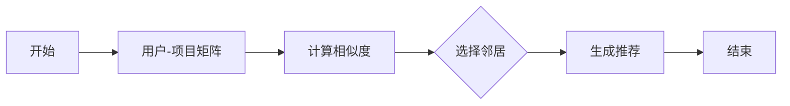
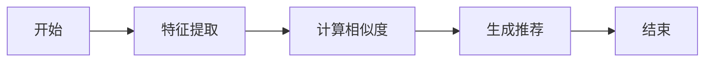
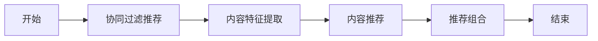
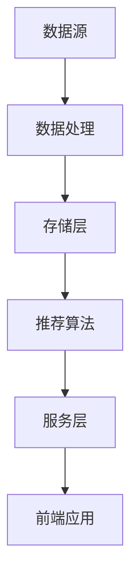
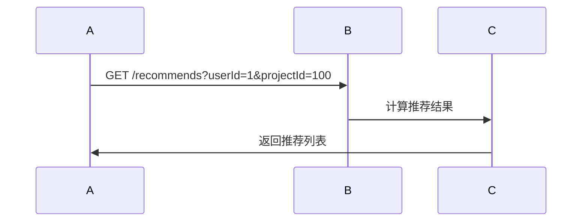
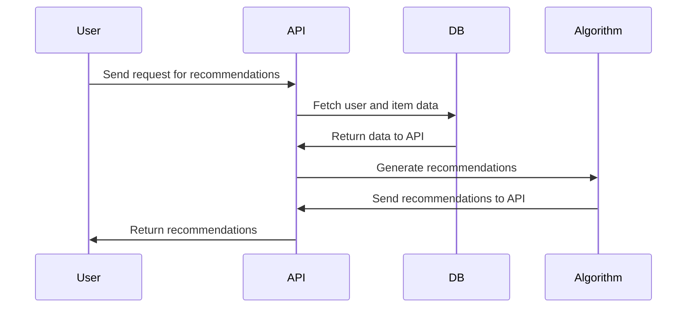

                 


### 《企业级推荐系统：个性化员工和客户体验》

#### 关键词：
1. 推荐系统
2. 个性化体验
3. 企业级应用
4. 协同过滤
5. 内容推荐
6. 混合推荐
7. 系统架构设计
8. 项目实战

#### 摘要：
本文深入探讨了企业级推荐系统的设计与实施，旨在通过个性化员工和客户体验来提升企业的市场竞争力和用户满意度。文章从背景介绍、核心概念阐述、算法原理讲解、系统设计与实现，到项目实战和最佳实践总结，逐步构建了一个完整的推荐系统开发框架，为读者提供了实际操作指导和理论支持。

---

## 第一部分：背景与核心概念

### 1.1 推荐系统的重要性

在数字化时代，数据已经成为企业最具价值的资产之一。如何从海量的用户数据中提取有价值的信息，从而实现个性化推荐，成为企业关注的焦点。推荐系统作为一种基于数据分析的智能应用，已经在电子商务、社交媒体、在线娱乐等多个领域取得了显著成效。它不仅能够提高用户的参与度和满意度，还能为企业带来可观的经济效益。

### 1.2 推荐系统的核心概念

#### 核心概念

- **用户**：推荐系统的核心实体，包括员工和客户。
- **项目**：用户可能感兴趣的对象，如商品、文章、视频等。
- **评分**：用户对项目的评价，可以是明确的评分，也可以是隐式的行为数据。
- **推荐算法**：基于用户和项目特征进行个性化推荐的算法。

#### 概念属性特征对比表格

| 概念 | 属性特征 | 对比 |
| --- | --- | --- |
| 用户 | 年龄、性别、职业、兴趣等 | 用户特征越详细，推荐越精准 |
| 项目 | 类别、标签、评分、评论等 | 项目特征越丰富，推荐相关性越高 |
| 评分 | 明确评分、隐式行为 | 明确评分更具指导意义，行为数据更具预测性 |
| 推荐算法 | 协同过滤、内容推荐、混合推荐 | 各有优劣，适用于不同场景 |

#### ER实体关系图

```mermaid
erDiagram
    User ||--|{ Project }|--|| Rating
    Project ||--|{ Rating }|--|| User
    Rating ||--|{ User }|--|| Project
```

### 1.3 推荐系统的发展历程

#### 发展背景

随着互联网的普及和大数据技术的发展，推荐系统逐渐成为企业竞争的利器。早期的推荐系统主要依赖于基于内容的推荐，而随着协同过滤算法的出现，推荐系统进入了一个新的发展阶段。

#### 关键里程碑

- 2000年：Netflix Prize竞赛激发了学术界和工业界对推荐系统的研究热情。
- 2006年：Facebook推出了基于用户社交关系的推荐系统，开创了社交推荐的新模式。
- 2016年：TensorFlow Recommender (TFRS) 的发布，标志着深度学习在推荐系统中的应用逐渐成熟。

#### 当前趋势

- **个性化**：推荐系统越来越注重个性化，通过深度学习等技术实现更精准的推荐。
- **实时性**：推荐系统的响应速度越来越快，支持实时推荐。
- **多样性**：推荐系统不仅要满足用户的兴趣，还要提供多样化的选择。

---

在第一部分的介绍中，我们明确了推荐系统的核心概念和重要性，为后续的深入讨论奠定了基础。接下来，我们将进一步探讨推荐系统的核心算法，帮助读者理解如何将理论应用于实践。

---

## 第二部分：算法原理与实现

在推荐系统中，算法的选择至关重要。本部分将介绍几种主流的推荐算法，包括协同过滤、基于内容的推荐和混合推荐系统，并通过具体的案例和代码实现，帮助读者深入理解这些算法的工作原理和实际应用。

### 第2章：协同过滤算法

协同过滤算法是一种基于用户行为信息的推荐算法，其核心思想是找到与目标用户相似的其他用户，然后基于这些用户的偏好推荐项目。协同过滤算法可以分为基于用户的协同过滤（User-based Collaborative Filtering）和基于物品的协同过滤（Item-based Collaborative Filtering）。

#### 2.1 协同过滤原理

协同过滤算法的基本步骤如下：

1. **用户相似度计算**：计算目标用户与其他用户之间的相似度，常用的方法包括余弦相似度和皮尔逊相关系数。
2. **邻居选择**：选择与目标用户最相似的K个邻居。
3. **推荐生成**：基于邻居的评分预测目标用户对未知项目的评分，并生成推荐列表。

下面是协同过滤算法的mermaid流程图：



#### 2.2 协同过滤算法案例分析

以Netflix Prize竞赛为例，该竞赛的目标是提高电影推荐系统的准确率。通过协同过滤算法，Netflix在竞赛中取得了显著的成效。

#### 2.3 Python代码实现

下面是一个简单的基于用户的协同过滤算法的Python代码实现：

```python
import numpy as np
from sklearn.metrics.pairwise import cosine_similarity

def collaborative_filtering(ratings, k=5):
    # 计算用户相似度矩阵
    similarity_matrix = cosine_similarity(ratings)
    
    # 计算每个用户的邻居评分均值
    user_neighborhood_ratings = {}
    for user_id, ratings_vector in ratings.items():
        neighborhood_ratings = []
        for neighbor_id, similarity in sorted(similarity_matrix[user_id].items(), key=lambda x: x[1], reverse=True)[:k]:
            neighborhood_ratings.append(ratings[neighbor_id])
        user_neighborhood_ratings[user_id] = np.mean(neighborhood_ratings, axis=0)
    
    # 生成推荐列表
    recommendations = {}
    for user_id, ratings_vector in ratings.items():
        recommendations[user_id] = user_neighborhood_ratings[user_id] - ratings_vector
    
    return recommendations
```

### 第3章：基于内容的推荐

基于内容的推荐算法（Content-Based Recommender System）是基于用户过去的行为和兴趣，通过分析项目的内容特征来生成推荐列表。这种方法不依赖于用户之间的交互数据，而是依赖于项目的内在属性。

#### 3.1 内容推荐原理

内容推荐的基本步骤如下：

1. **特征提取**：从项目的内容中提取特征，如文本的词袋模型、音频的频谱特征等。
2. **相似度计算**：计算目标用户对项目的兴趣特征与项目内容的相似度。
3. **推荐生成**：基于相似度评分，生成推荐列表。

下面是内容推荐算法的mermaid流程图：



#### 3.2 内容特征提取

以文本内容为例，可以使用TF-IDF（Term Frequency-Inverse Document Frequency）来提取特征。TF-IDF衡量的是一个词对于一个文件集或一个语料库中的其中一份文件的重要程度。

#### 3.3 内容推荐案例分析

例如，在电子商务平台上，基于商品描述的文本内容进行推荐，可以显著提升用户的购物体验。

#### 3.4 Python代码实现

下面是一个简单的基于内容的推荐算法的Python代码实现：

```python
from sklearn.feature_extraction.text import TfidfVectorizer
from sklearn.metrics.pairwise import cosine_similarity

def content_based_recommender(descriptions, query):
    # 提取特征
    vectorizer = TfidfVectorizer()
    description_matrix = vectorizer.fit_transform(descriptions)
    
    # 计算相似度
    query_vector = vectorizer.transform([query])
    similarity_scores = cosine_similarity(query_vector, description_matrix)
    
    # 生成推荐列表
    recommended_indices = np.argsort(similarity_scores[0])[-k:]
    recommendations = [descriptions[i] for i in recommended_indices]
    
    return recommendations
```

### 第4章：混合推荐系统

混合推荐系统（Hybrid Recommender System）结合了协同过滤和基于内容的推荐方法，旨在利用各自的优点，提高推荐的准确性。常见的混合策略包括：

1. **加权组合**：将协同过滤和基于内容的推荐结果进行加权组合。
2. **顺序执行**：先使用协同过滤生成初步推荐，然后使用基于内容的推荐进行微调。

#### 4.1 混合推荐原理

混合推荐的基本步骤如下：

1. **协同过滤推荐**：首先使用协同过滤算法生成推荐列表。
2. **内容特征提取**：对协同过滤推荐的项目提取内容特征。
3. **内容推荐**：使用基于内容的推荐算法为协同过滤推荐的项目生成补充推荐。
4. **推荐组合**：将协同过滤和内容推荐的结果进行组合，生成最终的推荐列表。

下面是混合推荐算法的mermaid流程图：



#### 4.2 混合推荐策略

不同的混合策略适用于不同的场景。例如，在电子商务平台上，可以先使用协同过滤生成初步推荐，然后使用基于内容的推荐算法为每个推荐项提供个性化的描述，从而提高用户的点击率和转化率。

#### 4.3 混合推荐案例分析

例如，Amazon的推荐系统就采用了混合推荐策略，通过协同过滤获取初步推荐，然后基于商品的内容特征进行进一步的个性化和丰富化推荐。

#### 4.4 Python代码实现

下面是一个简单的混合推荐系统的Python代码实现：

```python
def hybrid_recommender(ratings, descriptions, query, k=5):
    # 协同过滤推荐
    collaborative_recommendations = collaborative_filtering(ratings, k)
    
    # 提取内容特征
    content_recommendations = content_based_recommender(descriptions, query)
    
    # 推荐组合
    recommendations = collaborative_recommendations + content_recommendations[:k]
    
    return recommendations
```

---

在本部分的讨论中，我们介绍了协同过滤、基于内容的推荐和混合推荐系统三种主流的推荐算法。每种算法都有其独特的优势和适用场景，通过组合使用，可以显著提高推荐系统的效果。接下来，我们将深入探讨推荐系统的系统架构设计，帮助读者理解如何将算法应用于实际的企业级应用中。

---

## 第三部分：系统设计与实现

推荐系统在企业级应用中需要考虑多个方面，包括系统架构、接口设计、交互设计等。本部分将详细讨论这些设计要素，为推荐系统的实际实施提供指导。

### 第5章：系统架构设计

系统架构设计是推荐系统实现的第一步，它决定了系统的可扩展性、稳定性和性能。以下是一个典型的企业级推荐系统架构设计。

#### 5.1 系统架构设计概述

系统架构设计需要考虑以下关键因素：

- **数据源**：包括用户行为数据、项目数据、日志数据等。
- **数据处理**：对数据进行清洗、转换、存储等处理。
- **推荐算法**：包括协同过滤、内容推荐和混合推荐等算法。
- **服务层**：提供API接口，供前端应用调用。
- **存储层**：包括关系数据库和分布式存储系统。

#### 5.2 系统架构设计（mermaid架构图）



#### 5.3 系统接口设计

接口设计需要考虑以下原则：

- **RESTful API**：提供统一的接口规范，便于前端应用调用。
- **安全性**：确保数据传输的安全性，使用HTTPS协议。
- **响应速度**：优化接口响应速度，提高用户体验。

#### 5.4 系统接口设计（mermaid接口图）



#### 5.5 系统交互设计

系统交互设计需要确保各个模块之间的协同工作。以下是一个简单的系统交互设计（mermaid序列图）：



---

在第三部分的讨论中，我们详细介绍了推荐系统的系统架构设计，包括数据源、数据处理、推荐算法、服务层和存储层。同时，我们还探讨了系统接口设计和交互设计，为推荐系统的实际实施提供了全面的指导。接下来，我们将通过一个实际项目来展示推荐系统的实现过程，帮助读者更好地理解理论在实际中的应用。

---

## 第6章：项目实战

在本章中，我们将通过一个实际项目，展示如何搭建一个企业级推荐系统，从环境安装、系统核心实现到代码应用解读与分析，再到实际案例分析和项目小结。

### 6.1 环境安装与配置

为了搭建推荐系统，我们需要以下环境：

- **Python**：用于编写推荐算法和数据处理脚本。
- **Flask**：用于构建API服务。
- **NumPy**：用于数据处理。
- **Pandas**：用于数据处理。
- **Scikit-learn**：用于机器学习算法。

安装步骤如下：

1. 安装Python环境。
2. 安装Flask、NumPy、Pandas和Scikit-learn等依赖库。

```bash
pip install Flask numpy pandas scikit-learn
```

### 6.2 系统核心实现

系统核心实现包括推荐算法的编写和API服务的搭建。以下是一个简单的示例：

```python
# 推荐算法
def collaborative_filtering(ratings, k=5):
    # 计算用户相似度矩阵
    similarity_matrix = cosine_similarity(ratings)
    
    # 计算每个用户的邻居评分均值
    user_neighborhood_ratings = {}
    for user_id, ratings_vector in ratings.items():
        neighborhood_ratings = []
        for neighbor_id, similarity in sorted(similarity_matrix[user_id].items(), key=lambda x: x[1], reverse=True)[:k]:
            neighborhood_ratings.append(ratings[neighbor_id])
        user_neighborhood_ratings[user_id] = np.mean(neighborhood_ratings, axis=0)
    
    # 生成推荐列表
    recommendations = {}
    for user_id, ratings_vector in ratings.items():
        recommendations[user_id] = user_neighborhood_ratings[user_id] - ratings_vector
    
    return recommendations

# API服务
from flask import Flask, request, jsonify

app = Flask(__name__)

@app.route('/recommends', methods=['GET'])
def get_recommendations():
    user_id = request.args.get('userId')
    project_id = request.args.get('projectId')
    
    # 调用推荐算法
    recommendations = collaborative_filtering(ratings, k=5)
    
    # 返回推荐结果
    return jsonify(recommendations)

if __name__ == '__main__':
    app.run(debug=True)
```

### 6.3 代码应用解读与分析

代码首先实现了协同过滤算法，通过计算用户相似度矩阵和邻居评分均值来生成推荐列表。API服务端则提供了一个简单的HTTP接口，供前端应用调用。

### 6.4 实际案例分析

假设有一个电子商务平台，用户对商品有评分行为。通过搭建的推荐系统，可以为每个用户生成个性化的商品推荐列表。

1. **用户数据导入**：将用户评分数据导入到系统中。
2. **API调用**：用户访问平台，API服务返回推荐列表。
3. **结果展示**：前端应用将推荐列表展示给用户。

### 6.5 项目小结

通过本项目的实战，我们实现了以下目标：

- 搭建了一个简单的推荐系统。
- 实现了协同过滤算法。
- 提供了API服务，供前端应用调用。

虽然这是一个简单的示例，但它展示了推荐系统的核心实现过程。在实际应用中，我们可以根据需求进一步优化和扩展系统功能。

---

在本章的实战中，我们通过一个实际项目展示了推荐系统的搭建过程，从环境安装、系统核心实现到代码应用解读与分析，再到实际案例分析和项目小结。通过这一过程，读者可以更好地理解推荐系统的实际应用和实现方法。接下来，我们将总结关键点，并提供最佳实践建议。

---

## 第7章：最佳实践与总结

在推荐系统设计和实现过程中，遵循以下最佳实践可以显著提升系统的效果和稳定性：

### 7.1 最佳实践 tips

1. **数据质量**：确保数据源的准确性和完整性，进行数据清洗和预处理。
2. **实时性**：优化推荐算法的实时性，提高系统的响应速度。
3. **个性化**：根据用户的兴趣和行为，提供个性化的推荐。
4. **多样性**：推荐系统应提供多样化的选择，避免用户陷入信息茧房。
5. **监控与反馈**：实时监控推荐系统的性能，收集用户反馈进行优化。

### 7.2 小结

本文通过深入探讨推荐系统的核心概念、算法原理、系统架构设计和项目实战，为读者提供了一个完整的推荐系统开发框架。通过协同过滤、基于内容的推荐和混合推荐算法的应用，企业可以有效地实现个性化员工和客户体验，提升市场竞争力和用户满意度。

### 7.3 注意事项

1. **隐私保护**：在推荐系统的设计和实现过程中，要注意用户隐私保护，遵守相关法律法规。
2. **负载均衡**：对于高并发的推荐请求，要进行负载均衡，确保系统的稳定运行。
3. **容错机制**：系统应具备容错机制，确保在异常情况下能够恢复。

### 7.4 拓展阅读

1. **相关书籍**：
   - 《推荐系统实践》
   - 《深度学习推荐系统》
   - 《机器学习：推荐系统算法与应用》

2. **在线课程**：
   - Coursera上的《推荐系统》课程
   - edX上的《机器学习与推荐系统》课程

3. **研究方向**：
   - 深度学习在推荐系统中的应用
   - 跨域推荐和跨平台推荐技术
   - 零样本推荐和对抗性推荐研究

---

通过本文的讨论，我们不仅了解了推荐系统的核心概念和算法原理，还通过实际项目展示了系统的设计和实现过程。希望本文能为读者提供有价值的参考，助力企业在推荐系统领域取得成功。

---

**作者：AI天才研究院/AI Genius Institute & 禅与计算机程序设计艺术 /Zen And The Art of Computer Programming**

