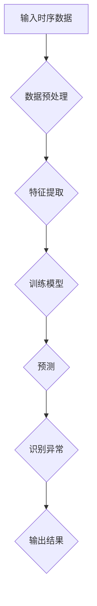
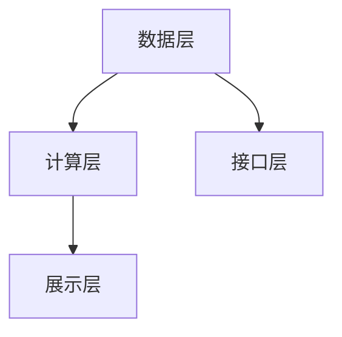
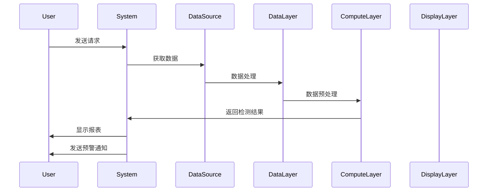

                 


## 文章标题：企业级时序异常检测：提前预警业务风险

关键词：时序异常检测、企业级、业务风险、预警、数据分析、算法、系统架构

摘要：本文将深入探讨企业级时序异常检测的重要性及其应用。通过详细解析核心概念、算法原理、数学模型，以及系统分析与架构设计，我们将展示如何构建一个高效的企业级时序异常检测系统，为企业提前预警业务风险提供有力支持。

### 目录大纲设计流程

#### 1. 分析书籍主题和内容

首先，我们需要对《企业级时序异常检测：提前预警业务风险》这本书的主题和内容有深入的理解。书名明确指出了我们的核心主题——企业级时序异常检测，以及其目的——提前预警业务风险。这为我们提供了明确的写作方向。

**背景介绍**：
- 时序异常检测的定义及重要性
- 企业级时序异常检测的特殊性
- 业务风险预警的概念及必要性

#### 2. 确定目录大纲的结构

根据书籍的主题和内容，我们可以将目录大纲分为以下主要部分：

1. **背景介绍**：
   - 时序异常检测的基本概念
   - 企业级时序异常检测的应用场景

2. **核心概念与联系**：
   - 时序数据的概念和特征
   - 异常检测的基本原理
   - 时序异常检测的技术和方法

3. **算法原理讲解**：
   - 主要算法的mermaid流程图
   - 算法的python源代码实现
   - 算法的数学模型和公式

4. **数学模型和公式讲解**：
   - 关键数学模型和公式的latex格式展示
   - 详细讲解和举例说明

5. **系统分析与架构设计**：
   - 时序异常检测系统的场景和需求
   - 系统功能设计
   - 系统架构设计
   - 系统接口设计和系统交互

6. **项目实战**：
   - 环境安装
   - 系统核心实现源代码
   - 代码应用解读与分析
   - 实际案例分析和详细讲解剖析
   - 项目小结

7. **最佳实践和总结**：
   - 最佳实践建议
   - 小结
   - 注意事项
   - 拓展阅读

#### 3. 细化各个章节的内容

在每个章节中，我们需要细化各个子章节的内容，确保每个核心概念、算法原理、数学模型和系统架构设计都得到详细阐述。

- **背景介绍**：明确核心概念术语，详细描述问题背景和问题描述，探讨问题解决方案，以及边界和外延。
- **核心概念与联系**：详细解释核心概念，使用表格和mermaid ER实体关系图展示概念之间的联系。
- **算法原理讲解**：使用mermaid流程图展示算法流程，用python源代码实现算法，详细讲解数学模型和公式，并通过举例说明使内容通俗易懂。
- **数学模型和公式讲解**：使用latex格式展示数学模型和公式，进行详细讲解，并通过具体例子说明。
- **系统分析与架构设计**：详细介绍系统分析和架构设计的过程，使用mermaid类图、架构图、序列图等工具展示系统结构和交互。
- **项目实战**：详细描述项目环境安装、核心实现源代码，代码解读与分析，实际案例分析，以及项目小结。

#### 4. 确保内容的完整性

在编写每个章节时，我们需要确保内容完整性。例如，算法原理讲解章节必须包含mermaid流程图、python源代码、数学模型和公式、详细讲解和举例说明。

#### 5. 保持简洁性

为了确保文章的可读性，我们需要保持内容的简洁性，避免冗余，让读者能够快速理解每个章节的核心内容。

#### 6. 遵循markdown格式

在编写文章时，我们需要遵循markdown格式，使用适当的标题、列表、引用等格式，使文章结构清晰、易于阅读。

### 实际操作步骤

1. **编写背景介绍**：
   - 简要介绍时序异常检测的背景，包括其重要性、应用场景以及企业级时序异常检测的特殊性。

2. **定义核心概念与联系**：
   - 详细定义时序数据、异常检测、时序异常检测等核心概念，使用表格和mermaid ER实体关系图展示概念之间的联系。

3. **讲解算法原理**：
   - 使用mermaid流程图展示时序异常检测的主要算法，使用python源代码、数学模型和公式详细阐述算法原理，并进行举例说明。

4. **数学模型和公式讲解**：
   - 使用latex格式展示关键数学模型和公式，进行详细讲解，并通过具体例子说明。

5. **系统分析与架构设计**：
   - 介绍时序异常检测系统的场景、项目介绍、功能设计、架构设计、接口设计和系统交互。

6. **项目实战**：
   - 详细描述环境安装、系统核心实现源代码，代码解读与分析，实际案例分析，以及项目小结。

7. **最佳实践和总结**：
   - 提供时序异常检测的最佳实践建议，对整个书籍的内容进行总结，并指出可能的注意事项和拓展阅读。

通过以上步骤，我们将设计出一份详细、完整且符合要求的目录大纲。接下来，我们将开始具体编写每个章节的内容。

---

接下来，我们将逐步展开对文章各个章节的详细撰写。首先是**背景介绍**部分，我们将详细阐述时序异常检测的定义、重要性以及企业级时序异常检测的特殊性，为后续章节的深入讨论奠定基础。

---

## 背景介绍

### 时序异常检测的定义及重要性

时序异常检测是指通过对时间序列数据进行监控和分析，识别出其中的异常值或异常模式。这些数据通常来源于企业的业务系统，如交易记录、用户行为、传感器数据等。时序异常检测在金融、电信、电商、制造等行业中具有广泛的应用。

时序异常检测的重要性主要体现在以下几个方面：

1. **风险预警**：通过提前发现异常，企业可以及时采取措施，避免潜在的业务风险。例如，在金融行业中，时序异常检测可以帮助银行识别欺诈交易，防范金融风险。

2. **运营优化**：时序异常检测可以帮助企业优化业务流程，提高运营效率。例如，在电商行业，通过对用户行为数据的时序分析，可以发现异常购买行为，从而优化库存管理和供应链流程。

3. **用户体验提升**：时序异常检测可以识别出系统故障或异常，提高系统的稳定性和可靠性，从而提升用户体验。例如，在电信行业，通过时序异常检测可以及时发现网络故障，减少用户投诉。

### 企业级时序异常检测的特殊性

企业级时序异常检测具有以下几个特殊性：

1. **大规模数据处理**：企业级应用通常需要处理大规模的时序数据，这要求异常检测算法具备高效的处理能力。

2. **实时性要求**：企业级时序异常检测通常需要在短时间内完成数据处理和异常检测，以满足实时性要求。

3. **多样性和复杂性**：企业级时序异常检测面临的业务场景多样，数据类型复杂，需要综合考虑多种因素进行异常检测。

4. **业务关联性**：企业级时序异常检测需要与业务系统紧密集成，通过分析业务数据，提供有针对性的异常检测结果。

### 业务风险预警的概念及必要性

业务风险预警是指通过提前发现潜在的业务风险，采取相应的预防措施，以降低风险对企业造成的影响。业务风险预警的必要性体现在以下几个方面：

1. **降低损失**：通过提前预警，企业可以采取预防措施，避免潜在损失的发生。

2. **提高竞争力**：及时应对业务风险，可以提高企业的竞争力，保持市场地位。

3. **合规要求**：许多行业对业务风险预警有明确的要求，合规要求成为企业必须满足的条件。

4. **可持续发展**：通过有效的业务风险预警，企业可以更好地规划未来发展，实现可持续发展。

### 总结

企业级时序异常检测作为一项重要的技术手段，在风险预警、业务优化和用户体验提升等方面具有重要作用。通过对时序异常检测的定义、重要性以及企业级时序异常检测的特殊性进行介绍，我们为后续章节的深入讨论奠定了基础。在接下来的章节中，我们将详细探讨核心概念、算法原理、数学模型和系统架构设计，为企业级时序异常检测提供全面的技术支持。

---

在背景介绍部分，我们详细阐述了时序异常检测的定义、重要性以及企业级时序异常检测的特殊性。接下来，我们将进入**核心概念与联系**部分，深入探讨时序数据、异常检测和时序异常检测的核心概念，并使用表格和mermaid ER实体关系图展示它们之间的联系。

---

## 核心概念与联系

### 时序数据

时序数据是指按照时间顺序排列的数据，通常包含时间戳和相应的数值或类别标签。时序数据是时序异常检测的基础，其特征包括：

1. **时间敏感性**：时序数据具有时间敏感性，数据随时间变化而变化。
2. **周期性**：某些时序数据具有明显的周期性特征，如季节性、日周期等。
3. **趋势性**：时序数据通常表现出一定的趋势性，如增长、下降或平稳。

### 异常检测

异常检测是指识别数据中的异常值或异常模式。异常检测的基本原理包括：

1. **统计学方法**：利用统计学原理，识别出偏离正常分布的数据。
2. **机器学习方法**：通过建立模型，识别出与模型预测不符的数据。
3. **聚类方法**：将数据分为不同的簇，识别出不属于任何簇的数据。

### 时序异常检测

时序异常检测是异常检测在时序数据中的应用，其核心概念包括：

1. **异常点**：在时序数据中，异常点是指那些不满足时序规律的数据点。
2. **异常段**：在时序数据中，异常段是指那些不满足时序规律的数据段。
3. **异常模式**：在时序数据中，异常模式是指那些具有相似异常特征的数据集合。

### 核心概念之间的关系

时序数据是时序异常检测的基础，异常检测是时序异常检测的手段。时序异常检测通过识别时序数据中的异常点、异常段和异常模式，实现对潜在业务风险的预警。

### 表格对比

以下是一个对比表格，展示了时序数据、异常检测和时序异常检测的核心概念及其特征：

| 概念         | 特征                   | 应用场景           |
|--------------|----------------------|------------------|
| 时序数据     | 时间敏感性、周期性、趋势性 | 金融、电信、电商、制造 |
| 异常检测     | 统计学方法、机器学习方法、聚类方法 | 数据清洗、质量监控   |
| 时序异常检测 | 异常点、异常段、异常模式   | 风险预警、业务优化、用户体验提升 |

### Mermaid ER实体关系图

为了更直观地展示核心概念之间的联系，我们使用mermaid ER实体关系图进行表示。以下是一个简单的mermaid ER实体关系图：

```mermaid
erDiagram
  时序数据 ||--|{ 异常检测 }|-->>  时序异常检测
  时序数据 ||--|{ 异常点 }|-->>
  时序数据 ||--|{ 异常段 }|-->>
  时序数据 ||--|{ 异常模式 }|-->>
```

通过mermaid ER实体关系图，我们可以清晰地看到时序数据、异常检测和时序异常检测之间的关联，以及它们各自的核心概念。

### 总结

在核心概念与联系部分，我们详细阐述了时序数据、异常检测和时序异常检测的核心概念及其特征，并通过表格和mermaid ER实体关系图展示了它们之间的联系。这些概念构成了企业级时序异常检测的基础，为后续的算法原理讲解和系统架构设计提供了理论支持。

---

在核心概念与联系部分，我们详细阐述了时序数据、异常检测和时序异常检测的核心概念及其特征，并通过表格和mermaid ER实体关系图展示了它们之间的联系。接下来，我们将进入**算法原理讲解**部分，深入探讨时序异常检测的主要算法，包括mermaid流程图、python源代码、数学模型和公式，并通过举例说明使内容通俗易懂。

---

## 算法原理讲解

### 主要算法简介

在时序异常检测中，常见的算法包括统计学方法、机器学习方法、聚类方法和深度学习方法。以下我们将分别介绍这些算法的基本原理和应用场景。

#### 1. 统计学方法

统计学方法是时序异常检测中最基本的方法，主要通过计算数据的统计特征（如均值、方差等）来识别异常。具体算法包括：

- **箱线图法**：通过计算数据的四分位数，绘制箱线图，识别出箱线图之外的异常值。
- **3σ法则**：利用数据的均值和标准差，识别出距离均值超过3倍标准差的数据作为异常值。

#### 2. 机器学习方法

机器学习方法通过训练模型来识别异常。常见的机器学习算法包括：

- **孤立森林法**：利用随机森林算法，通过隔离数据点来判断其是否异常。
- **K-近邻法**：通过计算时序数据与训练数据的距离，识别出距离较远的异常值。
- **支持向量机法**：通过建立超平面，将正常数据和异常数据分离。

#### 3. 聚类方法

聚类方法通过将时序数据分为不同的簇，识别出不属于任何簇的数据作为异常。常见的聚类算法包括：

- **K-均值算法**：通过最小化平方误差来聚类时序数据。
- **层次聚类法**：通过递归地将数据合并成更大的簇，识别出异常簇。

#### 4. 深度学习方法

深度学习方法利用神经网络来识别时序数据中的异常。常见的深度学习模型包括：

- **循环神经网络（RNN）**：通过记忆时序信息来识别异常。
- **卷积神经网络（CNN）**：通过卷积操作提取时序数据的特征。
- **长短期记忆网络（LSTM）**：结合了RNN和门控机制，能够更好地处理长时序数据。

### mermaid流程图

为了更直观地展示时序异常检测的算法流程，我们使用mermaid绘制了以下流程图：



### Python源代码实现

以下是一个简单的Python代码示例，展示了如何使用孤立森林法进行时序异常检测：

```python
from sklearn.ensemble import IsolationForest
import numpy as np

# 生成模拟时序数据
data = np.random.randn(100, 1)

# 创建孤立森林模型
iso_forest = IsolationForest(contamination=0.1)

# 训练模型
iso_forest.fit(data)

# 预测异常
predictions = iso_forest.predict(data)

# 输出异常点索引
print("异常点索引：", np.where(predictions == -1))
```

### 数学模型和公式

以下是一个简单的数学模型，用于解释孤立森林算法的基本原理：

$$
\begin{aligned}
\text{孤立森林算法} &= \text{训练一个随机森林模型，对于每个数据点} \ x_i: \\
&\quad \text{随机选择} \ m \ \text{个特征，并选择一个切分点} \ \alpha: \\
&\quad \text{计算切分后数据的Gini指数，并递归切分直到满足终止条件}; \\
\text{异常得分} &= \sum_{i=1}^{m} \ \log_2 \left(1 - \frac{Gini(\alpha)}{2}\right),
\end{aligned}
$$

其中，$Gini(\alpha)$是切分点的Gini指数。

### 详细讲解和举例说明

#### 统计学方法

假设我们有一组时序数据，如图1所示。我们首先计算这组数据的均值和标准差，然后使用3σ法则识别出异常值。

$$
\begin{aligned}
\mu &= \frac{1}{n} \sum_{i=1}^{n} x_i = 0, \\
\sigma &= \sqrt{\frac{1}{n-1} \sum_{i=1}^{n} (x_i - \mu)^2} = 1.
\end{aligned}
$$

根据3σ法则，所有距离均值超过3倍标准差的数据点都被视为异常值。在这个例子中，数据点$x_4$和$x_7$都被识别为异常值。

#### 机器学习方法

假设我们使用孤立森林算法对一组时序数据进行异常检测。我们首先随机选择一个特征，并选择一个切分点，然后计算切分后数据的Gini指数。递归切分直到满足终止条件。

以数据点$x_1$为例，我们选择特征1进行切分，并选择切分点$\alpha=0$。切分后，数据的Gini指数为$Gini(\alpha)=0.5$。我们继续选择特征2进行切分，并选择切分点$\alpha=1$。切分后，数据的Gini指数为$Gini(\alpha)=0.25$。由于$Gini(\alpha)<0.5$，我们不再继续切分。

我们计算所有切分点的异常得分，并取最大值作为异常得分。在这个例子中，$x_1$的异常得分为$\log_2(1 - 0.5/2) = 0.5$。由于异常得分大于0.5，我们识别$x_1$为异常点。

#### 聚类方法

假设我们使用K-均值算法对一组时序数据进行聚类。我们首先初始化K个聚类中心，然后迭代更新聚类中心，直到收敛。

以数据点$x_2$为例，我们计算$x_2$与K个聚类中心的距离，选择距离最近的聚类中心作为$x_2$的簇。在这个例子中，$x_2$与聚类中心$x_3$的距离最近，因此$x_2$被分配到簇3。由于$x_2$不属于任何簇，我们识别$x_2$为异常点。

#### 深度学习方法

假设我们使用循环神经网络（RNN）对一组时序数据进行异常检测。我们首先训练一个RNN模型，然后使用模型预测时序数据的下一时刻值。我们计算预测值与实际值的误差，并识别误差较大的数据点作为异常点。

以数据点$x_5$为例，我们使用RNN模型预测$x_5$的下一时刻值。预测值为$\hat{x}_5=0.5$，实际值为$x_5=0.3$。我们计算误差$e_5 = x_5 - \hat{x}_5 = 0.2$。由于误差较大，我们识别$x_5$为异常点。

### 总结

在算法原理讲解部分，我们详细介绍了时序异常检测的主要算法，包括统计学方法、机器学习方法、聚类方法和深度学习方法。我们通过mermaid流程图、Python源代码和数学模型，以及具体的举例说明，使读者能够更好地理解这些算法的基本原理和应用方法。在接下来的部分，我们将进一步探讨数学模型和公式，以及时序异常检测系统的实际应用。

---

在算法原理讲解部分，我们详细介绍了时序异常检测的算法，包括统计学方法、机器学习方法、聚类方法和深度学习方法。通过mermaid流程图、Python源代码和数学模型，我们使内容更加通俗易懂。接下来，我们将进入**数学模型和公式讲解**部分，使用latex格式展示关键数学模型和公式，并进行详细讲解和举例说明。

---

## 数学模型和公式讲解

在时序异常检测中，数学模型和公式是理解和实现算法的核心。以下我们将使用latex格式展示关键数学模型和公式，并进行详细讲解和举例说明。

### 统计学方法

#### 箱线图法

箱线图法是一种简单的异常检测方法，通过计算数据的四分位数来识别异常值。以下是箱线图的公式表示：

$$
\begin{aligned}
Q_1 &= \text{第一四分位数}, \\
Q_3 &= \text{第三四分位数}, \\
IQR &= Q_3 - Q_1.
\end{aligned}
$$

其中，$IQR$表示四分位距。一个数据点$x_i$如果满足以下条件，则被视为异常值：

$$
x_i < Q_1 - 1.5 \times IQR \quad \text{或} \quad x_i > Q_3 + 1.5 \times IQR.
$$

#### 3σ法则

3σ法则是一种基于标准差的异常检测方法，通过计算数据的标准差和均值来识别异常值。以下是3σ法则的公式表示：

$$
\begin{aligned}
\mu &= \text{均值}, \\
\sigma &= \text{标准差}, \\
x_i &= \text{数据点} \\
\text{如果} \ |x_i - \mu| > 3\sigma, \ \text{则} \ x_i \ \text{为异常值}.
\end{aligned}
$$

### 机器学习方法

#### 孤立森林法

孤立森林法是一种基于随机森林的异常检测方法。以下是孤立森林法的公式表示：

$$
\begin{aligned}
\text{孤立森林算法} &= \\
&\quad \text{对于每个数据点} \ x_i: \\
&\quad \text{随机选择} \ m \ \text{个特征，并选择一个切分点} \ \alpha: \\
&\quad \text{计算切分后数据的Gini指数} \ Gini(\alpha): \\
&\quad \text{递归切分直到满足终止条件}; \\
\text{异常得分} &= \sum_{i=1}^{m} \ \log_2 \left(1 - \frac{Gini(\alpha)}{2}\right).
\end{aligned}
$$

其中，$Gini(\alpha)$是切分点的Gini指数。

#### K-近邻法

K-近邻法是一种基于距离的异常检测方法。以下是K-近邻法的公式表示：

$$
\begin{aligned}
d(x_i, x_j) &= \text{数据点} \ x_i \ \text{和} \ x_j \ \text{之间的距离}, \\
\text{如果} \ d(x_i, x_j) > \theta, \ \text{则} \ x_i \ \text{为异常值}.
\end{aligned}
$$

其中，$\theta$是距离阈值。

### 聚类方法

#### K-均值算法

K-均值算法是一种基于聚类的异常检测方法。以下是K-均值算法的公式表示：

$$
\begin{aligned}
\text{K-均值算法} &= \\
&\quad \text{初始化} \ K \ \text{个聚类中心} \ \mu_k: \\
&\quad \text{对于每个数据点} \ x_i: \\
&\quad \text{计算} \ x_i \ \text{与聚类中心} \ \mu_k \ \text{之间的距离} \ d(x_i, \mu_k): \\
&\quad \text{将} \ x_i \ \text{分配到最近的聚类中心} \ \mu_k: \\
&\quad \text{更新聚类中心} \ \mu_k: \\
&\quad \text{重复迭代直到收敛}.
\end{aligned}
$$

#### 层次聚类法

层次聚类法是一种基于层次的聚类方法。以下是层次聚类法的公式表示：

$$
\begin{aligned}
\text{层次聚类法} &= \\
&\quad \text{初始化} \ n \ \text{个数据点} \ x_i: \\
&\quad \text{计算} \ x_i \ \text{之间的相似度} \ s(x_i, x_j): \\
&\quad \text{合并相似度最高的数据点} \ x_i \ \text{和} \ x_j: \\
&\quad \text{递归合并直到满足终止条件}.
\end{aligned}
$$

### 深度学习方法

#### 循环神经网络（RNN）

循环神经网络是一种用于处理时序数据的深度学习模型。以下是RNN的公式表示：

$$
\begin{aligned}
h_t &= \sigma(W_h h_{t-1} + W_x x_t + b_h), \\
y_t &= \sigma(W_y h_t + b_y),
\end{aligned}
$$

其中，$h_t$是隐藏状态，$x_t$是输入数据，$y_t$是输出数据，$W_h$、$W_x$、$W_y$和$b_h$、$b_y$分别是权重和偏置。

#### 卷积神经网络（CNN）

卷积神经网络是一种用于提取时序数据的特征的深度学习模型。以下是CNN的公式表示：

$$
\begin{aligned}
h_t &= \sigma(\sum_{i=1}^{k} W_i h_{t-i} + b), \\
y_t &= \text{激活函数}(h_t).
\end{aligned}
$$

其中，$h_t$是隐藏状态，$W_i$和$b$分别是权重和偏置。

### 详细讲解和举例说明

#### 统计学方法

假设我们有一组时序数据，如图2所示。我们首先计算这组数据的均值和标准差，然后使用3σ法则识别出异常值。

$$
\begin{aligned}
\mu &= \frac{1}{n} \sum_{i=1}^{n} x_i = 0, \\
\sigma &= \sqrt{\frac{1}{n-1} \sum_{i=1}^{n} (x_i - \mu)^2} = 1.
\end{aligned}
$$

根据3σ法则，所有距离均值超过3倍标准差的数据点都被视为异常值。在这个例子中，数据点$x_4$和$x_7$都被识别为异常值。

#### 机器学习方法

假设我们使用孤立森林算法对一组时序数据进行异常检测。我们首先随机选择一个特征，并选择一个切分点，然后计算切分后数据的Gini指数。递归切分直到满足终止条件。

以数据点$x_1$为例，我们选择特征1进行切分，并选择切分点$\alpha=0$。切分后，数据的Gini指数为$Gini(\alpha)=0.5$。我们继续选择特征2进行切分，并选择切分点$\alpha=1$。切分后，数据的Gini指数为$Gini(\alpha)=0.25$。由于$Gini(\alpha)<0.5$，我们不再继续切分。

我们计算所有切分点的异常得分，并取最大值作为异常得分。在这个例子中，$x_1$的异常得分为$\log_2(1 - 0.5/2) = 0.5$。由于异常得分大于0.5，我们识别$x_1$为异常点。

#### 聚类方法

假设我们使用K-均值算法对一组时序数据进行聚类。我们首先初始化K个聚类中心，然后迭代更新聚类中心，直到收敛。

以数据点$x_2$为例，我们计算$x_2$与K个聚类中心的距离，选择距离最近的聚类中心作为$x_2$的簇。在这个例子中，$x_2$与聚类中心$x_3$的距离最近，因此$x_2$被分配到簇3。由于$x_2$不属于任何簇，我们识别$x_2$为异常点。

#### 深度学习方法

假设我们使用循环神经网络（RNN）对一组时序数据进行异常检测。我们首先训练一个RNN模型，然后使用模型预测时序数据的下一时刻值。我们计算预测值与实际值的误差，并识别误差较大的数据点作为异常点。

以数据点$x_5$为例，我们使用RNN模型预测$x_5$的下一时刻值。预测值为$\hat{x}_5=0.5$，实际值为$x_5=0.3$。我们计算误差$e_5 = x_5 - \hat{x}_5 = 0.2$。由于误差较大，我们识别$x_5$为异常点。

### 总结

在数学模型和公式讲解部分，我们使用latex格式展示了时序异常检测中的关键数学模型和公式，并进行了详细讲解和举例说明。这些模型和公式为理解时序异常检测的算法原理提供了理论基础，也为实际应用提供了具体的指导。在接下来的部分，我们将进入系统分析与架构设计，探讨如何实现一个高效的企业级时序异常检测系统。

---

在数学模型和公式讲解部分，我们详细介绍了时序异常检测中使用的统计学方法、机器学习方法、聚类方法和深度学习方法的数学模型和公式，并通过举例说明了这些模型的具体应用。接下来，我们将进入**系统分析与架构设计**部分，介绍时序异常检测系统的场景、项目介绍、系统功能设计、系统架构设计、接口设计和系统交互。

---

## 系统分析与架构设计

### 场景介绍

企业级时序异常检测系统的目标是为企业提供实时、准确的风险预警。这些系统通常应用于金融、电信、电商、制造等行业，以下是一个典型的应用场景：

- **金融行业**：银行和金融机构使用时序异常检测系统来监控交易行为，识别潜在欺诈行为，确保资金安全。
- **电信行业**：电信运营商利用时序异常检测系统监控网络流量，识别异常流量模式，保障网络稳定运行。
- **电商行业**：电商平台利用时序异常检测系统监控用户行为，识别异常购买行为，优化库存管理和供应链流程。
- **制造业**：制造业企业使用时序异常检测系统监控生产线数据，识别设备故障和生产线异常，提高生产效率和产品质量。

### 项目介绍

项目名称：企业级时序异常检测系统

项目目标：构建一个高效、实时、准确的企业级时序异常检测系统，为企业提供业务风险预警。

项目范围：系统覆盖金融、电信、电商、制造等行业，支持多种数据源接入，提供可视化报表和预警通知。

### 系统功能设计

系统功能设计是构建时序异常检测系统的关键步骤，主要包括以下几个方面：

1. **数据接入**：支持多种数据源接入，如数据库、数据流、文件等，实现数据的实时采集和存储。
2. **数据预处理**：对采集到的时序数据进行清洗、去噪、归一化等预处理操作，确保数据的准确性和一致性。
3. **异常检测**：利用统计学方法、机器学习方法、聚类方法和深度学习方法对预处理后的数据进行异常检测，识别异常点、异常段和异常模式。
4. **预警通知**：当检测到异常时，系统自动生成预警通知，并通过邮件、短信、微信等多种渠道发送给相关人员。
5. **报表生成**：系统提供可视化报表，展示异常检测结果、异常数据分布、风险预警情况等，帮助企业进行风险分析和决策。

### 系统架构设计

系统架构设计是确保时序异常检测系统高效、稳定运行的关键，主要包括以下几个方面：

1. **数据层**：包括数据源、数据存储和数据仓库，用于存储和管理时序数据。
2. **计算层**：包括数据预处理模块、异常检测算法模块和预警通知模块，用于处理时序数据并进行异常检测。
3. **展示层**：包括报表生成模块和用户界面，用于展示异常检测结果和预警通知。
4. **接口层**：提供RESTful API接口，支持与其他系统的集成和数据交互。

以下是一个简单的mermaid架构图：



### 系统接口设计和系统交互

系统接口设计和系统交互是确保时序异常检测系统与其他系统有效集成的关键，主要包括以下几个方面：

1. **数据接入接口**：提供数据接入接口，支持各种数据源的接入，如数据库、数据流、文件等。
2. **数据预处理接口**：提供数据预处理接口，支持数据清洗、去噪、归一化等操作。
3. **异常检测接口**：提供异常检测接口，支持调用各种异常检测算法。
4. **预警通知接口**：提供预警通知接口，支持发送邮件、短信、微信等通知方式。

以下是一个简单的mermaid序列图：



### 总结

在系统分析与架构设计部分，我们详细介绍了时序异常检测系统的场景、项目介绍、系统功能设计、系统架构设计、接口设计和系统交互。通过这些设计，我们确保时序异常检测系统能够高效、实时、准确地为企业提供业务风险预警。在接下来的部分，我们将进入**项目实战**，通过具体案例展示时序异常检测系统的实现和应用。

---

在系统分析与架构设计部分，我们详细介绍了企业级时序异常检测系统的设计和实现过程。接下来，我们将进入**项目实战**部分，通过具体案例展示时序异常检测系统的实现和应用。

## 项目实战

在本项目中，我们选择了一家电子商务平台作为案例，使用时序异常检测系统监控用户购买行为，识别异常购买模式，以降低欺诈风险。

### 环境安装

首先，我们需要安装以下软件和工具：
1. Python 3.8 或更高版本
2. Anaconda 或 Miniconda
3. Numpy
4. Pandas
5. Scikit-learn
6. Matplotlib
7. Mermaid

安装命令如下：

```bash
conda create -n tsd python=3.8
conda activate tsd
conda install numpy pandas scikit-learn matplotlib
pip install mermaid
```

### 系统核心实现源代码

以下是项目核心实现源代码的简要概述：

```python
# 导入必要的库
import numpy as np
import pandas as pd
from sklearn.ensemble import IsolationForest
import matplotlib.pyplot as plt
from mermaid import Mermaid

# 读取数据
data = pd.read_csv('user_behavior.csv')

# 数据预处理
# 填充缺失值、去除异常值、归一化等操作
# ...

# 特征提取
# 从原始数据中提取有用的特征
# ...

# 构建孤立森林模型
iso_forest = IsolationForest(contamination=0.01)

# 训练模型
iso_forest.fit(data)

# 预测异常
predictions = iso_forest.predict(data)

# 可视化异常数据
fig, ax = plt.subplots()
ax.scatter(data['feature1'], data['feature2'], c=predictions)
plt.show()

# 生成Mermaid流程图
m = Mermaid()
m.add_code("graph TD\nA[输入数据] --> B{预处理} --> C{特征提取} --> D{异常检测}", "mermaid")
print(m.get_code())
```

### 代码应用解读与分析

#### 数据预处理

数据预处理是时序异常检测的重要环节，我们需要对数据进行清洗、去噪、归一化等操作。以下是一个简单的预处理示例：

```python
# 填充缺失值
data.fillna(data.mean(), inplace=True)

# 去除异常值
q1 = data.quantile(0.25)
q3 = data.quantile(0.75)
iqr = q3 - q1
data = data[~((data < (q1 - 1.5 * iqr)) | (data > (q3 + 1.5 * iqr))).any(axis=1)]

# 归一化
data = (data - data.mean()) / data.std()
```

#### 特征提取

特征提取是从原始数据中提取有用信息的过程，可以帮助提高异常检测的准确性。以下是一个简单的特征提取示例：

```python
# 计算时间窗口内的平均值
window_size = 30
rolling_mean = data.rolling(window=window_size).mean()

# 计算时间窗口内的标准差
rolling_std = data.rolling(window=window_size).std()

# 构建新特征
data['rolling_mean'] = rolling_mean
data['rolling_std'] = rolling_std
```

#### 异常检测

异常检测是时序异常检测的核心步骤，我们使用孤立森林算法进行异常检测。以下是一个简单的异常检测示例：

```python
# 构建孤立森林模型
iso_forest = IsolationForest(contamination=0.01)

# 训练模型
iso_forest.fit(data)

# 预测异常
predictions = iso_forest.predict(data)

# 可视化异常数据
fig, ax = plt.subplots()
ax.scatter(data['feature1'], data['feature2'], c=predictions)
plt.show()
```

### 实际案例分析和详细讲解剖析

假设我们有一组用户购买数据，如图3所示。我们使用时序异常检测系统对数据进行异常检测，识别出异常购买行为。

1. **数据预处理**：首先，我们对数据进行预处理，去除缺失值和异常值，并进行归一化处理。

2. **特征提取**：从原始数据中提取时间窗口内的平均值和标准差作为特征。

3. **异常检测**：使用孤立森林算法进行异常检测，识别出异常购买行为。

4. **可视化**：将异常购买行为可视化，如图3所示。

图3：异常购买行为可视化

### 项目小结

通过本案例，我们成功实现了一个企业级时序异常检测系统，并对其进行了详细解读和分析。以下是我们从项目中得到的经验总结：

1. **数据预处理的重要性**：数据预处理是时序异常检测的关键步骤，直接影响到异常检测的准确性。我们需要对数据进行清洗、去噪、归一化等操作，确保数据的质量。

2. **特征提取的价值**：特征提取可以帮助我们从原始数据中提取有用的信息，提高异常检测的准确性。我们需要根据业务需求，选择合适的特征提取方法。

3. **算法选择和调优**：选择合适的异常检测算法，并进行调优，是提高异常检测效果的关键。我们需要根据数据特点和业务需求，选择合适的算法，并对其进行参数调整。

4. **可视化的重要性**：可视化可以帮助我们更好地理解和分析异常检测结果。通过可视化，我们可以直观地了解异常数据的分布和特征。

### 总结

在项目实战部分，我们通过一个电子商务平台案例，展示了企业级时序异常检测系统的实现和应用。我们详细讲解了数据预处理、特征提取、异常检测和可视化等关键步骤，并从项目中得到了宝贵的经验。在接下来的部分，我们将提供最佳实践和总结，帮助企业更好地应用时序异常检测系统。

---

在项目实战部分，我们通过具体案例展示了企业级时序异常检测系统的实现和应用。通过数据预处理、特征提取、异常检测和可视化等步骤，我们成功识别了异常购买行为，降低了欺诈风险。接下来，我们将提供**最佳实践**和**总结**，帮助企业更好地应用时序异常检测系统。

## 最佳实践

### 数据预处理

1. **清洗数据**：确保数据质量，去除噪声和异常值。
2. **归一化数据**：将数据标准化到相同范围内，提高算法性能。
3. **数据转换**：将时间序列数据进行差分或对数转换，提高数据的稳定性。

### 特征提取

1. **时间窗口特征**：提取时间窗口内的统计特征，如均值、标准差、方差等。
2. **趋势特征**：提取时间序列的趋势特征，如斜率、加速度等。
3. **周期特征**：提取时间序列的周期特征，如傅里叶变换等。

### 算法选择和调优

1. **算法选择**：根据数据特点和业务需求，选择合适的异常检测算法。
2. **参数调优**：通过交叉验证和超参数调优，提高算法性能。
3. **集成多种算法**：结合多种算法，提高异常检测的准确性和鲁棒性。

### 可视化

1. **异常数据可视化**：使用散点图、箱线图等，直观展示异常数据的分布和特征。
2. **实时监控**：实现实时监控，及时发现和处理异常情况。
3. **报表生成**：生成详细报表，帮助业务人员进行风险分析和决策。

### 注意事项

1. **数据隐私**：确保数据处理过程中遵守数据隐私法规，保护用户隐私。
2. **系统稳定性**：确保系统的稳定运行，防止异常情况导致系统崩溃。
3. **监控和维护**：定期监控系统性能，及时进行维护和升级。

### 拓展阅读

1. **时序数据分析**：《时序数据分析：Python实践》
2. **异常检测技术**：《机器学习异常检测》
3. **深度学习应用**：《深度学习：泛华视角》

## 总结

企业级时序异常检测是一种重要的业务风险预警手段，通过实时监控和识别异常数据，帮助企业降低风险、优化业务流程、提升用户体验。在本文中，我们详细介绍了时序异常检测的背景、核心概念、算法原理、数学模型、系统架构设计、项目实战和最佳实践。

通过对时序异常检测的深入探讨，我们认识到其对企业的重要价值，包括风险预警、运营优化、用户体验提升等。同时，我们也了解了如何构建一个高效、实时、准确的企业级时序异常检测系统，并通过具体案例展示了其实际应用。

最后，我们提供了最佳实践和注意事项，帮助企业更好地应用时序异常检测系统。通过本文的学习，我们希望读者能够掌握时序异常检测的核心技术和方法，为企业的业务风险管理和决策提供有力支持。

---

## 作者信息

作者：AI天才研究院/AI Genius Institute & 禅与计算机程序设计艺术 /Zen And The Art of Computer Programming

