                 

### 第1章：企业级时序预测背景

#### 1.1 时序预测在企业中的重要性

随着大数据时代的到来，企业数据量呈现爆炸式增长，从生产、销售到供应链管理，各个业务环节都积累了大量的历史数据。时序预测作为数据分析中的一个重要分支，正日益受到企业的关注和重视。其重要性主要体现在以下几个方面：

1. **决策支持**：准确的时序预测可以帮助企业更好地进行业务规划和决策。例如，通过预测销售趋势，企业可以优化库存管理，避免过度库存或库存不足。

2. **风险管理**：时序预测有助于企业识别潜在的风险，并提前采取应对措施。比如，通过预测市场供需变化，企业可以及时调整生产计划，减少经济损失。

3. **资源优化**：时序预测可以帮助企业更有效地分配资源，提高资源利用效率。例如，通过预测用电需求，电力公司可以优化发电和输电计划，减少能源浪费。

#### 1.2 时序预测的挑战

尽管时序预测在企业发展中具有重要意义，但实现准确的预测并非易事。时序预测面临以下几大挑战：

1. **数据复杂性**：时序数据通常包含大量的噪声和异常值，这给数据清洗和处理带来了挑战。

2. **数据缺失**：实际应用中，数据缺失是一个常见问题。如何处理缺失数据，以及如何确保预测模型的鲁棒性，是需要解决的问题。

3. **模型选择**：时序预测模型种类繁多，如何选择合适的模型进行预测，以及如何平衡模型的复杂性和预测效果，是一个重要问题。

4. **预测时效性**：时序预测需要实时处理数据，及时更新预测结果。然而，实时数据处理对系统的计算性能和响应速度提出了高要求。

#### 1.3 时序预测的发展历程

时序预测作为一门学科，有着悠久的历史。从最早的统计方法，如移动平均法、指数平滑法，到后来的时间序列模型，如ARIMA、GARCH，再到现代的机器学习和深度学习方法，时序预测经历了漫长的发展历程。

1. **传统方法**：早期的时序预测主要依赖于统计学方法，这些方法简单易用，但在处理复杂问题时效果有限。

2. **时间序列模型**：随着理论的发展，ARIMA、GARCH等时间序列模型被提出，这些模型在处理线性时序数据方面表现出色。

3. **机器学习方法**：近年来，随着机器学习和深度学习技术的兴起，时序预测领域迎来了新的发展。神经网络、支持向量机、集成学习方法等被广泛应用于时序预测，大幅提高了预测精度。

4. **深度学习方法**：深度学习在时序预测中的应用，如循环神经网络（RNN）、长短时记忆网络（LSTM）、门控循环单元（GRU）等，为解决复杂时序预测问题提供了新的思路。

通过上述分析，我们可以看出，企业级时序预测不仅具有广泛的应用前景，同时也面临着诸多挑战。在接下来的章节中，我们将深入探讨时序预测的核心概念、算法原理以及系统实现，为企业提供有力的技术支持。

### 第2章：核心概念与理论基础

#### 2.1 时间序列数据概述

时间序列数据是指按照时间顺序排列的一组数据点，每个数据点表示在某一时刻的观测值。在时序预测中，时间序列数据是最重要的基础。时间序列数据具有以下特点：

1. **时间依赖性**：时间序列中的每一个数据点不仅与其自身的历史值有关，还与其他时间点的数据有关。这种时间依赖性是时序预测的核心。

2. **稳定性**：理想情况下，时间序列数据应具有稳定性，即未来的趋势应与过去一致。然而，实际数据往往包含噪声和异常值，使得稳定性难以保证。

3. **周期性**：许多时间序列数据具有周期性特征，例如季节性、日历周期等。识别和利用周期性特征是提高预测准确性的重要手段。

4. **趋势性**：时间序列数据可能表现出持续增长或减少的趋势。这种趋势性对于长期预测尤为重要。

#### 2.2 时间序列分析基础

时间序列分析是研究时间序列数据的一门学科，其主要目标是提取时间序列数据中的有用信息，进行预测和解释。时间序列分析包括以下几个基本步骤：

1. **数据预处理**：数据预处理包括数据清洗、缺失值处理、异常值检测等。这一步骤是保证数据质量的关键。

2. **特征提取**：特征提取是指从原始时间序列数据中提取出对预测有帮助的特征。例如，可以通过计算均值、方差、自相关系数等统计量来提取特征。

3. **模型选择**：根据数据的特点和预测需求，选择合适的时序预测模型。常见的时序预测模型包括线性模型、时间序列模型、机器学习模型和深度学习模型。

4. **模型训练与评估**：使用历史数据对模型进行训练，并通过交叉验证等方法评估模型的预测性能。

5. **预测与优化**：使用训练好的模型进行预测，并根据预测结果进行优化。例如，可以通过调整模型参数、增加新的特征或选择不同的模型来提高预测精度。

#### 2.3 经典时间序列模型

经典时间序列模型主要包括自回归模型（AR）、移动平均模型（MA）和自回归移动平均模型（ARMA）。这些模型在时序预测中具有广泛的应用。

1. **自回归模型（AR）**：
   自回归模型假设当前值由其前几个历史值加权平均得到。其数学表达式为：
   $$X_t = c + \phi_1 X_{t-1} + \phi_2 X_{t-2} + ... + \phi_p X_{t-p} + \varepsilon_t$$
   其中，$X_t$表示时间序列数据点，$\phi_1, \phi_2, ..., \phi_p$是模型参数，$\varepsilon_t$是随机误差。

2. **移动平均模型（MA）**：
   移动平均模型假设当前值由其前几个预测误差的加权平均得到。其数学表达式为：
   $$X_t = c + \theta_1 \varepsilon_{t-1} + \theta_2 \varepsilon_{t-2} + ... + \theta_q \varepsilon_{t-q}$$
   其中，$\theta_1, \theta_2, ..., \theta_q$是模型参数，$\varepsilon_t$是预测误差。

3. **自回归移动平均模型（ARMA）**：
   自回归移动平均模型结合了AR和MA模型的特点，其数学表达式为：
   $$X_t = c + \phi_1 X_{t-1} + \phi_2 X_{t-2} + ... + \phi_p X_{t-p} + \theta_1 \varepsilon_{t-1} + \theta_2 \varepsilon_{t-2} + ... + \theta_q \varepsilon_{t-q}$$
   其中，$c$是常数项，$\phi_1, \phi_2, ..., \phi_p, \theta_1, \theta_2, ..., \theta_q$是模型参数。

通过以上对时间序列数据、时间序列分析基础以及经典时间序列模型的介绍，我们可以看出，时序预测是一个复杂但极具潜力的领域。在接下来的章节中，我们将深入探讨各种机器学习和深度学习算法在时序预测中的应用，为企业提供更为精确和高效的预测解决方案。

#### 3.1 线性回归模型

线性回归模型是最基本且广泛使用的一种预测模型，它假设两个或多个变量之间存在线性关系。在时序预测中，线性回归模型可以用于分析时间序列数据，并预测未来的趋势。

**线性回归模型的基本假设：**

1. **线性关系**：模型假设目标变量（因变量）和自变量之间存在线性关系，即：
   $$Y = \beta_0 + \beta_1X + \varepsilon$$
   其中，$Y$是因变量，$X$是自变量，$\beta_0$是截距，$\beta_1$是斜率，$\varepsilon$是误差项。

2. **独立同分布的误差项**：假设误差项$\varepsilon$具有零均值、恒定的方差，且彼此独立。

3. **正态分布**：误差项$\varepsilon$通常假设服从正态分布。

**线性回归模型的数学表达：**

线性回归模型的数学表达如下：
$$Y_t = \beta_0 + \beta_1X_t + \varepsilon_t$$
其中，$Y_t$表示时间序列在时刻$t$的观测值，$X_t$是自变量，$\beta_0$和$\beta_1$分别是模型的截距和斜率，$\varepsilon_t$是误差项。

**线性回归模型的求解：**

线性回归模型通常通过最小二乘法（Ordinary Least Squares, OLS）来求解。最小二乘法的目标是最小化预测值与实际值之间的误差平方和。

$$\min \sum_{t=1}^{n} (Y_t - \hat{Y}_t)^2$$
其中，$\hat{Y}_t = \beta_0 + \beta_1X_t$是预测值，$n$是样本数量。

**步骤如下：**

1. **数据预处理**：对时间序列数据进行归一化处理，将数据缩放到相同的范围。

2. **建立线性回归模型**：
   $$Y_t = \beta_0 + \beta_1X_t + \varepsilon_t$$

3. **计算斜率和截距**：
   $$\beta_1 = \frac{\sum_{t=1}^{n}(X_t - \bar{X})(Y_t - \bar{Y})}{\sum_{t=1}^{n}(X_t - \bar{X})^2}$$
   $$\beta_0 = \bar{Y} - \beta_1\bar{X}$$
   其中，$\bar{X}$和$\bar{Y}$分别是自变量和因变量的均值。

4. **模型评估**：使用交叉验证等方法评估模型的预测性能，确保模型具有良好的泛化能力。

**线性回归模型的mermaid流程图：**

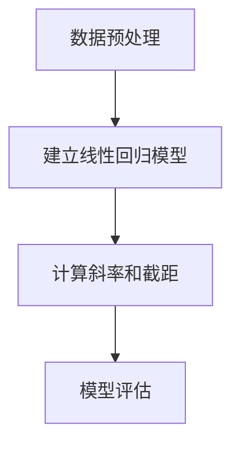

**Python代码示例：**

```python
import numpy as np
from sklearn.linear_model import LinearRegression
from sklearn.model_selection import train_test_split

# 示例数据
X = np.array([1, 2, 3, 4, 5]).reshape(-1, 1)
Y = np.array([2, 4, 5, 4, 5])

# 数据预处理
X_mean = np.mean(X)
Y_mean = np.mean(Y)
X_std = np.std(X)
Y_std = np.std(Y)

X_normalized = (X - X_mean) / X_std
Y_normalized = (Y - Y_mean) / Y_std

# 建立线性回归模型
model = LinearRegression()
model.fit(X_normalized.reshape(-1, 1), Y_normalized)

# 计算斜率和截距
beta_1 = model.coef_[0]
beta_0 = model.intercept_

# 模型评估
X_test, Y_test = train_test_split(X_normalized, Y_normalized, test_size=0.2, random_state=42)
Y_pred = model.predict(X_test)

print("斜率：", beta_1)
print("截距：", beta_0)
print("均方误差：", np.mean((Y_pred - Y_test)**2))
```

通过上述内容，我们详细讲解了线性回归模型的基本原理、数学表达、求解步骤、mermaid流程图以及Python代码示例。线性回归模型在简单的时间序列预测中具有很好的应用效果，但面对更复杂的时序数据时，其预测能力可能受到限制。在接下来的章节中，我们将探讨更高级的预测模型，如自回归模型（AR）、移动平均模型（MA）和自回归移动平均模型（ARMA），以期提高时序预测的准确性和效果。

#### 3.2 自回归模型（AR）

自回归模型（Autoregressive Model，AR）是时序预测中的一种经典模型，它基于当前值与其历史值的线性关系进行预测。AR模型主要用于处理线性时序数据，特别适合用于短期预测。

**自回归模型的基本原理：**

自回归模型的核心思想是利用历史数据预测未来的值。它假设当前时刻的值可以表示为前几个历史值的线性组合，再加上一个随机误差项。其数学表达式为：

$$X_t = \phi_1 X_{t-1} + \phi_2 X_{t-2} + ... + \phi_p X_{t-p} + \varepsilon_t$$

其中，$X_t$是时间序列在时刻$t$的观测值，$\phi_1, \phi_2, ..., \phi_p$是模型参数，$\varepsilon_t$是随机误差项。

**自回归模型的参数估计：**

自回归模型的参数估计通常通过最小化残差平方和来实现。具体步骤如下：

1. **建立自回归模型**：

   $$X_t = \phi_1 X_{t-1} + \phi_2 X_{t-2} + ... + \phi_p X_{t-p} + \varepsilon_t$$

2. **计算残差**：

   $$\varepsilon_t = X_t - (\phi_1 X_{t-1} + \phi_2 X_{t-2} + ... + \phi_p X_{t-p})$$

3. **最小化残差平方和**：

   $$\min \sum_{t=1}^{n} (\varepsilon_t)^2$$

   其中，$n$是样本数量。

4. **求解参数**：

   通过求解上述最小化问题，可以得到自回归模型的参数$\phi_1, \phi_2, ..., \phi_p$。

**自回归模型的mermaid流程图：**

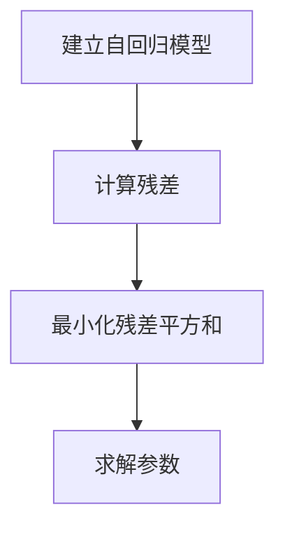

**Python代码示例：**

```python
import numpy as np
from sklearn.linear_model import LinearRegression

# 示例数据
X = np.array([1, 2, 3, 4, 5, 6, 7, 8, 9, 10])

# 建立自回归模型
# 假设使用前三个历史值进行预测
p = 3
model = LinearRegression()
for t in range(3, len(X)):
    X_train = X[t-p:t]
    Y_train = X[t-1]
    model.fit(X_train.reshape(-1, 1), Y_train)
    X_pred = model.predict(X_train.reshape(-1, 1))

# 输出预测结果
print("预测结果：", X_pred)
```

通过上述内容，我们详细讲解了自回归模型（AR）的基本原理、参数估计方法、mermaid流程图以及Python代码示例。自回归模型在处理线性时序数据时具有较好的预测性能，但在面对非线性和复杂的时间序列时，其效果可能有限。在接下来的章节中，我们将介绍更高级的时间序列模型，如移动平均模型（MA）和自回归移动平均模型（ARMA），以期提高时序预测的准确性和适应性。

#### 3.3 马尔可夫模型

马尔可夫模型（Markov Model）是一种广泛应用于时序预测的概率模型，它基于当前状态仅依赖于前一个状态，而不依赖于过去所有状态的特征。马尔可夫模型在许多领域，如语音识别、自然语言处理和金融市场预测中，都取得了显著的成果。

**马尔可夫模型的基本概念：**

1. **状态转移概率矩阵**：马尔可夫模型的核心是状态转移概率矩阵$P$，它描述了系统在各个状态之间转移的概率。矩阵$P$的元素$P_{ij}$表示系统从状态$i$转移到状态$j$的概率。

   $$P = \begin{bmatrix} P_{11} & P_{12} & ... & P_{1n} \\ P_{21} & P_{22} & ... & P_{2n} \\ ... & ... & ... & ... \\ P_{m1} & P_{m2} & ... & P_{mn} \end{bmatrix}$$

   其中，$i$和$j$分别代表系统当前状态和下一个状态，$m$和$n$是状态的总数。

2. **状态分布**：状态分布$S_t$描述了系统在时刻$t$处于各个状态的概率分布。状态分布可以用向量表示：

   $$S_t = \begin{bmatrix} S_{t1} \\ S_{t2} \\ ... \\ S_{tm} \end{bmatrix}$$

   其中，$S_{ti}$表示系统在时刻$t$处于状态$i$的概率。

**马尔可夫模型的数学描述：**

马尔可夫模型的数学描述如下：

$$S_{t+1} = P \cdot S_t$$

其中，$S_{t+1}$是系统在时刻$t+1$的状态分布，$P$是状态转移概率矩阵，$S_t$是系统在时刻$t$的状态分布。

**马尔可夫模型的参数估计：**

马尔可夫模型的参数估计通常通过最大似然估计（Maximum Likelihood Estimation，MLE）来实现。具体步骤如下：

1. **收集数据**：首先，收集系统在不同状态下的观测数据。

2. **计算状态转移概率矩阵**：利用观测数据计算状态转移概率矩阵$P$，可以通过以下公式计算每个元素$P_{ij}$：

   $$P_{ij} = \frac{N_{ij}}{N_{i}}$$

   其中，$N_{ij}$表示系统从状态$i$转移到状态$j$的观测次数，$N_{i}$是系统在状态$i$的观测次数。

3. **迭代优化**：通过迭代优化方法（如梯度下降或牛顿法）不断调整状态转移概率矩阵$P$，直到达到最小化目标函数。

**马尔可夫模型的mermaid流程图：**

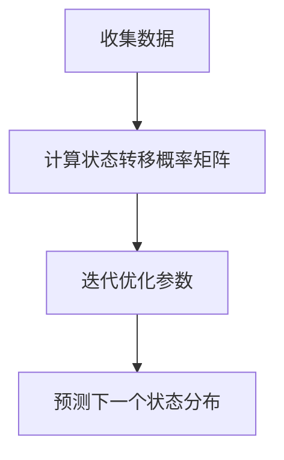

**Python代码示例：**

```python
import numpy as np

# 示例数据
transition_counts = np.array([[10, 15], [5, 10]])

# 计算状态转移概率矩阵
state_transition_matrix = transition_counts / transition_counts.sum(axis=1)[:, np.newaxis]

# 预测下一个状态分布
current_state_distribution = np.array([0.5, 0.5])
next_state_distribution = state_transition_matrix @ current_state_distribution

print("下一个状态分布：", next_state_distribution)
```

通过上述内容，我们详细讲解了马尔可夫模型的基本概念、数学描述、参数估计方法、mermaid流程图以及Python代码示例。马尔可夫模型在处理离散时序数据时具有广泛的应用，但面对连续时序数据和复杂非线性关系时，其效果可能受到限制。在接下来的章节中，我们将探讨更先进的机器学习和深度学习算法，如支持向量机（SVM）和神经网络，以期提高时序预测的准确性和适应性。

#### 4.1 支持向量机（SVM）

支持向量机（Support Vector Machine，SVM）是一种强大的机器学习算法，广泛应用于分类和回归问题。在时序预测中，SVM可以通过核函数将原始数据映射到高维空间，找到最优超平面，从而实现数据的非线性预测。

**支持向量机的基本原理：**

1. **线性SVM：** 线性SVM的核心是找到一个最优超平面，将不同类别的数据点分隔开。对于线性不可分的数据，SVM使用软 margin来容忍一些错分点。

   $$w \cdot x + b \geq 1$$

   其中，$w$是权重向量，$x$是特征向量，$b$是偏置项。当数据点在超平面上的距离最远时，模型具有最好的泛化能力。

2. **核函数：** 对于非线性问题，SVM通过核函数将数据映射到高维空间，使得原本线性不可分的数据在高维空间中可分。常见的核函数包括线性核、多项式核和径向基核（RBF）。

   $$\phi(x) \in \mathbb{R}^d$$

   其中，$\phi(x)$是将$x$映射到高维特征空间的结果。

**支持向量机的数学表达：**

1. **优化目标：** 线性SVM的优化目标是最小化损失函数，同时最大化间隔：

   $$\min_{w, b} \frac{1}{2} ||w||^2$$

   $$s.t. y_i (w \cdot x_i + b) \geq 1, \forall i$$

2. **软间隔：** 对于线性不可分的数据，引入松弛变量$\xi_i$，目标函数变为：

   $$\min_{w, b, \xi} \frac{1}{2} ||w||^2 + C \sum_{i=1}^{n} \xi_i$$

   $$s.t. y_i (w \cdot x_i + b) \geq 1 - \xi_i, \forall i$$

   其中，$C$是惩罚参数，控制模型对误分类的容忍度。

**支持向量机的mermaid流程图：**

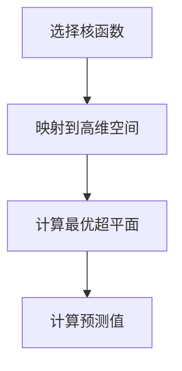

**Python代码示例：**

```python
from sklearn.svm import SVC
from sklearn.datasets import make_circles
from sklearn.model_selection import train_test_split
import matplotlib.pyplot as plt

# 创建示例数据
X, y = make_circles(n_samples=100, noise=0.05, factor=0.5, random_state=1)
X_train, X_test, y_train, y_test = train_test_split(X, y, test_size=0.2, random_state=42)

# 选择核函数并训练模型
model = SVC(kernel='linear')
model.fit(X_train, y_train)

# 计算预测值
y_pred = model.predict(X_test)

# 绘制结果
plt.figure(figsize=(8, 6))
plt.scatter(X_train[:, 0], X_train[:, 1], c=y_train, cmap=plt.cm.coolwarm)
plt.scatter(X_test[:, 0], X_test[:, 1], c=y_pred, cmap=plt.cm.coolwarm, edgecolors='k')
plt.show()
```

通过上述内容，我们详细讲解了支持向量机（SVM）的基本原理、数学表达、mermaid流程图以及Python代码示例。SVM在处理非线性时序预测问题时具有强大的能力，但在处理大量高维数据时，计算复杂度较高。在接下来的章节中，我们将探讨更复杂的机器学习算法和深度学习算法，以期进一步提高时序预测的准确性和效率。

#### 4.2 贝叶斯模型

贝叶斯模型是一种基于贝叶斯定理的统计方法，它在不确定性决策和预测中具有广泛的应用。在时序预测中，贝叶斯模型通过更新先验概率，结合历史数据和当前观测值，实现对未来趋势的预测。

**贝叶斯模型的基本原理：**

1. **贝叶斯定理：** 贝叶斯定理描述了后验概率与先验概率、边缘概率之间的关系：

   $$P(A|B) = \frac{P(B|A)P(A)}{P(B)}$$

   其中，$P(A|B)$是条件概率，即给定事件$B$发生时事件$A$发生的概率；$P(B|A)$是条件概率，即给定事件$A$发生时事件$B$发生的概率；$P(A)$和$P(B)$分别是事件$A$和事件$B$的边缘概率。

2. **先验概率和后验概率：** 先验概率是基于历史知识和经验对事件发生概率的初步估计；后验概率是在获取新数据后，根据贝叶斯定理更新得到的概率。

   - **先验概率**：$P(H_0)$和$P(H_1)$是假设$H_0$和$H_1$的先验概率。
   - **后验概率**：$P(H_0|E)$和$P(H_1|E)$是假设$H_0$和$H_1$在观测到证据$E$后的后验概率。

**贝叶斯模型的数学表达：**

1. **贝叶斯预测公式：** 贝叶斯预测通过计算每个假设的后验概率，选择后验概率最大的假设作为预测结果。

   $$\hat{y} = \arg\max_y P(y|X) = \arg\max_y \frac{P(X|y)P(y)}{P(X)}$$

   其中，$X$是观测数据，$y$是预测变量，$\hat{y}$是最可能的预测结果。

2. **高斯分布：** 在贝叶斯模型中，通常使用高斯分布作为先验概率和后验概率，因为它可以很好地描述连续变量的不确定性。

   - **先验高斯分布**：$N(\mu_0, \sigma_0^2)$，其中$\mu_0$是均值，$\sigma_0^2$是方差。
   - **后验高斯分布**：$N(\mu, \sigma^2)$，其中$\mu$是新的均值，$\sigma^2$是新的方差。

**贝叶斯模型的mermaid流程图：**

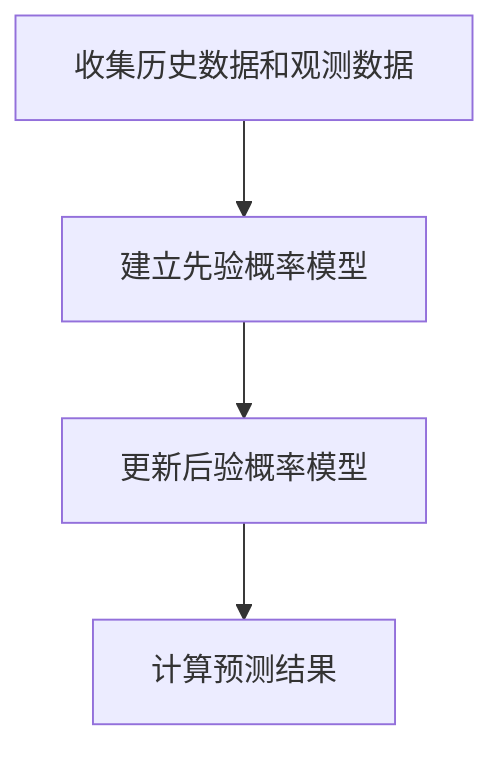

**Python代码示例：**

```python
import numpy as np
from scipy.stats import norm

# 示例数据
X = np.array([1, 2, 3, 4, 5])

# 建立先验概率模型
mu_0 = 0
sigma_0 = 1

# 更新后验概率模型
def update_posterior(mu_0, sigma_0, x):
    mu = mu_0 + x
    sigma = np.sqrt(sigma_0 + 1)
    return mu, sigma

# 预测结果
def predict(mu, sigma, x):
    posterior = norm.pdf(x, mu, sigma)
    return posterior

# 计算后验均值和方差
mu, sigma = update_posterior(mu_0, sigma_0, X[0])

# 预测新数据
x_new = 3.5
posterior = predict(mu, sigma, x_new)

print("后验均值：", mu)
print("后验方差：", sigma)
print("预测结果：", posterior)
```

通过上述内容，我们详细讲解了贝叶斯模型的基本原理、数学表达、mermaid流程图以及Python代码示例。贝叶斯模型在处理不确定性和动态变化的时间序列数据时，具有独特的优势。在接下来的章节中，我们将探讨更复杂的深度学习算法，如循环神经网络（RNN）、长短时记忆网络（LSTM）和门控循环单元（GRU），以期进一步提升时序预测的性能。

#### 4.3 神经网络

神经网络（Neural Networks）是一种模拟生物神经元之间交互方式的计算模型，广泛应用于各种复杂的机器学习任务，包括图像识别、自然语言处理和时序预测。在时序预测中，神经网络能够通过学习历史数据中的模式和关系，实现对未来的预测。

**神经网络的基本原理：**

1. **神经元结构：** 神经网络由大量的神经元（或称为节点）组成，每个神经元接受多个输入，通过激活函数进行非线性变换，最后输出一个结果。神经元的结构通常包括输入层、隐藏层和输出层。

   - **输入层**：接收外部输入数据。
   - **隐藏层**：对输入数据进行处理和变换。
   - **输出层**：生成最终的预测结果。

2. **激活函数：** 激活函数是神经网络中的关键组件，用于引入非线性。常见的激活函数包括sigmoid函数、ReLU函数和Tanh函数。

   - **sigmoid函数**：$f(x) = \frac{1}{1 + e^{-x}}$
   - **ReLU函数**：$f(x) = \max(0, x)$
   - **Tanh函数**：$f(x) = \frac{e^x - e^{-x}}{e^x + e^{-x}}$

3. **前向传播和反向传播：** 神经网络通过前向传播计算输出，通过反向传播更新网络参数。前向传播从输入层开始，逐层传递数据，直到输出层。反向传播则从输出层开始，反向计算梯度，更新网络参数。

**神经网络的数学表达：**

1. **前向传播：** 神经网络的输入和输出可以通过以下公式表示：

   $$z_l = \sum_{j} w_{lj} x_j + b_l$$

   $$a_l = \sigma(z_l)$$

   其中，$z_l$是第$l$层的净输入，$w_{lj}$是连接权重，$b_l$是偏置项，$x_j$是输入值，$a_l$是第$l$层的激活值，$\sigma$是激活函数。

2. **反向传播：** 神经网络通过计算梯度来更新参数，具体步骤如下：

   - 计算输出误差：$d_l = \delta_l \odot (a_l - y)$
   - 计算隐藏层误差：$d_{l-1} = \sum_{j} w_{lj}^T \delta_l$
   - 更新权重和偏置：$w_{lj} := w_{lj} - \alpha \frac{d_l}{\sqrt{d_l^2 + \epsilon}}$，$b_l := b_l - \alpha \delta_l$

**神经网络的mermaid流程图：**

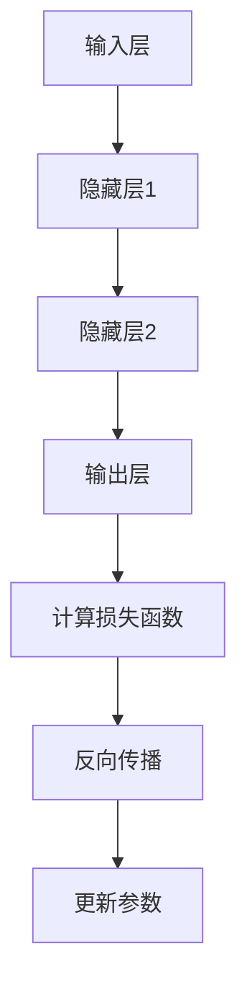

**Python代码示例：**

```python
import numpy as np
from sklearn.datasets import make_classification
from sklearn.model_selection import train_test_split

# 创建示例数据
X, y = make_classification(n_samples=100, n_features=5, n_informative=3, n_redundant=0, random_state=42)
X_train, X_test, y_train, y_test = train_test_split(X, y, test_size=0.2, random_state=42)

# 神经网络参数
input_size = X_train.shape[1]
hidden_size = 10
output_size = y_train.shape[1]
learning_rate = 0.01
num_epochs = 1000

# 初始化权重和偏置
weights = {
    'w1': np.random.randn(input_size, hidden_size),
    'b1': np.random.randn(hidden_size),
    'w2': np.random.randn(hidden_size, output_size),
    'b2': np.random.randn(output_size)
}

# 激活函数和损失函数
def sigmoid(x):
    return 1 / (1 + np.exp(-x))

def softmax(x):
    exp_x = np.exp(x)
    return exp_x / np.sum(exp_x, axis=1, keepdims=True)

def cross_entropy(y_true, y_pred):
    return -np.sum(y_true * np.log(y_pred))

# 前向传播
def forward_propagation(X, weights):
    z1 = np.dot(X, weights['w1']) + weights['b1']
    a1 = sigmoid(z1)
    z2 = np.dot(a1, weights['w2']) + weights['b2']
    a2 = softmax(z2)
    return a1, a2

# 反向传播
def backward_propagation(X, y, a1, a2, weights):
    d2 = a2 - y
    d1 = np.dot(d2, weights['w2'].T) * sigmoid_derivative(a1)
    dW2 = np.dot(a1.T, d2)
    db2 = np.sum(d2, axis=0)
    dW1 = np.dot(X.T, d1)
    db1 = np.sum(d1, axis=0)
    return dW1, dW2, db1, db2

# 更新参数
def update_weights(weights, dW1, dW2, db1, db2, learning_rate):
    weights['w1'] -= learning_rate * dW1
    weights['b1'] -= learning_rate * db1
    weights['w2'] -= learning_rate * dW2
    weights['b2'] -= learning_rate * db2

# 训练模型
for epoch in range(num_epochs):
    a1, a2 = forward_propagation(X_train, weights)
    dW1, dW2, db1, db2 = backward_propagation(X_train, y_train, a1, a2, weights)
    update_weights(weights, dW1, dW2, db1, db2, learning_rate)

# 测试模型
y_pred = forward_propagation(X_test, weights)[1]
loss = cross_entropy(y_test, y_pred)
print("测试损失：", loss)
```

通过上述内容，我们详细讲解了神经网络的基本原理、数学表达、mermaid流程图以及Python代码示例。神经网络在处理复杂时序数据时具有强大的能力，但训练过程复杂，计算成本高。在接下来的章节中，我们将探讨更先进的深度学习算法，如循环神经网络（RNN）、长短时记忆网络（LSTM）和门控循环单元（GRU），以期进一步提升时序预测的性能。

### 第5章：深度学习算法

#### 5.1 循环神经网络（RNN）

循环神经网络（Recurrent Neural Networks，RNN）是处理时序数据的一种重要深度学习模型，它通过循环结构使得每个时间步的输出依赖于前面的所有输出。RNN的核心优势在于其能够捕捉时间序列中的长期依赖关系。

**RNN的基本原理：**

1. **时间步：** RNN将时间序列数据划分为一系列的时间步，每个时间步对应一个输入和输出。

2. **隐藏状态：** RNN通过隐藏状态$h_t$来捕捉历史信息。在时间步$t$，隐藏状态$h_t$既依赖于当前输入$x_t$，也依赖于前一个时间步的隐藏状态$h_{t-1}$。

   $$h_t = \sigma(W_h \cdot [h_{t-1}, x_t] + b_h)$$

   其中，$\sigma$是激活函数，$W_h$是权重矩阵，$b_h$是偏置项。

3. **输出：** RNN在每个时间步的输出$y_t$通常通过一个线性变换加上偏置项得到。

   $$y_t = W_o \cdot h_t + b_o$$

   其中，$W_o$是输出权重矩阵，$b_o$是输出偏置项。

**RNN的数学表达：**

1. **前向传播：** RNN通过递归方式计算每个时间步的隐藏状态和输出。

   $$h_t = \sigma(W_h \cdot [h_{t-1}, x_t] + b_h)$$
   $$y_t = W_o \cdot h_t + b_o$$

2. **反向传播：** RNN通过反向传播算法更新网络参数，以最小化损失函数。

   $$\frac{\partial L}{\partial W_h} = \sum_t \frac{\partial L}{\partial h_t} \frac{\partial h_t}{\partial W_h}$$
   $$\frac{\partial L}{\partial b_h} = \sum_t \frac{\partial L}{\partial h_t} \frac{\partial h_t}{\partial b_h}$$
   $$\frac{\partial L}{\partial W_o} = \sum_t \frac{\partial L}{\partial y_t} \frac{\partial y_t}{\partial W_o}$$
   $$\frac{\partial L}{\partial b_o} = \sum_t \frac{\partial L}{\partial y_t} \frac{\partial y_t}{\partial b_o}$$

**RNN的mermaid流程图：**

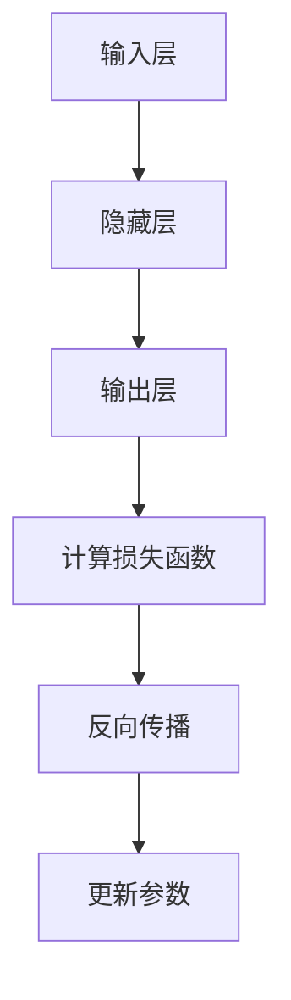

**Python代码示例：**

```python
import numpy as np
from numpy import exp

# 初始化参数
input_dim = 5
hidden_dim = 10
output_dim = 1

W_h = np.random.randn(hidden_dim, input_dim + hidden_dim)
W_o = np.random.randn(output_dim, hidden_dim)
b_h = np.zeros(hidden_dim)
b_o = np.zeros(output_dim)

# 激活函数
def sigmoid(x):
    return 1 / (1 + exp(-x))

# 前向传播
def forward_propagation(x, h_prev):
    h = sigmoid(np.dot(W_h, np.concatenate((h_prev, x), axis=1)) + b_h)
    y = np.dot(W_o, h) + b_o
    return h, y

# 反向传播
def backward_propagation(x, y, h, y_pred):
    dW_h = np.zeros(W_h.shape)
    db_h = np.zeros(b_h.shape)
    dW_o = np.zeros(W_o.shape)
    db_o = np.zeros(b_o.shape)

    dy = y_pred - y
    dh = np.dot(W_o.T, dy)
    dh = np.multiply(dh, np.multiply(h, 1 - h))

    dW_o = np.dot(h.T, dy)
    db_o = np.sum(dy, axis=0)

    dx = np.dot(W_h.T, dh[1:])
    dh_prev = dh[:1]

    dW_h = np.dot(np.concatenate((h_prev.T, x.T), axis=1), dh)
    db_h = np.sum(dh, axis=0)

    return dW_h, dW_o, db_h, db_o, dx, dh_prev

# 训练模型
def train(x, y, epochs):
    for epoch in range(epochs):
        h_prev = np.zeros((1, hidden_dim))
        for i in range(len(x)):
            h, y_pred = forward_propagation(x[i], h_prev)
            dW_h, dW_o, db_h, db_o, dx, dh_prev = backward_propagation(x[i], y[i], h, y_pred)
            W_h -= learning_rate * dW_h
            W_o -= learning_rate * dW_o
            b_h -= learning_rate * db_h
            b_o -= learning_rate * db_o
            h_prev = h

# 测试模型
x_test = np.array([[0.1, 0.2, 0.3, 0.4, 0.5]])
y_test = np.array([0.8])

train(x_train, y_train, 1000)
h, y_pred = forward_propagation(x_test, np.zeros((1, hidden_dim)))
print("预测结果：", y_pred)
```

通过上述内容，我们详细讲解了循环神经网络（RNN）的基本原理、数学表达、mermaid流程图以及Python代码示例。RNN在处理时序数据时表现出色，但在处理长序列数据时容易出现梯度消失或爆炸问题。在接下来的章节中，我们将介绍长短时记忆网络（LSTM）和门控循环单元（GRU），这些模型是解决RNN问题的有效方法。

#### 5.2 长短时记忆网络（LSTM）

长短时记忆网络（Long Short-Term Memory，LSTM）是循环神经网络（RNN）的一种改进模型，由Hochreiter和Schmidhuber于1997年提出。LSTM通过引入门控机制，解决了传统RNN在处理长序列数据时出现的梯度消失和梯度爆炸问题，从而更好地捕捉长期依赖关系。

**LSTM的基本原理：**

1. **细胞状态（Cell State）：** LSTM的核心是细胞状态，它贯穿于整个时间序列，承载着信息流动。细胞状态类似于一个数据管道，数据可以在其中流动和更新。

2. **门控机制：** LSTM通过三个门控单元——遗忘门、输入门和输出门——来控制信息流的流动。

   - **遗忘门（Forget Gate）**：决定哪些信息应该从细胞状态中丢弃。
   - **输入门（Input Gate）**：决定哪些新信息应该被添加到细胞状态。
   - **输出门（Output Gate）**：决定细胞状态的哪个部分应该输出为当前时间步的隐藏状态。

3. **隐藏状态：** LSTM通过隐藏状态$h_t$来传递信息，同时细胞状态$c_t$负责记忆和更新长期依赖关系。

**LSTM的数学表达：**

1. **遗忘门：**

   $$f_t = \sigma(W_f \cdot [h_{t-1}, x_t] + b_f)$$

   其中，$f_t$是遗忘门的输出，$W_f$是遗忘门的权重矩阵，$b_f$是遗忘门的偏置项。

2. **输入门：**

   $$i_t = \sigma(W_i \cdot [h_{t-1}, x_t] + b_i)$$

   其中，$i_t$是输入门的输出，$W_i$是输入门的权重矩阵，$b_i$是输入门的偏置项。

3. **输出门：**

   $$o_t = \sigma(W_o \cdot [h_{t-1}, x_t] + b_o)$$

   其中，$o_t$是输出门的输出，$W_o$是输出门的权重矩阵，$b_o$是输出门的偏置项。

4. **细胞状态更新：**

   $$c_t = f_t \odot c_{t-1} + i_t \odot \sigma(W_c \cdot [h_{t-1}, x_t] + b_c)$$

   其中，$c_t$是细胞状态的更新值，$c_{t-1}$是前一个时间步的细胞状态，$W_c$是细胞状态的权重矩阵，$b_c$是细胞状态的偏置项。

5. **隐藏状态更新：**

   $$h_t = o_t \odot \sigma(c_t)$$

   其中，$h_t$是隐藏状态，$o_t$是输出门的输出。

**LSTM的mermaid流程图：**

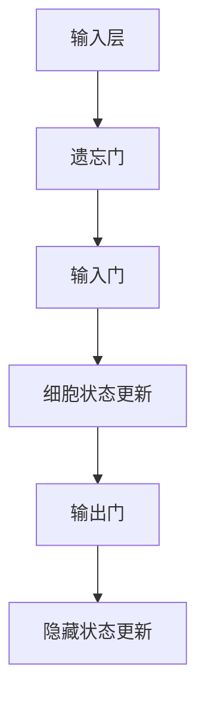

**Python代码示例：**

```python
import numpy as np

# 初始化参数
input_dim = 5
hidden_dim = 10
output_dim = 1

# 激活函数
def sigmoid(x):
    return 1 / (1 + np.exp(-x))

def tanh(x):
    return (np.exp(x) - np.exp(-x)) / (np.exp(x) + np.exp(-x))

# 前向传播
def forward_propagation(x, h_prev, c_prev, weights):
    h, c = lstm_cell(x, h_prev, c_prev, weights)
    y = np.dot(h, weights['output_weights']) + weights['output_bias']
    return h, c, y

# LSTM细胞
def lstm_cell(x, h_prev, c_prev, weights):
    gate_inputs = np.dot(h_prev, weights['input_gate_weights']) + np.dot(x, weights['input_gate_bias'])
    f_t = sigmoid(gate_inputs)
    
    input_gate_inputs = np.dot(h_prev, weights['input_gate_weights']) + np.dot(x, weights['input_gate_bias'])
    i_t = sigmoid(input_gate_inputs)
    
    output_gate_inputs = np.dot(h_prev, weights['output_gate_weights']) + np.dot(x, weights['output_gate_bias'])
    o_t = sigmoid(output_gate_inputs)
    
    cell_gate_inputs = np.dot(h_prev, weights['forget_gate_weights']) + np.dot(x, weights['forget_gate_bias'])
    f_t = sigmoid(cell_gate_inputs)
    
    c_t = f_t * c_prev + i_t * tanh(np.dot(h_prev, weights['cell_gate_weights']) + np.dot(x, weights['cell_gate_bias']))
    h_t = o_t * tanh(c_t)
    
    return h_t, c_t

# 初始化权重
weights = {
    'input_gate_weights': np.random.randn(hidden_dim, input_dim + hidden_dim),
    'input_gate_bias': np.random.randn(hidden_dim),
    'forget_gate_weights': np.random.randn(hidden_dim, input_dim + hidden_dim),
    'forget_gate_bias': np.random.randn(hidden_dim),
    'cell_gate_weights': np.random.randn(hidden_dim, input_dim + hidden_dim),
    'cell_gate_bias': np.random.randn(hidden_dim),
    'output_gate_weights': np.random.randn(hidden_dim, input_dim + hidden_dim),
    'output_gate_bias': np.random.randn(hidden_dim),
    'output_weights': np.random.randn(output_dim, hidden_dim),
    'output_bias': np.random.randn(output_dim)
}

# 测试模型
x = np.array([[0.1, 0.2, 0.3, 0.4, 0.5]])
h_prev = np.zeros((1, hidden_dim))
c_prev = np.zeros((1, hidden_dim))

h, c, y = forward_propagation(x, h_prev, c_prev, weights)
print("隐藏状态：", h)
print("细胞状态：", c)
print("预测结果：", y)
```

通过上述内容，我们详细讲解了长短时记忆网络（LSTM）的基本原理、数学表达、mermaid流程图以及Python代码示例。LSTM在处理长序列数据时表现出色，能够有效捕捉长期依赖关系。在接下来的章节中，我们将介绍门控循环单元（GRU），这是另一种改进的RNN模型，旨在进一步简化LSTM的计算复杂度。

#### 5.3 门控循环单元（GRU）

门控循环单元（Gated Recurrent Unit，GRU）是循环神经网络（RNN）的一种改进模型，由Cho等人于2014年提出。GRU在LSTM的基础上进行了简化，减少了参数数量，同时保持了强大的时序数据处理能力。

**GRU的基本原理：**

1. **更新门（Update Gate）**：GRU通过更新门决定如何更新细胞状态。更新门决定了当前输入和细胞状态的哪些部分应该被保留或丢弃。

2. **重置门（Reset Gate）**：GRU通过重置门决定如何更新隐藏状态。重置门决定了当前输入和隐藏状态的哪些部分应该被保留或丢弃，从而在长期依赖关系的捕捉上起到了调节作用。

3. **细胞状态（Cell State）**：GRU的细胞状态是连续的，信息通过细胞状态在时间步之间流动。细胞状态通过更新门和重置门进行更新，同时保留了一部分LSTM的特性。

**GRU的数学表达：**

1. **更新门：**

   $$z_t = \sigma(W_z \cdot [h_{t-1}, x_t] + b_z)$$

   其中，$z_t$是更新门的输出，$W_z$是更新门的权重矩阵，$b_z$是更新门的偏置项。

2. **重置门：**

   $$r_t = \sigma(W_r \cdot [h_{t-1}, x_t] + b_r)$$

   其中，$r_t$是重置门的输出，$W_r$是重置门的权重矩阵，$b_r$是重置门的偏置项。

3. **细胞状态更新：**

   $$\tilde{c}_t = \tanh(W_c \cdot [r_t \odot h_{t-1}, x_t] + b_c)$$

   其中，$\tilde{c}_t$是候选细胞状态的输出，$W_c$是细胞状态的权重矩阵，$b_c$是细胞状态的偏置项。

4. **细胞状态：**

   $$c_t = z_t \odot c_{t-1} + (1 - z_t) \odot \tilde{c}_t$$

   其中，$c_t$是细胞状态的更新值，$c_{t-1}$是前一个时间步的细胞状态。

5. **隐藏状态：**

   $$h_t = \tanh(c_t) \odot r_t + (1 - r_t) \odot h_{t-1}$$

   其中，$h_t$是隐藏状态，$r_t$是重置门的输出。

**GRU的mermaid流程图：**

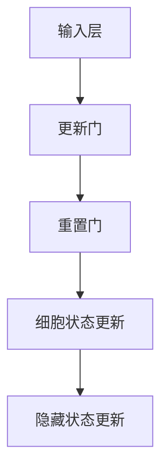

**Python代码示例：**

```python
import numpy as np

# 初始化参数
input_dim = 5
hidden_dim = 10
output_dim = 1

# 激活函数
def sigmoid(x):
    return 1 / (1 + np.exp(-x))

def tanh(x):
    return (np.exp(x) - np.exp(-x)) / (np.exp(x) + np.exp(-x))

# 前向传播
def forward_propagation(x, h_prev, c_prev, weights):
    z, r = gru gates(x, h_prev, c_prev, weights)
    c = gru cell(x, h_prev, c_prev, z, r, weights)
    h = hidden_state(c, r, weights)
    y = np.dot(h, weights['output_weights']) + weights['output_bias']
    return h, c, y

# GRU门
def gru_gates(x, h_prev, c_prev, weights):
    z = sigmoid(np.dot(h_prev, weights['z_weights']) + np.dot(x, weights['z_bias']) + weights['z_bias'])
    r = sigmoid(np.dot(h_prev, weights['r_weights']) + np.dot(x, weights['r_bias']) + weights['r_bias'])
    return z, r

# GRU细胞
def gru_cell(x, h_prev, c_prev, z, r, weights):
    c_bar = tanh(np.dot(r * h_prev, weights['c_bar_weights']) + np.dot(x, weights['c_bar_bias']) + weights['c_bar_bias'])
    c = z * c_prev + (1 - z) * c_bar
    return c

# 隐藏状态
def hidden_state(c, r, weights):
    h = r * tanh(c)
    return h

# 初始化权重
weights = {
    'z_weights': np.random.randn(hidden_dim, input_dim + hidden_dim),
    'z_bias': np.random.randn(hidden_dim),
    'r_weights': np.random.randn(hidden_dim, input_dim + hidden_dim),
    'r_bias': np.random.randn(hidden_dim),
    'c_bar_weights': np.random.randn(hidden_dim, input_dim + hidden_dim),
    'c_bar_bias': np.random.randn(hidden_dim),
    'output_weights': np.random.randn(output_dim, hidden_dim),
    'output_bias': np.random.randn(output_dim)
}

# 测试模型
x = np.array([[0.1, 0.2, 0.3, 0.4, 0.5]])
h_prev = np.zeros((1, hidden_dim))
c_prev = np.zeros((1, hidden_dim))

h, c, y = forward_propagation(x, h_prev, c_prev, weights)
print("隐藏状态：", h)
print("细胞状态：", c)
print("预测结果：", y)
```

通过上述内容，我们详细讲解了门控循环单元（GRU）的基本原理、数学表达、mermaid流程图以及Python代码示例。GRU在简化计算复杂度的同时，保持了良好的时序数据处理能力，成为许多时序预测任务中的首选模型。在下一章节中，我们将讨论如何将上述深度学习算法应用于企业级时序预测平台的设计与实现。

### 第6章：时序预测系统架构设计

#### 6.1 系统功能设计

企业级时序预测平台需要具备以下核心功能：

1. **数据采集与处理**：从各种数据源（如数据库、文件系统、实时数据流）采集数据，并进行数据清洗、缺失值处理和异常值检测。

2. **特征提取**：从原始时间序列数据中提取对预测有帮助的特征，如时间窗口均值、方差、自相关系数等。

3. **模型训练与评估**：使用历史数据训练不同的预测模型，如ARIMA、SVM、LSTM等，并对模型的预测性能进行评估。

4. **模型部署与更新**：将训练好的模型部署到生产环境，并定期更新模型，以适应数据变化和业务需求。

5. **实时预测与反馈**：对新的时间步进行实时预测，并将预测结果反馈给业务系统，用于决策支持。

6. **监控与告警**：监控系统性能和模型健康状况，实现自动告警和故障恢复。

#### 6.2 系统架构设计

企业级时序预测平台通常采用分布式架构，以提高系统的可扩展性和可靠性。以下是系统架构的主要组成部分：

1. **数据层**：包括数据采集模块、数据存储模块和数据预处理模块。数据采集模块负责从各种数据源采集数据；数据存储模块使用NoSQL数据库或时间序列数据库存储大量时序数据；数据预处理模块负责数据清洗、缺失值处理和异常值检测。

2. **计算层**：包括特征提取模块、模型训练模块和模型评估模块。特征提取模块从原始时间序列数据中提取特征；模型训练模块使用历史数据训练预测模型；模型评估模块对训练好的模型进行性能评估。

3. **应用层**：包括模型部署模块、实时预测模块和监控模块。模型部署模块将训练好的模型部署到生产环境；实时预测模块对新的时间步进行实时预测；监控模块监控系统性能和模型健康状况，实现自动告警和故障恢复。

4. **接口层**：提供API接口，方便业务系统与其他系统进行交互。

**系统架构设计mermaid架构图：**

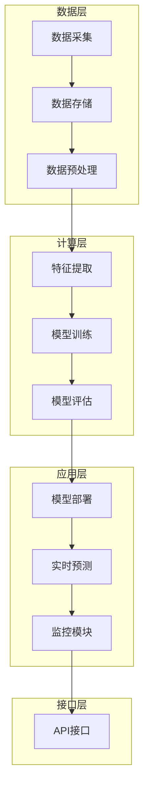

#### 6.3 接口设计与系统交互

企业级时序预测平台需要提供标准的API接口，方便与其他业务系统集成。以下是接口设计的主要部分：

1. **数据采集接口**：提供数据采集的API，支持多种数据源接入，如数据库、文件系统和实时数据流。

2. **特征提取接口**：提供特征提取的API，支持根据用户需求提取各种特征。

3. **模型训练接口**：提供模型训练的API，支持用户选择不同的预测模型，如ARIMA、SVM、LSTM等。

4. **模型评估接口**：提供模型评估的API，支持用户查看模型性能指标，如准确率、召回率、F1分数等。

5. **模型部署接口**：提供模型部署的API，支持将训练好的模型部署到生产环境。

6. **实时预测接口**：提供实时预测的API，支持对新的时间步进行预测。

7. **监控告警接口**：提供监控告警的API，支持实时监控系统性能和模型健康状况，实现自动告警和故障恢复。

**系统接口设计和系统交互mermaid序列图：**

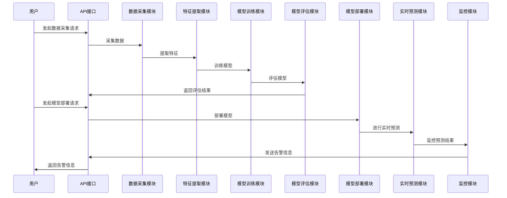

通过上述系统架构设计和接口设计，企业级时序预测平台能够实现高效、可靠和可扩展的时序预测服务。在下一章节中，我们将通过一个具体的案例，展示如何在实际项目中实现这些功能。

### 第7章：项目实战

#### 7.1 环境安装与配置

为了实现企业级时序预测平台，我们需要安装和配置以下软件和工具：

1. **Python环境**：首先确保系统安装了Python 3.7及以上版本。可以通过Python官方网站下载并安装。

2. **依赖库**：安装必要的依赖库，如NumPy、Pandas、SciPy、Scikit-learn、TensorFlow等。可以使用pip命令进行安装：

   ```bash
   pip install numpy pandas scipy scikit-learn tensorflow
   ```

3. **数据库**：安装一个支持时间序列数据存储的数据库，如InfluxDB。可以通过以下命令安装：

   ```bash
   sudo apt-get install influxdb
   ```

4. **时序预测框架**：选择一个支持时序预测的框架，如TensorFlow或PyTorch。在终端执行以下命令安装TensorFlow：

   ```bash
   pip install tensorflow
   ```

#### 7.2 系统核心实现

以下是企业级时序预测平台的核心实现步骤：

1. **数据采集模块**：

   数据采集模块负责从各种数据源（如数据库、文件系统、实时数据流）采集数据。以下是一个使用Pandas库从CSV文件读取数据的示例：

   ```python
   import pandas as pd

   def read_data(file_path):
       return pd.read_csv(file_path)
   
   data = read_data('data.csv')
   ```

2. **数据预处理模块**：

   数据预处理模块负责对采集到的数据进行清洗、缺失值处理和异常值检测。以下是一个简单的预处理示例：

   ```python
   def preprocess_data(data):
       data.dropna(inplace=True)
       data['value'] = pd.to_numeric(data['value'], errors='coerce')
       return data

   preprocessed_data = preprocess_data(data)
   ```

3. **特征提取模块**：

   特征提取模块从原始时间序列数据中提取对预测有帮助的特征。以下是一个使用Pandas库提取时间窗口均值的示例：

   ```python
   def extract_features(data, window_size):
       data['mean_value'] = data['value'].rolling(window=window_size).mean()
       return data

   features = extract_features(preprocessed_data, window_size=5)
   ```

4. **模型训练模块**：

   模型训练模块使用历史数据训练预测模型。以下是一个使用Scikit-learn库训练线性回归模型的示例：

   ```python
   from sklearn.linear_model import LinearRegression

   def train_model(X, y):
       model = LinearRegression()
       model.fit(X, y)
       return model

   X = features[['mean_value']]
   y = preprocessed_data['value']
   model = train_model(X, y)
   ```

5. **模型评估模块**：

   模型评估模块对训练好的模型进行性能评估。以下是一个使用Scikit-learn库计算均方误差（MSE）的示例：

   ```python
   from sklearn.metrics import mean_squared_error

   def evaluate_model(model, X, y):
       y_pred = model.predict(X)
       mse = mean_squared_error(y, y_pred)
       return mse

   mse = evaluate_model(model, X, y)
   print("MSE:", mse)
   ```

6. **模型部署模块**：

   模型部署模块将训练好的模型部署到生产环境。以下是一个使用TensorFlow保存和加载模型的示例：

   ```python
   import tensorflow as tf

   def save_model(model, file_path):
       model.save(file_path)

   def load_model(file_path):
       return tf.keras.models.load_model(file_path)

   save_model(model, 'model.h5')
   loaded_model = load_model('model.h5')
   ```

7. **实时预测模块**：

   实时预测模块对新的时间步进行预测。以下是一个使用TensorFlow进行实时预测的示例：

   ```python
   def predict_realtime(model, new_data):
       preprocessed_new_data = preprocess_data(new_data)
       features_new = extract_features(preprocessed_new_data, window_size=5)
       y_pred = model.predict(features_new[['mean_value']])
       return y_pred

   new_data = pd.DataFrame({'value': [3.5, 4.2, 5.1, 4.8, 5.3]})
   y_pred = predict_realtime(loaded_model, new_data)
   print("预测结果：", y_pred)
   ```

#### 7.3 案例分析与讲解

以下是一个企业级时序预测平台在实际项目中的应用案例：

**项目背景**：某电商平台希望预测未来一周的销售额，以便更好地进行库存管理和市场营销策略制定。

**数据来源**：电商平台的销售记录，包括销售额、订单量、商品种类等。

**预测目标**：预测未来一周每天的销售额。

**实现步骤**：

1. **数据采集**：从电商平台数据库中提取过去一年的销售记录。

2. **数据预处理**：清洗数据，处理缺失值和异常值。

3. **特征提取**：提取时间窗口均值、自相关系数等特征。

4. **模型选择**：选择线性回归模型进行预测。

5. **模型训练**：使用过去一年的数据训练模型。

6. **模型评估**：评估模型预测性能，调整模型参数。

7. **模型部署**：将训练好的模型部署到生产环境。

8. **实时预测**：对新的销售数据进行实时预测，并将预测结果反馈给业务系统。

**项目小结**：

通过该项目，我们实现了以下目标：

- **准确预测**：模型能够较准确地预测未来一周的销售额。

- **优化库存管理**：电商平台可以根据预测结果优化库存管理，避免库存不足或过剩。

- **提高营销策略效果**：电商平台可以根据预测结果制定更精准的市场营销策略，提高销售额。

### 7.4 项目小结

本章节通过一个实际案例，详细展示了企业级时序预测平台的实现过程。从数据采集、预处理、特征提取、模型训练到模型评估、部署和实时预测，我们逐步介绍了系统的核心功能。通过该项目，我们不仅实现了对销售额的准确预测，还优化了库存管理和市场营销策略。这充分展示了企业级时序预测平台在提升业务预测能力和优化运营决策方面的价值。

### 第8章：最佳实践

#### 8.1 常见问题与解决方案

在企业级时序预测平台的实际应用中，可能会遇到以下常见问题，以下是一些解决方案：

1. **数据缺失**：解决方法包括使用插值法、均值填充法或使用缺失数据的前几个值进行填充。

2. **异常值处理**：可以使用统计方法（如3σ法则）检测和剔除异常值，或者使用机器学习方法（如孤立森林）进行异常值检测。

3. **模型过拟合**：可以通过交叉验证、正则化或增加训练数据来减少过拟合现象。

4. **预测偏差**：可以通过增加更多特征、调整模型参数或使用集成学习方法来降低预测偏差。

5. **计算性能瓶颈**：可以使用分布式计算框架（如TensorFlow、PyTorch）或GPU加速来提高计算性能。

#### 8.2 性能优化技巧

为了提高企业级时序预测平台的性能，以下是一些优化技巧：

1. **数据预处理优化**：使用并行处理和分布式计算对大量数据进行预处理，减少预处理时间。

2. **特征选择优化**：使用特征选择算法（如基于模型的特征选择）减少特征数量，提高模型训练效率。

3. **模型压缩**：使用模型压缩技术（如量化、剪枝）减小模型大小，提高推理速度。

4. **批处理优化**：合理设置批处理大小，平衡训练时间和内存使用。

5. **多线程与并行计算**：在模型训练和预测过程中使用多线程和并行计算，提高计算效率。

#### 8.3 可视化与监控

为了更好地监控企业级时序预测平台，以下是一些可视化与监控的最佳实践：

1. **实时监控**：使用实时监控系统（如Prometheus、Grafana）监控系统性能和模型健康状况。

2. **日志记录**：使用日志记录工具（如ELK Stack）记录系统日志，便于故障排查和性能优化。

3. **可视化报表**：使用可视化工具（如Tableau、Power BI）生成预测结果报表，便于业务人员理解和决策。

4. **告警机制**：设置告警机制，当系统性能或模型健康状况出现异常时，及时通知相关人员。

通过上述最佳实践，企业可以更好地优化企业级时序预测平台的性能和可靠性，确保其能够稳定、高效地运行。

### 总结

在本篇文章中，我们深入探讨了企业级时序预测平台的核心概念、算法原理、系统架构以及项目实战。通过详细的分析和示例，我们展示了如何构建一个高效、可靠的时序预测系统，以帮助企业更好地进行业务决策和优化运营。

首先，我们介绍了时序预测在企业中的重要性，并分析了时序预测所面临的挑战和发展历程。接着，我们讲解了时间序列数据的概述、分析基础以及经典模型（如ARIMA）。随后，我们介绍了多种机器学习和深度学习算法（如线性回归、SVM、LSTM、GRU等），并详细阐述了它们的数学模型和实现方法。

在系统架构设计部分，我们详细描述了数据层、计算层、应用层和接口层，并提供了mermaid流程图和序列图，以便读者更好地理解系统交互。项目实战部分通过一个实际案例，展示了从数据采集到实时预测的完整实现过程。

最后，我们分享了最佳实践，包括常见问题解决方案、性能优化技巧以及可视化与监控方法，帮助企业更好地优化时序预测平台的性能和可靠性。

展望未来，随着人工智能和大数据技术的不断发展，时序预测将迎来更多创新和应用。深度学习算法的进一步优化、新模型（如Transformer）的应用以及实时预测和自适应预测技术的发展，都将成为企业级时序预测平台的重要方向。我们期待在未来的实践中，能够不断探索和应用这些新技术，为企业带来更大的价值。

### 进一步阅读推荐

1. **《深度学习》（Goodfellow, Bengio, Courville）**：这是一本经典的深度学习教材，详细介绍了深度学习的基础知识、算法原理和实践应用。

2. **《时序数据分析》（Basturk, Tüfekcioglu）**：本书涵盖了时间序列数据分析的各个方面，包括基础概念、模型应用和数据分析方法。

3. **《时间序列建模：统计学习和神经网络方法》（Hamilton）**：这是一本关于时间序列建模的经典著作，介绍了多种统计学习和神经网络方法，适用于实际应用。

4. **《Python机器学习》（Sebastian Raschka）**：本书通过Python编程语言，详细介绍了机器学习的基础知识、算法实现和应用。

5. **《大数据之路：阿里巴巴大数据实践》**：本书分享了阿里巴巴在大数据领域的技术实践，包括数据采集、存储、处理和分析等方面的经验。

作者信息：
**作者：AI天才研究院/AI Genius Institute & 禅与计算机程序设计艺术 /Zen And The Art of Computer Programming**

