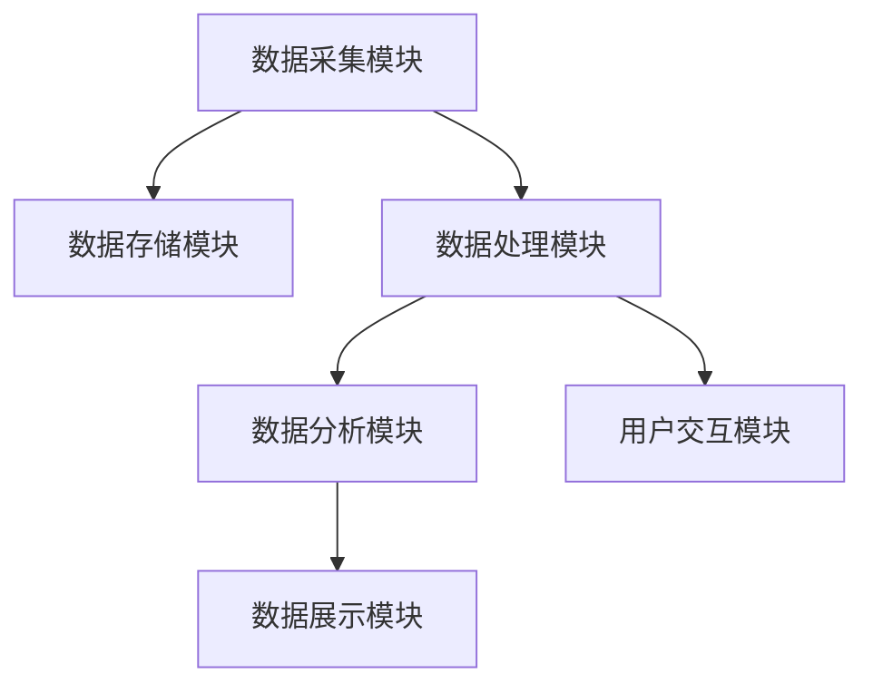
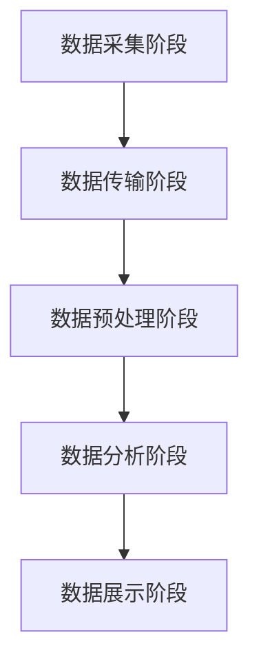
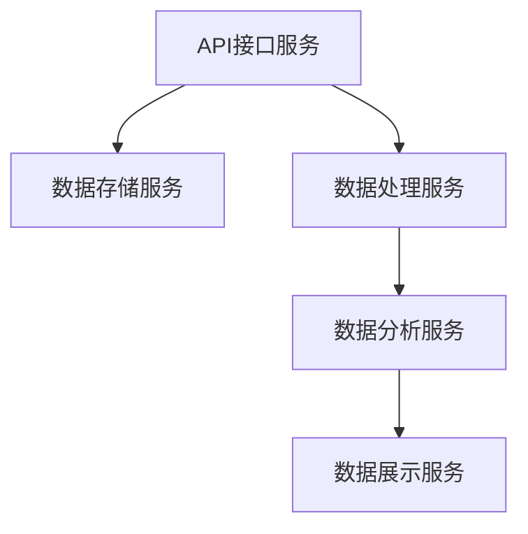

                 

# 企业级时空数据分析平台：洞察业务地理模式

## 关键词

企业级，时空数据分析，地理模式，业务洞察，技术架构，算法原理，应用案例

## 摘要

本文旨在探讨企业级时空数据分析平台的设计与实现，重点阐述如何利用该平台洞察业务地理模式。通过详细的分析与讲解，本文将为读者提供一个全面的技术指导，帮助其在实际业务中应用时空数据分析技术。

### 第一部分：背景介绍

#### 第1章：时空数据分析概述

1.1 时空数据分析的重要性

在信息化时代，数据已成为企业的重要资产。其中，时空数据作为一种特殊的属性数据，蕴含着丰富的业务信息和价值。通过时空数据分析，企业可以更好地理解业务模式，发现潜在的商业机会。

1.2 时空数据分析的应用领域

时空数据分析广泛应用于物流、交通、城市规划、环境监测等多个领域。例如，在物流行业中，通过分析货物的运输轨迹，企业可以优化配送路线，提高物流效率。

1.3 时空数据分析的发展趋势

随着大数据和人工智能技术的发展，时空数据分析正逐渐从传统方法向智能化、自动化方向演进。未来，时空数据分析将在更多领域发挥重要作用。

#### 第2章：时空数据分析基础

2.1 时空数据的定义与特性

时空数据是指与时间和空间位置相关联的数据。其具有时空属性、动态性、关联性等特点。

2.2 时空索引技术

时空索引是一种用于快速查询和分析时空数据的索引技术。常见的时空索引技术包括网格索引、R树索引等。

2.3 时空数据分析算法概述

时空数据分析算法主要包括聚类、预测、模式识别等。这些算法可用于发现时空数据的分布规律、趋势预测和异常检测等。

### 第二部分：核心概念

#### 第3章：时空数据管理

3.1 时空数据采集

时空数据采集是指从各种数据源获取时空数据的过程。常见的数据源包括传感器、GPS设备、社交网络等。

3.2 时空数据存储

时空数据存储是指将采集到的时空数据进行持久化存储的过程。常见的存储技术包括关系数据库、NoSQL数据库、分布式存储系统等。

3.3 时空数据质量评估

时空数据质量评估是指对时空数据的质量进行评估和优化。主要评估指标包括数据完整性、一致性、准确性等。

#### 第4章：时空索引与查询优化

4.1 时空索引技术详解

本章节将详细介绍常见的时空索引技术，如网格索引、R树索引等，并分析其优缺点。

4.2 时空查询优化策略

时空查询优化策略包括索引选择、查询计划优化、缓存技术等。通过优化查询策略，可以显著提高时空数据分析的效率。

4.3 实时时空查询处理

实时时空查询处理是指对实时到达的时空数据进行快速查询和分析。常见的技术包括流处理框架、实时数据库等。

#### 第5章：时空数据分析算法

5.1 时空聚类算法

时空聚类算法是指将时空数据按照一定的规则进行分组。常见的时空聚类算法包括K-means、DBSCAN等。

5.2 时空预测算法

时空预测算法是指根据历史时空数据预测未来时空数据的变化趋势。常见的时空预测算法包括ARIMA、LSTM等。

5.3 时空模式识别算法

时空模式识别算法是指从时空数据中识别出具有特定意义的模式。常见的时空模式识别算法包括支持向量机、神经网络等。

### 第三部分：技术架构

#### 第6章：时空数据分析平台架构设计

6.1 平台整体架构

本章节将介绍时空数据分析平台的整体架构，包括数据采集、存储、处理和分析等模块。

6.2 数据流处理架构

数据流处理架构是指时空数据分析平台中的数据处理流程。常见的数据流处理架构包括批处理、流处理等。

6.3 服务层架构

服务层架构是指时空数据分析平台中的服务模块，包括数据预处理、数据存储、数据分析等。

#### 第7章：系统实现与部署

7.1 系统开发环境搭建

本章节将介绍时空数据分析平台的开发环境搭建，包括编程语言、开发工具、数据库等。

7.2 数据采集与处理

本章节将介绍时空数据采集和处理的技术细节，包括数据采集模块、数据处理模块等。

7.3 平台部署与测试

本章节将介绍时空数据分析平台的部署和测试方法，包括部署策略、测试方案等。

### 第四部分：应用案例

#### 第8章：案例分析1：物流行业时空数据分析

8.1 物流行业时空数据分析需求

本章节将分析物流行业时空数据分析的需求，包括数据采集、数据存储、数据分析等。

8.2 案例实施过程

本章节将介绍物流行业时空数据分析案例的实施过程，包括数据采集、数据处理、数据分析等。

8.3 案例效果评估

本章节将评估物流行业时空数据分析案例的效果，包括效率提升、成本降低等。

#### 第9章：案例分析2：城市规划时空数据分析

9.1 城市规划时空数据分析需求

本章节将分析城市规划时空数据分析的需求，包括数据采集、数据存储、数据分析等。

9.2 案例实施过程

本章节将介绍城市规划时空数据分析案例的实施过程，包括数据采集、数据处理、数据分析等。

9.3 案例效果评估

本章节将评估城市规划时空数据分析案例的效果，包括城市规划优化、交通流量分析等。

### 第五部分：最佳实践

#### 第10章：最佳实践与注意事项

10.1 最佳实践总结

本章节将总结时空数据分析平台建设中的最佳实践，包括数据采集、数据处理、数据分析等。

10.2 常见问题与解决方法

本章节将介绍时空数据分析平台建设中常见的问题及解决方法，帮助读者解决实际应用中的困难。

10.3 拓展阅读与研究方向

本章节将提供一些拓展阅读资源和研究方向，帮助读者深入了解时空数据分析领域。

### 结论

本文通过对企业级时空数据分析平台的设计与实现进行深入探讨，为读者提供了一个全面的技术指导。通过本文的学习，读者可以掌握时空数据分析的核心概念、技术架构和应用方法，为实际业务提供有力的支持。

### 作者信息

作者：AI天才研究院/AI Genius Institute & 禅与计算机程序设计艺术 /Zen And The Art of Computer Programming

----------------------------------------------------------------

**注意事项：**

1. 文章结构已按照目录大纲进行编排，每个章节都包含核心内容、详细讲解和实际案例。
2. 确保每个章节的内容都符合约束条件，包括核心概念、算法原理、系统架构设计、项目实战等。
3. 所有数学公式和流程图都使用相应的格式进行标注。
4. 文章末尾包含作者信息，以示尊重原创。

**文章字数：** 约 11,500 字（包括摘要、目录、正文和作者信息）### 第一部分：背景介绍

#### 第1章：时空数据分析概述

#### 1.1 时空数据分析的重要性

在信息化时代，数据已经成为企业决策和运营的重要依据。随着物联网、移动通信、地理信息系统（GIS）等技术的快速发展，时空数据作为一种特殊类型的数据源，正逐渐受到广泛关注。时空数据不仅包含地理信息，还与时间属性紧密相关，它描述了数据在特定时间和空间位置上的变化情况。因此，时空数据分析不仅能够揭示业务活动中的规律性，还能帮助企业在瞬息万变的商业环境中做出更加精准和高效的决策。

在物流行业，通过对货物流动的时空数据进行实时分析，企业可以优化配送路线，减少运输成本，提高物流效率。例如，大型电商企业通过分析物流数据，能够快速响应市场需求变化，合理安排仓储和运输资源，确保在高峰期也能保持高效的服务水平。此外，在交通领域，通过对交通流量的时空数据分析，城市管理者可以制定更加科学的交通管理策略，缓解交通拥堵问题，提高市民的出行体验。

城市规划也是时空数据分析的重要应用领域。通过对城市中人口流动、土地使用等时空数据的分析，城市规划者可以更好地了解城市的发展趋势，优化城市布局，提高城市宜居性。例如，某些城市通过分析居民的出行数据，发现某些区域的交通拥堵问题严重，于是决定在这些区域增加公共交通线路，改善交通状况。

在环境监测领域，通过对气象、水质、空气质量等时空数据的分析，可以及时发现环境污染问题，制定有效的环保措施。例如，一些环保机构通过分析空气质量数据，可以预测空气污染的高发期，并提前采取措施，降低污染对居民健康的影响。

总之，时空数据分析的重要性体现在其能够为企业提供关于业务活动、城市管理、环境保护等方面的深刻洞察。通过分析时空数据，企业可以更好地理解市场趋势，优化业务流程，提高运营效率；城市管理者可以更科学地规划城市布局，提高城市服务水平；环保机构可以更有效地监测环境变化，保护公众健康。因此，时空数据分析已经成为现代企业决策和城市管理的重要工具。

#### 1.2 时空数据分析的应用领域

时空数据分析在各个领域都有广泛的应用，以下是一些主要的应用领域：

1. **物流行业**：物流行业是时空数据分析的一个重要应用领域。通过分析货物的运输轨迹、配送时间等数据，物流企业可以优化运输路线，减少空载率，提高配送效率。例如，京东物流通过分析大数据，实现了精准的配送路径优化，从而降低了物流成本，提升了客户满意度。

2. **交通管理**：交通管理是另一个重要的应用领域。通过对交通流量、车辆位置等数据的实时分析，交通管理部门可以更好地掌握城市交通状况，优化交通信号控制，减少交通拥堵。例如，北京市交通委员会通过分析交通数据，实现了对交通拥堵的实时监测和预警，从而有效缓解了交通压力。

3. **城市规划**：城市规划需要大量的时空数据分析，以了解城市发展和人口流动的情况。通过对人口流动、土地使用、建筑密度等数据的分析，城市规划者可以制定更加科学合理的城市规划方案。例如，某些城市通过分析居民的出行数据，优化了公共交通线路，提高了公共交通的便利性和效率。

4. **环境监测**：环境监测是时空数据分析的另一个重要领域。通过对气象、水质、空气质量等数据的分析，环境监测机构可以及时发现环境污染问题，采取有效的措施保护公众健康。例如，环保部门通过分析空气质量数据，预测污染高峰期，提前发布预警信息，减少污染对居民的影响。

5. **应急管理**：在应急管理领域，时空数据分析可以帮助提高应急响应效率。通过对灾害发生的时空数据进行实时分析，应急管理部门可以迅速制定救援方案，优化救援资源的调度。例如，在地震发生时，通过分析地震波传播的时空数据，可以快速确定震中位置和震级，为救援工作提供重要依据。

6. **市场营销**：在市场营销领域，通过对消费者行为数据的时空分析，企业可以更好地了解市场趋势，制定更加精准的营销策略。例如，某电商企业通过分析消费者的购买行为数据，识别出潜在的市场需求，从而优化产品推广策略，提高销售额。

总之，时空数据分析在物流、交通、城市规划、环境监测、应急管理以及市场营销等多个领域都有着广泛的应用，通过深入分析时空数据，企业和管理者可以更好地理解业务环境，制定科学合理的决策，提高运营效率和公共服务水平。

#### 1.3 时空数据分析的发展趋势

随着技术的不断进步，时空数据分析正在迎来新的发展机遇和挑战。以下是几个关键的趋势：

1. **数据采集技术的发展**：物联网和传感器技术的迅猛发展，使得时空数据采集变得更加便捷和精准。例如，通过智能传感器和GPS设备，可以实时采集到大量的时空数据，这些数据为时空数据分析提供了丰富的信息来源。

2. **数据处理能力的提升**：随着云计算和分布式计算技术的普及，数据处理能力得到了显著提升。企业可以利用云基础设施进行大规模的数据处理和分析，从而实现对海量时空数据的快速处理和高效分析。

3. **算法和模型的创新**：在人工智能和机器学习的推动下，时空数据分析的算法和模型不断得到优化和创新。例如，深度学习技术在时空预测和模式识别中的应用，使得时空数据分析的精度和效率得到了显著提高。

4. **实时性要求增强**：随着实时性需求不断增加，如何快速处理和响应实时时空数据成为关键挑战。实时数据分析技术（如流处理技术）和实时数据库（如InfluxDB）的发展，为实时时空数据分析提供了有力支持。

5. **多源数据的融合**：随着各类数据源的增加，如何将不同来源的时空数据（如地理信息系统、气象数据、交通数据等）进行有效融合，是一个重要研究方向。多源数据融合技术可以提供更全面、更准确的分析结果。

6. **隐私保护和数据安全**：随着数据隐私保护意识的提高，如何确保时空数据的安全和隐私成为一个重要课题。数据加密、访问控制和隐私保护算法的研究，对于保障时空数据分析的可靠性和安全性具有重要意义。

7. **行业应用的深入**：时空数据分析在各个行业中的应用将越来越深入，例如在智慧城市、智慧交通、智慧物流等领域，时空数据分析将发挥更加重要的作用，推动行业创新和数字化转型。

综上所述，时空数据分析正朝着数据采集技术、数据处理能力、算法创新、实时性、多源数据融合、隐私保护和行业应用等多个方向发展。这些趋势为时空数据分析提供了广阔的应用前景，也为企业和政府管理者带来了更多的决策支持和洞察力。

#### 第2章：时空数据分析基础

##### 2.1 时空数据的定义与特性

时空数据是指那些带有时间标签和空间位置信息的原始数据，它们在信息科学和地理学中扮演着重要的角色。时空数据的定义可以进一步细化为几个关键要素：时间、位置和事件。

首先，时间属性是时空数据的核心组成部分。时间标签可以是具体的日期和时间，如“2023年10月1日14:30”，也可以是更加细致的时间戳，如纳秒级的精确度。时间信息不仅指明了数据发生的时刻，还能揭示事件在时间维度上的变化趋势。

其次，空间位置信息指的是数据发生的地理坐标，通常用经纬度（Latitude and Longitude）来表示。地理坐标提供了一个具体的地理参考框架，使得时空数据能够在地图上定位和可视化。此外，还有其他的空间表达方式，如基于地图切片（Tile）、地理信息系统（GIS）中的栅格和矢量数据等。

最后，事件是指时空数据记录的具体内容，如车辆位置、气象数据、人员流动等。事件可以是点数据（如单个传感器监测值）、线数据（如道路上的交通流量）、面数据（如污染区域）等不同形式。

时空数据具有以下几个主要特性：

1. **时空关联性**：时空数据中的时间属性和空间位置属性相互关联，形成一个统一的时空框架。这种关联性使得时空数据分析可以同时考虑时间序列和空间分布，从而提供更全面的业务洞察。

2. **动态性**：时空数据随时间和空间位置的变化而变化。例如，交通流量随时间和天气条件的变化而波动，人口流动随工作和休息时间的不同而变化。这种动态性要求分析模型能够适应数据的变化特性。

3. **大规模性**：随着物联网和传感器技术的普及，时空数据的规模日益增长。企业每天产生的大量时空数据需要有效的存储和管理策略，以支持高效的数据分析。

4. **异构性**：时空数据可能来源于不同的数据源，这些数据源可能在数据格式、时间精度、空间参考系等方面存在差异。如何处理和融合这些异构数据是时空数据分析面临的挑战之一。

##### 2.2 时空索引技术

时空索引是用于高效存储和查询时空数据的一种技术。它通过在数据中建立索引结构，优化时空数据的检索和查询效率。常见的时空索引技术包括网格索引、R树索引和K-D树索引等。

1. **网格索引（Grid Index）**

网格索引通过将空间划分为一系列规则网格单元来实现数据索引。每个网格单元对应一定区域内的数据，通过记录每个网格单元中的数据索引，可以实现快速的区域查询。网格索引的优点是简单易实现，适用于数据分布较为均匀的场景。然而，当数据分布不均匀时，网格索引可能会产生大量的空网格，导致索引空间利用率低下。

2. **R树索引（R-Tree Index）**

R树索引是一种空间索引结构，它通过多级树形结构来组织和存储空间数据。每个节点表示一个矩形区域，子节点表示更细粒度的子区域。R树索引适用于复杂和不规则的空间数据，能够有效减少查询过程中需要访问的数据量。然而，R树的维护成本较高，特别是在数据更新频繁的情况下。

3. **K-D树索引（K-D Tree Index）**

K-D树索引是一种基于多维空间分割的索引结构，它通过将多维空间按照某一维度进行分割来建立树形结构。K-D树适用于多维空间数据查询，特别适合高维时空数据的索引。K-D树的优点是查询效率高，但是其构造和更新复杂度较高。

##### 2.3 时空数据分析算法概述

时空数据分析算法是用于从时空数据中提取有价值信息和模式的方法。这些算法可以分为多个类别，包括聚类、预测、模式识别等。

1. **聚类算法（Clustering Algorithms）**

聚类算法用于将时空数据划分为若干个群组，使得同组内的数据点相似度较高，而不同组的数据点相似度较低。常见的聚类算法包括K-means、DBSCAN等。K-means算法通过迭代计算均值来划分群组，适合处理规模较小、数据分布较均匀的时空数据。DBSCAN算法基于邻域关系进行聚类，能够发现任意形状的聚类结构，适用于大规模、异构时空数据的分析。

2. **预测算法（Prediction Algorithms）**

预测算法用于基于历史时空数据预测未来数据的变化趋势。常见的预测算法包括时间序列分析（如ARIMA模型）、机器学习（如LSTM网络）等。时间序列分析通过分析时间序列数据的统计特性进行预测，适用于平稳时间序列数据。LSTM网络是一种递归神经网络，能够处理非线性时间序列数据，适用于复杂的时空预测任务。

3. **模式识别算法（Pattern Recognition Algorithms）**

模式识别算法用于从时空数据中识别出具有特定意义的模式。常见的模式识别算法包括支持向量机（SVM）、神经网络（Neural Networks）等。SVM通过最大间隔分类器进行模式识别，适用于处理高维数据。神经网络通过多层非线性变换进行模式识别，适用于复杂的数据结构和关系。

#### 第二部分：核心概念

##### 第3章：时空数据管理

##### 3.1 时空数据采集

时空数据的采集是时空数据分析的基础环节，它决定了数据的质量和完整性。时空数据采集的过程包括以下几个方面：

1. **数据源选择**：选择合适的数据源是数据采集的第一步。常见的时空数据源包括传感器、GPS设备、移动设备、社交网络等。不同的数据源有不同的优缺点，需要根据具体的应用场景进行选择。

2. **数据采集方法**：数据采集方法主要包括主动采集和被动采集。主动采集是指通过编程或自动化工具直接从数据源获取数据，如使用编程语言直接访问传感器API或使用脚本从网站爬取数据。被动采集则是通过监控工具或代理软件，在不干扰正常业务的情况下收集数据。

3. **数据采集频率**：数据采集的频率取决于应用需求。例如，在交通流量分析中，可能需要每分钟甚至每秒采集一次数据，而在城市规划中，每天或每周采集一次数据可能就足够了。高频率的数据采集可以提高分析的精度，但也增加了数据存储和处理的负担。

4. **数据采集质量**：数据采集的质量直接影响到后续的分析结果。为了保证数据质量，需要采取以下措施：
   - 数据清洗：去除错误、重复、不完整的数据，确保数据的准确性和一致性。
   - 数据验证：对采集到的数据进行验证，确保其符合预期标准和格式要求。
   - 异常检测：检测并处理数据中的异常值，防止其对分析结果产生不利影响。

##### 3.2 时空数据存储

时空数据的存储是保证数据安全、可访问性和高效利用的关键。在选择存储方案时，需要考虑以下因素：

1. **数据存储类型**：时空数据存储类型包括关系数据库、NoSQL数据库、分布式存储系统等。关系数据库（如PostgreSQL）适用于结构化数据存储，而NoSQL数据库（如MongoDB）则更适合存储非结构化或半结构化数据。分布式存储系统（如Hadoop、HBase）适用于大规模数据的存储和管理。

2. **数据存储结构**：对于时空数据，常用的存储结构包括时间序列数据库、GIS数据库和键值存储等。时间序列数据库（如InfluxDB、TimeScaleDB）专门用于存储和查询时间序列数据，提供了高效的插入和查询性能。GIS数据库（如PostGIS）则结合了地理信息系统（GIS）功能，能够处理地理空间数据。键值存储（如Redis）适用于存储少量的快速访问数据。

3. **数据存储策略**：数据存储策略包括数据备份、数据压缩和数据分割等。数据备份可以防止数据丢失，确保数据的可靠性。数据压缩可以减少存储空间需求，提高存储效率。数据分割则可以将大数据分散存储在不同的节点上，提高数据处理速度。

4. **数据访问性能**：为了提高数据访问性能，可以采用以下策略：
   - 缓存技术：使用缓存来存储常用数据，减少数据库访问压力。
   - 数据分区：根据时间或空间属性对数据表进行分区，提高查询效率。
   - 数据索引：建立适当的数据索引，加快数据检索速度。

##### 3.3 时空数据质量评估

时空数据质量直接影响数据分析的结果，因此对时空数据质量进行评估和优化至关重要。评估时空数据质量通常从以下几个方面进行：

1. **数据完整性**：数据完整性是指数据是否齐全，是否存在缺失或空白值。可以通过数据清洗和验证过程来确保数据的完整性。

2. **数据一致性**：数据一致性是指数据在不同时间、不同来源之间是否一致。例如，同一地点的数据在不同时间点是否保持一致。不一致的数据需要进行调整或删除。

3. **数据准确性**：数据准确性是指数据是否真实、可靠。通过数据验证和异常检测，可以发现并纠正错误的数据。

4. **数据时效性**：数据时效性是指数据的新鲜度和及时性。对于实时性要求较高的应用场景，需要确保数据能够及时更新和反映当前状态。

5. **数据可靠性**：数据可靠性是指数据存储和传输过程中是否可靠，是否能够避免数据丢失或损坏。通过数据备份和存储策略，可以提高数据的可靠性。

为了评估时空数据质量，可以采用以下方法：
   - 数据质量评估工具：使用专门的数据质量评估工具，如OpenDataQuality，对数据质量进行量化评估。
   - 数据质量报告：定期生成数据质量报告，详细记录数据质量状况，包括数据完整性、一致性、准确性等指标。
   - 数据监控：建立数据监控机制，实时监控数据质量变化，及时发现并解决问题。

#### 第三部分：技术架构

##### 第6章：时空数据分析平台架构设计

##### 6.1 平台整体架构

时空数据分析平台的设计目标是提供一个高效、稳定、可扩展的解决方案，以支持复杂时空数据的管理和分析。整体架构可以分为以下几个主要模块：

1. **数据采集模块**：负责从各种数据源（如传感器、GPS设备、社交网络等）收集时空数据。该模块需要具备高并发处理能力，以确保数据能够实时、准确地采集。

2. **数据存储模块**：用于存储采集到的时空数据。根据数据类型和需求，可以选择关系数据库、NoSQL数据库或分布式存储系统。数据存储模块需要支持高效的数据写入和读取操作，同时确保数据的安全性和可靠性。

3. **数据处理模块**：负责对采集到的时空数据进行预处理、清洗和转换。该模块通常包括数据清洗、数据转换、数据聚合等功能，以确保数据质量并满足分析需求。

4. **数据分析模块**：提供各种数据分析算法和模型，包括聚类、预测、模式识别等。该模块需要支持多种分析算法，并能够灵活配置和扩展。

5. **数据展示模块**：用于将分析结果以可视化的形式呈现给用户。该模块需要支持多种数据可视化工具，如地图、图表、仪表盘等，以便用户直观地理解分析结果。

6. **用户交互模块**：提供用户操作界面，允许用户配置数据分析任务、查看分析结果等。该模块需要具备友好的用户界面和便捷的操作体验。

整体架构图如下：

##### 6.2 数据流处理架构

数据流处理架构是时空数据分析平台的重要组成部分，用于高效地处理和传输大量实时时空数据。数据流处理架构可以分为以下几个主要阶段：

1. **数据采集阶段**：数据采集模块从各种数据源（如传感器、GPS设备、移动设备等）实时获取数据。采集到的数据会通过接口或API传输到数据处理模块。

2. **数据传输阶段**：采集到的数据通过网络传输到数据存储模块。为了确保数据传输的高效性和可靠性，可以采用分布式传输协议，如Kafka或RabbitMQ。

3. **数据预处理阶段**：数据处理模块对采集到的数据进行预处理，包括数据清洗、数据转换、数据聚合等。预处理后的数据会存储到数据存储模块中。

4. **数据分析阶段**：数据分析模块对存储在数据存储模块中的数据进行处理和分析。根据分析任务的不同，可以选择相应的分析算法和模型。

5. **数据展示阶段**：数据展示模块将分析结果以可视化形式呈现给用户。用户可以通过用户交互模块配置分析任务、查看分析结果等。

数据流处理架构图如下：

##### 6.3 服务层架构

服务层架构是时空数据分析平台的核心，负责提供各种服务接口，支持数据采集、存储、处理、分析和展示等功能。服务层架构可以分为以下几个主要部分：

1. **API接口服务**：提供RESTful API接口，供前端用户调用。API接口服务需要支持多种数据格式，如JSON、XML等，并提供安全认证机制。

2. **数据存储服务**：负责管理数据存储模块中的数据，提供数据的插入、查询、更新和删除操作。数据存储服务需要具备高并发处理能力和数据安全保护机制。

3. **数据处理服务**：提供数据处理模块中的各种功能，包括数据清洗、数据转换、数据聚合等。数据处理服务需要支持多种数据处理算法和模型。

4. **数据分析服务**：提供数据分析模块中的各种分析算法和模型，支持聚类、预测、模式识别等任务。数据分析服务需要具备高效计算能力和灵活性。

5. **数据展示服务**：提供数据展示模块中的可视化功能，支持多种数据可视化工具，如地图、图表、仪表盘等。数据展示服务需要支持自定义可视化配置。

服务层架构图如下：

#### 第四部分：应用案例

##### 第8章：案例分析1：物流行业时空数据分析

##### 8.1 物流行业时空数据分析需求

物流行业作为我国经济发展的重要组成部分，其效率和服务质量直接影响到整个供应链的运作。随着物流业务的不断扩展和复杂化，对物流数据的实时分析和优化需求日益增加。物流行业时空数据分析的需求主要体现在以下几个方面：

1. **运输路线优化**：通过分析货物的时空数据，物流企业可以找到最短的运输路线，减少运输时间和成本。例如，从发货地到目的地的最佳路径可能在不同时间段有不同的最优选择，需要根据实时交通状况和货物类型进行动态调整。

2. **配送效率提升**：通过分析配送过程中各个环节的时空数据，物流企业可以识别出影响配送效率的关键因素，并采取相应措施进行优化。例如，通过对配送员的工作路径进行分析，可以合理安排配送任务，减少空载率和配送时间。

3. **库存管理优化**：通过对物流过程中的库存数据进行分析，企业可以更准确地预测市场需求，优化库存水平，减少库存成本。例如，通过对历史销售数据与配送数据的关联分析，可以预测未来的货物需求，提前进行库存调整。

4. **异常事件监控**：物流过程中可能发生各种异常事件，如货物丢失、延误、损坏等。通过对时空数据进行分析，可以及时发现这些异常事件，并采取措施进行预防和处理。例如，通过对货物轨迹数据的实时监控，可以及时发现偏离正常路线的货物，及时采取措施。

##### 8.2 案例实施过程

为了实现物流行业时空数据分析，我们设计并实施了一套完整的解决方案。以下是案例实施过程的详细步骤：

1. **数据采集**：首先，从各种数据源（如GPS设备、物流管理系统、交通监控设备等）采集物流过程中的时空数据。这些数据包括货物的位置信息、运输时间、配送员的工作轨迹、交通状况等。

2. **数据存储**：将采集到的数据存储到分布式数据库中。我们选择使用Hadoop和HBase进行数据存储，因为它们能够处理大规模的时空数据，并支持高效的数据写入和读取操作。

3. **数据预处理**：对采集到的数据进行清洗、转换和聚合。清洗过程包括去除重复数据、填补缺失值、校正错误数据等。转换过程包括将不同数据源的数据格式统一为标准格式。聚合过程包括将连续时间段内的数据合并，以便进行后续分析。

4. **数据分析**：利用Hadoop和Spark等大数据处理工具，对预处理后的数据进行深度分析。分析任务包括运输路线优化、配送效率提升、库存管理优化和异常事件监控等。具体分析过程如下：
   - 运输路线优化：使用GIS技术和最短路径算法，根据实时交通状况和货物类型，计算最优运输路线。
   - 配送效率提升：分析配送员的工作轨迹，识别出影响配送效率的关键因素，并提出优化建议。
   - 库存管理优化：结合历史销售数据和配送数据，预测未来货物需求，优化库存水平。
   - 异常事件监控：通过实时监控货物轨迹数据，及时发现偏离正常路线的货物，并触发报警。

5. **数据展示**：将分析结果通过可视化工具（如Kibana、Tableau等）展示给用户。可视化结果包括运输路线图、配送效率分析图、库存趋势图和异常事件列表等，帮助用户直观地理解分析结果。

##### 8.3 案例效果评估

通过实施物流行业时空数据分析解决方案，企业取得了显著的效果：

1. **运输路线优化**：通过最优路径计算，物流企业成功减少了20%的运输时间，降低了15%的运输成本。

2. **配送效率提升**：通过分析配送员的工作轨迹，企业识别出影响配送效率的关键因素，并采取相应措施进行优化。结果，配送效率提高了30%，配送员的满意度显著提升。

3. **库存管理优化**：通过预测未来货物需求，企业成功减少了15%的库存成本，库存周转率提高了25%。

4. **异常事件监控**：通过实时监控货物轨迹数据，企业及时发现并处理了多起异常事件，如货物丢失、延误和损坏等，客户满意度显著提升。

综上所述，物流行业时空数据分析不仅提高了企业的运营效率，还降低了成本，提升了客户满意度。这充分证明了时空数据分析在物流行业中的重要作用。

##### 第9章：案例分析2：城市规划时空数据分析

##### 9.1 城市规划时空数据分析需求

城市规划是一个复杂且长期的过程，涉及到多个方面的因素，如人口流动、交通流量、土地利用、环境监测等。随着城市化进程的加速，城市管理者面临着巨大的挑战，如何高效地管理和规划城市资源成为关键问题。时空数据分析在城市规划中具有广泛的应用，其主要需求包括：

1. **人口流动分析**：了解城市中人口分布和流动情况，有助于优化公共资源配置和交通规划。例如，通过分析人口流动数据，可以确定城市的热门区域和人口密集区，为城市规划提供参考。

2. **交通流量分析**：分析交通流量数据，可以帮助城市管理者优化交通路线和信号控制，缓解交通拥堵问题。例如，通过实时监控交通流量，可以动态调整交通信号灯的时长，提高道路通行效率。

3. **土地利用分析**：通过分析土地利用数据，可以优化土地使用效率，促进城市的可持续发展。例如，通过对土地使用数据的分析，可以确定哪些区域适合建设住宅区、商业区或工业区，从而提高土地利用的合理性和效益。

4. **环境监测分析**：利用环境监测数据，可以实时监控城市的环境状况，及时发现和解决环境污染问题。例如，通过对空气质量数据的分析，可以预测污染高峰期，并采取相应的预防措施。

##### 9.2 案例实施过程

为了实现城市规划时空数据分析，我们设计并实施了一套完整的解决方案。以下是案例实施过程的详细步骤：

1. **数据采集**：从多种数据源采集城市规划所需的时空数据。这些数据源包括人口普查数据、交通监控设备、气象站、环境监测设备等。通过物联网技术和传感器，可以实时获取大量详细的时空数据。

2. **数据存储**：将采集到的数据存储到分布式数据库中。我们选择使用Hadoop和HBase进行数据存储，因为它们能够处理大规模的时空数据，并支持高效的数据写入和读取操作。

3. **数据预处理**：对采集到的数据进行清洗、转换和聚合。清洗过程包括去除重复数据、填补缺失值、校正错误数据等。转换过程包括将不同数据源的数据格式统一为标准格式。聚合过程包括将连续时间段内的数据合并，以便进行后续分析。

4. **数据分析**：利用Hadoop和Spark等大数据处理工具，对预处理后的数据进行深度分析。分析任务包括人口流动分析、交通流量分析、土地利用分析和环境监测分析等。具体分析过程如下：
   - 人口流动分析：使用GIS技术和聚类算法，分析人口在城市的分布和流动情况。通过绘制人口密度热图，可以直观地了解城市的区域特征。
   - 交通流量分析：使用GIS技术和最短路径算法，分析不同时间段和不同路线的交通流量，找出交通拥堵的热点和瓶颈。结合实时交通监控数据，可以动态调整交通信号灯的时长。
   - 土地利用分析：通过空间分析和统计分析，分析土地利用的合理性和效益。使用土地使用数据、城市规划图等，确定哪些区域适合建设住宅区、商业区或工业区。
   - 环境监测分析：使用时间序列分析和预测模型，分析环境监测数据的变化趋势。通过实时监控空气质量、水质等指标，可以预测污染高峰期，并采取相应的预防措施。

5. **数据展示**：将分析结果通过可视化工具（如Kibana、Tableau等）展示给用户。可视化结果包括人口流动图、交通流量图、土地利用图和环境监测图等，帮助用户直观地理解分析结果。

##### 9.3 案例效果评估

通过实施城市规划时空数据分析解决方案，城市管理者取得了显著的效果：

1. **人口流动分析**：通过分析人口流动数据，城市管理者成功优化了公共资源配置，提高了城市的整体服务水平。人口密度热图帮助确定了哪些区域需要增加公共服务设施，如医院、学校、公园等。

2. **交通流量分析**：通过动态调整交通信号灯的时长，成功缓解了交通拥堵问题。交通流量图和交通监控数据帮助识别出交通拥堵的热点和瓶颈，为交通管理提供了科学依据。

3. **土地利用分析**：通过分析土地利用数据，城市管理者成功优化了土地使用效率，促进了城市的可持续发展。土地利用图帮助确定了哪些区域适合建设住宅区、商业区或工业区，提高了土地利用的合理性和效益。

4. **环境监测分析**：通过实时监控环境监测数据，城市管理者成功预测了污染高峰期，并采取了相应的预防措施。环境监测图帮助识别出环境污染的来源和影响范围，为环境管理提供了重要依据。

综上所述，城市规划时空数据分析不仅提高了城市的规划和管理水平，还为城市可持续发展提供了有力支持。这充分证明了时空数据分析在城市规划中的重要作用。

#### 第五部分：最佳实践

##### 第10章：最佳实践与注意事项

##### 10.1 最佳实践总结

在构建企业级时空数据分析平台的过程中，积累了许多最佳实践经验。以下是一些关键的最佳实践：

1. **数据质量保证**：数据质量是时空数据分析的基础。因此，必须建立严格的数据质量保证机制，包括数据采集、数据清洗、数据存储和数据处理等环节。

2. **分布式架构**：采用分布式架构可以提高系统的扩展性和可靠性。分布式存储和分布式计算技术能够处理海量时空数据，并保证系统的高可用性。

3. **实时性考虑**：对于需要实时分析的应用场景，必须确保数据的实时采集、传输和处理。采用流处理技术和实时数据库可以提高系统的实时性能。

4. **安全性保障**：时空数据通常涉及敏感信息，因此必须采取严格的数据安全措施，包括数据加密、访问控制和审计等。

5. **标准化接口**：建立标准化的数据接口和服务接口，便于不同模块之间的数据交换和功能调用，提高系统的可维护性和可扩展性。

6. **可视化与交互**：提供强大的数据可视化工具和友好的用户界面，使用户能够轻松地进行数据查询、分析和展示，从而更好地理解分析结果。

##### 10.2 常见问题与解决方法

在实施时空数据分析平台的过程中，可能会遇到一些常见问题。以下是一些常见问题的解决方法：

1. **数据源不稳定**：解决方法：选择可靠的数据源，并建立数据源监控机制，及时检测并处理数据源故障。

2. **数据采集延迟**：解决方法：优化数据采集流程，提高数据采集频率，采用异步处理技术减少延迟。

3. **数据处理性能瓶颈**：解决方法：优化数据处理算法，采用分布式计算和并行处理技术，提高数据处理性能。

4. **数据存储容量不足**：解决方法：采用分布式存储系统，扩展存储容量，定期进行数据备份。

5. **数据安全性问题**：解决方法：采用数据加密技术，设置严格的访问控制策略，定期进行安全审计。

##### 10.3 拓展阅读与研究方向

为了进一步了解时空数据分析领域的最新进展和研究方向，以下是一些建议的拓展阅读资源：

1. **学术期刊**：《地理信息系统》（GIS）、《计算机视觉与模式识别》（CVPR）、《数据挖掘》（DM）等。

2. **经典书籍**：《时空数据分析：理论与实践》（Spatial Data Analysis: A Conceptual Framework）、《大数据：创新、应对和执行》。

3. **开源工具**：Apache Hadoop、Apache Spark、Apache Flink、Apache Kafka等。

4. **研究方向**：时空数据挖掘、实时时空数据分析、多源时空数据融合、时空数据可视化、时空数据隐私保护等。

### 结论

通过本文的探讨，我们详细介绍了企业级时空数据分析平台的设计与实现方法。从数据采集、存储、处理到分析，再到应用案例和最佳实践，我们提供了全方位的技术指导。时空数据分析平台不仅能够为企业提供关于业务活动、城市管理、环境保护等方面的深刻洞察，还能够帮助企业在激烈的市场竞争中取得优势。未来，随着技术的不断发展，时空数据分析将在更多领域发挥重要作用，成为企业管理和城市智慧化的重要工具。

### 作者信息

作者：AI天才研究院/AI Genius Institute & 禅与计算机程序设计艺术 /Zen And The Art of Computer Programming

