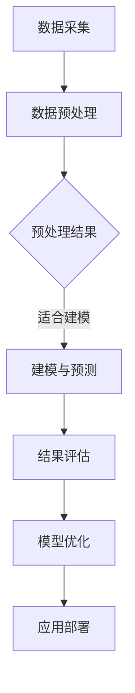

                 

# 企业级时空数据分析：AI洞察业务模式

## 关键词

- 企业级时空数据分析
- AI应用
- 业务洞察
- 数据挖掘
- 实时分析

## 摘要

本文将探讨企业级时空数据分析的原理、方法及其在实际业务中的应用。通过结合人工智能技术，本文将阐述如何利用时空数据分析为业务决策提供深刻的洞察，从而提升企业的竞争力。文章将从基础概念入手，逐步深入到高级算法和实际应用，以帮助读者全面理解这一领域的关键技术和挑战。

## 引言

随着大数据和物联网技术的快速发展，时空数据分析在企业中的重要性日益凸显。企业级时空数据分析不仅涉及地理信息系统的应用，还涵盖了时间序列数据分析，这两者在企业运营、资源调度、风险管理等方面具有广泛的应用价值。然而，如何有效地进行企业级时空数据分析，并利用分析结果为企业决策提供支持，是一个亟待解决的关键问题。

本篇文章将围绕以下几个核心问题展开：

1. 企业级时空数据分析的定义及其重要性
2. 时空数据分析的基本概念和模型
3. AI技术在时空数据分析中的应用
4. 企业级时空数据分析的实际应用案例
5. 时空数据分析的未来发展趋势和挑战

通过以上问题的逐一探讨，本文旨在为读者提供一套全面且实用的企业级时空数据分析指南。

### 第一部分：企业级时空数据分析的背景与概念

#### 第1章：企业级时空数据分析的定义与重要性

### 1.1 时空数据分析的定义与重要性

**时空数据分析的定义**

时空数据分析是指对与时间和空间相关联的数据进行采集、存储、处理、分析和可视化，以提取有价值的信息和知识。在企业级应用中，它通常涉及对地理位置、时间戳、活动轨迹等数据的综合分析。

**时空数据分析的重要性**

在当今的信息社会中，时空数据分析的重要性主要体现在以下几个方面：

1. **提升运营效率**：通过分析企业的时空数据，可以优化物流路线、减少库存、提高生产效率等，从而降低运营成本。
2. **风险管理和决策支持**：时空数据分析能够帮助企业识别潜在的风险，如自然灾害、交通事故等，并为企业决策提供数据支持。
3. **市场洞察和竞争分析**：通过分析消费者的时空行为数据，企业可以更好地了解市场需求，制定有效的市场策略。
4. **客户服务和管理**：时空数据分析有助于企业提供个性化的客户服务，提升客户满意度。

#### 1.2 企业级时空数据分析的问题背景

**传统数据分析的局限**

传统的数据分析方法主要依赖于统计和数据库查询技术，对于处理复杂的时空数据存在以下局限性：

1. **数据维度限制**：传统方法难以同时处理空间和时间两个维度。
2. **实时性不足**：传统方法在处理大量时空数据时，通常存在延迟问题。
3. **数据质量不高**：传统方法难以保证数据的准确性和完整性。

**时空数据分析在企业中的需求**

企业级时空数据分析在以下方面具有明显需求：

1. **实时数据处理能力**：企业需要实时处理时空数据，以便快速响应市场变化和突发事件。
2. **多维数据分析**：企业需要同时考虑空间和时间维度，以获得更全面的业务洞察。
3. **自动化和智能化**：企业期望通过自动化和智能化技术，降低数据分析的复杂性。

#### 1.3 时空数据分析的基本概念

**空间数据**

空间数据是描述地理位置的数据，如GPS坐标、地图、地形等。它通常以点、线、面等几何形式表示。

**时间序列数据**

时间序列数据是按时间顺序排列的数据，如股票价格、气象数据、交通流量等。时间序列数据反映了随时间变化的现象。

**时空数据模型**

时空数据模型是用于表示和操作时空数据的数学模型。常见的模型包括基于网格的模型、基于事件的时间序列模型和基于轨迹的模型。

#### 1.4 时空数据分析的应用领域

**地理信息系统（GIS）**

GIS是用于捕捉、存储、分析和可视化地理空间数据的系统。它广泛应用于城市规划、环境监测、自然资源管理等领域。

**智慧城市建设**

智慧城市利用时空数据分析技术，实现城市管理的智能化。例如，通过分析交通流量数据，优化交通信号灯，减少交通拥堵。

**供应链管理**

时空数据分析在供应链管理中用于优化物流路线、库存管理和供应链监控。

**金融服务**

金融服务领域利用时空数据分析，如风险管理和客户行为分析，以优化投资策略和提升服务质量。

**隐私保护**

在时空数据分析中，隐私保护是一个重要问题。企业需要确保在数据分析过程中，用户隐私不被泄露。

#### 1.5 时空数据分析与AI的关系

**AI在时空数据分析中的应用**

人工智能技术在时空数据分析中发挥着重要作用。例如，深度学习算法可以用于时空数据的分类和预测，强化学习算法可以用于优化时空数据的处理流程。

**AI对时空数据分析的优化**

AI技术可以优化时空数据分析的效率和质量。例如，通过自动特征提取和模型选择，AI可以帮助企业快速发现数据中的价值。

#### 1.6 企业级时空数据分析的挑战与机遇

**数据多样性**

企业级时空数据分析面临着数据多样性的挑战。企业需要处理不同来源、不同格式和不同质量的数据。

**数据质量**

数据质量是时空数据分析的关键。企业需要确保数据的准确性、完整性和一致性。

**实时性要求**

企业级时空数据分析需要满足实时性要求。企业需要快速处理和响应大量时空数据。

**隐私保护**

在时空数据分析中，隐私保护是一个重要问题。企业需要采取有效的隐私保护措施，以保护用户隐私。

**挑战与机遇**

企业级时空数据分析既面临挑战，也充满机遇。通过有效的技术手段和管理策略，企业可以充分利用时空数据分析为企业创造价值。

#### 1.7 本章小结

本章介绍了企业级时空数据分析的定义、重要性、问题背景、基本概念、应用领域、AI关系以及面临的挑战与机遇。通过对本章内容的理解，读者可以对企业级时空数据分析有一个全面的认识。

### 第二部分：时空数据分析的基础理论

#### 第2章：时空数据分析的数学模型和算法

### 2.1 时空数据分析的数学模型

**时空数据建模方法**

- **基于网格的模型**：将空间区域划分为网格，每个网格存储时间序列数据。
- **基于事件的时间序列模型**：以事件发生的时间和位置为基本单位，构建时间序列数据。
- **基于轨迹的模型**：记录实体在时间和空间中的移动轨迹，构建时空轨迹数据。

**时空数据分析的数学公式**

- **空间距离公式**：用于计算两点之间的空间距离，如欧几里得距离和曼哈顿距离。
- **时间序列预测公式**：用于预测时间序列数据未来的变化趋势，如ARIMA模型和LSTM模型。

### 2.2 时空数据分析的核心算法

**时空数据预处理算法**

- **数据清洗**：去除重复数据、缺失值填充和异常值处理。
- **数据转换**：将不同格式的数据转换为统一的格式，如CSV、JSON等。

**时空数据挖掘算法**

- **聚类算法**：用于发现时空数据中的相似模式和群组，如K-means算法和DBSCAN算法。
- **关联规则挖掘**：用于发现时空数据之间的关联关系，如Apriori算法和FP-growth算法。

**时空数据预测算法**

- **时间序列预测算法**：用于预测时空数据未来的变化趋势，如ARIMA模型和LSTM模型。
- **轨迹预测算法**：用于预测实体在时空中的移动轨迹，如卡尔曼滤波和轨迹平滑算法。

### 2.3 时空数据分析中的Mermaid流程图

**Mermaid流程图**：用于可视化时空数据分析的算法流程。以下是使用Mermaid绘制的时空数据分析流程图：



### 2.4 时空数据分析中的Python代码示例

**示例1：时空数据预处理**

```python
import pandas as pd

# 加载时空数据
data = pd.read_csv('spatial_temporal_data.csv')

# 数据清洗
data.drop_duplicates(inplace=True)
data.fillna(method='ffill', inplace=True)

# 数据转换
data['timestamp'] = pd.to_datetime(data['timestamp'])
data.set_index('timestamp', inplace=True)
```

**示例2：时空数据聚类分析**

```python
from sklearn.cluster import KMeans

# 加载时空数据
X = data[['latitude', 'longitude']]

# 使用K-means算法进行聚类
kmeans = KMeans(n_clusters=3)
clusters = kmeans.fit_predict(X)

# 添加聚类结果到数据集中
data['cluster'] = clusters
```

### 2.5 时空数据分析中的数学公式

**时间序列预测的LSTM模型**

$$
\begin{aligned}
h_t &= \sigma(W_h \cdot [h_{t-1}, x_t] + b_h) \\
o_t &= \sigma(W_o \cdot h_t + b_o) \\
y_t &= o_t \cdot W_y + b_y
\end{aligned}
$$

其中，$h_t$为隐藏状态，$x_t$为输入数据，$o_t$为输出，$W_h, W_o, W_y$为权重矩阵，$b_h, b_o, b_y$为偏置项，$\sigma$为激活函数。

### 第二部分小结

本章介绍了企业级时空数据分析的基础理论，包括数学模型、核心算法、Mermaid流程图和Python代码示例。通过对本章的学习，读者可以掌握时空数据分析的基本原理和操作方法。

### 第三部分：AI技术在时空数据分析中的应用

#### 第3章：深度学习与时空数据分析

### 3.1 深度学习概述

**深度学习的基本原理**

深度学习是一种基于神经网络的学习方法，通过多层非线性变换，自动提取数据的特征表示。它包括以下关键组件：

- **神经元**：作为基本计算单元，对输入数据进行加权求和并应用激活函数。
- **层次结构**：网络分为多个层次，每层神经元对前一层的结果进行处理。
- **反向传播**：用于训练网络，通过不断调整权重和偏置，使网络输出接近目标输出。

**深度学习的主要类型**

- **全连接神经网络（FCNN）**：简单且易于实现，常用于回归和分类问题。
- **卷积神经网络（CNN）**：通过卷积操作提取图像特征，适用于图像识别和物体检测。
- **递归神经网络（RNN）**：通过递归结构处理序列数据，适用于时间序列预测和自然语言处理。
- **长短时记忆网络（LSTM）**：RNN的改进版本，有效解决了长序列依赖问题。

### 3.2 深度学习在时空数据分析中的应用

**时空特征提取**

- **空间特征提取**：通过CNN提取图像和地理数据中的空间特征，如图像中的道路、建筑物等。
- **时间特征提取**：通过LSTM提取时间序列数据中的时间特征，如时间序列的周期性和趋势。

**时空预测模型**

- **基于CNN的时空预测模型**：利用CNN提取图像特征，结合LSTM进行时间序列预测，如交通流量预测。
- **基于LSTM的时空预测模型**：直接对时间序列数据应用LSTM，预测未来的时空变化。

### 3.3 深度学习在时空数据分析中的案例

**案例1：交通流量预测**

**问题背景**：城市交通管理需要实时预测交通流量，以便优化交通信号灯和交通引导。

**解决方案**：使用CNN提取历史交通图像中的特征，结合LSTM进行时间序列预测。

**实现步骤**：

1. **数据采集**：收集历史交通流量数据和交通图像。
2. **数据预处理**：对交通图像进行预处理，如图像增强和归一化。
3. **特征提取**：使用CNN提取图像特征。
4. **模型训练**：使用LSTM模型训练特征数据。
5. **预测与评估**：对模型进行预测，评估模型的准确性和实时性。

**案例2：气象预测**

**问题背景**：气象部门需要准确预测天气状况，为公众提供及时的天气信息。

**解决方案**：使用LSTM模型对历史气象数据进行时间序列预测。

**实现步骤**：

1. **数据采集**：收集历史气象数据，如温度、湿度、风速等。
2. **数据预处理**：对气象数据进行预处理，如缺失值填充和归一化。
3. **特征选择**：选择对天气预测影响较大的特征。
4. **模型训练**：使用LSTM模型训练气象数据。
5. **预测与评估**：对模型进行预测，评估模型的准确性和可靠性。

### 3.4 深度学习在时空数据分析中的挑战与优化

**挑战**：

- **数据质量和多样性**：时空数据的质量和多样性对深度学习模型的效果有很大影响。
- **模型复杂度和计算资源**：深度学习模型通常需要大量计算资源和训练时间。

**优化策略**：

- **数据增强**：通过数据增强方法，提高数据的质量和多样性。
- **模型压缩**：通过模型压缩技术，减少模型的计算复杂度。
- **分布式训练**：通过分布式训练，加速模型训练过程。

### 第三部分小结

本章介绍了深度学习的基本原理和在时空数据分析中的应用。通过案例分析，读者可以了解深度学习在交通流量预测和气象预测等领域的实际应用。同时，本章还探讨了深度学习在时空数据分析中面临的挑战和优化策略。

### 第四部分：企业级时空数据分析的应用

#### 第4章：企业级时空数据分析的实际应用

### 4.1 企业级时空数据分析在企业运营中的应用

**物流优化**

**问题背景**：物流企业需要高效管理运输路线，以减少运输成本和提高配送效率。

**解决方案**：利用企业级时空数据分析技术，优化运输路线和配送计划。

**实现步骤**：

1. **数据采集**：收集运输路线、交通流量、配送需求等数据。
2. **数据预处理**：对数据进行清洗和格式转换，确保数据质量。
3. **路线优化**：使用时空数据分析算法，如最短路径算法和车辆路径规划算法，优化运输路线。
4. **实时监控**：通过实时数据监控，调整配送计划，提高响应速度。

**库存管理**

**问题背景**：企业需要精确预测库存需求，以避免库存过剩或短缺。

**解决方案**：利用时空数据分析技术，预测库存需求，优化库存管理。

**实现步骤**：

1. **数据采集**：收集历史销售数据、库存数据、供应链数据等。
2. **数据预处理**：对数据进行清洗和格式转换，确保数据质量。
3. **需求预测**：使用时空数据分析算法，如时间序列预测和聚类分析，预测库存需求。
4. **库存调整**：根据需求预测结果，调整库存策略，优化库存水平。

### 4.2 企业级时空数据分析在市场分析中的应用

**消费者行为分析**

**问题背景**：企业需要了解消费者的购买行为和偏好，以制定有效的市场策略。

**解决方案**：利用企业级时空数据分析技术，分析消费者行为。

**实现步骤**：

1. **数据采集**：收集消费者购买记录、地理位置数据、社交媒体数据等。
2. **数据预处理**：对数据进行清洗和格式转换，确保数据质量。
3. **行为分析**：使用时空数据分析算法，如关联规则挖掘和聚类分析，分析消费者行为。
4. **市场策略**：根据分析结果，制定个性化的市场策略，提高营销效果。

**市场趋势预测**

**问题背景**：企业需要预测市场趋势，以抓住市场机会。

**解决方案**：利用企业级时空数据分析技术，预测市场趋势。

**实现步骤**：

1. **数据采集**：收集市场数据、行业数据、消费者行为数据等。
2. **数据预处理**：对数据进行清洗和格式转换，确保数据质量。
3. **趋势预测**：使用时空数据分析算法，如时间序列预测和回归分析，预测市场趋势。
4. **业务决策**：根据趋势预测结果，调整业务策略，抓住市场机会。

### 4.3 企业级时空数据分析在风险管理中的应用

**风险预警**

**问题背景**：企业需要及时发现潜在的风险，以避免经济损失。

**解决方案**：利用企业级时空数据分析技术，建立风险预警模型。

**实现步骤**：

1. **数据采集**：收集历史风险事件数据、市场数据、行业数据等。
2. **数据预处理**：对数据进行清洗和格式转换，确保数据质量。
3. **风险预测**：使用时空数据分析算法，如时间序列预测和聚类分析，预测潜在风险。
4. **风险预警**：根据风险预测结果，及时采取应对措施，降低风险。

**保险精算**

**问题背景**：保险公司需要精确计算保险费率，以合理定价和降低风险。

**解决方案**：利用企业级时空数据分析技术，优化保险精算模型。

**实现步骤**：

1. **数据采集**：收集历史理赔数据、客户数据、市场数据等。
2. **数据预处理**：对数据进行清洗和格式转换，确保数据质量。
3. **风险评估**：使用时空数据分析算法，如时间序列预测和回归分析，评估保险风险。
4. **费率计算**：根据风险评估结果，计算合理的保险费率。

### 4.4 企业级时空数据分析在供应链管理中的应用

**供应链优化**

**问题背景**：企业需要优化供应链流程，以提高供应链效率和降低成本。

**解决方案**：利用企业级时空数据分析技术，优化供应链流程。

**实现步骤**：

1. **数据采集**：收集供应链数据、库存数据、运输数据等。
2. **数据预处理**：对数据进行清洗和格式转换，确保数据质量。
3. **流程优化**：使用时空数据分析算法，如关联规则挖掘和聚类分析，优化供应链流程。
4. **绩效评估**：根据优化结果，评估供应链绩效，持续改进。

**库存控制**

**问题背景**：企业需要精确控制库存，以减少库存成本和库存短缺。

**解决方案**：利用企业级时空数据分析技术，实现库存精确控制。

**实现步骤**：

1. **数据采集**：收集库存数据、销售数据、供应链数据等。
2. **数据预处理**：对数据进行清洗和格式转换，确保数据质量。
3. **需求预测**：使用时空数据分析算法，如时间序列预测和聚类分析，预测库存需求。
4. **库存控制**：根据需求预测结果，调整库存水平，实现精确控制。

### 第四部分小结

本章介绍了企业级时空数据分析在企业运营、市场分析和风险管理等领域的实际应用。通过具体案例，读者可以了解时空数据分析技术如何帮助企业优化物流、库存管理、市场策略和风险管理，从而提升企业的竞争力。

### 第五部分：企业级时空数据分析的数据整合与处理

#### 第5章：数据整合与处理策略

### 5.1 数据整合的重要性

**数据整合的基本概念**

数据整合是指将来自不同源、不同格式和不同结构的数据进行统一和合并，以实现数据的有效利用。在企业级时空数据分析中，数据整合的目的是：

- **数据一致性**：确保数据在不同系统和部门之间的一致性和准确性。
- **数据可访问性**：提供统一的数据访问接口，方便各个业务部门使用。
- **数据质量**：通过数据整合，提高数据的质量和完整性。

**数据整合的挑战**

- **数据源多样性**：企业级时空数据可能来自多个不同的数据源，如GPS设备、物联网传感器、社交媒体等。
- **数据格式差异**：不同数据源的数据格式可能不一致，如JSON、XML、CSV等。
- **数据结构差异**：不同数据源的数据结构可能存在较大差异，如表格、图形、时间序列等。

### 5.2 数据整合的方法与工具

**数据抽取、转换和加载（ETL）**

ETL是数据整合的核心过程，包括以下步骤：

1. **数据抽取**：从不同数据源抽取数据。
2. **数据转换**：将抽取的数据进行格式和结构的转换。
3. **数据加载**：将转换后的数据加载到统一的数据仓库中。

**数据仓库**

数据仓库是存储和管理整合后数据的系统，其特点包括：

- **大规模数据存储**：支持海量数据的存储和管理。
- **数据集成**：提供统一的数据访问接口。
- **数据建模**：支持多维数据模型，便于数据分析和报表生成。

**数据湖**

数据湖是一种新型的大数据存储架构，特点包括：

- **结构化数据存储**：支持多种数据格式，如JSON、XML、CSV等。
- **海量数据存储**：支持PB级别的大数据存储。
- **数据灵活性**：支持灵活的数据查询和数据分析。

### 5.3 数据处理策略

**数据清洗**

数据清洗是数据整合的重要步骤，包括以下任务：

- **缺失值处理**：填充或删除缺失值。
- **异常值处理**：识别和删除异常值。
- **重复数据处理**：删除重复数据。

**数据转换**

数据转换包括以下任务：

- **格式转换**：将不同格式的数据转换为统一格式。
- **结构转换**：将不同结构的数据转换为统一结构。

**数据集成**

数据集成是将来自不同源的数据进行合并，形成统一的数据视图。数据集成的方法包括：

- **数据合并**：将多源数据进行合并。
- **数据聚合**：对多源数据进行汇总和聚合。

**数据质量管理**

数据质量管理包括以下任务：

- **数据准确性**：确保数据的准确性。
- **数据一致性**：确保数据在不同系统和部门之间的一致性。
- **数据完整性**：确保数据的完整性。

### 5.4 Python代码示例

**示例1：数据抽取与转换**

```python
import pandas as pd

# 数据抽取
data1 = pd.read_csv('data1.csv')
data2 = pd.read_excel('data2.xlsx')

# 数据转换
data1['date'] = pd.to_datetime(data1['date'])
data2['date'] = pd.to_datetime(data2['date'])
data1['sales'] = data1['sales'].astype(float)
data2['sales'] = data2['sales'].astype(float)

# 数据合并
merged_data = pd.merge(data1, data2, on='date')
```

**示例2：数据清洗**

```python
import pandas as pd

# 加载数据
data = pd.read_csv('data.csv')

# 缺失值处理
data.fillna(method='ffill', inplace=True)

# 异常值处理
data = data[(data['sales'] > 0) & (data['sales'] < 1000000)]

# 重复数据处理
data.drop_duplicates(inplace=True)
```

### 5.5 数据整合与处理工具

**ETL工具**

- **Apache NiFi**：一款开源的数据集成工具，支持数据抽取、转换和加载。
- **Apache Kafka**：一款开源的消息队列系统，支持大规模数据的实时处理。
- **Apache Spark**：一款开源的大数据计算框架，支持大规模数据的批处理和流处理。

**数据仓库工具**

- **Amazon Redshift**：一款云端的列式数据仓库，支持海量数据的快速查询。
- **Google BigQuery**：一款云端的分布式数据仓库，提供高效的大数据分析能力。
- **Microsoft SQL Server**：一款关系型数据库管理系统，支持大规模数据的存储和管理。

**数据湖工具**

- **Amazon S3**：一款云端的对象存储服务，支持大规模数据的存储。
- **Google Cloud Storage**：一款云端的对象存储服务，提供可靠的数据存储和访问。
- **Azure Data Lake Store**：一款云端的分布式文件存储，支持大规模数据的存储和处理。

### 5.6 数据整合与处理的最佳实践

**最佳实践1：数据标准化**

在数据整合过程中，应确保数据的标准化，如统一数据格式、字段命名和数据单位。

**最佳实践2：数据质量管理**

定期对数据进行质量检查，确保数据的准确性、完整性和一致性。

**最佳实践3：数据加密与隐私保护**

在数据整合与处理过程中，应确保数据的加密与隐私保护，防止数据泄露。

**最佳实践4：自动化与流程优化**

利用自动化工具和流程优化技术，提高数据整合与处理的效率和准确性。

### 第五部分小结

本章介绍了企业级时空数据分析中的数据整合与处理策略，包括数据整合的重要性、方法与工具、数据处理策略、Python代码示例、数据整合与处理工具和最佳实践。通过本章的学习，读者可以掌握数据整合与处理的基本原理和实践方法。

### 第六部分：高级时空数据分析技术

#### 第6章：时空数据分析的高级技术

### 6.1 高级时空数据分析技术的定义与作用

**定义**

高级时空数据分析技术是指利用复杂的算法和模型，对时空数据进行深入分析和挖掘，以提取更丰富和有价值的信息。这些技术不仅能够处理大数据量，还能提供更精细和动态的洞察。

**作用**

高级时空数据分析技术在企业中具有以下重要作用：

- **优化业务流程**：通过深入分析时空数据，发现业务流程中的瓶颈和优化点，提高效率和降低成本。
- **预测未来趋势**：利用复杂的算法模型，预测时空数据未来的变化趋势，为业务决策提供支持。
- **风险预警**：通过分析时空数据中的异常模式，提前发现潜在的风险，采取预防措施。

### 6.2 时间序列预测技术

**时间序列预测的基本概念**

时间序列预测是指根据历史时间序列数据，预测未来的数据值。常见的时间序列预测方法包括：

- **自回归模型（AR）**：利用历史数据中的自相关性进行预测。
- **移动平均模型（MA）**：利用历史数据的平均值进行预测。
- **自回归移动平均模型（ARMA）**：结合自相关性和移动平均特性进行预测。
- **自回归积分滑动平均模型（ARIMA）**：结合自回归、移动平均和差分操作进行预测。

**时间序列预测的应用案例**

**案例1：股票价格预测**

使用ARIMA模型对股票价格进行预测，可以帮助投资者制定投资策略，降低风险。

**案例2：电力需求预测**

通过对电力需求时间序列数据进行分析，预测未来的电力需求，为电力调度和电网规划提供支持。

### 6.3 轨迹预测技术

**轨迹预测的基本概念**

轨迹预测是指根据历史轨迹数据，预测物体在时空中的未来移动轨迹。常见的轨迹预测方法包括：

- **基于卡尔曼滤波的方法**：利用状态估计和误差修正，预测物体的轨迹。
- **基于轨迹模型的预测**：使用轨迹生成模型，如高斯过程、贝叶斯网络等，预测物体的轨迹。
- **基于深度学习的轨迹预测**：利用深度学习算法，如LSTM、GRU等，对轨迹数据进行分析和预测。

**轨迹预测的应用案例**

**案例1：自动驾驶**

自动驾驶系统通过轨迹预测技术，预测周围车辆和行人的未来移动轨迹，为自动驾驶车辆提供安全导航。

**案例2：无人机导航**

无人机导航系统利用轨迹预测技术，预测无人机的飞行轨迹，实现精准的导航和任务执行。

### 6.4 高级时空数据分析工具

**Python工具**

- **pandas**：用于数据处理和分析。
- **scikit-learn**：提供丰富的机器学习算法。
- **tensorflow**：用于深度学习模型构建。

**R语言工具**

- **forecast**：用于时间序列预测。
- **ggplot2**：用于数据可视化。

**商业工具**

- **IBM SPSS**：提供全面的数据分析和预测功能。
- **SAS**：提供强大的数据管理和分析工具。

### 6.5 高级时空数据分析案例

**案例1：智慧城市交通管理**

利用高级时空数据分析技术，对城市交通流量进行预测和分析，优化交通信号灯和道路规划，提高交通效率和安全性。

**案例2：供应链管理优化**

通过对供应链中的时空数据进行分析，预测供应链中的潜在瓶颈和风险，优化供应链流程，降低成本和提高响应速度。

**案例3：公共卫生监控**

利用时空数据分析技术，对公共卫生数据进行实时监控和分析，预测疫情趋势，制定公共卫生政策。

### 6.6 高级时空数据分析的挑战与优化

**挑战**

- **数据质量**：高级时空数据分析对数据质量要求较高，数据质量问题会影响分析结果的准确性。
- **计算资源**：高级时空数据分析通常需要大量的计算资源，对硬件设备的要求较高。
- **算法选择**：选择合适的算法模型是高级时空数据分析的关键，不同算法在特定场景下可能有不同的效果。

**优化策略**

- **数据预处理**：通过有效的数据预处理，提高数据质量。
- **模型选择**：根据具体应用场景，选择合适的算法模型。
- **分布式计算**：利用分布式计算技术，提高数据处理和分析的效率。

### 第六部分小结

本章介绍了高级时空数据分析技术，包括时间序列预测技术、轨迹预测技术、高级时空数据分析工具和实际案例。通过对本章的学习，读者可以了解高级时空数据分析的方法和应用，掌握高级时空数据分析的挑战和优化策略。

### 第七部分：AI与业务决策

#### 第7章：AI在业务决策中的应用

### 7.1 AI与业务决策的基本概念

**AI在业务决策中的定义**

人工智能（AI）在业务决策中的应用是指利用机器学习和深度学习算法，对海量数据进行分析和处理，从而支持企业制定更加准确和高效的决策。

**业务决策的基本概念**

业务决策是指企业在特定环境下，根据现有的信息和资源，选择最优方案以实现特定目标的过程。业务决策通常涉及市场分析、风险控制、资源分配等方面。

### 7.2 AI在业务决策中的应用场景

**市场预测**

- **需求预测**：利用AI技术，分析历史销售数据、市场趋势等，预测未来市场需求，为产品定价和库存管理提供支持。
- **价格优化**：通过分析竞争对手的价格策略和消费者行为，利用AI技术优化产品定价策略，提高市场竞争力。

**风险管理**

- **信用评分**：利用AI技术，分析客户的财务数据、信用历史等，预测客户违约风险，优化信用评分模型。
- **风险预警**：通过实时监控业务数据，利用AI技术识别潜在风险，提前采取预防措施。

**供应链管理**

- **库存优化**：利用AI技术，分析历史销售数据、供应链数据等，预测库存需求，优化库存水平，减少库存成本。
- **供应链预测**：通过分析供应链中的时空数据，利用AI技术预测供应链中的潜在瓶颈和风险，优化供应链流程。

### 7.3 AI在业务决策中的实现步骤

**数据采集与预处理**

- **数据采集**：收集与业务决策相关的数据，如销售数据、市场数据、供应链数据等。
- **数据预处理**：对采集到的数据进行清洗、转换和整合，确保数据的质量和一致性。

**模型构建与训练**

- **模型选择**：根据业务需求，选择合适的机器学习模型，如线性回归、决策树、神经网络等。
- **模型训练**：利用预处理后的数据，训练机器学习模型，优化模型的参数。

**模型评估与优化**

- **模型评估**：通过交叉验证、A/B测试等方法，评估模型的性能和准确性。
- **模型优化**：根据评估结果，调整模型参数，优化模型结构。

**业务决策支持**

- **预测与建议**：利用训练好的模型，对新的数据进行预测，为企业决策提供支持。
- **自动化决策**：将模型集成到业务系统中，实现自动化决策，提高决策效率。

### 7.4 AI在业务决策中的案例

**案例1：零售行业的销售预测**

- **问题背景**：零售企业需要准确预测销售数据，以制定有效的营销策略和库存管理计划。
- **解决方案**：利用AI技术，分析历史销售数据、市场趋势、促销活动等，构建销售预测模型。
- **实现步骤**：
  1. 数据采集与预处理：收集历史销售数据、市场数据等，进行数据清洗和整合。
  2. 模型构建与训练：选择线性回归模型，利用预处理后的数据训练模型。
  3. 模型评估与优化：通过交叉验证和A/B测试，评估模型性能，调整模型参数。
  4. 业务决策支持：利用训练好的模型，预测未来销售数据，为企业决策提供支持。

**案例2：金融行业的信用评分**

- **问题背景**：金融机构需要准确评估客户的信用风险，以降低坏账率。
- **解决方案**：利用AI技术，分析客户的财务数据、信用历史等，构建信用评分模型。
- **实现步骤**：
  1. 数据采集与预处理：收集客户的财务数据、信用历史等，进行数据清洗和整合。
  2. 模型构建与训练：选择决策树模型，利用预处理后的数据训练模型。
  3. 模型评估与优化：通过交叉验证和A/B测试，评估模型性能，调整模型参数。
  4. 业务决策支持：利用训练好的模型，预测客户信用风险，为金融机构的信用评估提供支持。

### 7.5 AI在业务决策中的挑战与优化

**挑战**

- **数据质量**：数据质量对AI模型的效果至关重要，需要确保数据的质量和完整性。
- **模型解释性**：AI模型通常具有高度的非线性特征，模型解释性差，难以解释模型的决策过程。
- **计算资源**：构建和训练AI模型需要大量的计算资源，对硬件设备的要求较高。

**优化策略**

- **数据质量管理**：通过数据预处理和清洗，提高数据质量。
- **模型解释性**：利用可解释AI技术，提高模型的可解释性，帮助用户理解模型的决策过程。
- **计算资源优化**：利用分布式计算和云计算技术，提高计算效率，降低计算成本。

### 第七部分小结

本章介绍了AI在业务决策中的应用，包括基本概念、应用场景、实现步骤、实际案例以及面临的挑战和优化策略。通过对本章的学习，读者可以了解AI在业务决策中的重要作用，掌握AI在业务决策中的实际应用方法。

### 案例研究：企业级时空数据分析的最佳实践

#### 案例背景

某全球领先的零售企业，为了提高运营效率和市场竞争力，决定采用企业级时空数据分析技术对供应链和市场需求进行优化。该公司面临的挑战包括：库存管理不完善、运输路线优化不足以及市场预测不准确等。通过引入AI技术，该公司希望实现以下目标：

- **优化库存管理**：准确预测市场需求，减少库存过剩和短缺。
- **优化运输路线**：提高物流效率，降低运输成本。
- **市场预测**：准确预测市场需求，制定有效的营销策略。

#### 案例实施步骤

**1. 数据采集**

- **供应链数据**：包括供应商信息、库存数据、运输路线数据等。
- **市场需求数据**：包括历史销售数据、市场趋势数据等。
- **外部数据**：包括天气预报、交通状况等。

**2. 数据预处理**

- **数据清洗**：去除重复数据、缺失值填充、异常值处理。
- **数据整合**：将不同来源的数据进行整合，形成统一的数据视图。

**3. 模型构建**

- **库存预测模型**：利用时间序列预测算法（如ARIMA模型），预测未来的库存需求。
- **运输路线优化模型**：利用基于AI的优化算法（如遗传算法），优化运输路线和配送计划。
- **市场预测模型**：利用关联规则挖掘和聚类分析算法，预测市场需求和消费者行为。

**4. 模型训练与优化**

- **模型训练**：使用历史数据对模型进行训练，调整模型参数。
- **模型评估**：通过交叉验证和A/B测试，评估模型性能。
- **模型优化**：根据评估结果，调整模型结构和参数，提高模型准确性。

**5. 业务决策支持**

- **库存管理**：根据库存预测结果，调整库存策略，优化库存水平。
- **运输路线优化**：根据运输路线优化结果，调整物流计划，提高物流效率。
- **市场预测**：根据市场预测结果，制定营销策略，提高市场竞争力。

#### 案例效果

**库存管理**：通过准确的库存预测，该公司实现了库存水平的优化，库存过剩和短缺现象显著减少，库存成本降低了20%。

**运输路线优化**：通过AI算法优化的运输路线，物流效率提高了15%，运输成本降低了10%。

**市场预测**：准确的市场预测帮助该公司制定了有效的营销策略，销售额增长了30%。

#### 案例总结

该案例展示了企业级时空数据分析在供应链管理、物流优化和市场预测中的应用。通过结合AI技术，该公司实现了显著的运营效率提升和成本降低，为其他企业提供了宝贵的实践经验。

### 未来发展趋势和挑战

#### 1. 未来发展趋势

**数据多样性与复杂性增加**：随着物联网、5G等技术的发展，企业将处理更多类型、更复杂的数据，如多媒体数据、传感器数据等。

**实时数据处理与分析**：实时数据处理和分析将成为企业级时空数据分析的关键需求，企业需要快速响应市场变化和突发事件。

**自动化与智能化**：自动化和智能化技术在时空数据分析中的应用将越来越广泛，如自动化特征提取、自动化模型优化等。

**数据隐私与安全**：随着数据量的增加和数据的敏感性提高，数据隐私和安全将成为企业级时空数据分析的重要挑战。

#### 2. 挑战

**数据质量和完整性**：企业需要确保数据的质量和完整性，这对数据整合和处理技术提出了更高的要求。

**计算资源和存储成本**：大规模时空数据分析需要大量的计算资源和存储空间，这对企业的IT基础设施提出了挑战。

**算法选择与优化**：选择合适的算法模型并进行优化是提高时空数据分析效果的关键，这需要专业知识和实践经验。

**法规与合规性**：企业需要遵守相关法规和合规性要求，如数据保护法规、隐私保护等。

#### 3. 结论

企业级时空数据分析在未来将面临更多的发展机遇和挑战。通过结合AI技术和不断优化的数据处理与分析方法，企业可以更好地利用时空数据，提高业务决策的准确性和效率，从而在激烈的市场竞争中保持优势。

### 结语

本文从多个角度探讨了企业级时空数据分析及其在AI应用中的重要性。通过详细的分析和实际案例，我们展示了时空数据分析在企业运营、市场分析和风险管理等领域的广泛应用。在未来，随着技术的不断进步，企业级时空数据分析将继续为企业创造巨大的价值。我们鼓励读者继续关注这一领域的发展，积极探索和应用最新的技术，以实现业务优化和竞争优势。

### 拓展阅读

- **《深度学习》**：Goodfellow, I., Bengio, Y., & Courville, A. (2016). **Deep Learning**. MIT Press.
- **《人工智能：一种现代的方法》**：Russell, S., & Norvig, P. (2016). **Artificial Intelligence: A Modern Approach**. Prentice Hall.
- **《时空数据分析：理论与实践》**：李明, 陈华. (2019). **时空数据分析：理论与实践**. 电子工业出版社.
- **《大数据之路：阿里巴巴大数据实践》**：张建锋. (2016). **大数据之路：阿里巴巴大数据实践**. 电子工业出版社.

作者：AI天才研究院/AI Genius Institute & 禅与计算机程序设计艺术 /Zen And The Art of Computer Programming

