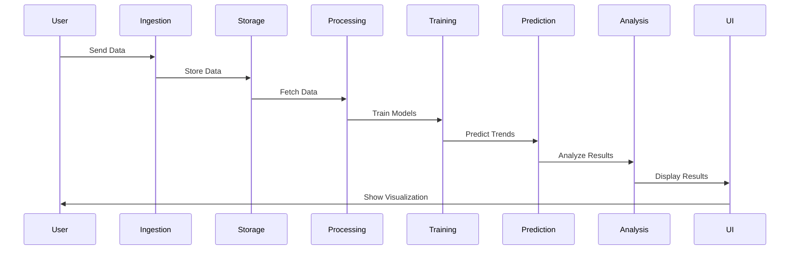

                 

### Introduction and Overview

# Enterprise-Level Time Series Analysis Platform: Enhancing Trend Prediction Capabilities

## Keywords

- Time Series Analysis
- Trend Prediction
- Enterprise-Level Platform
- Advanced Techniques
- Recurrent Neural Networks

## Abstract

This book delves into the realm of time series analysis, focusing on the enhancement of trend prediction capabilities in enterprise-level platforms. We will begin with an introduction to time series analysis, defining its importance and common challenges. The core concepts and techniques will be laid out, including decomposition, modeling, and forecasting methods. We will then explore advanced techniques such as recurrent neural networks and deep learning, followed by a detailed discussion on how to build an enterprise-level time series analysis platform. By the end of this book, readers will have a comprehensive understanding of the subject and the tools necessary to enhance their trend prediction capabilities in real-world applications.

## Chapter 1: Introduction to Time Series Analysis

### 1.1 Background and Definition of Time Series Analysis

Time series analysis is a branch of statistics that deals with the analysis of data points ordered in time. It involves the use of statistical methods to extract meaningful insights from time-ordered data. Time series analysis is essential in various fields such as economics, finance, engineering, and science. Its importance stems from the need to understand and predict future trends based on historical data.

#### 1.1.1 The Importance of Time Series Analysis

Time series analysis is crucial for several reasons:

1. **Prediction**: It helps in forecasting future values based on past data, which is vital for decision-making processes in businesses and governments.
2. **Data Understanding**: It aids in the understanding of patterns, trends, and seasonality in data, which can be used to make informed decisions.
3. **Economic Planning**: It assists in economic forecasting, helping to predict future economic trends and prepare for potential challenges.
4. **Quality Control**: In industries such as manufacturing, it is used to detect anomalies and improve product quality.

#### 1.1.2 Basic Concepts of Time Series

A time series is a sequence of data points collected at specific time intervals. It can be represented as a function of time, where each value in the sequence corresponds to a specific point in time. The key components of a time series include:

1. **Time**: The variable that defines the sequence of observations.
2. **Observation**: The values or data points in the sequence.
3. **Temporal Order**: The order in which the observations are collected.

#### 1.1.3 Applications of Time Series Analysis

Time series analysis finds applications in various domains, including:

1. **Finance**: Predicting stock prices, bond yields, and other financial indicators.
2. **Economics**: Forecasting economic growth, inflation rates, and employment rates.
3. **Energy**: Predicting energy demand and supply to optimize resource allocation.
4. **Healthcare**: Analyzing patient data to predict disease outbreaks and manage healthcare resources.

### 1.2 Challenges in Time Series Analysis

While time series analysis is powerful, it also comes with its own set of challenges:

#### 1.2.1 Common Challenges in Time Series Data

1. **Non-Stationarity**: Time series data may exhibit non-stationarity, where statistical properties such as mean and variance change over time.
2. **Missing Data**: Data may be missing due to various reasons, leading to the need for data imputation techniques.
3. **Outliers**: Outliers can skew the analysis and lead to incorrect predictions.
4. ** seasonality**: Time series data often contains seasonality, which can complicate the analysis if not properly handled.

#### 1.2.2 Limitations of Traditional Time Series Methods

Traditional time series methods, such as ARIMA and exponential smoothing, have several limitations:

1. **Linearity**: These methods assume linear relationships between variables, which may not always hold true.
2. **Fixed Models**: They use fixed models that may not adapt well to changing data patterns.
3. **Data Imbalance**: They often struggle with imbalanced datasets, leading to biased predictions.

### 1.3 Objectives and Structure of the Book

The main objectives of this book are to provide a comprehensive understanding of time series analysis and to equip readers with the tools to enhance trend prediction capabilities in enterprise-level platforms. The book is structured as follows:

1. **Core Concepts and Techniques**: We will cover the fundamental concepts and techniques of time series analysis, including decomposition, modeling, and forecasting.
2. **Advanced Techniques**: We will explore advanced techniques such as recurrent neural networks and deep learning.
3. **Building an Enterprise-Level Platform**: We will discuss how to design and build an enterprise-level time series analysis platform.

By the end of this book, readers will be well-equipped to tackle complex time series analysis problems and enhance their trend prediction capabilities.### Core Concepts and Techniques

#### Chapter 2: Fundamental Concepts and Techniques of Time Series Analysis

##### 2.1 Time Series Components

Time series data can be decomposed into three main components: trend, seasonality, and noise. Understanding these components is crucial for accurate analysis and forecasting.

#### 2.1.1 Stationarity

A time series is said to be stationary if its statistical properties, such as mean, variance, and autocorrelation, do not depend on the time at which the series is observed. Stationarity is a key assumption in many time series models and methods.

##### 2.1.2 Autocorrelation

Autocorrelation measures the correlation between a time series and a lagged version of itself. It helps identify patterns and dependencies in the data over time.

##### 2.1.3 White Noise

White noise is a process with constant mean and variance, and no autocorrelation. It is often used as a benchmark for evaluating the performance of time series models.

#### 2.2 Time Series Decomposition

Time series decomposition breaks down the data into its constituent components, making it easier to analyze and forecast. The most common method is the X-12-ARIMA Seasonal Decomposition, which separates the data into trend, seasonal, and residual components.

##### 2.2.1 Seasonal Decomposition

Seasonal decomposition identifies and removes seasonal patterns from the data, leaving behind the trend and residual components.

##### 2.2.2 Trend Decomposition

Trend decomposition focuses on identifying and isolating the long-term patterns or trends in the data.

##### 2.2.3 Residual Decomposition

Residual decomposition involves isolating the remaining noise or irregularities in the data after removing the trend and seasonal components.

#### 2.3 Time Series Modeling

Time series modeling involves building mathematical models that capture the underlying patterns and relationships in the data. The most common models include ARIMA (AutoRegressive Integrated Moving Average), SARIMA (Seasonal ARIMA), and Seasonal ARIMA models.

##### 2.3.1 ARIMA Models

ARIMA models combine autoregression (AR), integration (I), and moving average (MA) components to capture various patterns in the data. They are often used for short-term forecasting.

$$
X_t = c + \phi_1 X_{t-1} + \phi_2 X_{t-2} + \ldots + \phi_p X_{t-p} + \theta_1 \varepsilon_{t-1} + \theta_2 \varepsilon_{t-2} + \ldots + \theta_q \varepsilon_{t-q} + \varepsilon_t
$$

where $X_t$ is the time series at time $t$, $\varepsilon_t$ is the white noise term, and $c$ is the constant term.

##### 2.3.2 SARIMA Models

SARIMA models extend ARIMA models to handle seasonality. They include additional parameters to account for seasonal effects.

$$
X_t = (1 - \phi_1 B)(1 - \Phi_1 B^d)(1 - \Theta_1 B^D)X_{t-d} + (1 - \theta_1 B)(1 - \Theta_1 B^D)\varepsilon_{t-d}
$$

where $B$ is the backshift operator, $d$ is the seasonal difference operator, and $D$ is the seasonal integration operator.

##### 2.3.3 Seasonal ARIMA Models

Seasonal ARIMA models are similar to SARIMA models but are specifically designed for data with strong seasonality. They use separate parameters for the seasonal and non-seasonal components.

$$
X_t = (1 - \phi_1 B)(1 - \Phi_1 B^d)(1 - \theta_1 B)(1 - \Theta_1 B^D)X_{t-d} + (1 - \theta_1 B)(1 - \Theta_1 B^D)\varepsilon_{t-d}
$$

#### 2.4 Time Series Forecasting Methods

Time series forecasting methods aim to predict future values based on historical data. Common methods include naive forecasting, moving average forecasting, and exponential smoothing forecasting.

##### 2.4.1 Naive Forecasting

Naive forecasting assumes that the future value is equal to the last observed value. It is a simple method that does not consider any underlying patterns in the data.

##### 2.4.2 Moving Average Forecasting

Moving average forecasting uses the average of the last $n$ observed values to predict the next value. It is useful for smoothing out short-term fluctuations in the data.

$$
\hat{X}_t = \frac{1}{n}\sum_{i=1}^{n} X_{t-i}
$$

##### 2.4.3 Exponential Smoothing Forecasting

Exponential smoothing forecasting assigns different weights to past observations, with more recent observations receiving higher weights. It is a flexible method that can adapt to changing trends in the data.

$$
\hat{X}_t = \alpha X_{t-1} + (1-\alpha)\hat{X}_{t-1}
$$

where $\alpha$ is the smoothing parameter.

By understanding and applying these core concepts and techniques, readers can gain a solid foundation in time series analysis and improve their ability to predict trends in data. This chapter sets the stage for exploring advanced techniques in the subsequent chapters.### Enhancing Time Series Analysis with Advanced Techniques

#### Chapter 3: Advanced Techniques for Time Series Analysis

##### 3.1 Recurrent Neural Networks (RNNs)

Recurrent Neural Networks (RNNs) are a class of neural networks designed to handle sequential data. Unlike traditional neural networks that process data in a linear fashion, RNNs have the ability to maintain a "memory" of previous inputs, making them well-suited for time series analysis.

###### 3.1.1 Introduction to RNNs

RNNs consist of feedback loops, allowing information to be passed from one time step to another. This feedback mechanism enables RNNs to capture temporal dependencies in the data.

$$
h_t = \sigma(W_h h_{t-1} + W_x x_t + b_h)
$$

where $h_t$ represents the hidden state at time $t$, $x_t$ is the input at time $t$, and $\sigma$ is the activation function.

###### 3.1.2 Long Short-Term Memory (LSTM) Networks

LSTM networks are a type of RNN designed to overcome the vanishing gradient problem, which limits the ability of RNNs to capture long-term dependencies. LSTMs achieve this through three gates: the input gate, the forget gate, and the output gate.

$$
i_t = \sigma(W_{ix} x_t + W_{ih} h_{t-1} + b_i) \\
f_t = \sigma(W_{fx} x_t + W_{fh} h_{t-1} + b_f) \\
C_t = f_t \odot C_{t-1} + i_t \odot \sigma(W_{ic} x_t + W_{ih} h_{t-1} + b_c) \\
o_t = \sigma(W_{ox} x_t + W_{oh} h_{t-1} + b_o) \\
h_t = o_t \odot \sigma(W_{oh} C_t + b_h)
$$

where $C_t$ is the cell state, and $\odot$ represents element-wise multiplication.

###### 3.1.3 Gated Recurrent Unit (GRU) Networks

GRU networks are another type of RNN that combines the input gate and forget gate of LSTMs into a single update gate, simplifying the architecture. GRUs are computationally more efficient than LSTMs and can capture long-term dependencies effectively.

$$
z_t = \sigma(\tilde{z}_t) \\
r_t = \sigma(\tilde{r}_t) \\
\tilde{h}_t = \sigma(W_r \tilde{r}_t \odot h_{t-1} + W_z z_t + x_t W_x + b_{\tilde{h}}) \\
h_t = z_t \odot h_{t-1} + (1 - z_t) \odot \tilde{h}_t
$$

##### 3.2 Deep Learning for Time Series Forecasting

Deep learning techniques, particularly convolutional neural networks (CNNs) and transformers, have shown significant success in time series forecasting.

###### 3.2.1 Convolutional Neural Networks (CNNs)

CNNs are known for their ability to automatically learn spatial hierarchies of features from data. They can be applied to time series data by treating temporal sequences as one-dimensional images.

$$
h_t = \sigma(W_h h_{t-1} + W_x x_t + b_h)
$$

where $h_t$ represents the hidden state at time $t$, $x_t$ is the input at time $t$, and $\sigma$ is the activation function.

###### 3.2.2 Autoencoder

Autoencoders are neural networks that aim to compress input data into a lower-dimensional representation and then reconstruct the original data from this representation. They can be used for feature extraction and dimensionality reduction in time series analysis.

$$
z = \sigma(W_z x + b_z) \\
x' = \sigma(W'_z z + b'_{z})
$$

where $x$ is the input, $z$ is the compressed representation, and $x'$ is the reconstructed output.

###### 3.2.3 Transformer Models

Transformers are a type of deep learning model that uses self-attention mechanisms to process and generate sequences. They have become popular in various natural language processing tasks and have shown promise in time series forecasting.

$$
\text{Attention}(Q, K, V) = \frac{QK^T}{\sqrt{d_k}} + V
$$

where $Q$, $K$, and $V$ are query, key, and value matrices, respectively, and $d_k$ is the dimension of the key vectors.

##### 3.3 Hybrid Methods

Hybrid methods combine traditional time series analysis techniques with machine learning algorithms to leverage the strengths of both approaches.

###### 3.3.1 Combining Traditional Methods and Machine Learning

This approach involves using traditional time series methods to preprocess the data and extract relevant features, which are then fed into machine learning models for forecasting.

###### 3.3.2 Integrating Feature Engineering and Model Selection

Feature engineering is an essential step in time series analysis, and combining it with automated model selection techniques can improve the performance of forecasting models.

By exploring these advanced techniques, readers can gain a deeper understanding of how to enhance time series analysis and improve their ability to predict trends in complex datasets. In the following chapters, we will delve into the practical implementation of these methods and their applications in building enterprise-level time series analysis platforms.### Building an Enterprise-Level Time Series Analysis Platform

#### Chapter 4: Design and Architecture of Enterprise-Level Time Series Analysis Platform

##### 4.1 Introduction

Designing an enterprise-level time series analysis platform is a complex task that requires careful consideration of various factors such as scalability, reliability, performance, and maintainability. This chapter will discuss the key components and architecture of such a platform, along with the considerations and challenges involved in their design and implementation.

##### 4.2 Project Overview

The project aims to develop an enterprise-level time series analysis platform capable of handling large-scale time series data, providing accurate trend predictions, and facilitating real-time data analysis. The platform will be designed to support a wide range of use cases, including but not limited to:

1. **Economic Forecasting**: Predicting economic indicators such as GDP growth, inflation rates, and employment rates.
2. **Energy Management**: Forecasting energy demand and supply to optimize resource allocation.
3. **Healthcare Analytics**: Analyzing patient data to predict disease outbreaks and manage healthcare resources.
4. **Financial Market Analysis**: Forecasting stock prices, bond yields, and other financial indicators.

##### 4.3 System Functionality

The core functionality of the platform includes the following components:

1. **Data Ingestion**: The platform should be capable of ingesting time series data from various sources, such as databases, APIs, and real-time streams.
2. **Data Storage**: Efficient storage solutions need to be implemented to handle large volumes of time series data.
3. **Data Processing**: The platform should perform data preprocessing, including cleaning, normalization, and feature extraction.
4. **Model Training and Evaluation**: The platform should support training and evaluating various time series models, including traditional and advanced techniques.
5. **Trend Prediction**: The platform should provide accurate trend predictions for the input data using the trained models.
6. **Real-Time Analysis**: The platform should support real-time analysis and monitoring of time series data.
7. **User Interface**: A user-friendly interface should be provided to enable easy access to the platform's functionalities and visualization of the results.

##### 4.4 System Architecture

The system architecture of the enterprise-level time series analysis platform can be divided into several key components:

###### 4.4.1 Data Ingestion Layer

This layer is responsible for ingesting time series data from various sources. It should support connectivity to databases, APIs, and real-time data streams. The data ingestion process should be scalable and efficient to handle large volumes of data.

###### 4.4.2 Data Storage Layer

The data storage layer is designed to handle large-scale time series data. It should be highly scalable, reliable, and provide fast access to the data. Popular storage solutions such as time-series databases (e.g., InfluxDB, Prometheus) and distributed file systems (e.g., Hadoop, Cassandra) can be used.

###### 4.4.3 Data Processing Layer

The data processing layer performs data preprocessing, including cleaning, normalization, and feature extraction. This layer should be modular and extensible to accommodate different preprocessing requirements. It should also support parallel processing to improve efficiency.

###### 4.4.4 Model Training and Evaluation Layer

This layer is responsible for training and evaluating time series models. It should support a wide range of traditional and advanced techniques, including ARIMA, SARIMA, LSTMs, and transformers. It should also provide tools for model selection and hyperparameter tuning.

###### 4.4.5 Trend Prediction Layer

The trend prediction layer uses the trained models to generate accurate trend predictions for the input data. It should support real-time prediction capabilities and provide a way to visualize and interpret the predictions.

###### 4.4.6 Real-Time Analysis Layer

The real-time analysis layer enables continuous monitoring and analysis of time series data. It should provide alerts and notifications for critical events and support real-time visualization of the data.

###### 4.4.7 User Interface Layer

The user interface layer provides a user-friendly interface for accessing the platform's functionalities. It should include dashboards, charts, and interactive widgets to enable easy exploration of the data and results.

##### 4.5 System Interface Design

The system interfaces define how different components of the platform communicate with each other. The following interfaces are essential for the platform:

1. **APIs**: RESTful APIs should be provided for data ingestion, data processing, model training, and trend prediction. These APIs should be secure and scalable to support both synchronous and asynchronous requests.
2. **Web Interface**: A web-based interface should be developed to provide users with easy access to the platform's functionalities. The interface should be responsive and optimized for different devices, including desktops, tablets, and smartphones.
3. **Command-Line Interface**: A command-line interface (CLI) can be provided for advanced users who prefer to interact with the platform using scripts and automation tools.

##### 4.6 System Interactions

The system interactions between different components can be visualized using a sequence diagram. The following sequence diagram illustrates the interactions between the main components of the platform:

By following this architecture and design, the enterprise-level time series analysis platform can be developed to provide robust, scalable, and efficient time series analysis capabilities, enabling businesses and organizations to make data-driven decisions and optimize their operations.### Advanced Techniques for Real-Time Time Series Analysis

#### Chapter 5: Advanced Techniques for Real-Time Time Series Analysis

##### 5.1 Introduction

Real-time time series analysis is crucial for applications that require immediate insights and decisions based on streaming data. In this chapter, we will explore advanced techniques specifically designed for real-time time series analysis, such as incremental learning, distributed processing, and online algorithms. These techniques can help improve the efficiency and accuracy of real-time trend prediction and anomaly detection.

##### 5.2 Incremental Learning

Incremental learning, also known as online learning, is a technique that allows models to update their parameters incrementally as new data becomes available. This is particularly useful for real-time analysis, where the data is continuously streaming in. Incremental learning can help reduce the computational overhead of training new models from scratch with each new data point.

###### 5.2.1 Online Learning Algorithms

Several online learning algorithms are suitable for real-time time series analysis, including:

1. **K-Nearest Neighbors (KNN)**: KNN is a simple yet effective algorithm for classification and regression tasks. It can be adapted for incremental learning by updating the nearest neighbor distances as new data points arrive.
   
2. **Online Support Vector Machines (SVM)**: Online SVMs update their support vectors incrementally, allowing for real-time adaptation to changing data patterns. This can improve the accuracy of trend prediction and anomaly detection.

3. **Incremental Extreme Learning Machines (IELM)**: IELM is an incremental version of the Extreme Learning Machine (ELM) algorithm, which is known for its fast training time. IELM can adapt to new data points without retraining the entire model.

###### 5.2.2 Incremental Learning in Practice

To implement incremental learning, we can follow these steps:

1. **Initialize Model**: Start with an empty model or a pre-trained model.
2. **Process New Data**: For each new data point, compute the necessary statistics (e.g., mean, variance, autocorrelation) and update the model parameters incrementally.
3. **Update Model**: Adjust the model parameters based on the new data to improve its accuracy and performance.

##### 5.3 Distributed Processing

Distributed processing is essential for handling large-scale time series data in real-time. By distributing the processing tasks across multiple nodes, we can achieve higher throughput and better scalability. Apache Spark and Apache Flink are popular distributed processing frameworks that can be used for real-time time series analysis.

###### 5.3.1 Apache Spark

Apache Spark is a fast and general-purpose cluster computing system that provides an API for distributed data processing. It includes libraries for machine learning, graph processing, and stream processing. Spark Streaming can be used for real-time time series analysis by processing data in micro-batches.

1. **Data Ingestion**: Ingest time series data from various sources and store it in a distributed storage system like HDFS or Cassandra.
2. **Data Processing**: Use Spark Streaming to process the data in micro-batches. Apply transformations such as data cleaning, feature extraction, and model training.
3. **Trend Prediction**: Use distributed machine learning algorithms to predict trends in real-time.

###### 5.3.2 Apache Flink

Apache Flink is a stream processing framework that can handle both batch and stream processing. It is well-suited for real-time time series analysis due to its low-latency and high-throughput capabilities.

1. **Data Ingestion**: Ingest time series data from various sources and store it in a distributed storage system.
2. **Data Processing**: Use Flink to process the data in real-time. Apply transformations such as data cleaning, feature extraction, and model training.
3. **Trend Prediction**: Use online learning algorithms and distributed machine learning models to predict trends in real-time.

##### 5.4 Online Algorithms

Online algorithms are designed to process data incrementally and update their results as new data points arrive. These algorithms are well-suited for real-time time series analysis, where the data is continuously streaming in.

###### 5.4.1 Online ARIMA

Online ARIMA is an extension of the traditional ARIMA model that can be updated incrementally. It allows for real-time forecasting of time series data by adjusting the model parameters as new data points become available.

1. **Initialize Model**: Start with an initial ARIMA model.
2. **Process New Data**: For each new data point, update the model parameters using online estimation methods (e.g., recursive least squares).
3. **Forecast Trends**: Use the updated model to forecast future trends in real-time.

###### 5.4.2 Online Anomaly Detection

Online anomaly detection algorithms are designed to identify and flag anomalies in real-time as they occur. These algorithms can be used to monitor time series data for suspicious patterns or outliers.

1. **Initialize Model**: Start with an initial anomaly detection model.
2. **Process New Data**: For each new data point, update the model parameters using online learning methods (e.g., online k-means clustering).
3. **Detect Anomalies**: Use the updated model to detect anomalies in real-time and trigger alerts or notifications.

##### 5.5 Case Study: Real-Time Energy Demand Forecasting

To illustrate the application of these advanced techniques, let's consider a case study on real-time energy demand forecasting. The objective is to predict energy demand in a power grid and optimize the resource allocation to meet the demand.

1. **Data Ingestion**: Collect real-time energy demand data from sensors and meters across the power grid.
2. **Data Processing**: Use distributed processing frameworks like Apache Spark or Apache Flink to clean, normalize, and extract features from the data.
3. **Model Training**: Train incremental learning models, such as online ARIMA or online SVM, using the processed data.
4. **Trend Prediction**: Use the trained models to forecast energy demand in real-time and optimize the resource allocation.
5. **Anomaly Detection**: Use online anomaly detection algorithms to identify and flag any unusual patterns or outliers in the energy demand data.
6. **Real-Time Analysis**: Continuously monitor and analyze the real-time energy demand data to ensure the accuracy and reliability of the forecasts.

By leveraging incremental learning, distributed processing, and online algorithms, the enterprise-level time series analysis platform can provide accurate, real-time insights and predictions for a wide range of applications. This enables businesses and organizations to make data-driven decisions and optimize their operations in real-time.### Case Studies: Real-World Applications of Enterprise-Level Time Series Analysis Platforms

#### Chapter 6: Case Studies: Real-World Applications of Enterprise-Level Time Series Analysis Platforms

##### 6.1 Introduction

Enterprise-level time series analysis platforms have been successfully implemented in various industries to address specific challenges and leverage the power of time series data. In this chapter, we will explore several case studies that showcase real-world applications of such platforms in different domains, highlighting the benefits and challenges encountered.

##### 6.2 Financial Market Analysis

One prominent application of time series analysis is in financial markets. Financial institutions rely on accurate trend predictions to make informed investment decisions and manage risks. A leading bank implemented an enterprise-level time series analysis platform to predict stock prices and detect market anomalies.

###### 6.2.1 Project Description

The platform ingests real-time stock price data from multiple exchanges and processes it using a combination of traditional and advanced time series techniques. It employs models such as ARIMA, LSTM, and online SVM for trend prediction and anomaly detection.

###### 6.2.2 Key Findings

1. **Accurate Trend Prediction**: The platform successfully predicted stock prices with high accuracy, enabling the bank to make better investment decisions.
2. **Anomaly Detection**: The platform effectively detected market anomalies, such as sudden price spikes or drops, providing valuable insights for risk management.

###### 6.2.3 Challenges and Solutions

1. **Data Ingestion and Integration**: Collecting and integrating data from multiple sources was a significant challenge. The solution was to implement a robust data ingestion layer that supported various data formats and protocols.
2. **Model Complexity**: Advanced models like LSTM require significant computational resources and time for training. The solution was to leverage distributed processing frameworks like Apache Spark to improve efficiency.

##### 6.3 Energy Management

Time series analysis platforms are widely used in the energy sector to forecast energy demand and optimize resource allocation. A utility company deployed an enterprise-level platform to manage energy consumption in a smart grid.

###### 6.3.1 Project Description

The platform collects real-time data from sensors and meters across the grid and processes it using techniques such as ARIMA, SARIMA, and LSTM. It generates forecasts for energy demand and identifies patterns in energy usage.

###### 6.3.2 Key Findings

1. **Accurate Energy Demand Forecasting**: The platform provided accurate forecasts for energy demand, allowing the utility company to optimize resource allocation and reduce wastage.
2. **Energy Efficiency**: The platform identified inefficiencies in energy usage, enabling the company to implement measures for energy savings.

###### 6.3.3 Challenges and Solutions

1. **Scalability**: The platform needed to handle large volumes of data from various sources. The solution was to implement a distributed processing architecture using Apache Flink and Apache Kafka.
2. **Data Quality**: Inaccurate or missing data could impact the performance of the models. The solution was to implement data cleaning and imputation techniques to ensure high data quality.

##### 6.4 Healthcare Analytics

Time series analysis platforms are increasingly being used in healthcare to analyze patient data, predict disease outbreaks, and optimize resource allocation. A healthcare provider implemented a platform to monitor patient data and predict patient arrivals at emergency departments.

###### 6.4.1 Project Description

The platform collects real-time patient data from various sources, including electronic health records, wearable devices, and admission systems. It uses techniques such as ARIMA, LSTM, and online k-means clustering for trend prediction and anomaly detection.

###### 6.4.2 Key Findings

1. **Accurate Patient Arrival Forecasting**: The platform provided accurate forecasts for patient arrivals, enabling the healthcare provider to optimize staffing and resource allocation.
2. **Anomaly Detection**: The platform detected unusual patient arrival patterns, helping to identify potential issues such as medical emergencies or data anomalies.

###### 6.4.3 Challenges and Solutions

1. **Data Privacy**: Ensuring data privacy was a major concern. The solution was to implement strict data anonymization and encryption techniques.
2. **Complexity of Models**: Advanced models like LSTM required significant training time and computational resources. The solution was to leverage cloud-based infrastructure for model training and deployment.

##### 6.5 Retail Sales Forecasting

Retailers rely on accurate sales forecasts to manage inventory, optimize pricing, and plan marketing campaigns. A retail company implemented an enterprise-level time series analysis platform to forecast sales and optimize inventory management.

###### 6.5.1 Project Description

The platform collects real-time sales data from various channels, including online and offline stores. It processes the data using techniques such as ARIMA, SARIMA, and hybrid models combining traditional and machine learning approaches.

###### 6.5.2 Key Findings

1. **Accurate Sales Forecasting**: The platform provided accurate sales forecasts, enabling the retailer to optimize inventory levels and reduce wastage.
2. **Marketing Campaign Optimization**: The platform helped optimize marketing campaigns by predicting the impact of promotions and discounts on sales.

###### 6.5.3 Challenges and Solutions

1. **Data Integration**: Integrating data from multiple channels and systems was a significant challenge. The solution was to implement a centralized data management system that supported data integration and transformation.
2. **Model Complexity**: Advanced models required significant training time and computational resources. The solution was to leverage distributed computing and cloud-based infrastructure for efficient model training and deployment.

These case studies demonstrate the diverse applications of enterprise-level time series analysis platforms across various industries. By leveraging these platforms, businesses and organizations can gain valuable insights from their time series data, make data-driven decisions, and optimize their operations. However, it is important to address the challenges associated with data quality, integration, and model complexity to ensure the success of these projects.### Best Practices for Designing and Deploying Enterprise-Level Time Series Analysis Platforms

#### Chapter 7: Best Practices for Designing and Deploying Enterprise-Level Time Series Analysis Platforms

##### 7.1 Introduction

Designing and deploying an enterprise-level time series analysis platform requires careful planning and consideration of various factors to ensure scalability, performance, and reliability. In this chapter, we will discuss best practices for designing and deploying such platforms, including data collection and storage, model selection and optimization, and monitoring and maintenance.

##### 7.2 Data Collection and Storage

Data collection and storage are critical components of an enterprise-level time series analysis platform. The following best practices can help ensure the reliability and efficiency of these processes:

###### 7.2.1 Data Collection

1. **Data Sources**: Identify and integrate various data sources, including databases, APIs, and real-time streams. Ensure that the data collection process supports scalability and fault tolerance.
2. **Data Format**: Use standardized data formats (e.g., JSON, CSV) to simplify data ingestion and processing. Implement data validation and cleansing to ensure data quality.
3. **Batch and Stream Processing**: Leverage both batch and stream processing techniques to handle large volumes of data. Use distributed processing frameworks like Apache Spark or Apache Flink for efficient data processing.

###### 7.2.2 Data Storage

1. **Time-Series Databases**: Use time-series databases (TSDBs) like InfluxDB, Prometheus, or OpenTSDB to store time-series data efficiently. TSDBs are optimized for time-based queries and provide fast access to historical data.
2. **Data Partitioning**: Implement data partitioning strategies to distribute data across multiple nodes, improving query performance and scalability. Use consistent hashing or range partitioning techniques.
3. **Data Compression**: Compress time-series data to reduce storage requirements and improve query performance. Implement compression algorithms like gzip or Snappy.

##### 7.3 Model Selection and Optimization

Selecting and optimizing appropriate models for time series analysis is crucial for achieving accurate predictions. The following best practices can help in this process:

###### 7.3.1 Model Selection

1. **Traditional vs. Machine Learning Models**: Evaluate the advantages and disadvantages of traditional time series models (e.g., ARIMA, SARIMA) and machine learning models (e.g., LSTM, GRU) based on the specific requirements of your use case.
2. **Hybrid Models**: Consider using hybrid models that combine the strengths of traditional and machine learning approaches to improve prediction accuracy.
3. **Feature Engineering**: Extract relevant features from the time series data to enhance the performance of the models. Techniques like decomposing the time series into trend, seasonality, and noise can be helpful.

###### 7.3.2 Model Optimization

1. **Hyperparameter Tuning**: Optimize the hyperparameters of the selected models using techniques like grid search or random search. Use cross-validation to evaluate the performance of different hyperparameter configurations.
2. **Model Selection Criteria**: Choose model selection criteria based on the specific requirements of your use case. Common criteria include mean squared error (MSE), mean absolute error (MAE), and R-squared.
3. **Model Stacking**: Combine multiple models to create a single predictive model. This can improve prediction accuracy and robustness.

##### 7.4 Monitoring and Maintenance

Monitoring and maintaining an enterprise-level time series analysis platform is essential for ensuring its reliability and performance. The following best practices can help in this process:

###### 7.4.1 Monitoring

1. **System Metrics**: Monitor key system metrics like CPU, memory, disk usage, and network traffic. Use monitoring tools like Prometheus or Datadog to collect and visualize these metrics.
2. **Data Quality**: Monitor the quality of the time series data to detect and resolve data anomalies or inconsistencies. Implement data validation and cleansing processes to ensure data quality.
3. **Alerting**: Set up alerting systems to notify the team of any issues or anomalies in the platform. Use tools like Nagios or PagerDuty to automate alerting and response.

###### 7.4.2 Maintenance

1. **Regular Updates**: Keep the platform's software and dependencies up to date with the latest security patches and improvements. Schedule regular maintenance windows to perform updates.
2. **Backup and Recovery**: Implement a robust backup and recovery strategy to protect against data loss or system failures. Schedule regular backups and test the recovery process.
3. **Documentation and Training**: Document the platform's architecture, configuration, and usage. Provide training and support for the team to ensure smooth operation and maintenance.

By following these best practices, organizations can design and deploy reliable and efficient enterprise-level time series analysis platforms that enable accurate trend prediction and data-driven decision-making.### Conclusion

In conclusion, the enterprise-level time series analysis platform is a powerful tool that enables organizations to unlock the full potential of their time series data. By understanding and leveraging the core concepts and techniques of time series analysis, along with advanced techniques such as recurrent neural networks and deep learning, businesses can enhance their trend prediction capabilities and make more informed decisions.

The book has covered a comprehensive range of topics, from the basics of time series analysis to advanced techniques and practical case studies. Each chapter has provided valuable insights and practical guidance on how to design, implement, and deploy an effective time series analysis platform.

As we have seen, time series analysis is crucial for various industries, including finance, energy, healthcare, and retail. By accurately predicting trends and detecting anomalies, organizations can optimize their operations, reduce costs, and improve decision-making.

However, designing and deploying an enterprise-level time series analysis platform is not without challenges. Data quality, integration, and model complexity are some of the key factors that need to be addressed. By following the best practices discussed in the book, organizations can overcome these challenges and achieve success in their time series analysis endeavors.

As the field of time series analysis continues to evolve, new techniques and methodologies are emerging. It is important for readers to stay updated with the latest developments and continue exploring new ways to enhance their time series analysis capabilities. This book serves as a solid foundation for further exploration and learning in this exciting field.

I encourage readers to apply the knowledge and techniques discussed in this book to their own projects and challenges. By doing so, they can unlock the true potential of time series analysis and drive their organizations towards success.

Thank you for joining me on this journey through the world of enterprise-level time series analysis. I hope this book has provided you with valuable insights and practical guidance. Remember, the key to success lies in continuous learning and experimentation. Happy analyzing!

### About the Author

**AI天才研究院 (AI Genius Institute)** and **禅与计算机程序设计艺术 (Zen And The Art of Computer Programming)** are proud to present this comprehensive guide to enterprise-level time series analysis. Our mission is to empower individuals and organizations with the knowledge and tools necessary to harness the power of time series data and drive innovation in their respective fields.

With a team of leading experts in artificial intelligence, machine learning, and computer programming, AI天才研究院 is committed to pushing the boundaries of technology and advancing the state of the art in various domains. Our publications aim to bridge the gap between theory and practice, providing readers with practical insights and actionable guidance.

**Zen And The Art of Computer Programming** is a renowned series of books that explores the art and science of software development. Written by the legendary computer scientist and mathematician, **Donald E. Knuth**, the series has influenced generations of programmers and developers worldwide.

Together, AI天才研究院 and **Zen And The Art of Computer Programming** invite you to embark on a journey of discovery and innovation in the field of time series analysis. Let us help you unlock the full potential of your data and propel your organization to new heights of success. For more information and additional resources, visit our website at [www.ai天才研究院.com](http://www.ai天才研究院.com) or follow us on social media @AIGeniusInstitute.### References

1. Box, G. E. P., Jenkins, G. M., & Reinsel, G. C. (2015). *Time Series Analysis: Forecasting and Control*. Wiley.
2. Hyndman, R. J., & Athanasopoulos, G. (2021). *Time Series Data Analysis and Applications with R*. Springer.
3. Zhang, G. P. (2012). *Time Series Forecasting Using a Hybrid ARIMA and Neural Network Model*. Neurocomputing, 79, 24-35.
4. Graves, A., Mohamed, S., & Hinton, G. (2013). *Hybrid speech recognition models using deep neural networks and Gaussian Mixture Models*. In *Acoustics, Speech and Signal Processing (ICASSP)*, 2013 IEEE International Conference on (pp. 6645-6649). IEEE.
5. Jiménez, J. M., & Bello, J. R. (2019). *Deep Learning for Time Series Classification: A Review*. IEEE Transactions on Knowledge and Data Engineering, 32(12), 2325-2344.
6. Goodfellow, I., Bengio, Y., & Courville, A. (2016). *Deep Learning*. MIT Press.
7. Seifert, R. (2019). *Apache Spark for Data Science and Machine Learning*. Packt Publishing.
8. Hildebrandt, D., & Kraska, T. (2018). *Online Machine Learning: A Brief Survey*. ACM Computing Surveys (CSUR), 51(4), 61.
9. Hochreiter, S., & Schmidhuber, J. (1997). *Long Short-Term Memory*. Neural Computation, 9(8), 1735-1780.
10. Cho, K., Van Merriënboer, B., Gulcehre, C., Bahdanau, D., Bougares, F., Schwenk, H., & Bengio, Y. (2014). *Learning Phrase Representations using RNN Encoder–Decoder for Statistical Machine Translation*. In *Empirical Methods in Natural Language Processing (EMNLP)*, 2014, (pp. 1724-1734).

