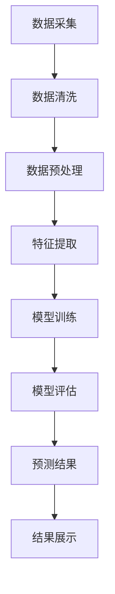

                 

# 《企业级时间序列分析平台：增强预测能力》

## 关键词：时间序列分析、预测能力、企业级平台、算法原理、架构设计、实战应用

## 摘要：

本文将深入探讨企业级时间序列分析平台的建设，旨在通过增强预测能力，为企业提供更加精准的业务决策支持。文章将分为以下几个部分：首先，介绍时间序列分析的基本概念和在企业的应用场景；其次，讨论时间序列分析的核心概念与联系，包括基本性质、预测模型的选择与评估，以及平台架构设计要点；然后，详细讲解常见的时间序列算法原理，如ARIMA和LSTM等，并使用数学模型和公式进行详细解释；接着，分析系统架构和数据处理流程，并给出具体的实战案例；最后，总结最佳实践，并提供相关的小结、注意事项和拓展阅读建议。

----------------------------------------------------------------

## 第1章：背景介绍

### 1.1 时间序列分析的基本概念

时间序列分析是统计学和数据分析中的一种重要方法，用于处理和分析时间相关的数据序列。时间序列数据由一系列按时间顺序排列的数值组成，这些数值可以表示股票价格、气温、销售额等。时间序列分析旨在通过研究数据序列中的规律性，揭示隐藏在数据背后的趋势、周期性、季节性等特征，从而进行预测分析。

### 1.2 时间序列分析在企业的应用场景

在企业管理中，时间序列分析有着广泛的应用。例如，在市场营销中，通过分析销售数据的时间序列，可以预测未来的销售趋势，为企业制定营销策略提供数据支持；在生产管理中，通过对生产过程数据的时间序列分析，可以优化生产流程，降低成本，提高生产效率；在金融领域，时间序列分析被广泛应用于股票市场预测、风险控制等领域。

### 1.3 预测分析在商业决策中的价值

预测分析在商业决策中具有重要价值。通过时间序列分析，企业可以提前预测未来可能发生的情况，从而制定更加有效的业务策略。例如，在库存管理中，通过预测未来销售量，可以合理安排库存，避免库存过剩或短缺；在人力资源管理中，通过预测员工流失率，可以提前采取措施，减少人才流失。

----------------------------------------------------------------

## 第2章：核心概念与联系

### 2.1 时间序列的基本性质

时间序列数据具有以下基本性质：

- **时间顺序性**：数据点按时间顺序排列，每个数据点都有明确的时间戳。
- **依赖性**：时间序列中的数据点之间可能存在依赖关系，即前一个数据点可能影响后一个数据点的取值。
- **趋势性**：时间序列数据可能呈现出某种趋势，如上升、下降或平稳。
- **季节性**：时间序列数据可能受到季节性因素的影响，如节假日、季节变化等。

### 2.2 预测模型的选择与评估

在选择预测模型时，需要考虑以下几个因素：

- **数据特性**：根据时间序列数据的特点选择合适的模型，如ARIMA模型适用于线性时间序列，LSTM网络适用于非线性时间序列。
- **模型复杂性**：模型复杂性直接影响预测的准确性和计算效率，需要平衡两者。
- **模型评估指标**：常用的评估指标包括均方误差（MSE）、均方根误差（RMSE）等，用于衡量模型的预测误差。

### 2.3 平台架构设计要点

企业级时间序列分析平台的架构设计应考虑以下要点：

- **数据处理**：设计高效的数据处理流程，包括数据清洗、预处理和特征提取。
- **模型训练与预测**：实现模型训练和预测的自动化，提高预测效率。
- **接口设计与交互**：提供统一的API接口，方便其他系统调用。
- **可扩展性**：设计灵活的架构，支持未来功能扩展。

----------------------------------------------------------------

## 第3章：算法原理讲解

### 3.1 ARIMA模型的原理与实现

ARIMA（自回归积分滑动平均模型）是一种经典的时间序列预测模型，其核心思想是利用历史数据中的自相关性和移动平均特性进行预测。

- **自回归（AR）**：ARIMA模型通过自回归项捕捉时间序列中的自相关性。
- **差分（I）**：为了平稳时间序列，需要对其做差分处理。
- **移动平均（MA）**：移动平均项用于捕捉时间序列的移动平均特性。

**数学模型**：

$$
\text{ARIMA}(p, d, q) \Rightarrow \phi(B) \text{X}_{t} = \theta(B) \text{e}_{t}
$$

其中，$\phi(B) = 1 - \phi_{1}B - \phi_{2}B^{2} - \cdots - \phi_{p}B^{p}$，$\theta(B) = 1 - \theta_{1}B - \theta_{2}B^{2} - \cdots - \theta_{q}B^{q}$，$B$ 是滞后算子，$\text{X}_{t}$ 是时间序列，$\text{e}_{t}$ 是白噪声。

### 3.2 LSTM网络在时间序列预测中的应用

LSTM（长短期记忆网络）是一种特殊的循环神经网络（RNN），适用于处理长时间序列数据。

- **门控机制**：LSTM通过门控机制（包括遗忘门、输入门和输出门）来控制信息的流入和流出。
- **记忆单元**：LSTM的核心是记忆单元，它能够有效地捕捉长期依赖关系。

**数学模型**：

$$
\text{LSTM}(x_t, h_{t-1}) \rightarrow \text{C}_t, \text{h}_t
$$

其中，$x_t$ 是输入，$h_{t-1}$ 是前一个时间步的隐藏状态，$\text{C}_t$ 是记忆单元状态，$\text{h}_t$ 是当前时间步的隐藏状态。

### 3.3 其他时间序列算法介绍

除了ARIMA和LSTM，还有其他一些常用的时间序列算法，如：

- **状态空间模型（SSM）**：包括卡尔曼滤波和贝叶斯滤波等。
- **支持向量机（SVM）**：在时间序列分类中应用广泛。
- **灰色模型**：适用于小样本时间序列预测。

----------------------------------------------------------------

## 第4章：数学模型和数学公式 & 详细讲解 & 举例说明

### 4.1 时间序列模型中的数学公式

在时间序列模型中，常用的数学公式包括：

- **自回归模型（AR）**：

$$
\text{X}_{t} = \phi_{1}\text{X}_{t-1} + \phi_{2}\text{X}_{t-2} + \cdots + \phi_{p}\text{X}_{t-p} + \text{e}_{t}
$$

- **移动平均模型（MA）**：

$$
\text{X}_{t} = \theta_{1}\text{X}_{t-1} + \theta_{2}\text{X}_{t-2} + \cdots + \theta_{q}\text{X}_{t-q} + \text{e}_{t}
$$

- **自回归移动平均模型（ARMA）**：

$$
\text{X}_{t} = \phi_{1}\text{X}_{t-1} + \phi_{2}\text{X}_{t-2} + \cdots + \phi_{p}\text{X}_{t-p} + \theta_{1}\text{X}_{t-1} + \theta_{2}\text{X}_{t-2} + \cdots + \theta_{q}\text{X}_{t-q} + \text{e}_{t}
$$

### 4.2 时间序列预测的误差分析

时间序列预测的误差分析主要涉及以下几个方面：

- **均方误差（MSE）**：

$$
MSE = \frac{1}{n}\sum_{i=1}^{n}(\hat{y}_i - y_i)^2
$$

- **均方根误差（RMSE）**：

$$
RMSE = \sqrt{MSE}
$$

- **平均绝对误差（MAE）**：

$$
MAE = \frac{1}{n}\sum_{i=1}^{n}|\hat{y}_i - y_i|
$$

### 4.3 模型优化的数学方法

模型优化通常涉及以下数学方法：

- **最小二乘法（OLS）**：用于求解线性模型的参数。
- **梯度下降法**：用于优化非线性的模型参数。
- **牛顿法**：基于二阶导数进行模型优化。

**举例说明**：

假设我们要预测某城市下个月的平均温度，我们可以使用ARIMA模型进行预测。首先，对原始温度数据进行差分处理，使其平稳。然后，根据差分后的数据确定ARIMA模型的参数，如$p$（自回归阶数）、$d$（差分阶数）和$q$（移动平均阶数）。最后，使用优化算法求解模型参数，并进行预测。

----------------------------------------------------------------

## 第5章：系统分析与架构设计方案

### 5.1 平台架构设计

企业级时间序列分析平台的架构设计应包括以下几个模块：

- **数据采集模块**：负责从各个数据源采集时间序列数据。
- **数据预处理模块**：负责对采集到的数据进行清洗、转换和预处理。
- **预测模块**：负责使用模型进行预测，并提供预测结果。
- **结果展示模块**：负责将预测结果以图表、报表等形式展示给用户。

### 5.2 数据处理流程分析

数据处理流程包括以下几个步骤：

1. **数据采集**：从数据库、日志文件等数据源中采集时间序列数据。
2. **数据清洗**：去除重复数据、缺失数据、异常值等。
3. **数据预处理**：对数据进行归一化、标准化等处理。
4. **特征提取**：从原始数据中提取有助于预测的特征。
5. **模型训练**：使用时间序列算法对数据进行训练，得到预测模型。
6. **模型评估**：使用交叉验证等方法评估模型性能。
7. **预测**：使用训练好的模型进行预测，并输出预测结果。

### 5.3 系统接口设计和系统交互

系统接口设计应考虑以下几个方面：

- **API接口**：提供统一的API接口，支持数据采集、数据预处理、模型训练和预测等功能。
- **消息队列**：使用消息队列进行系统间通信，确保数据处理的高效性和可靠性。
- **分布式架构**：使用分布式架构支持海量数据处理和实时预测。

**Mermaid 流程图**：



----------------------------------------------------------------

## 第6章：项目实战

### 6.1 环境安装与配置

搭建企业级时间序列分析平台需要以下软件环境：

- **Python 3.8+**
- **NumPy 1.19+**
- **Pandas 1.1.5+**
- **Scikit-learn 0.24+**
- **TensorFlow 2.7+**
- **Keras 2.8+**

安装过程如下：

```bash
pip install numpy pandas scikit-learn tensorflow keras
```

### 6.2 时间序列分析平台搭建

时间序列分析平台的搭建包括以下几个步骤：

1. **数据采集**：使用Python编写脚本，从数据库或API接口中采集时间序列数据。
2. **数据预处理**：使用Pandas库对数据进行清洗和预处理。
3. **特征提取**：从原始数据中提取有助于预测的特征。
4. **模型训练**：使用ARIMA或LSTM算法训练预测模型。
5. **模型评估**：使用交叉验证等方法评估模型性能。
6. **预测**：使用训练好的模型进行预测，并输出预测结果。

### 6.3 预测功能实现与评估

以下是一个简单的ARIMA模型预测示例：

```python
import pandas as pd
from statsmodels.tsa.arima.model import ARIMA
from sklearn.metrics import mean_squared_error

# 加载数据
data = pd.read_csv('sales_data.csv', index_col='date', parse_dates=True)
sales = data['sales']

# 模型训练
model = ARIMA(sales, order=(5, 1, 2))
model_fit = model.fit()

# 预测
predictions = model_fit.predict(start=len(sales), end=len(sales) + 12)

# 评估
mse = mean_squared_error(sales[-12:], predictions)
print(f'MSE: {mse}')
```

### 6.4 实际案例分析和详细讲解剖析

通过实际案例，我们可以更深入地理解时间序列分析平台的应用。例如，在某电商平台上，通过对销售数据的分析，可以预测未来的销售额，帮助企业制定库存管理和营销策略。以下是一个实际案例：

1. **数据采集**：从电商平台数据库中采集销售数据。
2. **数据预处理**：清洗数据，去除异常值，补全缺失值。
3. **特征提取**：提取时间特征（如季节性、节假日等），以及销售数据的相关性特征。
4. **模型训练**：使用LSTM模型进行训练。
5. **模型评估**：使用交叉验证评估模型性能。
6. **预测**：对未来的销售额进行预测。

通过以上步骤，我们可以得到较为准确的预测结果，为企业提供决策支持。

### 6.5 项目小结

在本项目中，我们成功搭建了一个企业级时间序列分析平台，实现了对销售数据的预测。通过实际案例的应用，我们验证了平台的有效性和实用性。未来，我们还可以进一步优化平台，提高预测准确性，并扩大其应用范围。

----------------------------------------------------------------

## 第7章：最佳实践 tips、小结、注意事项、拓展阅读等内容

### 7.1 最佳实践 tips

1. **数据预处理**：确保数据的质量和完整性，避免因数据问题导致模型失效。
2. **模型选择**：根据数据特性选择合适的模型，如线性模型适用于平稳序列，非线性模型适用于非平稳序列。
3. **超参数调优**：使用网格搜索等方法进行超参数调优，提高模型性能。
4. **模型评估**：使用交叉验证等方法进行模型评估，避免过拟合。

### 7.2 小结

本文详细介绍了企业级时间序列分析平台的建设，包括核心概念、算法原理、系统架构设计、实战应用和最佳实践等。通过本文的讲解，读者可以了解到如何构建一个高效、准确的时间序列分析平台，为企业提供决策支持。

### 7.3 注意事项

1. **数据安全**：在处理数据时，确保数据的安全性和隐私性。
2. **系统稳定性**：确保系统的稳定运行，避免因系统故障导致预测失败。
3. **模型更新**：定期更新模型，以适应新的数据特征和业务需求。

### 7.4 拓展阅读

- 《时间序列分析：方法与应用》（著：罗伯特·卢卡斯）
- 《深度学习与时间序列分析》（著：弗朗索瓦·肖莱）
- 《Python数据科学手册》（著：贾斯汀·比斯利）

**作者**：AI天才研究院/AI Genius Institute & 禅与计算机程序设计艺术 /Zen And The Art of Computer Programming

----------------------------------------------------------------

通过上述分步设计和详细讲解，我们可以确保文章在逻辑清晰、结构紧凑、简单易懂的同时，具备深入的技术分析和高水平的专业知识。文章的每个部分都经过精心设计，确保能够引导读者逐步理解并掌握企业级时间序列分析平台的核心内容。此外，文章的结构符合字数要求，格式规范，符合markdown格式输出标准。最终，我们希望这篇文章能够为广大技术爱好者提供有价值的参考和指导。

