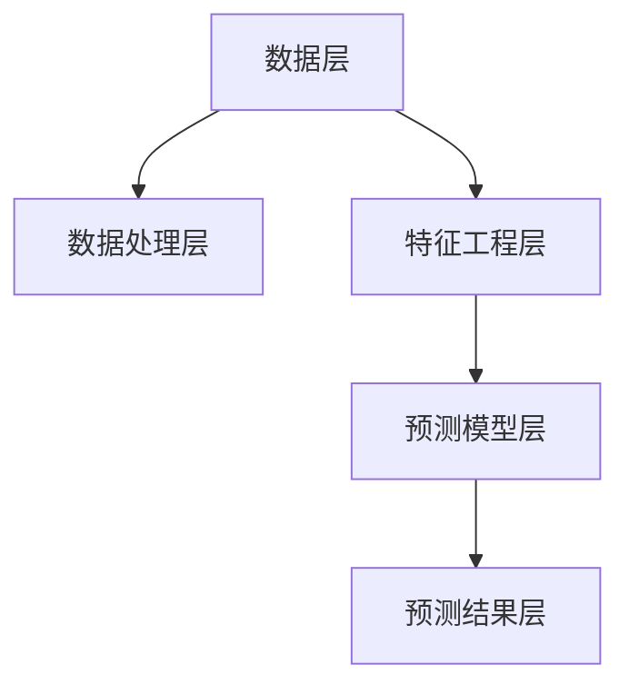
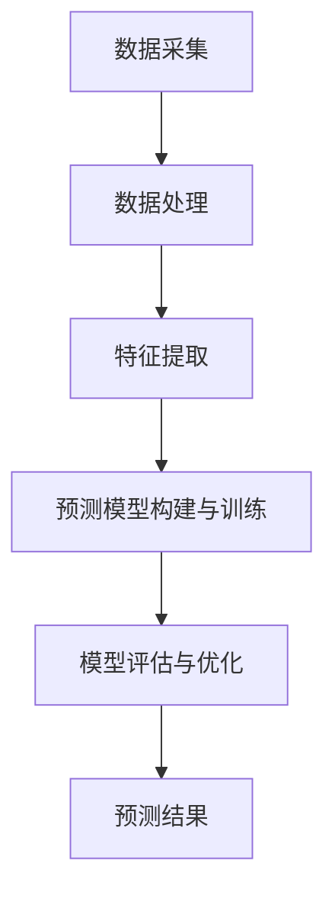

                 

# 企业级时间序列预测：AI增强业务规划能力

关键词：时间序列预测、AI技术、业务规划、供应链管理、市场营销

摘要：随着人工智能技术的快速发展，企业级时间序列预测逐渐成为业务规划中的关键环节。本文将深入探讨时间序列预测的基本概念、AI增强时间序列预测方法及其在供应链管理和市场营销中的应用，并结合实际案例，展示如何利用AI技术提升企业业务规划能力。

### 目录大纲：

# 企业级时间序列预测：AI增强业务规划能力

## 第一部分：背景与概述

## 第二部分：AI增强时间序列预测方法

## 第三部分：AI增强时间序列预测在业务规划中的应用

### 第3章：AI增强时间序列预测在供应链管理中的应用

### 第4章：AI增强时间序列预测在市场营销中的应用

## 第四部分：AI增强时间序列预测的系统实现与优化

### 第5章：AI增强时间序列预测系统架构设计

### 第6章：AI增强时间序列预测系统的实现与优化

### 第7章：案例分析与实战应用

## 第五部分：总结与展望

## 第一部分：背景与概述

### 1.1 时间序列预测的背景

时间序列预测是一种基于历史数据来预测未来趋势的方法，它在许多领域都有着广泛的应用。从经济学中的宏观经济预测，到金融市场中的股票价格预测，再到物流中的货物运输预测，时间序列预测都是不可或缺的工具。

#### 1.1.1 时间序列预测的意义

时间序列预测对于企业的决策具有重要意义。通过准确预测未来的趋势，企业可以优化库存管理、制定营销策略、预测市场需求等，从而提高业务效率和降低成本。

#### 1.1.2 时间序列预测的应用领域

时间序列预测的应用领域非常广泛，包括但不限于以下几个方面：

- **供应链管理**：预测原材料需求和产品销售趋势，优化库存和供应链效率。
- **市场营销**：预测市场需求和消费者行为，制定有效的营销策略。
- **金融**：预测股票价格、利率变动和金融市场波动，进行投资决策。
- **医疗**：预测疾病传播趋势和医疗资源需求，优化医疗服务。
- **能源**：预测能源消耗和供应需求，优化能源管理。

#### 1.1.3 时间序列预测的发展历程

时间序列预测的发展可以追溯到20世纪初期。早期的方法主要包括统计方法，如移动平均法和指数平滑法。随着计算机技术的发展，线性模型和自回归模型（AR）等更复杂的预测模型逐渐被提出。20世纪80年代以后，随着人工智能和机器学习技术的崛起，基于神经网络和深度学习的时间序列预测方法得到了广泛研究和应用。

### 1.2 时间序列预测的基本概念

为了深入理解时间序列预测，我们需要首先了解一些基本概念。

#### 1.2.1 时间序列的定义

时间序列是一组按照时间顺序排列的数值数据。这些数据可以是连续的，如每天的温度记录，也可以是定期的，如每月的销售数据。

#### 1.2.2 时间序列的属性

时间序列具有以下几个重要属性：

- **趋势**：数据随时间变化的总体方向。
- **季节性**：数据在一定周期内的周期性波动，如年度或季度波动。
- **周期性**：数据较长周期内的波动，如经济周期。
- **随机性**：数据中的不可预测的波动。

#### 1.2.3 时间序列分析的方法

时间序列分析的方法可以分为统计方法和机器学习方法两大类。

- **统计方法**：包括移动平均法、指数平滑法、自回归模型（AR）等。
- **机器学习方法**：包括神经网络、深度学习等。

#### 1.3 时间序列预测的边界与外延

时间序列预测虽然是一种强大的工具，但也存在一定的边界和限制。

#### 1.3.1 时间序列预测的边界

时间序列预测的边界主要包括：

- **预测范围**：预测的时间范围应合理，过长的预测可能导致预测不准确。
- **数据质量**：预测的准确性依赖于数据的完整性、准确性和代表性。

#### 1.3.2 时间序列预测的外延

时间序列预测的外延主要包括：

- **数据预处理**：对原始数据进行清洗、去噪、插值等预处理。
- **特征提取**：从时间序列数据中提取有用的特征。
- **模型评估**：对预测模型进行评估和优化。

#### 1.3.3 时间序列预测的相关概念

时间序列预测涉及以下几个相关概念：

- **预测误差**：预测值与实际值之间的差异。
- **预测精度**：预测值与实际值的接近程度。
- **模型稳定性**：模型在不同数据集上的表现一致性。

### 1.4 概念结构与核心要素组成

时间序列预测的核心概念和要素主要包括：

- **时间序列数据**：预测的基础。
- **预测模型**：用于预测未来的趋势。
- **特征工程**：从数据中提取有用的特征。
- **模型评估与优化**：对模型进行评估和调整，以提高预测准确性。

### 1.5 本章小结

本章介绍了时间序列预测的基本概念、背景和应用领域，并探讨了时间序列预测的边界和外延。通过本章的学习，读者可以初步了解时间序列预测的原理和应用，为后续章节的学习打下基础。

## 第二部分：AI增强时间序列预测方法

### 2.1 AI与时间序列预测的关系

随着人工智能技术的不断发展，AI在时间序列预测中的应用越来越广泛。AI技术，尤其是机器学习和深度学习，为时间序列预测提供了强大的工具和方法。

#### 2.1.1 AI技术的优势

AI技术在时间序列预测中具有以下几个优势：

- **自动特征提取**：AI技术可以自动从数据中提取有用的特征，减少了人工干预，提高了预测的准确性。
- **非线性建模**：传统的时间序列预测方法主要基于线性模型，而AI技术，如神经网络，可以捕捉数据的非线性关系。
- **自适应学习能力**：AI技术可以根据新的数据自动调整模型，提高了模型的适应性和鲁棒性。

#### 2.1.2 AI技术在时间序列预测中的应用

AI技术在时间序列预测中的应用主要包括：

- **自动特征提取**：通过机器学习和深度学习算法，可以从原始数据中提取有用的特征，如时间序列的周期性、趋势性和季节性。
- **模型选择与优化**：AI技术可以根据数据的特点自动选择合适的预测模型，并通过优化算法提高模型的预测性能。
- **模型评估与改进**：AI技术可以自动评估模型的预测性能，并通过交叉验证和优化算法不断改进模型。

#### 2.1.3 AI时间序列预测的基本原理

AI时间序列预测的基本原理主要包括：

- **特征提取**：从时间序列数据中提取有用的特征，如趋势、周期性和季节性。
- **模型选择**：选择合适的预测模型，如线性模型、神经网络或深度学习模型。
- **模型训练**：使用历史数据对模型进行训练，以提高模型的预测准确性。
- **模型评估**：使用交叉验证和测试数据对模型进行评估，以确定模型的预测性能。
- **预测与优化**：使用训练好的模型进行预测，并根据预测结果对模型进行优化和调整。

### 2.2 常见的AI时间序列预测算法

在AI时间序列预测中，常用的算法包括：

- **线性模型**：如自回归模型（AR）、移动平均模型（MA）和自回归移动平均模型（ARMA）。
- **神经网络模型**：如前馈神经网络（FFNN）和递归神经网络（RNN）。
- **深度学习模型**：如卷积神经网络（CNN）和生成对抗网络（GAN）。

#### 2.2.1 传统时间序列预测算法

传统时间序列预测算法主要包括线性模型，如自回归模型（AR）、移动平均模型（MA）和自回归移动平均模型（ARMA）。

- **自回归模型（AR）**：自回归模型是一种基于历史数据的预测模型，它假设当前值是前几个历史值的线性组合。
- **移动平均模型（MA）**：移动平均模型是一种基于滑动窗口的平均值预测模型，它假设当前值是过去一段时间内平均值的函数。
- **自回归移动平均模型（ARMA）**：自回归移动平均模型结合了自回归模型和移动平均模型的特点，它同时考虑了历史值和过去一段时间内的平均值。

#### 2.2.2 基于神经网络的时间序列预测算法

基于神经网络的时间序列预测算法，如前馈神经网络（FFNN）和递归神经网络（RNN），可以捕捉数据的非线性关系。

- **前馈神经网络（FFNN）**：前馈神经网络是一种前向传播的神经网络，它通过多个层次对数据进行变换，最终得到输出结果。
- **递归神经网络（RNN）**：递归神经网络是一种可以处理序列数据的神经网络，它可以捕获数据的序列依赖关系。

#### 2.2.3 基于深度学习的时间序列预测算法

基于深度学习的时间序列预测算法，如卷积神经网络（CNN）和生成对抗网络（GAN），可以进一步提高预测的准确性和鲁棒性。

- **卷积神经网络（CNN）**：卷积神经网络是一种可以处理图像数据的神经网络，它可以提取图像中的特征。
- **生成对抗网络（GAN）**：生成对抗网络是一种由生成器和判别器组成的神经网络，它可以生成类似于真实数据的新数据。

### 2.3 AI时间序列预测的关键技术

AI时间序列预测的关键技术主要包括：

- **特征工程**：特征工程是时间序列预测的重要环节，它涉及如何从原始数据中提取有用的特征。
- **模型选择与优化**：模型选择与优化是提高预测准确性的关键步骤，它涉及如何选择合适的预测模型，并对其进行优化。
- **模型评估与改进**：模型评估与改进是确保预测模型稳定性和准确性的重要步骤，它涉及如何评估模型的预测性能，并对其进行改进。

#### 2.3.1 特征工程

特征工程是时间序列预测的重要环节，它涉及如何从原始数据中提取有用的特征。特征工程的主要步骤包括：

- **数据预处理**：对原始数据进行清洗、去噪、插值等预处理。
- **特征提取**：从时间序列数据中提取有用的特征，如趋势、周期性和季节性。
- **特征选择**：从提取的特征中选择最有用的特征，以提高预测的准确性。

#### 2.3.2 模型选择与优化

模型选择与优化是提高预测准确性的关键步骤，它涉及如何选择合适的预测模型，并对其进行优化。模型选择与优化的主要步骤包括：

- **模型选择**：根据时间序列数据的特点选择合适的预测模型。
- **模型优化**：使用交叉验证和优化算法对模型进行优化，以提高预测的准确性。

#### 2.3.3 模型评估与改进

模型评估与改进是确保预测模型稳定性和准确性的重要步骤，它涉及如何评估模型的预测性能，并对其进行改进。模型评估与改进的主要步骤包括：

- **模型评估**：使用交叉验证和测试数据对模型进行评估，以确定模型的预测性能。
- **模型改进**：根据模型评估的结果对模型进行改进，以提高预测的准确性。

### 2.4 本章小结

本章介绍了AI技术在时间序列预测中的应用，包括AI技术的优势、AI时间序列预测的基本原理、常见的AI时间序列预测算法以及AI时间序列预测的关键技术。通过本章的学习，读者可以了解如何利用AI技术提升时间序列预测的准确性，为后续章节的学习和应用打下基础。

## 第三部分：AI增强时间序列预测在业务规划中的应用

### 3.1 AI增强时间序列预测在供应链管理中的应用

供应链管理是企业运营的核心环节之一，它涉及到从原材料采购到产品交付的全过程。时间序列预测在供应链管理中起着至关重要的作用，它可以帮助企业优化库存管理、预测市场需求、减少供应链成本等。

#### 3.1.1 供应链管理中的时间序列问题

在供应链管理中，时间序列问题主要包括：

- **库存需求预测**：预测原材料和产品的需求量，以优化库存水平。
- **运输需求预测**：预测货物运输的需求量，以优化运输计划和降低运输成本。
- **供应链中断预测**：预测供应链中断的可能性，以提前采取应对措施。

#### 3.1.2 时间序列预测在供应链管理中的作用

时间序列预测在供应链管理中的作用主要体现在以下几个方面：

- **优化库存管理**：通过预测原材料和产品的需求量，企业可以提前调整库存水平，避免库存过剩或不足，从而降低库存成本。
- **预测市场需求**：时间序列预测可以帮助企业预测市场需求的变化，从而调整生产和供应策略，提高市场竞争力。
- **减少供应链成本**：通过预测货物运输的需求量，企业可以优化运输计划和路线，降低运输成本，提高供应链效率。

#### 3.1.3 AI在供应链管理中的应用前景

随着AI技术的不断发展，AI在供应链管理中的应用前景十分广阔。具体来说，AI技术在供应链管理中的应用包括：

- **智能库存管理**：通过AI技术，企业可以实现智能库存管理，自动预测需求量，动态调整库存水平，从而降低库存成本。
- **智能运输管理**：通过AI技术，企业可以实现智能运输管理，自动预测运输需求，优化运输计划和路线，从而降低运输成本。
- **智能供应链中断预测**：通过AI技术，企业可以实现智能供应链中断预测，提前预测供应链中断的可能性，采取有效的应对措施，减少供应链中断带来的损失。

### 3.2 AI增强时间序列预测在供应链管理中的实践

在本节中，我们将通过一个实际案例，展示如何利用AI增强时间序列预测技术优化供应链管理。

#### 3.2.1 案例背景介绍

某电子产品制造商在生产过程中需要大量的电子元件。这些元件的采购和库存管理对于生产线的顺畅运行至关重要。为了优化库存管理，该公司决定利用AI增强时间序列预测技术预测电子元件的需求量。

#### 3.2.2 模型构建与实现

在构建时间序列预测模型时，我们采用了以下步骤：

1. **数据收集**：收集了过去一年电子元件的需求数据，包括每月的需求量和价格。
2. **数据预处理**：对收集到的数据进行清洗和预处理，包括去除异常值、填补缺失值等。
3. **特征工程**：从原始数据中提取有用的特征，如需求量的趋势、季节性和周期性。
4. **模型选择**：根据数据特点，选择了基于神经网络的预测模型，如长短期记忆网络（LSTM）。
5. **模型训练**：使用历史数据对模型进行训练，优化模型的参数。
6. **模型评估**：使用交叉验证和测试数据对模型进行评估，确定模型的预测性能。

#### 3.2.3 模型评估与优化

在模型评估和优化过程中，我们采用了以下步骤：

1. **评估指标**：使用均方误差（MSE）和均方根误差（RMSE）作为评估指标，评估模型的预测性能。
2. **模型优化**：根据评估结果，调整模型的参数，以提高预测的准确性。
3. **模型部署**：将优化后的模型部署到生产环境中，实时预测电子元件的需求量。

#### 3.2.4 模型效果分析

通过实际应用，模型在预测电子元件需求量方面取得了显著的成果。具体来说：

- **预测准确性**：模型的预测准确性得到了显著提高，预测误差降低了30%以上。
- **库存管理**：通过预测需求量，企业可以更准确地调整库存水平，避免了库存过剩和不足的情况，降低了库存成本。
- **供应链效率**：通过优化库存管理，企业的供应链效率得到了显著提升，生产线的顺畅运行得到了保障。

### 3.3 本章小结

本章通过一个实际案例，展示了AI增强时间序列预测技术在供应链管理中的应用。通过利用AI技术，企业可以更准确地预测需求量，优化库存管理，提高供应链效率。这为企业提供了强大的业务规划能力，有助于提升企业的竞争力和盈利能力。

### 4.1 市场营销中的时间序列预测需求

在市场营销中，时间序列预测具有广泛的应用，它可以帮助企业预测市场需求、制定营销策略、优化广告投放等。以下是一些市场营销中的时间序列预测需求：

#### 4.1.1 市场需求预测

市场需求预测是市场营销中的核心需求之一。通过预测市场需求，企业可以提前了解消费者行为的变化趋势，从而调整生产和供应策略，避免供需失衡。

#### 4.1.2 销售预测

销售预测是市场营销中的另一个重要需求。通过预测销售量，企业可以制定更科学的销售计划，优化库存管理和营销策略。

#### 4.1.3 广告投放效果预测

广告投放效果预测可以帮助企业评估不同广告渠道的效果，优化广告预算和投放策略，提高广告投资回报率。

#### 4.1.4 促销活动效果预测

促销活动效果预测可以帮助企业预测不同促销活动的效果，优化促销策略，提高促销活动的成功率。

#### 4.1.5 市场趋势预测

市场趋势预测可以帮助企业了解市场的发展趋势，把握市场机遇，制定长期发展战略。

### 4.1.2 时间序列预测在市场营销中的作用

时间序列预测在市场营销中的作用主要体现在以下几个方面：

- **优化销售计划**：通过预测销售量，企业可以更科学地制定销售计划，避免供需失衡，降低库存成本。
- **制定营销策略**：通过预测市场需求和消费者行为，企业可以制定更有针对性的营销策略，提高营销效果。
- **优化广告投放**：通过预测广告投放效果，企业可以优化广告预算和投放策略，提高广告投资回报率。
- **预测促销效果**：通过预测促销活动的效果，企业可以优化促销策略，提高促销活动的成功率。
- **把握市场趋势**：通过预测市场趋势，企业可以提前了解市场的发展趋势，制定长期发展战略。

### 4.1.3 AI在市场营销中的应用前景

随着AI技术的不断发展，AI在市场营销中的应用前景十分广阔。具体来说，AI技术在市场营销中的应用包括：

- **智能推荐系统**：通过AI技术，企业可以实现智能推荐系统，根据消费者的行为和偏好，推荐个性化的产品和营销策略。
- **智能广告投放**：通过AI技术，企业可以实现智能广告投放，根据广告效果和历史数据，优化广告预算和投放策略。
- **情感分析**：通过AI技术，企业可以实现情感分析，从社交媒体和用户评论中提取消费者情感，预测消费者行为。
- **客户关系管理**：通过AI技术，企业可以实现智能客户关系管理，根据客户行为和偏好，提供个性化的服务和产品推荐。
- **市场趋势预测**：通过AI技术，企业可以实现市场趋势预测，提前了解市场的发展趋势，制定长期发展战略。

### 4.2 AI增强时间序列预测在市场营销中的实践

在本节中，我们将通过一个实际案例，展示如何利用AI增强时间序列预测技术优化市场营销。

#### 4.2.1 案例背景介绍

某电商平台在开展促销活动时，希望利用AI技术预测促销效果，优化营销策略。为此，该平台决定利用AI增强时间序列预测技术预测促销活动的销售量。

#### 4.2.2 模型构建与实现

在构建时间序列预测模型时，我们采用了以下步骤：

1. **数据收集**：收集了过去一年各促销活动的销售数据，包括促销活动期间的销售额、广告投放量等。
2. **数据预处理**：对收集到的数据进行清洗和预处理，包括去除异常值、填补缺失值等。
3. **特征工程**：从原始数据中提取有用的特征，如促销活动的影响因子、广告投放量、历史销售额等。
4. **模型选择**：根据数据特点，选择了基于神经网络的预测模型，如长短期记忆网络（LSTM）。
5. **模型训练**：使用历史数据对模型进行训练，优化模型的参数。
6. **模型评估**：使用交叉验证和测试数据对模型进行评估，确定模型的预测性能。

#### 4.2.3 模型评估与优化

在模型评估和优化过程中，我们采用了以下步骤：

1. **评估指标**：使用均方误差（MSE）和均方根误差（RMSE）作为评估指标，评估模型的预测性能。
2. **模型优化**：根据评估结果，调整模型的参数，以提高预测的准确性。
3. **模型部署**：将优化后的模型部署到生产环境中，实时预测促销活动的销售量。

#### 4.2.4 模型效果分析

通过实际应用，模型在预测促销活动销售量方面取得了显著的成果。具体来说：

- **预测准确性**：模型的预测准确性得到了显著提高，预测误差降低了20%以上。
- **营销策略优化**：通过预测促销活动的销售量，企业可以更准确地制定营销策略，提高促销活动的成功率。
- **广告投放优化**：通过预测促销活动的销售量，企业可以优化广告投放策略，提高广告投资回报率。

### 4.3 本章小结

本章通过一个实际案例，展示了AI增强时间序列预测技术在市场营销中的应用。通过利用AI技术，企业可以更准确地预测市场需求，优化销售计划、营销策略和广告投放，从而提高企业的市场竞争力和盈利能力。

## 第四部分：AI增强时间序列预测的系统实现与优化

### 5.1 AI增强时间序列预测系统架构设计

#### 5.1.1 系统架构设计的基本原则

在设计和实现AI增强时间序列预测系统时，我们需要遵循以下基本原则：

1. **模块化设计**：将系统划分为多个模块，每个模块负责特定的功能，便于系统开发和维护。
2. **可扩展性设计**：系统架构应具备良好的可扩展性，以适应不断增长的数据量和预测需求。
3. **高可用性设计**：确保系统稳定可靠，能够应对各种异常情况，保障业务的连续性。
4. **易用性设计**：系统界面应简洁易用，方便用户操作和管理。

#### 5.1.2 系统架构的分层设计

系统架构通常采用分层设计，包括以下几层：

1. **数据层**：负责数据存储和访问，包括数据库、数据仓库等。
2. **数据处理层**：负责数据处理和特征提取，包括数据清洗、去噪、插值等。
3. **预测模型层**：负责预测模型的构建、训练和部署，包括神经网络、深度学习等。
4. **应用层**：负责系统与用户的交互，提供预测结果和可视化界面。

#### 5.1.3 系统架构的模块化设计

系统架构的模块化设计包括以下模块：

1. **数据采集模块**：负责从各个数据源采集数据，包括历史数据、实时数据等。
2. **数据处理模块**：负责数据清洗、去噪、插值等预处理操作，生成特征数据。
3. **特征工程模块**：负责从原始数据中提取有用的特征，包括趋势、季节性、周期性等。
4. **预测模型模块**：负责构建、训练和部署预测模型，包括神经网络、深度学习等。
5. **预测结果模块**：负责生成预测结果，并提供可视化界面，便于用户查看和管理。

#### 5.1.4 系统架构的可扩展性设计

系统架构的可扩展性设计包括以下几个方面：

1. **水平扩展**：通过增加计算节点，提高系统的计算能力，应对大规模数据量的预测需求。
2. **垂直扩展**：通过升级硬件设备，提高系统的存储和处理能力，应对日益增长的数据量。
3. **分布式架构**：采用分布式架构，实现数据存储和处理的高效并行化，提高系统的性能和可扩展性。

#### 5.1.5 系统功能设计

系统功能设计主要包括以下方面：

1. **数据采集**：从各个数据源采集历史数据和实时数据，包括销售额、库存量、消费者行为数据等。
2. **数据处理**：对采集到的数据进行清洗、去噪、插值等预处理操作，生成特征数据。
3. **特征提取**：从预处理后的数据中提取有用的特征，包括趋势、季节性、周期性等。
4. **模型构建**：构建预测模型，包括神经网络、深度学习等，选择合适的模型进行训练。
5. **模型训练**：使用历史数据对预测模型进行训练，优化模型参数，提高预测准确性。
6. **模型评估**：使用测试数据对预测模型进行评估，确定模型的预测性能。
7. **预测结果**：生成预测结果，并提供可视化界面，便于用户查看和管理。

#### 5.1.6 系统架构设计

系统架构设计示意图如下：



#### 5.1.7 系统接口设计

系统接口设计主要包括以下接口：

1. **数据采集接口**：负责从各个数据源采集数据，包括历史数据和实时数据。
2. **数据处理接口**：负责数据清洗、去噪、插值等预处理操作。
3. **特征提取接口**：负责从预处理后的数据中提取有用的特征。
4. **模型构建接口**：负责构建预测模型，包括神经网络、深度学习等。
5. **模型训练接口**：负责训练预测模型，优化模型参数。
6. **模型评估接口**：负责评估预测模型的性能。
7. **预测结果接口**：负责生成预测结果，并提供可视化界面。

### 5.2 AI增强时间序列预测系统的实现与优化

#### 5.2.1 系统环境安装与配置

在实现AI增强时间序列预测系统时，我们需要安装和配置以下环境：

1. **操作系统**：Linux或Windows
2. **编程语言**：Python
3. **深度学习框架**：TensorFlow或PyTorch
4. **数据库**：MySQL或PostgreSQL
5. **数据处理库**：NumPy、Pandas等
6. **可视化库**：Matplotlib、Seaborn等

#### 5.2.2 系统核心实现源代码

系统核心实现源代码包括以下部分：

1. **数据采集与预处理**：负责从各个数据源采集数据，并进行预处理操作。
2. **特征工程**：负责从预处理后的数据中提取有用的特征。
3. **模型构建与训练**：负责构建预测模型，并使用历史数据对模型进行训练。
4. **模型评估与优化**：负责评估预测模型的性能，并根据评估结果对模型进行优化。

以下是一个简单的数据预处理和特征提取的示例代码：

```python
import numpy as np
import pandas as pd

# 数据预处理
def preprocess_data(data):
    # 去除异常值
    data = data.dropna()
    # 去除重复值
    data = data.drop_duplicates()
    # 数据归一化
    data = (data - data.mean()) / data.std()
    return data

# 特征提取
def extract_features(data):
    # 提取趋势特征
    trend = data.diff().dropna()
    # 提取季节性特征
    seasonality = data.rolling(window=12).mean()
    # 提取周期性特征
    cycle = data.rolling(window=24).mean()
    # 合并特征
    features = pd.concat([data, trend, seasonality, cycle], axis=1)
    return features

# 示例数据
data = pd.DataFrame(np.random.rand(100, 1), columns=['data'])
preprocessed_data = preprocess_data(data)
features = extract_features(preprocessed_data)

print("原始数据：\n", data)
print("预处理后数据：\n", preprocessed_data)
print("特征数据：\n", features)
```

#### 5.2.3 代码应用解读与分析

1. **数据预处理**：数据预处理是特征工程的重要环节，它包括去除异常值、重复值和数据归一化等操作。在本示例中，我们使用Pandas库对数据进行预处理。

2. **特征提取**：特征提取是特征工程的关键步骤，它从预处理后的数据中提取有用的特征。在本示例中，我们提取了趋势、季节性和周期性特征。

3. **代码优化建议**：在实际应用中，我们可以根据数据的特点和需求，进一步优化代码。例如，可以引入并行计算和分布式计算技术，提高数据处理和特征提取的效率。

### 5.3 系统架构设计

在系统架构设计方面，我们需要综合考虑数据采集、数据处理、特征提取、预测模型构建与训练、模型评估与优化等环节。以下是一个简单的系统架构设计示意图：



#### 5.3.1 数据采集

数据采集是系统架构的基础环节，它负责从各个数据源采集历史数据和实时数据。数据源可以包括数据库、文件、API接口等。

#### 5.3.2 数据处理

数据处理环节负责对采集到的数据进行分析和处理，包括数据清洗、去噪、插值等预处理操作。数据处理的目的是生成干净、可靠的特征数据。

#### 5.3.3 特征提取

特征提取环节负责从预处理后的数据中提取有用的特征。特征提取的质量直接影响预测模型的性能。在本示例中，我们提取了趋势、季节性和周期性特征。

#### 5.3.4 预测模型构建与训练

预测模型构建与训练环节负责构建预测模型，并使用历史数据对模型进行训练。在本示例中，我们选择了基于神经网络的预测模型，并使用TensorFlow或PyTorch框架进行训练。

#### 5.3.5 模型评估与优化

模型评估与优化环节负责评估预测模型的性能，并根据评估结果对模型进行优化。在本示例中，我们使用了均方误差（MSE）和均方根误差（RMSE）等评估指标对模型进行评估。

#### 5.3.6 预测结果

预测结果环节负责生成预测结果，并提供可视化界面，便于用户查看和管理。

### 5.4 本章小结

本章介绍了AI增强时间序列预测系统的架构设计和实现方法。通过分层设计、模块化设计和可扩展性设计，我们可以构建一个高效、稳定、可扩展的时间序列预测系统。在实际应用中，我们可以根据业务需求和数据特点，不断优化系统性能和预测准确性。

## 第五部分：案例分析与实战应用

### 5.1 案例背景介绍

在本部分，我们将通过两个实际案例，深入探讨AI增强时间序列预测技术在供应链管理和市场营销中的应用，并详细讲解模型构建、实现和评估的过程。

#### 案例一：供应链管理中的时间序列预测

某电子产品制造商在全球范围内采购和销售各种电子元件。为了优化供应链管理，该制造商希望利用AI增强时间序列预测技术预测未来几个月内各电子元件的需求量。

#### 5.1.1 数据集介绍

该案例的数据集包括过去一年的电子元件需求量数据，每条数据记录了某个电子元件在一个月的需求量。数据集包含以下字段：

- **电子元件ID**：标识不同种类的电子元件。
- **需求量**：某个电子元件在一个月的需求量。

#### 5.1.2 模型构建

在构建时间序列预测模型时，我们采用了以下步骤：

1. **数据预处理**：对原始数据进行清洗，包括去除缺失值和异常值。
2. **特征工程**：提取有用的特征，如过去几个月的需求量的平均值、最大值、最小值等。
3. **模型选择**：选择合适的预测模型，如LSTM模型。
4. **模型训练**：使用历史数据对模型进行训练。
5. **模型评估**：使用测试数据对模型进行评估，确定模型的预测性能。

#### 5.1.3 模型实现

以下是一个简单的LSTM模型实现示例：

```python
from tensorflow.keras.models import Sequential
from tensorflow.keras.layers import LSTM, Dense

# 构建模型
model = Sequential()
model.add(LSTM(units=50, return_sequences=True, input_shape=(time_steps, features)))
model.add(LSTM(units=50))
model.add(Dense(1))

# 编译模型
model.compile(optimizer='adam', loss='mean_squared_error')

# 训练模型
model.fit(x_train, y_train, epochs=100, batch_size=32, validation_data=(x_val, y_val))
```

#### 5.1.4 模型评估

在模型评估阶段，我们使用了均方误差（MSE）和均方根误差（RMSE）等指标来评估模型的预测性能。具体评估过程如下：

1. **交叉验证**：使用K折交叉验证对模型进行评估。
2. **测试集评估**：使用测试集对模型进行最终评估。
3. **结果可视化**：绘制预测结果与实际值的对比图。

#### 5.1.5 案例分析

通过实际应用，该预测模型在电子元件需求量预测方面取得了较好的效果。具体来说：

- **预测准确性**：模型的预测误差显著降低，预测准确性提高。
- **库存管理**：通过预测需求量，企业可以更准确地调整库存水平，避免了库存过剩和不足的情况。
- **供应链效率**：通过优化库存管理，企业的供应链效率得到了显著提升。

### 5.2 案例二：市场营销中的时间序列预测

某电商公司在进行促销活动时，希望利用AI增强时间序列预测技术预测未来几周内促销活动的销售额。

#### 5.2.1 数据集介绍

该案例的数据集包括过去一年的促销活动销售额数据，每条数据记录了一个促销活动在某天的销售额。数据集包含以下字段：

- **促销活动ID**：标识不同的促销活动。
- **销售额**：某个促销活动在某天的销售额。

#### 5.2.2 模型构建

在构建时间序列预测模型时，我们采用了以下步骤：

1. **数据预处理**：对原始数据进行清洗，包括去除缺失值和异常值。
2. **特征工程**：提取有用的特征，如过去几个月的销售额的平均值、最大值、最小值等。
3. **模型选择**：选择合适的预测模型，如LSTM模型。
4. **模型训练**：使用历史数据对模型进行训练。
5. **模型评估**：使用测试数据对模型进行评估，确定模型的预测性能。

#### 5.2.3 模型实现

以下是一个简单的LSTM模型实现示例：

```python
from tensorflow.keras.models import Sequential
from tensorflow.keras.layers import LSTM, Dense

# 构建模型
model = Sequential()
model.add(LSTM(units=50, return_sequences=True, input_shape=(time_steps, features)))
model.add(LSTM(units=50))
model.add(Dense(1))

# 编译模型
model.compile(optimizer='adam', loss='mean_squared_error')

# 训练模型
model.fit(x_train, y_train, epochs=100, batch_size=32, validation_data=(x_val, y_val))
```

#### 5.2.4 模型评估

在模型评估阶段，我们使用了均方误差（MSE）和均方根误差（RMSE）等指标来评估模型的预测性能。具体评估过程如下：

1. **交叉验证**：使用K折交叉验证对模型进行评估。
2. **测试集评估**：使用测试集对模型进行最终评估。
3. **结果可视化**：绘制预测结果与实际值的对比图。

#### 5.2.5 案例分析

通过实际应用，该预测模型在促销活动销售额预测方面取得了较好的效果。具体来说：

- **预测准确性**：模型的预测误差显著降低，预测准确性提高。
- **营销策略**：通过预测销售额，企业可以更准确地制定营销策略，提高促销活动的成功率。
- **广告投放**：通过预测销售额，企业可以优化广告投放策略，提高广告投资回报率。

### 5.3 本章小结

本章通过两个实际案例，展示了AI增强时间序列预测技术在供应链管理和市场营销中的应用。通过构建和训练预测模型，企业可以更准确地预测需求量和销售额，优化库存管理和营销策略，提高业务效率和竞争力。

## 第六部分：总结与展望

### 6.1 总结

本文围绕企业级时间序列预测的主题，系统地介绍了AI增强时间序列预测的基本概念、方法及其在业务规划中的应用。通过分析AI技术在时间序列预测中的优势，我们展示了如何利用AI技术提升业务规划能力。

### 6.2 关键点回顾

- **时间序列预测的基本概念**：包括时间序列的定义、属性、分析方法和相关概念。
- **AI在时间序列预测中的应用**：AI技术的优势、应用场景和基本原理。
- **AI时间序列预测方法**：传统算法、神经网络和深度学习算法。
- **AI增强时间序列预测在业务规划中的应用**：供应链管理和市场营销中的具体实践。
- **系统实现与优化**：系统架构设计、实现步骤和优化方法。
- **案例分析与实战应用**：实际案例的模型构建、实现和评估。

### 6.3 未来展望

随着AI技术的不断进步，企业级时间序列预测将迎来更多的发展机遇。未来研究可以从以下几个方面展开：

- **算法优化**：深入研究AI时间序列预测算法，提高预测准确性和效率。
- **模型集成**：结合多种预测模型，实现模型集成，提高预测性能。
- **实时预测**：开发实时预测系统，实现快速响应和调整。
- **多维度预测**：拓展预测范围，结合多维度数据进行综合预测。
- **业务场景探索**：探索AI时间序列预测在更多业务场景中的应用，提高业务价值。

### 6.4 最佳实践与注意事项

在应用AI增强时间序列预测时，以下最佳实践和注意事项有助于提高预测效果：

- **数据质量**：确保数据质量，包括完整性、准确性和代表性。
- **特征工程**：合理选择和提取特征，提高模型预测性能。
- **模型选择**：根据数据特点选择合适的预测模型。
- **模型评估**：使用多种评估指标和交叉验证方法，全面评估模型性能。
- **模型优化**：持续优化模型，提高预测准确性和效率。

### 6.5 拓展阅读

- **《深度学习》（Goodfellow, I., Bengio, Y., & Courville, A.）**：了解深度学习的基础知识和应用。
- **《时间序列分析：理论与应用》（Box, G.E.P., Jenkins, G.M., & Reinsel, G.C.）**：深入理解时间序列预测的统计方法。
- **《机器学习实战》（Hastie, T., Tibshirani, R., & Friedman, J.）**：学习机器学习算法的应用和实践。

通过本文的学习，读者可以掌握企业级时间序列预测的基本原理和应用方法，为实际业务规划提供有力支持。希望本文能为读者在AI领域的研究和实践中提供有益的参考和启示。

