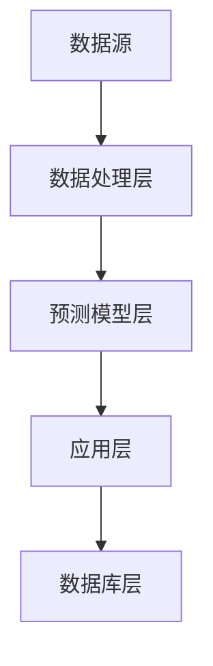
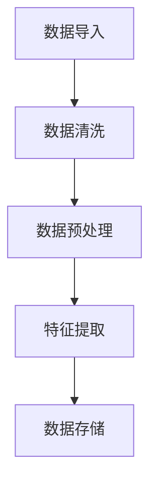
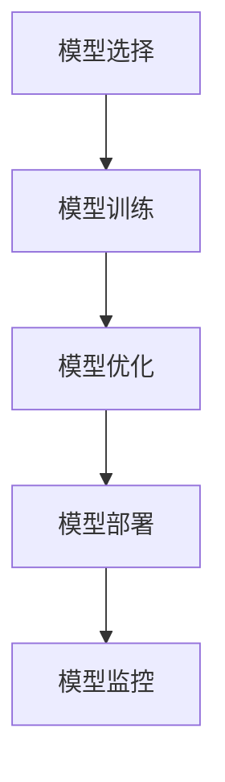

                 


## 企业级时间序列预测：增强业务规划能力

### 关键词：
时间序列预测，业务规划，数据分析，机器学习，深度学习

### 摘要：
本文章深入探讨企业级时间序列预测的原理、应用和实现方法，通过详细的案例分析，展示如何利用时间序列预测技术提升企业的业务规划能力。文章分为八个章节，从概述到实际应用，层层递进，旨在为读者提供全面的技术指导。

---

### 1. 前言

时间序列预测是企业业务规划中不可或缺的一部分，它能够帮助企业预测未来的发展趋势，优化资源分配，降低风险，提高盈利能力。随着大数据和人工智能技术的发展，时间序列预测技术也日益成熟，成为企业数字化转型的重要工具。

本书旨在为数据分析师、业务规划师以及任何对时间序列预测感兴趣的专业人士提供一本全面、实用的指南。通过本篇文章，读者将了解时间序列预测的基本概念、技术框架，以及如何在企业中应用这些技术来增强业务规划能力。

### 2. 第1章 企业级时间序列预测概述

#### 1.1 时间序列预测的背景和意义
时间序列预测是一种利用历史数据来预测未来趋势的方法。它广泛应用于经济学、气象学、金融工程等多个领域。在企业中，时间序列预测可以帮助企业更好地进行需求预测、库存管理、营销策略制定等。

#### 1.2 时间序列预测的基本概念
时间序列数据是一系列按时间顺序排列的数据点。时间序列预测的基本概念包括时间序列的平稳性、自相关性、趋势性等。

#### 1.3 企业级时间序列预测的应用场景
企业级时间序列预测的应用场景广泛，包括供应链管理、市场营销、金融市场分析等。

#### 1.4 时间序列预测的技术框架
时间序列预测的技术框架包括传统方法（如ARIMA模型）、机器学习方法（如回归、决策树）和深度学习方法（如LSTM、GRU）。

---

### 3. 第2章 时间序列数据预处理

#### 2.1 数据清洗与归一化
数据清洗是时间序列预测的重要步骤，包括填补缺失值、去除异常值等。归一化可以消除数据中的量纲影响。

#### 2.2 填补缺失值和异常值处理
填补缺失值的方法有插值法、均值填补法等。异常值处理方法包括标准差方法、箱线图方法等。

#### 2.3 时间序列分解与特征提取
时间序列分解可以将时间序列数据分解为趋势、季节性和随机性三个部分。特征提取可以帮助模型更好地捕捉时间序列数据的特性。

---

### 4. 第3章 时间序列预测模型原理

#### 3.1 传统时间序列预测模型
传统时间序列预测模型包括ARIMA、SARIMA、Holt-Winters模型等。

#### 3.2 机器学习时间序列预测模型
机器学习时间序列预测模型包括回归模型、决策树模型、支持向量机模型等。

#### 3.3 深度学习时间序列预测模型
深度学习时间序列预测模型包括LSTM、GRU、Transformer模型等。

#### 3.4 时间序列预测模型比较与选择
比较与选择时间序列预测模型需要考虑模型的准确度、复杂度、可解释性等因素。

---

### 5. 第4章 时间序列预测模型实现

#### 4.1 模型实现步骤
实现时间序列预测模型通常包括数据准备、模型选择、模型训练与验证、模型部署等步骤。

#### 4.2 Python代码实现
Python是进行时间序列预测的常用语言，本书将提供详细的Python代码示例。

#### 4.3 模型训练与优化
模型训练与优化包括超参数调优、交叉验证等。

---

### 6. 第5章 企业级时间序列预测应用实战

#### 5.1 实战案例1：需求预测
通过一个实际案例，展示如何使用时间序列预测技术进行需求预测。

#### 5.2 实战案例2：库存管理
介绍如何利用时间序列预测技术优化库存管理。

#### 5.3 实战案例3：电力负荷预测
分析电力负荷预测的案例，展示时间序列预测在企业能源管理中的应用。

---

### 7. 第6章 企业级时间序列预测系统的设计与实现

#### 6.1 系统需求分析
分析企业级时间序列预测系统的需求，包括数据处理、预测模型管理、系统部署等。

#### 6.2 系统架构设计
设计企业级时间序列预测系统的架构，包括数据处理层、模型层、应用层等。

#### 6.3 数据处理与存储设计
设计数据处理与存储方案，包括数据导入、预处理、存储等。

#### 6.4 预测模型管理设计
设计预测模型管理方案，包括模型训练、模型评估、模型部署等。

#### 6.5 系统部署与优化
介绍系统部署与优化的方法，包括硬件选择、部署策略、性能优化等。

---

### 8. 第7章 时间序列预测的挑战与未来趋势

#### 7.1 挑战与问题
讨论时间序列预测面临的挑战和问题，包括数据质量、模型选择、解释性等。

#### 7.2 未来趋势与发展方向
展望时间序列预测的未来趋势和发展方向，包括新技术、新应用等。

---

### 总结

本文回顾了企业级时间序列预测的核心内容，从概念到应用，从理论到实战，为读者提供了一套完整的时间序列预测指南。随着技术的不断发展，时间序列预测将在企业业务规划中发挥越来越重要的作用。

---

### 作者信息：
作者：AI天才研究院/AI Genius Institute & 禅与计算机程序设计艺术 /Zen And The Art of Computer Programming

本文提供了企业级时间序列预测的全面指南，旨在帮助读者掌握这一关键技术，提升业务规划能力。通过逐步的分析和实战案例，读者可以深入了解时间序列预测的原理和实现方法，为企业的发展提供有力支持。希望本文能为读者带来启发和帮助。****

## 第1章 企业级时间序列预测概述

### 1.1 时间序列预测的背景和意义

时间序列预测是一种基于历史数据来预测未来趋势的方法。它广泛应用于各种领域，如金融市场分析、天气预报、需求预测等。在企业中，时间序列预测尤为重要，因为它可以帮助企业更好地规划业务，降低风险，提高盈利能力。

#### 1.1.1 时间序列预测的定义

时间序列（Time Series）是一系列按时间顺序排列的数据点，通常用于记录某个现象随时间的变化。时间序列预测（Time Series Forecasting）是利用历史时间序列数据来预测未来数据的方法。

#### 1.1.2 时间序列预测在业务规划中的作用

在企业中，时间序列预测可以用于多个方面：

- **需求预测**：预测产品的未来需求，帮助企业在库存管理、生产规划等方面做出更准确的决策。
- **库存管理**：通过预测库存的需求量，优化库存水平，减少库存成本，提高资金利用率。
- **营销策略**：预测市场需求，为制定营销策略提供依据，提高市场竞争力。
- **风险管理**：预测金融市场的波动，为风险管理和投资决策提供支持。

#### 1.1.3 企业级时间序列预测的重要性

企业级时间序列预测对企业的重要性体现在以下几个方面：

- **决策支持**：时间序列预测提供的历史数据和未来趋势分析，可以帮助企业做出更科学的决策。
- **资源优化**：通过预测需求，企业可以更有效地分配资源，减少浪费，提高运营效率。
- **风险管理**：预测潜在的市场风险，提前采取应对措施，降低企业风险。
- **竞争优势**：准确的时间序列预测可以帮助企业抓住市场机会，提高市场竞争力。

### 1.2 时间序列预测的基本概念

在深入探讨时间序列预测之前，我们需要了解一些基本概念。

#### 1.2.1 时间序列数据的特性

时间序列数据具有以下几个特性：

- **序列性**：数据点按照时间顺序排列，每个时间点都有一个对应的数据值。
- **平稳性**：时间序列数据在时间上没有明显的趋势和周期性波动。
- **自相关性**：时间序列数据的前后值之间存在相关性，即当前值与过去值之间的关联性。
- **季节性**：时间序列数据在一定时间内会呈现出周期性的波动。

#### 1.2.2 时间序列的常见模型

时间序列预测常用的模型包括：

- **ARIMA模型**：自回归积分滑动平均模型，适用于平稳时间序列数据的预测。
- **SARIMA模型**：季节性ARIMA模型，适用于含有季节性的时间序列数据。
- **Holt-Winters模型**：适用于含有趋势和季节性的时间序列数据。

#### 1.2.3 时间序列的预测误差分析

时间序列预测的误差分析是评估预测模型性能的重要指标。常见的误差指标包括：

- **均方误差（MSE）**：预测值与真实值之间差的平方的平均值。
- **均方根误差（RMSE）**：MSE的平方根，用于衡量预测误差的大小。
- **平均绝对误差（MAE）**：预测值与真实值之间差的绝对值的平均值。

### 1.3 企业级时间序列预测的应用场景

企业级时间序列预测的应用场景非常广泛，以下列举几个常见的应用场景：

#### 1.3.1 供应链管理

在供应链管理中，时间序列预测可以用于预测原材料需求、生产计划、库存水平等。通过准确的预测，企业可以优化供应链流程，减少库存成本，提高生产效率。

#### 1.3.2 营销与销售预测

在市场营销和销售领域，时间序列预测可以帮助企业预测产品的销售量，制定营销策略。例如，通过预测季节性需求，企业可以合理安排促销活动，提高销售额。

#### 1.3.3 金融市场分析

在金融市场中，时间序列预测可以用于预测股票价格、汇率变动等。金融机构可以利用这些预测结果进行投资决策，降低风险。

#### 1.3.4 电力需求预测

在电力需求预测中，时间序列预测可以帮助电力公司预测电力需求，合理安排发电计划，保证电力供应的稳定性。

### 1.4 时间序列预测的技术框架

时间序列预测的技术框架包括多种方法，从传统方法到现代机器学习和深度学习方法。以下简要介绍几种常用的技术框架：

#### 1.4.1 传统时间序列预测方法

- **ARIMA模型**：自回归积分滑动平均模型，适用于平稳时间序列数据的预测。
- **SARIMA模型**：季节性ARIMA模型，适用于含有季节性的时间序列数据。
- **Holt-Winters模型**：适用于含有趋势和季节性的时间序列数据。

#### 1.4.2 机器学习时间序列预测方法

- **回归模型**：如线性回归、多项式回归等。
- **决策树**：利用决策树进行分类或回归。
- **支持向量机**：通过寻找最佳决策边界进行预测。

#### 1.4.3 深度学习时间序列预测方法

- **LSTM（长短期记忆网络）**：适用于处理长时间依赖的时间序列数据。
- **GRU（门控循环单元）**：与LSTM类似，但结构更简单。
- **Transformer模型**：基于注意力机制的深度学习模型，在许多时间序列预测任务中表现优异。

通过以上内容，我们对企业级时间序列预测有了基本的了解。接下来，我们将深入探讨时间序列数据预处理、预测模型原理、模型实现和应用实战等内容。****

## 第2章 时间序列数据预处理

### 2.1 数据清洗与归一化

数据清洗是时间序列预测中的关键步骤，因为它直接影响预测模型的性能。数据清洗包括去除噪声、填补缺失值、去除异常值等。

#### 2.1.1 数据清洗的重要性

- **提高模型准确性**：通过去除噪声和异常值，可以减少模型训练中的干扰因素，提高预测准确性。
- **保证数据质量**：填补缺失值和去除异常值可以确保数据的一致性和可靠性，避免模型因数据问题而产生偏差。

#### 2.1.2 常见数据清洗方法

- **去除噪声**：噪声可能是随机误差或数据采集过程中的干扰，可以通过平滑滤波等方法去除。
- **填补缺失值**：填补缺失值的方法有插值法（线性插值、样条插值等）、均值填补法、插值法等。
- **去除异常值**：异常值可能是数据输入错误或数据采集过程中的异常，可以通过箱线图、标准差等方法检测并去除。

#### 2.1.3 数据归一化的方法

归一化是将数据缩放到一个标准范围内，以便模型能够更好地处理数据。常见的数据归一化方法包括：

- **最小-最大归一化**：将数据缩放到[0, 1]范围内。
  $$
  x_{\text{norm}} = \frac{x - x_{\text{min}}}{x_{\text{max}} - x_{\text{min}}}
  $$
- **标准化**：将数据缩放到[-1, 1]范围内。
  $$
  x_{\text{norm}} = \frac{x - \mu}{\sigma}
  $$
  其中，$x$是原始数据，$x_{\text{min}}$和$x_{\text{max}}$分别是数据的最小值和最大值，$\mu$是平均值，$\sigma$是标准差。

### 2.2 填补缺失值和异常值处理

缺失值和异常值是时间序列数据中常见的问题，需要特殊处理。

#### 2.2.1 缺失值处理策略

- **插值法**：通过在缺失值附近插值来填补缺失值，如线性插值、样条插值等。
- **均值填补法**：用时间序列的平均值来填补缺失值。
- **移动平均法**：用前后几个值的平均值来填补缺失值。

#### 2.2.2 异常值检测与处理

异常值可能影响模型的训练效果，需要特殊处理。

- **箱线图法**：通过箱线图来检测异常值，通常将大于$Q3+1.5 \cdot IQR$或小于$Q1-1.5 \cdot IQR$的数据点视为异常值。
  $$
  Q1 = \text{第一四分位数}, Q3 = \text{第三四分位数}, IQR = Q3 - Q1
  $$
- **标准差法**：将标准差作为阈值，通常将离均值超过$k \cdot \sigma$的数据点视为异常值。
  $$
  k = 3 \text{（常见值）}, \sigma = \text{标准差}
  $$
- **处理策略**：对于检测到的异常值，可以选择去除、替换或保持不变。

### 2.3 时间序列分解与特征提取

时间序列分解是将时间序列数据分解为趋势、季节性和随机性三个部分，以便更好地理解数据并构建预测模型。

#### 2.3.1 时间序列分解模型

- **加法模型**：
  $$
  y_t = T_t + S_t + R_t
  $$
  其中，$T_t$是趋势部分，$S_t$是季节性部分，$R_t$是随机性部分。

- **乘法模型**：
  $$
  y_t = T_t \cdot S_t \cdot R_t
  $$

#### 2.3.2 常见特征提取方法

- **时间特征**：如日期、星期、月份等。
- **季节特征**：如季节性指数、季节性波动等。
- **趋势特征**：如趋势斜率、趋势变化点等。
- **随机特征**：如残差、噪声等。

通过时间序列分解和特征提取，我们可以更好地理解数据，并构建更准确的预测模型。****

## 第3章 时间序列预测模型原理

### 3.1 传统时间序列预测模型

传统时间序列预测模型主要基于统计学和线性代数理论，适用于处理平稳时间序列数据。以下是几种常用的传统时间序列预测模型：

#### 3.1.1 ARIMA模型

ARIMA（AutoRegressive Integrated Moving Average）模型是最常用的传统时间序列预测模型之一。它由三个部分组成：自回归（AR）、差分（I）和移动平均（MA）。

- **自回归（AR）**：AR模型假设当前值可以由前几个历史值来预测。
  $$
  X_t = c + \phi_1 X_{t-1} + \phi_2 X_{t-2} + \cdots + \phi_p X_{t-p} + \varepsilon_t
  $$
  其中，$c$是常数项，$\phi_1, \phi_2, \cdots, \phi_p$是自回归系数，$X_t$是时间序列数据，$\varepsilon_t$是误差项。

- **差分（I）**：为了使时间序列数据变成平稳序列，需要对序列进行差分操作。
  $$
  \Delta X_t = X_t - X_{t-1}
  $$

- **移动平均（MA）**：MA模型假设当前值可以由前几个预测误差来预测。
  $$
  X_t = c + \theta_1 \varepsilon_{t-1} + \theta_2 \varepsilon_{t-2} + \cdots + \theta_q \varepsilon_{t-q} + \varepsilon_t
  $$
  其中，$\theta_1, \theta_2, \cdots, \theta_q$是移动平均系数。

综合以上三部分，ARIMA模型可以表示为：
$$
X_t = c + \phi_1 X_{t-1} + \phi_2 X_{t-2} + \cdots + \phi_p X_{t-p} + \theta_1 \varepsilon_{t-1} + \theta_2 \varepsilon_{t-2} + \cdots + \theta_q \varepsilon_{t-q} + \varepsilon_t
$$

#### 3.1.2 SARIMA模型

SARIMA（Seasonal ARIMA）模型是ARIMA模型的扩展，适用于含有季节性成分的时间序列数据。SARIMA模型在ARIMA模型的基础上，增加了季节性部分。

SARIMA模型的一般形式为：
$$
X_t = c + (1 - B)\Phi(B)(1 - \Theta(B))^{-1} \Theta(B) \varepsilon_t
$$
其中，$\Phi(B)$和$\Theta(B)$是季节性自回归和移动平均项，$B$是滞后算子。

#### 3.1.3 Holt-Winters模型

Holt-Winters模型是一种简单但有效的季节性时间序列预测模型，适用于含有趋势和季节性成分的时间序列数据。

Holt-Winters模型分为三个部分：

- **趋势模型**：
  $$
  T_t = \alpha (Y_t - T_{t-1}) + (1 - \alpha) T_{t-1}
  $$
  其中，$T_t$是趋势值，$\alpha$是平滑系数，$Y_t$是实际值。

- **季节模型**：
  $$
  S_t = \beta (S_{t-k} - S_{t-k-1}) + (1 - \beta) S_{t-k-1}
  $$
  其中，$S_t$是季节值，$\beta$是平滑系数，$S_{t-k}$是季节周期内的值，$k$是季节周期长度。

- **平滑模型**：
  $$
  Y_t = T_t + S_t
  $$

综合以上三部分，Holt-Winters模型可以表示为：
$$
Y_t = \alpha (Y_t - T_{t-1}) + (1 - \alpha) T_{t-1} + \beta (S_{t-k} - S_{t-k-1}) + (1 - \beta) S_{t-k-1}
$$

### 3.2 机器学习时间序列预测模型

机器学习时间序列预测模型利用机器学习算法来预测时间序列数据。与传统的统计模型相比，机器学习模型通常具有更好的泛化能力和适应性。

#### 3.2.1 回归模型

回归模型是一种常见的时间序列预测模型，适用于处理线性关系的时间序列数据。

- **线性回归**：
  $$
  Y_t = \beta_0 + \beta_1 X_t + \varepsilon_t
  $$
  其中，$Y_t$是预测值，$X_t$是特征值，$\beta_0$和$\beta_1$是模型参数，$\varepsilon_t$是误差项。

- **多项式回归**：
  $$
  Y_t = \beta_0 + \beta_1 X_t + \beta_2 X_t^2 + \cdots + \beta_n X_t^n + \varepsilon_t
  $$

#### 3.2.2 决策树模型

决策树模型通过构建一棵决策树来进行分类或回归。决策树模型适用于处理非线性关系的时间序列数据。

- **分类树**：
  $$
  Y_t = f(X_t)
  $$
  其中，$Y_t$是预测值，$X_t$是特征值，$f$是决策树函数。

- **回归树**：
  $$
  Y_t = \sum_{i=1}^{n} \beta_i X_{t,i} + \varepsilon_t
  $$
  其中，$Y_t$是预测值，$X_{t,i}$是特征值，$\beta_i$是模型参数。

#### 3.2.3 支持向量机模型

支持向量机（SVM）是一种经典的机器学习算法，适用于处理非线性关系的时间序列数据。

- **线性SVM**：
  $$
  \mathbf{w} = \arg\min_{\mathbf{w}} \frac{1}{2} ||\mathbf{w}||^2 \quad \text{subject to} \quad y_i (\mathbf{w} \cdot \mathbf{x}_i + b) \geq 1
  $$
  其中，$\mathbf{w}$是模型参数，$\mathbf{x}_i$是特征值，$y_i$是标签值，$b$是偏置。

- **核SVM**：
  $$
  \mathbf{w} = \arg\min_{\mathbf{w}, \xi} \frac{1}{2} ||\mathbf{w}||^2 + C \sum_{i=1}^{n} \xi_i \quad \text{subject to} \quad y_i (\mathbf{w} \cdot \phi(\mathbf{x}_i) + b) \geq 1, \xi_i \geq 0
  $$
  其中，$\phi(\mathbf{x}_i)$是核函数，$C$是正则化参数。

### 3.3 深度学习时间序列预测模型

深度学习时间序列预测模型利用神经网络来建模时间序列数据，具有强大的特征提取和表示能力。

#### 3.3.1 LSTM模型

LSTM（Long Short-Term Memory）模型是一种特殊的循环神经网络，适用于处理长时间依赖的时间序列数据。

LSTM模型包含三个门控单元：遗忘门、输入门和输出门。

- **遗忘门**：
  $$
  f_t = \sigma(W_f \cdot [h_{t-1}, x_t] + b_f)
  $$
  其中，$f_t$是遗忘门的输出，$W_f$和$b_f$是模型参数。

- **输入门**：
  $$
  i_t = \sigma(W_i \cdot [h_{t-1}, x_t] + b_i)
  $$
  其中，$i_t$是输入门的输出，$W_i$和$b_i$是模型参数。

- **输出门**：
  $$
  o_t = \sigma(W_o \cdot [h_{t-1}, x_t] + b_o)
  $$
  其中，$o_t$是输出门的输出，$W_o$和$b_o$是模型参数。

LSTM单元的输入和输出为：
$$
C_t = f_t \odot C_{t-1} + i_t \odot \tanh(W_c \cdot [h_{t-1}, x_t] + b_c)
$$
$$
h_t = o_t \odot \tanh(C_t)
$$
其中，$C_t$是状态细胞，$h_t$是单元输出，$\odot$表示元素乘积。

#### 3.3.2 GRU模型

GRU（Gated Recurrent Unit）模型是对LSTM模型的简化，适用于处理较短时间依赖的时间序列数据。

GRU模型包含两个门控单元：重置门和更新门。

- **重置门**：
  $$
  z_t = \sigma(W_z \cdot [h_{t-1}, x_t] + b_z)
  $$
  其中，$z_t$是重置门的输出，$W_z$和$b_z$是模型参数。

- **更新门**：
  $$
  r_t = \sigma(W_r \cdot [h_{t-1}, x_t] + b_r)
  $$
  其中，$r_t$是更新门的输出，$W_r$和$b_r$是模型参数。

GRU单元的输入和输出为：
$$
h_t = (1 - z_t) \odot h_{t-1} + z_t \odot \tanh(W_h \cdot [r_t \odot h_{t-1}, x_t] + b_h)
$$
其中，$W_h$和$b_h$是模型参数。

#### 3.3.3 Transformer模型

Transformer模型是一种基于注意力机制的深度学习模型，适用于处理序列数据。

Transformer模型的主要组件包括：

- **自注意力机制**：
  $$
  \text{Attention}(Q, K, V) = \text{softmax}\left(\frac{QK^T}{\sqrt{d_k}}\right) V
  $$
  其中，$Q$、$K$和$V$分别是查询、键和值，$d_k$是键的维度。

- **多头注意力**：
  $$
  \text{MultiHead}(Q, K, V) = \text{Concat}(\text{head}_1, \text{head}_2, \cdots, \text{head}_h)W^O
  $$
  其中，$h$是头数，$W^O$是输出权重。

- **前馈网络**：
  $$
  \text{FFN}(X) = \max(0, XW_1 + b_1)^T W_2 + b_2
  $$
  其中，$W_1$和$W_2$是权重，$b_1$和$b_2$是偏置。

通过上述组件，Transformer模型能够高效地处理序列数据，并在许多时间序列预测任务中取得了优异的性能。

### 3.4 时间序列预测模型比较与选择

在选择时间序列预测模型时，需要考虑模型的准确性、复杂度、可解释性等因素。

- **准确性**：通常使用均方误差（MSE）、均方根误差（RMSE）等指标来评估模型的准确性。

- **复杂度**：模型的复杂度会影响训练时间和计算资源。深度学习模型通常比传统模型更复杂。

- **可解释性**：传统模型通常具有更好的可解释性，而深度学习模型则更难以解释。

在选择模型时，可以结合以下步骤：

1. **数据特性分析**：分析时间序列数据的特性，包括平稳性、自相关性、季节性等。

2. **模型评估**：对不同模型进行评估，比较它们的准确性、复杂度和可解释性。

3. **实际应用**：选择在实际应用中表现较好的模型。

通过以上步骤，可以选择最适合企业需求的时间序列预测模型。****

## 第4章 时间序列预测模型实现

### 4.1 模型实现步骤

实现时间序列预测模型通常包括以下几个步骤：

1. **数据准备**：收集并整理时间序列数据，进行数据清洗、预处理和归一化。

2. **模型选择**：根据时间序列数据的特性，选择合适的预测模型。

3. **模型训练与验证**：使用训练数据对模型进行训练，并通过验证数据评估模型性能。

4. **模型部署**：将训练好的模型部署到实际应用中，进行实时预测。

### 4.2 Python代码实现

以下是一个使用Python实现时间序列预测模型的基本示例。这里我们使用ARIMA模型进行预测。

#### 导入库

```python
import numpy as np
import pandas as pd
from statsmodels.tsa.arima.model import ARIMA
from sklearn.metrics import mean_squared_error
```

#### 数据准备

```python
# 加载数据
data = pd.read_csv('time_series_data.csv')
data = data['target_variable'].values

# 数据预处理
data = data.reshape(-1, 1)
data = data.astype('float32')

# 分割数据集
train_data = data[:int(len(data) * 0.8)]
test_data = data[int(len(data) * 0.8):]
```

#### 模型选择

```python
# 选择ARIMA模型
model = ARIMA(train_data, order=(5, 1, 2))
model_fit = model.fit()
```

#### 模型训练与验证

```python
# 训练模型
model_fit = model_fit.fit()

# 预测
predictions = model_fit.predict(start=len(train_data), end=len(train_data) + len(test_data) - 1)

# 验证
mse = mean_squared_error(test_data, predictions)
print(f'MSE: {mse}')
```

### 4.3 模型训练与优化

模型训练与优化是提高预测准确性的关键步骤。以下是一些常用的优化方法：

1. **超参数调优**：通过交叉验证和网格搜索等方法，找到最佳的超参数组合。

2. **模型集成**：使用多个模型进行集成，提高预测性能。

3. **特征工程**：提取更多有效的特征，改善模型性能。

4. **正则化**：在机器学习模型中引入正则化，防止过拟合。

#### 超参数调优

```python
from sklearn.model_selection import GridSearchCV
from statsmodels.tsa.arima.model import ARIMA

# 设置超参数
param_grid = {'order': [(1, 1), (2, 1), (3, 1), (4, 1), (5, 1)]}

# 实例化ARIMA模型和网格搜索
model = ARIMA(train_data, order=(1, 1, 1))
grid_search = GridSearchCV(model, param_grid, cv=5, scoring='neg_mean_squared_error')

# 搜索最佳超参数
grid_search.fit(train_data)

# 获取最佳超参数
best_params = grid_search.best_params_
print(f'Best parameters: {best_params}')

# 使用最佳超参数训练模型
model = ARIMA(train_data, order=best_params['order'])
model_fit = model.fit()
```

通过以上步骤，我们可以实现一个基本的时间序列预测模型，并通过优化方法提高其性能。在实际应用中，还需要结合具体业务需求，进一步调整和优化模型。****

## 第5章 企业级时间序列预测应用实战

### 5.1 实战案例1：需求预测

#### 案例背景

某电子产品制造企业希望通过时间序列预测技术来预测未来一段时间内产品的需求量，以便合理安排生产计划和库存管理。

#### 数据准备

1. **数据收集**：收集过去一年的产品销售数据，包括日期、销售数量等信息。

2. **数据预处理**：对销售数据进行清洗，填补缺失值，进行归一化处理。

#### 模型选择

根据销售数据的特性，我们选择使用LSTM模型进行需求预测。

#### 模型训练与优化

1. **数据分割**：将数据分为训练集和测试集。

2. **模型训练**：使用训练集数据训练LSTM模型。

3. **模型优化**：通过调整LSTM模型的超参数，如学习率、批量大小等，优化模型性能。

#### 预测结果与分析

1. **预测结果**：使用训练好的LSTM模型对测试集数据进行预测。

2. **分析结果**：比较预测值与实际值，计算预测误差，评估模型性能。

#### 模型部署

将训练好的LSTM模型部署到生产环境中，进行实时需求预测。

### 5.2 实战案例2：库存管理

#### 案例背景

某电商平台希望通过时间序列预测技术来预测未来一段时间内的库存需求，以便优化库存管理，降低库存成本。

#### 数据准备

1. **数据收集**：收集过去一年的订单数据，包括商品编号、订单数量、订单时间等信息。

2. **数据预处理**：对订单数据进行清洗，填补缺失值，进行归一化处理。

#### 模型选择

根据订单数据的特性，我们选择使用GRU模型进行库存需求预测。

#### 模型训练与优化

1. **数据分割**：将数据分为训练集和测试集。

2. **模型训练**：使用训练集数据训练GRU模型。

3. **模型优化**：通过调整GRU模型的超参数，如学习率、批量大小等，优化模型性能。

#### 预测结果与分析

1. **预测结果**：使用训练好的GRU模型对测试集数据进行预测。

2. **分析结果**：比较预测值与实际值，计算预测误差，评估模型性能。

#### 模型部署

将训练好的GRU模型部署到生产环境中，进行实时库存需求预测。

### 5.3 实战案例3：电力负荷预测

#### 案例背景

某电力公司希望通过时间序列预测技术来预测未来一段时间内的电力负荷，以便合理安排发电计划和调度资源。

#### 数据准备

1. **数据收集**：收集过去一年的电力负荷数据，包括日期、小时负荷值等信息。

2. **数据预处理**：对负荷数据进行清洗，填补缺失值，进行归一化处理。

#### 模型选择

根据负荷数据的特性，我们选择使用Transformer模型进行电力负荷预测。

#### 模型训练与优化

1. **数据分割**：将数据分为训练集和测试集。

2. **模型训练**：使用训练集数据训练Transformer模型。

3. **模型优化**：通过调整Transformer模型的超参数，如学习率、批量大小等，优化模型性能。

#### 预测结果与分析

1. **预测结果**：使用训练好的Transformer模型对测试集数据进行预测。

2. **分析结果**：比较预测值与实际值，计算预测误差，评估模型性能。

#### 模型部署

将训练好的Transformer模型部署到生产环境中，进行实时电力负荷预测。

### 总结

通过以上三个实战案例，我们可以看到时间序列预测技术在企业中的应用非常广泛。无论是需求预测、库存管理还是电力负荷预测，时间序列预测技术都能够为企业提供重要的决策支持，帮助优化业务流程，降低运营成本，提高竞争力。****

## 第6章 企业级时间序列预测系统的设计与实现

### 6.1 系统需求分析

企业级时间序列预测系统需要满足以下几个需求：

- **数据处理能力**：系统能够高效地处理大规模时间序列数据，包括数据导入、清洗、预处理和存储。
- **预测准确性**：系统能够提供高精度的预测结果，以满足不同业务场景的需求。
- **系统稳定性**：系统能够稳定运行，保证预测结果的可靠性和连续性。
- **可扩展性**：系统能够支持业务规模的扩展，适应不同的数据量和计算需求。
- **用户友好性**：系统界面简洁，易于操作，提供实时预测结果和历史数据分析功能。

### 6.2 系统架构设计

企业级时间序列预测系统的架构设计应考虑以下几个方面：

- **数据处理层**：负责数据的导入、清洗、预处理和存储。可以使用分布式计算框架（如Hadoop、Spark）来提高数据处理效率。
- **预测模型层**：包括多种时间序列预测模型，如ARIMA、LSTM、GRU等。系统应支持模型的训练、优化和部署。
- **应用层**：提供用户接口，包括数据输入、预测结果展示和历史数据分析等功能。可以使用Web前端框架（如React、Vue.js）来构建用户界面。
- **数据库层**：存储时间序列数据和预测结果，可以使用关系数据库（如MySQL、PostgreSQL）或分布式存储系统（如HBase、Cassandra）。

以下是一个简化的系统架构图：



### 6.3 数据处理与存储设计

数据处理与存储设计是系统架构的关键部分，以下是详细的设计方案：

#### 数据导入

- **数据源接入**：系统应支持多种数据源接入，如数据库、文件系统、API接口等。
- **数据解析**：对导入的数据进行解析，提取时间戳和数值特征。

#### 数据清洗

- **缺失值处理**：使用插值法、均值填补法等策略处理缺失值。
- **异常值检测**：使用箱线图法、标准差法等策略检测并去除异常值。

#### 数据预处理

- **归一化**：将数据缩放到[0, 1]或[-1, 1]范围内，消除量纲影响。
- **特征提取**：提取时间特征、季节特征、趋势特征等，为预测模型提供输入。

#### 数据存储

- **存储方案**：选择合适的存储方案，如关系数据库、NoSQL数据库、分布式文件系统等。
- **数据分区**：根据时间戳对数据进行分区，提高查询效率。

以下是一个简化的数据处理与存储流程图：



### 6.4 预测模型管理设计

预测模型管理是系统的重要组成部分，包括模型的训练、优化、部署和监控。

#### 模型训练

- **模型选择**：根据数据特性选择合适的预测模型。
- **训练流程**：使用训练集数据训练模型，调整超参数，优化模型性能。
- **交叉验证**：使用交叉验证方法评估模型性能，避免过拟合。

#### 模型优化

- **超参数调优**：使用网格搜索、随机搜索等策略调优模型超参数。
- **模型集成**：使用多个模型进行集成，提高预测准确性。

#### 模型部署

- **部署流程**：将训练好的模型部署到生产环境中，进行实时预测。
- **动态调整**：根据预测需求和数据变化，动态调整模型参数。

#### 模型监控

- **性能监控**：监控模型预测性能，包括准确性、响应时间等。
- **异常检测**：检测模型异常，如预测错误、数据异常等，及时进行调整。

以下是一个简化的预测模型管理流程图：



### 6.5 系统部署与优化

系统部署与优化是确保系统稳定运行和高效性能的关键步骤。

#### 部署策略

- **分布式部署**：使用分布式计算和存储架构，提高系统处理能力和容错性。
- **容器化部署**：使用Docker等容器技术，简化部署过程，提高系统可移植性。

#### 系统优化

- **性能调优**：通过调整系统参数、优化代码等手段提高系统性能。
- **资源监控**：实时监控系统资源使用情况，确保系统稳定运行。
- **负载均衡**：使用负载均衡技术，合理分配计算资源，提高系统处理能力。

#### 系统维护

- **数据备份**：定期备份系统数据，确保数据安全。
- **故障处理**：及时处理系统故障，保证系统正常运行。
- **版本控制**：使用版本控制系统，记录系统变更，便于问题追踪和修复。

通过以上设计和优化，企业级时间序列预测系统可以高效、稳定地运行，为企业的业务规划提供有力的支持。****

## 第7章 时间序列预测的挑战与未来趋势

### 7.1 挑战与问题

尽管时间序列预测技术在许多领域取得了显著成果，但它在实际应用中仍然面临一些挑战和问题。

#### 数据质量

时间序列预测的准确性高度依赖于数据质量。数据中的噪声、异常值和缺失值都可能对预测结果产生负面影响。因此，如何有效地清洗和预处理数据成为关键问题。

#### 模型选择

在多种时间序列预测模型中，选择最适合特定数据的模型并不容易。不同的模型在处理不同特性的数据时可能表现不同，而且模型的选择可能受到计算资源和数据可用性的限制。

#### 模型解释性

深度学习模型（如LSTM、GRU、Transformer等）在许多时间序列预测任务中表现出色，但它们的内部机制通常较为复杂，难以解释。这对需要理解预测过程的业务人员来说是一个挑战。

#### 可扩展性

随着数据量的增加，时间序列预测模型的训练和部署变得更加复杂。如何设计可扩展的系统架构，以支持大规模数据和高并发请求，是一个重要问题。

### 7.2 未来趋势与发展方向

尽管存在挑战，但时间序列预测技术仍有许多发展方向和潜力。

#### 新算法和技术

随着机器学习和深度学习领域的不断发展，新的算法和技术（如变分自编码器、生成对抗网络等）可能会在时间序列预测中得到应用，进一步提升预测准确性。

#### 自动化与智能化

自动化和智能化技术的进步将有助于减轻数据预处理和模型选择的工作负担。例如，自动特征提取和自动模型选择技术可以显著提高预测效率。

#### 跨学科合作

时间序列预测技术的进步需要跨学科的合作。与统计学、经济学、物理学等领域的专家合作，可以共同探索新的预测方法和应用场景。

#### 开放源码和社区贡献

开放源码和社区贡献将促进时间序列预测技术的创新和应用。更多的研究人员和开发者可以共享代码和经验，推动技术的快速发展。

### 总结

企业级时间序列预测技术在业务规划中发挥着重要作用，但同时也面临着数据质量、模型选择、解释性、可扩展性等挑战。随着新算法、新技术和跨学科合作的发展，未来时间序列预测技术将更加成熟和智能化，为企业提供更加精准和高效的预测支持。****

## 总结

通过本文的详细探讨，我们深入了解了企业级时间序列预测的理论基础、技术框架、应用实战以及系统设计与实现。时间序列预测不仅为企业提供了科学的决策支持，还帮助企业优化业务流程，降低运营成本，提高市场竞争力。

### 核心内容回顾

1. **时间序列预测的背景和意义**：时间序列预测是企业业务规划中不可或缺的工具，能够帮助企业预测未来趋势，优化资源分配。

2. **时间序列预测的基本概念**：包括时间序列数据的特性、常见模型（如ARIMA、SARIMA、Holt-Winters模型）和预测误差分析。

3. **数据预处理**：数据清洗、归一化、缺失值和异常值处理以及时间序列分解与特征提取。

4. **预测模型原理**：传统模型（ARIMA、SARIMA、Holt-Winters模型）、机器学习模型（回归、决策树、支持向量机）和深度学习模型（LSTM、GRU、Transformer）。

5. **模型实现**：从数据准备到模型训练与优化的详细步骤，以及Python代码实现示例。

6. **应用实战**：需求预测、库存管理和电力负荷预测等实战案例。

7. **系统设计与实现**：系统需求分析、架构设计、数据处理与存储设计、预测模型管理设计和系统部署与优化。

8. **挑战与未来趋势**：时间序列预测面临的挑战和未来的发展方向。

### 展望未来

随着技术的不断进步，时间序列预测技术将在企业业务规划中发挥更加重要的作用。未来的发展方向包括：

- **新算法与技术的应用**：探索新的预测算法和技术，如变分自编码器、生成对抗网络等。
- **自动化与智能化**：开发自动化和智能化工具，减轻数据预处理和模型选择的工作负担。
- **跨学科合作**：加强与其他学科的合作，共同推动时间序列预测技术的发展。
- **开放源码与社区贡献**：促进开放源码和社区贡献，加速技术的创新和应用。

通过持续的努力和探索，企业级时间序列预测技术将更加成熟和智能化，为企业带来更大的价值。

### 拓展阅读

对于希望深入了解企业级时间序列预测的读者，以下是一些推荐阅读材料：

- **《时间序列分析：理论与应用》**：详细介绍了时间序列预测的理论基础和应用方法。
- **《Python数据分析与科学计算》**：介绍了如何使用Python进行时间序列数据分析和预测。
- **《深度学习：宣传与实现》**：介绍了深度学习在时间序列预测中的应用。
- **《企业大数据应用实践》**：探讨了大数据在企业业务规划中的应用，包括时间序列预测。

通过阅读这些资料，读者可以进一步深化对时间序列预测技术的理解和应用。

作者：AI天才研究院/AI Genius Institute & 禅与计算机程序设计艺术 /Zen And The Art of Computer Programming

希望本文能为读者提供有价值的指导和启发，帮助企业在业务规划中更好地利用时间序列预测技术。****

