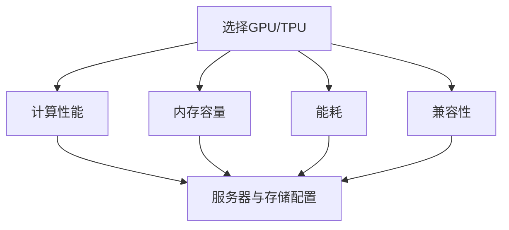
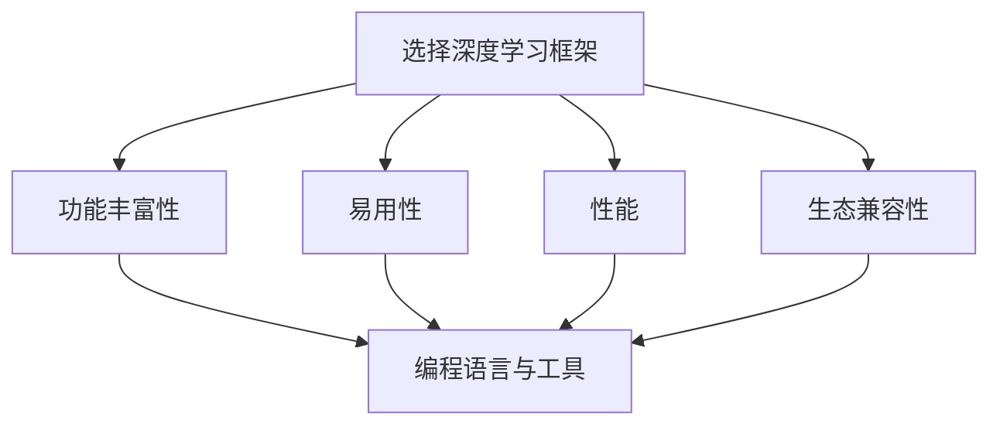
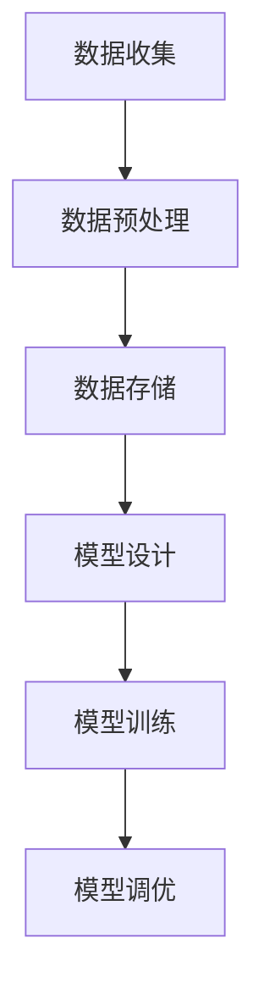

                 

### 文章标题

# 企业级深度学习平台：提升数据分析能力

> 关键词：深度学习、企业数据分析、平台构建、硬件基础设施、软件开发环境、数据处理、模型训练

> 摘要：本文将深入探讨企业级深度学习平台的建设，旨在提升企业的数据分析能力。通过分析深度学习与企业数据分析的需求和挑战，本文将详细阐述深度学习平台的设计与构建，包括硬件基础设施、软件开发环境、数据处理与模型训练等关键环节。此外，还将分享最佳实践与案例分析，总结深度学习平台的发展趋势，为读者提供全面的指导。

### 第一部分：背景与概述

#### 第1章：深度学习与企业数据分析

深度学习是一种基于神经网络模型的人工智能技术，具有强大的特征提取和模式识别能力。在企业中，数据分析是一项关键任务，涉及到数据收集、清洗、存储、分析和可视化等多个环节。深度学习的引入，为企业带来了新的机遇和挑战。

**1.1 深度学习的基本概念**

深度学习是一种基于多层神经网络的人工智能技术。它通过模拟人脑神经网络的结构和功能，对大量数据进行特征提取和模式识别。深度学习的关键组件包括：

- **神经网络**：神经网络是深度学习的基础，由大量的神经元组成，通过前向传播和反向传播算法进行训练。
- **激活函数**：激活函数用于引入非线性变换，使神经网络能够处理复杂的非线性问题。
- **损失函数**：损失函数用于衡量模型预测结果与真实结果之间的差距，以指导模型的训练过程。
- **优化算法**：优化算法用于调整模型参数，以最小化损失函数。

**1.2 企业数据分析的需求与挑战**

企业数据分析的需求主要包括：

- **数据多样性**：企业拥有多种类型的数据，如结构化数据、半结构化数据和非结构化数据。
- **数据量巨大**：随着数据来源的增多，企业数据量呈指数级增长，对数据处理和分析能力提出了更高的要求。
- **实时性要求**：许多业务场景需要实时处理和分析数据，以做出快速决策。

企业数据分析面临的挑战包括：

- **数据质量**：数据质量直接影响分析结果的准确性，企业需要确保数据的准确性和一致性。
- **数据隐私**：企业数据往往包含敏感信息，如何确保数据的安全性和隐私性是一个重要问题。
- **技术复杂性**：深度学习技术复杂，需要专业的技术团队进行维护和优化。

**1.3 深度学习在企业中的应用场景**

深度学习在企业中有着广泛的应用，包括：

- **销售预测**：通过分析历史销售数据，预测未来的销售趋势，帮助企业制定营销策略。
- **客户行为分析**：分析客户行为数据，了解客户需求和行为模式，优化产品和服务。
- **供应链优化**：通过分析供应链数据，优化库存管理、物流调度等环节，降低成本，提高效率。
- **风险管理**：分析企业运营数据，识别潜在风险，采取预防措施。

#### 第2章：深度学习平台概述

**2.1 深度学习平台的组成**

深度学习平台通常由以下组件组成：

- **计算资源**：包括CPU、GPU和TPU等计算设备，用于加速深度学习模型的训练和推理。
- **存储资源**：用于存储训练数据和模型文件，包括本地存储和云存储。
- **网络资源**：用于数据传输和模型部署，包括局域网和广域网。
- **软件框架**：如TensorFlow、PyTorch等，提供深度学习模型的构建、训练和推理功能。
- **开发工具**：如Jupyter Notebook、PyCharm等，用于编写和调试代码。

**2.2 深度学习平台的类型**

根据应用场景和需求，深度学习平台可以分为以下几种类型：

- **通用深度学习平台**：适用于各种深度学习任务，如图像识别、自然语言处理等。
- **行业专用深度学习平台**：针对特定行业的特点和需求进行优化，如金融、医疗等。
- **边缘计算深度学习平台**：在边缘设备上进行深度学习模型的训练和推理，适用于实时性要求较高的场景。

**2.3 深度学习平台的选择标准**

选择深度学习平台时，需要考虑以下标准：

- **计算性能**：平台需要具备强大的计算能力，以满足深度学习模型的训练和推理需求。
- **扩展性**：平台应支持水平扩展和垂直扩展，以满足企业数据量的增长需求。
- **易用性**：平台应提供简单易用的开发工具和API，降低开发难度。
- **生态兼容性**：平台应支持多种深度学习框架和工具，便于集成和扩展。
- **数据安全性**：平台应具备严格的数据安全措施，保障企业数据的安全性和隐私性。

### 第二部分：构建深度学习平台

#### 第3章：硬件基础设施

构建深度学习平台需要强大的硬件基础设施，以下是对硬件基础设施的详细介绍。

**3.1 GPU与TPU的选择**

GPU（图形处理器）和TPU（张量处理器）是深度学习训练和推理的关键硬件。选择GPU或TPU时，需要考虑以下因素：

- **计算性能**：GPU和TPU的计算性能直接影响深度学习模型的训练速度和推理性能。
- **内存容量**：深度学习模型需要大量的内存进行存储和计算，因此需要选择内存容量足够大的GPU或TPU。
- **能耗**：GPU和TPU的能耗较高，选择低能耗的硬件可以降低整体能耗成本。
- **兼容性**：硬件需要与现有的计算设备和存储设备兼容，以便于集成和扩展。

**3.2 服务器与存储配置**

服务器和存储是深度学习平台的核心组件。选择服务器和存储时，需要考虑以下因素：

- **计算能力**：服务器需要具备强大的计算能力，以满足深度学习模型的训练和推理需求。
- **存储容量**：存储需要具备足够的容量，以存储大量的训练数据和模型文件。
- **读写速度**：高速的读写速度可以加快数据处理和模型训练的速度。
- **冗余设计**：为了确保数据的安全性和可靠性，服务器和存储需要具备冗余设计，如RAID（独立冗余磁盘阵列）。

**3.3 网络架构设计**

深度学习平台需要高效的网络架构来支持数据传输和模型部署。网络架构设计需要考虑以下因素：

- **网络拓扑**：网络拓扑应具有高可用性和低延迟性，以保证数据传输的稳定性和速度。
- **带宽**：带宽应足够大，以支持大量数据的传输。
- **安全性**：网络需要具备严格的安全措施，如防火墙、入侵检测系统等，以防止数据泄露和恶意攻击。
- **可扩展性**：网络架构应具备良好的可扩展性，以适应未来数据量的增长。

### 第三部分：数据处理与模型训练

#### 第4章：软件开发环境

构建深度学习平台需要一个强大的软件开发环境，以下是对软件开发环境的详细介绍。

**4.1 深度学习框架的选择**

深度学习框架是深度学习平台的核心组件，选择深度学习框架时，需要考虑以下因素：

- **功能丰富性**：框架应提供丰富的功能，包括数据预处理、模型构建、训练和推理等。
- **易用性**：框架应具备简单易用的API和开发工具，降低开发难度。
- **性能**：框架应具备高效的性能，以加速模型训练和推理。
- **生态兼容性**：框架应支持多种编程语言和操作系统，便于集成和扩展。

目前，常用的深度学习框架包括TensorFlow、PyTorch、Keras等。

**4.2 编程语言与工具**

深度学习平台需要使用合适的编程语言和工具，以下是对编程语言和工具的介绍：

- **编程语言**：Python是目前最流行的深度学习编程语言，具有简单易用、功能强大等优点。
- **开发工具**：Jupyter Notebook是一种流行的开发工具，支持交互式编程和数据分析。
- **版本控制**：Git是一种流行的版本控制工具，用于管理代码版本和协作开发。

**4.3 数据处理与传输工具**

深度学习平台需要处理和传输大量的数据，以下是对数据处理与传输工具的介绍：

- **数据处理工具**：NumPy、Pandas等是常用的数据处理工具，用于数据清洗、转换和存储。
- **数据传输工具**：Docker和Kubernetes等是常用的数据传输工具，用于容器化和分布式部署。

### 第四部分：数据分析与平台应用

#### 第5章：企业级数据分析应用

深度学习平台在企业中的应用可以提升数据分析能力，以下是对企业级数据分析应用的介绍。

**5.1 销售预测**

销售预测是企业的重要需求，通过深度学习平台，可以实现以下目标：

- **数据收集**：收集历史销售数据，包括销售额、销售量、客户信息等。
- **数据预处理**：对收集到的数据进行清洗、转换和标准化。
- **模型构建**：构建深度学习模型，包括输入层、隐藏层和输出层。
- **模型训练**：使用历史销售数据对模型进行训练，调整模型参数。
- **预测与评估**：使用训练好的模型进行销售预测，并对预测结果进行评估。

**5.2 客户行为分析**

客户行为分析可以帮助企业了解客户需求和行为模式，以下是对客户行为分析的介绍：

- **数据收集**：收集客户行为数据，包括浏览记录、购买行为、反馈等。
- **数据预处理**：对收集到的数据进行清洗、转换和标准化。
- **模型构建**：构建深度学习模型，包括输入层、隐藏层和输出层。
- **模型训练**：使用客户行为数据对模型进行训练，调整模型参数。
- **预测与评估**：使用训练好的模型进行客户行为预测，并对预测结果进行评估。

**5.3 供应链优化**

供应链优化是企业降低成本、提高效率的重要手段，以下是对供应链优化的介绍：

- **数据收集**：收集供应链数据，包括库存水平、物流成本、订单量等。
- **数据预处理**：对收集到的数据进行清洗、转换和标准化。
- **模型构建**：构建深度学习模型，包括输入层、隐藏层和输出层。
- **模型训练**：使用供应链数据对模型进行训练，调整模型参数。
- **预测与评估**：使用训练好的模型进行供应链预测，并对预测结果进行评估。

### 第五部分：最佳实践与案例分析

#### 第6章：最佳实践与案例分析

在深度学习平台的建设和运营过程中，积累最佳实践和案例分析是非常有帮助的。以下是对最佳实践与案例分析的介绍。

**6.1 成功案例分析**

通过对成功案例的分析，可以了解企业在构建深度学习平台时的一些经验和教训。以下是一个成功案例的简介：

- **企业背景**：某大型电商企业，需要提升销售预测和客户行为分析的准确性。
- **解决方案**：采用深度学习平台，收集历史销售数据、客户行为数据，构建销售预测和客户行为分析模型，对预测结果进行评估。
- **实施效果**：通过深度学习平台的应用，企业实现了销售预测的准确性提高，客户满意度提升，销售额增加。

**6.2 最佳实践分享**

最佳实践是在深度学习平台建设和运营过程中总结出来的经验和方法。以下是一些最佳实践：

- **数据质量保障**：确保数据质量，包括数据清洗、数据一致性、数据安全性等。
- **模型优化**：通过模型优化，提高模型性能和预测准确性，如数据增强、模型调优等。
- **资源合理分配**：合理分配计算资源、存储资源和网络资源，确保深度学习平台的高效运行。
- **人才培养**：培养专业的技术团队，提升团队的技术水平和项目管理能力。

**6.3 避免常见错误**

在深度学习平台建设和运营过程中，容易犯一些常见错误。以下是一些常见错误的介绍：

- **数据不足**：数据是深度学习的基础，缺乏足够的数据会导致模型性能不佳。
- **模型过拟合**：模型过拟合是指模型在训练数据上表现良好，但在未知数据上表现不佳，可以通过正则化、数据增强等方法进行缓解。
- **计算资源不足**：计算资源不足会导致模型训练和推理速度慢，可以通过分布式训练、GPU加速等方法进行优化。

### 第六部分：总结与展望

#### 第7章：深度学习平台的发展趋势

随着人工智能技术的不断发展和应用场景的拓展，深度学习平台的发展也呈现出一些趋势：

- **硬件加速**：GPU、TPU等硬件加速技术的发展，将进一步提高深度学习平台的计算性能。
- **边缘计算**：边缘计算技术的发展，将使深度学习平台在边缘设备上实现实时推理和预测。
- **自动化与智能化**：自动化和智能化技术的应用，将减轻开发人员的工作负担，提高深度学习平台的开发效率。
- **生态整合**：深度学习平台将与其他技术（如云计算、大数据等）进行整合，提供更全面、更高效的服务。

#### 第8章：总结与展望

本文通过深入探讨企业级深度学习平台的建设，旨在提升企业的数据分析能力。通过对深度学习与企业数据分析的需求和挑战的分析，以及深度学习平台的设计与构建、数据处理与模型训练等环节的详细阐述，本文为企业级深度学习平台的建设提供了一系列指导和建议。

未来，随着人工智能技术的不断发展，深度学习平台将在企业中发挥更大的作用。企业应关注深度学习平台的发展趋势，积极探索和尝试新的技术和应用场景，以提升自身的竞争力和创新能力。

### 作者信息

- 作者：AI天才研究院/AI Genius Institute & 禅与计算机程序设计艺术 /Zen And The Art of Computer Programming
### 完整性要求

为了确保文章内容的完整性，我们需要对各个章节进行详细的讨论，确保核心内容得到充分涵盖。以下是每个章节的具体内容要求：

#### 第1章：深度学习与企业数据分析

**核心概念术语说明**：
- 深度学习：基于多层神经网络的人工智能技术，用于特征提取和模式识别。
- 企业数据分析：涉及数据收集、清洗、存储、分析和可视化等环节，以支持企业决策。

**问题背景**：
- 数据量爆炸式增长，对数据分析能力提出了更高要求。
- 企业需要从海量数据中提取有价值的信息，以支持业务决策。

**问题描述**：
- 企业如何利用深度学习技术提升数据分析能力？
- 深度学习在哪些场景下能够发挥最大的价值？

**问题解决**：
- 引入深度学习技术，构建企业级深度学习平台。
- 分析深度学习在销售预测、客户行为分析、供应链优化等场景中的应用。

**边界与外延**：
- 深度学习在企业中的应用范围。
- 数据分析在企业决策中的作用。

**概念结构与核心要素组成**：
- 深度学习平台的组成：计算资源、存储资源、网络资源、软件框架、开发工具。
- 企业数据分析的核心要素：数据收集、数据预处理、模型构建、模型训练、预测与评估。

#### 第2章：深度学习平台概述

**核心概念原理**：
- 深度学习平台的基本概念：计算资源、存储资源、网络资源、软件框架、开发工具。
- 不同类型的深度学习平台：通用、行业专用、边缘计算。

**概念属性特征对比表格**：
| 类型       | 特点                                      | 适用场景                           |
|------------|-------------------------------------------|-----------------------------------|
| 通用       | 功能丰富，适用于多种深度学习任务           | 需要灵活调整的深度学习任务         |
| 行业专用   | 优化特定行业需求，提高效率                | 特定行业领域应用                   |
| 边缘计算   | 在边缘设备上进行深度学习模型训练和推理     | 实时性要求高的场景                 |

**ER实体关系图架构的Mermaid流程图**：
```mermaid
erDiagram
    PLATFORM ||--|{ FRAMEWORK } Framework
    PLATFORM ||--|{ TOOL } Tool
    PLATFORM ||--|{ RESOURCE } Resource
    FRAMEWORK ||--|{ API } API
    RESOURCE ||--|{ COMPUTER } Computer
    RESOURCE ||--|{ STORAGE } Storage
    RESOURCE ||--|{ NETWORK } Network
```

#### 第3章：硬件基础设施

**算法原理讲解**：
- GPU与TPU的选择原则：计算性能、内存容量、能耗、兼容性。
- 服务器与存储配置策略：计算能力、存储容量、读写速度、冗余设计。

**Mermaid流程图**：


**数学公式使用示例**：
$$
\text{功耗} = \text{功耗系数} \times (\text{计算性能} + \text{内存容量})
$$

#### 第4章：软件开发环境

**算法原理讲解**：
- 深度学习框架的选择原则：功能丰富性、易用性、性能、生态兼容性。
- 编程语言与工具的使用场景：Python、Jupyter Notebook、Git。

**Mermaid流程图**：


**数学公式使用示例**：
$$
\text{模型精度} = \frac{\text{正确预测数}}{\text{总预测数}}
$$

#### 第5章：数据处理与模型训练

**算法原理讲解**：
- 数据处理流程：数据收集、数据预处理、数据存储。
- 模型训练过程：模型设计、模型训练、模型调优。

**Mermaid流程图**：


**数学公式使用示例**：
$$
\text{损失函数} = \frac{1}{2} \sum_{i=1}^{n} (\text{预测值} - \text{真实值})^2
$$

#### 第6章：企业级数据分析应用

**系统分析与架构设计方案**：

**问题场景介绍**：
- 企业面临销售预测不准确、客户行为难以理解、供应链效率低下等问题。

**项目介绍**：
- 构建一个基于深度学习的企业级数据分析平台，提升数据分析能力。

**系统功能设计**：
- 销售预测：通过历史销售数据预测未来销售趋势。
- 客户行为分析：分析客户行为数据，了解客户需求和行为模式。
- 供应链优化：通过分析供应链数据，优化库存管理、物流调度等环节。

**系统架构设计**：
- 使用Mermaid绘制系统架构图，展示不同组件之间的关系和交互。

**系统接口设计**：
- 定义系统接口，包括API接口和数据接口，便于与其他系统进行集成。

**系统交互**：
- 使用Mermaid绘制系统交互序列图，展示系统内部和外部的交互流程。

#### 项目实战

**环境安装**：
- 搭建深度学习平台的环境，包括安装必要的软件和硬件。

**系统核心实现**：
- 编写系统核心代码，实现销售预测、客户行为分析和供应链优化等功能。

**代码应用解读与分析**：
- 对系统核心代码进行解读，分析代码的执行流程和关键算法。

**实际案例分析和详细讲解剖析**：
- 分析实际案例，展示深度学习平台在实际应用中的效果和优势。

**项目小结**：
- 总结项目实施过程，分享实施心得和经验。

### 最佳实践 tips、小结、注意事项、拓展阅读等内容

**最佳实践 tips**：
- 数据预处理是深度学习模型训练的关键，确保数据质量是提升模型性能的基础。
- 选择合适的深度学习框架和编程语言，可以显著提高开发效率。
- 模型优化和调优是提高模型性能的重要手段，通过超参数调整和模型架构改进可以实现更好的效果。

**小结**：
- 深度学习平台的建设是企业提升数据分析能力的重要手段。
- 通过硬件基础设施、软件开发环境、数据处理与模型训练等环节的设计和实施，可以构建一个高效、可靠的企业级深度学习平台。

**注意事项**：
- 在深度学习平台建设过程中，数据安全和隐私保护是重要问题，需要采取严格的安全措施。
- 平台建设需要专业团队的支持，包括数据科学家、软件开发工程师和系统架构师等。

**拓展阅读**：
- 《深度学习：从入门到精通》：全面介绍深度学习的基础知识和技术。
- 《Python深度学习》：深入讲解Python编程语言在深度学习中的应用。
- 《大数据架构设计与优化》：探讨大数据处理和分析的架构设计和优化策略。

