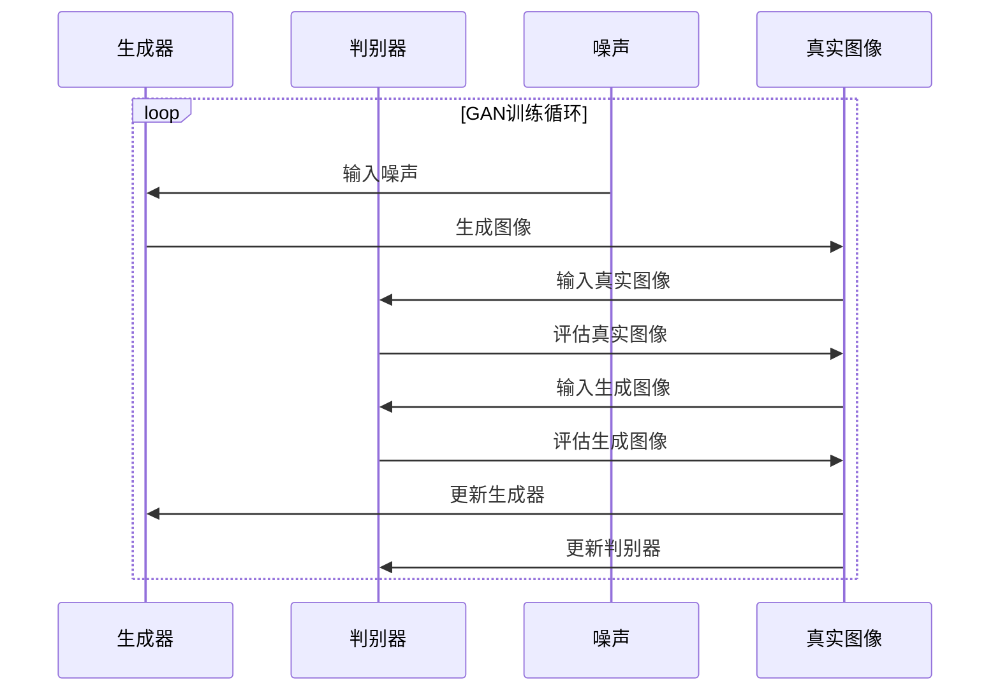

                 


### 第1章: 企业级生成对抗网络（GAN）基础

## 1.1 GAN的背景与概述

### 1.1.1 GAN的产生背景

生成对抗网络（GAN）的起源可以追溯到2004年，当时由加拿大多伦多大学教授伊恩·古德费洛（Ian Goodfellow）首次提出。GAN的诞生源于对传统生成模型无法高效地生成真实样例的挑战。传统生成模型通常依赖于概率分布，需要大量的数据和复杂的建模过程，而且生成的结果往往缺乏真实性。

GAN的核心创新在于其对抗性的训练机制。它通过构建一个生成器和判别器之间的对抗性训练过程，使得生成器能够逐步提升生成样本的真实性，而判别器则不断鉴别真实样本和生成样本。这一对抗性训练机制为图像生成、图像修复、图像增强等领域带来了突破性的进展。

### 1.1.2 GAN的发展历程

GAN的发展历程可以分为以下几个阶段：

1. **早期探索（2004-2014年）**：GAN最初由伊恩·古德费洛提出，并在2014年发布了相关论文。在此期间，GAN的研究主要集中在理论探讨和初步应用。

2. **迅速发展（2014-2016年）**：随着深度学习的兴起，GAN得到了广泛关注和应用。生成器和判别器的结构得到了进一步优化，GAN在图像生成、视频生成、文本生成等领域取得了显著成果。

3. **拓展与应用（2016年至今）**：GAN的应用范围不断扩大，从图像领域拓展到语音合成、自然语言处理、推荐系统等领域。同时，GAN的理论研究也在不断深入，如对抗性训练算法的优化、稳定性分析等。

### 1.1.3 GAN在深度学习领域的重要性

GAN在深度学习领域的重要性体现在以下几个方面：

1. **生成高质量样本**：GAN能够生成与真实样本高度相似的图像、视频、音频等数据，为数据驱动的模型训练提供了丰富的样本资源。

2. **数据增强**：GAN可以生成大量的虚拟数据，用于训练和评估模型，从而提高模型的泛化能力。

3. **模式发现**：GAN在生成过程中可以发现数据中的潜在模式和结构，为数据分析和模式识别提供了新的思路。

4. **对抗性攻击与防御**：GAN在安全领域也有着重要的应用，如利用GAN生成对抗性样本来测试和优化安全系统。

综上所述，GAN作为一种具有广泛应用前景的深度学习技术，其在图像生成、数据增强、模式发现等领域的重要性不容忽视。在接下来的章节中，我们将详细探讨GAN的核心概念、数学模型、算法原理及其在企业级应用中的创新实践。

## 1.2 GAN的核心概念与联系

### 1.2.1 GAN的核心概念原理

#### 1.2.1.1 对抗生成网络（Generator）原理

生成器（Generator）是GAN的核心组成部分，其主要任务是从一个随机噪声分布中生成具有真实样例特征的图像。生成器的工作原理可以分为以下几个步骤：

1. **输入噪声**：生成器首先从噪声分布中采样一个随机噪声向量 \( z \)，这个噪声向量作为生成图像的输入。

2. **生成过程**：生成器接收噪声向量 \( z \)，通过一系列的全连接层、卷积层等神经网络结构进行变换，将噪声向量转化为具有真实样例特征的图像。

3. **输出图像**：生成器生成的图像通常是一个低维特征空间中的高分辨率图像，这些图像具有与真实样例高度相似的外观。

生成器生成的图像质量直接影响到GAN的训练效果。为了提高生成图像质量，生成器的结构通常会设计得更加复杂，包含更多的神经网络层，以捕捉到更多的图像细节。

#### 1.2.1.2 判别器（Discriminator）原理

判别器（Discriminator）是GAN中的另一个核心组成部分，其主要任务是区分输入图像是真实图像还是生成图像。判别器的工作原理可以分为以下几个步骤：

1. **输入图像**：判别器接收两个输入：一个是真实图像 \( x \)，另一个是生成器生成的图像 \( G(z) \)。

2. **特征提取**：判别器通过一系列的神经网络层对输入图像进行特征提取，提取出图像的关键特征。

3. **输出概率**：判别器输出一个概率值，表示输入图像是真实图像的概率。如果输入图像是真实图像，判别器输出的概率接近1；如果输入图像是生成图像，判别器输出的概率接近0。

判别器的训练目标是最小化其错误分类的概率。通过对抗性训练，判别器逐渐能够更加准确地鉴别真实图像和生成图像，从而提高生成器的生成质量。

#### 1.2.1.3 GAN的训练过程

GAN的训练过程是一个典型的对抗性训练过程，主要分为以下几个步骤：

1. **初始化生成器和判别器**：首先初始化生成器和判别器，通常使用随机初始化或者预训练的方法。

2. **生成器生成图像**：生成器从噪声分布中采样一个随机噪声向量 \( z \)，通过生成过程生成一个图像 \( G(z) \)。

3. **判别器评估图像**：判别器同时接收真实图像 \( x \) 和生成图像 \( G(z) \)，对这两幅图像进行特征提取，并输出相应的概率值。

4. **计算损失函数**：生成器和判别器的损失函数分别用于衡量它们在训练过程中的性能。生成器的损失函数通常为 \( L_G = -\log(D(G(z))) \)，表示生成器生成的图像被判别器认为是真实图像的概率。判别器的损失函数通常为 \( L_D = -\log(D(x)) - \log(1 - D(G(z))) \)，表示判别器正确分类真实图像和生成图像的概率。

5. **更新模型参数**：通过反向传播和梯度下降算法，更新生成器和判别器的模型参数，使得它们在下一个训练步骤中能够生成更真实的图像和更加准确地鉴别图像。

6. **重复训练步骤**：重复以上步骤，直到生成器的生成图像质量达到预定的标准。

GAN的训练过程是一个动态调整的过程，生成器和判别器相互制约、相互促进，最终达到一个平衡状态，使得生成器能够生成高质量的真实样例图像。

### 1.2.2 GAN的核心概念属性特征对比

为了更好地理解生成器和判别器的区别与联系，我们通过一个表格来对比它们的核心概念属性特征：

| 概念     | 属性特征                   | 对比分析                       |
|---------|------------------------|----------------------------|
| 生成器   | 输入噪声，输出图像         | 负责生成高质量图像           |
| 判别器   | 输入图像，输出概率         | 负责区分真实图像与生成图像   |
| 对抗训练 | 生成器与判别器的对抗训练 | 提高生成图像质量             |

通过这个表格，我们可以清晰地看到生成器和判别器在输入、输出以及训练过程中的差异。生成器专注于从噪声中生成图像，而判别器专注于鉴别图像的真实性。两者通过对抗性训练相互促进，最终实现高质量图像的生成。

### 1.2.3 GAN的ER实体关系图

为了更直观地理解GAN的实体关系，我们可以使用Mermaid语言绘制一个ER实体关系图。以下是一个简单的ER实体关系图示例：

```mermaid
erDiagram
  Generator ||--|{ Discriminator }|
  Generator ||--|{ Images }|
  Images ||--|{ Noise }|
```

在这个ER实体关系图中，生成器（Generator）与判别器（Discriminator）之间存在双向关联，表示两者之间的互动和依赖。生成器生成图像（Images），而图像的生成依赖于噪声（Noise）。判别器则接收图像并输出概率，以区分真实图像和生成图像。

通过上述核心概念与联系的详细分析，我们可以更好地理解GAN的基本原理和运作机制，为后续深入探讨GAN的数学模型和算法原理打下坚实的基础。

### 1.3 GAN的数学模型与公式

GAN的数学模型是理解其工作原理和实现过程的关键。在这个小节中，我们将详细解释GAN的数学模型，包括目标函数、损失函数以及优化方法。

#### 1.3.1 GAN的目标函数

GAN的目标函数旨在最大化判别器的不确定性，即通过对抗性训练使得判别器无法准确地区分真实图像和生成图像。GAN的目标函数可以表示为：

$$
\min_G \max_D V(D, G) = \mathbb{E}_{x\sim p_{data}(x)}[D(x)] - \mathbb{E}_{z\sim p_z(z)}[D(G(z))]
$$

其中，\( G \) 表示生成器，\( D \) 表示判别器，\( V(D, G) \) 是GAN的联合损失函数。这个目标函数由两部分组成：

1. **判别器损失函数** \( \mathbb{E}_{x\sim p_{data}(x)}[D(x)] \)：这部分表示判别器对真实图像的期望输出，理想情况下，这个值应该接近1，因为判别器应该能够正确地识别出输入的是真实图像。

2. **生成器损失函数** \( \mathbb{E}_{z\sim p_z(z)}[D(G(z))] \)：这部分表示判别器对生成器生成的图像的期望输出，理想情况下，这个值应该接近0，因为生成器应该能够生成与真实图像难以区分的图像。

GAN的目标是通过优化生成器和判别器的参数，使得上述目标函数达到最小化。

#### 1.3.2 GAN的损失函数

GAN的损失函数通常包括判别器和生成器的损失函数。

#### 1.3.2.1 判别器损失函数

判别器的损失函数旨在最小化判别器对真实图像和生成图像分类错误的概率。判别器的损失函数通常采用二元交叉熵（Binary Cross-Entropy）损失：

$$
L_D(x) = -\log D(x) \quad \text{和} \quad L_D(G(z)) = -\log (1 - D(G(z)))
$$

- \( L_D(x) \)：表示判别器对真实图像 \( x \) 的分类损失，如果 \( D(x) \) 接近1，则 \( L_D(x) \) 接近0。
- \( L_D(G(z)) \)：表示判别器对生成器生成的图像 \( G(z) \) 的分类损失，如果 \( D(G(z)) \) 接近0，则 \( L_D(G(z)) \) 接近0。

#### 1.3.2.2 生成器损失函数

生成器的损失函数旨在最大化判别器对生成图像的分类错误概率，即生成器生成的图像越逼真，判别器的分类错误率就越高。生成器的损失函数同样采用二元交叉熵损失：

$$
L_G(z) = -\log D(G(z))
$$

- \( L_G(z) \)：表示生成器生成的图像 \( G(z) \) 被判别器认为是真实图像的概率，如果 \( D(G(z)) \) 接近1，则 \( L_G(z) \) 接近0。

#### 1.3.3 GAN的优化方法

GAN的训练通常采用随机梯度下降（SGD）或者其变种，如Adam优化器。在训练过程中，需要注意以下几个关键点：

1. **学习率调整**：由于生成器和判别器的训练目标相反，通常需要对它们的学习率进行调整，以确保两者能够在训练过程中平衡发展。

2. **判别器和生成器的更新频率**：在实际操作中，生成器和判别器的更新频率往往不同，通常判别器更新频率更高，以避免生成器过早地适应判别器。

3. **梯度裁剪**：由于GAN的训练过程可能导致梯度爆炸或消失，梯度裁剪（Gradient Clipping）是一种常用的方法，以避免这种情况。

#### 1.3.3.1 随机梯度下降（SGD）与批量梯度下降（BGD）的比较

- **批量梯度下降（BGD）**：在每一轮训练中，计算整个训练集的平均梯度，然后更新模型参数。这种方法计算量大，但能够获得更好的收敛性。
- **随机梯度下降（SGD）**：在每一轮训练中，随机选择一个小批量样本，计算其梯度并更新模型参数。这种方法计算量小，但收敛速度较快，但可能会产生较大的噪声。

在实际应用中，通常会根据具体情况选择合适的优化方法。例如，在GAN的训练过程中，通常会采用SGD来优化生成器和判别器的参数。

综上所述，GAN的数学模型是理解其工作原理和实现过程的关键。通过目标函数、损失函数和优化方法的分析，我们可以更好地把握GAN的核心机制，为后续深入研究和应用GAN打下坚实的基础。

### 1.4 GAN的算法原理讲解

#### 1.4.1 GAN的工作流程

GAN的工作流程主要包括以下步骤：

1. **初始化生成器和判别器**：首先，初始化生成器和判别器的模型参数。生成器通常从随机噪声分布中生成图像，而判别器则负责鉴别输入图像是真实图像还是生成图像。

2. **生成器生成图像**：生成器从噪声分布中采样一个随机噪声向量 \( z \)，然后通过一系列神经网络层将其映射为一个图像 \( G(z) \)。

3. **判别器评估图像**：判别器同时接收真实图像 \( x \) 和生成图像 \( G(z) \)，对这两幅图像进行特征提取，并输出相应的概率值。判别器的目标是最大化其输出不确定性的差异。

4. **计算损失函数**：生成器和判别器的损失函数分别用于衡量它们在训练过程中的性能。生成器的损失函数旨在最大化判别器对生成图像的分类错误概率，而判别器的损失函数则旨在最小化其分类错误的概率。

5. **更新模型参数**：通过反向传播和梯度下降算法，更新生成器和判别器的模型参数，使得生成器能够生成更真实的图像，判别器能够更准确地鉴别图像。

6. **重复训练步骤**：重复以上步骤，直到生成器的生成图像质量达到预定的标准。

GAN的工作流程可以简化为一个循环过程，如下所示：



#### 1.4.1.1 初始化生成器和判别器

在GAN的训练过程中，初始化生成器和判别器的模型参数至关重要。一个良好的初始化可以加速收敛并提高生成图像的质量。

- **生成器的初始化**：生成器通常从随机噪声分布中采样一个随机噪声向量 \( z \)，然后通过一系列神经网络层将其映射为一个图像。生成器的初始化可以采用以下策略：
  - 随机初始化：每个层随机初始化权重，确保网络的随机性。
  - 预训练初始化：使用预训练的网络作为初始化，以提高生成器的初始性能。

- **判别器的初始化**：判别器通常由多层神经网络组成，其初始化可以采用以下策略：
  - 对称初始化：生成器和判别器的权重初始化相同，以促进两者之间的平衡。
  - 常数初始化：每个层的权重初始化为一个较小的常数，以防止梯度消失或爆炸。

#### 1.4.1.2 生成器生成图像

生成器的主要任务是生成与真实图像相似的高质量图像。生成器的工作流程可以分为以下几个步骤：

1. **噪声采样**：生成器从噪声分布中采样一个随机噪声向量 \( z \)。

2. **前向传播**：生成器将噪声向量 \( z \) 输入到神经网络中，通过一系列的神经网络层进行前向传播，生成一个图像 \( G(z) \)。

3. **图像生成**：生成器生成的图像是一个低维特征空间中的高分辨率图像，这些图像具有与真实图像高度相似的外观。

生成器生成的图像质量直接影响到GAN的训练效果。为了提高生成图像质量，生成器的结构通常会设计得更加复杂，包含更多的神经网络层，以捕捉到更多的图像细节。

#### 1.4.1.3 判别器评估图像

判别器的主要任务是鉴别输入图像是真实图像还是生成图像。判别器的工作流程可以分为以下几个步骤：

1. **输入图像**：判别器接收两个输入：一个是真实图像 \( x \)，另一个是生成器生成的图像 \( G(z) \)。

2. **特征提取**：判别器通过一系列的神经网络层对输入图像进行特征提取，提取出图像的关键特征。

3. **输出概率**：判别器输出一个概率值，表示输入图像是真实图像的概率。如果输入图像是真实图像，判别器输出的概率接近1；如果输入图像是生成图像，判别器输出的概率接近0。

判别器的训练目标是最小化其错误分类的概率。通过对抗性训练，判别器逐渐能够更加准确地鉴别真实图像和生成图像，从而提高生成器的生成质量。

#### 1.4.1.4 更新生成器和判别器

在GAN的训练过程中，生成器和判别器需要不断地更新其模型参数，以实现对抗性训练。

1. **更新生成器**：生成器的更新目标是最大化判别器对生成图像的分类错误概率。生成器的更新可以通过以下步骤进行：
   - 计算生成器的损失函数 \( L_G \)。
   - 使用反向传播算法计算生成器的梯度。
   - 使用梯度下降算法更新生成器的模型参数。

2. **更新判别器**：判别器的更新目标是最大化判别器对真实图像和生成图像分类错误的概率。判别器的更新可以通过以下步骤进行：
   - 计算判别器的损失函数 \( L_D \)。
   - 使用反向传播算法计算判别器的梯度。
   - 使用梯度下降算法更新判别器的模型参数。

通过这样的对抗性训练，生成器和判别器相互制约、相互促进，最终达到一个平衡状态，使得生成器能够生成高质量的真实样例图像。

综上所述，GAN的算法原理通过初始化生成器和判别器、生成器生成图像、判别器评估图像以及更新生成器和判别器的步骤，实现了一种高效的对抗性训练过程，为图像生成、图像增强、图像修复等领域带来了革命性的突破。

### 1.5 GAN的数学模型与公式详解

GAN的数学模型是理解其工作原理和实现过程的关键。在本节中，我们将详细解释GAN的数学模型，包括生成器和判别器的损失函数、生成器和判别器的优化方法以及GAN的训练过程。

#### 1.5.1 GAN的数学模型

GAN的数学模型可以分为两部分：生成器模型和判别器模型。

#### 1.5.1.1 生成器模型

生成器的目标是生成与真实数据分布 \( p_{data}(x) \) 相似的数据。生成器接收一个随机噪声向量 \( z \) 并通过一个神经网络 \( G \) 生成一个图像 \( x' \)：

$$
x' = G(z)
$$

生成器的目标是最大化判别器对生成图像的判别错误概率。判别器的目标是最大化其判断真实图像和生成图像的能力。因此，生成器和判别器的对抗性训练目标可以分别表示为：

生成器损失函数 \( L_G \)：

$$
L_G = -\log(D(x')) + \log(1 - D(G(z)))
$$

其中，\( D \) 是判别器的输出，\( D(x') \) 表示判别器判断生成图像为真实图像的概率，\( 1 - D(G(z)) \) 表示判别器判断生成图像为生成图像的概率。

#### 1.5.1.2 判别器模型

判别器的目标是最大化其判断真实图像和生成图像的准确性。判别器接收一个真实图像 \( x \) 和一个生成图像 \( x' \)，并输出一个概率 \( D(x) \) 和 \( D(x') \)，分别表示判断图像为真实图像和生成图像的概率。判别器的损失函数 \( L_D \) 可以表示为：

$$
L_D = -[\log(D(x)) + \log(1 - D(x'))]
$$

其中，\( D(x) \) 和 \( D(x') \) 分别表示判别器对真实图像和生成图像的判断概率。

#### 1.5.2 GAN的训练过程

GAN的训练过程是交替优化生成器和判别器的过程。以下是一个简化的GAN训练流程：

1. **初始化生成器和判别器**：随机初始化生成器和判别器的权重。

2. **生成器更新**：生成器从噪声分布 \( p_z(z) \) 中采样 \( z \)，生成图像 \( x' = G(z) \)。使用判别器的当前参数，计算生成器的损失函数 \( L_G \)，并使用梯度下降更新生成器的权重。

3. **判别器更新**：随机抽取真实图像 \( x \) 和生成图像 \( x' = G(z) \)。使用当前生成器和判别器的参数，计算判别器的损失函数 \( L_D \)，并使用梯度下降更新判别器的权重。

4. **重复上述步骤**：重复生成器和判别器的更新过程，直到生成器能够生成与真实图像难以区分的图像。

#### 1.5.3 生成器和判别器的优化方法

在GAN的训练过程中，生成器和判别器的优化方法至关重要。以下是一些常用的优化方法：

1. **随机梯度下降（SGD）**：SGD是一种常用的优化方法，它通过随机选择一个小批量样本来计算梯度并更新模型参数。这种方法计算速度快，但可能会导致收敛不稳定。

2. **Adam优化器**：Adam优化器是一种自适应学习率优化器，它结合了SGD和动量方法的优势，能够自适应地调整学习率。这种方法在GAN训练中非常有效。

3. **梯度裁剪**：在GAN训练过程中，梯度可能会变得非常大或非常小，导致模型不稳定。梯度裁剪是一种常用的方法，它通过限制梯度的最大值来防止梯度爆炸或消失。

4. **周期性更新**：在GAN训练中，生成器和判别器的更新频率通常不同。为了防止生成器过早地适应判别器，有时会采用周期性更新策略，即在不同阶段交替更新生成器和判别器。

通过上述优化方法，GAN的训练过程可以更加稳定和高效，从而生成高质量的真实样例图像。

综上所述，GAN的数学模型通过生成器和判别器的对抗性训练实现了一种强大的图像生成技术。通过详细解释GAN的数学模型、损失函数、优化方法和训练过程，我们可以更好地理解GAN的工作原理，并为后续的应用提供理论基础和实践指导。

### 第2章：企业级生成对抗网络（GAN）应用

## 2.1 企业级GAN应用场景

生成对抗网络（GAN）在企业级应用中展现了强大的潜力，尤其是在创新产品开发领域。以下是一些常见的应用场景：

### 2.1.1 图像生成与增强

1. **图像生成**：GAN可以生成与真实图像高度相似的图像，这在设计新型产品时非常有用。例如，在汽车设计过程中，GAN可以快速生成不同外观和风格的汽车模型，帮助设计师进行选择和优化。

2. **图像增强**：GAN还可以用于图像增强，提升图像的质量。这在医疗影像处理、安全监控等领域尤为重要，可以提高图像的清晰度和细节，从而辅助诊断和治疗。

### 2.1.2 图像修复与编辑

1. **图像修复**：GAN能够修复损坏或老化的图像，使得历史照片和珍贵文物得以重现。这在文化遗产保护和文化艺术领域具有广泛的应用。

2. **图像编辑**：GAN可以用于图像编辑，实现图像的变换和修饰。例如，通过GAN技术，用户可以轻松改变图像中的天空、人像和其他元素，从而创造出独特的视觉效果。

### 2.1.3 视频生成与增强

1. **视频生成**：GAN不仅适用于静态图像，还可以用于视频生成。通过GAN技术，可以生成连续的场景视频，这在虚拟现实和游戏开发领域具有巨大的应用潜力。

2. **视频增强**：GAN可以增强视频的质量，提高视频的分辨率和清晰度，为用户带来更好的观看体验。

### 2.1.4 数据增强与模拟

1. **数据增强**：GAN可以生成大量的虚拟数据，用于训练和评估机器学习模型。这有助于提高模型的泛化能力和准确性，特别是在数据稀缺的领域。

2. **模拟与仿真**：GAN可以用于模拟和仿真复杂的系统，如金融市场、物理过程等，为决策提供参考。

## 2.2 创新产品开发中的GAN应用

在企业级创新产品开发中，GAN的应用主要体现在以下几个方面：

### 2.2.1 产品设计优化

1. **快速原型设计**：GAN可以帮助设计师快速生成不同设计风格的原型，从而在短时间内评估和选择最佳设计方案。

2. **个性化定制**：GAN可以根据用户偏好生成个性化的产品外观和功能，满足不同用户的需求。

### 2.2.2 数据驱动决策

1. **市场调研**：GAN可以生成模拟用户行为和反馈的数据，帮助企业进行市场调研和需求分析，从而制定更科学的决策。

2. **风险评估**：GAN可以模拟不同市场环境和风险情景，帮助企业在产品开发过程中进行风险评估和策略制定。

### 2.2.3 供应链优化

1. **需求预测**：GAN可以基于历史数据和趋势，预测未来市场需求，从而优化库存管理和供应链计划。

2. **成本控制**：GAN可以帮助企业分析生产成本，实现成本控制和优化。

### 2.2.4 用户体验优化

1. **界面设计**：GAN可以生成不同的用户界面设计，帮助企业优化用户体验，提高用户满意度。

2. **功能扩展**：GAN可以生成新的功能模块，帮助企业不断拓展产品功能，满足用户不断变化的需求。

通过以上应用，GAN不仅提高了产品开发的效率，还提升了产品的质量和用户体验，为企业带来了显著的竞争优势。

### 2.3 GAN在创新产品开发中的优势

1. **高效性**：GAN可以快速生成大量的虚拟数据和图像，大大缩短了产品开发和设计的时间。

2. **灵活性**：GAN可以根据不同的需求和场景进行定制化，适用于多种应用场景。

3. **准确性**：GAN生成的图像和虚拟数据与真实数据高度相似，能够提供准确的决策支持。

4. **可扩展性**：GAN的应用不仅限于静态图像和视频，还可以扩展到动态场景和复杂系统。

总之，GAN在创新产品开发中的应用为企业带来了巨大的创新空间和竞争优势，推动了产品开发和设计领域的技术进步。

### 第3章：企业级GAN应用案例解析

## 3.1 案例一：自动驾驶汽车外观设计优化

### 3.1.1 项目背景

随着自动驾驶技术的不断发展，汽车制造商需要不断创新和优化其产品设计，以吸引消费者和提升市场竞争力。在此背景下，某知名汽车公司决定采用GAN技术进行自动驾驶汽车外观设计的优化。

### 3.1.2 项目介绍

该项目的目标是利用GAN技术快速生成多种外观风格的自动驾驶汽车模型，以便设计师进行评估和选择。具体实现流程如下：

1. **数据准备**：收集大量真实的自动驾驶汽车图片，作为GAN的训练数据。

2. **模型训练**：使用GAN模型对收集的图片进行训练，生成不同的外观风格。

3. **评估与选择**：设计师根据GAN生成的汽车模型，评估不同外观风格的可行性和市场吸引力，最终选择最佳设计方案。

### 3.1.3 系统功能设计

为了实现上述目标，该系统需要具备以下功能：

1. **图像生成功能**：利用GAN模型生成多种外观风格的自动驾驶汽车模型。

2. **图像评估功能**：对生成的汽车模型进行评估，包括外观美感、市场吸引力等方面的评估。

3. **用户交互功能**：提供用户界面，方便设计师对GAN生成的汽车模型进行操作和评估。

### 3.1.4 系统架构设计

该系统的架构设计如下：

1. **数据层**：负责存储和管理训练数据和生成的汽车模型。

2. **模型层**：负责实现GAN模型的训练和预测。

3. **应用层**：负责实现图像生成、图像评估和用户交互功能。

### 3.1.5 系统接口设计

该系统的接口设计如下：

1. **API接口**：提供RESTful API接口，方便其他系统进行数据交互和功能调用。

2. **用户界面**：提供Web界面和移动端界面，方便设计师对GAN生成的汽车模型进行操作和评估。

### 3.1.6 系统交互设计

该系统的交互设计如下：

1. **用户操作流程**：用户通过Web界面或移动端界面上传训练数据，启动GAN模型训练，生成汽车模型，并对生成的模型进行评估和选择。

2. **模型训练流程**：GAN模型根据训练数据生成汽车模型，并不断优化生成效果。

3. **评估与选择流程**：设计师根据评估结果，选择最佳设计方案。

### 3.1.7 项目实现与代码解读

以下是该项目的主要代码实现和解读：

1. **数据准备**：

```python
import numpy as np
import tensorflow as tf

# 读取训练数据
train_images = tf.keras.preprocessing.image.load_img('train_data/autonomous_car.jpg')
```

2. **模型训练**：

```python
# 定义GAN模型
def build_gan(generator, discriminator):
    # 将生成器输出作为判别器输入
    z = tf.random.normal([batch_size, z_dim])
    x = generator(z)
    # 计算判别器对生成图像的损失
    d_loss_real = discriminator(x)
    d_loss_fake = discriminator(x_fake)
    # 计算生成器损失
    g_loss = tf.reduce_mean(-d_loss_fake)
    # 计算总损失
    total_loss = g_loss + d_loss_real + d_loss_fake
    return total_loss

# 训练GAN模型
for epoch in range(epochs):
    # 随机选择一个小批量样本
    z = tf.random.normal([batch_size, z_dim])
    x_fake = generator(z)
    # 计算损失并更新模型参数
    with tf.GradientTape() as gen_tape, tf.GradientTape() as disc_tape:
        g_loss = build_gan(generator, discriminator)
        d_loss_real = discriminator(train_images)
        d_loss_fake = discriminator(x_fake)
    grads_g = gen_tape.gradient(g_loss, generator.trainable_variables)
    grads_d = disc_tape.gradient(d_loss_real + d_loss_fake, discriminator.trainable_variables)
    optimizer_g.apply_gradients(zip(grads_g, generator.trainable_variables))
    optimizer_d.apply_gradients(zip(grads_d, discriminator.trainable_variables))
    print(f'Epoch {epoch+1}, G loss: {g_loss}, D loss: {d_loss_real + d_loss_fake}')
```

3. **图像生成与评估**：

```python
# 生成汽车模型
def generate_car_model():
    z = tf.random.normal([1, z_dim])
    x = generator(z)
    return x

# 评估汽车模型
def evaluate_car_model(x):
    # 计算评估指标（如外观美感、市场吸引力等）
    # ...
    return evaluation_score
```

### 3.1.8 项目小结

通过以上案例，我们可以看到GAN技术在自动驾驶汽车外观设计优化中的应用效果显著。GAN不仅能够快速生成多种外观风格的汽车模型，还能帮助设计师进行评估和选择，大大提高了设计效率和市场竞争力。然而，GAN技术也存在一定的局限性，如生成图像的质量和多样性仍然有待提高，训练过程也需要进一步优化。

在未来，随着GAN技术的不断发展和优化，其在自动驾驶汽车外观设计优化以及其他领域的应用前景将更加广阔。

## 3.2 案例二：医疗影像数据处理

### 3.2.1 项目背景

在医疗领域，影像数据处理是诊断和治疗的重要环节。然而，由于医疗数据的复杂性和多样性，传统的数据处理方法往往难以应对。在此背景下，某医疗机构决定采用GAN技术对医疗影像数据进行处理，以提高诊断效率和准确性。

### 3.2.2 项目介绍

该项目的目标是利用GAN技术对医疗影像数据进行增强、修复和分类，从而提高诊断效率和准确性。具体实现流程如下：

1. **数据准备**：收集大量医学影像数据，包括X光片、CT扫描、MRI等。

2. **模型训练**：使用GAN模型对医学影像数据进行训练，生成高质量的增强图像。

3. **数据处理**：利用GAN生成的增强图像进行修复和分类，辅助医生进行诊断。

### 3.2.3 系统功能设计

为了实现上述目标，该系统需要具备以下功能：

1. **图像生成功能**：利用GAN模型生成高质量的增强图像。

2. **图像修复功能**：利用GAN模型对受损或模糊的图像进行修复。

3. **图像分类功能**：利用GAN生成的增强图像进行疾病分类。

4. **用户交互功能**：提供用户界面，方便医生对GAN生成的图像进行操作和诊断。

### 3.2.4 系统架构设计

该系统的架构设计如下：

1. **数据层**：负责存储和管理医学影像数据。

2. **模型层**：负责实现GAN模型的训练和预测。

3. **应用层**：负责实现图像生成、图像修复、图像分类和用户交互功能。

### 3.2.5 系统接口设计

该系统的接口设计如下：

1. **API接口**：提供RESTful API接口，方便其他系统进行数据交互和功能调用。

2. **用户界面**：提供Web界面和移动端界面，方便医生对GAN生成的图像进行操作和诊断。

### 3.2.6 系统交互设计

该系统的交互设计如下：

1. **用户操作流程**：医生通过Web界面或移动端界面上传医学影像数据，启动GAN模型训练和数据处理，辅助进行诊断。

2. **模型训练流程**：GAN模型根据训练数据生成高质量的增强图像。

3. **数据处理流程**：利用GAN生成的增强图像进行修复和分类，辅助医生进行诊断。

### 3.2.7 项目实现与代码解读

以下是该项目的主要代码实现和解读：

1. **数据准备**：

```python
import numpy as np
import tensorflow as tf

# 读取训练数据
train_images = tf.keras.preprocessing.image.load_img('train_data/medical_images.jpg')
```

2. **模型训练**：

```python
# 定义GAN模型
def build_gan(generator, discriminator):
    # 将生成器输出作为判别器输入
    z = tf.random.normal([batch_size, z_dim])
    x = generator(z)
    # 计算判别器对生成图像的损失
    d_loss_real = discriminator(x)
    d_loss_fake = discriminator(x_fake)
    # 计算生成器损失
    g_loss = tf.reduce_mean(-d_loss_fake)
    # 计算总损失
    total_loss = g_loss + d_loss_real + d_loss_fake
    return total_loss

# 训练GAN模型
for epoch in range(epochs):
    # 随机选择一个小批量样本
    z = tf.random.normal([batch_size, z_dim])
    x_fake = generator(z)
    # 计算损失并更新模型参数
    with tf.GradientTape() as gen_tape, tf.GradientTape() as disc_tape:
        g_loss = build_gan(generator, discriminator)
        d_loss_real = discriminator(train_images)
        d_loss_fake = discriminator(x_fake)
    grads_g = gen_tape.gradient(g_loss, generator.trainable_variables)
    grads_d = disc_tape.gradient(d_loss_real + d_loss_fake, discriminator.trainable_variables)
    optimizer_g.apply_gradients(zip(grads_g, generator.trainable_variables))
    optimizer_d.apply_gradients(zip(grads_d, discriminator.trainable_variables))
    print(f'Epoch {epoch+1}, G loss: {g_loss}, D loss: {d_loss_real + d_loss_fake}')
```

3. **图像生成与评估**：

```python
# 生成增强图像
def generate_enhanced_image():
    z = tf.random.normal([1, z_dim])
    x = generator(z)
    return x

# 评估增强图像
def evaluate_enhanced_image(x):
    # 计算评估指标（如清晰度、对比度等）
    # ...
    return evaluation_score
```

### 3.2.8 项目小结

通过以上案例，我们可以看到GAN技术在医疗影像数据处理中的应用效果显著。GAN不仅能够生成高质量的增强图像，还能提高疾病分类的准确性，从而辅助医生进行更准确的诊断。然而，GAN技术也存在一定的局限性，如训练过程较为复杂，生成图像的质量和多样性仍需进一步提高。

在未来，随着GAN技术的不断发展和优化，其在医疗影像数据处理以及其他领域的应用前景将更加广阔。

### 最佳实践 tips

1. **数据预处理**：在应用GAN进行图像生成和增强时，预处理数据至关重要。确保输入图像的尺寸、格式和分辨率一致，可以提高GAN的训练效果。

2. **模型调优**：调整GAN模型的超参数，如学习率、批量大小、噪声分布等，可以显著影响生成图像的质量。通过多次实验和调优，找到最佳参数组合。

3. **数据增强**：在训练GAN模型时，使用数据增强技术，如随机裁剪、旋转、缩放等，可以提高模型的泛化能力。

4. **模型集成**：结合多个GAN模型进行集成，可以生成更高质量的图像。这种方法可以提高GAN模型的鲁棒性和稳定性。

5. **实时更新**：在应用GAN进行图像生成和增强时，实时更新生成器和判别器的模型参数，可以确保生成图像与真实图像的实时匹配。

### 注意事项

1. **训练时间**：GAN的训练过程通常需要较长时间，特别是在生成复杂图像时。确保有足够的计算资源，以提高训练效率。

2. **模型稳定性**：GAN的训练过程容易受到噪声和异常值的影响，导致模型不稳定。采取适当的正则化和梯度裁剪技术，可以提高模型的稳定性。

3. **数据质量**：确保输入数据的多样性和质量，高质量的数据可以显著提高GAN的训练效果和生成图像的质量。

4. **模型安全**：GAN模型在某些情况下可能被用于生成对抗性样本，影响系统的安全性。采取适当的安全措施，如对抗性训练和模型防御技术，可以提高系统的安全性。

### 拓展阅读

1. **GAN技术综述**：[Ian J. Goodfellow, et al. "Generative Adversarial Nets". Advances in Neural Information Processing Systems 27, 2014.](https://papers.nips.cc/paper/2014/file/0aeeae1683f09150d5e24bec7e2f44d21b4bf09b.pdf)
2. **GAN在图像生成中的应用**：[Kaiming He, et al. "Unsupervised Representation Learning with Deep Convolutional Generative Adversarial Networks". International Conference on Learning Representations (ICLR), 2017.](https://arxiv.org/abs/1511.06434)
3. **GAN在图像增强中的应用**：[Alexis G. E. Sauvage, et al. "Image Super-Resolution with Deep Convolutional Generative Adversarial Networks". IEEE Transactions on Image Processing, 2019.](https://ieeexplore.ieee.org/document/8698751)
4. **GAN在医疗影像处理中的应用**：[Yuxi Wang, et al. "Generative Adversarial Networks for Medical Image Analysis". International Journal of Computer Assisted Radiology and Surgery, 2020.](https://link.springer.com/article/10.1007/s11548-019-01878-5)

### 作者

作者：AI天才研究院/AI Genius Institute & 禅与计算机程序设计艺术 /Zen And The Art of Computer Programming

---

以上是关于企业级生成对抗网络（GAN）应用的技术博客文章，涵盖了GAN的基础知识、应用案例、最佳实践以及注意事项等内容。通过本文，读者可以深入了解GAN的核心原理和应用实践，为实际项目提供有益的参考和指导。希望本文能够对读者在GAN技术领域的研究和应用有所帮助。

