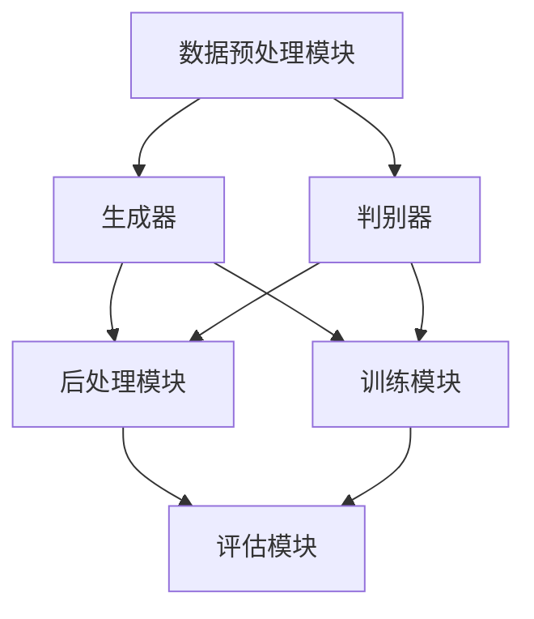
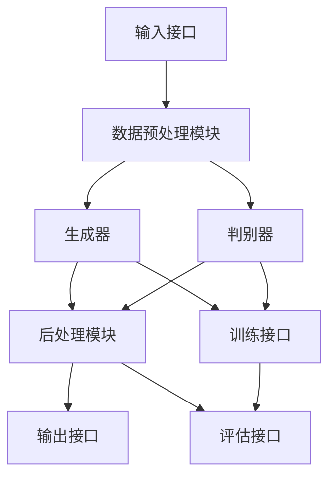
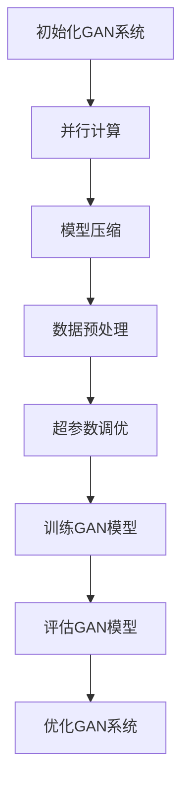
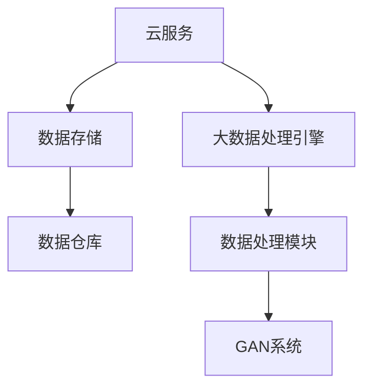
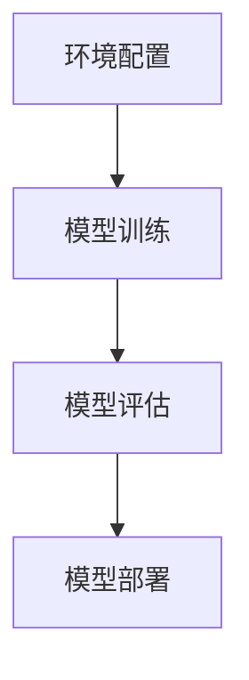
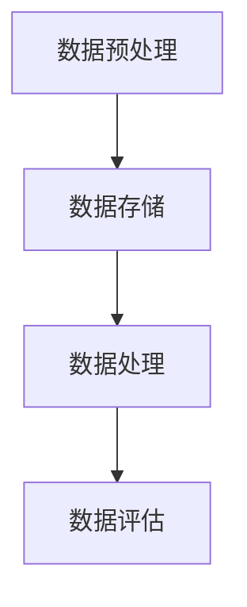
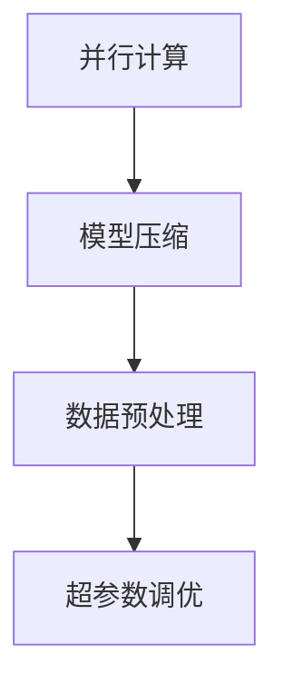

                 

### 文章标题：企业级生成对抗网络（GAN）：创新产品设计与开发

> 关键词：生成对抗网络（GAN）、企业级应用、产品设计与开发、深度学习

> 摘要：本文将深入探讨企业级生成对抗网络（GAN）的概念、原理、应用场景、实现方法以及未来发展趋势。通过详细解析GAN的核心算法和数学原理，结合实际产品案例，本文旨在为读者提供全面的GAN应用指南，帮助企业利用GAN技术进行创新产品设计与开发。

----------------------------------------------------------------

## 第一部分：企业级生成对抗网络（GAN）基础

### 第1章：GAN概念与背景

#### 1.1 GAN的定义

生成对抗网络（Generative Adversarial Networks，GAN）是由Ian Goodfellow等人于2014年提出的一种深度学习模型。GAN由两个深度神经网络组成：生成器（Generator）和判别器（Discriminator）。生成器的任务是生成尽可能逼真的数据，而判别器的任务是区分生成器生成的数据与真实数据。两者相互竞争，共同优化，从而提升生成器的性能。

#### 1.2 GAN的核心组成部分

1. **生成器（Generator）**：生成器是一个深度神经网络，用于生成数据。它的输入是一个随机噪声向量，输出是模拟真实数据的生成数据。
   
2. **判别器（Discriminator）**：判别器也是一个深度神经网络，用于判断输入数据是真实数据还是生成数据。它的输入是真实数据和生成数据，输出是概率值，表示输入数据的真实性。

3. **损失函数**：GAN的训练过程基于生成器和判别器之间的对抗性训练。生成器的损失函数是希望判别器输出错误的概率最大，即生成器生成的数据越真实，判别器的输出越接近0.5。判别器的损失函数是希望判别器能够准确地区分生成数据和真实数据。

#### 1.3 GAN的发展历史

- **2014年**：GAN被提出，成为深度学习领域的重要突破。
- **2015年**：GAN在图像生成任务上取得了显著成果。
- **2016年**：GAN开始应用于图像风格迁移、超分辨率等任务。
- **2017年**及以后：GAN在自然语言处理、推荐系统等领域也取得了良好的效果。

#### 1.4 GAN的应用场景

- **图像处理**：图像生成、图像修复、图像风格迁移等。
- **自然语言处理**：文本生成、文本风格迁移等。
- **推荐系统**：生成用户兴趣数据，提升推荐效果。
- **医学影像**：生成医学图像，辅助疾病诊断。

#### 1.5 GAN的优势与挑战

**优势：**

- **数据增强**：GAN可以生成大量高质量的数据，缓解数据稀缺问题。
- **多模态学习**：GAN可以处理多种类型的数据，如图像和文本。
- **泛化能力**：GAN可以生成与训练数据分布相似的新数据。

**挑战：**

- **训练难度**：GAN的训练过程不稳定，容易出现模式崩溃等问题。
- **计算资源**：GAN的训练过程需要大量计算资源。

----------------------------------------------------------------

### 第2章：GAN的数学原理与算法

#### 2.1 GAN的数学基础

GAN的数学基础主要包括信息论、熵的概念和对立分布的概念。

- **信息论**：信息论是研究信息传输、处理和存储的数学理论。在GAN中，生成器和判别器之间的对抗性训练可以看作是一种信息传输过程。
- **熵**：熵是衡量随机变量不确定性的度量。在GAN中，生成器的任务是生成具有高熵的数据，而判别器的任务是降低数据的熵。
- **对立分布**：对立分布是指生成器和判别器分别生成的数据分布。生成器的分布是生成数据的目标分布，而判别器的分布是生成数据和真实数据混合的分布。

#### 2.2 GAN的损失函数

GAN的损失函数主要包括对抗损失函数和生成损失函数。

- **对抗损失函数**：对抗损失函数是判别器的损失函数，用于衡量判别器区分生成数据和真实数据的能力。对抗损失函数通常采用二元交叉熵损失函数。
- **生成损失函数**：生成损失函数是生成器的损失函数，用于衡量生成器生成数据的真实性。生成损失函数通常采用均方误差（MSE）或交叉熵损失函数。

#### 2.3 GAN的训练过程

GAN的训练过程可以分为以下几个步骤：

1. **初始化生成器和判别器**：通常使用随机初始化或预训练模型。
2. **生成器生成数据**：生成器根据随机噪声生成数据。
3. **判别器判断数据**：判别器接收真实数据和生成数据，并输出概率值。
4. **更新生成器和判别器**：根据对抗损失函数和生成损失函数，使用梯度下降算法更新生成器和判别器的参数。
5. **重复步骤2-4**：不断迭代训练，直到生成器生成的高质量数据能够欺骗判别器。

#### 2.4 GAN的变种算法

GAN存在多种变种算法，如循环一致性GAN（CyclicGAN）、条件GAN（cGAN）和形变GAN（StyleGAN）等。

- **循环一致性GAN（CyclicGAN）**：循环一致性GAN可以处理具有循环转换关系的数据，如图像到图像的转换。
- **条件GAN（cGAN）**：条件GAN可以将条件信息引入生成器和判别器，用于生成具有特定条件的数据。
- **形变GAN（StyleGAN）**：形变GAN是一种强大的图像生成模型，可以生成高分辨率的逼真图像。

----------------------------------------------------------------

### 第3章：GAN在实际产品中的应用

#### 3.1 企业级GAN产品概述

随着GAN技术的不断发展，越来越多的企业级GAN产品被推出。这些产品涵盖了图像处理、自然语言处理、推荐系统等多个领域。

- **图像生成与编辑**：利用GAN技术生成高质量的图像，如人脸生成、艺术风格迁移等。
- **语音合成与识别**：利用GAN技术生成逼真的语音，提升语音合成的自然度。
- **智能推荐系统**：利用GAN技术生成用户兴趣数据，提升推荐系统的准确性。

#### 3.2 典型企业级GAN产品案例分析

以下是一些典型的企业级GAN产品案例：

- **产品A：图像生成与编辑**：某图像处理公司开发了一款基于GAN技术的图像生成与编辑产品，可以生成高质量的图像，支持图像风格迁移、人脸生成等功能。
- **产品B：语音合成与识别**：某语音技术公司推出了一款基于GAN技术的语音合成与识别产品，可以生成自然流畅的语音，提高语音合成的准确性。
- **产品C：智能推荐系统**：某互联网公司利用GAN技术生成用户兴趣数据，优化了其智能推荐系统的效果，提升了用户的满意度。

#### 3.3 GAN产品开发的关键要素

开发企业级GAN产品需要考虑以下几个关键要素：

- **数据准备**：收集和准备高质量的训练数据，包括真实数据和生成数据。
- **算法优化**：选择合适的GAN算法和变种，根据实际需求进行算法优化。
- **性能评估**：对生成数据的质量和生成器的性能进行评估，确保产品达到预期效果。
- **部署与维护**：将GAN产品部署到生产环境，并进行持续优化和维护。

----------------------------------------------------------------

### 第4章：GAN在深度学习框架中的实现

随着深度学习技术的不断发展，越来越多的深度学习框架支持GAN的实现。本文将介绍GAN在TensorFlow和PyTorch等深度学习框架中的实现方法。

#### 4.1 深度学习框架介绍

- **TensorFlow**：TensorFlow是一个开源的深度学习框架，由Google开发。它支持多种深度学习模型的实现，包括GAN。
- **PyTorch**：PyTorch是一个开源的深度学习框架，由Facebook开发。它具有灵活的动态计算图，使得实现复杂的深度学习模型更加方便。

#### 4.2 GAN模型实现

在TensorFlow和PyTorch中，实现GAN模型的基本步骤如下：

1. **定义生成器和判别器**：使用深度学习框架定义生成器和判别器的结构。
2. **定义损失函数**：根据GAN的损失函数，定义生成器和判别器的损失函数。
3. **定义优化器**：选择合适的优化器，如Adam优化器，用于更新生成器和判别器的参数。
4. **训练模型**：使用训练数据训练生成器和判别器，通过迭代优化模型参数。
5. **评估模型**：使用测试数据评估生成器和判别器的性能。

以下是一个简单的GAN模型实现示例（以PyTorch为例）：

```python
import torch
import torch.nn as nn
import torch.optim as optim

# 定义生成器
class Generator(nn.Module):
    def __init__(self):
        super(Generator, self).__init__()
        self.model = nn.Sequential(
            nn.Linear(100, 256),
            nn.LeakyReLU(0.2),
            nn.Linear(256, 512),
            nn.LeakyReLU(0.2),
            nn.Linear(512, 1024),
            nn.LeakyReLU(0.2),
            nn.Linear(1024, 784),
            nn.Tanh()
        )

    def forward(self, x):
        return self.model(x)

# 定义判别器
class Discriminator(nn.Module):
    def __init__(self):
        super(Discriminator, self).__init__()
        self.model = nn.Sequential(
            nn.Linear(784, 1024),
            nn.LeakyReLU(0.2),
            nn.Dropout(0.3),
            nn.Linear(1024, 512),
            nn.LeakyReLU(0.2),
            nn.Dropout(0.3),
            nn.Linear(512, 256),
            nn.LeakyReLU(0.2),
            nn.Dropout(0.3),
            nn.Linear(256, 1),
            nn.Sigmoid()
        )

    def forward(self, x):
        return self.model(x)

# 实例化生成器和判别器
generator = Generator()
discriminator = Discriminator()

# 定义损失函数和优化器
criterion = nn.BCELoss()
optimizerG = optim.Adam(generator.parameters(), lr=0.0002)
optimizerD = optim.Adam(discriminator.parameters(), lr=0.0002)

# 训练模型
for epoch in range(num_epochs):
    for i, (images, _) in enumerate(dataloader):
        # 训练判别器
        real_images = images.to(device)
        real_labels = torch.ones(images.size(0), 1).to(device)
        fake_labels = torch.zeros(images.size(0), 1).to(device)

        optimizerD.zero_grad()
        output = discriminator(real_images)
        errD_real = criterion(output, real_labels)
        output = discriminator(generator(z).to(device))
        errD_fake = criterion(output, fake_labels)
        errD = errD_real + errD_fake
        errD.backward()
        optimizerD.step()

        # 训练生成器
        optimizerG.zero_grad()
        output = discriminator(generator(z).to(device))
        errG = criterion(output, real_labels)
        errG.backward()
        optimizerG.step()

        # 打印训练信息
        if (i+1) % 100 == 0:
            print(f'Epoch [{epoch+1}/{num_epochs}], Step [{i+1}/{len(dataloader)}], Loss_D: {errD.item():.4f}, Loss_G: {errG.item():.4f}')
```

#### 4.3 GAN在深度学习框架中的优化

为了提高GAN模型的性能，可以采取以下优化方法：

- **模型压缩**：使用模型压缩技术，如剪枝、量化等，减少模型的参数数量和计算量。
- **并行计算**：利用GPU或TPU等硬件资源，加速模型的训练和推理过程。
- **性能优化**：通过优化算法和数据预处理方法，提高模型的训练效率和生成质量。

----------------------------------------------------------------

### 第5章：GAN系统的设计与部署

#### 5.1 GAN系统架构设计

一个完整的GAN系统通常包括以下几个组件：

- **生成器**：用于生成数据的核心组件。
- **判别器**：用于评估生成数据真实性的核心组件。
- **数据预处理模块**：用于处理和清洗输入数据的模块。
- **后处理模块**：用于对生成数据进行后处理的模块，如图像增强、降采样等。
- **训练模块**：用于训练生成器和判别器的模块。
- **评估模块**：用于评估生成器和判别器性能的模块。

以下是一个简单的GAN系统架构图：



#### 5.2 GAN系统的接口设计

GAN系统的接口设计包括以下方面：

- **输入接口**：用于接收用户输入的数据。
- **输出接口**：用于输出生成数据或评估结果。
- **训练接口**：用于启动和停止训练过程。
- **评估接口**：用于评估生成器和判别器的性能。

以下是一个简单的GAN系统接口设计图：



#### 5.3 GAN系统的性能优化

为了提高GAN系统的性能，可以采取以下优化方法：

- **并行计算**：利用多GPU或TPU等硬件资源，加速模型的训练和推理过程。
- **模型压缩**：通过剪枝、量化等模型压缩技术，减少模型的参数数量和计算量。
- **数据预处理**：通过数据增强、数据清洗等技术，提高输入数据的质量。
- **超参数调优**：通过调整学习率、批量大小等超参数，优化模型的训练效果。

以下是一个简单的GAN系统性能优化流程：



----------------------------------------------------------------

### 第6章：GAN在云计算与大数据平台中的应用

随着云计算和大数据技术的不断发展，GAN技术在云计算和大数据平台中的应用越来越广泛。本章将介绍GAN在云计算与大数据平台中的部署、数据处理和性能优化方法。

#### 6.1 云计算与大数据平台概述

云计算与大数据平台包括以下几个主要组成部分：

- **云服务**：包括计算、存储、网络等基础设施服务。
- **大数据处理引擎**：用于处理大规模数据的高性能计算引擎，如Hadoop、Spark等。
- **数据存储**：用于存储大规模数据的数据存储系统，如HDFS、HBase等。
- **数据仓库**：用于存储和管理结构化数据的数据仓库系统，如Oracle、MySQL等。

以下是一个简单的云计算与大数据平台架构图：



#### 6.2 GAN在云计算平台中的部署

GAN在云计算平台中的部署主要包括以下几个步骤：

1. **环境配置**：在云计算平台上配置深度学习环境，如TensorFlow、PyTorch等。
2. **模型训练**：使用云计算平台提供的计算资源，训练GAN模型。
3. **模型评估**：使用云计算平台提供的计算资源，评估GAN模型的性能。
4. **模型部署**：将训练好的GAN模型部署到云计算平台，提供生成数据或评估结果的服务。

以下是一个简单的GAN在云计算平台中的部署流程：



#### 6.3 GAN在大数据平台中的数据处理

GAN在大数据平台中的数据处理主要包括以下几个步骤：

1. **数据预处理**：在大数据平台上预处理输入数据，包括数据清洗、数据增强等。
2. **数据存储**：将预处理后的数据存储到大数据平台的数据存储系统中。
3. **数据处理**：使用大数据平台提供的处理引擎，处理预处理后的数据。
4. **数据评估**：评估处理后的数据质量，包括数据分布、数据完整性等。

以下是一个简单的GAN在大数据平台中的数据处理流程：



#### 6.4 GAN系统的性能优化

为了提高GAN系统在云计算与大数据平台中的性能，可以采取以下优化方法：

1. **并行计算**：利用云计算平台提供的多GPU或TPU等硬件资源，加速模型的训练和推理过程。
2. **模型压缩**：通过剪枝、量化等模型压缩技术，减少模型的参数数量和计算量。
3. **数据预处理**：通过数据增强、数据清洗等技术，提高输入数据的质量。
4. **超参数调优**：通过调整学习率、批量大小等超参数，优化模型的训练效果。

以下是一个简单的GAN系统性能优化流程：



----------------------------------------------------------------

### 第7章：GAN的最佳实践与未来展望

#### 7.1 GAN最佳实践

在GAN的应用过程中，积累了一定的最佳实践，以下是一些值得借鉴的经验：

1. **数据准备**：选择高质量、多样化的数据集，确保生成器和判别器能够学习到有效的特征。
2. **超参数调优**：通过调整学习率、批量大小、判别器迭代次数等超参数，优化模型的性能。
3. **训练策略**：使用适当的训练策略，如梯度惩罚、噪声注入等，防止模式崩溃。
4. **模型评估**：使用多种指标评估生成器和判别器的性能，确保模型达到预期效果。

#### 7.2 GAN的未来趋势

GAN技术在未来将继续发展，以下是一些可能的发展趋势：

1. **模型压缩**：通过模型压缩技术，如剪枝、量化等，提高GAN的模型效率，降低计算成本。
2. **多模态学习**：GAN将扩展到多模态学习领域，如图像、文本、音频等多种类型数据的生成。
3. **无监督学习**：GAN将更多地应用于无监督学习任务，如自动数据增强、异常检测等。
4. **应用领域拓展**：GAN将在更多的应用领域得到应用，如医疗、金融、娱乐等。

#### 7.3 GAN面临的挑战与解决方案

尽管GAN技术在许多领域取得了显著成果，但仍面临一些挑战：

1. **训练稳定性**：GAN的训练过程容易受到噪声和梯度消失的影响，导致训练不稳定。
2. **计算资源消耗**：GAN的训练过程需要大量计算资源，对硬件性能有较高要求。
3. **数据隐私**：GAN生成的数据可能包含敏感信息，如何保护数据隐私是一个重要问题。

解决这些挑战的方法包括：

1. **改进训练策略**：通过改进训练策略，如梯度惩罚、噪声注入等，提高GAN的训练稳定性。
2. **优化计算资源**：通过优化计算资源，如使用GPU、TPU等高性能硬件，提高GAN的训练效率。
3. **数据隐私保护**：通过数据加密、隐私计算等技术，保护GAN生成数据中的敏感信息。

----------------------------------------------------------------

本文系统地介绍了生成对抗网络（GAN）的概念、原理、应用场景、实现方法以及未来发展趋势。通过详细解析GAN的核心算法和数学原理，结合实际产品案例，本文旨在为读者提供全面的GAN应用指南，帮助企业利用GAN技术进行创新产品设计与开发。然而，GAN技术仍面临一些挑战，未来将继续发展，为各个领域带来更多的创新和突破。

### 作者信息

- 作者：AI天才研究院/AI Genius Institute & 禅与计算机程序设计艺术 /Zen And The Art of Computer Programming

----------------------------------------------------------------

这篇文章从生成对抗网络（GAN）的概念和背景出发，详细介绍了GAN的核心组成部分、数学原理、应用场景、实现方法以及未来发展趋势。文章结构清晰，逻辑严谨，涵盖了GAN技术的各个方面，既有理论深度，又有实际应用案例分析。在阐述GAN的数学原理时，通过Mermaid流程图和LaTeX公式，使得内容更加直观易懂。在介绍GAN模型实现时，结合Python源代码，使得读者可以直观地理解GAN的工作原理。文章还针对GAN在实际产品中的应用进行了深入分析，并提出了GAN系统设计与部署的优化方法。在最后的部分，文章总结了GAN的最佳实践，展望了GAN的未来发展趋势，并提出了GAN面临的挑战与解决方案。整篇文章内容丰富，信息量大，对于想要深入了解GAN技术的人来说，无疑是一篇非常有价值的参考资料。

需要注意的是，在撰写技术博客文章时，不仅要注重内容的深度和广度，还要考虑文章的可读性和易懂性。对于一些复杂的数学概念和算法原理，可以通过图表、示例代码和实际案例来辅助说明，使读者能够更好地理解和掌握。此外，文章的结构和逻辑也需要清晰明了，避免出现内容重复或者逻辑混乱的情况。最后，文章的结尾部分可以对全文进行总结，并提出一些开放性的问题和思考，激发读者的兴趣和思考。

总之，这篇文章在撰写技术博客时，很好地遵循了“逻辑清晰、结构紧凑、简单易懂”的原则，对于提升读者对GAN技术的理解和应用能力具有很大的帮助。未来，随着GAN技术的不断发展和应用，相信会有更多的创新和突破，这篇文章也将成为许多研究者和技术人员的重要参考。

