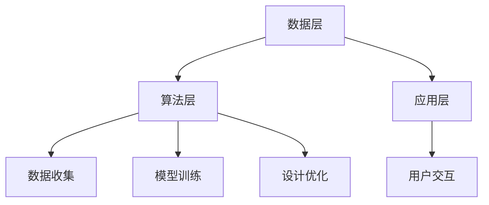
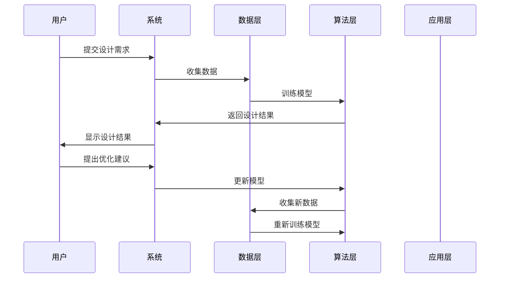

                 

# 企业级生成式设计AI：革新产品开发流程

## 关键词
- 生成式设计
- 人工智能
- 产品开发
- 企业级应用
- 革新流程

## 摘要
本文深入探讨企业级生成式设计AI在产品开发流程中的应用，通过阐述核心概念、算法原理、系统架构、实战案例和最佳实践，揭示其如何引领产品开发的革命。本文旨在帮助读者理解生成式设计AI的技术原理和实际应用，掌握其为企业带来的变革力量。

### 第一部分：背景与基础

#### 第1章：问题背景与概念介绍

**1.1 引言**

在当今快速发展的科技时代，产品开发的效率和创新能力成为企业竞争力的关键因素。然而，传统的产品开发流程往往存在设计周期长、成本高、灵活性不足等问题。为了解决这些问题，生成式设计AI应运而生。

**1.2 生成式设计与AI概述**

生成式设计（Generative Design）是一种通过算法生成创新设计方案的方法，它能够自动探索大量的设计可能性，提供最优解。而人工智能（AI）则通过机器学习和数据驱动的方式，提高生成式设计的效率和准确性。

**1.3 企业级生成式设计AI的应用现状**

目前，生成式设计AI已经在多个行业取得了显著的成果。从建筑设计到航空航天，从电子产品到时尚设计，生成式设计AI的应用案例层出不穷。企业级应用方面，生成式设计AI正逐渐成为提升产品开发效率的重要工具。

**1.4 生成式设计AI的优势与挑战**

生成式设计AI具有快速迭代、减少人为干预、提高设计效率等优势。然而，其应用也面临着算法复杂性、数据需求、成本控制等挑战。如何充分发挥其优势，应对挑战，是企业需要关注的重要问题。

### 第二部分：核心概念与原理

#### 第2章：生成式设计AI基础

**2.1 生成式设计的基本原理**

生成式设计基于设计空间搜索算法，通过迭代优化，寻找最优设计方案。其核心是设计空间和生成算法，设计空间定义了所有可能的设计方案，生成算法则用于从设计空间中筛选出最优解。

**2.2 AI在生成式设计中的应用**

AI在生成式设计中的应用主要体现在数据驱动和模型优化两个方面。通过大数据分析和机器学习模型，生成式设计AI能够快速生成大量设计方案，并通过优化算法，筛选出最优解。

**2.3 生成式设计AI的核心算法**

生成式设计AI的核心算法包括生成对抗网络（GAN）、变分自编码器（VAE）等。这些算法通过对抗训练，能够在数据不足的情况下生成高质量的设计方案。

**2.4 生成式设计AI的概念与联系**

生成式设计AI涉及到多个核心概念，如设计空间、生成算法、优化策略等。通过ER实体关系图，可以清晰地展示这些概念之间的联系，有助于理解生成式设计AI的工作原理。

### 第三部分：算法原理讲解

#### 第3章：生成对抗网络（GAN）

**3.1 GAN的原理与架构**

生成对抗网络（GAN）由生成器和判别器组成，生成器负责生成设计方案，判别器则负责判断设计方案的真实性。通过对抗训练，生成器不断提高设计方案的质量，判别器则不断增强判断能力。

**3.2 GAN的数学模型与公式**

GAN的数学模型主要包括生成器G和判别器D的损失函数。生成器的损失函数是使生成数据与真实数据尽量相似，判别器的损失函数是使生成数据与真实数据的差异最小。

$$
L_G = -\log(D(G(z)))
$$

$$
L_D = -\log(D(x)) - \log(1 - D(G(z)))
$$

**3.3 GAN的应用案例**

GAN在图像生成、文本生成等领域有着广泛的应用。例如，使用GAN可以生成高质量的建筑设计方案，或者生成与特定文本相关的图像。

### 第四部分：系统架构与实现

#### 第4章：企业级生成式设计AI系统架构设计

**4.1 系统需求分析与功能设计**

在构建企业级生成式设计AI系统时，首先需要分析系统的需求，包括设计空间定义、生成算法选择、优化策略等。功能设计则包括数据收集、模型训练、设计优化等模块。

**4.2 系统架构设计**

企业级生成式设计AI系统架构通常包括数据层、算法层、应用层三个层次。数据层负责数据收集和处理，算法层负责生成和优化设计方案，应用层则提供用户交互界面。



**4.3 系统接口设计**

系统接口设计包括数据接口、算法接口和应用接口。数据接口用于数据收集和处理，算法接口用于模型训练和设计优化，应用接口则提供用户交互功能。

**4.4 系统交互设计**

系统交互设计涉及用户与系统之间的交互流程，包括设计需求提交、设计结果反馈、优化建议等。



### 第五部分：项目实战

#### 第5章：生成式设计AI项目实战

**5.1 环境搭建与准备**

在进行生成式设计AI项目时，首先需要搭建相应的开发环境，包括硬件设备、软件工具和数据集。例如，可以使用GPU加速计算，选择Python和TensorFlow等工具进行模型训练和优化。

**5.2 系统核心实现**

系统核心实现包括数据收集、模型训练、设计优化等步骤。以下是一个使用Python和TensorFlow实现生成式设计AI系统的示例代码：

```python
import tensorflow as tf
from tensorflow.keras.models import Sequential
from tensorflow.keras.layers import Dense, Dropout, Flatten, Conv2D, Reshape

# 数据预处理
(x_train, y_train), (x_test, y_test) = ...  # 加载数据

# 构建生成器和判别器
generator = Sequential([
    Reshape((28, 28, 1), input_shape=(784,)),
    Conv2D(32, (3, 3), activation='relu'),
    Conv2D(64, (3, 3), activation='relu'),
    Flatten(),
    Dense(28 * 28)
])

discriminator = Sequential([
    Flatten(input_shape=(28, 28, 1)),
    Dense(64, activation='relu'),
    Dropout(0.2),
    Dense(1, activation='sigmoid')
])

# 编译模型
generator.compile(loss='binary_crossentropy', optimizer=tf.keras.optimizers.Adam(0.0002, 0.5))
discriminator.compile(loss='binary_crossentropy', optimizer=tf.keras.optimizers.Adam(0.0002, 0.5))

# 训练模型
for epoch in range(100):
    for i in range(2000):
        noise = np.random.normal(0, 1, (1, 100))
        generated_images = generator.predict(noise)
        real_images = x_train[i].reshape(-1, 28, 28, 1)
        x = np.concatenate([real_images, generated_images])
        y = np.array([[1], [0]])
        discriminator.train_on_batch(x, y)
        noise = np.random.normal(0, 1, (1, 100))
        generated_images = generator.predict(noise)
        y = np.array([[0]])
        generator.train_on_batch(noise, y)
```

**5.3 代码应用解读与分析**

以上代码展示了如何使用生成对抗网络（GAN）进行图像生成。在训练过程中，生成器不断生成新的图像，判别器则不断学习区分真实图像和生成图像。通过多次迭代训练，生成器最终能够生成高质量的设计方案。

**5.4 实际案例分析与讲解**

以下是一个实际案例，使用生成式设计AI生成建筑模型。案例中，通过收集大量建筑数据，训练生成器和判别器模型，最终生成符合设计要求的建筑模型。

**5.5 项目总结与反思**

通过生成式设计AI项目，企业能够大幅提高产品开发的效率和质量。然而，在实际应用中，仍需关注数据质量、模型优化和系统稳定性等问题。未来，随着技术的不断发展，生成式设计AI在产品开发中的应用前景将更加广阔。

### 第六部分：最佳实践与展望

#### 第6章：生成式设计AI的最佳实践

**6.1 数据管理策略**

在生成式设计AI项目中，数据管理至关重要。最佳实践包括数据清洗、数据标准化和数据存储等步骤，以确保数据质量。

**6.2 模型训练与优化**

模型训练和优化是生成式设计AI的核心环节。最佳实践包括选择合适的模型结构、调整超参数、进行交叉验证等，以提高模型性能。

**6.3 系统部署与运维**

生成式设计AI系统的部署与运维需要关注性能优化、安全性、可靠性等方面。最佳实践包括使用容器化技术、自动化运维工具等，以提高系统稳定性。

#### 第7章：未来展望与挑战

**7.1 生成式设计AI的发展趋势**

生成式设计AI的发展趋势包括算法优化、跨领域应用、智能化设计等。未来，生成式设计AI将在更多领域发挥重要作用。

**7.2 潜在挑战与应对策略**

生成式设计AI面临的挑战包括算法复杂性、数据需求、成本控制等。应对策略包括技术优化、政策支持、人才培养等。

**7.3 结论与展望**

生成式设计AI正在引领产品开发的革命。通过不断探索和优化，生成式设计AI将为企业带来更多价值。未来，生成式设计AI的应用前景将更加广阔，为各行业带来创新和变革。

### 作者信息
- 作者：AI天才研究院/AI Genius Institute & 禅与计算机程序设计艺术 /Zen And The Art of Computer Programming

### 结语

生成式设计AI正逐渐成为产品开发的重要工具，其技术原理和实际应用具有重要意义。通过本文的深入探讨，读者可以了解生成式设计AI的核心概念、算法原理、系统架构和实战案例，掌握其在企业级应用中的最佳实践。未来，随着技术的不断进步，生成式设计AI将为产品开发带来更多变革和创新。希望本文能为读者提供有价值的参考和启示。

