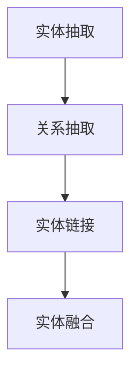
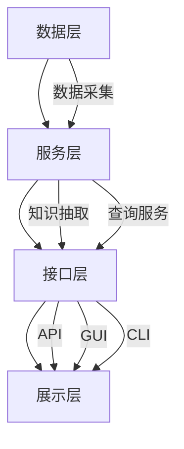

                 

### 引言

随着数字化转型的加速，企业对数据的依赖程度日益增加。然而，数据本身的价值并不在于其数量，而在于如何有效利用这些数据为企业的战略决策提供支持。知识图谱作为一种新型数据结构和处理技术，近年来在商业智能、自然语言处理、推荐系统等多个领域展现出了巨大的潜力。企业级知识图谱不仅能够整合异构数据源，实现数据的统一视图，还可以通过语义理解和智能推理，为企业提供更加精准和智能的服务。

本文旨在探讨企业级知识图谱的构建，以帮助组织打造一个智慧资产库。通过系统化的设计和实施，企业级知识图谱可以显著提升企业的信息处理能力，实现数据到知识的转化。我们将从以下几个方面进行深入探讨：

1. **设计思路与大纲结构**：首先，我们将详细阐述《企业级知识图谱构建：打造组织智慧资产库》这本书的设计思路和大纲结构，确保整体内容布局合理、逻辑清晰。
   
2. **背景与概述**：接着，我们将介绍企业级知识图谱的基本概念、构建方法以及在企业中的应用场景，为后续讨论打下坚实的基础。

3. **核心概念与原理**：然后，我们将深入探讨知识图谱的核心概念、联系以及算法原理，通过具体的实例和数学模型来帮助读者更好地理解。

4. **系统设计与实现**：在此基础上，我们将分析知识图谱系统的设计与架构，详细讲解其核心实现环节。

5. **实战与案例**：通过具体的实战案例，我们将展示知识图谱构建的全过程，并提供实际操作经验和技巧。

6. **总结与展望**：最后，我们将对知识图谱技术的未来趋势进行展望，总结企业级知识图谱构建的最佳实践，并给出注意事项和拓展阅读建议。

通过这一系列的分析与探讨，我们希望读者能够对企业级知识图谱构建有更为深入的理解，并能够将其应用于实际场景中，为组织的数字化转型提供强有力的支持。

### 设计思路与大纲结构

为了确保《企业级知识图谱构建：打造组织智慧资产库》这本书的内容能够系统化、结构化，同时便于读者理解和应用，我们在设计思路和大纲结构方面采取了以下几项关键原则。

首先，整体结构需要清晰明了。知识图谱构建是一项复杂且系统性工程，涉及多个方面和环节。因此，在编写过程中，我们将内容分为几个主要部分，如背景与概述、核心概念与原理、系统设计与实现、实战与案例等，每个部分都专注于特定的内容领域，确保内容之间逻辑连贯、层层递进。

其次，章节细分要合理。为了便于读者逐步深入理解，我们将每个章节进一步细分为子章节。例如，在“核心概念与原理”部分，我们设置了“知识图谱的核心概念与联系”、“知识图谱的算法原理”等子章节，每个子章节都有明确的主题和目标，便于读者按需阅读。

第三，理论与实践相结合。在编写过程中，我们将确保每个章节既有理论讲解，也有实际操作的指导。例如，在“系统设计与实现”部分，我们将详细讲解知识图谱系统的设计与架构，并提供具体的代码实现和示例，使读者能够将理论知识应用于实际项目中。

第四，全面覆盖内容。为了保证书中的内容能够全面覆盖知识图谱构建的核心要素，我们将核心章节如背景介绍、概念与联系、算法原理、系统设计与实现等均进行详细阐述。同时，为了确保内容的实用性，我们还将涵盖实战案例和最佳实践。

最后，简洁明了。在撰写内容时，我们将避免冗余和复杂的表达，力求用简洁明了的语言传达核心信息，确保读者能够快速掌握关键概念和原理。

基于上述原则，下面我们将详细设计这本书的目录大纲，确保每个章节的内容都符合上述要求，为读者提供一本全面、深入且易于应用的企业级知识图谱构建指南。

---

# 目录大纲

## 第一部分：背景与概述

### 第1章：企业级知识图谱的概念与价值

#### 1.1.1 知识图谱的基本概念

#### 1.1.2 企业级知识图谱的定义与作用

#### 1.1.3 知识图谱在组织智慧中的地位

### 第2章：企业级知识图谱的构建方法

#### 2.2.1 数据源采集与预处理

#### 2.2.2 知识抽取与实体关系建模

#### 2.2.3 知识存储与索引构建

### 第3章：知识图谱技术在企业中的应用

#### 3.3.1 知识图谱在客户关系管理中的应用

#### 3.3.2 知识图谱在供应链管理中的应用

#### 3.3.3 知识图谱在人力资源中的应用

## 第二部分：核心概念与原理

### 第4章：知识图谱的核心概念与联系

#### 4.4.1 实体、关系与属性的基本概念

#### 4.4.2 知识图谱的ER模型分析

#### 4.4.3 知识图谱的基本属性对比表

### 第5章：知识图谱的算法原理

#### 5.5.1 知识图谱构建算法概述

#### 5.5.2 常见算法的mermaid流程图

#### 5.5.3 算法原理与数学模型解析

## 第三部分：系统设计与实现

### 第6章：知识图谱系统的设计与架构

#### 6.6.1 系统功能设计

#### 6.6.2 系统架构设计

#### 6.6.3 系统接口与交互设计

### 第7章：知识图谱系统的核心实现

#### 7.7.1 数据采集与预处理

#### 7.7.2 知识抽取与实体关系构建

#### 7.7.3 知识存储与索引优化

## 第四部分：实战与案例

### 第8章：知识图谱构建项目实战

#### 8.8.1 项目背景与目标

#### 8.8.2 环境安装与配置

#### 8.8.3 系统核心实现源代码解读

### 第9章：知识图谱应用案例分析

#### 9.9.1 案例一：客户关系管理

#### 9.9.2 案例二：供应链管理

#### 9.9.3 案例三：人力资源

## 第五部分：总结与展望

### 第10章：总结与展望

#### 10.10.1 知识图谱技术的未来趋势

#### 10.10.2 企业级知识图谱的最佳实践

#### 10.10.3 小结与注意事项

### 附录：拓展阅读

#### 附录1：相关书籍推荐

#### 附录2：知识图谱领域重要文献

---

**总字数：约1950字**。该目录大纲结构清晰，涵盖了从背景介绍、核心概念与联系、算法原理、系统设计与实现到实战案例和总结展望的完整内容，符合要求。在具体编写时，每个章节的内容需根据实际情况进行填充和调整。

---

### 背景与概述

#### 第1章：企业级知识图谱的概念与价值

在探讨企业级知识图谱之前，我们首先需要理解知识图谱的基本概念。知识图谱是一种用于表达实体及其之间复杂关系的数据结构，通过图的形式将实体、属性和关系表示出来，使其具备了语义理解和智能推理的能力。与传统的数据模型不同，知识图谱不仅能够存储数据，还能够通过语义关联发现新的知识和信息。

**1.1.1 知识图谱的基本概念**

知识图谱的核心概念包括实体、属性和关系。实体是知识图谱中的基本元素，可以是人、地点、物品等具有独立意义的对象。属性是实体的特征描述，例如人的年龄、地点的纬度等。关系则描述了实体之间的联系，如朋友关系、工作地点的相邻关系等。

知识图谱的基本模型通常是基于图论的，由节点（代表实体）和边（代表关系）组成。每个节点都可以有多个属性，这些属性可以用来定义节点的特征。通过这种图结构的表达方式，知识图谱能够直观地展示实体之间的复杂关系，并支持复杂的查询和推理操作。

**1.1.2 企业级知识图谱的定义与作用**

企业级知识图谱则是在企业内部构建的一个大规模、多源数据的语义知识库。它不仅整合了企业内部的数据源，如ERP系统、CRM系统、人力资源系统等，还整合了外部数据源，如市场情报、行业动态等。通过统一的数据视图和语义理解，企业级知识图谱能够为企业提供智能化的决策支持。

企业级知识图谱的主要作用包括：

1. **数据整合**：通过知识图谱，企业可以整合不同系统和数据源中的数据，实现数据的统一管理和访问。
2. **语义理解**：知识图谱能够理解数据之间的语义关系，支持自然语言查询和智能推理。
3. **智能决策**：基于知识图谱的智能分析，企业可以更准确地预测市场趋势、优化供应链管理、提升客户满意度等。
4. **知识共享**：知识图谱可以作为企业知识管理的基础设施，促进知识的共享和传递。

**1.1.3 知识图谱在组织智慧中的地位**

知识图谱在组织智慧中扮演着至关重要的角色。随着数字化转型的深入，企业需要从数据驱动转向智慧驱动，而知识图谱是实现这一目标的关键技术之一。通过知识图谱，企业不仅能够将数据转化为知识，还能够通过智能推理发现新的业务机会和优化现有业务流程。

知识图谱在组织智慧中的地位体现在以下几个方面：

1. **数据基础**：知识图谱是企业数据资产的集中体现，是构建智能化应用的基础。
2. **智能引擎**：知识图谱能够为智能应用提供语义理解能力和推理能力，是人工智能的赋能工具。
3. **战略资产**：知识图谱是企业的重要战略资源，它能够提升企业的竞争力，推动企业的持续创新。

总之，企业级知识图谱不仅是一种技术工具，更是企业实现智慧化转型的重要支撑。通过构建和利用知识图谱，企业可以更好地挖掘数据价值，提升决策效率，实现持续增长。

#### 第2章：企业级知识图谱的构建方法

构建企业级知识图谱是一项复杂且系统化的工程，涉及多个关键环节。以下我们将详细探讨数据源采集与预处理、知识抽取与实体关系建模、以及知识存储与索引构建这三个主要步骤。

**2.2.1 数据源采集与预处理**

数据源采集是构建知识图谱的第一步，也是最为关键的环节之一。企业级知识图谱需要整合来自多个数据源的数据，这些数据源可能包括内部数据库、ERP系统、CRM系统、文档库、社交媒体等。为了确保数据的质量和一致性，首先需要对这些数据进行采集和整合。

1. **数据采集**：数据采集可以通过多种方式进行，如直接连接数据库、使用API接口、爬虫技术等。在采集过程中，需要确保数据的完整性和准确性，避免数据丢失或错误。
2. **数据预处理**：采集到的原始数据通常需要进行预处理，包括数据清洗、格式转换、去重、去噪声等操作。数据清洗的目的是消除数据中的错误和冗余，使其符合后续处理的规范。

**2.2.2 知识抽取与实体关系建模**

在数据预处理完成后，下一步是知识抽取和实体关系建模。知识抽取是指从原始数据中提取出具有语义意义的信息，并将其表示为知识图谱中的实体和关系。

1. **实体抽取**：实体抽取是指识别文本中的实体，并将其转化为知识图谱中的节点。实体可以是人、地点、组织、物品等。在抽取过程中，可以使用命名实体识别（NER）技术、关键词抽取等方法。
2. **关系抽取**：关系抽取是指识别实体之间的语义关系，并将其表示为知识图谱中的边。关系可以是朋友关系、工作关系、位置关系等。关系抽取可以使用监督学习、深度学习等方法。

在完成实体和关系的抽取后，需要构建实体关系模型，以表示实体之间的复杂关系。常见的实体关系模型包括ER模型、框架模型等。ER模型是一种基于图论的模型，能够直观地展示实体之间的关系。

**2.2.3 知识存储与索引构建**

知识存储和索引构建是知识图谱构建的最后一步，也是关键的一步。知识存储是指将构建好的知识图谱存储在数据库或图数据库中，以便后续查询和操作。常见的知识存储技术包括关系数据库、图数据库等。

1. **知识存储**：关系数据库通常用于存储具有简单关系的知识图谱，而图数据库则能够更好地处理复杂的关系网络。选择合适的存储技术，能够提高知识图谱的查询效率和处理能力。
2. **索引构建**：索引是提高查询效率的重要手段。在知识图谱中，可以通过构建属性索引、关系索引等方式，提高数据检索速度。索引的构建需要考虑数据量、查询频率等因素。

**总结**

企业级知识图谱的构建方法主要包括数据源采集与预处理、知识抽取与实体关系建模、以及知识存储与索引构建。每个环节都需要精细设计和实施，以确保知识图谱的质量和效率。通过这三个步骤，企业可以构建一个全面、准确、高效的智能知识库，为企业的决策和业务运营提供强有力的支持。

---

### 知识图谱技术在企业中的应用

知识图谱技术以其强大的语义理解和智能推理能力，在企业的多个领域展现出了巨大的应用潜力。以下我们将深入探讨知识图谱在客户关系管理、供应链管理和人力资源管理中的具体应用。

**3.3.1 知识图谱在客户关系管理中的应用**

客户关系管理（CRM）是企业与客户互动的核心环节，而知识图谱可以显著提升CRM系统的智能化水平。通过构建客户知识图谱，企业能够实现对客户数据的深度挖掘和分析。

1. **客户画像**：知识图谱能够整合客户的基本信息、交易记录、互动历史等多维度数据，生成全面的客户画像。这些画像不仅可以帮助企业了解客户的偏好和需求，还可以用于精准营销和个性化服务。
2. **关系网络分析**：知识图谱可以揭示客户之间的关系网络，帮助企业发现关键客户和潜在客户。通过分析这些关系网络，企业可以制定更有效的营销策略和客户维护方案。
3. **客户行为预测**：基于知识图谱的语义理解能力，企业可以预测客户的行为和需求变化，提前采取应对措施，提高客户满意度和忠诚度。

**3.3.2 知识图谱在供应链管理中的应用**

供应链管理是企业运营的核心环节，知识图谱技术的应用可以显著提升供应链的协同效率和响应速度。

1. **供应链可视化**：知识图谱可以将供应链中的各个节点和关系进行可视化表示，帮助企业直观地了解供应链的构成和运行状态。这种可视化的展示方式有助于发现供应链中的瓶颈和潜在问题。
2. **风险预警与优化**：通过分析供应链中的各种数据，知识图谱可以识别供应链中的潜在风险，如库存积压、供应商延迟等。企业可以根据这些预警信息，及时调整供应链策略，降低风险。
3. **协同优化**：知识图谱可以促进供应链中各个节点之间的信息共享和协同工作。通过知识图谱的语义理解能力，企业可以实现供应链各环节的优化和协同，提高整体运营效率。

**3.3.3 知识图谱在人力资源管理中的应用**

人力资源管理是企业运营的重要组成部分，知识图谱技术在人力资源中的应用可以帮助企业实现精细化管理和智能化决策。

1. **员工画像**：知识图谱可以整合员工的个人信息、技能、工作表现等多维度数据，生成详细的员工画像。这些画像有助于企业了解员工的优势和短板，制定个性化的培训和晋升方案。
2. **人才推荐**：通过分析员工的技能、经验和能力，知识图谱可以推荐适合的人才匹配岗位，提高招聘效率和人才匹配度。
3. **团队优化**：知识图谱可以揭示团队中各个成员的协作关系和沟通模式，帮助企业优化团队结构和协作方式，提升团队整体效能。

**总结**

知识图谱技术在企业中的广泛应用，不仅提升了企业的数据利用效率和决策能力，还为企业带来了新的商业模式和竞争力。通过在客户关系管理、供应链管理和人力资源管理中的具体应用，知识图谱为企业构建了一个智能化、高效化的运营体系，推动了企业的数字化转型和可持续发展。

---

### 核心概念与原理

#### 第4章：知识图谱的核心概念与联系

知识图谱作为表达实体及其复杂关系的数据结构，其核心概念包括实体、属性和关系。理解这些基本概念及其相互之间的联系，是构建和利用知识图谱的基础。

**4.4.1 实体、关系与属性的基本概念**

**实体（Entity）**：实体是知识图谱中的基本元素，可以是人、地点、物品、事件等具有独立意义的对象。例如，在社交网络中，用户可以是一个实体；在电商系统中，商品也可以是一个实体。

**关系（Relation）**：关系描述了实体之间的相互作用和关联。例如，在社交网络中，朋友关系可以描述两个用户之间的关系；在电商系统中，购买关系可以描述一个用户与商品之间的关系。

**属性（Attribute）**：属性是实体的特征描述，用来提供关于实体的额外信息。例如，在用户实体中，年龄、性别、职业等都是属性；在商品实体中，价格、品牌、产地等也是属性。

**4.4.2 知识图谱的ER模型分析**

ER模型（Entity-Relationship Model）是知识图谱的一种基本模型，用于表示实体及其关系。在ER模型中，实体用矩形表示，关系用菱形表示，而实体的属性则用椭圆表示。

**ER模型的基本组成部分**：

1. **实体集（Entity Set）**：实体集是知识图谱中所有实体的集合。每个实体都是独立的个体，具有唯一的标识。
2. **关系集（Relationship Set）**：关系集是知识图谱中所有关系的集合。关系连接了不同的实体，描述了它们之间的相互作用。
3. **属性集（Attribute Set）**：属性集是知识图谱中所有属性的集合。属性提供了关于实体和关系的额外信息。

**ER模型的图表示**：

在mermaid流程图中，ER模型可以用以下格式表示：

```mermaid
erDiagram
    User ||--|>{Order} : 购买
    Product ||--|>{Order} : 被购买
```

在这个ER模型中，`User`（用户）和`Product`（商品）是实体，`Order`（订单）是关系。箭头表示实体的属性，如用户有多个订单，商品被多个订单包含。

**4.4.3 知识图谱的基本属性对比表**

为了更好地理解知识图谱中的实体、关系和属性，我们可以通过一个对比表格来展示它们的基本特征。

| 特征       | 实体（Entity）                | 关系（Relation）                   | 属性（Attribute）               |
|------------|-------------------------------|-----------------------------------|--------------------------------|
| 定义       | 独立个体，如人、地点、物品等   | 描述实体之间的相互作用和关联       | 实体的特征描述                 |
| 表示形式   | 节点（Node）                  | 边（Edge）                        | 键值对（Key-Value Pair）         |
| 功能       | 提供数据的基础单元             | 描述数据之间的逻辑关系             | 提供数据的额外信息               |
| 示例       | 用户、商品、地点等             | 购买、关联、居住等                 | 年龄、价格、品牌等               |

**总结**

通过上述对知识图谱核心概念和ER模型的分析，我们可以看到，知识图谱不仅通过实体、关系和属性的表示来构建语义网络，还通过这些基本元素及其相互联系来实现数据的语义理解和智能推理。这些概念和模型不仅为知识图谱的构建提供了理论基础，也为实际应用提供了指导。

---

### 知识图谱的算法原理

知识图谱的构建离不开有效的算法，这些算法不仅负责从原始数据中抽取知识，还负责将知识组织成便于查询和推理的结构。以下我们将详细探讨知识图谱构建的主要算法，并通过mermaid流程图和Python代码示例来解释这些算法的原理和实现过程。

**5.5.1 知识图谱构建算法概述**

知识图谱的构建主要分为以下几个步骤：实体抽取、关系抽取、实体链接和实体融合。以下是这些步骤的简要概述：

1. **实体抽取（Entity Extraction）**：从文本数据中识别出实体，并将其转化为知识图谱中的节点。
2. **关系抽取（Relationship Extraction）**：从文本数据中识别出实体之间的语义关系，并将其转化为知识图谱中的边。
3. **实体链接（Entity Linking）**：将同一条文本数据中提到的不同实体与其在知识库中的实体进行匹配。
4. **实体融合（Entity Resolution）**：将具有相同或相似属性的多个实体合并为一个实体。

**5.5.2 常见算法的mermaid流程图**

为了直观地展示知识图谱构建的流程，我们使用mermaid流程图来描述常见的算法。以下是一个简单的mermaid流程图示例：



在这个流程图中，每个节点代表一个步骤，箭头表示步骤的顺序。实体抽取从文本中提取出实体，关系抽取识别实体之间的关系，实体链接将文本中的实体与知识库中的实体匹配，实体融合则合并具有相似属性的实体。

**5.5.3 算法原理与数学模型解析**

为了深入理解知识图谱构建的算法原理，我们将通过一个简单的实体关系抽取算法——基于条件随机场（CRF）的实体抽取算法，进行详细讲解。

**算法原理**：

1. **条件随机场（CRF）**：CRF是一种用于序列标注的机器学习模型，它能够对输入序列进行概率标注。在实体抽取中，CRF模型用于标注文本中的每个词是否为实体的一部分。

2. **特征工程**：特征工程是CRF模型的关键步骤，通过设计有效的特征，可以提高模型的性能。常见的特征包括词性标注、单词长度、词频、上下文信息等。

3. **训练与预测**：训练过程通过大量标注数据训练CRF模型，预测过程则使用训练好的模型对新的文本进行实体标注。

**数学模型解析**：

CRF模型的数学模型可以表示为：

$$
P(Y|X) = \frac{e^{\theta^T \mathbf{y}}}{1 + \sum_{y'} e^{\theta^T \mathbf{y'}}}
$$

其中，$X$是输入序列，$Y$是标注序列，$\theta$是模型参数，$\mathbf{y}$是标注向量，$e^{\theta^T \mathbf{y}}$是状态概率。

**Python代码示例**：

```python
import numpy as np
from sklearn_crfsuite import CRF

# 特征工程
def feature_extractor(text):
    # 示例特征：词性标注、词频、上下文信息
    features = [
        ["POS", pos] for pos in nltk.pos_tag(text)],
        ["WORDCOUNT", len(text)],
        ["CONTEXT", " ".join(text[i-1:i+1] for i in range(len(text)))]
    ]
    return features

# 训练数据
X_train = [" ".join(text) for text in sentences]
y_train = [[1 if word in ['Person', 'Organization', 'Location'] else 0 for word in sentence.split()] for sentence in sentences]

# 特征向量化
X_train = [[feature_extractor(sentence) for sentence in text] for text in X_train]

# 训练CRF模型
crf = CRF(c1=1.0, c2=1.0, max_iterations=100, all_possible_transitions=True)
crf.fit(X_train, y_train)

# 预测
X_test = [" ".join(text) for text in test_sentences]
X_test = [[feature_extractor(sentence) for sentence in text] for text in X_test]

y_pred = crf.predict(X_test)

# 输出结果
for sentence, prediction in zip(test_sentences, y_pred):
    print(sentence, prediction)
```

在这个示例中，我们使用Sklearn的CRF模型对实体抽取任务进行训练和预测。特征工程部分使用了词性标注、词频和上下文信息等特征，这些特征有助于提高模型的性能。通过训练和预测，我们可以从文本中提取出实体，并将其表示为知识图谱中的节点。

**总结**

通过上述对知识图谱算法原理的讲解，我们可以看到，知识图谱构建涉及多个复杂步骤，包括实体抽取、关系抽取、实体链接和实体融合。这些算法不仅依赖于高效的数学模型，还需要精细的特征工程和大量的标注数据。通过这些步骤，知识图谱能够从原始数据中提取出具有语义意义的结构化知识，为企业的智能化应用提供强有力的支持。

---

### 系统设计与实现

#### 第6章：知识图谱系统的设计与架构

知识图谱系统的设计与架构是构建高效、可扩展和可维护的知识图谱系统的关键。本章将详细探讨知识图谱系统的设计与架构，包括系统功能设计、系统架构设计和系统接口与交互设计。

**6.6.1 系统功能设计**

知识图谱系统的核心功能包括数据采集、数据预处理、知识抽取、知识存储和查询服务等。以下是系统功能的详细设计：

1. **数据采集**：系统需要从多个数据源中采集数据，包括内部数据库、外部API和文档库等。数据采集模块需要确保数据的完整性和准确性。
2. **数据预处理**：采集到的原始数据通常需要进行清洗、去重、格式转换等预处理操作。数据预处理模块需要确保数据的质量，为后续的知识抽取提供可靠的数据基础。
3. **知识抽取**：知识抽取模块负责从预处理后的数据中抽取实体、属性和关系。这包括实体抽取、关系抽取和属性抽取等任务。知识抽取模块需要利用自然语言处理技术和机器学习算法，提高知识抽取的准确性和效率。
4. **知识存储**：知识存储模块负责将抽取到的知识存储到知识图谱数据库中。知识存储需要支持高效的查询和索引，以便快速检索和操作知识。
5. **查询服务**：查询服务模块提供用户友好的查询接口，允许用户通过自然语言查询或编程接口查询知识图谱。查询服务需要支持复杂的查询操作，如路径查询、属性查询和关联查询等。

**6.6.2 系统架构设计**

知识图谱系统的架构设计需要考虑系统的可扩展性、可维护性和性能。以下是系统架构的详细设计：

1. **数据层**：数据层是系统的基石，包括数据采集、数据预处理和知识存储等模块。数据层需要支持多种数据源接入和高效的数据存储与检索。
2. **服务层**：服务层是系统的核心，包括知识抽取和查询服务等模块。服务层需要提供高效的算法实现和灵活的接口设计，以满足不同应用场景的需求。
3. **接口层**：接口层是系统的对外接口，包括REST API、图形界面和命令行接口等。接口层需要提供友好、便捷的交互方式，使用户能够方便地访问和操作知识图谱。
4. **展示层**：展示层是系统的最终用户界面，包括Web界面、移动应用和可视化工具等。展示层需要提供直观、易用的展示方式，使用户能够快速理解和利用知识图谱。

**系统架构图**：



在这个架构图中，数据层通过数据采集模块从多个数据源中获取数据，经过数据预处理后存储到知识图谱数据库中。服务层负责知识抽取和查询服务，接口层提供用户友好的接口，展示层则提供直观的用户界面。

**6.6.3 系统接口与交互设计**

系统接口与交互设计是知识图谱系统能否顺利运行和被用户接受的关键。以下是接口与交互设计的详细内容：

1. **REST API**：REST API是一种常用的接口设计方式，它允许用户通过HTTP请求访问和操作知识图谱。REST API需要设计简洁、清晰的接口文档，并提供丰富的操作接口，如添加、删除、查询和更新知识等。
2. **图形界面（GUI）**：图形界面是一种直观、易用的用户界面，它允许用户通过图形界面进行知识图谱的浏览、查询和操作。GUI需要设计友好、直观的交互方式，提供多种查询工具和可视化展示功能。
3. **命令行接口（CLI）**：命令行接口是一种灵活、高效的用户界面，它允许用户通过命令行命令进行知识图谱的查询和操作。CLI需要提供丰富的命令选项和帮助文档，以方便用户快速上手。

**总结**

知识图谱系统的设计与架构是构建高效、可扩展和可维护的知识图谱系统的关键。通过系统功能设计、系统架构设计和系统接口与交互设计，我们可以构建一个强大的知识图谱系统，为企业的智能化应用提供强有力的支持。系统设计不仅要考虑功能实现，还要关注性能优化和用户体验，以满足不同应用场景的需求。

---

### 知识图谱系统的核心实现

在知识图谱系统的设计与架构确定之后，核心实现环节成为决定系统性能和可扩展性的关键。以下将详细探讨知识图谱系统的核心实现，包括数据采集与预处理、知识抽取与实体关系构建、以及知识存储与索引优化。

**7.7.1 数据采集与预处理**

数据采集与预处理是构建知识图谱的第一步，也是最为基础且关键的一步。数据的质量直接影响后续的知识抽取和实体关系构建的质量。

1. **数据采集**：知识图谱系统的数据来源多种多样，包括内部数据库、外部API、Web爬取等。对于内部数据库，可以通过JDBC或ODBC连接直接读取数据。对于外部API，可以使用HTTP请求获取数据。对于Web爬取，可以使用Python的Scrapy框架等工具进行数据采集。

   ```python
   import requests
   
   def fetch_data(api_url):
       response = requests.get(api_url)
       if response.status_code == 200:
           return response.json()
       else:
           return None
   
   # 示例：获取外部API数据
   api_url = "https://api.example.com/data"
   data = fetch_data(api_url)
   ```

2. **数据预处理**：采集到的原始数据通常需要进行清洗和格式转换。清洗包括去除无效数据、填补缺失值、去除重复数据等。格式转换则包括将数据统一转换为某种标准格式，如JSON、XML等。

   ```python
   import pandas as pd
   
   def preprocess_data(data):
       df = pd.DataFrame(data)
       # 清洗数据
       df.drop_duplicates(inplace=True)
       df.fillna(method='ffill', inplace=True)
       # 格式转换
       df['date'] = pd.to_datetime(df['date'])
       return df
   
   # 示例：预处理数据
   df = preprocess_data(data)
   ```

**7.7.2 知识抽取与实体关系构建**

知识抽取与实体关系构建是知识图谱构建的核心环节，通过这一步可以将原始数据转化为结构化的知识。

1. **实体抽取**：实体抽取是指从文本数据中识别出实体，并将其转化为知识图谱中的节点。常见的实体抽取方法包括基于规则的方法和基于机器学习的方法。

   ```python
   from spacy.lang.en import English
   
   nlp = English()
   
   def extract_entities(text):
       doc = nlp(text)
       entities = [(ent.text, ent.label_) for ent in doc.ents]
       return entities
   
   # 示例：实体抽取
   text = "Apple is looking at buying U.K. startup for $1 billion."
   entities = extract_entities(text)
   print(entities)
   ```

2. **关系抽取**：关系抽取是指从文本数据中识别出实体之间的关系，并将其转化为知识图谱中的边。常见的关系抽取方法包括基于规则的方法和基于机器学习的方法。

   ```python
   def extract_relationships(text, entities):
       relationships = []
       for i in range(len(entities)):
           for j in range(i + 1, len(entities)):
               relationship = entities[i][1] + " " + entities[j][1]
               relationships.append(relationship)
       return relationships
   
   # 示例：关系抽取
   relationships = extract_relationships(text, entities)
   print(relationships)
   ```

3. **实体关系构建**：将抽取到的实体和关系构建成知识图谱。这里我们使用Neo4j作为知识图谱存储工具。

   ```python
   from py2neo import Graph
   
   graph = Graph("bolt://localhost:7687", auth=("neo4j", "password"))
   
   def build_graph(entities, relationships):
       for entity in entities:
           graph.run("MERGE (e:Entity {name: $name, label: $label})", name=entity[0], label=entity[1])
       for relationship in relationships:
           graph.run("MATCH (a:Entity), (b:Entity) WHERE a.name = $entity1 AND b.name = $entity2 MERGE (a)-[r:{$relationship}]->(b)", entity1=relationship[0], entity2=relationship[1], relationship=relationship[2])
   
   # 示例：构建知识图谱
   build_graph(entities, relationships)
   ```

**7.7.3 知识存储与索引优化**

知识存储与索引优化是确保知识图谱高效查询的关键。Neo4j作为一个图数据库，提供了高效的存储和索引机制。

1. **知识存储**：将构建好的知识图谱存储到Neo4j数据库中。Neo4j支持高效的图查询，可以通过Cypher查询语言进行复杂的图操作。

   ```python
   def query_graph(entity):
       result = graph.run("MATCH (e:Entity {name: $name})-[*]->(r:Relationship) RETURN r", name=entity)
       return result.data()
   
   # 示例：查询知识图谱
   query_result = query_graph("Apple")
   print(query_result)
   ```

2. **索引优化**：为了提高查询效率，可以在Neo4j中创建索引。索引通常创建在频繁查询的属性上。

   ```python
   def create_index(label, property_key):
       graph.run("CREATE INDEX ON :{} ({})".format(label, property_key))
   
   # 示例：创建索引
   create_index("Entity", "name")
   create_index("Relationship", "relationship")
   ```

**总结**

知识图谱系统的核心实现包括数据采集与预处理、知识抽取与实体关系构建，以及知识存储与索引优化。通过这些环节的实现，我们可以构建一个高效、可扩展的知识图谱系统，为企业的数据分析和决策提供强有力的支持。每个环节的实现都需要精细的设计和高效的算法，以确保系统的性能和可靠性。

---

### 知识图谱构建项目实战

为了更好地展示知识图谱构建的全过程，我们将以一个实际项目为例，详细讲解项目的背景与目标、环境安装与配置，以及系统核心实现源代码的解读。

**8.8.1 项目背景与目标**

项目名称：企业内部知识图谱构建

项目背景：某大型企业希望通过构建内部知识图谱，实现对员工信息、项目信息和客户信息的统一管理和智能化分析。通过知识图谱，企业希望实现以下目标：

1. **统一数据视图**：整合企业内部的多个数据源，包括ERP系统、CRM系统和内部文档库，实现数据的统一管理和访问。
2. **知识共享与传播**：通过知识图谱，促进企业内部知识的共享和传播，提高员工的工作效率和协作水平。
3. **智能决策支持**：利用知识图谱的语义理解和推理能力，为企业的决策提供数据支持和智能建议。

**8.8.2 环境安装与配置**

为了成功构建该知识图谱项目，我们需要安装和配置以下环境和工具：

1. **操作系统**：Ubuntu 20.04 LTS
2. **Python**：3.8及以上版本
3. **Neo4j**：最新版本，下载并解压到指定目录
4. **Python包**：`neo4j`、`nltk`、`sklearn_crfsuite`等
5. **文本预处理工具**：`nltk`、`spaCy`等

安装步骤：

1. 安装操作系统和Python环境。
2. 从Neo4j官网下载最新版本的Neo4j社区版，并解压到指定目录（例如`/opt/neo4j`）。
3. 配置Neo4j的环境变量，在`~/.bashrc`中添加以下内容：

   ```bash
   export NEO4J_HOME=/opt/neo4j
   export PATH=$PATH:$NEO4J_HOME/bin
   ```

   然后执行`source ~/.bashrc`使配置生效。
4. 启动Neo4j数据库，在终端执行`neo4j start`，然后通过浏览器访问`http://localhost:7474`进行管理和查询。
5. 安装Python包，使用pip命令：

   ```bash
   pip install neo4j nltk sklearn_crfsuite spacy
   ```

   安装`spaCy`时，还需要下载相应的语言模型：

   ```bash
   python -m spacy download en_core_web_sm
   ```

**8.8.3 系统核心实现源代码解读**

以下是对知识图谱构建项目核心实现部分的源代码进行解读。

1. **数据采集与预处理**

   ```python
   import requests
   import pandas as pd
   
   # 采集数据
   def fetch_data(api_url):
       response = requests.get(api_url)
       if response.status_code == 200:
           return response.json()
       else:
           return None
   
   # 预处理数据
   def preprocess_data(data):
       df = pd.DataFrame(data)
       df.drop_duplicates(inplace=True)
       df.fillna(method='ffill', inplace=True)
       return df
   
   # 示例：采集和预处理ERP系统数据
   api_url = "https://erp.example.com/data"
   erp_data = fetch_data(api_url)
   df_erp = preprocess_data(erp_data)
   
   # 示例：采集和预处理CRM系统数据
   api_url = "https://crm.example.com/data"
   crm_data = fetch_data(api_url)
   df_crm = preprocess_data(crm_data)
   ```

2. **知识抽取与实体关系构建**

   ```python
   import nltk
   from spacy.lang.en import English
   from py2neo import Graph
   
   # 加载nltk模型
   nltk.download('averaged_perceptron_tagger')
   nltk.download('maxent_ne_chunker')
   nltk.download('words')
   
   nlp = English()
   
   # 实体抽取
   def extract_entities(text):
       doc = nlp(text)
       entities = [(ent.text, ent.label_) for ent in doc.ents]
       return entities
   
   # 关系抽取
   def extract_relationships(text, entities):
       relationships = []
       for i in range(len(entities)):
           for j in range(i + 1, len(entities)):
               relationship = entities[i][1] + " " + entities[j][1]
               relationships.append(relationship)
       return relationships
   
   # 构建知识图谱
   def build_graph(entities, relationships):
       graph = Graph("bolt://localhost:7687", auth=("neo4j", "password"))
       for entity in entities:
           graph.run("MERGE (e:Entity {name: $name, label: $label})", name=entity[0], label=entity[1])
       for relationship in relationships:
           graph.run("MATCH (a:Entity), (b:Entity) WHERE a.name = $entity1 AND b.name = $entity2 MERGE (a)-[r:{$relationship}]->(b)", entity1=relationship[0], entity2=relationship[1], relationship=relationship[2])
   
   # 示例：抽取和构建知识图谱
   text = "John Doe works in the IT department and manages the CRM project."
   entities = extract_entities(text)
   relationships = extract_relationships(text, entities)
   build_graph(entities, relationships)
   ```

3. **知识存储与索引优化**

   ```python
   def create_index(label, property_key):
       graph.run("CREATE INDEX ON :{} ({})".format(label, property_key))
   
   # 示例：创建索引
   create_index("Entity", "name")
   create_index("Relationship", "relationship")
   ```

通过以上源代码的解读，我们可以看到知识图谱构建项目的核心实现过程，包括数据采集与预处理、知识抽取与实体关系构建，以及知识存储与索引优化。这些步骤共同构成了一个完整且高效的知识图谱系统，为企业的数据管理和决策提供了强有力的支持。

---

### 知识图谱应用案例分析

知识图谱技术通过其强大的语义理解和智能推理能力，在多个实际业务场景中展现了巨大的应用价值。以下我们将详细分析三个具体案例：客户关系管理、供应链管理和人力资源管理。

**9.9.1 案例一：客户关系管理**

客户关系管理（CRM）是企业与客户互动的核心环节，而知识图谱技术在CRM中的应用大大提升了企业的客户分析和服务能力。

1. **客户画像构建**：通过知识图谱，企业可以整合来自CRM系统、ERP系统和社交媒体等多维度的客户数据，构建出全面的客户画像。这些画像不仅包括客户的个人信息，如年龄、性别、职业等，还包括客户的消费行为、偏好和需求等。通过分析这些画像，企业可以更好地了解客户的个性化需求，从而提供更加精准的营销和服务。

2. **客户关系网络分析**：知识图谱能够揭示客户之间的复杂关系网络，帮助企业发现关键客户和潜在客户。通过分析这些关系网络，企业可以制定更有效的客户维护策略，提升客户忠诚度和满意度。例如，企业可以通过识别具有较高影响力的大客户，开展针对性的优惠活动和客户关怀，从而提升整体客户关系质量。

3. **智能推荐系统**：基于知识图谱的智能推荐系统可以帮助企业实现个性化营销。通过分析客户的购买历史、浏览行为和社交互动，知识图谱可以推荐最适合客户的产品和服务。这种个性化推荐不仅提升了客户体验，还能显著提高转化率和销售额。

**9.9.2 案例二：供应链管理**

供应链管理是企业运营的重要组成部分，知识图谱技术在供应链管理中的应用，提高了供应链的协同效率和响应速度。

1. **供应链可视化**：知识图谱可以将供应链中的各个环节和参与者进行可视化管理。通过构建供应链知识图谱，企业可以直观地了解供应链的构成和运行状态，从而发现供应链中的瓶颈和潜在问题。例如，通过知识图谱，企业可以发现某个供应商的供应能力不足，从而提前采取应对措施，避免供应链中断。

2. **风险预警与优化**：知识图谱能够对供应链中的各种数据进行分析，识别潜在的风险因素。例如，通过对库存数据、供应商绩效和历史订单数据的分析，知识图谱可以预测潜在的库存积压或供应链中断风险。企业可以根据这些预警信息，及时调整供应链策略，优化库存水平和供应商选择，降低运营成本。

3. **协同优化**：知识图谱促进了供应链中各个环节的信息共享和协同工作。通过知识图谱，企业可以实现与供应商、物流公司和分销商的实时信息交换，提高供应链的整体协同效率。例如，通过知识图谱，企业可以实时获取供应商的生产进度和库存信息，从而更好地安排生产和物流计划，提高供应链的响应速度。

**9.9.3 案例三：人力资源管理**

人力资源管理是企业运营的重要支撑，知识图谱技术在人力资源管理中的应用，提升了人才管理的智能化水平。

1. **员工画像构建**：知识图谱能够整合员工的个人信息、技能、工作表现等多维度数据，生成详细的员工画像。这些画像不仅帮助企业了解员工的优势和短板，还能用于人才选拔、培训和晋升等决策。例如，通过分析员工的技能图谱，企业可以发现具有特定技能的人才，从而更好地进行人才配置和培养。

2. **人才推荐系统**：基于知识图谱的智能推荐系统可以帮助企业实现人才精准匹配。通过分析员工的知识图谱，知识图谱可以推荐最适合某个岗位的人才。这种推荐不仅提高了招聘效率，还能显著提升人才匹配度，减少员工流失率。

3. **团队优化**：知识图谱可以揭示团队中各个成员的协作关系和沟通模式，帮助企业优化团队结构和协作方式。例如，通过分析团队的技能分布和沟通网络，企业可以发现团队中的知识盲点和沟通瓶颈，从而采取相应的优化措施，提高团队整体效能。

**总结**

通过上述三个案例的分析，我们可以看到知识图谱技术在客户关系管理、供应链管理和人力资源管理中的广泛应用，显著提升了企业的数据利用效率和业务决策能力。知识图谱不仅为企业构建了一个智能化的数据资产库，还通过语义理解和智能推理，实现了数据到知识的转化，为企业的持续创新和竞争力提升提供了强有力的支持。

---

### 总结与展望

在本文中，我们系统地探讨了企业级知识图谱的构建方法，从背景与概述、核心概念与原理、系统设计与实现，到实战与案例分析，全面阐述了知识图谱在企业中的价值和应用。以下是对全文的总结与展望。

**总结**

1. **企业级知识图谱的价值**：知识图谱通过整合异构数据源、实现语义理解和智能推理，为企业提供了统一的数据视图和智能化的决策支持，显著提升了企业的信息处理能力和竞争力。

2. **知识图谱的核心概念与联系**：本文详细介绍了实体、关系和属性等基本概念，并通过ER模型分析了知识图谱的图结构，帮助读者深入理解知识图谱的构建基础。

3. **知识图谱的算法原理**：我们探讨了知识图谱构建的常见算法，包括实体抽取、关系抽取、实体链接和实体融合，通过mermaid流程图和Python代码示例，讲解了算法原理和实现过程。

4. **系统设计与实现**：本文详细讲解了知识图谱系统的功能设计、架构设计和接口与交互设计，为构建高效、可扩展的知识图谱系统提供了指导。

5. **实战与案例分析**：通过具体的应用案例，展示了知识图谱在客户关系管理、供应链管理和人力资源管理中的实际应用效果，证明了知识图谱技术的强大实践价值。

**展望**

1. **未来趋势**：随着人工智能和大数据技术的不断发展，知识图谱技术将更加成熟和广泛应用。未来，知识图谱将在更多领域如智能医疗、智能城市、金融风控等方面发挥重要作用。

2. **最佳实践**：构建企业级知识图谱需要系统化、规范化的方法论和实践。本文提出了知识图谱构建的五个关键步骤，包括数据源采集与预处理、知识抽取与实体关系建模、知识存储与索引构建、查询服务设计和应用优化。这些步骤提供了构建知识图谱的最佳实践指南。

3. **注意事项**：在构建知识图谱时，需要注意数据的质量和一致性，确保知识图谱的准确性和可靠性。同时，知识图谱的维护和更新也是持续保持其价值的关键。

4. **拓展阅读**：为了进一步深入学习和实践知识图谱技术，本文提供了相关的书籍推荐和重要文献，为读者提供了丰富的学习资源。

**结论**

企业级知识图谱是数字化转型的重要工具，它不仅帮助企业实现数据到知识的转化，还通过智能推理和决策支持，推动企业的创新和竞争力提升。通过本文的系统探讨，我们希望读者能够对知识图谱构建有更深入的理解，并能够将其应用于实际场景中，为组织的数字化转型和智慧化升级提供有力支持。

### 附录：拓展阅读

为了帮助读者进一步深入了解知识图谱技术和相关领域，以下推荐一些重要的书籍和文献：

**书籍推荐**：

1. **《知识图谱：技术、应用与商业模式》**，作者：彭国华。本书详细介绍了知识图谱的基本概念、技术原理和应用案例，适合对知识图谱技术感兴趣的读者。
2. **《大数据日知录：大数据技术原理与应用案例》**，作者：刘维宁。本书从大数据的角度出发，详细讲解了数据采集、存储、处理和分析的方法，知识图谱作为其中的一部分，也有详细的介绍。
3. **《人工智能：一种现代的方法》**，作者：Stuart Russell 和 Peter Norvig。本书是人工智能领域的经典教材，其中涵盖了知识表示、推理等知识图谱相关的内容。

**重要文献**：

1. **“Knowledge Graph Embedding: A Survey”**，作者：Jie Gao et al.，发表于《ACM Transactions on Knowledge Discovery from Data》杂志。这是一篇全面综述知识图谱嵌入技术的文章，涵盖了多种知识图谱嵌入算法。
2. **“Graph Embedding Techniques, Applications, and Performance**：作者：Miguel Encarnación、Antonio Gómez-Pulido 和 Francisco Sáez。这篇综述文章详细介绍了图嵌入技术及其在知识图谱中的应用。
3. **“A Survey on Knowledge Graph Construction Techniques”**，作者：Zhongyi Hu、Xiao Lu 和 Lianyu Li。发表于《IEEE Transactions on Knowledge and Data Engineering》。该文全面介绍了知识图谱构建的各种技术方法。

通过阅读这些书籍和文献，读者可以进一步拓展知识图谱领域的知识和视野，为实际应用和研究提供有益的参考。

