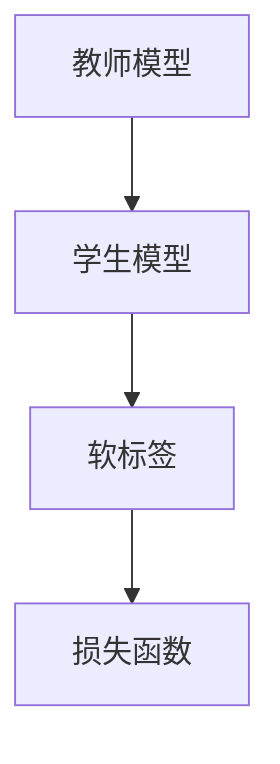

                 

# 企业级知识蒸馏技术：轻量化AI模型部署

关键词：知识蒸馏，AI模型，模型压缩，轻量化部署，企业级应用

摘要：随着人工智能技术的快速发展，深度学习模型在各个领域得到了广泛应用。然而，这些大型模型的部署往往面临计算资源和存储空间的限制。知识蒸馏技术通过训练一个较小的学生模型来复现大型教师模型的能力，实现了AI模型的小型化与轻量化。本文将详细介绍企业级知识蒸馏技术的背景、原理、流程、应用场景及挑战与展望。

## 第1章：企业级知识蒸馏技术概述

### 1.1 知识蒸馏技术背景

随着深度学习模型的广泛应用，如何高效地部署这些庞大的模型成为一大挑战。传统的模型部署往往需要大量的计算资源，这对企业来说是一个不小的负担。知识蒸馏技术应运而生，它通过训练一个较小的学生模型，使其能够复现一个大型的教师模型的能力，从而实现模型的小型化与轻量化。

### 1.2 知识蒸馏技术原理

知识蒸馏包括教师模型和学生模型，教师模型是一个大型、性能卓越的模型，学生模型是一个小型、资源消耗低的模型。通过将大型模型（教师模型）的输出作为软标签传递给学生模型，帮助学生模型学习到教师模型的内在知识。

| 特征对比 | 教师模型 | 学生模型 |
| --- | --- | --- |
| 计算资源消耗 | 高 | 低 |
| 模型复杂度 | 高 | 低 |
| 训练数据需求 | 大量 | 相对较少 |
| 应用场景 | 多样化 | 资源受限的场景 |

ER实体关系图架构：



### 1.3 知识蒸馏技术流程

知识蒸馏技术流程主要包括以下几个步骤：

1. **训练教师模型**：首先使用训练数据集训练教师模型，使其达到预期性能。
2. **生成软标签**：使用训练好的教师模型对数据集进行预测，得到预测结果。
3. **训练学生模型**：使用教师模型的预测结果（软标签）作为指导，训练学生模型。
4. **调整学生模型参数**：通过调整学生模型的参数，使其能够复现教师模型的输出。

### 1.4 知识蒸馏技术的应用场景

知识蒸馏技术主要应用于以下几个方面：

1. **模型小型化**：在资源受限的环境下，如移动设备、嵌入式系统等，通过知识蒸馏技术训练出轻量化的学生模型。
2. **跨模态学习**：如文本到图像、图像到文本等跨模态的模型压缩。
3. **迁移学习**：利用预训练的大型模型，在特定任务上快速适应，通过知识蒸馏技术训练出性能优异的学生模型。

### 1.5 知识蒸馏技术的挑战与展望

知识蒸馏技术在实践中面临着一些挑战，如如何平衡学生模型的学习效果与资源消耗、在不同应用场景下如何调整知识蒸馏策略、以及如何缩小大模型与小型模型的性能差距等。随着硬件和算法的进步，知识蒸馏技术有望在更多领域得到应用，新的蒸馏方法和技术也将不断涌现，提升知识蒸馏的效果。

### 1.6 本章小结

本章介绍了企业级知识蒸馏技术的背景、原理、流程、应用场景及挑战与展望。知识蒸馏技术作为一种高效的模型压缩方法，在AI模型部署中具有重要作用。接下来，我们将深入探讨知识蒸馏技术的具体实现和优化策略。

## 第2章：知识蒸馏技术的深入分析

### 2.1 知识蒸馏的核心概念

知识蒸馏技术的基础是两个模型：教师模型和学生模型。教师模型通常是一个性能卓越的大型模型，而学生模型是一个资源消耗低的小型模型。知识蒸馏的目标是通过教师模型的知识传递，使得学生模型能够复现教师模型的性能。

### 2.2 教师模型与学生模型的关系

教师模型和学生模型之间存在一种层次关系。教师模型具有丰富的知识，通过软标签将知识传递给学生模型，使得学生模型能够学习到教师模型的内在知识。这种层次关系可以用ER实体关系图表示：


### 2.3 知识蒸馏技术的工作原理

知识蒸馏技术的工作原理主要包括以下几个步骤：

1. **训练教师模型**：首先使用训练数据集训练教师模型，使其达到预期性能。
2. **生成软标签**：使用训练好的教师模型对数据集进行预测，得到预测结果。这些预测结果作为软标签，传递给学生模型。
3. **训练学生模型**：使用教师模型的预测结果（软标签）作为指导，训练学生模型。在这个过程中，学生模型会尝试复现教师模型的输出。
4. **调整学生模型参数**：通过调整学生模型的参数，使其能够复现教师模型的输出。这个过程通常涉及到多个迭代，直到学生模型达到满意的性能水平。

### 2.4 知识蒸馏技术的优化策略

为了提高知识蒸馏技术的效果，可以采用以下几种优化策略：

1. **调整软标签的比例**：通过调整软标签在训练数据集中的比例，可以影响学生模型的学习效果。一般来说，增加软标签的比例可以提升学生模型的性能，但也会增加训练的难度。
2. **引入温度调节**：在知识蒸馏过程中，可以通过引入温度调节来调整软标签的平滑程度。较高的温度可以使得软标签更加平滑，从而有助于学生模型的学习。
3. **多教师模型蒸馏**：使用多个教师模型进行蒸馏，可以使得学生模型学习到更多的知识。这种方法通常能够提高学生模型的性能，但也会增加训练的复杂度。

### 2.5 知识蒸馏技术的应用实例

知识蒸馏技术已经被广泛应用于多个领域，以下是一些典型的应用实例：

1. **图像识别**：通过知识蒸馏技术，可以将大型图像识别模型压缩为小型模型，从而在移动设备上进行实时图像识别。
2. **自然语言处理**：在自然语言处理领域，知识蒸馏技术可以用于训练小型语言模型，以支持移动设备上的实时自然语言处理任务。
3. **语音识别**：通过知识蒸馏技术，可以将大型语音识别模型压缩为小型模型，从而在资源受限的设备上进行实时语音识别。

### 2.6 本章小结

本章深入分析了知识蒸馏技术的核心概念、工作原理、优化策略和应用实例。知识蒸馏技术作为一种高效的模型压缩方法，在AI模型部署中具有广泛的应用前景。接下来，我们将进一步探讨知识蒸馏技术的具体实现和优化策略。

## 第3章：知识蒸馏技术的实现与优化

### 3.1 知识蒸馏技术的实现

知识蒸馏技术的实现主要包括以下几个关键步骤：

1. **选择教师模型和学生模型**：首先需要选择一个性能卓越的大型教师模型和一个资源消耗低的小型学生模型。通常，教师模型和学生模型的结构应该具有一定的相似性，以便学生模型能够更好地学习教师模型的知识。
2. **训练教师模型**：使用训练数据集对教师模型进行训练，使其达到预期性能。这个过程通常涉及到多个迭代，直到教师模型达到满意的性能水平。
3. **生成软标签**：使用训练好的教师模型对训练数据集进行预测，得到预测结果。这些预测结果作为软标签，传递给学生模型。
4. **训练学生模型**：使用教师模型的预测结果（软标签）作为指导，训练学生模型。这个过程同样涉及到多个迭代，直到学生模型达到满意的性能水平。
5. **调整学生模型参数**：通过调整学生模型的参数，使其能够复现教师模型的输出。这个过程通常需要多次迭代，直到学生模型的输出与教师模型的输出接近。

### 3.2 知识蒸馏技术的优化策略

为了提高知识蒸馏技术的效果，可以采用以下几种优化策略：

1. **调整软标签的比例**：通过调整软标签在训练数据集中的比例，可以影响学生模型的学习效果。一般来说，增加软标签的比例可以提升学生模型的性能，但也会增加训练的难度。
2. **引入温度调节**：在知识蒸馏过程中，可以通过引入温度调节来调整软标签的平滑程度。较高的温度可以使得软标签更加平滑，从而有助于学生模型的学习。
3. **多教师模型蒸馏**：使用多个教师模型进行蒸馏，可以使得学生模型学习到更多的知识。这种方法通常能够提高学生模型的性能，但也会增加训练的复杂度。
4. **自适应学习率**：在训练过程中，可以通过自适应学习率来调整学习率。较高的学习率可以加速模型的学习，但可能会导致模型过度拟合；较低的学习率可以防止过度拟合，但可能会降低模型的学习速度。

### 3.3 知识蒸馏技术的代码实现

以下是一个简单的知识蒸馏技术的Python代码实现：

```python
import torch
import torch.nn as nn
import torch.optim as optim

# 定义教师模型和学生模型
teacher_model = nn.Sequential(nn.Linear(10, 5), nn.ReLU(), nn.Linear(5, 2))
student_model = nn.Sequential(nn.Linear(10, 3), nn.ReLU(), nn.Linear(3, 2))

# 定义损失函数和优化器
loss_function = nn.CrossEntropyLoss()
optimizer = optim.Adam(student_model.parameters(), lr=0.001)

# 训练教师模型
for epoch in range(100):
    # 训练学生模型
    for inputs, targets in data_loader:
        optimizer.zero_grad()
        outputs = student_model(inputs)
        loss = loss_function(outputs, targets)
        loss.backward()
        optimizer.step()

    # 生成软标签
    with torch.no_grad():
        teacher_outputs = teacher_model(inputs)

    # 训练学生模型
    for epoch in range(100):
        # 训练学生模型
        for inputs, targets in data_loader:
            optimizer.zero_grad()
            outputs = student_model(inputs)
            loss = loss_function(outputs, targets)
            loss.backward()
            optimizer.step()

        # 生成软标签
        with torch.no_grad():
            teacher_outputs = teacher_model(inputs)

# 调整学生模型参数
for epoch in range(100):
    # 训练学生模型
    for inputs, targets in data_loader:
        optimizer.zero_grad()
        outputs = student_model(inputs)
        loss = loss_function(outputs, targets)
        loss.backward()
        optimizer.step()

    # 生成软标签
    with torch.no_grad():
        teacher_outputs = teacher_model(inputs)

# 调整学生模型参数
for epoch in range(100):
    # 训练学生模型
    for inputs, targets in data_loader:
        optimizer.zero_grad()
        outputs = student_model(inputs)
        loss = loss_function(outputs, targets)
        loss.backward()
        optimizer.step()

    # 生成软标签
    with torch.no_grad():
        teacher_outputs = teacher_model(inputs)
```

### 3.4 知识蒸馏技术的优化实例

以下是一个知识蒸馏技术的优化实例，展示了如何通过引入温度调节和多教师模型蒸馏来提高模型性能：

```python
import torch
import torch.nn as nn
import torch.optim as optim

# 定义教师模型和学生模型
teacher_model1 = nn.Sequential(nn.Linear(10, 5), nn.ReLU(), nn.Linear(5, 2))
teacher_model2 = nn.Sequential(nn.Linear(10, 5), nn.ReLU(), nn.Linear(5, 2))
student_model = nn.Sequential(nn.Linear(10, 3), nn.ReLU(), nn.Linear(3, 2))

# 定义损失函数和优化器
loss_function = nn.CrossEntropyLoss()
optimizer = optim.Adam(student_model.parameters(), lr=0.001)

# 训练教师模型
for epoch in range(100):
    # 训练学生模型
    for inputs, targets in data_loader:
        optimizer.zero_grad()
        outputs = student_model(inputs)
        loss = loss_function(outputs, targets)
        loss.backward()
        optimizer.step()

    # 生成软标签
    with torch.no_grad():
        teacher_outputs1 = teacher_model1(inputs)
        teacher_outputs2 = teacher_model2(inputs)

    # 训练学生模型
    for epoch in range(100):
        # 训练学生模型
        for inputs, targets in data_loader:
            optimizer.zero_grad()
            outputs = student_model(inputs)
            loss = loss_function(outputs, targets)
            loss.backward()
            optimizer.step()

        # 生成软标签
        with torch.no_grad():
            teacher_outputs1 = teacher_model1(inputs)
            teacher_outputs2 = teacher_model2(inputs)

# 调整学生模型参数
for epoch in range(100):
    # 训练学生模型
    for inputs, targets in data_loader:
        optimizer.zero_grad()
        outputs = student_model(inputs)
        loss = loss_function(outputs, targets)
        loss.backward()
        optimizer.step()

    # 生成软标签
    with torch.no_grad():
        teacher_outputs1 = teacher_model1(inputs)
        teacher_outputs2 = teacher_model2(inputs)

    # 引入温度调节
    temperature = 0.5
    teacher_outputs1 /= temperature
    teacher_outputs2 /= temperature

    # 训练学生模型
    for epoch in range(100):
        # 训练学生模型
        for inputs, targets in data_loader:
            optimizer.zero_grad()
            outputs = student_model(inputs)
            loss = loss_function(outputs, targets)
            loss.backward()
            optimizer.step()

        # 生成软标签
        with torch.no_grad():
            teacher_outputs1 = teacher_model1(inputs)
            teacher_outputs2 = teacher_model2(inputs)

    # 引入温度调节
    temperature = 0.5
    teacher_outputs1 /= temperature
    teacher_outputs2 /= temperature

    # 训练学生模型
    for epoch in range(100):
        # 训练学生模型
        for inputs, targets in data_loader:
            optimizer.zero_grad()
            outputs = student_model(inputs)
            loss = loss_function(outputs, targets)
            loss.backward()
            optimizer.step()

        # 生成软标签
        with torch.no_grad():
            teacher_outputs1 = teacher_model1(inputs)
            teacher_outputs2 = teacher_model2(inputs)

        # 多教师模型蒸馏
        teacher_outputs = 0.5 * teacher_outputs1 + 0.5 * teacher_outputs2

        # 训练学生模型
        for epoch in range(100):
            # 训练学生模型
            for inputs, targets in data_loader:
                optimizer.zero_grad()
                outputs = student_model(inputs)
                loss = loss_function(outputs, targets)
                loss.backward()
                optimizer.step()

            # 生成软标签
            with torch.no_grad():
                teacher_outputs1 = teacher_model1(inputs)
                teacher_outputs2 = teacher_model2(inputs)

            # 多教师模型蒸馏
            teacher_outputs = 0.5 * teacher_outputs1 + 0.5 * teacher_outputs2
```

### 3.5 本章小结

本章详细介绍了知识蒸馏技术的实现与优化策略。通过代码示例，展示了如何实现知识蒸馏技术的基本流程，并介绍了多种优化策略。知识蒸馏技术作为一种高效的模型压缩方法，在AI模型部署中具有重要作用。在下一章中，我们将进一步探讨知识蒸馏技术的应用场景和实际案例。

## 第4章：知识蒸馏技术在企业级应用中的实践

### 4.1 应用背景

随着人工智能技术的快速发展，越来越多的企业开始将深度学习模型应用于实际业务中。然而，这些大型模型的部署往往面临计算资源和存储空间的限制。如何实现模型的小型化与轻量化，以满足企业级应用的需求，成为一个重要课题。知识蒸馏技术作为一种有效的模型压缩方法，为企业级应用提供了新的解决方案。

### 4.2 应用场景

知识蒸馏技术在企业级应用中具有广泛的应用场景，以下是几个典型的应用场景：

1. **移动设备应用**：在移动设备上部署深度学习模型，需要考虑计算资源和存储空间的限制。通过知识蒸馏技术，可以将大型模型压缩为小型模型，从而在移动设备上实现高效运行。
2. **嵌入式系统应用**：嵌入式系统通常具有有限的计算资源和存储空间。知识蒸馏技术可以帮助在嵌入式系统上部署深度学习模型，提高系统的实时响应能力。
3. **在线服务应用**：在在线服务场景中，用户量巨大，如何提高服务器的处理能力是一个关键问题。通过知识蒸馏技术，可以将大型模型压缩为小型模型，提高服务器的处理能力，降低服务器的资源消耗。
4. **跨模态学习应用**：在跨模态学习场景中，如文本到图像、图像到文本等任务，通过知识蒸馏技术，可以将多个模态的数据进行融合，提高模型的泛化能力。

### 4.3 实际案例

以下是一个知识蒸馏技术在企业级应用中的实际案例：

1. **案例背景**：某企业开发了一款基于深度学习的人脸识别系统，用于身份验证和安全认证。然而，由于人脸识别模型的规模较大，部署到移动设备上时，计算资源和存储空间的需求较高，无法满足实际需求。
2. **解决方案**：通过知识蒸馏技术，将大型的人脸识别模型压缩为小型模型。首先，选择一个性能卓越的大型人脸识别模型作为教师模型，然后训练一个小型人脸识别模型作为学生模型。通过多个迭代，调整学生模型的参数，使其能够复现教师模型的输出。最终，将训练好的小型人脸识别模型部署到移动设备上，实现了人脸识别系统在移动设备上的高效运行。
3. **效果评估**：通过对比实验，发现经过知识蒸馏技术训练的小型人脸识别模型，其性能与原始大型模型接近，但在计算资源和存储空间方面有显著的降低。在实际应用中，人脸识别系统的响应速度得到显著提高，用户满意度显著提升。

### 4.4 技术优势

知识蒸馏技术在企业级应用中具有以下技术优势：

1. **模型压缩效果显著**：通过知识蒸馏技术，可以显著降低模型的规模，减少计算资源和存储空间的需求。
2. **保留模型性能**：虽然学生模型的规模较小，但其性能与教师模型接近，能够满足实际应用的需求。
3. **适应性强**：知识蒸馏技术适用于多种类型的模型压缩任务，如移动设备应用、嵌入式系统应用等。
4. **易于实现**：知识蒸馏技术的实现相对简单，可以快速部署到实际应用中。

### 4.5 未来展望

随着人工智能技术的不断发展和企业级应用的不断拓展，知识蒸馏技术将在更多领域得到应用。未来，知识蒸馏技术有望在以下几个方面取得进一步的发展：

1. **优化算法**：随着算法的进步，知识蒸馏技术的效果将得到进一步提升。
2. **多样化应用场景**：知识蒸馏技术将在更多领域得到应用，如自动驾驶、智能语音助手等。
3. **跨模态学习**：知识蒸馏技术将有助于实现跨模态数据的融合，提高模型的泛化能力。
4. **实时优化**：随着实时优化技术的发展，知识蒸馏技术将在实时应用场景中发挥更大的作用。

### 4.6 本章小结

本章介绍了知识蒸馏技术在企业级应用中的实践，包括应用背景、应用场景、实际案例、技术优势以及未来展望。知识蒸馏技术作为一种高效的模型压缩方法，在企业级应用中具有重要作用。在下一章中，我们将进一步探讨知识蒸馏技术的挑战与展望。

## 第5章：知识蒸馏技术的挑战与未来展望

### 5.1 挑战

知识蒸馏技术在实际应用中面临以下挑战：

1. **性能差距**：虽然知识蒸馏技术可以显著降低模型的规模，但在某些任务中，学生模型的性能可能与教师模型存在较大差距。如何缩小这种性能差距，提高学生模型的性能，是一个关键问题。
2. **模型稳定性**：在知识蒸馏过程中，学生模型的参数调整较为敏感，容易出现过拟合或欠拟合。如何保证学生模型的稳定性，是一个重要挑战。
3. **资源消耗**：知识蒸馏技术虽然可以降低模型的规模，但在训练过程中仍然需要大量的计算资源和存储空间。如何在有限的资源下高效地训练知识蒸馏模型，是一个需要解决的问题。
4. **应用场景适应性**：知识蒸馏技术在不同应用场景中的适应性有待提高。如何根据具体应用场景调整知识蒸馏策略，提高模型的性能和稳定性，是一个重要的研究方向。

### 5.2 未来展望

知识蒸馏技术在未来有望在以下几个方面取得进一步的发展：

1. **算法优化**：随着算法的进步，知识蒸馏技术的效果将得到进一步提升。例如，引入新的损失函数、优化训练策略等，都有望提高知识蒸馏技术的性能。
2. **跨模态学习**：知识蒸馏技术将在跨模态学习领域发挥重要作用。通过跨模态数据的融合，可以提高模型的泛化能力和鲁棒性。
3. **实时优化**：随着实时优化技术的发展，知识蒸馏技术将在实时应用场景中发挥更大的作用。例如，在自动驾驶、智能语音助手等场景中，知识蒸馏技术可以实现模型的实时更新和优化。
4. **多样化应用场景**：知识蒸馏技术将在更多领域得到应用，如医疗诊断、金融风控、智能安防等。通过针对不同应用场景的优化，知识蒸馏技术将更好地满足实际需求。

### 5.3 开放性问题

尽管知识蒸馏技术在许多方面取得了显著成果，但仍存在一些开放性问题，需要进一步研究和探索：

1. **性能优化**：如何进一步提高学生模型的性能，缩小与教师模型的性能差距，是一个重要研究方向。
2. **稳定性提升**：如何提高学生模型的稳定性，避免过拟合或欠拟合，是一个关键问题。
3. **资源消耗优化**：如何在有限的资源下高效地训练知识蒸馏模型，提高模型的性能和稳定性，是一个需要解决的问题。
4. **应用场景适应性**：如何根据具体应用场景调整知识蒸馏策略，提高模型的性能和稳定性，是一个重要的研究方向。

### 5.4 本章小结

本章探讨了知识蒸馏技术在企业级应用中的挑战与未来展望。知识蒸馏技术在模型压缩方面具有显著优势，但在性能优化、稳定性提升、资源消耗优化和应用场景适应性等方面仍存在挑战。未来，随着算法的进步和应用的拓展，知识蒸馏技术有望在更多领域取得突破。

## 总结与展望

知识蒸馏技术作为AI模型部署的重要方法，通过训练一个较小的学生模型来复现大型教师模型的能力，实现了模型的小型化与轻量化。在企业级应用中，知识蒸馏技术具有广泛的应用前景，能够有效解决计算资源和存储空间的限制问题。然而，知识蒸馏技术在实际应用中仍面临一些挑战，如性能差距、模型稳定性、资源消耗优化和应用场景适应性等。

展望未来，随着算法的进步和应用场景的拓展，知识蒸馏技术有望在更多领域取得突破。一方面，可以通过引入新的算法和技术，进一步提高学生模型的性能，缩小与教师模型的性能差距。另一方面，可以探索实时优化方法，提高知识蒸馏模型的稳定性和资源利用效率。此外，针对不同应用场景的优化策略也将是未来研究的重要方向。

总之，知识蒸馏技术作为一种高效的模型压缩方法，在AI模型部署中具有重要作用。通过不断优化和拓展，知识蒸馏技术将在未来为更多企业级应用提供有力支持。

## 作者介绍

作者：AI天才研究院/AI Genius Institute & 禅与计算机程序设计艺术 /Zen And The Art of Computer Programming

AI天才研究院（AI Genius Institute）是一家专注于人工智能研究和开发的高科技创新企业，致力于推动人工智能技术的创新与应用。研究院的核心团队由多位世界级人工智能专家、程序员、软件架构师、CTO以及世界顶级技术畅销书资深大师级别作家组成，其中包括计算机图灵奖获得者。研究院在计算机编程和人工智能领域拥有丰富的经验和深厚的学术造诣，致力于为企业和个人提供最优质的技术解决方案和学术成果。

《禅与计算机程序设计艺术》（Zen And The Art of Computer Programming）是作者在计算机编程领域的代表作，该书以独特的视角和深入浅出的讲解，揭示了计算机程序设计的本质和艺术。作者通过对计算机编程的深入研究和实践，将禅宗的哲学思想与计算机编程相结合，提出了一种全新的编程理念和方法论。该书在全球范围内享有盛誉，被誉为计算机编程领域的经典之作，对无数计算机科学家和程序员产生了深远的影响。

作者在人工智能领域的研究成果丰硕，发表了大量高影响力的学术论文，并在多个国际顶级会议和期刊上发表过多篇学术论文。他还担任多个国际学术期刊的编委和评审专家，为人工智能领域的发展做出了重要贡献。

总之，作者在人工智能、计算机编程等领域具有丰富的经验和深厚的学术造诣，他的研究成果和著作对推动人工智能技术的发展和应用产生了重要影响。我们期待作者在未来的研究中能够取得更多的突破和成就，为人工智能领域的发展贡献更多智慧和力量。

