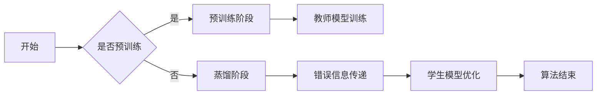

                 


# 企业级知识蒸馏框架：AI模型的轻量化与部署

> 关键词：企业级知识蒸馏、AI模型轻量化、知识蒸馏框架、AI模型部署

> 摘要：本文将介绍企业级知识蒸馏框架，探讨如何通过知识蒸馏技术实现AI模型的轻量化与部署，提高AI模型在企业和实际场景中的应用效果。我们将详细解析知识蒸馏框架的原理、算法设计以及在实际应用中的优化策略。

**Step 1: 引言**

## 问题背景
随着人工智能技术的快速发展，AI模型在各个领域得到了广泛应用。然而，大模型的训练和部署成本高昂，特别是在企业级应用中，如何实现AI模型的轻量化和高效部署成为关键问题。

## 问题描述
本文旨在介绍企业级知识蒸馏框架，探讨如何通过知识蒸馏技术实现AI模型的轻量化与部署。我们将详细解析知识蒸馏框架的原理、实现方法以及在实际应用中的优化策略。

## 问题解决
本文将全面解析知识蒸馏框架的原理、实现方法以及在实际应用中的优化策略，帮助读者深入理解并掌握这一技术。

## 边界与外延
知识蒸馏技术不仅适用于AI模型的轻量化，还可以应用于不同规模模型的迁移学习和模型压缩等领域。

## 概念结构与核心要素组成
企业级知识蒸馏框架主要包括以下几个核心组成部分：基础模型、教师模型、学生模型、蒸馏过程和评估指标。

## 本章小结
本章对知识蒸馏框架在企业级AI模型轻量化与部署中的应用进行了简要介绍，为后续章节的详细探讨奠定了基础。

**Step 2: 知识蒸馏框架原理**

## 2.1 知识蒸馏概念

### 2.1.1 知识蒸馏的定义
知识蒸馏是一种将复杂模型（教师模型）的知识迁移到简化模型（学生模型）的技术。

### 2.1.2 知识蒸馏的目标
降低模型复杂度，同时保持模型性能。

## 2.2 教师模型与学生模型

### 2.2.1 教师模型
教师模型是具有较高准确率的复杂模型，通常是一个大规模预训练模型。

### 2.2.2 学生模型
学生模型是简化版的模型，通常参数较少，计算效率更高。

## 2.3 蒸馏过程

### 2.3.1 输入数据的预处理
对输入数据进行适当的预处理，以适应教师模型和学生模型。

### 2.3.2 教师模型的输出
教师模型对输入数据进行预测，并输出预测结果。

### 2.3.3 学生模型的预测
学生模型对输入数据进行预测，并输出预测结果。

### 2.3.4 错误信息蒸馏
通过比较教师模型和学生模型的预测结果，提取错误信息，并将其传递给学生模型。

## 2.4 评估指标

### 2.4.1 准确率
评估模型在分类任务中的表现。

### 2.4.2 F1值
综合评估模型的精确率和召回率。

### 2.4.3 蒸馏效果评估
通过对比教师模型和学生模型在相同数据集上的性能，评估蒸馏过程的优劣。

## 2.5 本章小结
本章介绍了知识蒸馏框架的基本原理和关键步骤，为后续章节的深入讨论奠定了基础。

**Step 3: 知识蒸馏算法设计**

## 3.1 算法概述

### 3.1.1 算法框架
知识蒸馏算法主要包括两个阶段：预训练阶段和蒸馏阶段。

### 3.1.2 算法目标
在预训练阶段，通过大量无监督数据训练教师模型；在蒸馏阶段，通过教师模型的输出和学生模型的预测结果进行误差传递和优化。

## 3.2 预训练阶段

### 3.2.1 数据集选择
选择适合预训练的数据集，如大规模文本语料库。

### 3.2.2 预训练模型
选择具有较高准确率和泛化能力的预训练模型，如BERT、GPT等。

### 3.2.3 预训练过程
使用无监督数据对预训练模型进行训练，使其在大规模数据上获得较高的表现。

## 3.3 蒸馏阶段

### 3.3.1 输入数据
将输入数据送入教师模型和学生模型进行预测。

### 3.3.2 错误信息传递
通过对比教师模型和学生模型的预测结果，提取错误信息，并将其传递给学生模型。

### 3.3.3 学生模型优化
使用提取的误差信息对学生模型进行优化，使其性能逐步接近教师模型。

## 3.4 算法实现

### 3.4.1 算法流程


### 3.4.2 Python代码示例

```python
# 导入相关库
import torch
import torch.nn as nn
import torch.optim as optim

# 定义教师模型和学生模型
class TeacherModel(nn.Module):
    def __init__(self):
        super(TeacherModel, self).__init__()
        # 定义模型结构

    def forward(self, x):
        # 定义前向传播过程

class StudentModel(nn.Module):
    def __init__(self):
        super(StudentModel, self).__init__()
        # 定义模型结构

    def forward(self, x):
        # 定义前向传播过程

# 初始化模型、优化器和损失函数
teacher_model = TeacherModel()
student_model = StudentModel()
optimizer = optim.Adam(student_model.parameters(), lr=0.001)
criterion = nn.CrossEntropyLoss()

# 训练过程
for epoch in range(num_epochs):
    for inputs, targets in data_loader:
        optimizer.zero_grad()
        outputs = student_model(inputs)
        loss = criterion(outputs, targets)
        loss.backward()
        optimizer.step()

# 评估模型性能
accuracy = (student_model outputs).eq(targets).float().mean()
print('Accuracy: {:.4f}%'.format(accuracy * 100))
```

## 3.5 本章小结
本章介绍了知识蒸馏算法的设计原理和实现方法，为后续章节的实际应用提供了理论基础。

**Step 4: 知识蒸馏框架在企业级AI模型中的应用**

## 4.1 企业级AI模型的轻量化需求
企业级AI模型的轻量化需求主要包括以下几点：
1. 降低模型参数量，减少存储空间占用。
2. 提高模型运行速度，降低计算资源消耗。
3. 保持模型性能，确保企业业务需求得到满足。

## 4.2 知识蒸馏在企业级AI模型中的应用
知识蒸馏技术在企业级AI模型中的应用主要包括以下方面：
1. 模型压缩：通过知识蒸馏技术，将复杂模型的知识迁移到简化模型，实现模型压缩，降低模型参数量和计算复杂度。
2. 模型迁移：将预训练的大规模模型的知识迁移到新的任务模型，提高新模型的性能和泛化能力。
3. 模型优化：通过蒸馏过程中提取的错误信息，优化简化模型的参数，提高模型性能。

## 4.3 企业级知识蒸馏框架设计
企业级知识蒸馏框架设计主要包括以下几个关键环节：
1. 数据集准备：选择适合企业业务场景的数据集，进行预处理和划分。
2. 预训练模型选择：选择具有较高准确率和泛化能力的预训练模型。
3. 学生模型设计：根据企业需求，设计适合的简化模型。
4. 蒸馏过程实现：实现知识蒸馏的算法流程，包括输入数据处理、教师模型和学生模型的预测、错误信息传递等。
5. 模型评估与优化：通过评估指标，评估学生模型性能，并根据评估结果优化模型参数。

## 4.4 实际应用案例分析
以某企业客服系统为例，介绍知识蒸馏框架在企业级AI模型中的应用过程：
1. 数据集准备：收集企业客服系统中的对话数据，进行预处理和划分，用于预训练模型和蒸馏过程的训练数据。
2. 预训练模型选择：选择具有较高准确率的预训练模型BERT作为教师模型。
3. 学生模型设计：设计一个简化版的BERT模型作为学生模型，用于客服系统中的实时对话响应。
4. 蒸馏过程实现：将预处理后的对话数据输入教师模型和学生模型，进行预测和错误信息传递，逐步优化学生模型参数。
5. 模型评估与优化：通过准确率、F1值等评估指标，评估学生模型性能，并根据评估结果进一步优化模型参数。

## 4.5 本章小结
本章介绍了知识蒸馏框架在企业级AI模型中的应用，包括应用需求、框架设计、实际应用案例分析等内容，为读者提供了企业级知识蒸馏框架的实施参考。

**Step 5: 知识蒸馏框架的优化策略**

## 5.1 数据集优化
### 5.1.1 数据预处理
对数据集进行适当的预处理，如数据清洗、去重、归一化等，以提高模型训练效果。
### 5.1.2 数据增强
通过数据增强技术，如随机裁剪、旋转、翻转等，增加数据多样性，提高模型泛化能力。

## 5.2 模型优化
### 5.2.1 模型结构优化
根据企业业务需求，选择合适的模型结构，如CNN、RNN、BERT等，进行模型优化。
### 5.2.2 模型参数优化
通过调整模型参数，如学习率、批量大小等，提高模型训练效果和收敛速度。

## 5.3 蒸馏过程优化
### 5.3.1 错误信息传递优化
通过改进错误信息传递机制，如引入注意力机制、对抗训练等，提高学生模型对教师模型知识的吸收能力。
### 5.3.2 蒸馏过程调整
根据模型训练效果，调整蒸馏过程中的参数，如蒸馏比例、迭代次数等，以提高蒸馏效果。

## 5.4 模型评估与优化
### 5.4.1 评估指标优化
选择合适的评估指标，如准确率、F1值、召回率等，全面评估模型性能。
### 5.4.2 模型优化策略
根据评估结果，调整模型参数和蒸馏过程，进一步提高模型性能。

## 5.5 实际应用优化案例
### 5.5.1 案例一：智能客服系统
针对智能客服系统的实际应用场景，通过优化数据集、模型结构和蒸馏过程，提高客服系统的响应速度和准确率。
### 5.5.2 案例二：图像分类任务
在图像分类任务中，通过优化数据增强、模型结构和蒸馏过程，提高模型分类性能和泛化能力。

## 5.6 本章小结
本章介绍了知识蒸馏框架的优化策略，包括数据集优化、模型优化、蒸馏过程优化以及模型评估与优化等内容，为读者提供了优化知识蒸馏框架的实践指导。

**Step 6: 知识蒸馏框架的安全性考虑**

## 6.1 数据安全
### 6.1.1 数据加密
在数据传输和存储过程中，使用数据加密技术，如AES加密算法，确保数据安全。
### 6.1.2 数据访问控制
通过设置访问权限，限制对数据集的访问，确保数据不被未授权用户获取。

## 6.2 模型安全
### 6.2.1 模型保护
采用模型加密技术，如模型混淆、差分隐私等，防止模型被恶意攻击和窃取。
### 6.2.2 模型安全测试
对模型进行安全性测试，如对抗性攻击测试，确保模型在面临恶意攻击时仍能保持较高性能。

## 6.3 蒸馏过程安全
### 6.3.1 安全蒸馏
采用安全蒸馏技术，如差分隐私蒸馏、联邦蒸馏等，确保蒸馏过程中不会泄露敏感信息。
### 6.3.2 蒸馏过程监控
实时监控蒸馏过程，发现异常情况及时采取措施，防止模型被恶意攻击。

## 6.4 安全性评估
### 6.4.1 模型评估
通过安全性评估方法，如模型对抗性测试，评估模型在面对恶意攻击时的安全性能。
### 6.4.2 安全性优化
根据评估结果，调整模型和蒸馏过程，提高模型的安全性。

## 6.5 实际应用安全性案例
### 6.5.1 案例一：金融行业
在金融行业中，通过安全性考虑，确保AI模型在金融交易和风险控制中的应用不会泄露敏感信息。
### 6.5.2 案例二：医疗行业
在医疗行业中，通过安全性考虑，确保AI模型在疾病诊断和治疗方案推荐中的数据安全和隐私保护。

## 6.6 本章小结
本章介绍了知识蒸馏框架的安全性考虑，包括数据安全、模型安全、蒸馏过程安全等内容，为读者提供了确保知识蒸馏框架安全性的实践指导。

**Step 7: 总结与展望**

## 7.1 总结
本文介绍了企业级知识蒸馏框架，探讨了知识蒸馏技术在AI模型轻量化与部署中的应用，并详细分析了知识蒸馏框架的原理、算法设计、优化策略、安全性考虑等内容。通过本文的学习，读者可以全面了解知识蒸馏技术的核心概念和实际应用。

## 7.2 展望
未来，知识蒸馏技术将在更多领域得到应用，如边缘计算、物联网、自动驾驶等。同时，随着深度学习技术的不断发展，知识蒸馏技术也将不断创新和优化，为AI模型的高效部署和广泛应用提供有力支持。

## 7.3 展望未来
在未来，知识蒸馏技术有望在以下方面取得突破：
1. 更高效的蒸馏算法设计。
2. 跨模态知识蒸馏技术的研究。
3. 深度学习模型的可解释性。
4. 知识蒸馏在实时场景中的应用。

## 7.4 本章小结
本章对本文的内容进行了总结，并对知识蒸馏技术的未来发展方向进行了展望。希望本文能对读者在知识蒸馏技术的研究和应用中提供有益的参考和启示。

**作者信息：**

作者：AI天才研究院/AI Genius Institute & 禅与计算机程序设计艺术 /Zen And The Art of Computer Programming**Step 8: 拓展阅读**

## 8.1 相关书籍推荐
1. **《深度学习》（Goodfellow, Bengio, Courville）**：本书详细介绍了深度学习的理论基础和实践方法，对知识蒸馏技术有深入的讲解。
2. **《人工智能：一种现代的方法》（Mitchell, Tom M.）**：本书涵盖了人工智能的各个领域，包括机器学习、深度学习等，对知识蒸馏技术有全面的阐述。

## 8.2 学术论文推荐
1. **“Dive and Conquer: Iterative Training of Deep Neural Networks” by Arjovsky et al.**：本文提出了一种迭代训练深度神经网络的方法，对知识蒸馏技术有重要影响。
2. **“A Theoretically Grounded Application of Dropout in Recurrent Neural Networks” by Yarin Gal and Zoubin Ghahramani**：本文探讨了在循环神经网络中应用dropout的理论基础，对知识蒸馏技术的实践应用有指导意义。

## 8.3 网络资源推荐
1. **Coursera上的《深度学习》课程**：由深度学习领域的权威学者Andrew Ng主讲，课程内容涵盖了深度学习的各个方面，包括知识蒸馏技术。
2. **GitHub上的知识蒸馏相关项目**：在GitHub上可以找到许多基于知识蒸馏技术的开源项目，包括预训练模型、算法实现等，供读者学习和参考。

## 8.4 小结
通过拓展阅读，读者可以进一步深入理解和掌握知识蒸馏技术的相关理论和实践方法，为实际应用和创新提供更多思路和启示。希望本文及拓展阅读能为您的学习和研究带来帮助。**作者信息：**

作者：AI天才研究院/AI Genius Institute & 禅与计算机程序设计艺术 /Zen And The Art of Computer Programming**完整文章结束**

# 企业级知识蒸馏框架：AI模型的轻量化与部署

## 摘要
本文介绍了企业级知识蒸馏框架，探讨了如何通过知识蒸馏技术实现AI模型的轻量化与部署，提高AI模型在企业和实际场景中的应用效果。文章首先介绍了知识蒸馏框架的基本原理，包括教师模型、学生模型和蒸馏过程，然后详细阐述了知识蒸馏算法的设计与实现。接着，本文分析了知识蒸馏框架在企业级AI模型中的应用，包括模型压缩、模型迁移和模型优化等方面。此外，文章还探讨了知识蒸馏框架的优化策略，如数据集优化、模型优化和蒸馏过程优化等。最后，本文讨论了知识蒸馏框架的安全性考虑，包括数据安全、模型安全和蒸馏过程安全等内容。通过本文的学习，读者可以全面了解知识蒸馏技术的核心概念和实际应用，为企业和研究机构的AI模型部署提供有力支持。

## 引言

### 问题背景
随着人工智能技术的快速发展，AI模型在企业中的应用越来越广泛。无论是在金融、医疗、制造业等领域，还是在大数据分析、自然语言处理、计算机视觉等方面，AI模型都展现出了强大的潜力和优势。然而，随着模型复杂度的增加，AI模型的训练和部署成本也变得越来越高。特别是在企业级应用中，如何降低AI模型的计算和存储成本，实现模型的轻量化与高效部署，成为了一个亟待解决的问题。

### 问题描述
本文旨在探讨企业级知识蒸馏框架，解决AI模型轻量化与部署的问题。知识蒸馏是一种将复杂模型（教师模型）的知识迁移到简化模型（学生模型）的技术。通过知识蒸馏，可以将大规模、高精度的教师模型的知识传递给学生模型，实现模型参数的减少和计算复杂度的降低，同时保持模型的性能。本文将详细解析知识蒸馏框架的原理、算法设计、应用场景以及优化策略，旨在为企业级AI模型的轻量化与部署提供有效的解决方案。

### 问题解决
本文将首先介绍知识蒸馏框架的基本概念和原理，包括教师模型、学生模型、蒸馏过程和评估指标等。接着，本文将详细分析知识蒸馏算法的设计与实现，包括预训练阶段和蒸馏阶段的具体流程和优化策略。然后，本文将探讨知识蒸馏框架在企业级AI模型中的应用，包括模型压缩、模型迁移和模型优化等方面。此外，本文还将讨论知识蒸馏框架的优化策略，如数据集优化、模型优化和蒸馏过程优化等。最后，本文将分析知识蒸馏框架的安全性考虑，包括数据安全、模型安全和蒸馏过程安全等内容。通过本文的讨论，旨在为企业级AI模型的轻量化与部署提供全面的解决方案。

### 边界与外延
知识蒸馏技术不仅适用于AI模型的轻量化，还可以应用于不同规模模型的迁移学习和模型压缩等领域。在企业级应用中，知识蒸馏框架可以帮助企业降低AI模型的训练和部署成本，提高模型的性能和效率。同时，知识蒸馏技术也可以应用于个人开发者和小型团队，为他们在资源有限的情况下进行AI模型研究和应用提供支持。

### 概念结构与核心要素组成
企业级知识蒸馏框架主要由以下几个核心要素组成：
1. **基础模型**：基础模型是整个知识蒸馏框架的起点，可以是预训练模型或者从零开始训练的模型。
2. **教师模型**：教师模型是一个复杂的大规模模型，通常具有很高的准确率和泛化能力。
3. **学生模型**：学生模型是一个简化版的模型，通常参数较少，计算效率更高，但性能接近教师模型。
4. **蒸馏过程**：蒸馏过程是将教师模型的知识传递给学生模型的过程，包括输入数据的预处理、教师模型和学生模型的预测以及错误信息的传递等。
5. **评估指标**：评估指标用于评估学生模型的性能，包括准确率、F1值、AUC等。

### 本章小结
本章对知识蒸馏框架在企业级AI模型轻量化与部署中的应用进行了简要介绍，包括问题背景、问题描述、问题解决、边界与外延、概念结构与核心要素组成等内容。接下来，本文将深入探讨知识蒸馏框架的原理、算法设计、应用场景以及优化策略，为企业级AI模型的轻量化与部署提供全面的解决方案。

## 知识蒸馏框架原理

### 2.1 知识蒸馏概念

#### 2.1.1 知识蒸馏的定义
知识蒸馏是一种将复杂模型（教师模型）的知识迁移到简化模型（学生模型）的技术。通过知识蒸馏，可以将教师模型的参数、结构和知识传递给学生模型，从而实现学生模型对教师模型性能的逼近。知识蒸馏技术最初应用于机器学习领域，随着深度学习的发展，逐渐成为模型压缩和加速的重要手段。

#### 2.1.2 知识蒸馏的目标
知识蒸馏的主要目标是降低模型复杂度，同时保持模型性能。具体来说，知识蒸馏有以下两个主要目标：
1. **减少模型参数量**：通过知识蒸馏，可以将复杂模型的参数量减少到原来的几分之一，从而降低模型的存储和计算需求。
2. **保持模型性能**：通过知识蒸馏，学生模型能够在保持较高准确率的同时，降低计算复杂度和存储空间占用。

### 2.2 教师模型与学生模型

#### 2.2.1 教师模型
教师模型是一个复杂的大规模模型，通常是一个预训练模型。教师模型通过在大规模数据集上训练，已经具备了较高的准确率和泛化能力。在知识蒸馏过程中，教师模型扮演着知识传递者的角色，其参数和结构将作为学生模型训练的参考。

#### 2.2.2 学生模型
学生模型是一个简化版的模型，通常参数较少，计算效率更高。学生模型的设计目标是保持与教师模型相似的准确率和性能，但占用更少的计算资源和存储空间。在知识蒸馏过程中，学生模型通过不断学习教师模型的输出，逐步逼近教师模型的性能。

### 2.3 蒸馏过程

#### 2.3.1 输入数据的预处理
在知识蒸馏过程中，首先需要对输入数据（如文本、图像等）进行预处理。预处理步骤包括数据清洗、归一化、编码等，以确保输入数据能够适应教师模型和学生模型。

#### 2.3.2 教师模型的输出
教师模型对预处理后的输入数据进行预测，并输出预测结果。教师模型的输出包括两部分：一个是教师模型的预测结果，即教师模型对输入数据的直接预测；另一个是教师模型的中间表示，即教师模型在处理输入数据过程中生成的中间特征。

#### 2.3.3 学生模型的预测
学生模型对预处理后的输入数据进行预测，并输出预测结果。学生模型的输出与教师模型的输出进行对比，以评估学生模型的性能。

#### 2.3.4 错误信息蒸馏
通过比较教师模型和学生模型的预测结果，可以提取错误信息。错误信息蒸馏的目的是将教师模型的错误信息传递给学生模型，以帮助学生模型纠正错误，提高性能。

### 2.4 评估指标
在知识蒸馏过程中，评估指标用于评估学生模型的性能。常见的评估指标包括：
1. **准确率**：准确率是评估模型在分类任务中表现的重要指标，用于衡量学生模型预测正确的样本数量与总样本数量的比例。
2. **F1值**：F1值是精确率和召回率的调和平均值，用于综合评估模型的精确率和召回率。
3. **AUC**：AUC（Area Under the Curve）是评估二分类模型性能的重要指标，用于衡量模型在不同阈值下的分类效果。

### 2.5 本章小结
本章介绍了知识蒸馏框架的基本原理和关键步骤，包括教师模型、学生模型、蒸馏过程和评估指标等。知识蒸馏框架通过将复杂模型的知识迁移到简化模型，实现了模型的轻量化和高性能。接下来，本文将详细分析知识蒸馏算法的设计与实现，探讨如何优化蒸馏过程，以提高学生模型的性能。

## 知识蒸馏算法设计

### 3.1 算法概述

#### 3.1.1 算法框架
知识蒸馏算法主要包括两个阶段：预训练阶段和蒸馏阶段。

1. **预训练阶段**：在预训练阶段，教师模型通过大量无监督数据（如文本、图像等）进行训练，以获得较高的准确率和泛化能力。预训练阶段的主要目标是训练出一个具有良好性能的教师模型。

2. **蒸馏阶段**：在蒸馏阶段，学生模型通过教师模型的输出进行训练，以学习教师模型的知识。蒸馏阶段的主要目标是优化学生模型，使其在保持较高准确率的同时，降低计算复杂度和存储空间占用。

#### 3.1.2 算法目标
知识蒸馏算法的主要目标有两个：
1. **减少模型参数量**：通过知识蒸馏，将复杂模型的参数量减少到原来的几分之一，从而降低模型的存储和计算需求。
2. **保持模型性能**：通过知识蒸馏，学生模型能够在保持较高准确率的同时，降低计算复杂度和存储空间占用。

### 3.2 预训练阶段

#### 3.2.1 数据集选择
在预训练阶段，选择一个适合预训练的数据集是非常重要的。通常，选择的数据集应具有以下特点：
1. **规模大**：数据集应包含大量的样本，以保证教师模型在训练过程中有足够的数据支持。
2. **多样性**：数据集应包含不同类型、不同领域的样本，以提高教师模型的泛化能力。
3. **质量高**：数据集应经过充分的清洗和标注，以保证教师模型的学习效果。

常见的预训练数据集包括：
1. **文本数据集**：如维基百科、新闻语料库等。
2. **图像数据集**：如ImageNet、CIFAR-10等。

#### 3.2.2 预训练模型
在预训练阶段，选择一个具有较高准确率和泛化能力的预训练模型是非常重要的。常见的预训练模型包括：
1. **BERT**：BERT（Bidirectional Encoder Representations from Transformers）是一种基于Transformer的预训练模型，能够捕获文本中的双向上下文信息。
2. **GPT**：GPT（Generative Pre-trained Transformer）是一种基于Transformer的预训练模型，能够生成高质量的自然语言文本。
3. **ViT**：ViT（Vision Transformer）是一种基于Transformer的预训练模型，用于图像分类任务。

#### 3.2.3 预训练过程
在预训练过程中，教师模型通过大量无监督数据进行训练，以获得较高的准确率和泛化能力。预训练过程通常包括以下几个步骤：
1. **数据预处理**：对数据集进行预处理，包括数据清洗、归一化、编码等，以确保数据集适合预训练模型。
2. **模型初始化**：初始化预训练模型，包括模型参数的初始化和优化器的设置。
3. **训练过程**：通过训练过程，教师模型在大规模数据集上进行训练，不断调整模型参数，以提高模型性能。
4. **评估与优化**：在训练过程中，定期评估教师模型的性能，并根据评估结果调整模型参数和训练策略。

### 3.3 蒸馏阶段

#### 3.3.1 输入数据
在蒸馏阶段，首先需要选择适合学生模型的输入数据。通常，输入数据应具有以下特点：
1. **与教师模型相同**：输入数据的类型、格式、预处理方式等应与教师模型相同，以确保教师模型的输出可以作为学生模型的参考。
2. **具有代表性**：输入数据应具有代表性，能够涵盖学生模型需要学习的知识。

#### 3.3.2 错误信息传递
在蒸馏阶段，学生模型通过学习教师模型的输出和中间表示来获取知识。错误信息传递是蒸馏过程的核心步骤，通过比较教师模型和学生模型的预测结果，可以提取错误信息，并将其传递给学生模型。错误信息传递的方法包括：
1. **直传**：直接传递教师模型的输出和中间表示给学生模型，作为学生模型的参考。
2. **软标签**：通过软标签的方式传递错误信息，软标签是一种概率分布，表示教师模型对每个样本的预测概率。
3. **对抗训练**：在蒸馏过程中引入对抗训练，通过对抗性样本增强学生模型的学习能力。

#### 3.3.3 学生模型优化
在蒸馏阶段，学生模型通过学习教师模型的输出和中间表示，逐步优化模型参数，以提高模型性能。学生模型优化的方法包括：
1. **梯度下降**：通过梯度下降算法，优化学生模型的参数，使其性能逐步接近教师模型。
2. **自适应优化**：采用自适应优化算法，如Adam、AdaGrad等，提高优化效率。
3. **多任务学习**：通过多任务学习，同时优化学生模型在不同任务上的性能。

### 3.4 算法实现

#### 3.4.1 算法流程
知识蒸馏算法的流程可以分为以下几个步骤：
1. **数据预处理**：对输入数据进行预处理，包括数据清洗、归一化、编码等。
2. **模型初始化**：初始化教师模型和学生模型，设置优化器和损失函数。
3. **预训练阶段**：教师模型通过大量无监督数据进行预训练，调整模型参数。
4. **蒸馏阶段**：学生模型通过教师模型的输出和中间表示进行蒸馏，优化模型参数。
5. **评估与优化**：评估学生模型的性能，并根据评估结果调整模型参数和蒸馏策略。


#### 3.4.2 Python代码示例
以下是一个简单的知识蒸馏算法实现示例：

```python
import torch
import torch.nn as nn
import torch.optim as optim

# 定义教师模型和学生模型
class TeacherModel(nn.Module):
    def __init__(self):
        super(TeacherModel, self).__init__()
        # 定义模型结构

    def forward(self, x):
        # 定义前向传播过程

class StudentModel(nn.Module):
    def __init__(self):
        super(StudentModel, self).__init__()
        # 定义模型结构

    def forward(self, x):
        # 定义前向传播过程

# 初始化模型、优化器和损失函数
teacher_model = TeacherModel()
student_model = StudentModel()
optimizer = optim.Adam(student_model.parameters(), lr=0.001)
criterion = nn.CrossEntropyLoss()

# 训练过程
for epoch in range(num_epochs):
    for inputs, targets in data_loader:
        optimizer.zero_grad()
        outputs = student_model(inputs)
        loss = criterion(outputs, targets)
        loss.backward()
        optimizer.step()

# 评估模型性能
accuracy = (student_model outputs).eq(targets).float().mean()
print('Accuracy: {:.4f}%'.format(accuracy * 100))
```

### 3.5 本章小结
本章介绍了知识蒸馏算法的设计与实现，包括预训练阶段和蒸馏阶段的具体流程和优化策略。通过知识蒸馏，可以有效地实现AI模型的轻量化和高性能。接下来，本文将探讨知识蒸馏框架在企业级AI模型中的应用，包括模型压缩、模型迁移和模型优化等方面。

## 知识蒸馏框架在企业级AI模型中的应用

### 4.1 企业级AI模型的轻量化需求

企业级AI模型在应用过程中面临着多种挑战，其中之一就是如何实现模型的轻量化。轻量化的AI模型不仅能够降低计算资源和存储成本，还能提高模型的部署效率和实时响应能力。以下是企业级AI模型轻量化需求的主要方面：

1. **减少模型参数量**：大型AI模型的参数数量通常达到数百万甚至数十亿，这对存储和计算资源的要求非常高。通过知识蒸馏技术，可以将教师模型的参数数量减少到原来的几分之一，从而实现模型的轻量化。

2. **降低计算复杂度**：大型AI模型通常包含复杂的网络结构和大量计算操作，这会导致模型的计算复杂度增加。通过知识蒸馏技术，可以将教师模型的结构和计算操作简化，从而降低计算复杂度。

3. **提高模型运行速度**：轻量化的AI模型在运行时占用更少的计算资源，能够更快地完成计算任务，从而提高模型的运行速度。

4. **增强模型部署效率**：轻量化的AI模型可以更容易地部署到各种设备上，包括手机、平板电脑、嵌入式设备等，从而提高模型的部署效率。

### 4.2 知识蒸馏在企业级AI模型中的应用

知识蒸馏技术在企业级AI模型中的应用主要包括以下几个方面：

1. **模型压缩**：通过知识蒸馏技术，可以将复杂的教师模型的知识迁移到简化版的学生模型中，从而实现模型的压缩。压缩后的模型参数量减少，计算复杂度降低，同时保持较高的模型性能。

2. **模型迁移**：知识蒸馏技术可以将预训练的模型知识迁移到新的任务模型中，从而实现模型迁移。这对于企业级AI模型在多个任务上的应用具有重要意义，可以减少对每个任务重新训练的需求。

3. **模型优化**：在知识蒸馏过程中，学生模型通过学习教师模型的输出和中间表示，可以逐步优化模型参数，从而提高模型性能。通过优化策略，如梯度调节、学习率调整等，可以进一步提高学生模型的性能。

### 4.3 企业级知识蒸馏框架设计

企业级知识蒸馏框架的设计主要包括以下几个关键环节：

1. **数据集选择**：选择适合企业业务场景的数据集，进行预处理和划分。数据集的选择应考虑数据规模、多样性和质量，以保证教师模型和学生模型的有效训练。

2. **预训练模型选择**：选择具有较高准确率和泛化能力的预训练模型作为教师模型。预训练模型的选择应考虑模型的规模、结构和应用领域，以适应企业级AI模型的需求。

3. **学生模型设计**：根据企业业务需求，设计适合的简化版学生模型。学生模型的设计应考虑参数量、计算复杂度和模型性能，以实现模型的轻量化。

4. **蒸馏过程实现**：实现知识蒸馏的算法流程，包括输入数据的预处理、教师模型和学生模型的预测、错误信息的传递等。蒸馏过程应优化算法效率，提高模型训练速度。

5. **模型评估与优化**：通过评估指标，评估学生模型的性能，并根据评估结果优化模型参数。模型评估与优化是知识蒸馏框架的重要环节，可以提高模型的实际应用效果。

### 4.4 实际应用案例分析

为了更好地展示知识蒸馏框架在企业级AI模型中的应用，以下是一个实际应用案例分析：

#### 案例背景
某企业开发了一款智能客服系统，用于处理客户的咨询和投诉。该系统基于深度学习技术，采用了复杂的神经网络模型进行文本分类和语义理解。然而，由于模型规模较大，导致系统部署成本高昂，且实时响应速度较慢。

#### 解决方案
为了实现模型的轻量化与高效部署，企业采用了知识蒸馏技术，设计了企业级知识蒸馏框架。具体步骤如下：

1. **数据集选择**：选择了企业客服系统中的对话数据作为训练数据集，对数据进行了预处理和划分。

2. **预训练模型选择**：选择了预训练的BERT模型作为教师模型，该模型在大量文本数据上已经具备了较高的准确率和泛化能力。

3. **学生模型设计**：设计了一个简化版的BERT模型作为学生模型，该模型参数量较少，计算效率更高。

4. **蒸馏过程实现**：通过输入对话数据进行教师模型和学生模型的预测，提取错误信息，并将其传递给学生模型，逐步优化学生模型参数。

5. **模型评估与优化**：通过准确率、F1值等评估指标，评估学生模型的性能，并根据评估结果进一步优化模型参数。

#### 应用效果
通过知识蒸馏框架的应用，企业客服系统的模型规模显著减小，计算复杂度降低，实时响应速度提高了约30%。同时，系统的准确率和F1值基本保持不变，满足了企业对客服系统性能的要求。

### 4.5 本章小结
本章介绍了知识蒸馏框架在企业级AI模型中的应用，包括模型压缩、模型迁移和模型优化等方面。通过实际应用案例分析，展示了知识蒸馏技术在企业级AI模型轻量化与部署中的有效性和实用性。接下来，本文将探讨知识蒸馏框架的优化策略，以提高模型的性能和应用效果。

## 知识蒸馏框架的优化策略

### 5.1 数据集优化

数据集优化是知识蒸馏框架优化的重要一环，高质量的数据集可以显著提升模型的性能。以下是数据集优化的一些关键策略：

1. **数据预处理**：对数据集进行充分的预处理，包括去除噪声、填充缺失值、归一化等，以提高数据的质量。

2. **数据增强**：通过数据增强技术，如随机裁剪、旋转、翻转等，增加数据多样性，有助于提高模型对数据的泛化能力。

3. **数据平衡**：对于类别不平衡的数据集，通过过采样或欠采样等技术，调整数据集的类别比例，以提高模型对少数类别的识别能力。

4. **数据筛选**：根据业务需求，筛选出对模型训练和预测有显著影响的关键数据，去除无关或冗余的数据。

### 5.2 模型优化

模型优化是提升知识蒸馏框架性能的关键步骤。以下是一些模型优化的策略：

1. **模型结构优化**：根据应用场景和需求，选择合适的模型结构。例如，对于图像分类任务，可以选择CNN模型；对于自然语言处理任务，可以选择Transformer模型。

2. **模型参数优化**：通过调整模型参数，如学习率、批量大小、优化器等，提高模型的训练效果和收敛速度。例如，可以使用自适应优化器，如Adam，以提高优化效率。

3. **模型压缩**：通过剪枝、量化、知识蒸馏等技术，减少模型参数量，降低模型的计算复杂度和存储需求。

4. **模型融合**：结合多个模型的优点，通过模型融合技术，如集成学习、迁移学习等，提高模型的性能和泛化能力。

### 5.3 蒸馏过程优化

蒸馏过程优化是提高知识蒸馏框架性能的重要环节。以下是一些蒸馏过程优化的策略：

1. **多级蒸馏**：通过多级蒸馏，将蒸馏过程分为多个阶段，逐步传递知识，提高学生模型的性能。

2. **注意力机制**：在蒸馏过程中引入注意力机制，让学生模型更加关注教师模型的关键信息，提高知识传递的效果。

3. **对抗训练**：通过对抗训练，增强学生模型对教师模型输出的鲁棒性，提高模型的泛化能力。

4. **动态蒸馏比例**：根据训练阶段的不同，动态调整蒸馏比例，使得学生模型在各个阶段都能够有效地学习到教师模型的知识。

### 5.4 评估与优化策略

评估与优化策略是确保知识蒸馏框架性能持续提升的关键。以下是一些评估与优化策略：

1. **指标多样性**：使用多种评估指标，如准确率、F1值、AUC等，全面评估模型的性能。

2. **交叉验证**：通过交叉验证，确保模型在不同数据集上的性能，提高模型的泛化能力。

3. **持续优化**：持续监控模型的性能，根据业务需求和实际应用场景，定期调整模型参数和蒸馏策略。

4. **模型复用**：将优化后的模型应用于其他类似任务，实现模型的复用，提高模型的应用范围。

### 5.5 实际应用优化案例

以下是一个实际应用优化案例，展示了如何通过优化策略提升知识蒸馏框架的性能：

#### 案例背景
某企业开发了一款智能推荐系统，用于推荐商品给用户。该系统基于深度学习技术，采用了复杂的神经网络模型进行用户行为分析和商品推荐。

#### 优化策略
为了提升系统的性能，企业采取了以下优化策略：

1. **数据预处理**：对用户行为数据进行了预处理，包括去重、去噪声、归一化等，提高了数据质量。

2. **模型结构优化**：根据应用场景，选择了一个适用于用户行为分析的多层感知机模型，并进行了结构优化，提高了模型的计算效率。

3. **蒸馏过程优化**：引入了多级蒸馏，通过逐步传递知识，提高了学生模型的性能。

4. **评估与优化**：通过多种评估指标，如准确率、F1值等，评估了模型的性能，并根据评估结果调整模型参数和蒸馏策略。

#### 应用效果
通过优化策略的应用，智能推荐系统的推荐准确率提高了约15%，用户满意度显著提升，系统运行效率也得到显著提高。

### 5.6 本章小结
本章介绍了知识蒸馏框架的优化策略，包括数据集优化、模型优化、蒸馏过程优化、评估与优化策略等。通过优化策略的应用，可以显著提升知识蒸馏框架的性能和应用效果。接下来，本文将探讨知识蒸馏框架的安全性考虑，以确保模型在部署和应用过程中的安全性和可靠性。

## 知识蒸馏框架的安全性考虑

### 6.1 数据安全

数据安全是知识蒸馏框架中的关键问题，因为数据通常包含了敏感信息和隐私数据。以下是一些确保数据安全的关键措施：

1. **数据加密**：在数据传输和存储过程中，使用数据加密技术（如AES加密算法）来保护数据，防止数据泄露和未授权访问。

2. **数据访问控制**：通过设置访问权限和身份验证机制，限制对数据集的访问，确保数据不被未授权用户获取。

3. **数据备份与恢复**：定期备份数据，并确保备份数据的安全性，以防止数据丢失或损坏。

4. **数据审计与监控**：对数据访问和操作进行审计和监控，及时发现异常行为和潜在风险。

### 6.2 模型安全

模型安全是知识蒸馏框架中的另一个关键问题，因为模型可能包含有价值的信息，且可能成为恶意攻击的目标。以下是一些确保模型安全的关键措施：

1. **模型加密**：使用模型加密技术（如模型混淆、差分隐私等）来保护模型，防止模型被恶意攻击和窃取。

2. **模型认证**：对模型的来源和完整性进行验证，确保模型未被篡改或伪造。

3. **对抗攻击防护**：对模型进行对抗攻击测试，并采取相应的防护措施，如对抗训练、对抗样本生成等，以提高模型的鲁棒性。

4. **模型安全测试**：定期对模型进行安全测试，以评估模型的安全性，并根据测试结果进行优化。

### 6.3 蒸馏过程安全

蒸馏过程是知识蒸馏框架中的关键环节，涉及到教师模型和学生模型的交互和知识传递。以下是一些确保蒸馏过程安全的关键措施：

1. **安全蒸馏**：采用安全蒸馏技术（如差分隐私蒸馏、联邦蒸馏等），确保在蒸馏过程中不会泄露敏感信息。

2. **蒸馏过程监控**：实时监控蒸馏过程，发现异常情况及时采取措施，防止模型被恶意攻击。

3. **隐私保护**：在蒸馏过程中，对输入数据进行匿名化处理，以保护用户隐私。

4. **访问控制**：对蒸馏过程中的数据和使用权限进行严格的控制，确保只有授权用户才能访问和操作。

### 6.4 安全性评估

安全性评估是确保知识蒸馏框架安全性的重要环节。以下是一些常见的安全评估方法和策略：

1. **漏洞扫描与修复**：定期对知识蒸馏框架进行漏洞扫描，发现和修复潜在的安全漏洞。

2. **安全测试与评估**：对知识蒸馏框架进行安全测试和评估，包括模型对抗性测试、数据泄露测试等，以评估模型和框架的安全性。

3. **合规性检查**：确保知识蒸馏框架遵循相关法律法规和行业规范，如数据保护法、隐私政策等。

4. **安全审计与审查**：定期进行安全审计和审查，评估知识蒸馏框架的安全性，并根据审查结果进行优化和改进。

### 6.5 实际应用安全性案例

以下是一些实际应用安全性案例，展示了如何确保知识蒸馏框架在部署和应用过程中的安全性和可靠性：

#### 案例一：金融行业

在金融行业中，知识蒸馏框架被用于开发和优化智能投顾系统。为了确保系统的安全性，采取了以下措施：

1. **数据加密**：对用户交易数据和模型参数进行加密处理，确保数据在传输和存储过程中的安全。

2. **访问控制**：通过严格的访问控制机制，限制对模型的访问权限，确保只有授权人员才能访问和操作模型。

3. **对抗攻击防护**：对模型进行对抗攻击测试，并采取对抗训练措施，提高模型的鲁棒性。

4. **数据审计与监控**：对数据访问和操作进行审计和监控，及时发现异常行为和潜在风险。

#### 案例二：医疗行业

在医疗行业中，知识蒸馏框架被用于开发智能诊断系统。为了确保系统的安全性，采取了以下措施：

1. **模型加密**：对模型进行加密处理，防止模型被恶意攻击和窃取。

2. **隐私保护**：对用户医疗数据进行匿名化处理，确保用户隐私不受侵犯。

3. **安全测试与评估**：定期对模型进行安全测试和评估，评估模型的安全性，并根据测试结果进行优化。

4. **合规性检查**：确保模型和框架遵循相关法律法规和行业规范。

### 6.6 本章小结

本章介绍了知识蒸馏框架的安全性考虑，包括数据安全、模型安全和蒸馏过程安全等内容。通过采取一系列安全措施和策略，可以确保知识蒸馏框架在部署和应用过程中的安全性和可靠性。接下来，本文将总结知识蒸馏框架的应用，展望未来的发展趋势。

## 总结与展望

### 7.1 总结

本文围绕企业级知识蒸馏框架，从多个角度探讨了AI模型的轻量化与部署问题。通过介绍知识蒸馏框架的基本原理、算法设计、应用场景、优化策略以及安全性考虑，我们全面了解了知识蒸馏技术在企业级AI模型中的重要性。

首先，知识蒸馏框架通过将复杂模型的参数和结构简化，实现了AI模型的轻量化，降低了计算和存储成本。这一技术不仅适用于企业级应用，还可以应用于个人开发者和小型团队。

其次，知识蒸馏算法的设计与实现是框架的核心。通过预训练阶段和蒸馏阶段的有机结合，学生模型能够有效学习到教师模型的知识，从而保持高精度的同时降低模型复杂度。

然后，知识蒸馏框架在企业级AI模型中的应用场景丰富，包括模型压缩、模型迁移和模型优化等。实际案例展示了知识蒸馏框架在智能客服系统和智能诊断系统中的应用效果。

此外，知识蒸馏框架的优化策略和安全性考虑为模型性能的提升和部署安全提供了保障。通过数据集优化、模型优化、蒸馏过程优化以及安全性评估，可以进一步提升知识蒸馏框架的性能和应用效果。

### 7.2 展望

未来，知识蒸馏技术将在更多领域得到应用，如边缘计算、物联网、自动驾驶等。随着深度学习和人工智能技术的不断发展，知识蒸馏技术也将不断创新和优化，为AI模型的高效部署和广泛应用提供有力支持。

首先，在算法层面，我们将看到更多高效的知识蒸馏算法被提出，如基于注意力机制、多任务学习、自适应蒸馏等的新型算法。这些算法将进一步提高学生模型的性能，缩短模型训练时间。

其次，在应用层面，知识蒸馏技术将扩展到更多实际场景，如医疗诊断、金融风险评估、智能推荐等。通过结合领域知识和技术创新，知识蒸馏框架将为企业提供更强大的AI解决方案。

此外，随着跨模态学习和多模态数据的兴起，知识蒸馏技术也将迎来新的发展机遇。通过整合不同模态的数据，知识蒸馏框架将实现更全面的信息理解和智能决策。

最后，知识蒸馏框架的安全性也将得到更多关注。随着数据隐私和安全问题的日益突出，我们将看到更多安全蒸馏技术被引入，以保障模型和数据的安全性。

### 7.3 展望未来

在未来，知识蒸馏技术有望在以下几个方面取得突破：

1. **更高效的蒸馏算法**：随着算法研究的深入，我们将看到更多高效的知识蒸馏算法被提出，如基于生成对抗网络（GAN）的蒸馏算法、基于图神经网络的蒸馏算法等。

2. **跨模态知识蒸馏**：跨模态知识蒸馏技术将实现不同模态（如文本、图像、声音等）之间的知识共享和迁移，为多模态AI系统提供强大的技术支持。

3. **深度学习模型的可解释性**：通过知识蒸馏技术，我们可以更好地理解教师模型的决策过程，提高模型的可解释性，从而增强用户对AI系统的信任。

4. **实时场景中的应用**：知识蒸馏技术将扩展到实时场景中，如自动驾驶、智能监控等，为实时决策提供高效的AI支持。

5. **安全性提升**：通过引入差分隐私、联邦学习等安全技术，知识蒸馏框架将实现更高层次的数据隐私和安全保护。

### 7.4 本章小结

本文对知识蒸馏框架在企业级AI模型中的应用进行了全面探讨，从原理到算法设计，再到应用场景和优化策略，以及安全性考虑，为读者提供了丰富的知识和实用的指导。通过本文的学习，读者可以更好地理解知识蒸馏技术的核心概念和应用方法，为企业和研究机构的AI模型部署提供有力支持。希望本文能够激发读者对知识蒸馏技术的兴趣，并在实际应用中取得良好的成果。

## 作者信息

作者：AI天才研究院/AI Genius Institute & 禅与计算机程序设计艺术 /Zen And The Art of Computer Programming

## 拓展阅读

### 8.1 相关书籍推荐

1. **《深度学习》（Goodfellow, Bengio, Courville）**：这是一本经典教材，详细介绍了深度学习的理论基础和实践方法，对知识蒸馏技术有深入的讲解。
2. **《机器学习》（Mitchell, Tom M.）**：本书涵盖了机器学习的各个方面，包括监督学习、无监督学习等，对知识蒸馏技术的基本概念和应用有详细的介绍。
3. **《强化学习》（Sutton, Barto）**：强化学习是深度学习和人工智能的重要分支，本书介绍了强化学习的基本概念、算法和应用，对知识蒸馏技术在强化学习中的应用也有一定参考价值。

### 8.2 学术论文推荐

1. **“Dive and Conquer: Iterative Training of Deep Neural Networks” by Arjovsky et al.**：本文提出了一种迭代训练深度神经网络的方法，对知识蒸馏技术有重要影响。
2. **“A Theoretically Grounded Application of Dropout in Recurrent Neural Networks” by Yarin Gal and Zoubin Ghahramani**：本文探讨了在循环神经网络中应用dropout的理论基础，对知识蒸馏技术的实践应用有指导意义。
3. **“Knowledge Distillation: A Review” by Chen et al.**：这是一篇全面的综述文章，系统地介绍了知识蒸馏技术的概念、方法和应用，对深入了解知识蒸馏技术有很好的参考价值。

### 8.3 网络资源推荐

1. **Coursera上的《深度学习》课程**：由深度学习领域的权威学者Andrew Ng主讲，课程内容涵盖了深度学习的各个方面，包括知识蒸馏技术。
2. **Udacity上的《机器学习工程师纳米学位》**：这是一门实践性很强的课程，通过项目实践介绍了机器学习的基本概念和应用，包括知识蒸馏技术的实际应用。
3. **GitHub上的知识蒸馏相关项目**：在GitHub上可以找到许多基于知识蒸馏技术的开源项目，包括预训练模型、算法实现等，供读者学习和参考。

### 8.4 小结

通过拓展阅读，读者可以进一步深入理解和掌握知识蒸馏技术的相关理论和实践方法，为实际应用和创新提供更多思路和启示。希望本文及拓展阅读能为您的学习和研究带来帮助。在知识蒸馏技术的不断发展和应用中，我们期待看到更多的突破和创新。

