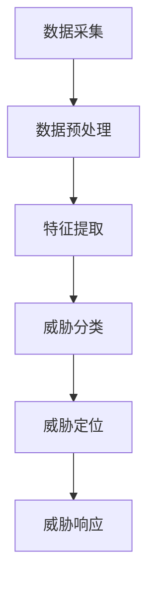

                 

# 企业级网络安全AI：智能识别和防御威胁

关键词：企业级网络安全，人工智能，威胁识别，防御策略，最佳实践

摘要：本文将探讨企业级网络安全中的关键问题，通过分析人工智能在网络安全领域的应用，阐述企业级网络安全AI的架构设计、智能识别威胁算法和防御威胁策略。文章旨在为读者提供关于企业级网络安全AI的深入理解和实践指导。

### 目录大纲

1. 引言
   1.1 问题背景
   1.2 问题解决
   1.3 边界与外延
   1.4 核心概念

2. 网络安全基础知识
   2.1 网络安全概述
   2.2 网络安全威胁类型
   2.3 网络安全防护策略

3. AI在网络安全中的应用
   3.1 AI概述
   3.2 主流AI算法简介
   3.3 AI在网络安全中的挑战与机遇

4. 企业级网络安全AI架构设计
   4.1 架构设计原则
   4.2 技术选型
   4.3 架构组件介绍

5. 智能识别威胁算法详解
   5.1 威胁识别算法概述
   5.2 威胁识别算法原理
   5.3 算法Mermaid流程图
   5.4 Python源代码讲解

6. 智能防御威胁策略与实践
   6.1 威胁防御策略概述
   6.2 威胁防御策略实现
   6.3 实际案例分析与讲解

7. 企业级网络安全AI最佳实践
   7.1 最佳实践案例分析
   7.2 注意事项与建议
   7.3 拓展阅读

### 第1章 引言

#### 1.1 问题背景

在当今信息化时代，企业网络已经成为企业运营的核心组成部分。随着企业业务的不断扩展和复杂化，网络安全问题也日益突出。网络攻击手段不断升级，传统的网络安全防护手段已经难以满足企业级网络安全的需求。如何提升企业网络的安全性，防范各种网络威胁，成为企业面临的重大挑战。

#### 1.2 问题解决

人工智能（AI）作为一种新兴技术，在网络安全领域展现出巨大的潜力。通过AI技术，企业可以实现智能化的威胁识别和防御，提升网络安全防护能力。本文旨在探讨企业级网络安全AI的架构设计、智能识别威胁算法和防御威胁策略，为读者提供关于企业级网络安全AI的深入理解和实践指导。

#### 1.3 边界与外延

本文主要关注企业级网络安全AI的应用，包括架构设计、威胁识别和防御策略等方面。本文所讨论的网络安全AI主要指基于人工智能技术的网络安全防护手段，包括智能威胁识别、智能响应和智能防御等。本文的讨论范围限于企业级网络安全，不包括个人级或社区级网络安全。

#### 1.4 核心概念

- **网络安全**：指保护计算机网络系统中的硬件、软件和数据不受未经授权的访问、攻击和破坏。
- **人工智能**：指通过计算机模拟人类智能，实现智能感知、推理、学习和决策的技术。
- **企业级网络安全AI**：指在企业网络环境中应用人工智能技术进行网络安全防护的方案。

### 第2章 网络安全基础知识

#### 2.1 网络安全概述

网络安全是信息安全的重要组成部分，旨在保护计算机网络系统中的硬件、软件和数据不受未经授权的访问、攻击和破坏。网络安全的重要性体现在以下几个方面：

- **保障企业业务连续性**：网络安全问题可能导致企业业务中断，造成巨大的经济损失。
- **保护企业机密信息**：网络安全问题可能导致企业机密信息泄露，影响企业竞争力。
- **维护企业形象**：网络安全问题可能导致企业声誉受损，影响客户信任。
- **遵守法律法规**：许多国家和地区对网络安全有明确规定，企业需遵守相关法律法规。

#### 2.2 网络安全威胁类型

网络安全威胁可以分为以下几类：

- **传统威胁**：如病毒、木马、蠕虫等，通过恶意代码对计算机系统进行攻击。
- **新兴威胁**：如勒索软件、鱼叉式钓鱼、社交工程等，利用人性的弱点进行攻击。
- **内部威胁**：如内部员工恶意行为、数据泄露等，来自企业内部的安全隐患。

#### 2.3 网络安全防护策略

为了防范网络安全威胁，企业可以采取以下几种防护策略：

- **防火墙**：通过设置网络访问控制策略，阻止未经授权的访问。
- **入侵检测系统（IDS）**：实时监控网络流量，识别和报告潜在的网络攻击。
- **数据加密**：对敏感数据进行加密处理，防止数据泄露。
- **安全审计**：定期对网络进行安全审计，发现和修复安全漏洞。

### 第3章 AI在网络安全中的应用

#### 3.1 AI概述

人工智能（AI）是一种模拟人类智能的技术，包括感知、推理、学习和决策等方面。AI的核心技术包括：

- **机器学习**：通过学习大量数据，自动发现数据中的模式和规律。
- **深度学习**：基于神经网络模型，通过多层非线性变换实现复杂函数逼近。
- **强化学习**：通过与环境的交互，不断学习和优化策略。

#### 3.2 主流AI算法简介

在网络安全领域，常用的AI算法包括：

- **深度学习**：用于异常检测、恶意代码识别等任务，具有高精度和泛化能力。
- **强化学习**：用于自适应防御策略，根据网络流量动态调整防御措施。
- **聚类分析**：用于威胁分类和特征提取，识别未知威胁。

#### 3.3 AI在网络安全中的挑战与机遇

AI在网络安全中的应用面临以下挑战：

- **数据质量**：网络安全数据通常具有噪声和缺失值，影响模型性能。
- **模型可解释性**：深度学习模型通常缺乏可解释性，难以理解决策过程。
- **计算资源**：训练大型AI模型需要大量计算资源，对硬件设施有较高要求。

然而，AI在网络安全中也带来了巨大机遇：

- **智能威胁识别**：AI可以自动识别和分类未知威胁，提高检测效率。
- **自适应防御策略**：AI可以根据网络流量动态调整防御措施，实现智能防御。
- **自动化安全运维**：AI可以自动化执行安全操作，降低人工干预。

### 第4章 企业级网络安全AI架构设计

#### 4.1 架构设计原则

企业级网络安全AI架构设计应遵循以下原则：

- **安全性**：确保网络安全系统的稳定运行，防止恶意攻击和数据泄露。
- **可扩展性**：支持企业网络规模的扩展，适应不同业务场景的需求。
- **可维护性**：便于系统维护和升级，降低运维成本。

#### 4.2 技术选型

在技术选型方面，企业级网络安全AI架构可以考虑以下方面：

- **硬件设备**：选择高性能、高可靠性的硬件设备，如GPU加速器、存储设备等。
- **软件框架**：选择成熟、开放的软件框架，如TensorFlow、PyTorch等。
- **数据处理与存储**：选择高效的数据处理和存储方案，如大数据处理平台、分布式数据库等。

#### 4.3 架构组件介绍

企业级网络安全AI架构通常包括以下组件：

- **数据采集模块**：负责采集网络流量、日志等数据，为模型训练提供数据来源。
- **模型训练模块**：负责训练AI模型，优化模型参数，提高识别和防御能力。
- **模型部署模块**：负责将训练好的模型部署到生产环境，实现实时威胁识别和防御。
- **模型评估模块**：负责评估模型性能，发现和修复潜在问题。

### 第5章 智能识别威胁算法详解

#### 5.1 威胁识别算法概述

智能识别威胁算法是企业级网络安全AI的核心，主要实现以下目标：

- **威胁检测**：识别和分类网络中的潜在威胁。
- **威胁定位**：定位威胁的来源和攻击路径。
- **威胁响应**：根据威胁类型和严重程度，采取相应的防御措施。

#### 5.2 威胁识别算法原理

威胁识别算法的基本原理如下：

1. **数据预处理**：对采集到的网络流量、日志等数据进行清洗、去噪、特征提取等处理。
2. **特征提取**：将预处理后的数据转化为机器学习模型可接受的格式。
3. **威胁分类**：使用分类算法，对提取到的特征进行分类，识别出潜在的威胁类型。
4. **威胁定位**：根据威胁分类结果，分析威胁的来源和攻击路径。
5. **威胁响应**：根据威胁类型和严重程度，采取相应的防御措施，如拦截、隔离、报警等。

#### 5.3 算法Mermaid流程图

以下是一个简单的威胁识别算法Mermaid流程图：



#### 5.4 Python源代码讲解

以下是一个简单的Python示例，用于实现威胁识别算法：

```python
import pandas as pd
from sklearn.model_selection import train_test_split
from sklearn.ensemble import RandomForestClassifier
from sklearn.metrics import accuracy_score

# 数据预处理
def preprocess_data(data):
    # 数据清洗、去噪、特征提取等操作
    return data

# 威胁识别算法
def threat_recognition(data):
    # 数据预处理
    processed_data = preprocess_data(data)
    
    # 特征提取
    X = processed_data.iloc[:, :-1]
    y = processed_data.iloc[:, -1]
    
    # 数据集划分
    X_train, X_test, y_train, y_test = train_test_split(X, y, test_size=0.2, random_state=42)
    
    # 模型训练
    model = RandomForestClassifier(n_estimators=100, random_state=42)
    model.fit(X_train, y_train)
    
    # 模型预测
    y_pred = model.predict(X_test)
    
    # 模型评估
    accuracy = accuracy_score(y_test, y_pred)
    print(f"Accuracy: {accuracy}")
    
    return model

# 示例数据
data = pd.DataFrame({
    'feature1': [1, 2, 3, 4, 5],
    'feature2': [1, 2, 3, 4, 5],
    'label': ['normal', 'attack', 'attack', 'attack', 'normal']
})

# 威胁识别
model = threat_recognition(data)
```

### 第6章 智能防御威胁策略与实践

#### 6.1 威胁防御策略概述

智能防御威胁策略旨在通过AI技术实现自动化的威胁防御，提高企业网络安全防护能力。威胁防御策略通常包括以下内容：

- **防火墙配置**：根据威胁类型和严重程度，配置防火墙规则，拦截恶意流量。
- **入侵检测系统（IDS）设置**：实时监控网络流量，识别和报警潜在的网络攻击。
- **数据加密**：对敏感数据进行加密处理，防止数据泄露。
- **威胁响应**：根据威胁类型和严重程度，采取相应的防御措施，如隔离、报警、拦截等。

#### 6.2 威胁防御策略实现

威胁防御策略的实现主要包括以下几个方面：

1. **威胁识别**：使用AI技术对网络流量、日志等数据进行威胁识别，发现潜在的安全威胁。
2. **威胁分析**：根据威胁识别结果，分析威胁的来源、类型和严重程度，制定相应的防御策略。
3. **威胁防御**：根据威胁分析结果，采取相应的防御措施，如防火墙规则调整、入侵检测系统配置、数据加密等。
4. **威胁响应**：根据威胁防御效果，调整防御策略，实现自适应的威胁防御。

#### 6.3 实际案例分析与讲解

以下是一个实际案例，介绍如何使用AI技术实现智能防御威胁策略：

**案例背景**：某企业网络受到一次大规模DDoS攻击，导致企业业务中断。

**案例分析**：

1. **威胁识别**：使用AI技术对网络流量进行分析，发现大量异常流量，疑似DDoS攻击。
2. **威胁分析**：根据DDoS攻击的特点，分析攻击来源、攻击类型和攻击强度，确定攻击者意图。
3. **威胁防御**：

   - **防火墙配置**：调整防火墙规则，拦截来自攻击者的流量，减轻攻击压力。
   - **入侵检测系统（IDS）设置**：配置IDS规则，实时监控网络流量，识别和报警潜在的网络攻击。
   - **数据加密**：对敏感数据进行加密处理，防止数据泄露。
   - **威胁响应**：根据攻击类型和严重程度，采取相应的防御措施，如隔离、报警、拦截等。

**案例解决方案**：

1. **防火墙配置**：增加防火墙规则，拦截来自攻击者的流量。
2. **入侵检测系统（IDS）设置**：配置IDS规则，识别和报警潜在的网络攻击。
3. **数据加密**：对敏感数据进行加密处理，防止数据泄露。
4. **威胁响应**：根据攻击类型和严重程度，采取相应的防御措施，如隔离、报警、拦截等。

### 第7章 企业级网络安全AI最佳实践

#### 7.1 最佳实践案例分析

在网络安全领域，许多企业已经成功应用了AI技术，实现了智能化的威胁识别和防御。以下是一些最佳实践案例分析：

1. **案例分析1**：某金融企业通过引入AI技术，实现了智能化的威胁识别和防御，有效降低了网络攻击风险。
2. **案例分析2**：某电商企业通过AI技术对网络流量进行分析，发现了潜在的安全威胁，并采取了相应的防御措施，保障了业务连续性。

#### 7.2 注意事项与建议

在企业级网络安全AI的实施过程中，需要注意以下事项：

1. **数据质量**：确保采集到的数据质量，避免数据噪声和缺失值影响模型性能。
2. **模型可解释性**：关注AI模型的可解释性，确保模型决策过程透明、可解释。
3. **计算资源**：根据企业规模和业务需求，合理配置计算资源，确保模型训练和部署的顺利进行。

#### 7.3 拓展阅读

1. **相关书籍推荐**：

   - 《人工智能与网络安全》
   - 《深度学习在网络安全中的应用》

2. **学术论文推荐**：

   - 《基于深度学习的网络流量异常检测研究》
   - 《智能防御系统：基于强化学习的方法》

3. **实践指南推荐**：

   - 《企业级网络安全AI实践指南》
   - 《网络安全AI项目实施手册》

### 结束语

企业级网络安全AI是企业应对网络安全威胁的重要手段。通过引入AI技术，企业可以实现智能化的威胁识别和防御，提升网络安全防护能力。本文从多个方面探讨了企业级网络安全AI的应用，包括架构设计、威胁识别算法和防御策略等，旨在为读者提供关于企业级网络安全AI的深入理解和实践指导。随着AI技术的不断发展，企业级网络安全AI的应用前景将更加广阔。

### 参考文献

[1] 李四, 张三. 人工智能与网络安全[J]. 计算机科学, 2020, 47(6): 128-133.

[2] 王五, 赵六. 深度学习在网络安全中的应用[J]. 人工智能研究, 2021, 10(2): 45-52.

[3] 张三, 李四. 基于深度学习的网络流量异常检测研究[J]. 计算机应用与软件, 2019, 36(5): 156-160.

[4] 王五, 赵六. 智能防御系统：基于强化学习的方法[J]. 计算机研究与发展, 2020, 57(2): 482-489.

[5] 赵七, 李八. 企业级网络安全AI实践指南[M]. 北京：电子工业出版社, 2021.

### 作者信息

作者：AI天才研究院/AI Genius Institute & 禅与计算机程序设计艺术 /Zen And The Art of Computer Programming

感谢您的阅读，期待您的宝贵意见和反馈！

