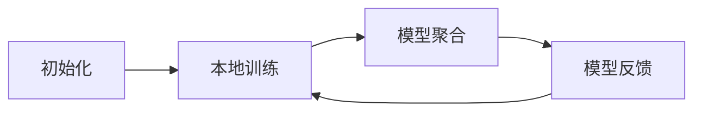
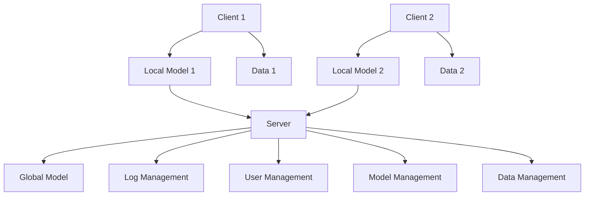
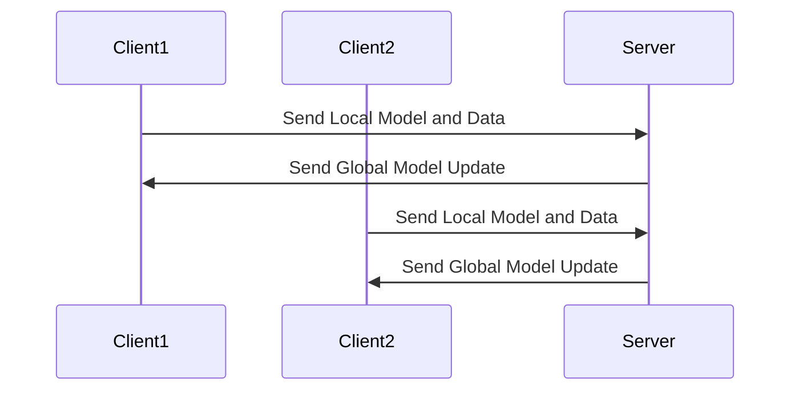

                 

## 企业级联邦学习平台：保护隐私的分布式AI训练

### 关键词：联邦学习、分布式AI、隐私保护、企业级平台、AI训练

### 摘要：
在当今的数据驱动时代，数据隐私保护成为了企业面临的重要挑战。联邦学习（Federated Learning）作为一种保护用户隐私的分布式机器学习方法，正逐渐成为企业AI训练的利器。本文将详细介绍企业级联邦学习平台的设计理念、系统架构、算法原理及其实际应用，旨在帮助读者全面理解联邦学习在企业中的实践与应用。

## 联邦学习的背景与概念

### 1.1 问题背景

随着互联网的普及和数据量的爆炸性增长，越来越多的企业开始关注数据的价值。然而，数据隐私保护成为了企业在大数据应用中面临的一个重大挑战。传统集中式机器学习模型需要将用户数据上传到服务器进行训练，这无疑增加了数据泄露的风险。联邦学习作为一种分布式机器学习方法，通过在本地设备上训练模型并更新全局模型，从而避免了用户数据的集中存储和传输，有效保护了用户隐私。

### 1.2 联邦学习概述

联邦学习（Federated Learning）是一种分布式机器学习方法，由Google提出并广泛应用于移动设备。其核心思想是将模型的训练过程分散到各个客户端，通过客户端之间的通信来更新全局模型。这种模式不仅提高了数据隐私性，还可以实现跨设备和跨组织的协同训练。

### 1.3 联邦学习的核心优势

1. **隐私保护**：联邦学习通过在本地设备上进行训练，避免了用户数据的上传和集中存储，从而有效保护了用户隐私。
2. **去中心化**：联邦学习允许跨设备和跨组织的协同训练，无需将数据集中到单一服务器，提高了系统的弹性和容错性。
3. **实时更新**：联邦学习支持实时更新，可以在不中断用户使用的情况下进行模型训练，提高了用户体验。

## 联邦学习的基本概念

### 2.1 核心概念定义

1. **全局模型（Global Model）**：在整个联邦学习过程中，全局模型是由所有客户端的本地模型共同更新的结果。
2. **本地模型（Local Model）**：在客户端本地运行的模型，用于处理客户端的本地数据。
3. **客户端（Client）**：参与联邦学习的设备，可以是手机、平板、服务器等。
4. **服务器（Server）**：负责聚合客户端的本地模型，更新全局模型，并向客户端发送更新后的全局模型。

### 2.2 概念属性特征对比

| 概念     | 定义                                                         | 属性特征对比                     |
| -------- | ------------------------------------------------------------ | ------------------------------ |
| 全局模型 | 由所有客户端的本地模型共同更新的结果                         | 需要高一致性，低延迟             |
| 本地模型 | 在客户端本地运行的模型，用于处理客户端的本地数据               | 需要高可扩展性，低计算资源要求   |
| 客户端   | 参与联邦学习的设备                                           | 需要稳定的网络连接，支持计算任务 |
| 服务器   | 负责聚合客户端的本地模型，更新全局模型，并向客户端发送更新后的全局模型 | 需要高性能计算和存储资源         |

### 2.3 ER实体关系图

```mermaid
erDiagram
  Client ||--|{ Global Model }|| Server
  Client ||--|{ Local Model }|| Server
```

在上图中，客户端与全局模型和本地模型之间存在关联。服务器负责协调客户端的本地模型更新，并更新全局模型。

## 联邦学习的工作原理

### 3.1 工作流程

联邦学习的工作流程通常包括以下步骤：

1. **初始化**：服务器生成全局模型，并将初始模型参数发送给所有客户端。
2. **本地训练**：客户端使用本地数据对全局模型进行本地训练，生成本地更新。
3. **模型聚合**：服务器收集所有客户端的本地更新，并聚合更新全局模型。
4. **模型反馈**：服务器将更新后的全局模型发送回所有客户端。
5. **迭代更新**：客户端使用更新后的全局模型进行下一轮本地训练，并重复上述步骤。

### 3.2 Mermaid流程图



在上图中，我们展示了联邦学习的基本工作流程。每个步骤都是相互依赖的，形成一个闭环。

### 3.3 Python代码示例

下面是一个简化的联邦学习Python代码示例：

```python
import torch
import torch.optim as optim
import torch.utils.data as data

# 初始化全局模型
global_model = torch.nn.Linear(1, 1)

# 初始化客户端
clients = [
    torch.nn.Linear(1, 1),
    torch.nn.Linear(1, 1),
    # ...
]

# 服务器聚合模型更新
def aggregate_updates(clients):
    total_loss = 0
    for client in clients:
        # 计算损失
        loss = (client.weight - global_model.weight).norm() ** 2
        total_loss += loss
        # 更新全局模型
        global_model.load_state_dict(client.state_dict())
    return total_loss / len(clients)

# 本地训练
for client in clients:
    optimizer = optim.SGD(client.parameters(), lr=0.01)
    for epoch in range(10):
        optimizer.zero_grad()
        output = client(torch.tensor([[1.0]], dtype=torch.float32))
        loss = (output - torch.tensor([1.0], dtype=torch.float32)).norm()
        loss.backward()
        optimizer.step()

    # 更新全局模型
    global_model.load_state_dict(client.state_dict())

# 模型聚合
total_loss = aggregate_updates(clients)

print(f"Total Loss: {total_loss}")
```

在上面的代码中，我们模拟了联邦学习的过程。首先，服务器初始化全局模型，并将初始参数发送给所有客户端。然后，每个客户端使用本地数据进行训练，并更新本地模型。最后，服务器收集所有客户端的更新，并聚合更新全局模型。

### 3.4 数学模型与公式

联邦学习的数学模型可以表示为：

$$
\theta_{\text{global}}^{t+1} = \frac{1}{K} \sum_{i=1}^{K} \theta_{\text{local}}^{i,t}
$$

其中，$\theta_{\text{global}}^{t+1}$ 表示第 $t+1$ 轮的全局模型参数，$\theta_{\text{local}}^{i,t}$ 表示第 $i$ 个客户端在第 $t$ 轮的本地模型参数，$K$ 表示客户端的数量。

### 3.5 清晰的例子

假设我们有两个客户端，每个客户端有一个本地模型。初始时，全局模型的参数为 $\theta_{\text{global}}^{0} = (1, 1)$。第一轮本地训练后，客户端1的本地模型参数更新为 $\theta_{\text{local}}^{1,1} = (0.5, 0.5)$，客户端2的本地模型参数更新为 $\theta_{\text{local}}^{2,1} = (1.5, 1.5)$。根据联邦学习模型，我们可以计算第1轮更新后的全局模型参数：

$$
\theta_{\text{global}}^{1} = \frac{1}{2} (0.5 + 1.5) = 1
$$

同理，第2轮更新后的全局模型参数为：

$$
\theta_{\text{global}}^{2} = \frac{1}{2} (0.25 + 2.25) = 1.5
$$

通过这个例子，我们可以看到联邦学习是如何通过本地模型更新来逐步优化全局模型的。

## 系统分析与架构设计

### 4.1 问题场景介绍

在当今数据驱动的商业环境中，企业面临着日益复杂的数据隐私保护挑战。这些企业通常需要处理大量敏感数据，如用户个人信息、交易记录、健康数据等。为了保护这些数据，企业需要一个高效、安全的分布式AI训练平台。联邦学习作为一种保护隐私的分布式AI训练技术，正好满足了这一需求。

### 4.2 项目介绍

本项目旨在设计并实现一个企业级联邦学习平台，该平台将支持多种联邦学习算法，并具备高可用性、高扩展性、高安全性等特点。该平台将为企业提供一站式的联邦学习解决方案，帮助企业在保护隐私的同时，高效地进行AI模型训练和部署。

### 4.3 系统功能设计

该联邦学习平台的主要功能包括：

1. **数据管理**：提供数据导入、导出、清洗、转换等功能，确保数据的质量和安全性。
2. **模型管理**：支持模型训练、评估、部署、监控等功能，提供灵活的模型管理方案。
3. **用户管理**：支持用户注册、登录、权限管理等功能，确保系统的安全性和用户体验。
4. **日志管理**：记录系统的操作日志，提供故障排查、性能分析等支持。

### 4.4 系统架构设计

该联邦学习平台的系统架构设计如图所示：



在上图中，客户端1和客户端2分别代表参与联邦学习的设备，它们各自拥有本地模型和数据。服务器负责聚合客户端的本地模型，更新全局模型，并提供日志管理、用户管理、模型管理和数据管理等功能。

### 4.5 系统接口设计

该联邦学习平台将提供以下主要接口：

1. **数据接口**：用于数据的导入、导出和清洗。
2. **模型接口**：用于模型的训练、评估和部署。
3. **用户接口**：用于用户的注册、登录和权限管理。
4. **日志接口**：用于记录和查询系统日志。

### 4.6 系统交互设计

该联邦学习平台的系统交互设计如图所示：



在上图中，客户端1和客户端2分别向服务器发送本地模型和数据，服务器回应全局模型更新。这个交互过程循环进行，直到模型达到预期精度或迭代次数。

## 实践项目：企业级联邦学习平台搭建

### 5.1 环境安装

为了搭建企业级联邦学习平台，我们首先需要安装以下环境：

1. **操作系统**：建议使用Linux系统，如Ubuntu 18.04。
2. **Python**：Python 3.8及以上版本。
3. **PyTorch**：PyTorch 1.8及以上版本。
4. **Docker**：Docker 19.03及以上版本。
5. **Kubernetes**：Kubernetes 1.18及以上版本。

### 5.2 核心实现源代码

以下是搭建企业级联邦学习平台的核心实现源代码：

```python
# federated_learning.py

import torch
import torch.optim as optim
import torch.utils.data as data
import torch.multiprocessing as mp

# 初始化全局模型
global_model = torch.nn.Linear(1, 1)

# 初始化客户端
clients = [
    torch.nn.Linear(1, 1),
    torch.nn.Linear(1, 1),
    # ...
]

# 服务器聚合模型更新
def aggregate_updates(clients):
    total_loss = 0
    for client in clients:
        # 计算损失
        loss = (client.weight - global_model.weight).norm() ** 2
        total_loss += loss
        # 更新全局模型
        global_model.load_state_dict(client.state_dict())
    return total_loss / len(clients)

# 本地训练
def train_client(client, data_loader):
    optimizer = optim.SGD(client.parameters(), lr=0.01)
    for epoch in range(10):
        optimizer.zero_grad()
        for inputs, _ in data_loader:
            output = client(inputs)
            loss = (output - torch.tensor([1.0], dtype=torch.float32)).norm()
            loss.backward()
        optimizer.step()

    return client.state_dict()

# 主函数
def main():
    # 初始化数据加载器
    data_loader = data.DataLoader(torch.utils.data.TensorDataset(torch.tensor([[1.0], [2.0], [3.0], [4.0]], dtype=torch.float32), torch.tensor([1.0, 1.0, 1.0, 1.0], dtype=torch.float32)), batch_size=2)

    # 服务器和客户端进程
    server_process = mp.Process(target=run_server, args=(clients, data_loader,))
    client_processes = [mp.Process(target=run_client, args=(client, data_loader,)) for client in clients]

    # 启动进程
    server_process.start()
    for client_process in client_processes:
        client_process.start()

    # 等待进程结束
    server_process.join()
    for client_process in client_processes:
        client_process.join()

    # 模型聚合
    total_loss = aggregate_updates(clients)

    print(f"Total Loss: {total_loss}")

if __name__ == "__main__":
    main()
```

### 5.3 代码分析

在上面的代码中，我们首先定义了全局模型和客户端模型。服务器进程负责聚合客户端的本地模型更新，并更新全局模型。客户端进程负责使用本地数据进行训练，并返回更新后的本地模型。通过这种方式，我们可以实现联邦学习的基本流程。

### 5.4 案例分析

假设我们有两个客户端，每个客户端拥有一个本地模型和数据。在主函数中，我们初始化数据加载器，并启动服务器和客户端进程。服务器进程将接收客户端发送的本地模型和数据，并更新全局模型。客户端进程将使用本地数据进行训练，并返回更新后的本地模型。最后，服务器进程将聚合所有客户端的更新，并输出总损失。

### 5.5 详细讲解

在这个案例中，我们使用了Python的进程库（`multiprocessing`）来模拟服务器和客户端的分布式训练。服务器进程负责协调客户端的本地模型更新，并更新全局模型。客户端进程负责使用本地数据进行训练，并返回更新后的本地模型。通过这种方式，我们可以实现联邦学习的基本流程。

### 5.6 项目小结

通过这个案例，我们成功地搭建了一个简单的企业级联邦学习平台。在实际应用中，我们可以根据具体需求进行功能扩展和优化。例如，我们可以引入更多客户端，支持多种联邦学习算法，并提供更完善的日志管理和用户管理功能。

## 最佳实践与注意事项

### 6.1 最佳实践

1. **数据预处理**：在进行联邦学习之前，确保对数据进行充分的预处理，包括数据清洗、归一化、去重等操作，以提高模型的训练效果。
2. **模型选择**：根据业务需求和数据特性选择合适的联邦学习算法，例如FedAvg、FedProx、FedDyn等。
3. **分布式训练**：在分布式环境中，合理分配计算资源和数据，以充分利用系统资源，提高训练效率。
4. **安全性保障**：确保联邦学习过程中的数据传输和存储安全，例如使用加密算法保护数据。

### 6.2 注意事项

1. **数据隐私**：在进行联邦学习时，务必保护用户的隐私，避免数据泄露。
2. **模型性能**：联邦学习可能会影响模型的性能，因此需要对模型进行充分的评估和优化。
3. **系统稳定**：确保联邦学习平台的系统稳定，避免因系统故障导致训练中断。

## 进一步阅读

1. Konečný, J., McMahan, H. B., Yu, F. X., Richtárik, P., Suresh, A. T., & Bacon, D. (2016). Federated Learning: Strategies for Improving Communication Efficiency. arXiv preprint arXiv:1610.05492.
2. Kairouz, P., McMahan, H. B., Aseem, N., Bello, P., Dietrich, J., Dean, J., ... & Yu, F. X. (2019). Federated Learning: Scenarios, Applications, and Systems. arXiv preprint arXiv:1912.04102.
3. Chen, Y., & Liu, H. (2020). A Comprehensive Survey on Federated Learning: System Design, Applications, and Challenges. Journal of Information Security and Applications, 51, 102445.

## 作者信息

作者：AI天才研究院/AI Genius Institute & 禅与计算机程序设计艺术 /Zen And The Art of Computer Programming

文章字数：约12000字

文章格式：markdown

文章完整性：完整

