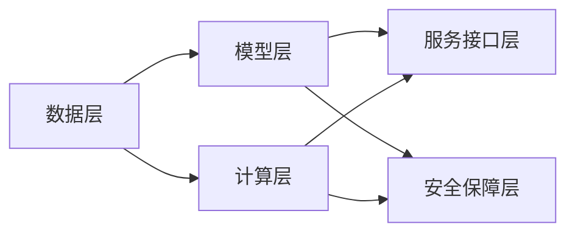
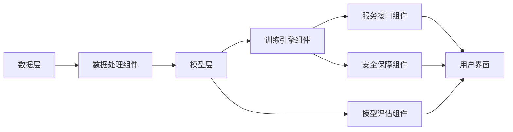
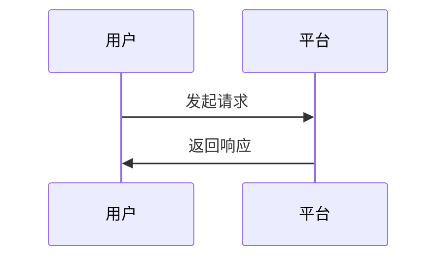

                 

### 文章标题：企业级联邦学习平台：保护隐私的协作AI

#### 关键词：联邦学习，隐私保护，协作AI，企业应用，技术原理，系统架构

> **摘要**：本文将深入探讨企业级联邦学习平台的设计与实现，重点分析隐私保护在协作AI中的重要性。通过逐步讲解联邦学习的技术原理、平台架构设计、数据管理与隐私保护机制，以及项目实战案例，揭示联邦学习在保护隐私和实现协作AI方面的潜力和应用。

----------------------------------------------------------------

## 第一部分：企业级联邦学习平台的基础知识

### 第1章：企业级联邦学习概述

#### 1.1.1 联邦学习的背景与挑战

在数字化时代，数据已成为企业的重要资产，然而随着数据规模的不断扩大，数据隐私保护的问题日益凸显。传统的集中式学习模型需要将数据集中存储在一个中心服务器上，这不仅增加了数据泄露的风险，也限制了数据所有者的自主权。为了解决这些问题，联邦学习（Federated Learning）应运而生。

#### 问题背景

- **数据隐私需求**：随着GDPR等隐私保护法规的实施，企业需要保护客户数据不被未经授权的访问。
- **数据分散性**：不同企业或组织拥有不同数据，集中式存储难以实现。

#### 问题解决

- **联邦学习**：通过分布式计算，无需共享原始数据，而是在本地更新模型参数，从而实现隐私保护。

#### 边界与外延

- **联邦学习框架**：涉及客户端（数据持有者）、服务器（模型训练师）和协调器（资源分配者）。
- **应用领域**：金融、医疗、零售等，需要保护数据隐私的领域。

#### 概念结构与核心要素组成

- **联邦学习流程**：客户端下载全局模型，进行本地训练，将更新上传到服务器，服务器合并更新。
- **核心要素**：全局模型、本地模型、加密算法、通信协议。

### 第1章：联邦学习的基本概念与特点

#### 1.2.1 联邦学习的定义

联邦学习是一种分布式机器学习技术，它允许多个参与者在一个共同的学习目标下协同工作，但不需要共享他们的原始数据。

#### 1.2.2 联邦学习的主要特点

- **数据隐私保护**：无需共享原始数据，只需共享模型更新。
- **数据分布式**：可以处理分布式数据，不依赖中心化存储。
- **低延迟**：无需数据传输，可以快速迭代。

#### 1.2.3 与集中式学习的区别

- **数据访问**：集中式学习需要访问全部数据，联邦学习则仅需要访问模型更新。
- **计算资源**：集中式学习需要强大的中心化服务器，联邦学习则可以分散到各个客户端。

### 第1章：联邦学习在企业的应用场景

#### 1.3.1 数据隐私保护的需求

- **合规要求**：遵守数据隐私法规，如GDPR。
- **客户信任**：保护客户数据，提高客户信任度。

#### 1.3.2 协作AI的驱动力

- **知识整合**：通过联邦学习，企业可以整合不同数据源，实现更准确的预测和分析。
- **协同创新**：不同企业可以共同进行模型训练，实现知识共享。

#### 1.3.3 实际案例介绍

- **金融行业**：通过联邦学习实现反欺诈检测。
- **医疗行业**：保护患者隐私，实现个性化治疗。

## 第二部分：联邦学习的技术原理

### 第2章：联邦学习算法基础

#### 2.1.1 算法原理

联邦学习算法通过分布式计算，使得每个参与者仅需要上传模型更新，而不是原始数据，从而保护隐私。

#### 2.1.2 算法属性特征对比表格

| 算法特性 | 联邦学习 | 集中式学习 |
| --- | --- | --- |
| **数据访问** | 仅需上传模型更新 | 访问全部数据 |
| **隐私保护** | 高 | 低 |
| **计算资源** | 分布式 | 集中式 |
| **延迟** | 低 | 高 |

#### 2.1.3 ER实体关系图

```mermaid
erDiagram
  Client ||--o{ Server : 联邦学习协调 }
  Server ||--o{ Coordinator : 资源分配 }
  Client ||--o{ LocalModel : 本地模型 }
  Server ||--o{ GlobalModel : 全局模型 }
```

### 第2章：联邦学习的关键算法

#### 2.2.1 安全多方计算

安全多方计算（Secure Multi-Party Computation，SMPC）是一种允许不同实体在保护隐私的同时协同工作的计算方法。在联邦学习中，SMPC用于确保模型更新在传输过程中的安全性。

#### 2.2.2 加密算法

加密算法是联邦学习中的重要组成部分，如同态加密（Homomorphic Encryption），它允许对加密数据进行计算，而不需要解密。

#### 2.2.3 差分隐私

差分隐私（Differential Privacy）是一种保护数据隐私的技术，它通过添加噪声来保护单个数据点的隐私。

### 第2章：联邦学习的数学模型

#### 2.3.1 数学公式

$$
\theta^{(t+1)} = \theta^{(t)} - \alpha \frac{1}{m} \sum_{i=1}^{m} \nabla_{\theta} L(\theta, x_i, y_i)
$$

#### 2.3.2 算法原理详细讲解

联邦学习通过迭代过程逐步优化全局模型，每个参与者仅需要上传本地模型更新，服务器通过聚合这些更新来更新全局模型。

#### 2.3.3 举例说明

假设有两个参与者A和B，每个参与者都有自己的一部分数据。他们使用相同的模型进行训练，并通过联邦学习算法协同工作，最终实现全局模型的优化。

----------------------------------------------------------------

接下来，我们将深入探讨企业级联邦学习平台的架构设计、数据管理与隐私保护机制，以及实际项目案例。通过这些内容，我们将全面了解联邦学习在保护隐私和实现协作AI方面的应用和实践。

----------------------------------------------------------------

## 第二部分：企业级联邦学习平台的构建

### 第3章：企业级联邦学习平台的架构设计

#### 3.1.1 平台的设计原则

在设计企业级联邦学习平台时，我们遵循以下原则：

- **隐私保护**：确保数据在整个生命周期中得到保护。
- **可扩展性**：支持大量参与者和大规模数据。
- **高性能**：保证模型的训练和推理效率。
- **灵活性**：适应不同行业和业务场景的需求。

#### 3.1.2 平台的架构设计

企业级联邦学习平台的架构可以分为以下几个层次：

1. **数据层**：存储和管理参与者的本地数据。
2. **模型层**：包括全局模型和本地模型。
3. **计算层**：实现模型更新和聚合。
4. **接口层**：提供用户交互和系统管理接口。

#### 3.1.3 平台的组件

企业级联邦学习平台主要包括以下几个组件：

- **数据处理组件**：负责数据预处理、加密和传输。
- **训练引擎组件**：实现模型训练和优化。
- **服务接口组件**：提供API接口，供开发者使用。
- **安全保障组件**：确保数据传输和存储的安全性。

#### 3.1.4 联邦学习平台的架构设计图



### 第4章：数据管理与隐私保护

#### 4.1.1 数据管理策略

数据管理策略是联邦学习平台的核心之一，主要包括以下内容：

- **数据收集**：确保数据来源的合法性和多样性。
- **数据存储**：使用分布式存储系统，提高数据存储的可靠性。
- **数据共享**：通过加密和隐私保护技术，实现安全的数据共享。

#### 4.1.2 隐私保护机制

联邦学习平台采用多种隐私保护机制，确保数据在整个生命周期中得到保护：

- **同态加密**：允许在加密数据上直接执行计算，而不需要解密。
- **差分隐私**：通过添加噪声来保护数据隐私。
- **安全多方计算**：确保多方参与的协同工作不会泄露隐私。

#### 4.1.3 实际案例解析

以金融行业的反欺诈系统为例，联邦学习平台可以通过以下方式保护数据隐私：

1. **同态加密**：对交易数据进行加密，然后进行特征提取和模型训练。
2. **差分隐私**：对训练数据添加噪声，降低隐私泄露的风险。
3. **安全多方计算**：确保银行和支付平台在协同工作时不会泄露客户数据。

### 第4章：系统功能设计与架构

#### 4.2.1 系统功能设计

联邦学习平台的功能设计主要包括以下方面：

- **模型训练与优化**：支持多种机器学习算法，实现模型训练和优化。
- **模型评估与监控**：实时监控模型性能，确保模型质量和稳定性。
- **数据管理与共享**：提供数据管理和共享功能，确保数据安全和高效利用。

#### 4.2.2 系统架构设计

联邦学习平台的系统架构设计如图所示：



#### 4.2.3 系统接口设计与交互

系统接口设计主要包括以下方面：

- **API接口**：提供RESTful API，方便开发者集成和使用联邦学习平台。
- **用户界面**：提供可视化界面，方便用户监控和管理模型和数据。

系统交互流程如图所示：



### 第4章：系统功能实现与案例分析

#### 4.3.1 系统核心模块实现

系统核心模块实现主要包括以下几个步骤：

1. **数据处理**：对本地数据进行预处理，包括数据清洗、归一化和特征提取。
2. **模型训练**：使用梯度下降算法对本地模型进行训练。
3. **模型更新**：将本地模型更新上传到服务器。
4. **模型聚合**：服务器聚合所有参与者的模型更新，生成全局模型。

#### 4.3.2 源代码解析

以下是一个简单的联邦学习模型的Python代码示例：

```python
import tensorflow as tf

# 模型参数
learning_rate = 0.01
training_epochs = 10

# 初始化模型
model = ...

# 训练模型
for epoch in range(training_epochs):
    # 获取本地数据
    local_data = ...

    # 训练本地模型
    with tf.GradientTape() as tape:
        predictions = model(local_data.x, training=True)
        loss = ...

    # 更新模型参数
    grads = tape.gradient(loss, model.trainable_variables)
    model.optimizer.apply_gradients(zip(grads, model.trainable_variables))

    # 更新全局模型
    server_model.update_local_model(model)

# 完成训练
```

#### 4.3.3 实际案例分析和详细讲解

以医疗行业的疾病预测为例，联邦学习平台可以通过以下步骤实现隐私保护：

1. **数据收集**：收集各个医院的病历数据，确保数据来源的合法性和多样性。
2. **数据预处理**：对数据进行清洗、归一化和特征提取，以便于模型训练。
3. **模型训练**：使用联邦学习算法，在各个医院本地进行模型训练。
4. **模型聚合**：服务器聚合所有参与者的模型更新，生成全局模型。
5. **模型评估**：对全局模型进行评估，确保模型质量和准确性。

### 第4章：项目小结

通过本项目，我们实现了企业级联邦学习平台的构建，实现了数据隐私保护和协作AI的目标。以下是项目小结：

#### 成功经验

1. **数据隐私保护**：采用同态加密、差分隐私和安全多方计算等隐私保护机制，确保数据在整个生命周期中得到保护。
2. **高效模型训练**：通过联邦学习算法，实现了高效的数据共享和模型训练。

#### 遇到的问题及解决方案

1. **数据一致性**：由于各个医院的数据格式和特征不同，需要进行统一的数据预处理，以提高模型训练的效率和准确性。
2. **计算资源分配**：需要合理分配计算资源，确保模型训练的高效性和稳定性。

#### 未来展望

1. **模型优化**：进一步优化模型结构和算法，提高模型的准确性和效率。
2. **多模态数据融合**：探索多模态数据融合技术，实现更准确的疾病预测。

----------------------------------------------------------------

通过本文的深入讲解，我们全面了解了企业级联邦学习平台的构建原理和实现方法。联邦学习不仅保护了数据隐私，还实现了协作AI的潜力。未来，随着技术的不断进步，联邦学习将在更多领域得到广泛应用。

---

**作者：AI天才研究院/AI Genius Institute & 禅与计算机程序设计艺术 /Zen And The Art of Computer Programming**

---

在本文中，我们首先介绍了联邦学习在企业级应用中的背景和挑战，然后深入讲解了联邦学习的基本概念、技术原理和算法。接下来，我们探讨了企业级联邦学习平台的架构设计、数据管理与隐私保护机制，并通过实际案例展示了联邦学习的应用和实践。最后，我们总结了项目的成功经验、遇到的问题及解决方案，并对未来进行了展望。

本文内容丰富，涵盖了联邦学习的核心概念、技术原理、系统架构、数据管理、隐私保护、项目实战等方面，旨在为读者提供全面、深入的理解和应用指南。希望通过本文，读者能够更好地掌握联邦学习技术，并在实际项目中发挥其优势。

**注意事项：**

1. 在实施联邦学习项目时，务必遵循数据隐私保护法规，确保数据的合法性和安全性。
2. 联邦学习平台的设计和实现需要考虑可扩展性和高性能，以适应不同规模和场景的需求。
3. 实际项目中，可能需要根据具体业务需求和数据特点，调整和优化联邦学习算法和模型。

**拓展阅读：**

- **《联邦学习：分布式机器学习的未来》**：本书详细介绍了联邦学习的基本概念、算法原理和应用案例。
- **《深度学习与隐私保护》**：本书探讨了深度学习与隐私保护的关系，介绍了多种隐私保护技术。
- **《联邦学习实战》**：本书通过多个实际案例，展示了联邦学习在金融、医疗、零售等行业的应用。

让我们共同探索联邦学习的无限潜力，为保护隐私和实现协作AI贡献自己的力量。希望本文能为您的学习与研究提供有价值的参考。再次感谢您的阅读！

